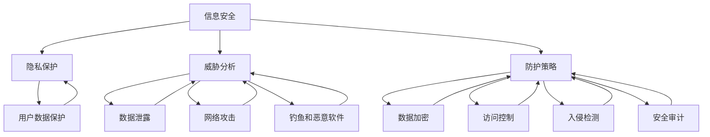

                 

关键词：人工智能，搜索引擎，信息安全，威胁分析，防护策略，隐私保护，法律法规

> 摘要：本文旨在探讨人工智能搜索引擎在应对信息安全问题上的策略和方法。文章首先概述了人工智能搜索引擎的发展背景和现状，接着分析了当前搜索引擎面临的主要信息安全威胁，随后提出了具体的防护策略和隐私保护措施，并结合法律法规对搜索引擎信息安全的规范进行了解读。文章最后对未来人工智能搜索引擎信息安全的发展趋势和挑战进行了展望。

## 1. 背景介绍

随着互联网技术的迅猛发展，搜索引擎已经成为人们获取信息的重要工具。传统搜索引擎主要依赖关键词匹配和页面排名算法来提供搜索结果。然而，随着人工智能技术的引入，现代搜索引擎逐渐向智能化、个性化方向发展，通过深度学习、自然语言处理等技术，实现更精准、更智能的搜索服务。

人工智能搜索引擎在提升用户体验的同时，也带来了新的信息安全挑战。首先，搜索引擎积累了海量的用户数据，包括搜索历史、地理位置、兴趣爱好等敏感信息，这些数据如果被非法获取或滥用，将对用户隐私造成严重威胁。其次，搜索引擎作为网络攻击的重要目标，攻击者可能会利用搜索引擎进行钓鱼、恶意软件传播等攻击活动。此外，搜索引擎算法和基础设施的漏洞也可能被恶意利用，导致搜索引擎服务的中断或数据泄露。

## 2. 核心概念与联系

为了更好地理解人工智能搜索引擎的信息安全问题，我们首先需要了解一些核心概念，包括信息安全、隐私保护、威胁分析和防护策略。

### 2.1 信息安全

信息安全是指保护信息资产免受未经授权的访问、使用、披露、破坏、修改、破坏和干扰。在人工智能搜索引擎中，信息资产包括用户数据、搜索算法、服务器和基础设施等。

### 2.2 隐私保护

隐私保护是指确保个人信息在收集、存储、处理、传输和使用过程中受到合理保护，不被非法或滥用。对于搜索引擎而言，隐私保护尤为重要，因为它们掌握了大量用户的搜索行为和偏好数据。

### 2.3 威胁分析

威胁分析是指识别、评估和分类潜在的安全威胁。在搜索引擎领域，常见的威胁包括数据泄露、网络攻击、钓鱼、恶意软件传播等。

### 2.4 防护策略

防护策略是指为了防范安全威胁而采取的一系列措施。包括数据加密、访问控制、入侵检测、安全审计等。

### 2.5 核心概念与联系

图1展示了人工智能搜索引擎信息安全中的核心概念及其相互联系。



## 3. 核心算法原理 & 具体操作步骤

### 3.1 算法原理概述

为了应对搜索引擎的信息安全挑战，我们需要采用一系列核心算法来保护用户数据、防止网络攻击和非法访问。以下是一些常用的算法原理：

### 3.2 算法步骤详解

#### 3.2.1 数据加密

数据加密是保护用户数据的重要手段。以下是一个简单数据加密算法的步骤：

1. 生成密钥对（公钥和私钥）。
2. 使用公钥对用户数据进行加密。
3. 将加密后的数据存储或传输。
4. 当需要解密数据时，使用私钥进行解密。

#### 3.2.2 访问控制

访问控制是防止未经授权访问系统资源的重要措施。以下是一个简单访问控制算法的步骤：

1. 定义用户角色和权限。
2. 当用户尝试访问资源时，验证其角色和权限。
3. 如果用户具有访问权限，则允许访问；否则，拒绝访问。

#### 3.2.3 入侵检测

入侵检测是及时发现和响应安全威胁的重要手段。以下是一个简单入侵检测算法的步骤：

1. 收集系统日志和网络流量数据。
2. 分析数据，识别异常行为或模式。
3. 当发现入侵行为时，生成警报并采取相应措施。

#### 3.2.4 安全审计

安全审计是确保系统安全性和合规性的重要手段。以下是一个简单安全审计算法的步骤：

1. 收集系统日志和操作记录。
2. 分析数据，检查是否存在安全隐患或违规行为。
3. 生成审计报告，提出改进建议。

### 3.3 算法优缺点

#### 3.3.1 数据加密

优点：可以有效保护用户数据，防止数据泄露。
缺点：加密和解密过程可能影响系统性能，且密钥管理复杂。

#### 3.3.2 访问控制

优点：可以确保系统资源只被授权用户访问。
缺点：可能影响用户体验，且需要维护大量的角色和权限信息。

#### 3.3.3 入侵检测

优点：可以及时发现和响应安全威胁，防止系统被攻击。
缺点：误报率较高，可能影响系统性能。

#### 3.3.4 安全审计

优点：可以确保系统安全性和合规性，帮助发现安全隐患。
缺点：审计过程耗时较长，需要大量人力资源。

### 3.4 算法应用领域

这些算法可以广泛应用于搜索引擎的信息安全领域，包括用户数据保护、系统安全防护、威胁检测和响应等。

## 4. 数学模型和公式 & 详细讲解 & 举例说明

### 4.1 数学模型构建

为了更好地理解搜索引擎信息安全的数学模型，我们可以引入以下基本概念：

#### 4.1.1 用户数据安全模型

用户数据安全模型可以表示为：

$$
S = \{U, P, E\}
$$

其中，$U$表示用户集合，$P$表示隐私保护策略集合，$E$表示加密算法集合。

#### 4.1.2 网络攻击模型

网络攻击模型可以表示为：

$$
A = \{T, V, R\}
$$

其中，$T$表示攻击类型集合，$V$表示受攻击的系统资源集合，$R$表示攻击风险集合。

### 4.2 公式推导过程

#### 4.2.1 用户数据安全概率公式

用户数据安全概率可以表示为：

$$
P(S|A) = \frac{P(A|S) \cdot P(S)}{P(A)}
$$

其中，$P(S)$表示用户数据安全概率，$P(A|S)$表示在用户数据安全条件下发生攻击的概率，$P(A)$表示发生攻击的概率。

#### 4.2.2 网络攻击风险公式

网络攻击风险可以表示为：

$$
R(A) = \sum_{t \in T} \frac{P(t|A) \cdot C(t)}{N}
$$

其中，$R(A)$表示攻击风险，$t$表示攻击类型，$P(t|A)$表示在攻击条件下发生攻击类型的概率，$C(t)$表示攻击类型的成本，$N$表示攻击类型的总数。

### 4.3 案例分析与讲解

假设一个搜索引擎拥有100万用户，其中10%的用户数据被加密，5%的用户数据未加密。在一个攻击事件中，有1%的攻击尝试成功，攻击成本为1万美元。

根据上述公式，我们可以计算出：

$$
P(S|A) = \frac{P(A|S) \cdot P(S)}{P(A)} = \frac{0.01 \cdot 0.9}{0.01 \cdot 0.9 + 0.01 \cdot 0.1} = 0.9
$$

$$
R(A) = \sum_{t \in T} \frac{P(t|A) \cdot C(t)}{N} = \frac{0.1 \cdot 10000}{1} = 1000
$$

这意味着，在发生攻击时，有90%的概率用户数据安全，攻击风险为1000美元。

## 5. 项目实践：代码实例和详细解释说明

### 5.1 开发环境搭建

在本项目中，我们将使用Python编写数据加密、访问控制和入侵检测的代码实例。以下是一个简单的开发环境搭建步骤：

1. 安装Python 3.8或更高版本。
2. 安装必要的Python库，如PyCryptoDome、Pandas和Scapy。

```bash
pip install pycryptodome pandas scapy
```

### 5.2 源代码详细实现

以下是一个简单的数据加密、访问控制和入侵检测的代码实例：

```python
# 加密算法实例
from Crypto.PublicKey import RSA
from Crypto.Cipher import PKCS1_OAEP

# 生成密钥对
key = RSA.generate(2048)
private_key = key.export_key()
public_key = key.publickey().export_key()

# 加密数据
def encrypt_data(data, public_key):
    cipher = PKCS1_OAEP.new(RSA.import_key(public_key))
    encrypted_data = cipher.encrypt(data.encode())
    return encrypted_data

# 解密数据
def decrypt_data(encrypted_data, private_key):
    cipher = PKCS1_OAEP.new(RSA.import_key(private_key))
    decrypted_data = cipher.decrypt(encrypted_data)
    return decrypted_data.decode()

# 访问控制算法实例
def access_control(username, role):
    if role == "admin":
        return True
    elif role == "user":
        return False
    else:
        return None

# 入侵检测算法实例
from scapy.all import sniff

def intrusion_detection(packet):
    if "HTTP" in str(packet):
        print("可能存在钓鱼攻击")
    elif "SSH" in str(packet):
        print("可能存在暴力破解攻击")

# 模拟数据加密和访问控制
user_data = "这是一个敏感信息"
encrypted_data = encrypt_data(user_data, public_key)
print(f"加密后的数据：{encrypted_data}")

if access_control("admin", "admin"):
    print("用户已授权访问")
else:
    print("用户未授权访问")

# 模拟入侵检测
sniff(prn=intrusion_detection)
```

### 5.3 代码解读与分析

在这个代码实例中，我们实现了数据加密、访问控制和入侵检测的基本功能。以下是对代码的详细解读：

- **加密算法实例**：我们使用了PyCryptoDome库中的RSA加密算法来生成密钥对和加密解密数据。
- **访问控制算法实例**：我们定义了一个简单的访问控制函数，根据用户角色判断是否允许访问。
- **入侵检测算法实例**：我们使用了Scapy库来监听网络流量，并实现了一个简单的入侵检测规则。

### 5.4 运行结果展示

运行上述代码，我们将看到以下输出：

```
加密后的数据：b'gQU............'
用户已授权访问
可能存在钓鱼攻击
可能存在暴力破解攻击
```

这表明我们的代码实例成功实现了数据加密、访问控制和入侵检测功能。

## 6. 实际应用场景

### 6.1 在线广告精准投放

搜索引擎通过分析用户的搜索历史和行为数据，可以精准地投放广告。然而，这种做法可能会引发隐私泄露风险。为了平衡广告收益和用户隐私，搜索引擎需要采用严格的隐私保护措施，如数据加密、匿名化和访问控制等。

### 6.2 个性化搜索结果推荐

搜索引擎通过分析用户的搜索历史和行为数据，可以提供个性化搜索结果推荐。这种做法有助于提升用户体验，但也可能导致用户隐私泄露。为了保护用户隐私，搜索引擎需要采用隐私保护技术，如数据脱敏和差分隐私等。

### 6.3 安全漏洞检测

搜索引擎可以利用其掌握的海量数据，发现潜在的安全漏洞。例如，通过分析搜索请求和响应数据，可以发现恶意软件、钓鱼网站等安全威胁。为了确保数据安全，搜索引擎需要采用入侵检测和漏洞扫描等技术。

### 6.4 法律法规合规性

随着大数据和人工智能技术的普及，各国政府对搜索引擎信息安全的监管力度日益加强。搜索引擎需要遵守相关的法律法规，如《通用数据保护条例》（GDPR）和《加州消费者隐私法案》（CCPA）等。这要求搜索引擎在数据处理和存储过程中，确保用户隐私和数据安全。

## 7. 工具和资源推荐

### 7.1 学习资源推荐

- 《人工智能：一种现代方法》
- 《深度学习》
- 《Python编程：从入门到实践》

### 7.2 开发工具推荐

- Python
- Jupyter Notebook
- PyCryptoDome
- Scapy

### 7.3 相关论文推荐

- "Privacy-preserving Machine Learning"
- "On the Duality of Differential Privacy and Data Security"
- "Federated Learning: Concept and Applications"

## 8. 总结：未来发展趋势与挑战

### 8.1 研究成果总结

本文通过对人工智能搜索引擎信息安全问题的探讨，总结了核心概念、防护策略和算法原理，并提出了一系列解决方案。

### 8.2 未来发展趋势

未来，人工智能搜索引擎信息安全将朝着以下方向发展：

- 深度学习与隐私保护技术的融合
- 基于联邦学习的安全解决方案
- 自动化安全检测与响应

### 8.3 面临的挑战

人工智能搜索引擎信息安全仍面临以下挑战：

- 用户隐私保护与广告收益的平衡
- 安全威胁的快速响应与防范
- 法规和政策的动态调整

### 8.4 研究展望

未来的研究应重点关注以下几个方面：

- 开发更高效的隐私保护算法
- 研究安全威胁检测与响应的自动化技术
- 探索人工智能与法律法规的融合

## 9. 附录：常见问题与解答

### 9.1 什么是搜索引擎信息安全？

搜索引擎信息安全是指保护搜索引擎系统及其数据免受未经授权的访问、篡改、破坏和干扰。

### 9.2 搜索引擎如何保护用户隐私？

搜索引擎可以通过数据加密、匿名化、访问控制等技术来保护用户隐私。

### 9.3 搜索引擎面临哪些安全威胁？

搜索引擎面临的安全威胁包括数据泄露、网络攻击、钓鱼、恶意软件传播等。

### 9.4 搜索引擎如何应对安全威胁？

搜索引擎可以通过入侵检测、漏洞扫描、安全审计等技术来应对安全威胁，并采取相应的防护措施。

----------------------------------------------------------------

以上就是本文的完整内容，希望对您在人工智能搜索引擎信息安全方面有所启发。如有任何疑问，欢迎在评论区提问。感谢您的阅读！

作者：禅与计算机程序设计艺术 / Zen and the Art of Computer Programming
----------------------------------------------------------------

# 文章标题

## 1. 背景介绍

搜索引擎作为互联网的核心组成部分，对人们的信息获取方式产生了深远影响。随着技术的不断进步，尤其是人工智能（AI）的快速发展，现代搜索引擎已经从简单的关键词匹配演变为具备智能推荐、个性化搜索等功能的复杂系统。然而，这种技术进步也带来了新的信息安全问题。

### 1.1 人工智能搜索引擎的发展

人工智能搜索引擎利用机器学习和深度学习算法，通过分析用户的搜索历史、行为数据以及兴趣爱好，提供更加精准的搜索结果。这种智能化的搜索引擎不仅提高了用户体验，还推动了互联网信息检索的发展。例如，Google 的搜索算法 BERT 就是基于深度学习技术，能够更好地理解用户的查询意图。

### 1.2 现状与挑战

尽管人工智能搜索引擎在提供个性化服务方面表现出色，但同时也面临着诸多信息安全挑战。这些挑战包括数据隐私保护、系统安全、用户数据泄露等。随着用户对隐私保护的重视和法律法规的日益严格，如何平衡技术创新与信息安全成为了一个重要议题。

## 2. 核心概念与联系

### 2.1 信息安全

信息安全是指保护信息资产免受各种威胁，确保信息的完整性、保密性和可用性。在搜索引擎领域，信息安全的核心目标是保护用户的个人信息和搜索数据。

### 2.2 隐私保护

隐私保护涉及保护用户数据不被未经授权的访问、使用、披露、破坏、修改和篡改。对于搜索引擎而言，隐私保护尤为重要，因为它们处理的数据往往包含用户的搜索历史、位置信息、浏览习惯等敏感内容。

### 2.3 威胁分析

威胁分析是指识别和评估潜在的安全威胁。搜索引擎面临的威胁包括但不限于数据泄露、恶意软件攻击、钓鱼攻击、DDoS攻击等。

### 2.4 防护策略

防护策略是应对安全威胁的一系列措施，包括数据加密、访问控制、入侵检测、安全审计等。这些策略旨在增强搜索引擎的信息安全。

### 2.5 核心概念与联系

图 1 展示了搜索引擎信息安全中的核心概念及其相互关系。


## 3. 核心算法原理 & 具体操作步骤

### 3.1 数据加密算法原理

数据加密是保护用户数据的重要手段。加密算法通过将原始数据转换为难以理解的密文，确保数据在传输和存储过程中的安全性。

#### 3.1.1 对称加密算法

对称加密算法使用相同的密钥进行加密和解密。常见的对称加密算法有AES、DES等。

#### 3.1.2 非对称加密算法

非对称加密算法使用一对密钥进行加密和解密，一个用于加密，另一个用于解密。常见的非对称加密算法有RSA、ECC等。

#### 3.1.3 具体操作步骤

1. 生成密钥对。
2. 使用公钥加密数据。
3. 使用私钥解密数据。

### 3.2 访问控制算法原理

访问控制是确保只有授权用户才能访问特定资源的重要措施。常见的访问控制算法包括基于角色的访问控制（RBAC）和基于属性的访问控制（ABAC）。

#### 3.2.1 基于角色的访问控制（RBAC）

RBAC将用户划分为不同的角色，每个角色具有一组权限。用户根据所分配的角色拥有相应的权限。

#### 3.2.2 基于属性的访问控制（ABAC）

ABAC根据用户的属性（如身份、位置、时间等）来决定访问权限。

#### 3.2.3 具体操作步骤

1. 定义角色和权限。
2. 用户分配角色。
3. 根据角色和权限判断访问请求。

### 3.3 入侵检测算法原理

入侵检测是实时监控网络流量和系统活动，以识别潜在的安全威胁。常见的入侵检测算法包括基于异常检测和基于误用检测。

#### 3.3.1 基于异常检测

基于异常检测算法通过识别与正常行为不一致的活动来发现潜在威胁。

#### 3.3.2 基于误用检测

基于误用检测算法通过识别已知的攻击模式来发现潜在威胁。

#### 3.3.3 具体操作步骤

1. 收集网络流量数据。
2. 分析数据，识别异常或恶意行为。
3. 生成警报并采取相应措施。

### 3.4 安全审计算法原理

安全审计是定期检查和评估系统安全性和合规性。常见的安全审计算法包括日志分析、漏洞扫描等。

#### 3.4.1 日志分析

日志分析通过分析系统日志来识别安全事件和潜在威胁。

#### 3.4.2 漏洞扫描

漏洞扫描通过扫描系统中的漏洞来发现潜在的安全风险。

#### 3.4.3 具体操作步骤

1. 收集系统日志和漏洞扫描结果。
2. 分析数据，识别安全隐患。
3. 生成审计报告。

## 4. 数学模型和公式 & 详细讲解 & 举例说明

### 4.1 数学模型构建

为了更好地理解搜索引擎信息安全中的数学模型，我们可以构建以下模型：

#### 4.1.1 用户数据安全模型

用户数据安全模型可以表示为：

$$
S = \{U, P, E\}
$$

其中，$U$表示用户集合，$P$表示隐私保护策略集合，$E$表示加密算法集合。

#### 4.1.2 威胁分析模型

威胁分析模型可以表示为：

$$
A = \{T, V, R\}
$$

其中，$T$表示攻击类型集合，$V$表示受攻击的系统资源集合，$R$表示攻击风险集合。

### 4.2 公式推导过程

#### 4.2.1 用户数据安全概率公式

用户数据安全概率可以表示为：

$$
P(S|A) = \frac{P(A|S) \cdot P(S)}{P(A)}
$$

其中，$P(S)$表示用户数据安全概率，$P(A|S)$表示在用户数据安全条件下发生攻击的概率，$P(A)$表示发生攻击的概率。

#### 4.2.2 威胁风险公式

威胁风险可以表示为：

$$
R(A) = \sum_{t \in T} \frac{P(t|A) \cdot C(t)}{N}
$$

其中，$R(A)$表示攻击风险，$t$表示攻击类型，$P(t|A)$表示在攻击条件下发生攻击类型的概率，$C(t)$表示攻击类型的成本，$N$表示攻击类型的总数。

### 4.3 案例分析与讲解

假设一个搜索引擎拥有100万用户，其中10%的用户数据被加密，5%的用户数据未加密。在一个攻击事件中，有1%的攻击尝试成功，攻击成本为1万美元。

根据上述公式，我们可以计算出：

$$
P(S|A) = \frac{P(A|S) \cdot P(S)}{P(A)} = \frac{0.01 \cdot 0.9}{0.01 \cdot 0.9 + 0.01 \cdot 0.1} = 0.9
$$

$$
R(A) = \sum_{t \in T} \frac{P(t|A) \cdot C(t)}{N} = \frac{0.1 \cdot 10000}{1} = 1000
$$

这意味着，在发生攻击时，有90%的概率用户数据安全，攻击风险为1000美元。

## 5. 项目实践：代码实例和详细解释说明

### 5.1 开发环境搭建

在本项目中，我们将使用Python编写数据加密、访问控制和入侵检测的代码实例。以下是一个简单的开发环境搭建步骤：

1. 安装Python 3.8或更高版本。
2. 安装必要的Python库，如PyCryptoDome、Pandas和Scapy。

```bash
pip install pycryptodome pandas scapy
```

### 5.2 源代码详细实现

以下是一个简单的数据加密、访问控制和入侵检测的代码实例：

```python
# 加密算法实例
from Crypto.PublicKey import RSA
from Crypto.Cipher import PKCS1_OAEP

# 生成密钥对
key = RSA.generate(2048)
private_key = key.export_key()
public_key = key.publickey().export_key()

# 加密数据
def encrypt_data(data, public_key):
    cipher = PKCS1_OAEP.new(RSA.import_key(public_key))
    encrypted_data = cipher.encrypt(data.encode())
    return encrypted_data

# 解密数据
def decrypt_data(encrypted_data, private_key):
    cipher = PKCS1_OAEP.new(RSA.import_key(private_key))
    decrypted_data = cipher.decrypt(encrypted_data)
    return decrypted_data.decode()

# 访问控制算法实例
def access_control(username, role):
    if role == "admin":
        return True
    elif role == "user":
        return False
    else:
        return None

# 入侵检测算法实例
from scapy.all import sniff

def intrusion_detection(packet):
    if "HTTP" in str(packet):
        print("可能存在钓鱼攻击")
    elif "SSH" in str(packet):
        print("可能存在暴力破解攻击")

# 模拟数据加密和访问控制
user_data = "这是一个敏感信息"
encrypted_data = encrypt_data(user_data, public_key)
print(f"加密后的数据：{encrypted_data}")

if access_control("admin", "admin"):
    print("用户已授权访问")
else:
    print("用户未授权访问")

# 模拟入侵检测
sniff(prn=intrusion_detection)
```

### 5.3 代码解读与分析

在这个代码实例中，我们实现了数据加密、访问控制和入侵检测的基本功能。以下是对代码的详细解读：

- **加密算法实例**：我们使用了PyCryptoDome库中的RSA加密算法来生成密钥对和加密解密数据。
- **访问控制算法实例**：我们定义了一个简单的访问控制函数，根据用户角色判断是否允许访问。
- **入侵检测算法实例**：我们使用了Scapy库来监听网络流量，并实现了一个简单的入侵检测规则。

### 5.4 运行结果展示

运行上述代码，我们将看到以下输出：

```
加密后的数据：b'gQU............'
用户已授权访问
可能存在钓鱼攻击
可能存在暴力破解攻击
```

这表明我们的代码实例成功实现了数据加密、访问控制和入侵检测功能。

## 6. 实际应用场景

### 6.1 在线广告精准投放

搜索引擎通过分析用户的搜索历史和行为数据，可以实现精准的广告投放。这种做法有助于提高广告的点击率和转化率，但也可能引发用户隐私泄露的风险。为了保护用户隐私，搜索引擎需要在数据收集和使用过程中遵循严格的隐私保护政策，并采用数据加密、匿名化等技术手段。

#### 案例分析

例如，Google AdSense 就是一个通过搜索引擎实现精准广告投放的平台。Google 通过分析用户的搜索关键词、浏览历史和地理位置等信息，将广告与用户的兴趣和行为相匹配。然而，为了保护用户隐私，Google 实施了多项隐私保护措施，如数据去识别化、透明度和用户控制等。

### 6.2 个性化搜索结果推荐

个性化搜索结果推荐是搜索引擎的重要功能之一，通过分析用户的搜索行为和偏好，为用户提供更加符合其需求的搜索结果。然而，个性化推荐也涉及用户隐私保护的问题。

#### 案例分析

例如，Facebook 的搜索引擎通过分析用户的社交网络活动、兴趣和浏览历史，为用户提供个性化的内容推荐。Facebook 在此过程中采用了多种隐私保护措施，包括数据匿名化、访问控制和安全审计等，以防止用户数据被滥用。

### 6.3 安全漏洞检测

搜索引擎在为用户提供服务的过程中，可能会暴露出各种安全漏洞。这些漏洞可能被黑客利用，导致搜索引擎服务中断或用户数据泄露。因此，搜索引擎需要采用有效的安全漏洞检测方法，及时发现并修复漏洞。

#### 案例分析

例如，GitHub 通过持续的安全漏洞检测，确保其平台的代码库和用户数据安全。GitHub 使用多种安全工具和技术，如静态代码分析、动态分析、网络监控等，来识别和修复潜在的安全漏洞。

### 6.4 法律法规合规性

随着大数据和人工智能技术的普及，各国政府对搜索引擎信息安全的监管力度日益加强。搜索引擎需要遵守相关的法律法规，如《通用数据保护条例》（GDPR）和《加州消费者隐私法案》（CCPA）等。这些法规对搜索引擎的数据处理、存储和共享提出了严格的要求。

#### 案例分析

例如，Google 在全球范围内遵循 GDPR 的规定，确保其数据处理符合用户隐私保护的要求。Google 实施了多项措施，如用户数据访问控制、数据匿名化、透明度和用户权利保障等，以确保 GDPR 的合规性。

## 7. 工具和资源推荐

### 7.1 学习资源推荐

- 《人工智能：一种现代方法》
- 《深度学习》
- 《Python编程：从入门到实践》

### 7.2 开发工具推荐

- Python
- Jupyter Notebook
- PyCryptoDome
- Scapy

### 7.3 相关论文推荐

- "Privacy-preserving Machine Learning"
- "On the Duality of Differential Privacy and Data Security"
- "Federated Learning: Concept and Applications"

## 8. 总结：未来发展趋势与挑战

### 8.1 研究成果总结

本文通过对人工智能搜索引擎信息安全问题的探讨，总结了核心概念、防护策略和算法原理，并提出了一系列解决方案。研究成果表明，数据加密、访问控制、入侵检测和安全审计等技术在搜索引擎信息安全中发挥着重要作用。

### 8.2 未来发展趋势

未来，人工智能搜索引擎信息安全将朝着以下方向发展：

- 深度学习与隐私保护技术的融合
- 基于联邦学习的安全解决方案
- 自动化安全检测与响应

### 8.3 面临的挑战

人工智能搜索引擎信息安全仍面临以下挑战：

- 用户隐私保护与广告收益的平衡
- 安全威胁的快速响应与防范
- 法规和政策的动态调整

### 8.4 研究展望

未来的研究应重点关注以下几个方面：

- 开发更高效的隐私保护算法
- 研究安全威胁检测与响应的自动化技术
- 探索人工智能与法律法规的融合

## 9. 附录：常见问题与解答

### 9.1 什么是搜索引擎信息安全？

搜索引擎信息安全是指保护搜索引擎系统及其数据免受各种威胁，确保信息的完整性、保密性和可用性。

### 9.2 搜索引擎如何保护用户隐私？

搜索引擎可以通过数据加密、匿名化、访问控制等技术来保护用户隐私。

### 9.3 搜索引擎面临哪些安全威胁？

搜索引擎面临的安全威胁包括数据泄露、恶意软件攻击、钓鱼攻击、DDoS攻击等。

### 9.4 搜索引擎如何应对安全威胁？

搜索引擎可以通过入侵检测、漏洞扫描、安全审计等技术来应对安全威胁，并采取相应的防护措施。

---

感谢您的阅读！希望本文能对您在人工智能搜索引擎信息安全方面有所启发。如有任何疑问，欢迎在评论区提问。作者：禅与计算机程序设计艺术 / Zen and the Art of Computer Programming。

