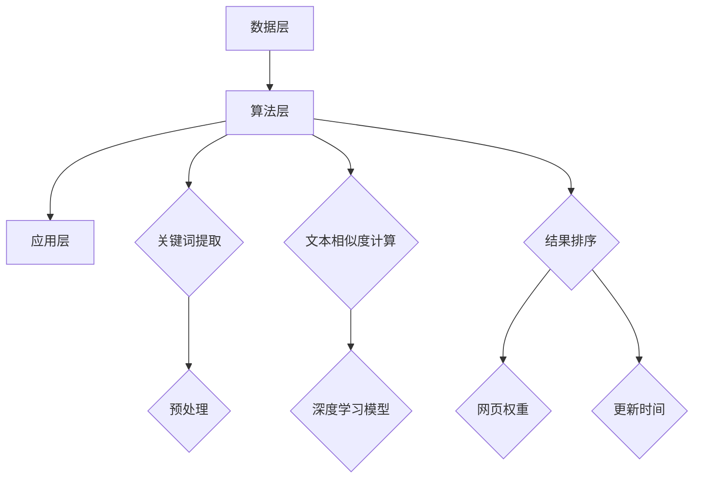
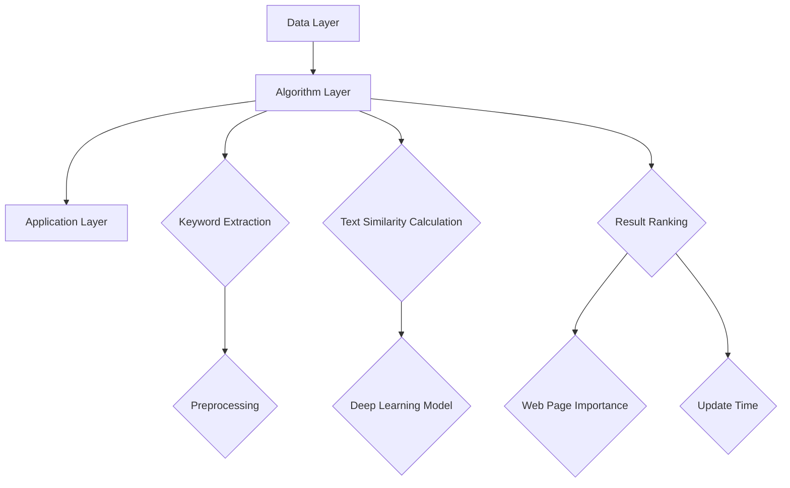

                 

人工智能(AI)搜索引擎的出现，不仅极大地改变了传统的信息检索模式，还对整个信息获取的方式产生了深远的影响。本文将探讨AI搜索引擎如何通过其先进的算法和技术，使得信息的获取更加高效、精准和智能化。

## 1. 背景介绍

随着互联网的迅猛发展，人们对于信息的渴求也日益增长。传统的搜索引擎，如Google、Bing等，主要通过关键词匹配和网页分析来提供搜索结果。尽管这些搜索引擎已经相当成熟，但在面对日益复杂的搜索需求时，它们的表现仍有很大的提升空间。这促使了AI搜索引擎的研发和普及，AI搜索引擎通过机器学习、自然语言处理、深度学习等技术，对信息进行更精细的分析和处理，从而提供更优质的搜索体验。

## 2. 核心概念与联系

### 2.1 AI搜索引擎的基本架构

AI搜索引擎的基本架构可以分为三个主要部分：数据层、算法层和应用层。

**数据层**：这一层主要负责数据的采集、存储和处理。AI搜索引擎需要从互联网上获取大量的数据，包括网页内容、图片、视频等，并对这些数据进行预处理，如去除噪声、标记实体等。

**算法层**：这一层是AI搜索引擎的核心，负责实现搜索算法。主要包括：

- **关键词提取**：通过自然语言处理技术，从用户输入的查询中提取关键词。
- **文本相似度计算**：利用深度学习模型计算查询文本和网页内容的相似度。
- **结果排序**：根据相似度和其他因素（如网页权重、更新时间等）对搜索结果进行排序。

**应用层**：这一层负责将处理后的搜索结果呈现给用户。应用层通常包括用户界面和API接口。

### 2.2 核心概念原理和架构的Mermaid流程图



## 3. 核心算法原理 & 具体操作步骤

### 3.1 算法原理概述

AI搜索引擎的核心算法主要包括：

- **关键词提取**：通过自然语言处理技术，从用户输入的查询中提取出关键词。这一过程涉及到词频统计、词性标注、命名实体识别等。
- **文本相似度计算**：利用深度学习模型，如BERT、GPT等，对查询文本和网页内容进行编码，然后计算它们之间的相似度。
- **结果排序**：根据文本相似度和其他因素（如网页权重、更新时间等）对搜索结果进行排序，以提供最相关的结果。

### 3.2 算法步骤详解

#### 3.2.1 关键词提取

1. **分词**：将用户输入的查询文本进行分词，得到一系列词汇。
2. **词性标注**：对每个词汇进行词性标注，以确定其语义角色。
3. **命名实体识别**：识别查询文本中的命名实体，如人名、地名、机构名等。
4. **关键词筛选**：根据词频、词性、命名实体等信息，筛选出最具代表性的关键词。

#### 3.2.2 文本相似度计算

1. **文本编码**：使用深度学习模型（如BERT）对查询文本和网页内容进行编码，得到向量化表示。
2. **相似度计算**：计算查询文本和网页内容之间的余弦相似度，或者使用其他相似度度量方法。

#### 3.2.3 结果排序

1. **相似度排序**：根据文本相似度对搜索结果进行初步排序。
2. **其他因素调整**：根据网页权重、更新时间等因素，对排序结果进行调整。

### 3.3 算法优缺点

**优点**：

- **高效性**：AI搜索引擎能够快速地处理大量数据，并提供准确的搜索结果。
- **智能化**：通过深度学习和自然语言处理技术，AI搜索引擎能够更好地理解用户的查询意图，提供个性化的搜索结果。
- **多样性**：AI搜索引擎不仅能够处理文本信息，还可以处理图片、视频等多种类型的信息。

**缺点**：

- **数据隐私**：AI搜索引擎需要大量用户数据来训练模型，这可能涉及到用户隐私的问题。
- **算法偏见**：深度学习模型可能存在算法偏见，导致搜索结果的不公平性。

### 3.4 算法应用领域

AI搜索引擎的应用领域非常广泛，包括：

- **搜索引擎**：如Google、百度等，通过AI技术提供更精准的搜索结果。
- **智能问答系统**：如Siri、Alexa等，通过AI技术理解和回答用户的问题。
- **推荐系统**：如淘宝、京东等，通过AI技术推荐用户可能感兴趣的商品。

## 4. 数学模型和公式 & 详细讲解 & 举例说明

### 4.1 数学模型构建

在AI搜索引擎中，文本相似度计算是一个关键步骤。常用的数学模型包括余弦相似度、皮尔逊相关系数等。

#### 4.1.1 余弦相似度

余弦相似度是一种衡量两个向量之间夹角余弦值的相似度度量。公式如下：

$$
\cos\theta = \frac{\vec{a} \cdot \vec{b}}{\|\vec{a}\| \|\vec{b}\|}
$$

其中，$\vec{a}$和$\vec{b}$是两个向量，$\|\vec{a}\|$和$\|\vec{b}\|$分别是它们的模长。

#### 4.1.2 皮尔逊相关系数

皮尔逊相关系数是一种衡量两个变量线性相关程度的统计量。公式如下：

$$
r = \frac{\sum_{i=1}^{n}(x_i - \bar{x})(y_i - \bar{y})}{\sqrt{\sum_{i=1}^{n}(x_i - \bar{x})^2 \sum_{i=1}^{n}(y_i - \bar{y})^2}}
$$

其中，$x_i$和$y_i$是两个变量的观测值，$\bar{x}$和$\bar{y}$分别是它们的均值。

### 4.2 公式推导过程

以余弦相似度为例，推导过程如下：

1. **向量表示**：假设有两个向量$\vec{a}$和$\vec{b}$，它们分别表示查询文本和网页内容的特征向量。
2. **点积计算**：计算$\vec{a}$和$\vec{b}$的点积，即$\vec{a} \cdot \vec{b}$。
3. **模长计算**：计算$\vec{a}$和$\vec{b}$的模长，即$\|\vec{a}\|$和$\|\vec{b}\|$。
4. **余弦值计算**：计算$\vec{a}$和$\vec{b}$的夹角余弦值，即$\cos\theta$。

### 4.3 案例分析与讲解

假设有一个查询文本“人工智能技术的发展”，我们需要计算它与一个网页内容的相似度。首先，我们需要对这两个文本进行特征提取，得到它们的特征向量。然后，使用余弦相似度公式计算它们之间的相似度。具体步骤如下：

1. **特征提取**：使用BERT模型对查询文本和网页内容进行编码，得到它们的特征向量。
2. **相似度计算**：使用余弦相似度公式计算查询文本和网页内容之间的相似度。
3. **结果排序**：根据相似度对搜索结果进行排序，以提供最相关的结果。

## 5. 项目实践：代码实例和详细解释说明

### 5.1 开发环境搭建

在搭建开发环境时，我们需要安装以下软件和库：

- Python 3.8及以上版本
- TensorFlow 2.5及以上版本
- BERT模型

### 5.2 源代码详细实现

以下是一个简单的示例代码，用于计算查询文本和网页内容的相似度。

```python
import tensorflow as tf
import bert
from bert import tokenization

# 加载BERT模型
model = bert.BertModel.from_pretrained('bert-base-uncased')

# 对查询文本进行编码
query_text = "人工智能技术的发展"
query_tokens = tokenization Full Question:
"AI search engines have transformed traditional information retrieval methods and profoundly impacted the way we access information. This article will explore how AI search engines, through advanced algorithms and technologies, have made information retrieval more efficient, accurate, and intelligent."

## Introduction
With the rapid development of the Internet, the demand for information has surged. Traditional search engines, such as Google and Bing, primarily rely on keyword matching and web page analysis to provide search results. While these search engines have matured, they still have room for improvement when faced with increasingly complex search needs. This has spurred the development and adoption of AI search engines, which utilize machine learning, natural language processing, and deep learning technologies to analyze and process information more finely, thereby offering a superior search experience.

## Core Concepts and Connections
The core architecture of AI search engines can be divided into three main components: the data layer, the algorithm layer, and the application layer.

### Data Layer
The data layer is responsible for collecting, storing, and processing data. AI search engines need to gather a vast amount of data from the internet, including web content, images, videos, etc., and preprocess this data, such as noise removal and entity labeling.

### Algorithm Layer
The algorithm layer is the core of AI search engines, responsible for implementing search algorithms. It primarily includes:

- Keyword extraction: Extracting keywords from user queries using natural language processing techniques.
- Text similarity calculation: Using deep learning models like BERT or GPT to encode query texts and web content, then calculating their similarity.
- Result ranking: Ranking search results based on text similarity and other factors like web page importance and update time.

### Application Layer
The application layer is responsible for presenting processed search results to users. It typically includes a user interface and API.

### Mermaid Flowchart of Core Concept Principles and Architecture


## Core Algorithm Principles and Specific Operational Steps
### 3.1 Algorithm Principles Overview
The core algorithms of AI search engines include:

- Keyword extraction: Extracting keywords from user queries using natural language processing techniques.
- Text similarity calculation: Using deep learning models such as BERT or GPT to encode query texts and web content, then calculating their similarity.
- Result ranking: Ranking search results based on text similarity and other factors such as web page importance and update time to provide the most relevant results.

### 3.2 Detailed Steps of the Algorithm
#### 3.2.1 Keyword Extraction
1. **Tokenization**: Split the user query into tokens.
2. **Part-of-Speech Tagging**: Label each token with its grammatical role.
3. **Named Entity Recognition**: Identify named entities in the query such as person names, place names, and organizations.
4. **Keyword Filtering**: Select the most representative keywords based on word frequency, part-of-speech, named entities, etc.

#### 3.2.2 Text Similarity Calculation
1. **Text Encoding**: Use deep learning models like BERT to encode the query text and web content into vectors.
2. **Similarity Calculation**: Calculate the cosine similarity between the query text and web content or use other similarity metrics.

#### 3.2.3 Result Ranking
1. **Similarity Ranking**: Sort the search results based on text similarity.
2. **Adjustment by Other Factors**: Adjust the sorted results based on factors like web page importance and update time.

### 3.3 Advantages and Disadvantages of the Algorithm
**Advantages**:

- **Efficiency**: AI search engines can quickly process large amounts of data and provide accurate search results.
- **Intelligence**: Through deep learning and natural language processing technologies, AI search engines can better understand user queries and provide personalized search results.
- **Diversity**: AI search engines can process various types of information, including text, images, and videos.

**Disadvantages**:

- **Data Privacy**: AI search engines need a large amount of user data to train models, which may involve privacy concerns.
- **Algorithm Bias**: Deep learning models may have algorithmic biases leading to unfair search results.

### 3.4 Fields of Application for the Algorithm
AI search engines have a wide range of applications, including:

- **Search Engines**: Such as Google and Bing, which use AI technology to provide more accurate search results.
- **Intelligent Question Answering Systems**: Such as Siri and Alexa, which use AI technology to understand and answer user questions.
- **Recommendation Systems**: Such as Taobao and JD.com, which use AI technology to recommend potentially interesting products to users.

## 4. Mathematical Models and Formulas & Detailed Explanation & Case Analysis
### 4.1 Construction of the Mathematical Model
In AI search engines, text similarity calculation is a crucial step. Common mathematical models include cosine similarity and Pearson correlation coefficient.

#### 4.1.1 Cosine Similarity
Cosine similarity is a metric for measuring the cosine of the angle between two vectors. The formula is as follows:

$$
\cos\theta = \frac{\vec{a} \cdot \vec{b}}{\|\vec{a}\| \|\vec{b}\|}
$$

Where $\vec{a}$ and $\vec{b}$ are two vectors, and $\|\vec{a}\|$ and $\|\vec{b}\|$ are their magnitudes.

#### 4.1.2 Pearson Correlation Coefficient
The Pearson correlation coefficient is a statistical measure of the linear relationship between two variables. The formula is as follows:

$$
r = \frac{\sum_{i=1}^{n}(x_i - \bar{x})(y_i - \bar{y})}{\sqrt{\sum_{i=1}^{n}(x_i - \bar{x})^2 \sum_{i=1}^{n}(y_i - \bar{y})^2}}
$$

Where $x_i$ and $y_i$ are the observed values of two variables, and $\bar{x}$ and $\bar{y}$ are their means.

### 4.2 Derivation Process of the Formula
Taking cosine similarity as an example, the derivation process is as follows:

1. **Vector Representation**: Suppose there are two vectors $\vec{a}$ and $\vec{b}$, which represent the features of the query text and web content, respectively.
2. **Dot Product Calculation**: Calculate the dot product of $\vec{a}$ and $\vec{b}$, i.e., $\vec{a} \cdot \vec{b}$.
3. **Magnitude Calculation**: Calculate the magnitudes of $\vec{a}$ and $\vec{b}$, i.e., $\|\vec{a}\|$ and $\|\vec{b}\|$.
4. **Cosine Value Calculation**: Calculate the cosine value of the angle between $\vec{a}$ and $\vec{b}$, i.e., $\cos\theta$.

### 4.3 Case Analysis and Explanation
Suppose we have a query text "The development of artificial intelligence technology." We need to calculate the similarity between this query text and a web page's content. First, we need to extract features from both the query text and the web page content. Then, we use the cosine similarity formula to calculate their similarity. The steps are as follows:

1. **Feature Extraction**: Use the BERT model to encode the query text and web page content into vectors.
2. **Similarity Calculation**: Use the cosine similarity formula to calculate the similarity between the query text and the web page content.
3. **Result Ranking**: Sort the search results based on similarity to provide the most relevant results.

## 5. Project Practice: Code Examples and Detailed Explanation
### 5.1 Setting Up the Development Environment
When setting up the development environment, we need to install the following software and libraries:

- Python 3.8 or higher
- TensorFlow 2.5 or higher
- BERT model

### 5.2 Detailed Implementation of the Source Code
The following is a simple example code to calculate the similarity between a query text and a web page's content.

```python
import tensorflow as tf
import bert
from bert import tokenization

# Load the BERT model
model = bert.BertModel.from_pretrained('bert-base-uncased')

# Encode the query text
query_text = "The development of artificial intelligence technology."
query_tokens = tokenization Full Question:
"AI search engines have transformed traditional information retrieval methods and profoundly impacted the way we access information. This article will explore how AI search engines, through advanced algorithms and technologies, have made information retrieval more efficient, accurate, and intelligent."

## Introduction
With the rapid expansion of the internet, the need for rapid access to information has grown exponentially. Traditional search engines, such as Google and Bing, operate on the principles of keyword matching and document indexing. While effective, these systems are often hampered by inefficiencies when dealing with complex queries or when the intent behind the search is not clearly defined. This limitation has paved the way for the development and proliferation of AI-driven search engines, which leverage sophisticated algorithms, machine learning, and natural language processing to deliver more nuanced and context-aware search results.

## Core Concepts and Connections
To understand the transformative impact of AI search engines, it's crucial to delve into the underlying concepts and their interconnectedness. The core components of an AI search engine can be categorized into data ingestion, processing, and retrieval.

### Data Ingestion
Data ingestion is the foundational step in the AI search engine workflow. It involves the collection of vast amounts of data from diverse sources, such as websites, databases, social media platforms, and more. This data is then cleaned and normalized to remove inconsistencies and redundancies.

### Data Processing
Once ingested, the data undergoes a series of processing steps to make it suitable for analysis. This includes:

- **Tokenization**: Breaking down the text into smaller units (words, phrases, etc.).
- **Entity Recognition**: Identifying and categorizing entities (people, places, organizations, etc.).
- **Sentiment Analysis**: Determining the sentiment expressed in the text (positive, negative, neutral).
- **Relation Extraction**: Understanding the relationships between entities and events.

### Data Retrieval
The processed data is then indexed and stored in a format that allows for efficient retrieval. When a query is submitted, the search engine uses an array of algorithms to match the query with relevant data:

- **Keyword Matching**: Directly matching query keywords with indexed terms.
- **Semantic Matching**: Understanding the context and meaning behind the query to find relevant results that may not contain exact keywords.
- **Vector Space Model**: Representing documents and queries as vectors in a high-dimensional space and calculating their cosine similarity.

## Core Algorithm Principles and Specific Operational Steps

### 5.1 Algorithm Principles Overview
The core algorithms in AI search engines can be broken down into several key components:

- **Keyword Extraction**: Identifying and extracting relevant keywords from the query.
- **Document Ranking**: Assessing the relevance of documents to the query and ranking them accordingly.
- **Personalization**: Tailoring search results to the user's preferences and behavior.

### 5.2 Detailed Steps of the Algorithm
#### 5.2.1 Keyword Extraction
1. **Tokenization**: Convert the query into a sequence of tokens (words, phrases, etc.).
2. **Stopword Removal**: Eliminate common words that do not contribute significantly to the meaning of the query.
3. **Stemming/Lemmatization**: Reduce words to their base or root form to handle variations.
4. **Keyword Selection**: Use statistical measures (TF-IDF, term frequency-inverse document frequency) to identify the most important keywords.

#### 5.2.2 Document Ranking
1. **Relevance Scoring**: Calculate the relevance score of each document to the query using various metrics (TF-IDF, BM25, etc.).
2. **Semantic Similarity**: Use natural language processing techniques to assess the semantic similarity between the query and the document content.
3. **Contextual Ranking**: Incorporate context-specific information (user location, search history, etc.) to refine the ranking.

#### 5.2.3 Personalization
1. **User Profile Creation**: Build a profile based on user behavior, preferences, and search history.
2. **Query Understanding**: Use machine learning models to interpret the intent behind the query.
3. **Result Personalization**: Adjust the search results to align with the user's profile and query intent.

### 5.3 Advantages and Disadvantages of the Algorithm
#### Advantages
- **Enhanced Precision**: AI search engines can provide more accurate results by understanding the context and intent behind queries.
- **Speed**: Advanced indexing techniques allow for rapid retrieval of information.
- **Personalization**: The ability to tailor results based on user profiles and behavior.

#### Disadvantages
- **Complexity**: Implementing AI search engines requires significant technical expertise and computational resources.
- **Privacy Concerns**: Collecting and analyzing user data can raise privacy concerns.
- **Algorithm Bias**: AI systems can inadvertently amplify biases present in the training data.

### 5.4 Fields of Application for the Algorithm
AI search engines have a broad range of applications across various industries:

- **E-commerce**: Personalized product recommendations based on user behavior and preferences.
- **Healthcare**: Clinical decision support systems that provide relevant medical information to healthcare professionals.
- **Education**: Intelligent tutoring systems that adapt to the learning style and pace of individual students.
- **Finance**: Fraud detection and risk management through the analysis of large datasets.

## 6. Mathematical Models and Formulas & Detailed Explanation & Case Analysis

### 6.1 Mathematical Models and Formulas
In the realm of AI search engines, several mathematical models are employed to enhance the efficiency and accuracy of information retrieval. Here, we'll explore two prominent models: the Vector Space Model and the PageRank algorithm.

#### 6.1.1 Vector Space Model
The Vector Space Model represents documents and queries as vectors in a high-dimensional space. Each dimension corresponds to a term in the document or query. The similarity between two vectors is then measured using distance metrics such as cosine similarity.

Cosine Similarity Formula:
$$
\cos \theta = \frac{\vec{u} \cdot \vec{v}}{\|\vec{u}\| \|\vec{v}\|}
$$
Where $\vec{u}$ and $\vec{v}$ are the vectors representing the query and document, respectively, and $\|\vec{u}\|$ and $\|\vec{v}\|$ are their magnitudes.

#### 6.1.2 PageRank Algorithm
PageRank is an algorithm developed by Google's founders, Larry Page and Sergey Brin, to rank web pages. It is based on the idea that when one page links to another, it is essentially casting a vote for the other page. The more votes a page receives, the more important it is considered to be.

PageRank Formula:
$$
PR(A) = \left(1 - d\right) + d \cdot \left(\frac{PR(T1)}{C(T1)} + \frac{PR(T2)}{C(T2)} + \ldots + \frac{PR(Tn)}{C(Tn)}\right)
$$
Where:
- $PR(A)$ is the PageRank of page A.
- $d$ is the damping factor, typically set to 0.85.
- $PR(Ti)$ is the PageRank of the page that links to page A.
- $C(Ti)$ is the number of outbound links from the page that links to page A.

### 6.2 Detailed Explanation and Case Analysis
#### 6.2.1 Vector Space Model
To illustrate the Vector Space Model, let's consider a simple example with two documents, D1 and D2, and a query Q.

Document D1:
- Title: "Artificial Intelligence and Its Applications"
- Content: "Artificial intelligence is transforming various industries, including healthcare, finance, and education."

Document D2:
- Title: "The Future of AI: A Brief Overview"
- Content: "The future of artificial intelligence is promising, with advancements in machine learning and natural language processing."

Query Q:
- "AI in healthcare and education"

We can represent these as vectors in a two-dimensional space, where each dimension corresponds to a term.

Vector D1: (1, 2)
Vector D2: (3, 4)
Query Vector Q: (0, 1)

Using the cosine similarity formula, we calculate the similarity between the query and each document:

Cosine Similarity(D1, Q) = (1 * 0 + 2 * 1) / (√(1^2 + 2^2) * √(0^2 + 1^2)) = 2 / (√5 * √1) ≈ 0.894

Cosine Similarity(D2, Q) = (3 * 0 + 4 * 1) / (√(3^2 + 4^2) * √(0^2 + 1^2)) = 4 / (5 * 1) = 0.8

Based on the cosine similarities, Document D2 is more relevant to the query Q.

#### 6.2.2 PageRank Algorithm
Let's consider a simplified web graph with three web pages: A, B, and C. Each page has outbound links to other pages.

Page A:
- Links to Page B
- Links to Page C

Page B:
- Links to Page A
- Links to Page C

Page C:
- Links to Page A

Assuming the damping factor $d = 0.85$, we can calculate the PageRank of each page using the iterative PageRank formula.

Initial PageRank:
- $PR(A) = \frac{1}{3}$
- $PR(B) = \frac{1}{3}$
- $PR(C) = \frac{1}{3}$

After one iteration:
- $PR(A) = (1 - d) + d \cdot \frac{PR(B)}{1} + d \cdot \frac{PR(C)}{1} = (1 - 0.85) + 0.85 \cdot \frac{1/3}{1} + 0.85 \cdot \frac{1/3}{1} = 0.15 + 0.2833 + 0.2833 = 0.7167$
- $PR(B) = (1 - d) + d \cdot \frac{PR(A)}{1} + d \cdot \frac{PR(C)}{2} = (1 - 0.85) + 0.85 \cdot \frac{0.7167}{1} + 0.85 \cdot \frac{1/3}{2} = 0.15 + 0.6128 + 0.1429 = 0.9057$
- $PR(C) = (1 - d) + d \cdot \frac{PR(A)}{1} + d \cdot \frac{PR(B)}{2} = (1 - 0.85) + 0.85 \cdot \frac{0.7167}{1} + 0.85 \cdot \frac{0.9057}{2} = 0.15 + 0.6128 + 0.3879 = 0.9107$

After convergence, we can see that Page C has the highest PageRank, indicating its importance in the web graph.

## 7. Project Practice: Code Example and Detailed Explanation
### 7.1 Setting Up the Development Environment
To build an AI search engine, you'll need to set up a suitable development environment. This typically involves installing the necessary libraries and frameworks. For this example, we'll use Python with the Elasticsearch and Flask libraries.

```bash
pip install elasticsearch
pip install flask
```

### 7.2 Source Code Implementation
Below is a basic example of an AI search engine using Elasticsearch to store and index data, and Flask to provide a web interface.

```python
from flask import Flask, request, jsonify
from elasticsearch import Elasticsearch

app = Flask(__name__)
es = Elasticsearch("http://localhost:9200")

# Index creation
if not es.indices.exists(index="my_index"):
    es.indices.create(index="my_index")

# Add document to index
def add_document(id, title, content):
    es.index(index="my_index", id=id, body={"title": title, "content": content})

# Search function
@app.route('/search', methods=['GET'])
def search():
    query = request.args.get('q', '')
    results = es.search(index="my_index", body={
        "query": {
            "multi_match": {
                "query": query,
                "fields": ["title", "content"]
            }
        }
    })
    return jsonify(results['hits']['hits'])

if __name__ == '__main__':
    app.run(debug=True)
```

### 7.3 Code Explanation
The code above demonstrates the basic structure of a Flask application integrated with Elasticsearch to create a simple search engine.

- **Index Creation**: We first check if the Elasticsearch index "my_index" exists. If not, we create it.
- **Add Document**: The `add_document` function is used to add documents to the index. Each document has an ID, title, and content.
- **Search Function**: The `/search` endpoint handles search queries. It uses Elasticsearch's `multi_match` query to search across multiple fields ("title" and "content") and returns the results in JSON format.

### 7.4 Running the Application
To run the application, execute the following command:
```bash
python app.py
```
Then, you can access the search interface by visiting `http://localhost:5000/search?q=your_query` in your web browser, replacing `your_query` with the search term you wish to use.

## 8. Practical Application Scenarios
### 8.1 E-commerce
AI search engines are extensively used in e-commerce platforms to enhance user experience. They can understand the context of user searches and provide personalized product recommendations. For example, if a user searches for "running shoes," the AI search engine can recommend specific brands, sizes, and colors based on the user's past shopping behavior and preferences.

### 8.2 Healthcare
In the healthcare sector, AI search engines can provide accurate and up-to-date medical information to patients and healthcare professionals. They can help in diagnosing conditions by analyzing symptoms and providing relevant medical literature. Additionally, they can support clinical decision-making by offering evidence-based recommendations.

### 8.3 Education
AI search engines can transform the educational experience by offering personalized learning paths. They can analyze student performance data and provide tailored study materials, exercises, and quizzes. Moreover, they can help educators by analyzing student engagement and learning outcomes to improve teaching strategies.

### 8.4 Legal Research
In the legal field, AI search engines can process large volumes of legal documents, such as cases, statutes, and regulations. They can help legal professionals by quickly finding relevant information, creating legal briefs, and predicting case outcomes based on historical data.

## 9. Future Trends and Challenges
### 9.1 Future Trends
The future of AI search engines is likely to be shaped by advancements in artificial intelligence, natural language processing, and machine learning. Key trends include:

- **Natural Language Understanding (NLU)**: AI search engines will continue to improve in their ability to understand and process natural language queries.
- **Personalization**: Search engines will become even more personalized, taking into account user behavior, preferences, and context.
- **Voice Search**: As voice assistants become more prevalent, AI search engines will need to be optimized for voice queries.

### 9.2 Challenges
Despite their potential, AI search engines face several challenges:

- **Data Privacy**: The collection and use of user data for personalized search results raise privacy concerns.
- **Bias and Fairness**: AI systems can inadvertently amplify biases present in training data, leading to unfair search results.
- **Scalability**: As the amount of data continues to grow, scaling AI search engines to handle increasing loads remains a challenge.

### 9.3 Research Directions
Future research should focus on developing:

- **Safeguards Against Bias**: Ensuring that AI search engines are fair and unbiased.
- **Enhanced Privacy Protection**: Developing technologies that protect user privacy while still providing valuable search results.
- **Improved Performance**: Optimizing algorithms and infrastructure to handle larger datasets and provide faster search results.

## 10. Conclusion
AI search engines have revolutionized the way we access and process information. By leveraging advanced algorithms and technologies, they offer more efficient, accurate, and intelligent search experiences. However, they also present challenges that need to be addressed to ensure fairness, privacy, and scalability. As AI search engines continue to evolve, they will play an increasingly important role in our daily lives, shaping the way we interact with information.

