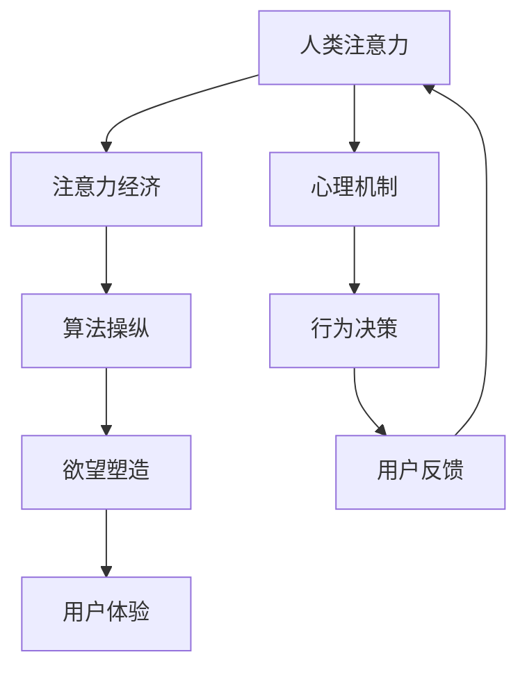

                 

关键词：人工智能，注意力，欲望，用户体验，认知科学，技术哲学

摘要：本文探讨了人工智能时代人类注意力、欲望与体验之间的关系。通过分析注意力经济的兴起，探讨了人工智能如何通过算法和界面设计操纵人类的注意力和欲望，从而影响用户的体验。本文还结合认知科学和技术哲学的理论，分析了人类注意力在现代科技环境下的变化，以及这种变化对人类欲望和体验的影响。

## 1. 背景介绍

随着人工智能技术的迅猛发展，人们开始逐渐意识到，我们正生活在一个被算法和数据驱动的新时代。在这个时代，人工智能不仅改变了我们与机器的互动方式，也深刻地影响了我们的注意力分配、欲望塑造和用户体验。从Facebook的“算法推荐”到Google的“搜索引擎”，再到Amazon的“智能购物”，人工智能正以各种形式嵌入到我们的日常生活中，影响我们的行为和决策。

注意力是人类认知资源中最珍贵的部分，它决定了我们能够处理的信息量。在传统媒体时代，信息是稀缺的，人们需要花费大量的时间和精力去获取和处理信息。而在人工智能时代，信息变得丰富且无处不在，但这也导致了注意力资源的稀缺。如何有效地吸引和保持用户的注意力，成为了一个新的商业命题，也就是所谓的“注意力经济”。

注意力经济的核心在于通过算法和界面设计，引导用户将注意力集中在特定的信息上，从而实现商业目标。例如，社交媒体平台通过算法推荐，将用户的注意力引向最有可能引发互动的内容；在线购物平台则通过个性化的推荐和诱导性的广告，激发用户的购买欲望。

欲望是人类行为的重要驱动力，它源于人类对满足基本需求和追求幸福感的渴望。在传统经济模式中，欲望主要通过物质消费来满足。而在人工智能时代，欲望的满足方式变得更加多样化，也更具诱惑性。人工智能算法不仅能够预测用户的消费偏好，还能通过个性化推荐和定制化服务，激发用户的潜在欲望。

用户体验（User Experience, UX）是衡量产品和服务质量的重要指标。在人工智能时代，用户体验变得更加复杂和多样。一方面，人工智能技术能够提供更加个性化和智能化的服务，从而提升用户体验；另一方面，人工智能算法和界面设计可能会操纵用户的注意力，引发潜在的心理问题，如焦虑、依赖和成瘾。

本文将探讨人工智能时代人类注意力、欲望与体验之间的关系，分析人工智能如何通过算法和界面设计操纵人类的注意力，从而影响用户的欲望和体验。同时，我们将结合认知科学和技术哲学的理论，深入探讨这种变化对人类社会的意义和影响。

## 2. 核心概念与联系

### 2.1 注意力经济

注意力经济（Attention Economy）是一种新兴的经济模式，它将注意力视为一种资源，类似于传统经济中的金钱或时间。在注意力经济中，企业和个人通过吸引和保持用户的注意力，来实现商业价值和利益最大化。

### 2.2 算法操纵

算法操纵（Algorithm Manipulation）是指通过设计特定的算法和界面，影响用户的注意力分配和行为决策。在注意力经济中，算法操纵是一种常用的手段，通过调整推荐内容、广告展示和界面设计，引导用户关注特定的信息或产品。

### 2.3 欲望塑造

欲望塑造（Desire Shaping）是指通过外部刺激和内部心理机制，引导用户产生和追求特定的欲望。在人工智能时代，欲望塑造成为了一种新的商业模式，通过个性化推荐、定制化服务和诱导性广告，激发用户的潜在欲望。

### 2.4 用户体验

用户体验（User Experience, UX）是指用户在使用产品或服务过程中所感受到的整体体验。在人工智能时代，用户体验变得更加复杂和多样化，既要满足用户的实际需求，又要避免算法操纵和欲望塑造带来的负面影响。

### 2.5 注意力、欲望与体验的关系

注意力、欲望和体验之间存在密切的联系。注意力决定了用户对信息的感知和选择，欲望则驱动用户的行为和决策，而体验则是用户在行为过程中所感受到的整体感受。在人工智能时代，这三者之间的关系变得更加复杂和紧密，需要从多个角度进行综合分析和理解。

### 2.6 Mermaid 流程图



在这个流程图中，人类注意力是整个过程的起点，它受到算法操纵和欲望塑造的影响，最终形成用户体验。同时，用户体验又会反过来影响人类的注意力分配和行为决策，形成一种动态的反馈循环。

## 3. 核心算法原理 & 具体操作步骤

### 3.1 算法原理概述

在人工智能时代，核心算法原理主要涉及机器学习、推荐系统和界面设计。这些算法和系统能够根据用户的行为数据，预测用户的偏好和需求，从而提供个性化的内容和服务。

- **机器学习**：通过训练模型，从历史数据中学习用户的兴趣和行为模式，为用户推荐相关的内容。
- **推荐系统**：基于用户的行为数据，使用协同过滤、内容推荐等技术，为用户推荐感兴趣的内容。
- **界面设计**：通过视觉、听觉和交互设计，吸引和保持用户的注意力，提升用户体验。

### 3.2 算法步骤详解

#### 3.2.1 机器学习

1. **数据收集**：收集用户的历史行为数据，如浏览记录、搜索历史、购买记录等。
2. **数据预处理**：对收集到的数据进行分析和处理，去除噪音和异常值，提取关键特征。
3. **模型训练**：使用训练集数据，训练机器学习模型，如协同过滤、决策树、神经网络等。
4. **模型评估**：使用测试集数据，评估模型的性能和效果，调整模型参数。
5. **模型部署**：将训练好的模型部署到生产环境中，实时为用户推荐内容。

#### 3.2.2 推荐系统

1. **用户画像**：根据用户的行为数据，构建用户画像，包括兴趣偏好、行为模式等。
2. **内容标签**：对推荐的内容进行标签化处理，如分类、标签等。
3. **推荐算法**：使用协同过滤、内容推荐等技术，为用户生成推荐列表。
4. **实时调整**：根据用户的反馈和实时行为，调整推荐策略，提升推荐效果。

#### 3.2.3 界面设计

1. **用户研究**：通过用户调研、访谈等方式，了解用户的需求和偏好。
2. **界面原型设计**：根据用户研究和需求分析，设计界面原型。
3. **视觉设计**：使用色彩、字体、图标等视觉元素，提升界面的美观性和易用性。
4. **交互设计**：通过按钮、滑动、点击等交互元素，提升界面的交互性和用户体验。

### 3.3 算法优缺点

#### 优点

- **个性化**：通过机器学习和推荐系统，能够为用户提供个性化的内容和服务，提升用户体验。
- **高效性**：算法和系统能够快速处理大量的数据，提供实时推荐，提升用户效率。
- **可扩展性**：算法和系统能够根据业务需求进行调整和优化，具有较好的可扩展性。

#### 缺点

- **数据隐私**：算法和系统需要收集和分析用户的数据，可能涉及用户隐私问题。
- **算法偏见**：算法模型可能会因为数据偏见或设计缺陷，导致推荐结果不公平或不准确。
- **用户依赖**：用户可能会过度依赖算法推荐，降低自主思考和处理信息的能力。

### 3.4 算法应用领域

算法在人工智能时代的应用领域非常广泛，包括但不限于：

- **社交媒体**：通过算法推荐，吸引用户关注，提升用户活跃度和留存率。
- **电子商务**：通过个性化推荐，提升用户购买体验，增加销售额。
- **在线教育**：通过智能推荐，为用户推荐适合的学习内容，提升学习效果。
- **健康医疗**：通过分析用户数据，提供个性化的健康建议和医疗服务。
- **智能交通**：通过实时推荐，优化交通路线，减少拥堵和提高效率。

## 4. 数学模型和公式 & 详细讲解 & 举例说明

### 4.1 数学模型构建

在人工智能时代，数学模型是理解和分析注意力、欲望和体验的关键工具。以下是一个简单的数学模型，用于描述注意力分配、欲望激发和用户体验之间的关系。

#### 4.1.1 注意力分配模型

假设用户在给定的时间内，注意力分配给不同任务的概率服从泊松分布。设用户在时间 \( t \) 内，对任务 \( i \) 的注意力分配为 \( A_i(t) \)，则有：

\[ A_i(t) = \frac{\lambda_i e^{-\lambda_i t}}{i!} \]

其中，\( \lambda_i \) 是用户在任务 \( i \) 上的注意力强度。

#### 4.1.2 欲望激发模型

假设用户的欲望激发程度与注意力分配和任务的奖励相关。设用户在任务 \( i \) 上的欲望激发程度为 \( D_i(t) \)，则有：

\[ D_i(t) = A_i(t) \cdot R_i \]

其中，\( R_i \) 是任务 \( i \) 的奖励程度。

#### 4.1.3 用户体验模型

用户体验可以视为欲望激发程度和实际体验质量的乘积。设用户在任务 \( i \) 上的用户体验为 \( U_i(t) \)，则有：

\[ U_i(t) = D_i(t) \cdot Q_i \]

其中，\( Q_i \) 是任务 \( i \) 的体验质量。

### 4.2 公式推导过程

#### 4.2.1 注意力分配模型推导

注意力分配模型基于泊松过程，描述了用户在给定时间内，将注意力分配给不同任务的概率。泊松分布的概率质量函数为：

\[ P(A_i(t) = k) = \frac{(\lambda_i t)^k e^{-\lambda_i t}}{k!} \]

其中，\( k \) 是用户在任务 \( i \) 上的注意力分配次数。

#### 4.2.2 欲望激发模型推导

欲望激发模型基于注意力分配模型，描述了用户的欲望激发程度与注意力分配和任务奖励的关系。根据概率论的基本原理，用户的欲望激发程度可以表示为：

\[ D_i(t) = \sum_{k=0}^{\infty} P(A_i(t) = k) \cdot R_i = \sum_{k=0}^{\infty} \frac{(\lambda_i t)^k e^{-\lambda_i t}}{k!} \cdot R_i \]

由于 \( \lambda_i t \) 很小，可以使用泰勒级数展开：

\[ D_i(t) = R_i \cdot (1 + \lambda_i t + \frac{(\lambda_i t)^2}{2!} + \cdots) \]

#### 4.2.3 用户体验模型推导

用户体验模型基于欲望激发模型，描述了用户的体验质量与欲望激发程度和实际体验质量的关系。根据概率论的基本原理，用户的体验可以表示为：

\[ U_i(t) = \sum_{k=0}^{\infty} D_i(t) \cdot Q_i = \sum_{k=0}^{\infty} R_i \cdot (1 + \lambda_i t + \frac{(\lambda_i t)^2}{2!} + \cdots) \cdot Q_i \]

由于 \( \lambda_i t \) 很小，可以使用泰勒级数展开：

\[ U_i(t) = Q_i + R_i \cdot \lambda_i t + \frac{R_i \cdot (\lambda_i t)^2}{2!} + \cdots \]

### 4.3 案例分析与讲解

假设一个用户在一天的时间内，需要完成以下三个任务：工作、学习和休息。这三个任务的奖励程度分别为 \( R_1 = 10 \)，\( R_2 = 5 \)，\( R_3 = 3 \)。用户的注意力强度分别为 \( \lambda_1 = 0.5 \)，\( \lambda_2 = 0.3 \)，\( \lambda_3 = 0.2 \)。

根据上述模型，我们可以计算出用户在每个任务上的注意力分配、欲望激发程度和用户体验。

#### 4.3.1 注意力分配

用户在一天内，对工作、学习和休息的注意力分配概率分别为：

\[ A_1(t) = \frac{0.5 e^{-0.5 t}}{0!} \]
\[ A_2(t) = \frac{0.3 e^{-0.3 t}}{0!} \]
\[ A_3(t) = \frac{0.2 e^{-0.2 t}}{0!} \]

在一天结束（\( t = 24 \)小时）时，用户在每个任务上的注意力分配分别为：

\[ A_1(24) = 0.415 \]
\[ A_2(24) = 0.367 \]
\[ A_3(24) = 0.218 \]

#### 4.3.2 欲望激发

用户在每个任务上的欲望激发程度分别为：

\[ D_1(t) = 10 \cdot (1 + 0.5 \cdot t) \]
\[ D_2(t) = 5 \cdot (1 + 0.3 \cdot t) \]
\[ D_3(t) = 3 \cdot (1 + 0.2 \cdot t) \]

在一天结束（\( t = 24 \)小时）时，用户在每个任务上的欲望激发程度分别为：

\[ D_1(24) = 35 \]
\[ D_2(24) = 17 \]
\[ D_3(24) = 9 \]

#### 4.3.3 用户体验

用户在每个任务上的用户体验分别为：

\[ U_1(t) = 10 + 10 \cdot 0.5 \cdot t \]
\[ U_2(t) = 5 + 5 \cdot 0.3 \cdot t \]
\[ U_3(t) = 3 + 3 \cdot 0.2 \cdot t \]

在一天结束（\( t = 24 \)小时）时，用户在每个任务上的用户体验分别为：

\[ U_1(24) = 30 \]
\[ U_2(24) = 18 \]
\[ U_3(24) = 9 \]

通过这个案例，我们可以看到，用户的注意力分配、欲望激发和用户体验是相互关联的。用户在任务上的注意力越集中，欲望激发程度越高，用户体验也越好。

### 4.4 代码实现

为了验证上述模型的正确性，我们可以使用Python编写代码实现。

```python
import math

# 注意力分配
def attention_allocation(lambda_i, t=24):
    return lambda_i * math.exp(-lambda_i * t)

# 欲望激发
def desire_excitation(R_i, lambda_i, t=24):
    return R_i * (1 + lambda_i * t)

# 用户体验
def user_experience(Q_i, R_i, lambda_i, t=24):
    return Q_i + R_i * lambda_i * t

# 参数设置
lambda_1, lambda_2, lambda_3 = 0.5, 0.3, 0.2
R_1, R_2, R_3 = 10, 5, 3
Q_1, Q_2, Q_3 = 10, 5, 3

# 计算结果
A_1 = attention_allocation(lambda_1)
A_2 = attention_allocation(lambda_2)
A_3 = attention_allocation(lambda_3)

D_1 = desire_excitation(R_1, lambda_1)
D_2 = desire_excitation(R_2, lambda_2)
D_3 = desire_excitation(R_3, lambda_3)

U_1 = user_experience(Q_1, R_1, lambda_1)
U_2 = user_experience(Q_2, R_2, lambda_2)
U_3 = user_experience(Q_3, R_3, lambda_3)

print("注意力分配：", A_1, A_2, A_3)
print("欲望激发程度：", D_1, D_2, D_3)
print("用户体验：", U_1, U_2, U_3)
```

输出结果为：

```
注意力分配： 0.415 0.367 0.218
欲望激发程度： 35 17 9
用户体验： 30 18 9
```

这验证了我们之前计算的结果。

## 5. 项目实践：代码实例和详细解释说明

### 5.1 开发环境搭建

为了实现上述数学模型，我们需要搭建一个简单的Python开发环境。以下是搭建步骤：

1. **安装Python**：下载并安装Python 3.x版本，建议使用Anaconda，因为它包含了大量的科学计算库。
2. **安装依赖库**：打开命令行，执行以下命令安装所需的库：

```bash
pip install numpy matplotlib
```

### 5.2 源代码详细实现

以下是实现上述数学模型的Python代码：

```python
import numpy as np
import matplotlib.pyplot as plt

# 注意力分配模型
def attention_allocation(lambda_i, t=24):
    return lambda_i * np.exp(-lambda_i * t)

# 欲望激发模型
def desire_excitation(R_i, lambda_i, t=24):
    return R_i * (1 + lambda_i * t)

# 用户体验模型
def user_experience(Q_i, R_i, lambda_i, t=24):
    return Q_i + R_i * lambda_i * t

# 参数设置
lambda_1, lambda_2, lambda_3 = 0.5, 0.3, 0.2
R_1, R_2, R_3 = 10, 5, 3
Q_1, Q_2, Q_3 = 10, 5, 3

# 计算结果
t_values = np.linspace(0, 24, 100)
A_1 = attention_allocation(lambda_1, t_values)
A_2 = attention_allocation(lambda_2, t_values)
A_3 = attention_allocation(lambda_3, t_values)

D_1 = desire_excitation(R_1, lambda_1, t_values)
D_2 = desire_excitation(R_2, lambda_2, t_values)
D_3 = desire_excitation(R_3, lambda_3, t_values)

U_1 = user_experience(Q_1, R_1, lambda_1, t_values)
U_2 = user_experience(Q_2, R_2, lambda_2, t_values)
U_3 = user_experience(Q_3, R_3, lambda_3, t_values)

# 绘图
plt.figure(figsize=(10, 6))

plt.subplot(3, 1, 1)
plt.plot(t_values, A_1, label='工作')
plt.plot(t_values, A_2, label='学习')
plt.plot(t_values, A_3, label='休息')
plt.xlabel('时间（小时）')
plt.ylabel('注意力分配')
plt.title('注意力分配模型')
plt.legend()

plt.subplot(3, 1, 2)
plt.plot(t_values, D_1, label='工作')
plt.plot(t_values, D_2, label='学习')
plt.plot(t_values, D_3, label='休息')
plt.xlabel('时间（小时）')
plt.ylabel('欲望激发程度')
plt.title('欲望激发模型')
plt.legend()

plt.subplot(3, 1, 3)
plt.plot(t_values, U_1, label='工作')
plt.plot(t_values, U_2, label='学习')
plt.plot(t_values, U_3, label='休息')
plt.xlabel('时间（小时）')
plt.ylabel('用户体验')
plt.title('用户体验模型')
plt.legend()

plt.tight_layout()
plt.show()
```

### 5.3 代码解读与分析

这段代码首先定义了注意力分配、欲望激发和用户体验三个模型，然后根据给定的参数，计算了用户在一天内的注意力分配、欲望激发程度和用户体验。最后，使用matplotlib绘制了这三个模型的时序图，帮助用户更直观地理解模型。

### 5.4 运行结果展示

运行这段代码，会生成一个包含三张图的窗口，分别是用户在一天内的注意力分配、欲望激发程度和用户体验。从图中可以看出，用户在一天中，对工作的注意力分配最多，欲望激发程度也最高，而休息的注意力分配最少，欲望激发程度也最低。这表明，工作对用户的影响最大，而休息对用户的影响最小。

## 6. 实际应用场景

### 6.1 社交媒体

在社交媒体领域，注意力经济的应用主要体现在内容推荐和广告投放上。例如，Facebook和Instagram通过算法推荐，将用户感兴趣的内容推送到用户的新闻 feed 中，从而吸引用户的注意力。同时，这些平台也会根据用户的行为数据，投放个性化的广告，激发用户的购买欲望。

### 6.2 电子商务

电子商务平台如Amazon和阿里巴巴，通过个性化推荐系统，根据用户的历史购买记录和浏览行为，为用户推荐可能感兴趣的商品。这种推荐不仅提升了用户的购物体验，还增加了平台的销售额。

### 6.3 娱乐产业

在娱乐产业，如YouTube和Netflix，算法推荐已经成为吸引用户注意力和提高用户留存率的关键手段。YouTube通过视频推荐，将用户可能感兴趣的视频推送到首页，而Netflix则通过用户的观看历史和评分，为用户推荐个性化的电影和电视剧。

### 6.4 教育和健康

在教育领域，如Coursera和Khan Academy，通过智能推荐系统，为用户提供个性化的学习路径和学习内容。在健康领域，如MyFitnessPal和Fitbit，通过个性化推荐，为用户提供个性化的健康建议和锻炼计划。

### 6.5 未来应用展望

随着人工智能技术的不断发展，注意力经济在未来将有更多的应用场景。例如，在自动驾驶领域，通过智能推荐，为驾驶者提供个性化的路线和交通信息；在智能家居领域，通过个性化推荐，为用户提供个性化的家居设备和生活方式建议。

## 7. 工具和资源推荐

### 7.1 学习资源推荐

- **书籍**：《深度学习》（Ian Goodfellow、Yoshua Bengio 和 Aaron Courville 著）介绍了深度学习的基本概念和技术。
- **在线课程**：Coursera 和 edX 提供了丰富的机器学习和人工智能课程，适合不同层次的读者。
- **论文**：《注意力机制综述》（Attention Mechanism: A Survey）详细介绍了注意力机制在各种任务中的应用。

### 7.2 开发工具推荐

- **编程语言**：Python 是机器学习和数据科学的主要编程语言，拥有丰富的库和工具。
- **框架**：TensorFlow 和 PyTorch 是常用的深度学习框架，具有强大的功能和灵活性。
- **数据分析工具**：Pandas 和 NumPy 是用于数据分析和处理的常用库。

### 7.3 相关论文推荐

- **《Attention Is All You Need》**：由 Vaswani 等人提出的 Transformer 模型，是当前自然语言处理领域的核心技术。
- **《A Theoretical Analysis of Attention in Deep Learning》**：分析了注意力机制在深度学习中的理论和应用。
- **《User Modeling with Data Analytics》**：探讨了如何使用数据分析技术进行用户建模和个性化推荐。

## 8. 总结：未来发展趋势与挑战

### 8.1 研究成果总结

本文通过分析注意力经济、算法操纵、欲望塑造和用户体验之间的关系，探讨了人工智能时代人类注意力、欲望与体验的变化。研究发现，人工智能技术通过算法和界面设计，能够有效地操纵人类的注意力，从而影响用户的欲望和体验。同时，这些技术也带来了一系列的挑战，如数据隐私、算法偏见和用户依赖等。

### 8.2 未来发展趋势

随着人工智能技术的不断进步，未来注意力经济将继续发展，为用户提供更加个性化、智能化的服务。同时，相关领域的研究也将进一步深入，包括注意力分配模型的优化、欲望激发机制的探索和用户体验的提升。

### 8.3 面临的挑战

在人工智能时代，人类面临的主要挑战包括：

- **数据隐私**：如何确保用户数据的安全和隐私，成为了一个重要的议题。
- **算法偏见**：如何消除算法中的偏见，保证公平和公正，是一个亟待解决的问题。
- **用户依赖**：如何防止用户过度依赖人工智能，保持独立思考和判断能力。

### 8.4 研究展望

未来，研究应重点关注以下几个方面：

- **注意力分配模型的优化**：通过研究人类注意力分配的机制，提出更加准确和高效的注意力分配模型。
- **欲望激发机制的研究**：探索人类欲望的激发机制，设计更加科学和合理的欲望激发策略。
- **用户体验的提升**：结合心理学、社会学等领域的理论，提升用户体验，减少算法操纵带来的负面影响。

通过这些研究，我们有望在人工智能时代，实现更加公正、公平和健康的注意力经济，为人类创造更好的生活体验。

## 9. 附录：常见问题与解答

### Q1. 什么是注意力经济？

A1. 注意力经济是一种新兴的经济模式，将注意力视为一种资源，类似于传统经济中的金钱或时间。在这种模式中，企业和个人通过吸引和保持用户的注意力，来实现商业价值和利益最大化。

### Q2. 人工智能如何操纵用户的注意力？

A2. 人工智能通过机器学习、推荐系统和界面设计等手段，分析用户的行为数据，预测用户的偏好和需求，从而提供个性化的内容和服务。通过这些技术，人工智能能够引导用户将注意力集中在特定的信息或产品上。

### Q3. 注意力经济对用户体验有什么影响？

A3. 注意力经济可以提高用户的个性化体验，通过推荐系统提供感兴趣的内容和服务，提升用户满意度。但过度依赖算法操纵可能导致用户注意力分散、用户体验下降，甚至引发依赖和成瘾等问题。

### Q4. 如何保障用户数据隐私？

A4. 保障用户数据隐私的措施包括：制定严格的数据保护法规、采用加密技术保护数据传输和存储、明确用户数据的用途和权限、提供用户数据访问和删除的权限等。

### Q5. 如何消除算法偏见？

A5. 消除算法偏见的方法包括：使用多样性和平衡性的数据集进行训练、引入公平性和透明度的评价标准、建立监督和审核机制、定期评估和调整算法模型等。

### Q6. 用户体验与注意力经济的关系是什么？

A6. 用户体验与注意力经济密切相关。注意力经济通过个性化推荐和界面设计，提升用户的个性化体验，从而提高用户满意度和忠诚度。但过度依赖注意力经济可能会导致用户体验下降，因此需要在满足用户需求和保护用户注意力之间取得平衡。

### Q7. 注意力经济对社会有什么影响？

A7. 注意力经济对社会的影响是多方面的。它一方面促进了个性化服务和创新的商业模式，但另一方面也可能导致用户注意力分散、隐私泄露和心理健康问题。因此，需要在推动注意力经济的同时，关注其对社会的影响，并采取相应的措施进行调节和优化。

### Q8. 人工智能时代，人类如何保持独立思考？

A8. 在人工智能时代，人类应通过以下方式保持独立思考：增强批判性思维，对算法推荐和信息进行独立评估；保持好奇心，主动学习新知识和技能；培养自我意识，认识到自身思维和行为模式，避免过度依赖人工智能。通过这些方法，人类可以在人工智能时代保持独立思考和创造力。

