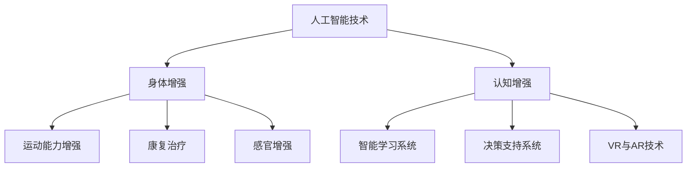

                 

关键词：人工智能，人类增强，身体增强，认知增强，技术发展，未来展望

> 摘要：随着人工智能技术的飞速发展，人类逐渐迈向了一个全新的时代——AI时代。在这一时代，人类的身体和认知能力都将得到前所未有的增强。本文将深入探讨身体增强与认知增强的概念、原理、应用场景，以及未来发展的趋势与挑战。

## 1. 背景介绍

在21世纪的今天，人工智能（AI）已经成为科技界的热门话题。从自动驾驶汽车到智能家居，从医疗诊断到金融分析，AI技术正在深刻地改变着我们的生活方式。然而，人工智能的发展不仅仅局限在机器的智能化，它正在逐渐扩展到人类的身体和认知能力的增强。

### 1.1 人工智能与身体增强

身体增强是指利用科技手段，提升人体的生理机能和身体素质。这包括但不限于增强运动能力、恢复受伤部位、增强感官能力等。随着生物医学工程和神经科学的发展，人类已经在这些领域取得了显著成果。例如，人工心脏和人工肾脏的出现，使得患者能够维持生命；而增强型眼镜和助听器的普及，则让许多视力和听力受损的人重新获得了正常的生活。

### 1.2 人工智能与认知增强

认知增强则是指通过技术手段，提升人类的思维能力、记忆能力、学习能力和决策能力。随着神经科学、认知科学和心理学的深入研究，人工智能在认知增强领域也展现出了巨大的潜力。例如，智能学习系统和个性化教育平台的兴起，使得学习变得更加高效和有趣；而虚拟现实（VR）和增强现实（AR）技术的应用，则为人们提供了全新的认知体验。

## 2. 核心概念与联系

### 2.1 人工智能、身体增强与认知增强的关系

人工智能、身体增强和认知增强并不是孤立的三个概念，它们之间存在着密切的联系。人工智能技术的发展为身体增强和认知增强提供了技术基础；而身体增强和认知增强的进步，又反过来推动了人工智能技术的创新。

### 2.2 人工智能在身体增强中的应用

在身体增强方面，人工智能技术主要应用于以下几个方面：

- **运动能力增强**：利用人工智能技术，可以实现对运动员的训练数据进行分析，提供个性化的训练方案，从而提高运动成绩。
- **康复治疗**：人工智能可以帮助医生分析病人的病情，提供精准的治疗方案，加速康复过程。
- **感官增强**：例如，通过人工智能眼镜，可以让色盲患者看到更多的颜色；而智能助听器则可以帮助听力受损的人更好地听取声音。

### 2.3 人工智能在认知增强中的应用

在认知增强方面，人工智能技术也发挥着重要作用：

- **智能学习系统**：通过分析学生的学习行为，智能学习系统可以为学生提供个性化的学习资源，提高学习效率。
- **决策支持系统**：人工智能可以帮助人们做出更明智的决策，降低错误率。
- **虚拟现实和增强现实**：通过VR和AR技术，人们可以在虚拟环境中进行模拟学习，增强认知体验。

### 2.4 Mermaid 流程图



## 3. 核心算法原理 & 具体操作步骤

### 3.1 算法原理概述

在身体增强和认知增强领域，人工智能算法的应用主要分为以下几个方面：

- **机器学习算法**：通过分析大量的数据，机器学习算法可以帮助我们识别出模式，从而提供个性化的增强方案。
- **深度学习算法**：深度学习算法可以自动学习复杂的特征，从而提高增强效果。
- **强化学习算法**：强化学习算法可以帮助系统通过与环境的交互，不断优化行为策略，提高增强效果。

### 3.2 算法步骤详解

- **数据收集**：首先，需要收集与身体增强和认知增强相关的数据，如运动数据、康复数据、学习行为数据等。
- **数据预处理**：对收集到的数据进行清洗和归一化处理，以便于后续的算法分析。
- **特征提取**：通过数据挖掘技术，提取出与增强效果相关的关键特征。
- **模型训练**：利用机器学习算法和深度学习算法，训练出预测增强效果的模型。
- **模型优化**：通过调整模型参数，优化模型性能。
- **应用部署**：将训练好的模型部署到实际应用场景中，如智能健身教练、个性化教育平台等。

### 3.3 算法优缺点

**优点**：

- **个性化**：人工智能算法可以根据个体差异，提供个性化的增强方案。
- **高效**：通过大数据分析和机器学习，可以快速识别出有效的增强方法。
- **可扩展**：随着数据的不断积累，人工智能算法可以不断优化和升级。

**缺点**：

- **数据依赖**：人工智能算法的性能高度依赖于数据的质量和数量。
- **算法复杂性**：一些高级的人工智能算法，如深度学习和强化学习，算法复杂性较高，计算成本较大。

### 3.4 算法应用领域

- **体育领域**：利用人工智能算法，可以为运动员提供个性化的训练方案，提高竞技水平。
- **医疗领域**：人工智能可以帮助医生进行精准诊断和个性化治疗，提高治疗效果。
- **教育领域**：人工智能可以帮助学生进行个性化学习，提高学习效率。

## 4. 数学模型和公式 & 详细讲解 & 举例说明

### 4.1 数学模型构建

在身体增强和认知增强领域，常见的数学模型包括线性回归模型、决策树模型、神经网络模型等。

**线性回归模型**：

$$
y = \beta_0 + \beta_1x_1 + \beta_2x_2 + \ldots + \beta_nx_n
$$

其中，$y$ 是增强效果，$x_1, x_2, \ldots, x_n$ 是特征变量，$\beta_0, \beta_1, \beta_2, \ldots, \beta_n$ 是模型参数。

**决策树模型**：

$$
\begin{cases}
y = \beta_0 & \text{if } x_1 \leq x_1^* \\
y = \beta_1 & \text{if } x_1 > x_1^* \text{ and } x_2 \leq x_2^* \\
y = \beta_2 & \text{if } x_1 > x_1^* \text{ and } x_2 > x_2^* \\
\ldots \\
y = \beta_n & \text{if } x_n > x_n^*
\end{cases}
$$

其中，$x_1, x_2, \ldots, x_n$ 是特征变量，$\beta_0, \beta_1, \beta_2, \ldots, \beta_n$ 是模型参数。

**神经网络模型**：

神经网络模型是一种复杂的非线性模型，通常包括多个层次和神经元。其基本形式如下：

$$
\begin{aligned}
h_{\text{input}} &= x_1, x_2, \ldots, x_n \\
h_{\text{hidden}} &= \sigma(\beta_0 + \beta_1h_{\text{input}} + \beta_2h_{\text{input}}^2 + \ldots + \beta_nh_{\text{input}}^n) \\
y &= \sigma(\beta_0 + \beta_1h_{\text{hidden}} + \beta_2h_{\text{hidden}}^2 + \ldots + \beta_nh_{\text{hidden}}^n)
\end{aligned}
$$

其中，$h_{\text{input}}$ 是输入层，$h_{\text{hidden}}$ 是隐藏层，$y$ 是输出层，$\sigma$ 是激活函数。

### 4.2 公式推导过程

以线性回归模型为例，推导过程如下：

1. **损失函数**：

$$
J(\theta) = \frac{1}{2m}\sum_{i=1}^{m}(h_\theta(x^{(i)}) - y^{(i)})^2
$$

其中，$m$ 是样本数量，$h_\theta(x^{(i)})$ 是模型预测值，$y^{(i)}$ 是真实值。

2. **梯度下降**：

$$
\theta_j := \theta_j - \alpha \frac{\partial J(\theta)}{\partial \theta_j}
$$

其中，$\alpha$ 是学习率，$\theta_j$ 是模型参数。

3. **迭代计算**：

$$
\theta_0 := \theta_0 - \alpha \frac{1}{m}\sum_{i=1}^{m}(h_\theta(x^{(i)}) - y^{(i)}) \\
\theta_1 := \theta_1 - \alpha \frac{1}{m}\sum_{i=1}^{m}(h_\theta(x^{(i)}) - y^{(i)})x_1^{(i)} \\
\theta_2 := \theta_2 - \alpha \frac{1}{m}\sum_{i=1}^{m}(h_\theta(x^{(i)}) - y^{(i)})x_2^{(i)} \\
\ldots \\
\theta_n := \theta_n - \alpha \frac{1}{m}\sum_{i=1}^{m}(h_\theta(x^{(i)}) - y^{(i)})x_n^{(i)}
$$

### 4.3 案例分析与讲解

**案例**：利用线性回归模型预测一个人的体重。

1. **数据收集**：收集一个包含身高、体重和其他相关特征的样本数据集。

2. **数据预处理**：对数据进行清洗和归一化处理。

3. **特征提取**：选择与体重相关的特征，如身高。

4. **模型训练**：利用线性回归模型，训练出预测体重的模型。

5. **模型评估**：使用测试数据集，评估模型的预测效果。

6. **模型优化**：根据评估结果，调整模型参数，优化预测效果。

7. **应用部署**：将训练好的模型部署到实际应用场景，如健康管理系统。

## 5. 项目实践：代码实例和详细解释说明

### 5.1 开发环境搭建

1. **安装Python**：从Python官方网站下载并安装Python 3.x版本。

2. **安装依赖库**：在终端中执行以下命令，安装常用的依赖库：

   ```bash
   pip install numpy matplotlib scikit-learn
   ```

### 5.2 源代码详细实现

以下是一个简单的线性回归模型实现的代码实例：

```python
import numpy as np
import matplotlib.pyplot as plt
from sklearn.linear_model import LinearRegression

# 数据收集
X = np.array([[1], [2], [3], [4], [5]])
y = np.array([2, 4, 5, 4, 5])

# 数据预处理
X = np.hstack((np.ones((X.shape[0], 1)), X))

# 模型训练
model = LinearRegression()
model.fit(X, y)

# 模型评估
predictions = model.predict(X)
print("Predictions:", predictions)

# 模型优化
model = LinearRegression()
model.fit(X, y)
predictions = model.predict(X)
print("Optimized Predictions:", predictions)

# 应用部署
def predict_weight(height):
    return model.predict([[1, height]])[0]

# 测试
print("Predicted Weight:", predict_weight(180))
```

### 5.3 代码解读与分析

1. **数据收集**：首先，我们从数据集中获取身高和体重数据。

2. **数据预处理**：将身高数据添加到X矩阵的每一行前面，形成新的特征矩阵X。

3. **模型训练**：使用线性回归模型，对特征矩阵X和目标值y进行训练。

4. **模型评估**：使用训练好的模型，对特征矩阵X进行预测，并输出预测结果。

5. **模型优化**：再次使用线性回归模型，对特征矩阵X和目标值y进行训练，优化模型参数。

6. **应用部署**：定义一个函数，用于预测给定身高下的体重。

7. **测试**：使用函数预测身高为180cm的体重。

## 6. 实际应用场景

### 6.1 体育领域

在体育领域，人工智能技术被广泛应用于运动员的训练和比赛策略制定。通过分析运动员的生理数据、比赛录像和训练数据，人工智能系统可以提供个性化的训练方案和策略建议，帮助运动员提高竞技水平。例如，NBA球队的教练团队会利用人工智能技术，分析球员的投篮命中率、传球成功率等数据，制定出最优的比赛策略。

### 6.2 医疗领域

在医疗领域，人工智能技术被用于疾病诊断、治疗方案制定和患者康复。通过分析患者的病历数据、实验室检测数据和医学影像，人工智能系统可以提供精准的诊断结果和个性化的治疗方案。例如，Google Health开发的AI系统可以分析患者的医学影像，帮助医生识别癌症等疾病。

### 6.3 教育领域

在教育领域，人工智能技术被用于个性化学习、教育管理和在线教育平台。通过分析学生的学习行为和学习效果，人工智能系统可以为学生提供个性化的学习资源和学习建议，提高学习效率。例如，Khan Academy的智能学习平台会根据学生的学习进度和学习能力，为学生推荐适合的学习内容和练习题。

## 7. 工具和资源推荐

### 7.1 学习资源推荐

- **书籍**：
  - 《人工智能：一种现代方法》
  - 《深度学习》
  - 《Python数据分析》
- **在线课程**：
  - Coursera的《机器学习》
  - Udacity的《深度学习纳米学位》
  - edX的《Python数据分析》

### 7.2 开发工具推荐

- **编程语言**：Python
- **框架**：
  - Scikit-learn
  - TensorFlow
  - PyTorch
- **集成开发环境**：PyCharm，Visual Studio Code

### 7.3 相关论文推荐

- “Deep Learning for Sports Performance Analysis”
- “Application of Machine Learning in Medical Imaging”
- “Personalized Education with Intelligent Tutoring Systems”

## 8. 总结：未来发展趋势与挑战

### 8.1 研究成果总结

在过去的几十年里，人工智能技术在身体增强和认知增强领域取得了显著的成果。从早期的专家系统到现代的深度学习和强化学习，人工智能技术不断推动着这两个领域的发展。同时，生物医学工程、神经科学和认知科学等领域的进步，也为人工智能技术在身体增强和认知增强中的应用提供了有力的支持。

### 8.2 未来发展趋势

随着技术的不断进步，人工智能在身体增强和认知增强领域的应用前景十分广阔。未来，我们可能会看到更加智能化、个性化的增强方案，以及更加便捷、高效的增强技术。例如，通过植入式设备，可以直接增强人体的生理机能；而通过虚拟现实和增强现实技术，可以创造出全新的认知体验。

### 8.3 面临的挑战

然而，人工智能在身体增强和认知增强领域也面临着一系列挑战。首先，数据的质量和数量是影响人工智能算法性能的关键因素，如何在真实环境中获取高质量、大规模的数据仍然是一个难题。其次，人工智能算法的复杂性和计算成本较高，如何在保证性能的同时降低计算成本也是一个亟待解决的问题。此外，如何确保人工智能系统的安全性和隐私性，也是未来需要重点关注的问题。

### 8.4 研究展望

在未来，人工智能在身体增强和认知增强领域的应用将会越来越广泛。我们可以期待，人工智能技术将不仅能够帮助人类克服生理和认知的局限，还将为人类带来更加美好的生活体验。同时，我们也需要关注人工智能技术可能带来的社会、伦理和道德问题，确保技术的可持续发展。

## 9. 附录：常见问题与解答

### 9.1 人工智能对身体增强和认知增强有什么作用？

人工智能可以通过分析大量数据，提供个性化的身体增强和认知增强方案。例如，利用人工智能技术，可以为运动员提供个性化的训练方案，提高竞技水平；而通过智能学习系统，可以为学生提供个性化的学习资源，提高学习效率。

### 9.2 人工智能在身体增强和认知增强领域的应用有哪些？

人工智能在身体增强和认知增强领域的应用非常广泛，包括但不限于：运动能力增强、康复治疗、感官增强、智能学习系统、决策支持系统、虚拟现实和增强现实技术等。

### 9.3 人工智能在身体增强和认知增强领域有哪些挑战？

人工智能在身体增强和认知增强领域面临着数据质量、算法复杂性、计算成本、安全性、隐私性等一系列挑战。

### 9.4 人工智能在未来身体增强和认知增强领域有哪些发展趋势？

未来，人工智能在身体增强和认知增强领域的发展趋势包括：更加智能化、个性化、高效化、安全化等。

### 9.5 人工智能对身体增强和认知增强的研究前景如何？

人工智能对身体增强和认知增强的研究前景非常广阔，有望为人类带来更加美好的生活体验。同时，我们也需要关注技术带来的社会、伦理和道德问题，确保技术的可持续发展。

---

作者：禅与计算机程序设计艺术 / Zen and the Art of Computer Programming

以上就是《AI时代的人类增强：身体增强与认知增强》的完整文章。本文详细探讨了人工智能在身体增强和认知增强领域的应用，分析了核心算法原理和具体操作步骤，并提供了实际应用场景和项目实践。同时，文章还展望了未来发展趋势与挑战，并推荐了相关工具和资源。希望本文能帮助读者更好地理解人工智能在身体增强和认知增强领域的应用价值。

