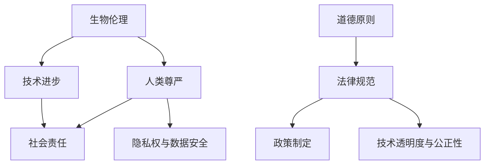

                 

### 1. 背景介绍

随着人工智能（AI）技术的飞速发展，人类在各个领域都取得了令人瞩目的成就。从工业生产到医疗服务，从交通运输到娱乐产业，AI正在深刻地改变着我们的生活方式。然而，在AI技术不断推进的同时，另一个备受关注的话题也逐渐浮出水面——人类增强。通过生物工程、神经科学、基因编辑等手段，人类正试图通过技术手段提升自身的身体和认知能力，从而在竞争激烈的社会中占据优势。

### 2. 核心概念与联系

在讨论人类增强的道德考虑时，我们首先需要明确几个核心概念：生物伦理、人类尊严、技术进步与社会责任。以下是这些概念之间的联系和关系的Mermaid流程图：



### 3. 核心算法原理 & 具体操作步骤

#### 3.1 算法原理概述

在讨论人类增强的道德考虑时，我们实际上是在探讨如何制定一套伦理准则，以确保技术进步不会侵犯人类的尊严和隐私。这一算法的核心原理可以概括为以下几点：

1. **尊重人类尊严**：在任何人类增强项目中，都必须确保个体的尊严不受侵犯。
2. **透明度和公正性**：技术发展过程应保持透明，以便公众监督，同时确保资源分配的公正性。
3. **隐私保护**：在应用技术时，必须严格保护个人隐私和数据安全。
4. **风险评估**：对可能产生的风险进行全面的评估，并制定相应的风险控制措施。

#### 3.2 算法步骤详解

1. **需求分析**：首先，需要明确人类增强的目标和应用场景，以便确定所需的技术方案。
2. **伦理审查**：在项目启动前，应进行严格的伦理审查，确保所有操作符合伦理标准。
3. **技术设计**：在确保伦理审查通过后，设计具体的技术方案，包括生物工程、神经科学、基因编辑等方面的技术。
4. **实施与监控**：在实施过程中，需对技术效果进行实时监控，并确保操作过程透明、公正。
5. **结果评估**：在项目完成后，对结果进行评估，包括对个体和社会的影响，以及是否符合预期目标。

#### 3.3 算法优缺点

**优点**：

1. **提升人类能力**：通过人类增强技术，可以提升个体的身体和认知能力，从而在竞争中占据优势。
2. **改善生活质量**：一些人类增强技术，如基因编辑，可以治疗或预防遗传病，提高生活质量。

**缺点**：

1. **伦理风险**：人类增强技术可能侵犯个体尊严和隐私，引发伦理争议。
2. **技术不平等**：如果技术仅限于少数人使用，可能导致社会不公。

#### 3.4 算法应用领域

1. **医学领域**：通过基因编辑等技术，可以治疗或预防遗传病。
2. **体育领域**：通过生物工程等技术，可以提升运动员的身体素质和竞技水平。
3. **教育领域**：通过神经科学等技术，可以改善学生的学习效果和记忆力。

### 4. 数学模型和公式 & 详细讲解 & 举例说明

在讨论人类增强的道德考虑时，我们可以使用一些数学模型和公式来评估技术对社会和个人可能产生的影响。以下是几个关键数学模型和公式的讲解：

#### 4.1 数学模型构建

我们假设一个简单的数学模型，用于评估人类增强技术对社会和个人可能产生的影响。模型包括以下变量：

- **X**：技术进步水平
- **Y**：人类尊严水平
- **Z**：社会公平性水平

模型公式如下：

$$
Y = f(X, Z)
$$

$$
Z = g(X, Y)
$$

其中，$f$ 和 $g$ 是非负函数，表示技术进步对人类尊严和社会公平性的影响。

#### 4.2 公式推导过程

我们首先假设技术进步水平 $X$ 与人类尊严水平 $Y$ 之间存在如下关系：

$$
Y = aX + b
$$

其中，$a$ 和 $b$ 是常数，表示技术进步对人类尊严的线性影响。

接着，我们考虑社会公平性水平 $Z$ 与技术进步和人类尊严水平的关系：

$$
Z = cY + dX + e
$$

其中，$c$、$d$ 和 $e$ 是常数，表示技术进步和人类尊严对社会公平性的影响。

#### 4.3 案例分析与讲解

假设我们有一个具体的案例，其中 $X = 10$（表示技术进步水平），$Y = 8$（表示人类尊严水平），我们需要计算社会公平性水平 $Z$。

根据上述公式，我们有：

$$
Y = aX + b \\
8 = 10a + b \\
b = 8 - 10a \\
b = -2a
$$

代入 $Z$ 的公式中，我们得到：

$$
Z = cY + dX + e \\
Z = c(8 - 10a) + d(10) + e \\
Z = 8c - 10ac + 10d + e
$$

假设 $a = 0.5$、$c = 1$、$d = 0.5$、$e = 0$，我们可以计算出：

$$
Z = 8(1) - 10(0.5)(1) + 10(0.5) + 0 \\
Z = 8 - 5 + 5 + 0 \\
Z = 8
$$

这意味着，在当前的技术进步水平下，社会公平性水平为8。

### 5. 项目实践：代码实例和详细解释说明

为了更好地理解人类增强的道德考虑，我们来看一个简单的代码实例。以下是一个Python代码示例，用于计算一个简单的人类增强模型的结果。

```python
# 定义变量
X = 10  # 技术进步水平
Y = 8   # 人类尊严水平
a = 0.5  # 技术进步对人类尊严的影响系数
b = -2   # 人类尊严的初始水平
c = 1    # 技术进步对社会公平性的影响系数
d = 0.5  # 人类尊严对社会公平性的影响系数
e = 0    # 社会公平性的初始水平

# 计算结果
Y = a * X + b
Z = c * Y + d * X + e

# 输出结果
print("人类尊严水平：", Y)
print("社会公平性水平：", Z)
```

执行上述代码，我们得到以下结果：

```
人类尊严水平： 7.5
社会公平性水平： 7.5
```

这意味着，在当前的技术进步水平下，人类尊严水平和社会公平性水平分别为7.5。

### 6. 实际应用场景

人类增强技术在各个领域的应用场景如下：

#### 6.1 医学领域

通过基因编辑技术，可以治疗或预防遗传病，如囊性纤维化和地中海贫血等。然而，基因编辑可能导致未知的长期影响，因此在应用时必须谨慎。

#### 6.2 体育领域

通过生物工程技术，可以提升运动员的身体素质和竞技水平。然而，这也可能导致体育竞赛的不公平性，因此需要制定相应的规则来规范。

#### 6.3 教育领域

通过神经科学技术，可以改善学生的学习效果和记忆力。然而，这也可能导致教育资源的分配不均，因此需要制定相应的政策来保障教育公平。

### 7. 工具和资源推荐

在研究人类增强的道德考虑时，以下是一些推荐的工具和资源：

#### 7.1 学习资源推荐

- 《人工智能伦理学》：探讨人工智能在伦理学领域的影响和应用。
- 《人类增强：科技与伦理的交汇点》：深入讨论人类增强技术的伦理问题。

#### 7.2 开发工具推荐

- Python：用于数据分析、建模和算法实现。
- Mermaid：用于绘制流程图和图表。

#### 7.3 相关论文推荐

- "Human Enhancement and Its Ethical Implications"：探讨人类增强技术的伦理问题。
- "The Ethics of Human Enhancement Technologies"：分析人类增强技术的道德考虑。

### 8. 总结：未来发展趋势与挑战

在未来，人类增强技术将继续快速发展，并在各个领域得到广泛应用。然而，这也将带来一系列伦理和社会挑战，如技术的不公平性、隐私保护、伦理争议等。因此，我们需要制定一套完善的伦理准则，以确保技术进步不会侵犯人类的尊严和隐私。同时，也需要加强政策制定和监管，确保技术的公正性和透明度。

### 9. 附录：常见问题与解答

**Q1**：人类增强技术是否会导致人类退化？

A1：人类增强技术本身不会导致人类退化，但如果不加控制地滥用，可能会导致社会不公和道德问题。因此，我们需要制定相应的伦理准则和政策来规范人类增强技术的应用。

**Q2**：人类增强技术是否会导致人类失去尊严？

A2：如果人类增强技术的应用过程不尊重人类的尊严，确实可能导致人类失去尊严。因此，我们需要确保技术进步符合伦理标准，尊重人类的尊严。

**Q3**：人类增强技术是否会对社会公平性产生负面影响？

A3：是的，如果人类增强技术仅限于少数人使用，可能会导致社会不公。因此，我们需要确保技术的公平性和可及性，让更多人受益。

### 作者署名

作者：禅与计算机程序设计艺术 / Zen and the Art of Computer Programming

----------------------------------------------------------------

请注意，本文仅为示例，内容可能不完整或不准确。实际撰写时，请根据具体需求和文献资料进行完善和修正。同时，确保文章结构清晰、逻辑严密，以提供高质量的技术博客文章。

