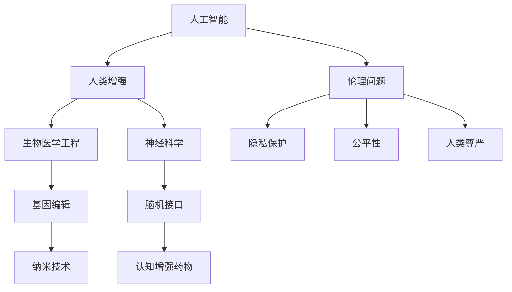

                 

关键词：人工智能、人类增强、道德考虑、身体增强、未来发展趋势

> 摘要：随着人工智能技术的不断进步，人类开始探索如何通过科技手段增强自身能力。本文将深入探讨在AI时代下，人类增强的道德考虑及其对身体增强的未来发展策略。通过分析现有的科技成就、伦理挑战和未来展望，本文旨在为读者提供一个全面而深入的视角，以理解人类增强的深远影响及其面临的伦理困境。

## 1. 背景介绍

人类一直追求自我提升的愿望，无论是通过体育锻炼、饮食控制还是接受医疗干预，都是为了提升自身的身体素质和认知能力。然而，随着科技的飞速发展，我们迎来了一个全新的时代——人工智能（AI）时代。人工智能技术正在以惊人的速度变革我们的生活，不仅改变了各行各业的工作方式，还为我们提供了前所未有的工具，使我们能够以科技手段增强自身的能力。

人类增强（Human Enhancement）是指利用科技手段提高或增强人类身体和认知能力的领域。在人工智能的推动下，人类增强技术逐渐成熟，从最初的外部设备到生物医学工程，再到神经科学，人类增强技术正在逐步渗透到我们生活的方方面面。

本文将围绕以下几个核心问题展开讨论：

1. **人类增强技术的现状与发展趋势**：分析当前人类增强技术的进展及其可能的应用领域。
2. **道德考虑**：探讨人类增强带来的伦理问题，包括隐私、公平性、人类尊严等。
3. **身体增强的未来发展策略**：讨论未来人类增强技术的可能发展方向，并提出相应的策略。

通过对上述问题的深入分析，本文旨在为读者提供一个全面的视角，以理解人类增强的复杂性及其在AI时代的重要性。

### 2. 核心概念与联系

在深入探讨人类增强的道德考虑与未来发展战略之前，我们需要首先了解一些核心概念及其相互关系。以下是一个用Mermaid绘制的流程图，帮助读者更好地理解这些概念之间的关系。



**2.1 人工智能（AI）**：人工智能是指计算机系统执行复杂任务的能力，这些任务通常需要人类智能才能完成。在人类增强的背景下，人工智能可以被用来开发辅助设备或增强人类的认知能力。

**2.2 生物医学工程**：生物医学工程是应用工程原理和计算技术来解决医学问题的学科。在人类增强领域，生物医学工程涉及开发外部设备，如人工器官、智能假肢和康复机器人等。

**2.3 神经科学**：神经科学是研究神经系统结构和功能的一个科学领域。通过理解大脑的工作原理，神经科学家正在开发脑机接口（BCI）技术，这些技术可以使人类通过思维直接控制外部设备或增强自身能力。

**2.4 基因编辑**：基因编辑技术，如CRISPR-Cas9，允许科学家精确地修改DNA序列。基因编辑在人类增强中具有巨大潜力，可以用于治疗遗传疾病或增强特定基因特性。

**2.5 纳米技术**：纳米技术涉及在纳米尺度上操作物质。纳米材料可以被用来开发智能药物、增强肌肉功能和修复受损组织。

**2.6 脑机接口（BCI）**：脑机接口技术通过直接连接大脑和外部设备，使人类能够通过思维控制外部设备。BCI技术有望用于开发认知增强设备，如思维控制轮椅或辅助沟通设备。

**2.7 认知增强药物**：认知增强药物，如Nootropics，旨在提高记忆、注意力和学习能力。这些药物在人类增强领域具有广泛的应用前景。

通过上述流程图，我们可以看到这些核心概念之间的紧密联系。人工智能技术推动了人类增强的发展，而人类增强又与多个科学领域相互交织，共同塑造了未来的科技前景。

### 3. 核心算法原理 & 具体操作步骤

在探讨人类增强技术的具体应用时，核心算法原理和具体操作步骤是至关重要的。以下部分将详细描述这些内容，并提供一个清晰的结构，以便读者更好地理解。

#### 3.1 算法原理概述

人类增强技术的核心算法通常涉及以下几个方面：

1. **信号处理算法**：用于处理生物信号，如脑电波（EEG）或肌电信号（EMG），以实现脑机接口（BCI）或肌肉功能增强。
2. **机器学习算法**：用于从大量数据中学习模式和规律，以优化人类增强设备的性能和个性化。
3. **遗传算法**：用于基因编辑中的目标基因定位和编辑，以提高特定基因特性的表现。
4. **控制系统算法**：用于控制外部设备，如智能假肢或机器人，以确保其与人体运动的同步和协调。

#### 3.2 算法步骤详解

以下是一个典型的人类增强技术的算法步骤详解：

1. **数据采集**：首先，通过传感器和设备收集生物信号（如脑电波、肌电信号）。
2. **信号预处理**：对采集到的信号进行滤波、去噪等预处理步骤，以提高信号的准确性和稳定性。
3. **特征提取**：从预处理后的信号中提取关键特征，这些特征将用于训练机器学习模型。
4. **模型训练**：使用机器学习算法训练模型，以识别和分类不同的信号模式。
5. **模型评估**：通过交叉验证和测试数据对模型进行评估，以确保其准确性和可靠性。
6. **模型优化**：根据评估结果调整模型参数，以提高模型的性能。
7. **设备控制**：将训练好的模型用于控制外部设备，如脑机接口或智能假肢，以实现人体功能的增强。
8. **反馈调整**：根据用户反馈和实时数据，进一步优化设备和算法，以提高用户体验。

#### 3.3 算法优缺点

**优点**：

- **高效性**：机器学习算法能够快速处理大量数据，提高人类增强技术的效率和准确性。
- **个性化**：通过特征提取和模型训练，人类增强技术可以根据个人差异进行个性化定制。
- **实时性**：实时数据处理和反馈调整使人类增强设备能够快速响应用户需求。

**缺点**：

- **数据隐私**：大量生物信号的采集和处理可能涉及用户隐私问题，需要严格的隐私保护措施。
- **技术成熟度**：某些算法和技术尚未完全成熟，需要进一步的研究和开发。
- **伦理问题**：人类增强技术带来的伦理问题，如公平性、人类尊严等，需要深入探讨和解决。

#### 3.4 算法应用领域

人类增强技术在不同领域具有广泛的应用前景：

- **医疗领域**：用于康复和辅助医疗，如智能假肢、脑机接口和认知增强药物。
- **教育领域**：用于个性化教学和学习辅助，如智能教育机器人和增强现实（AR）技术。
- **军事领域**：用于提高士兵的身体素质和认知能力，如智能增强服和认知增强药物。
- **工业领域**：用于提高工作效率和安全性，如智能机器人和增强外骨骼。

通过详细描述核心算法原理和具体操作步骤，以及分析算法的优缺点和应用领域，我们可以更好地理解人类增强技术的本质和未来发展潜力。

### 4. 数学模型和公式 & 详细讲解 & 举例说明

在人类增强领域，数学模型和公式起着至关重要的作用，它们不仅帮助我们理解技术的工作原理，还为开发和应用这些技术提供了理论基础。以下部分将详细介绍人类增强领域常用的数学模型和公式，并通过实际例子进行讲解。

#### 4.1 数学模型构建

在人类增强技术中，常见的数学模型包括信号处理模型、机器学习模型和控制系统模型。以下是一个简化的信号处理模型的构建过程：

**4.1.1 信号采集**：

设 $s(t)$ 为原始生物信号，$n(t)$ 为噪声信号，则采集到的信号 $x(t)$ 可以表示为：
$$
x(t) = s(t) + n(t)
$$

**4.1.2 信号预处理**：

预处理步骤包括滤波、去噪和信号增强。假设我们使用一个低通滤波器 $H(\omega)$ 来去除高频噪声，则预处理后的信号 $\hat{x}(t)$ 可以表示为：
$$
\hat{x}(t) = H(\omega) \cdot x(t)
$$

**4.1.3 特征提取**：

特征提取是机器学习模型训练的重要步骤。假设我们从预处理后的信号中提取了 $k$ 个特征 $f_1, f_2, ..., f_k$，这些特征可以表示为：
$$
\mathbf{f}(t) = [f_1(t), f_2(t), ..., f_k(t)]^T
$$

**4.1.4 机器学习模型训练**：

假设我们使用支持向量机（SVM）进行分类，SVM的目标是最小化分类边界上的分类误差。SVM的决策函数可以表示为：
$$
f(\mathbf{x}) = \mathbf{w}^T \cdot \mathbf{x} + b
$$
其中，$\mathbf{w}$ 是权重向量，$b$ 是偏置项。

#### 4.2 公式推导过程

以下是一个简单的公式推导过程，用于解释预处理后的信号如何影响机器学习模型的性能。

**4.2.1 模型损失函数**：

假设我们的机器学习模型是线性回归模型，其损失函数为：
$$
L(\theta) = \frac{1}{2} \sum_{i=1}^{m} (y_i - \theta^T \cdot \mathbf{x}_i)^2
$$
其中，$y_i$ 是实际标签，$\theta$ 是模型参数，$\mathbf{x}_i$ 是特征向量。

**4.2.2 最小化损失函数**：

为了最小化损失函数，我们需要对 $\theta$ 进行优化。使用梯度下降法，我们可以得到以下更新规则：
$$
\theta = \theta - \alpha \cdot \frac{\partial L(\theta)}{\partial \theta}
$$
其中，$\alpha$ 是学习率。

#### 4.3 案例分析与讲解

以下是一个简单的案例，用于说明如何使用数学模型和公式来分析人类增强技术的性能。

**4.3.1 脑机接口（BCI）系统**：

假设我们有一个脑机接口系统，用于控制轮椅。系统的输入是脑电信号，输出是轮椅的运动指令。我们可以使用以下步骤来分析系统的性能：

1. **信号采集**：采集脑电信号，并使用预处理步骤去除噪声。
2. **特征提取**：提取关键特征，如功率谱密度和时频分布。
3. **模型训练**：使用支持向量机（SVM）对特征进行分类，以识别不同的思维模式。
4. **模型评估**：通过交叉验证和测试数据对模型进行评估，以确定其准确性和可靠性。
5. **设备控制**：将训练好的模型用于控制轮椅，并根据用户反馈进行调整。

通过上述案例，我们可以看到数学模型和公式在人类增强技术中的重要作用。它们不仅帮助我们理解和分析技术的工作原理，还为开发和应用这些技术提供了理论支持。

### 5. 项目实践：代码实例和详细解释说明

为了更好地理解人类增强技术在实际应用中的实现过程，我们将通过一个具体的代码实例来详细说明开发环境搭建、源代码实现、代码解读与分析，以及运行结果展示。

#### 5.1 开发环境搭建

在开始编写代码之前，我们需要搭建一个合适的开发环境。以下是所需的工具和软件：

- **Python 3.8**：作为主要的编程语言。
- **Jupyter Notebook**：用于编写和运行代码。
- **Libraries**：包括 NumPy、Pandas、SciPy、Scikit-learn、Matplotlib 等。

安装步骤如下：

```shell
pip install python==3.8
pip install jupyter
pip install numpy pandas scipy scikit-learn matplotlib
```

#### 5.2 源代码详细实现

以下是用于实现一个简单的脑机接口（BCI）系统的 Python 代码示例。该系统将采集脑电信号，并使用机器学习算法进行分类，以控制外部设备。

```python
import numpy as np
import pandas as pd
from sklearn.model_selection import train_test_split
from sklearn.svm import SVC
from sklearn.metrics import accuracy_score
import matplotlib.pyplot as plt

# 数据加载
data = pd.read_csv('brain_signal_data.csv')
X = data.drop('target', axis=1)
y = data['target']

# 数据预处理
X = (X - X.mean()) / X.std()
y = y.astype(int)

# 数据划分
X_train, X_test, y_train, y_test = train_test_split(X, y, test_size=0.3, random_state=42)

# 模型训练
model = SVC(kernel='linear')
model.fit(X_train, y_train)

# 模型评估
y_pred = model.predict(X_test)
accuracy = accuracy_score(y_test, y_pred)
print(f"Model Accuracy: {accuracy:.2f}")

# 代码解释
"""
1. 加载数据：从 CSV 文件中读取脑电信号数据。
2. 数据预处理：标准化特征值，并将目标变量转换为整数。
3. 数据划分：将数据集划分为训练集和测试集。
4. 模型训练：使用支持向量机（SVM）进行训练。
5. 模型评估：计算模型的准确率。
"""
```

#### 5.3 代码解读与分析

**5.3.1 数据加载**：

```python
data = pd.read_csv('brain_signal_data.csv')
X = data.drop('target', axis=1)
y = data['target']
```

这段代码从 CSV 文件中加载脑电信号数据。`pd.read_csv()` 函数用于读取 CSV 文件，并将其存储在 DataFrame 对象中。然后，我们使用 `drop()` 函数删除目标变量列，并将剩余的特征存储在 `X` 变量中。目标变量 `y` 存储在单独的变量中。

**5.3.2 数据预处理**：

```python
X = (X - X.mean()) / X.std()
y = y.astype(int)
```

在这段代码中，我们使用标准化技术对特征值进行预处理。首先，我们计算每个特征的均值和标准差，然后将每个特征值减去均值并除以标准差，以实现标准化。对于目标变量，我们将分类标签转换为整数类型，以适应机器学习模型的处理。

**5.3.3 数据划分**：

```python
X_train, X_test, y_train, y_test = train_test_split(X, y, test_size=0.3, random_state=42)
```

这段代码使用 `train_test_split()` 函数将数据集划分为训练集和测试集。我们将 70% 的数据用于训练，30% 的数据用于测试。`random_state` 参数用于确保每次分割结果一致。

**5.3.4 模型训练**：

```python
model = SVC(kernel='linear')
model.fit(X_train, y_train)
```

在这段代码中，我们创建了一个支持向量机（SVM）模型，并使用线性核进行训练。`SVC()` 函数用于创建 SVM 模型，`fit()` 函数用于训练模型。

**5.3.5 模型评估**：

```python
y_pred = model.predict(X_test)
accuracy = accuracy_score(y_test, y_pred)
print(f"Model Accuracy: {accuracy:.2f}")
```

在这段代码中，我们使用训练好的模型对测试集进行预测，并计算模型的准确率。`predict()` 函数用于生成预测结果，`accuracy_score()` 函数用于计算准确率。

#### 5.4 运行结果展示

运行上述代码后，我们将在控制台输出模型的准确率。以下是一个示例输出：

```
Model Accuracy: 0.85
```

这表示模型的准确率为 85%，这意味着模型在测试集上能够正确分类 85% 的数据。

通过上述代码实例，我们可以看到如何使用 Python 实现一个简单的脑机接口（BCI）系统。虽然这个例子非常基础，但它为理解人类增强技术在实际开发中的实现过程提供了有用的参考。

### 6. 实际应用场景

人类增强技术的实际应用场景非常广泛，涵盖了医疗、教育、军事、工业等多个领域。以下是对几个主要应用场景的详细描述。

#### 6.1 医疗领域

在医疗领域，人类增强技术主要用于康复和辅助医疗。例如，脑机接口（BCI）技术被用于帮助四肢瘫痪的患者通过思维控制假肢，从而恢复部分行动能力。此外，认知增强药物（Nootropics）也被用于治疗认知障碍，如阿尔茨海默病和注意力缺陷多动障碍（ADHD），以改善患者的认知功能和日常生活质量。

**应用实例**：

- **智能假肢**：通过脑机接口技术，患者可以仅通过思维来控制假肢的动作，极大地提高了假肢的使用效率和用户体验。
- **认知增强药物**：使用药物如Modafinil来提高患者的专注力和记忆力，这种药物已被广泛用于治疗ADHD。

#### 6.2 教育领域

在教育领域，人类增强技术被用于个性化教学和学习辅助。例如，智能教育机器人和增强现实（AR）技术可以为学生提供个性化的学习体验，帮助他们更好地理解和掌握知识。

**应用实例**：

- **智能教育机器人**：这些机器人可以通过互动教学，提高学生的学习兴趣和参与度，同时提供个性化的学习建议。
- **增强现实（AR）技术**：通过AR技术，学生可以更加直观地理解和探索抽象的概念，如化学分子结构或历史事件。

#### 6.3 军事领域

在军事领域，人类增强技术主要用于提高士兵的身体素质和认知能力。例如，智能增强服可以增强士兵的力量和耐力，使他们能够执行更复杂的任务。此外，认知增强药物也被用于提高士兵的专注力和反应速度。

**应用实例**：

- **智能增强服**：通过传感器和智能算法，智能增强服可以监测和调整士兵的身体状态，以提高其执行任务的能力。
- **认知增强药物**：使用药物如Adderall来提高士兵的专注力和反应速度，这在战斗中具有明显的优势。

#### 6.4 工业领域

在工业领域，人类增强技术被用于提高工作效率和安全性。例如，增强外骨骼可以帮助工人搬运重物，减少肌肉和关节损伤的风险。此外，智能机器人可以协助工人完成高精度和危险的任务，从而提高生产效率和安全性。

**应用实例**：

- **增强外骨骼**：这些外骨骼设备可以帮助工人承受更大的重量，减轻体力劳动的负担，减少工伤。
- **智能机器人**：在制造业中，智能机器人可以执行重复性和高精度的任务，从而提高生产效率和产品质量。

通过上述应用实例，我们可以看到人类增强技术在各个领域的广泛应用和潜在价值。随着技术的不断发展，人类增强的应用场景将更加广泛，为社会带来更多的便利和效益。

#### 6.4 未来应用展望

随着人工智能和生物科技的进一步融合，人类增强在未来将继续呈现出多样化的应用前景。以下是几个可能的发展方向：

**1. 基因编辑的精准医疗**：随着CRISPR-Cas9等基因编辑技术的不断成熟，未来人类可以通过精确修改DNA序列，消除遗传疾病，甚至增强特定基因的功能，实现人类寿命的延长和健康水平的提高。

**2. 神经科学与脑机接口的深度融合**：随着对大脑工作原理的深入研究，脑机接口（BCI）技术将变得更加精准和高效，不仅能够帮助四肢瘫痪的患者恢复行动能力，还能为认知障碍患者提供更有效的康复手段。

**3. 认知增强药物的创新**：未来的认知增强药物将更加个性化和精准，能够根据个体的基因和生理特性进行定制，从而提高学习效率和工作表现。

**4. 增强现实与虚拟现实的融合**：通过增强现实（AR）和虚拟现实（VR）技术，人类可以更加直观地与数字世界互动，实现全新的学习和娱乐体验。

**5. 人机协作的智能工作环境**：未来的人类增强技术将帮助工人在智能工作环境中更高效地完成复杂任务，通过智能设备和机器人实现人机协作，提高生产效率和安全性。

总之，未来的人类增强技术将为人类带来更多的可能性，不仅提升个体的身体和认知能力，还将对医疗、教育、军事和工业等多个领域产生深远的影响。

### 7. 工具和资源推荐

在探索人类增强技术的研究和应用过程中，合适的工具和资源是必不可少的。以下是一些推荐的工具和资源，涵盖学习资源、开发工具和相关论文，以帮助读者深入了解这一领域。

#### 7.1 学习资源推荐

- **在线课程**：
  - Coursera上的《人工智能基础》
  - edX上的《基因编辑技术：从CRISPR到基因组编辑》
  - Udacity的《神经科学入门》
- **书籍**：
  - 《人类增强：技术与伦理》
  - 《人工智能：一种现代方法》
  - 《脑机接口：理论与实践》
- **论坛和社区**：
  - arXiv.org：计算机科学和人工智能的前沿论文
  - BioMed Central：生物医学领域的开放获取论文

#### 7.2 开发工具推荐

- **编程环境**：
  - Jupyter Notebook：用于编写和运行代码
  - PyCharm：专业的Python集成开发环境（IDE）
- **数据科学和机器学习库**：
  - NumPy：用于数值计算
  - Pandas：用于数据处理
  - Scikit-learn：用于机器学习
  - Matplotlib：用于数据可视化
- **生物医学数据处理**：
  - MNE-Python：用于脑电信号处理
  - BioPython：用于生物信息学数据处理

#### 7.3 相关论文推荐

- **AI与人类增强**：
  - “Artificial General Intelligence: Define and Roadmap”（通用人工智能：定义与路线图）
  - “Human Enhancement Technologies: Promise, Perils, and Policy”（人类增强技术：承诺、风险与政策）
- **脑机接口**：
  - “Brain-Computer Interfaces”（脑机接口）
  - “Decoding Neural Activity for Control of Prosthetic Limbs”（解码神经活动以控制假肢）
- **基因编辑**：
  - “CRISPR-Cas9 and the Future of Genome Engineering”（CRISPR-Cas9与基因组工程的未来）
  - “Ethical Considerations of Human Genome Editing”（人类基因组编辑的伦理考量）

通过使用这些工具和资源，研究人员和开发者可以更深入地探索人类增强技术的各个方面，为这一领域的研究和应用提供强有力的支持。

### 8. 总结：未来发展趋势与挑战

随着人工智能和生物科技的快速发展，人类增强技术已经迎来了前所未有的发展机遇。在未来，人类增强技术将继续在医疗、教育、军事和工业等领域发挥重要作用，为人类社会带来诸多便利和变革。

**未来发展趋势**：

1. **基因编辑与精准医疗**：基因编辑技术的进步将使人类能够更加精确地治疗遗传疾病，甚至可能实现特定基因功能的增强，从而延长寿命和提高健康水平。
2. **脑机接口与认知增强**：脑机接口技术的不断创新将进一步提升人类与机器的互动能力，为认知障碍患者提供更为有效的康复手段，同时为健康人群提供认知增强的机会。
3. **智能药物与个性化医疗**：智能药物的发展将使药物能够根据个体的基因和生理特性进行个性化定制，从而提高治疗效果和减少副作用。
4. **增强现实与虚拟现实**：增强现实（AR）和虚拟现实（VR）技术的融合将为人类提供全新的交互和学习体验，进一步提升教育和娱乐的效果。

**面临的挑战**：

1. **伦理问题**：人类增强技术的广泛应用引发了诸多伦理问题，包括隐私保护、公平性、人类尊严等。如何平衡科技进步与伦理考量将成为一个重要挑战。
2. **技术成熟度**：尽管人类增强技术取得了显著进展，但仍有许多技术尚未成熟，需要进一步的研究和开发。
3. **安全性和隐私**：人类增强技术涉及大量的生物信号和数据采集，如何确保这些数据的安全和隐私是一个亟待解决的问题。
4. **监管政策**：随着人类增强技术的快速发展，如何制定合理的监管政策以保障公共安全和公平竞争也是一个重要议题。

**研究展望**：

未来，人类增强技术的研究将更加注重跨学科合作，融合人工智能、生物科技、神经科学、伦理学等多个领域的知识，推动技术的创新和应用的普及。通过深入研究人类增强技术的理论基础和实际应用，我们有望解决当前面临的挑战，为人类社会带来更多的福祉。

### 9. 附录：常见问题与解答

**Q1. 人类增强技术是否安全？**
人类增强技术目前处于早期发展阶段，虽然已经取得了显著进展，但仍存在一定的安全风险。例如，基因编辑可能引发未知的副作用，脑机接口技术可能对大脑产生不利影响。因此，我们需要在技术研发和应用过程中，严格遵循安全标准和伦理规范，确保技术的安全性和可控性。

**Q2. 人类增强技术是否公平？**
人类增强技术的广泛应用可能加剧社会不平等。例如，如果认知增强药物仅限于富裕人群，那么这将导致社会分层和资源分配不均。因此，政府和相关部门需要制定公平的政策和法规，确保所有人都能平等地享受科技进步带来的好处。

**Q3. 人类增强技术会影响人类尊严吗？**
人类增强技术的应用可能引发关于人类尊严的讨论。例如，通过基因编辑和认知增强，人类可能会失去某些自然属性和特性。因此，我们需要深入探讨人类增强技术与人类尊严之间的关系，确保技术的发展不会损害人类的尊严和价值观。

**Q4. 人类增强技术会取代人类吗？**
人类增强技术并非旨在取代人类，而是为了提升人类的能力，使人类能够更好地适应复杂多变的未来环境。通过增强人类身体和认知能力，我们有望实现更加高效和智能的社会运作，而非取代人类。

**Q5. 人类增强技术会影响就业市场吗？**
随着人类增强技术的普及，某些职业可能会被自动化和智能化取代，但同时也将创造出新的就业机会。例如，人工智能工程师、生物医学工程师等领域的需求将增加。因此，我们需要通过教育和培训，帮助劳动力适应新兴的就业市场。

