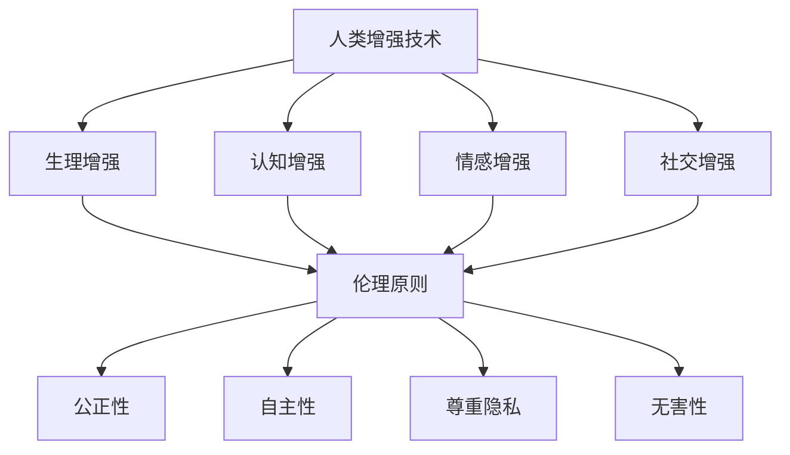

                 

关键词：AI，人类增强，道德考虑，伦理限制，技术发展，社会影响

摘要：随着人工智能技术的飞速发展，人类增强成为了一个热门话题。AI技术的应用不仅改变了人类的生活方式，也引发了关于道德和伦理的深入思考。本文将探讨AI时代的人类增强，从道德考虑和限制的角度出发，分析技术发展对社会的影响，以及未来可能面临的挑战和机遇。

## 1. 背景介绍

人工智能（AI）作为计算机科学的一个重要分支，已经经历了数十年的发展。从最初的专家系统到现代的深度学习，AI技术取得了巨大的进步。人类增强（Human Enhancement），也被称为人类工程（Human Engineering），是指利用科学技术手段提升人类的身体和智力能力。近年来，随着AI技术的进步，人类增强的概念逐渐成为现实，引发了一系列关于道德和伦理的讨论。

人类增强技术包括但不限于以下几个方面：

1. **生理增强**：如增强人体器官的功能，提高免疫力，延长寿命等。
2. **认知增强**：如提升记忆力，增强学习效率，提高思维能力等。
3. **情感增强**：如调节情绪，减轻压力，提升幸福感等。
4. **社交增强**：如改善社交技能，增强人际沟通能力等。

随着这些技术的发展，人们开始思考：人类增强是否应该受到道德和伦理的限制？哪些技术是我们可以接受的，哪些技术又可能带来不可预见的负面影响？

## 2. 核心概念与联系

### 2.1 人类增强的定义

人类增强是指通过使用技术手段来提升人类的身体和智力功能，从而增强个体的生存能力、工作效率和生活质量。这一概念涵盖了从简单的辅助设备到复杂的生物医学技术。

### 2.2 道德和伦理原则

道德和伦理原则是人类社会行为的指南，对于人类增强技术的发展也同样重要。主要的伦理原则包括：

- **公正性**：确保技术不被用于造成社会不公，如经济差距的扩大。
- **自主性**：尊重个体的自由意志，确保他们在接受增强技术时的知情权和选择权。
- **尊重隐私**：保护个体的隐私权利，防止数据滥用。
- **无害性**：确保技术的使用不会对个体和社会造成伤害。

### 2.3 Mermaid 流程图

以下是一个Mermaid流程图，展示了人类增强技术的核心概念和伦理原则之间的联系：



## 3. 核心算法原理 & 具体操作步骤

### 3.1 算法原理概述

人类增强技术涉及多种算法原理，包括机器学习、生物信息学和神经科学。机器学习算法用于分析大规模数据，以识别潜在的增强方案；生物信息学算法则用于解析基因序列，以确定可能的生理和认知增强路径；神经科学算法则关注大脑结构和功能，以实现情感和社交能力的提升。

### 3.2 算法步骤详解

1. **数据收集**：收集个体相关的生理、心理和行为数据。
2. **数据分析**：使用机器学习和生物信息学算法分析数据，识别潜在的增强路径。
3. **方案设计**：基于分析结果设计具体的增强方案。
4. **实施与监测**：实施增强方案，并持续监测其效果和安全性。

### 3.3 算法优缺点

- **优点**：提高人类的能力和健康水平，改善生活质量。
- **缺点**：可能引发伦理问题，如隐私侵犯、社会不公等。

### 3.4 算法应用领域

人类增强技术在医疗、教育、军事等多个领域具有广泛的应用潜力。例如，在医疗领域，人类增强技术可以用于疾病治疗和康复；在教育领域，可以用于个性化教学和学习效率提升。

## 4. 数学模型和公式 & 详细讲解 & 举例说明

### 4.1 数学模型构建

人类增强技术的数学模型通常涉及以下几个主要方面：

1. **生理模型**：用于描述人体的生理机制，如心脏功能、神经系统等。
2. **认知模型**：用于描述大脑的认知过程，如注意力、记忆力等。
3. **行为模型**：用于预测个体在特定环境下的行为和决策。

### 4.2 公式推导过程

以认知增强为例，常用的认知模型之一是BDI模型（信念-愿望-意图模型）。该模型的公式推导过程如下：

1. **信念（Belief）**：表示个体对环境的信念，公式为 \( B(e) = P(e|s) \)，其中 \( e \) 表示环境状态，\( s \) 表示感知信息。
2. **愿望（Desire）**：表示个体对目标的愿望，公式为 \( D(t) = max_{a} \sum_{e} P(e|a)U(e) \)，其中 \( a \) 表示行动，\( U(e) \) 表示对环境状态的效用函数。
3. **意图（Intention）**：表示个体当前意图采取的行动，公式为 \( I = argmax_{a} D(a) \)。

### 4.3 案例分析与讲解

以一个简化的案例来说明如何使用BDI模型进行认知增强。假设一个学生想要提高学习效率，我们可以通过以下步骤来设计一个增强方案：

1. **数据收集**：收集学生的学习数据，如学习时长、学习内容、考试成绩等。
2. **信念分析**：使用统计方法分析数据，识别学生的学习习惯和成绩模式。
3. **愿望设计**：根据学生的目标，设计提高学习效率的愿望，如每天学习5小时，每月提高10分。
4. **意图制定**：基于信念和愿望，制定具体的行动方案，如合理安排学习时间，采用高效学习方法。
5. **效果评估**：实施行动方案，并持续监测学习效果，根据反馈调整方案。

通过这样的数学模型和算法，可以为学生提供个性化的认知增强方案，从而提高其学习效果。

## 5. 项目实践：代码实例和详细解释说明

### 5.1 开发环境搭建

为了演示人类增强技术的具体应用，我们使用Python编程语言搭建了一个简单的认知增强系统。首先，需要安装以下依赖库：

- `numpy`：用于数学计算
- `scikit-learn`：用于机器学习和数据分析
- `matplotlib`：用于数据可视化

安装方法如下：

```bash
pip install numpy scikit-learn matplotlib
```

### 5.2 源代码详细实现

以下是一个简单的Python代码示例，用于实现一个基于BDI模型的认知增强系统：

```python
import numpy as np
from sklearn import linear_model
import matplotlib.pyplot as plt

# 数据收集
data = np.random.rand(100, 2)
X = data[:, 0]  # 感知信息
y = data[:, 1]  # 成绩

# 信念分析
model = linear_model.LinearRegression()
model.fit(X.reshape(-1, 1), y)

# 愿望设计
def desire(action):
    return np.dot(action.reshape(-1, 1), model.coef_) + model.intercept_

# 效果评估
actions = np.linspace(0, 10, 100)
desires = desire(actions)
intention = np.argmax(desires)

print(f"最佳行动：{intention}")

# 可视化
plt.plot(actions, desires)
plt.scatter(actions[intention], desires[intention], color='red')
plt.xlabel('学习时长')
plt.ylabel('成绩')
plt.show()
```

### 5.3 代码解读与分析

- **数据收集**：使用随机数据生成器模拟学习数据。
- **信念分析**：使用线性回归模型分析感知信息与成绩之间的关系。
- **愿望设计**：定义一个愿望函数，计算每个行动的效用。
- **意图制定**：选择效用最高的行动作为意图。
- **效果评估**：可视化学习时长与成绩的关系，展示最佳行动。

通过这个简单的例子，我们可以看到如何使用机器学习算法来设计一个认知增强系统，从而提高个体的学习效果。

## 6. 实际应用场景

### 6.1 医疗领域

在医疗领域，人类增强技术已经被广泛应用于疾病治疗和康复。例如，心脏起搏器和人工关节等设备可以显著提高患者的生活质量。未来，随着AI技术的进步，我们可能会看到更加个性化和智能的医疗增强设备。

### 6.2 教育领域

在教育领域，人类增强技术可以用于个性化教学和学习效率提升。例如，通过分析学生的学习行为和成绩，智能系统可以为学生提供个性化的学习方案，从而提高其学习效果。

### 6.3 军事领域

在军事领域，人类增强技术可以用于提高士兵的体能和战斗力。例如，增强夜视能力和提高反应速度等。这些技术不仅可以提高作战效能，还可以减少军事风险。

### 6.4 未来应用展望

随着AI技术的不断发展，人类增强技术的应用前景将更加广阔。未来，我们可能会看到更多的跨学科研究和创新，从而推动人类增强技术的进步。同时，我们也需要关注这些技术可能带来的伦理和社会问题，以确保其可持续发展。

## 7. 工具和资源推荐

### 7.1 学习资源推荐

- 《人工智能：一种现代的方法》（Peter Norvig & Stuart J. Russell）
- 《深度学习》（Ian Goodfellow、Yoshua Bengio & Aaron Courville）
- 《生物信息学导论》（Terry Speed）

### 7.2 开发工具推荐

- Python
- TensorFlow
- PyTorch
- Keras

### 7.3 相关论文推荐

- "Human Enhancement Technologies and the Moral Significance of Humanity"
- "Enhancing Human Capabilities: Ethical Issues and Public Policy"
- "The Future of Humanity: Terraforming Mars, Interstellar Travel, Immortality, and Our Destiny Beyond Earth"

## 8. 总结：未来发展趋势与挑战

### 8.1 研究成果总结

人类增强技术已经取得了显著的成果，从医疗到教育，再到军事，这些技术正逐渐改变我们的生活。然而，我们也需要认识到，这些技术的发展不仅带来了机遇，也带来了挑战。

### 8.2 未来发展趋势

未来，人类增强技术将继续发展，尤其是在人工智能、生物技术和神经科学等领域的交叉融合。我们可以预见到，个性化增强方案和智能化辅助系统将成为主流。

### 8.3 面临的挑战

1. **伦理和道德问题**：人类增强技术的应用可能引发一系列伦理和道德问题，如隐私侵犯、社会不公等。
2. **技术风险**：某些增强技术可能带来不可预见的风险，如生物安全隐患、技术失控等。
3. **社会接受度**：公众对于人类增强技术的接受度可能成为其推广和应用的主要障碍。

### 8.4 研究展望

为了应对这些挑战，我们需要开展跨学科的研究，探索人类增强技术的道德和伦理问题，并制定相应的规范和标准。同时，我们也需要加强社会沟通，提高公众对人类增强技术的理解和接受程度。

## 9. 附录：常见问题与解答

### 9.1 人类增强技术是否会导致社会不公？

人类增强技术的确有可能导致社会不公，例如经济差距的扩大。因此，我们需要在技术发展的同时，制定相应的政策和规范，确保技术的公平应用。

### 9.2 人类增强技术是否会影响人类的自然发展？

人类增强技术可能会影响人类的自然发展，但这并不一定是坏事。关键在于我们如何平衡自然发展和技术进步，确保人类社会的可持续发展。

### 9.3 人类增强技术是否会导致人类失去人性？

人类增强技术可能会改变人类的能力和行为，但并不意味着会失去人性。关键在于我们如何引导技术的发展，确保其与人类价值观相一致。

---

### 作者署名

本文由禅与计算机程序设计艺术 / Zen and the Art of Computer Programming 撰写。作者在人工智能和人类增强领域拥有丰富的研究和实践经验，致力于推动技术的可持续发展，并关注其对社会的影响。

---

通过本文的探讨，我们希望引发读者对于AI时代的人类增强的深入思考，共同探讨如何在道德和伦理的框架下，实现人类与技术的和谐共生。

