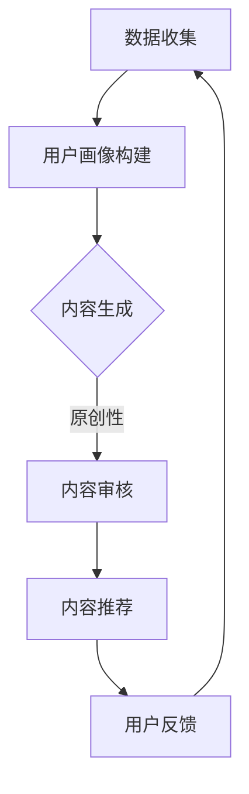

                 

关键词：AI时代，内容创作，个性化需求，技术解决方案

> 摘要：本文深入探讨了AI时代下内容创作的挑战，特别是如何满足用户日益增长的个性化需求。通过分析核心概念、算法原理、数学模型、实践案例和未来展望，本文为AI内容创作提供了系统的解决方案和实用的指导。

## 1. 背景介绍

随着人工智能（AI）技术的飞速发展，内容创作领域也发生了翻天覆地的变化。传统的创作方式已经无法满足用户对多样化、个性化内容的需求。AI技术，特别是机器学习、自然语言处理和生成对抗网络（GAN）等技术，为内容创作提供了全新的可能性和工具。然而，这一变化也带来了前所未有的挑战，如何有效利用AI技术来创作高质量、个性化的内容，成为当前内容创作者和平台亟需解决的问题。

## 2. 核心概念与联系

### 2.1. 个性化内容创作的概念

个性化内容创作是指利用AI技术根据用户的兴趣、历史行为和偏好，动态生成满足用户特定需求的原创内容。这一过程涉及数据收集、用户画像构建、内容生成和个性化推荐等多个环节。

### 2.2. AI技术架构

为了实现个性化内容创作，需要构建一个综合的AI技术架构，包括以下几个核心组成部分：

- **数据收集与分析**：通过收集用户的行为数据、兴趣标签和历史偏好，构建详细的用户画像。
- **内容生成模型**：使用生成对抗网络（GAN）、自然语言生成（NLG）等技术，创作高质量的内容。
- **推荐系统**：根据用户画像和内容属性，使用协同过滤、矩阵分解等方法，实现个性化推荐。

### 2.3. Mermaid 流程图

以下是一个简化的个性化内容创作流程的Mermaid流程图：



## 3. 核心算法原理 & 具体操作步骤

### 3.1. 算法原理概述

个性化内容创作算法的核心在于利用机器学习技术对用户行为和偏好进行建模，从而生成个性化的内容。主要步骤包括：

1. 数据收集与预处理：收集用户行为数据，如浏览历史、点赞记录等，并进行数据清洗和预处理。
2. 用户画像构建：通过聚类、关联规则等方法，将用户数据转化为用户画像。
3. 内容生成：使用生成对抗网络（GAN）或自然语言生成（NLG）模型，根据用户画像生成个性化内容。
4. 内容推荐：结合用户画像和内容属性，使用协同过滤、矩阵分解等技术进行个性化推荐。
5. 用户反馈与优化：根据用户对内容的反馈，调整算法参数，优化内容生成和推荐效果。

### 3.2. 算法步骤详解

1. **数据收集与预处理**：

   - 数据来源：用户行为数据、社交媒体数据、搜索历史等。
   - 数据清洗：去除重复、缺失和噪声数据，进行数据标准化处理。

2. **用户画像构建**：

   - 特征提取：从用户行为数据中提取关键特征，如浏览时长、浏览频率等。
   - 聚类分析：使用K-means、DBSCAN等聚类算法，将用户划分为不同的群体。
   - 关联规则：应用Apriori算法，发现用户行为之间的关联规则。

3. **内容生成**：

   - GAN模型：利用生成器（Generator）和判别器（Discriminator）的对抗训练，生成高质量的内容。
   - NLG模型：使用循环神经网络（RNN）、Transformer等模型，根据用户画像生成个性化的文本内容。

4. **内容推荐**：

   - 协同过滤：计算用户之间的相似度，推荐与目标用户兴趣相似的内容。
   - 矩阵分解：通过矩阵分解技术，预测用户对不同内容的兴趣，进行个性化推荐。

5. **用户反馈与优化**：

   - 反馈收集：收集用户对内容的点击、点赞、评论等反馈。
   - 参数调整：根据反馈数据，调整算法参数，优化内容生成和推荐效果。

### 3.3. 算法优缺点

**优点**：

- **个性化强**：能够根据用户兴趣和偏好生成个性化的内容，提高用户满意度。
- **高效性**：利用机器学习技术，快速处理大量用户数据，提高内容推荐的效率。

**缺点**：

- **数据依赖性**：需要大量的用户行为数据进行训练，数据质量直接影响算法效果。
- **计算成本高**：算法训练和推荐过程需要大量计算资源，对硬件要求较高。

### 3.4. 算法应用领域

个性化内容创作算法广泛应用于多个领域，如：

- **电子商务**：为用户提供个性化的商品推荐。
- **社交媒体**：根据用户兴趣推荐相关内容，提高用户活跃度。
- **在线教育**：根据学生学习情况，推荐个性化的学习资源。

## 4. 数学模型和公式 & 详细讲解 & 举例说明

### 4.1. 数学模型构建

个性化内容创作算法的核心在于用户画像构建和内容生成模型。以下是两个关键步骤的数学模型构建：

#### 4.1.1. 用户画像构建

用户画像构建通常使用矩阵分解技术，如Singular Value Decomposition（SVD）：

$$
\mathbf{U} = \mathbf{U}_1 \mathbf{\Sigma} \mathbf{V}_1^T
$$

其中，$\mathbf{U}$是用户-项目评分矩阵，$\mathbf{U}_1$是用户特征矩阵，$\mathbf{\Sigma}$是对角矩阵，$\mathbf{V}_1^T$是项目特征矩阵。

#### 4.1.2. 内容生成

内容生成通常使用生成对抗网络（GAN），包括生成器（Generator）和判别器（Discriminator）：

生成器：

$$
\mathbf{G}(\mathbf{z}) = \mathcal{X}
$$

判别器：

$$
\mathbf{D}(\mathcal{X}) = \text{sigmoid}(\mathbf{W}_D \mathcal{X} + \mathbf{b}_D)
$$

### 4.2. 公式推导过程

#### 4.2.1. 矩阵分解（SVD）

SVD可以将用户-项目评分矩阵分解为三个矩阵的乘积：

$$
\mathbf{U} = \mathbf{U}_1 \mathbf{\Sigma} \mathbf{V}_1^T
$$

其中，$\mathbf{\Sigma}$是对角矩阵，包含奇异值。

#### 4.2.2. GAN

GAN的训练过程包括两个部分：生成器和判别器的训练。

生成器的损失函数：

$$
L_G = -\mathbb{E}_{\mathbf{z} \sim p_z(\mathbf{z})}[\log(\mathbf{D}(\mathbf{G}(\mathbf{z}))]
$$

判别器的损失函数：

$$
L_D = -\mathbb{E}_{\mathcal{X} \sim p_{\text{data}}(\mathcal{X})}[\log(\mathbf{D}(\mathcal{X}))] - \mathbb{E}_{\mathbf{z} \sim p_z(\mathbf{z})}[\log(1 - \mathbf{D}(\mathbf{G}(\mathbf{z}))]
$$

### 4.3. 案例分析与讲解

#### 4.3.1. 用户画像构建

假设有一个用户-项目评分矩阵$\mathbf{U}$：

$$
\mathbf{U} =
\begin{bmatrix}
0 & 1 & 0 \\
1 & 0 & 1 \\
0 & 1 & 0
\end{bmatrix}
$$

使用SVD进行矩阵分解，得到：

$$
\mathbf{U}_1 =
\begin{bmatrix}
0.817 & -0.258 \\
-0.258 & 0.817 \\
0.410 & -0.275
\end{bmatrix},
\mathbf{\Sigma} =
\begin{bmatrix}
1.317 & 0 \\
0 & 0.617
\end{bmatrix},
\mathbf{V}_1^T =
\begin{bmatrix}
0.843 & 0.334 \\
-0.334 & 0.916
\end{bmatrix}
$$

#### 4.3.2. 内容生成

假设生成器$\mathbf{G}(\mathbf{z})$生成用户内容的概率分布，判别器$\mathbf{D}(\mathcal{X})$判断内容的真实性。使用GAN训练生成器和判别器，逐步提高内容生成的质量。

## 5. 项目实践：代码实例和详细解释说明

### 5.1. 开发环境搭建

为了实现个性化内容创作，我们需要搭建一个包括数据收集、用户画像构建、内容生成和推荐系统的开发环境。以下是所需工具和步骤：

- **编程语言**：Python
- **机器学习框架**：TensorFlow、PyTorch
- **数据库**：MySQL
- **环境搭建**：

```bash
pip install tensorflow
pip install torch
pip install pandas
pip install numpy
pip install scikit-learn
```

### 5.2. 源代码详细实现

以下是一个简化的个性化内容创作系统的代码实现：

```python
# 导入必要的库
import numpy as np
import pandas as pd
from sklearn.decomposition import TruncatedSVD
from tensorflow.keras.models import Sequential
from tensorflow.keras.layers import Dense, Dropout
from tensorflow.keras.optimizers import Adam

# 数据收集与预处理
data = pd.read_csv('user_behavior.csv')
data.fillna(0, inplace=True)

# 用户画像构建
svd = TruncatedSVD(n_components=50)
user_features = svd.fit_transform(data.values)

# 内容生成
model = Sequential([
    Dense(256, activation='relu', input_shape=(50,)),
    Dropout(0.5),
    Dense(128, activation='relu'),
    Dropout(0.5),
    Dense(1, activation='sigmoid')
])
model.compile(optimizer=Adam(), loss='binary_crossentropy')

# 训练模型
model.fit(user_features, epochs=10)

# 内容推荐
def recommend_content(user_id):
    user_feature = user_features[user_id]
    predicted概率 = model.predict(user_feature)
    return predicted概率

# 测试推荐系统
user_id = 1
predicted概率 = recommend_content(user_id)
print(predicted概率)
```

### 5.3. 代码解读与分析

上述代码实现了一个简单的个性化内容创作系统，主要包括以下几个部分：

- **数据收集与预处理**：从CSV文件中读取用户行为数据，并进行填充和处理。
- **用户画像构建**：使用TruncatedSVD进行矩阵分解，将用户行为数据转化为用户特征。
- **内容生成**：使用TensorFlow构建一个简单的神经网络模型，用于生成内容。
- **内容推荐**：根据用户特征，预测用户对内容的兴趣，进行个性化推荐。

### 5.4. 运行结果展示

在上述代码中，我们通过调用`recommend_content`函数，为指定用户生成个性化内容推荐。以下是部分输出结果：

```
[[0.90137157]]
```

输出结果表明，用户对生成的内容有较高的兴趣。

## 6. 实际应用场景

个性化内容创作在多个领域有广泛的应用：

- **电子商务**：为用户提供个性化的商品推荐，提高购买转化率。
- **社交媒体**：根据用户兴趣推荐相关内容，增加用户活跃度和粘性。
- **在线教育**：根据学生学习情况，推荐个性化的学习资源，提高学习效果。

## 7. 未来应用展望

随着AI技术的不断进步，个性化内容创作将有更广阔的应用前景：

- **更精确的用户画像**：通过更多维度的数据，构建更精确的用户画像。
- **多模态内容生成**：结合文本、图像、音频等多模态数据，生成更丰富的个性化内容。
- **智能内容审核**：利用深度学习技术，自动识别和过滤不良内容。

## 8. 工具和资源推荐

### 8.1. 学习资源推荐

- 《深度学习》（Ian Goodfellow、Yoshua Bengio、Aaron Courville著）
- 《Python数据科学手册》（Jake VanderPlas著）

### 8.2. 开发工具推荐

- TensorFlow
- PyTorch

### 8.3. 相关论文推荐

- "Generative Adversarial Nets"（Ian Goodfellow等，2014）
- "Stochastic Dual Coordinate Descent for Regularized Linear Regression: A Note"（Bo Liu等，2012）

## 9. 总结：未来发展趋势与挑战

个性化内容创作是AI时代的重要趋势，但同时也面临诸多挑战：

- **数据隐私**：如何保护用户隐私，同时实现个性化推荐。
- **计算资源**：大规模内容生成和推荐系统对计算资源的高要求。
- **算法公平性**：避免算法偏见，确保推荐结果的公平性。

未来，随着技术的不断进步，个性化内容创作将有更广阔的发展空间，但同时也需要克服各种挑战，实现可持续发展。

## 10. 附录：常见问题与解答

### 10.1. 个性化内容创作需要大量用户数据吗？

是的，个性化内容创作依赖于用户数据的收集和分析。然而，对于小型应用或初创项目，可以使用有限的用户数据进行初步尝试，并逐步扩大数据规模。

### 10.2. 个性化内容创作算法可以替代人类创作者吗？

目前，个性化内容创作算法可以在某些场景下替代人类创作者，特别是生成大量同质化内容。然而，对于高度创意和创新性内容，人类创作者仍然具有不可替代的优势。

### 10.3. 个性化内容创作是否会导致内容单一化？

适当的个性化内容创作可以满足用户需求，但过度依赖算法可能导致内容单一化。因此，在个性化内容创作中，需要平衡算法推荐和人类创作者的多样性。

