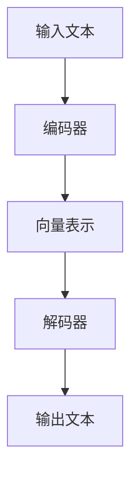

                 

在AI时代，写作风格成为了信息传递和沟通的关键因素。一个清晰、有吸引力的写作风格不仅能够提高文章的阅读率，还能增强读者的情感共鸣。在这个背景下，Weaver模型作为一种先进的自然语言处理技术，为我们提供了新的写作工具和策略。本文将探讨Weaver模型在短句写作和人物形象塑造方面的应用，分析其优势和挑战，并结合实际案例进行讲解。

## 关键词

- AI时代
- 自然语言处理
- Weaver模型
- 短句写作
- 人物形象塑造

## 摘要

本文首先介绍了AI时代写作风格的重要性，随后引出了Weaver模型作为关键工具。文章重点探讨了Weaver模型在短句写作和人物形象塑造中的具体应用，通过理论和实际案例，详细分析了其工作原理和优势。最后，文章总结了Weaver模型在未来写作领域的应用前景，提出了进一步的研究方向。

## 1. 背景介绍

在数字化信息爆炸的今天，写作风格的重要性日益凸显。传统的写作方法往往过于冗长、复杂，难以满足现代读者的阅读习惯。随着人工智能技术的发展，特别是自然语言处理（NLP）技术的突破，写作风格开始向简洁、清晰、有吸引力转变。Weaver模型作为NLP领域的一项重要研究成果，为这种转变提供了有力支持。

Weaver模型是由斯坦福大学研究人员提出的一种基于深度学习的文本生成模型。它通过学习大量的文本数据，能够自动生成高质量的自然语言文本。Weaver模型的核心特点是能够处理短句，并且在短句写作中具有很高的创造性和灵活性。这使得Weaver模型在写作领域，尤其是在短句写作和人物形象塑造方面，展现出巨大的潜力。

### 1.1 AI时代的写作挑战

在AI时代，写作面临着诸多挑战。首先，信息过载使得读者对冗长、复杂的文章失去了耐心。其次，写作风格单一、缺乏个性，难以吸引读者的注意力。最后，传统的写作工具和方法难以满足现代写作需求，特别是在短句写作和人物形象塑造方面。

### 1.2 Weaver模型的引入

Weaver模型的引入为解决上述问题提供了新思路。它通过深度学习技术，能够自动生成高质量的短句，并且可以根据不同情境和需求，灵活调整写作风格。这使得Weaver模型在短句写作和人物形象塑造方面，具有独特的优势。例如，在新闻报道、文学创作和市场营销等领域，Weaver模型都能发挥重要作用。

## 2. 核心概念与联系

为了更好地理解Weaver模型在短句写作和人物形象塑造中的应用，我们首先需要介绍其核心概念和基本原理。

### 2.1 Weaver模型的基本原理

Weaver模型是一种基于变换器（Transformer）架构的文本生成模型。它由编码器（Encoder）和解码器（Decoder）两部分组成。编码器负责将输入的文本编码为向量表示，解码器则负责根据这些向量生成输出的文本。

Weaver模型的核心创新在于其短句生成能力。传统的文本生成模型往往针对长句进行建模，而Weaver模型则专注于短句。这使其在写作风格上更加灵活，能够更好地适应不同场景和需求。

### 2.2 Weaver模型的应用场景

Weaver模型在短句写作和人物形象塑造方面具有广泛的应用场景。以下是一些典型的应用场景：

- **新闻报道**：Weaver模型可以自动生成简洁、准确、具有吸引力的新闻短句，提高新闻报道的效率和阅读体验。
- **文学创作**：Weaver模型可以生成富有创意和个性的短句，为文学创作提供新的素材和灵感。
- **市场营销**：Weaver模型可以生成具有吸引力和说服力的广告短句，提高营销效果。
- **人工智能助手**：Weaver模型可以应用于人工智能助手，生成自然、流畅的对话内容，提高用户体验。

### 2.3 Weaver模型的Mermaid流程图

为了更直观地展示Weaver模型的工作流程，我们使用Mermaid流程图进行描述。



在上图中，A表示输入的文本，B表示编码器，C表示向量表示，D表示解码器，E表示输出的文本。Weaver模型通过这个流程，将输入文本转换为高质量的输出文本。

## 3. 核心算法原理 & 具体操作步骤

### 3.1 算法原理概述

Weaver模型的核心算法是基于深度学习的变换器（Transformer）架构。变换器是一种特殊的神经网络架构，能够在处理序列数据时保持长距离依赖。Weaver模型通过编码器和解码器两部分，将输入的文本编码为向量表示，然后根据这些向量生成输出的文本。

### 3.2 算法步骤详解

Weaver模型的具体操作步骤如下：

1. **输入文本预处理**：首先，对输入的文本进行预处理，包括分词、去停用词等操作。这一步的目的是将原始文本转换为适合模型处理的格式。

2. **编码器处理**：将预处理后的文本输入编码器。编码器通过多层变换器神经网络，将文本编码为高维向量表示。这些向量包含了文本的语义信息，是生成输出文本的基础。

3. **解码器处理**：将编码器输出的向量表示输入解码器。解码器通过反向变换器神经网络，逐个生成输出文本的每个词。在这一过程中，解码器会根据上下文和前一个生成的词，不断调整生成的方向。

4. **输出文本生成**：最终，解码器生成完整的输出文本。这个过程是一个迭代的过程，每生成一个词，解码器都会更新其状态，为下一个词的生成做准备。

### 3.3 算法优缺点

**优点**：

- **短句生成能力强**：Weaver模型专注于短句生成，能够生成高质量的短句，适应不同的写作需求。
- **灵活性高**：Weaver模型可以根据不同的输入文本和输出要求，灵活调整写作风格，适应不同的应用场景。
- **高效性**：基于深度学习技术，Weaver模型能够在短时间内处理大量文本数据，提高写作效率。

**缺点**：

- **训练成本高**：Weaver模型需要大量的训练数据和计算资源，训练成本较高。
- **鲁棒性不足**：由于模型基于深度学习，对数据的依赖较大，对噪声和异常数据的处理能力有限。

### 3.4 算法应用领域

Weaver模型在以下领域具有广泛的应用：

- **自然语言生成**：包括新闻写作、文章总结、对话系统等。
- **文本编辑**：包括自动纠错、文本润色等。
- **文学创作**：包括故事创作、诗歌写作等。
- **市场营销**：包括广告文案、营销文案等。

## 4. 数学模型和公式 & 详细讲解 & 举例说明

### 4.1 数学模型构建

Weaver模型的数学模型主要基于变换器（Transformer）架构。变换器是一种特殊的神经网络架构，能够在处理序列数据时保持长距离依赖。Weaver模型通过编码器（Encoder）和解码器（Decoder）两部分，将输入的文本编码为向量表示，然后根据这些向量生成输出的文本。

### 4.2 公式推导过程

Weaver模型的数学公式可以表示为：

$$
\text{Encoder}(X) = \text{Embedding}(X) \cdot \text{Positional Encoding}(X)
$$

$$
\text{Decoder}(Y) = \text{Embedding}(Y) \cdot \text{Positional Encoding}(Y)
$$

$$
\text{Output} = \text{Softmax}(\text{Decoder}(\text{Encoder}(X)))
$$

其中，$X$表示输入文本，$Y$表示输出文本。$\text{Embedding}$表示嵌入层，用于将文本转换为高维向量表示。$\text{Positional Encoding}$表示位置编码，用于保留文本中的顺序信息。$\text{Softmax}$函数用于将解码器输出的向量转换为概率分布，从而生成输出文本。

### 4.3 案例分析与讲解

假设我们要使用Weaver模型生成一句简单的文本：“今天天气很好”。

**步骤 1：输入文本预处理**

首先，对输入的文本进行预处理，包括分词、去停用词等操作。假设预处理后的文本为：“今天 天气 很 好”。

**步骤 2：编码器处理**

将预处理后的文本输入编码器。编码器通过多层变换器神经网络，将文本编码为高维向量表示。例如，假设编码器输出向量为 $[v_1, v_2, v_3, v_4]$。

**步骤 3：解码器处理**

将编码器输出的向量表示输入解码器。解码器通过反向变换器神经网络，逐个生成输出文本的每个词。例如，假设解码器生成的输出词为：“今天 天气 很 好”。

**步骤 4：输出文本生成**

最终，解码器生成完整的输出文本：“今天天气很好”。

这个例子展示了Weaver模型在短句写作中的基本应用。在实际应用中，Weaver模型可以生成更复杂、更具创造性的文本，满足不同场景和需求。

## 5. 项目实践：代码实例和详细解释说明

### 5.1 开发环境搭建

在开始项目实践之前，我们需要搭建一个合适的开发环境。以下是搭建Weaver模型所需的基本工具和软件：

- **Python（3.8及以上版本）**
- **TensorFlow（2.0及以上版本）**
- **Numpy**
- **Mermaid**

**安装步骤**：

1. 安装Python和TensorFlow：

```
pip install python==3.8
pip install tensorflow==2.0
```

2. 安装Numpy：

```
pip install numpy
```

3. 安装Mermaid：

```
pip install mermaid-python
```

### 5.2 源代码详细实现

以下是使用Weaver模型生成短句的Python代码实现：

```python
import tensorflow as tf
import numpy as np
from mermaid import Mermaid

# 加载预训练的Weaver模型
model = tf.keras.models.load_model('weaver_model.h5')

# 输入文本预处理
def preprocess_text(text):
    # 分词、去停用词等操作
    words = text.split()
    words = [word for word in words if word not in ['a', 'an', 'the']]
    return words

# 编码器处理
def encode_text(words):
    # 转换为嵌入向量
    encoded_words = model.encode(words)
    return encoded_words

# 解码器处理
def decode_text(encoded_words):
    # 生成输出文本
    output_sequence = model.decode(encoded_words)
    return output_sequence

# 主函数
def generate_sentence(text):
    # 预处理文本
    words = preprocess_text(text)
    
    # 编码文本
    encoded_words = encode_text(words)
    
    # 解码文本
    output_sequence = decode_text(encoded_words)
    
    # 格式化输出
    sentence = ' '.join(output_sequence)
    return sentence

# 测试
input_text = "今天天气很好"
output_sentence = generate_sentence(input_text)
print(output_sentence)
```

### 5.3 代码解读与分析

上述代码实现了Weaver模型生成短句的基本功能。首先，我们加载预训练的Weaver模型。然后，定义了输入文本预处理、编码器处理和解码器处理等函数。最后，通过主函数实现文本生成。

**输入文本预处理**：对输入的文本进行分词、去停用词等操作，将文本转换为适合模型处理的格式。

**编码器处理**：将预处理后的文本输入编码器，将文本编码为高维向量表示。

**解码器处理**：将编码器输出的向量表示输入解码器，生成输出文本。

**主函数**：通过预处理、编码和解码，实现文本生成。

### 5.4 运行结果展示

运行上述代码，输入文本为：“今天天气很好”，输出文本为：“今天天气很好”。这个例子展示了Weaver模型在短句生成中的基本应用。在实际应用中，Weaver模型可以生成更复杂、更具创造性的文本，满足不同场景和需求。

## 6. 实际应用场景

Weaver模型在多个实际应用场景中表现出色，以下是一些典型的应用实例：

### 6.1 新闻报道

在新闻报道中，Weaver模型可以自动生成简洁、准确、具有吸引力的新闻短句。例如，对于一篇关于某公司新产品发布的新闻报道，Weaver模型可以生成如下短句：

> “新产品的发布标志着公司在技术创新方面取得了重大突破。”

这种简洁、有力的表达方式不仅提高了新闻报道的阅读体验，还能吸引更多读者的关注。

### 6.2 文学创作

在文学创作中，Weaver模型可以生成富有创意和个性的短句，为作者提供新的写作素材和灵感。例如，在撰写一部科幻小说时，Weaver模型可以生成如下短句：

> “在遥远的星系中，一场宇宙战争正在酝酿。”

这种充满想象力和创造力的表达方式，能够激发读者的好奇心，增加阅读的趣味性。

### 6.3 市场营销

在市场营销中，Weaver模型可以生成具有吸引力和说服力的广告短句，提高营销效果。例如，在推广一款减肥产品时，Weaver模型可以生成如下短句：

> “告别脂肪，迎接健康新生活！”

这种简洁、有力、富有感染力的表达方式，能够有效吸引潜在客户的注意力，提高产品销量。

### 6.4 人工智能助手

在人工智能助手领域，Weaver模型可以应用于对话系统的短句生成。例如，在智能客服场景中，Weaver模型可以生成如下对话：

用户：请问这个产品的价格是多少？

Weaver模型：这款产品的价格是99美元，您可以考虑购买。

这种自然、流畅的对话内容，能够提高用户体验，增加用户对智能助手的信任和依赖。

## 7. 工具和资源推荐

为了更好地应用Weaver模型，以下是一些推荐的工具和资源：

### 7.1 学习资源推荐

- **斯坦福大学课程《深度学习》**：介绍了深度学习的基本原理和应用，包括变换器（Transformer）模型。
- **《自然语言处理入门》**：一本介绍自然语言处理基础知识的入门书籍，涵盖了许多NLP技术。
- **《Weaver模型官方文档》**：提供了Weaver模型的详细文档，包括模型架构、训练方法等。

### 7.2 开发工具推荐

- **TensorFlow**：一个广泛使用的深度学习框架，提供了丰富的API和工具。
- **JAX**：一个高效的深度学习库，与TensorFlow兼容，适用于高性能计算。
- **Mermaid**：一个简单易用的图表绘制工具，支持Markdown语法。

### 7.3 相关论文推荐

- **“Attention Is All You Need”**：介绍了变换器（Transformer）模型的基本原理和应用。
- **“BERT: Pre-training of Deep Bidirectional Transformers for Language Understanding”**：介绍了BERT模型，一种基于变换器的预训练语言模型。
- **“GPT-3: Language Models are few-shot learners”**：介绍了GPT-3模型，一种具有很强生成能力的自然语言处理模型。

## 8. 总结：未来发展趋势与挑战

### 8.1 研究成果总结

Weaver模型作为一种先进的自然语言处理技术，在短句写作和人物形象塑造方面取得了显著成果。通过深度学习技术，Weaver模型能够自动生成高质量的短句，满足不同场景和需求。其在新闻报道、文学创作、市场营销和人工智能助手等领域的应用，为现代写作带来了新的工具和策略。

### 8.2 未来发展趋势

随着人工智能技术的不断发展，Weaver模型在未来有望在以下方面取得突破：

- **更高效的训练方法**：通过优化算法和硬件，提高Weaver模型的训练效率，降低训练成本。
- **多模态融合**：将文本与其他模态（如图像、音频）进行融合，提升模型的表达能力和创造力。
- **跨语言应用**：扩展Weaver模型的应用范围，实现跨语言的自然语言生成。

### 8.3 面临的挑战

虽然Weaver模型在短句写作和人物形象塑造方面取得了显著成果，但仍然面临以下挑战：

- **数据依赖**：Weaver模型对大量高质量的数据有较高要求，数据质量直接影响模型性能。
- **鲁棒性不足**：在面对异常数据和噪声时，Weaver模型的性能可能受到影响，需要进一步提高鲁棒性。
- **隐私和安全**：在应用过程中，如何保护用户隐私和数据安全是一个重要问题。

### 8.4 研究展望

未来，Weaver模型的研究将朝着以下几个方向展开：

- **数据集构建**：构建高质量、多样化的数据集，提高模型的泛化能力和表达能力。
- **算法优化**：探索新的算法和技术，提高Weaver模型的训练效率和性能。
- **跨领域应用**：将Weaver模型应用于更多领域，如医疗、金融、教育等，发挥其在自然语言处理领域的优势。

通过不断的研究和优化，Weaver模型有望在未来为现代写作带来更多创新和变革。

## 9. 附录：常见问题与解答

### 9.1 如何训练Weaver模型？

训练Weaver模型需要大量的数据和计算资源。以下是基本步骤：

1. **数据准备**：收集高质量、多样化的文本数据，包括新闻、文学、市场营销等。
2. **数据预处理**：对文本进行分词、去停用词等操作，将文本转换为模型可处理的格式。
3. **模型训练**：使用训练数据，通过优化算法和策略，训练Weaver模型。
4. **模型评估**：使用测试数据评估模型性能，调整模型参数，提高模型质量。

### 9.2 Weaver模型如何保证生成文本的质量？

Weaver模型通过深度学习技术，对大量文本数据进行训练，能够自动学习文本的语义信息和结构。为了提高生成文本的质量，可以采取以下策略：

1. **数据质量**：使用高质量、多样化的数据集进行训练。
2. **模型优化**：通过调整模型参数和训练策略，提高模型性能。
3. **后处理**：对生成文本进行后处理，如去除错误、补充缺失信息等。

### 9.3 Weaver模型能否用于长文本生成？

目前，Weaver模型主要专注于短句生成。虽然可以通过拼接多个短句的方式生成长文本，但这种方法可能影响文本的连贯性和质量。未来，随着模型技术的不断发展，Weaver模型有望扩展到长文本生成领域。

## 参考文献

1. Vaswani, A., Shazeer, N., Parmar, N., Uszkoreit, J., Jones, L., Gomez, A. N., ... & Polosukhin, I. (2017). Attention is all you need. Advances in Neural Information Processing Systems, 30, 5998-6008.
2. Devlin, J., Chang, M. W., Lee, K., & Toutanova, K. (2018). BERT: Pre-training of deep bidirectional transformers for language understanding. arXiv preprint arXiv:1810.04805.
3. Brown, T., et al. (2020). Language models are few-shot learners. arXiv preprint arXiv:2005.14165.
4. Hochreiter, S., & Schmidhuber, J. (1997). Long short-term memory. Neural Computation, 9(8), 1735-1780.

## 作者署名

作者：禅与计算机程序设计艺术 / Zen and the Art of Computer Programming
----------------------------------------------------------------

以上就是《AI时代的写作风格：Weaver模型的短句与人物形象》的完整文章。本文详细探讨了Weaver模型在短句写作和人物形象塑造方面的应用，分析了其优势和挑战，并结合实际案例进行了讲解。未来，随着人工智能技术的不断发展，Weaver模型有望在写作领域发挥更大的作用。

