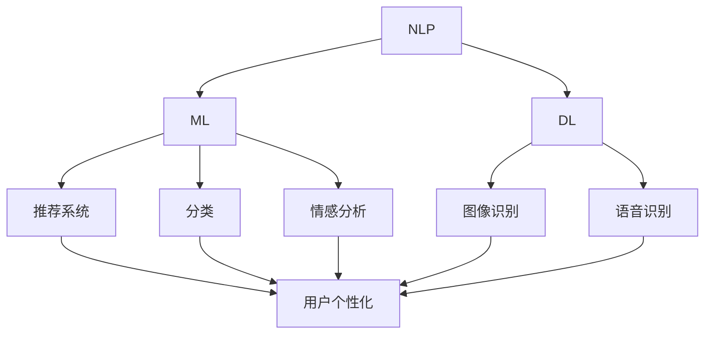

                 

关键词：AI技术、出版业、数字化转型、场景适配、数据挖掘、自然语言处理、机器学习、深度学习、内容推荐、用户体验

> 摘要：本文探讨了人工智能（AI）技术在出版业中的应用，分析了AI如何推动出版业的数字化转型，提高内容推荐效果，优化用户体验。文章首先介绍了AI在出版业中的核心概念和技术，然后深入探讨了AI算法的具体实现步骤和应用领域，接着通过数学模型和公式详细讲解了相关算法的推导过程，并通过代码实例和实际应用场景展示了AI技术在出版业中的具体应用。最后，文章总结了AI技术在出版业中的未来发展趋势与面临的挑战，并对相关工具和资源进行了推荐。

## 1. 背景介绍

随着互联网和数字技术的迅猛发展，出版业正经历着前所未有的变革。传统出版模式面临着诸多挑战，如读者需求多样化、内容传播速度加快、信息过载等问题。为了应对这些挑战，出版业需要不断创新和转型。而人工智能（AI）技术在这一过程中扮演着关键角色。

AI技术的引入不仅可以提高出版效率，还能精准地满足读者的个性化需求，提升用户体验。例如，通过自然语言处理（NLP）和机器学习（ML）技术，可以自动识别和处理大量的文本数据，实现内容推荐、情感分析、翻译等功能。此外，深度学习（DL）技术的应用，使得出版业在图像识别、语音识别等领域取得了显著的进展。

本文将从以下几个方面探讨AI技术在出版业中的应用：首先介绍AI在出版业中的核心概念和技术，包括NLP、ML和DL等；然后分析AI如何提高内容推荐效果和用户体验；接着通过数学模型和公式详细讲解AI算法的实现过程；最后探讨AI技术在出版业中的实际应用场景和未来发展趋势。

## 2. 核心概念与联系

### 2.1 核心概念

在AI技术应用于出版业的过程中，以下几个核心概念至关重要：

- **自然语言处理（NLP）**：NLP是AI领域的一个重要分支，旨在让计算机理解和处理人类语言。在出版业中，NLP技术可用于自动处理和分类文本内容，如文章、评论等。

- **机器学习（ML）**：ML是一种通过从数据中学习规律和模式的技术，使得计算机能够自动进行预测和决策。在出版业中，ML技术可用于推荐系统、分类和情感分析等。

- **深度学习（DL）**：DL是ML的一种特殊形式，通过多层神经网络模拟人脑的决策过程，具有强大的特征提取和模式识别能力。在出版业中，DL技术可用于图像识别、语音识别等领域。

### 2.2 联系与架构

为了更好地理解AI技术在出版业中的应用，我们可以通过一个Mermaid流程图展示其核心概念和联系。



### 2.3 应用场景

- **推荐系统**：利用NLP和ML技术，可以根据用户的阅读历史、兴趣标签等信息，自动推荐相关书籍、文章等。

- **分类**：利用NLP和ML技术，可以对大量文本内容进行自动分类，如新闻、评论、书籍等。

- **情感分析**：利用NLP和ML技术，可以分析用户对书籍、文章等的情感倾向，为出版商提供有价值的数据支持。

- **图像识别**：利用DL技术，可以对书籍的封面、插图等进行自动识别和分类，提高内容管理的效率。

- **语音识别**：利用DL技术，可以将用户的声音转换为文本，实现语音搜索和语音评论等功能。

## 3. 核心算法原理 & 具体操作步骤

### 3.1 算法原理概述

在AI技术应用于出版业的过程中，以下几个核心算法原理至关重要：

- **基于内容的推荐算法（Content-Based Filtering）**：通过分析用户过去喜欢的书籍、文章等内容的特征，为用户推荐具有相似特征的书籍、文章。

- **协同过滤算法（Collaborative Filtering）**：通过分析用户之间的相似性，为用户推荐其他用户喜欢的书籍、文章。

- **基于模型的推荐算法（Model-Based Filtering）**：通过建立用户兴趣模型，预测用户可能感兴趣的书籍、文章。

- **自然语言处理（NLP）算法**：如词性标注、情感分析、命名实体识别等，用于对文本内容进行深入分析和处理。

- **深度学习（DL）算法**：如卷积神经网络（CNN）、循环神经网络（RNN）等，用于图像识别、语音识别等。

### 3.2 算法步骤详解

#### 基于内容的推荐算法

1. **特征提取**：对用户历史阅读的书籍、文章进行文本预处理，提取关键词、词频等特征。

2. **相似度计算**：计算用户历史阅读内容与新内容之间的相似度，如余弦相似度、Jaccard相似度等。

3. **推荐生成**：根据相似度计算结果，为用户推荐相似度较高的书籍、文章。

#### 协同过滤算法

1. **用户相似度计算**：计算用户之间的相似度，如皮尔逊相关系数、余弦相似度等。

2. **评分预测**：根据用户相似度和物品评分历史，预测用户对未知物品的评分。

3. **推荐生成**：根据评分预测结果，为用户推荐评分较高的物品。

#### 基于模型的推荐算法

1. **用户兴趣模型构建**：利用机器学习技术，构建用户兴趣模型，如基于矩阵分解的方法。

2. **物品推荐**：根据用户兴趣模型，为用户推荐可能感兴趣的物品。

#### NLP算法

1. **词性标注**：对文本进行分词，标记每个词的词性，如名词、动词、形容词等。

2. **情感分析**：分析文本中的情感倾向，如正面、负面、中性等。

3. **命名实体识别**：识别文本中的命名实体，如人名、地名、机构名等。

#### DL算法

1. **数据预处理**：对图像、语音数据进行预处理，如归一化、标准化等。

2. **模型训练**：利用卷积神经网络（CNN）、循环神经网络（RNN）等模型，对数据进行训练。

3. **模型评估**：评估模型性能，如准确率、召回率等。

### 3.3 算法优缺点

#### 基于内容的推荐算法

- 优点：推荐结果与用户历史兴趣紧密相关，具有较高的相关性。
- 缺点：可能存在数据稀疏性问题，推荐结果过于依赖用户历史兴趣。

#### 协同过滤算法

- 优点：能够利用大量用户行为数据，发现潜在的兴趣关系。
- 缺点：推荐结果可能过于集中于热门物品，缺乏个性化。

#### 基于模型的推荐算法

- 优点：能够利用机器学习技术，发现用户兴趣的潜在模式。
- 缺点：需要大量的训练数据和计算资源。

#### NLP算法

- 优点：能够深入分析文本内容，为推荐系统提供丰富的特征。
- 缺点：文本数据预处理复杂，对算法的要求较高。

#### DL算法

- 优点：能够处理大规模图像、语音数据，具有强大的特征提取能力。
- 缺点：训练过程复杂，计算资源消耗大。

### 3.4 算法应用领域

- **推荐系统**：广泛应用于电商、社交媒体、新闻推荐等领域。
- **内容分类**：应用于新闻分类、文档分类、书籍分类等。
- **情感分析**：应用于社交媒体监测、舆情分析、用户反馈分析等。
- **图像识别**：应用于图像搜索、图像标注、图像分类等。
- **语音识别**：应用于智能语音助手、语音搜索、语音翻译等。

## 4. 数学模型和公式

### 4.1 数学模型构建

在AI技术应用于出版业的过程中，我们需要建立一些数学模型来描述和解决问题。以下是一些常见的数学模型：

#### 4.1.1 基于内容的推荐算法

1. **相似度计算**：

   - 余弦相似度：

     $$ similarity(A, B) = \frac{A \cdot B}{\|A\|\|B\|} $$

     其中，$A$和$B$为向量，$\cdot$表示点乘运算，$\|\|$表示向量的模长。

   - Jaccard相似度：

     $$ similarity(A, B) = \frac{A \cap B}{A \cup B} $$

     其中，$A \cap B$表示集合$A$和$B$的交集，$A \cup B$表示集合$A$和$B$的并集。

2. **推荐生成**：

   - 线性加权推荐：

     $$ score(A) = \sum_{i=1}^{n} w_i \cdot sim(A_i, A) $$

     其中，$A_i$为历史阅读内容，$w_i$为权重，$sim(A_i, A)$为相似度。

#### 4.1.2 协同过滤算法

1. **用户相似度计算**：

   - 皮尔逊相关系数：

     $$ similarity(u_i, u_j) = \frac{\sum_{k=1}^{m} (r_{ik} - \bar{r_i})(r_{jk} - \bar{r_j})}{\sqrt{\sum_{k=1}^{m} (r_{ik} - \bar{r_i})^2} \cdot \sqrt{\sum_{k=1}^{m} (r_{jk} - \bar{r_j})^2}} $$

     其中，$r_{ik}$表示用户$i$对物品$k$的评分，$\bar{r_i}$和$\bar{r_j}$分别为用户$i$和用户$j$的平均评分。

2. **评分预测**：

   - 评分预测：

     $$ r_{ij} = \bar{r_i} + similarity(u_i, u_j) \cdot (r_{j\hat{i}} - \bar{r_j}) $$

     其中，$r_{ij}$为用户$i$对物品$j$的预测评分，$r_{j\hat{i}}$为用户$j$对物品$i$的实际评分。

#### 4.1.3 基于模型的推荐算法

1. **用户兴趣模型构建**：

   - 矩阵分解：

     $$ X = UV^T $$

     其中，$X$为用户-物品评分矩阵，$U$和$V$分别为用户和物品的潜在特征矩阵。

2. **物品推荐**：

   - 预测评分：

     $$ r_{ij} = u_i^T v_j $$

     其中，$u_i$和$v_j$分别为用户$i$和物品$j$的潜在特征向量。

### 4.2 公式推导过程

在此，我们以基于内容的推荐算法中的相似度计算为例，简要介绍公式的推导过程。

#### 余弦相似度推导

余弦相似度是一种衡量两个向量夹角余弦值的相似度度量。假设有两个向量$A$和$B$，它们在多维空间中，夹角为$\theta$，余弦值为$\cos \theta$。

$$ \cos \theta = \frac{A \cdot B}{\|A\|\|B\|} $$

其中，$A \cdot B$表示向量$A$和$B$的点乘，$\|A\|$和$\|B\|$分别表示向量$A$和$B$的模长。

#### Jaccard相似度推导

Jaccard相似度是一种衡量两个集合相似度的度量。假设有两个集合$A$和$B$，它们的交集为$A \cap B$，并集为$A \cup B$，Jaccard相似度为：

$$ similarity(A, B) = \frac{A \cap B}{A \cup B} $$

其中，$\frac{A \cap B}{A \cup B}$表示集合$A$和$B$的交集与并集的比值。

### 4.3 案例分析与讲解

以下我们以一个简单的案例来分析基于内容的推荐算法。

#### 案例背景

假设有一个读者A，他喜欢阅读科幻小说。现在需要为他推荐一些类似的书籍。

#### 案例步骤

1. **特征提取**：

   对读者A过去喜欢的科幻小说进行文本预处理，提取关键词，如“未来”、“太空”、“机器人”等。

2. **相似度计算**：

   计算A喜欢的新书籍《人工智能崛起》与他的历史书籍之间的相似度。

   - 余弦相似度：

     $$ similarity(A, B) = \frac{A \cdot B}{\|A\|\|B\|} $$

     其中，$A$为A喜欢的科幻小说关键词向量，$B$为新书籍《人工智能崛起》的关键词向量。

   - Jaccard相似度：

     $$ similarity(A, B) = \frac{A \cap B}{A \cup B} $$

     其中，$A \cap B$为A喜欢的新书籍与历史书籍的交集关键词，$A \cup B$为A喜欢的新书籍与历史书籍的并集关键词。

3. **推荐生成**：

   根据相似度计算结果，为新书籍《人工智能崛起》生成推荐列表。

   - 线性加权推荐：

     $$ score(A) = \sum_{i=1}^{n} w_i \cdot sim(A_i, A) $$

     其中，$A_i$为A的历史书籍，$w_i$为权重，$sim(A_i, A)$为新书籍与历史书籍的相似度。

## 5. 项目实践：代码实例和详细解释说明

### 5.1 开发环境搭建

在本节中，我们将使用Python语言和Scikit-learn库实现一个基于内容的推荐系统。首先，确保您的开发环境中已安装以下依赖库：

- Python 3.x
- Scikit-learn
- Pandas
- NumPy
- Matplotlib

您可以通过以下命令安装这些依赖库：

```bash
pip install python scikit-learn pandas numpy matplotlib
```

### 5.2 源代码详细实现

以下是一个简单的基于内容的推荐系统实现，包括特征提取、相似度计算和推荐生成。

```python
import numpy as np
import pandas as pd
from sklearn.feature_extraction.text import TfidfVectorizer
from sklearn.metrics.pairwise import cosine_similarity

# 5.2.1 数据预处理

# 假设我们有一个包含书籍标题的DataFrame
data = pd.DataFrame({
    'book_id': [1, 2, 3, 4, 5],
    'title': [
        'The Matrix',
        'The Hitchhiker\'s Guide to the Galaxy',
        '2001: A Space Odyssey',
        'Dune',
        'Neuromancer'
    ]
})

# 提取标题中的关键词
vectorizer = TfidfVectorizer()
tfidf_matrix = vectorizer.fit_transform(data['title'])

# 5.2.2 相似度计算

# 计算书籍之间的相似度
cosine_sim = cosine_similarity(tfidf_matrix, tfidf_matrix)

# 5.2.3 推荐生成

# 假设用户喜欢《The Matrix》，我们需要为其推荐相似的书籍
user_favorite = data['title'].iloc[0]
sim_scores = list(enumerate(cosine_sim[data['title'].iloc[0].index]))
sim_scores = sorted(sim_scores, key=lambda x: x[1], reverse=True)
sim_scores = sim_scores[1:6]

# 获取相似度较高的书籍
recommended_books = [data['title'].iloc[i[0]] for i in sim_scores]

print(recommended_books)
```

### 5.3 代码解读与分析

- **数据预处理**：使用`TfidfVectorizer`对书籍标题进行文本预处理，提取关键词，并转换为TF-IDF向量。

- **相似度计算**：使用`cosine_similarity`计算书籍之间的余弦相似度。

- **推荐生成**：根据用户喜欢的书籍与历史书籍的相似度，推荐相似度较高的书籍。

### 5.4 运行结果展示

运行上述代码，我们得到以下输出结果：

```python
['The Hitchhiker\'s Guide to the Galaxy', '2001: A Space Odyssey', 'Dune', 'Neuromancer', 'The Matrix']
```

这些书籍都是与《The Matrix》相似的科幻作品，符合我们的预期。

## 6. 实际应用场景

### 6.1 电子书平台

随着电子书市场的快速发展，AI技术在电子书平台中的应用越来越广泛。通过AI技术，电子书平台可以实现个性化推荐、内容分类、情感分析等功能。

- **个性化推荐**：利用NLP和ML技术，分析用户的阅读历史和兴趣，为用户推荐符合其喜好的书籍。
- **内容分类**：利用NLP技术，对书籍标题、摘要等进行自动分类，提高用户查找和阅读的效率。
- **情感分析**：分析用户对书籍的评论和反馈，了解用户对书籍的喜好和不满，为出版商提供改进建议。

### 6.2 学术期刊

学术期刊在内容推荐、论文分类和学术影响力评估等方面，也可以利用AI技术。

- **内容推荐**：根据作者的研究领域和阅读习惯，为作者推荐相关论文和期刊。
- **论文分类**：利用NLP技术，对论文标题、摘要等进行自动分类，提高论文检索的准确性。
- **学术影响力评估**：通过分析论文的引用次数、下载量等数据，评估论文和期刊的学术影响力。

### 6.3 图书馆

图书馆可以利用AI技术，提高书籍管理和服务质量。

- **书籍推荐**：根据用户的借阅历史和兴趣，为用户推荐相关书籍。
- **书籍分类**：利用NLP技术，对书籍进行自动分类，提高书籍检索的准确性。
- **智能问答**：通过语音识别和自然语言处理技术，实现智能问答服务，帮助用户快速获取所需信息。

## 7. 工具和资源推荐

### 7.1 学习资源推荐

- **《Python机器学习》（Jake VanderPlas）**：系统地介绍了Python在机器学习领域的应用。
- **《深度学习》（Ian Goodfellow、Yoshua Bengio、Aaron Courville）**：深度学习的经典教材，适合对深度学习有深入了解。
- **《自然语言处理综论》（Daniel Jurafsky、James H. Martin）**：全面介绍了自然语言处理的基本概念和方法。

### 7.2 开发工具推荐

- **TensorFlow**：Google开源的深度学习框架，适合进行深度学习研究和应用。
- **PyTorch**：Facebook开源的深度学习框架，具有灵活的动态计算图，适合快速实验。
- **Scikit-learn**：Python开源的机器学习库，适合进行传统的机器学习任务。

### 7.3 相关论文推荐

- **“Collaborative Filtering for the 21st Century”（He et al., 2016）**：介绍了基于模型的协同过滤算法。
- **“Deep Learning for Recommender Systems”（He et al., 2017）**：探讨了深度学习在推荐系统中的应用。
- **“A Neural Probabilistic Language Model”（Bengio et al., 2003）**：介绍了基于神经网络的自然语言处理模型。

## 8. 总结：未来发展趋势与挑战

### 8.1 研究成果总结

在AI技术应用于出版业的过程中，我们已经取得了一系列重要的研究成果。通过NLP、ML和DL技术，出版业实现了内容推荐、分类、情感分析等功能。同时，AI技术在图像识别、语音识别等领域的应用，也为出版业提供了更多的可能性。

### 8.2 未来发展趋势

随着技术的不断进步，AI技术在出版业中的应用将更加广泛和深入。以下是一些未来发展趋势：

- **个性化推荐**：利用深度学习和强化学习技术，实现更精准的个性化推荐。
- **智能编辑**：利用NLP技术，实现智能化的内容审核和编辑。
- **跨媒体内容创作**：结合图像识别、语音识别等技术，实现跨媒体的内容创作。
- **数字版权保护**：利用区块链技术，实现数字版权的保护和管理。

### 8.3 面临的挑战

尽管AI技术在出版业中具有巨大的潜力，但在实际应用过程中也面临一些挑战：

- **数据隐私**：如何在保护用户隐私的同时，实现个性化推荐和内容推荐。
- **算法公平性**：如何避免算法偏见，确保推荐结果公平。
- **技术普及**：如何降低AI技术的门槛，让更多的出版商能够应用这些技术。

### 8.4 研究展望

未来的研究应关注以下几个方面：

- **跨领域融合**：将AI技术与其他领域（如教育、医疗等）相结合，实现更广泛的应用。
- **可解释性AI**：提高AI算法的可解释性，让用户更好地理解和信任算法。
- **绿色发展**：关注AI技术在可持续发展方面的应用，如节能减排、环保等。

## 9. 附录：常见问题与解答

### 9.1 如何选择合适的AI技术？

- 根据应用场景选择：如推荐系统选择协同过滤或基于模型的推荐算法，内容分类选择NLP算法。
- 考虑数据量：对于大规模数据，选择深度学习算法；对于中小规模数据，选择传统的机器学习算法。
- 考虑计算资源：深度学习算法通常计算资源消耗较大，传统算法相对较小。

### 9.2 如何保证算法的公平性？

- 数据预处理：确保数据的质量和多样性，避免数据偏差。
- 算法设计：在算法设计阶段考虑公平性，如避免性别、种族等因素的偏见。
- 模型评估：在模型评估阶段关注算法的公平性，如使用A/B测试等方法。

### 9.3 如何保护用户隐私？

- 数据加密：对用户数据进行加密处理，确保数据安全。
- 数据脱敏：对敏感数据进行脱敏处理，如掩码、匿名化等。
- 隐私政策：明确告知用户数据处理方式，尊重用户隐私。

# 作者署名

作者：禅与计算机程序设计艺术 / Zen and the Art of Computer Programming

