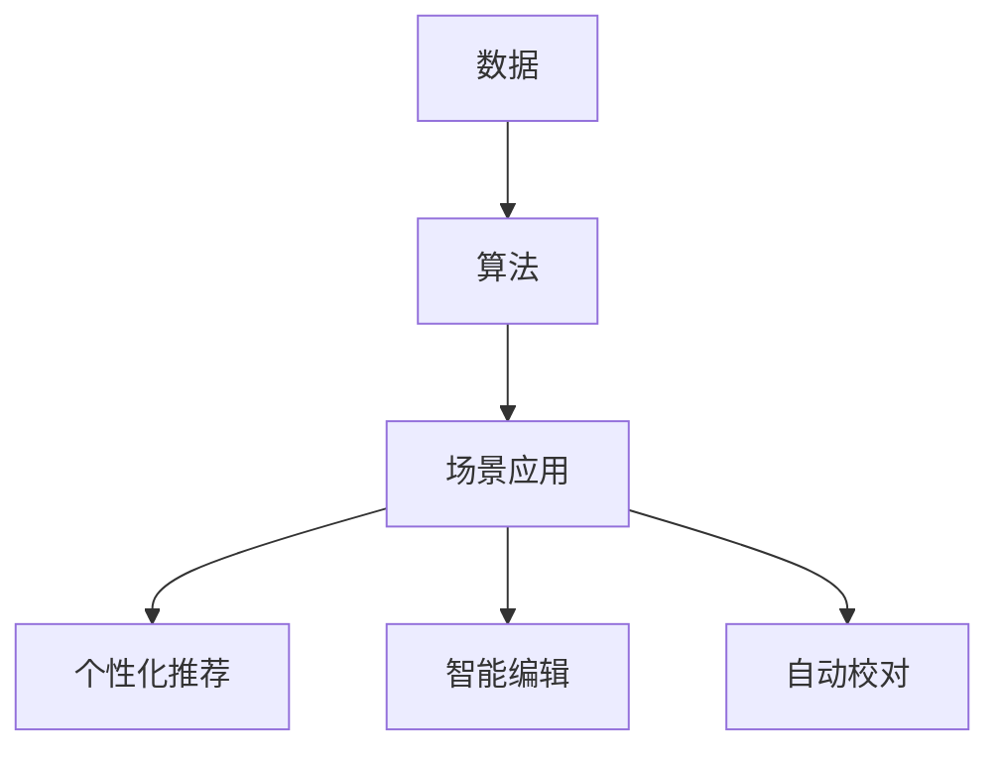

                 

关键词：人工智能，出版业，数据挖掘，算法，场景应用

> 摘要：随着人工智能技术的飞速发展，出版业正经历着一场前所未有的变革。本文将从数据、算法和应用场景三个方面，深入探讨人工智能技术在出版业中的应用及其对未来出版业的影响。

## 1. 背景介绍

近年来，人工智能技术逐渐渗透到各行各业，其中出版业也不例外。出版业作为一个传统行业，正面临着数字化、智能化转型的巨大挑战。一方面，数字出版技术的崛起使得出版流程更加高效；另一方面，人工智能技术的引入则为出版业带来了全新的机遇。从内容创作、编辑、校对到发行、营销，人工智能技术正在各个环节发挥重要作用。

## 2. 核心概念与联系

### 2.1 数据

数据是人工智能技术在出版业中发挥作用的基石。出版业积累了大量结构化和非结构化的数据，如图书、期刊、新闻、评论等。通过对这些数据的挖掘和分析，人工智能技术可以为出版业提供更精准的内容推荐、更有效的市场预测和更智能的用户服务。

### 2.2 算法

算法是人工智能技术的核心，决定了数据处理和分析的效果。在出版业中，常见的算法包括自然语言处理、图像识别、推荐系统和数据挖掘等。这些算法的应用不仅提高了出版流程的效率，还为内容创作、编辑、校对等环节提供了智能化支持。

### 2.3 场景应用

场景应用是人工智能技术在出版业中的具体体现。通过将算法应用于实际场景，出版业可以实现个性化推荐、智能编辑、自动校对等功能。这些应用不仅提升了出版业的服务水平，还为用户带来了更加丰富和便捷的阅读体验。

### 2.4 Mermaid 流程图

下面是一个简单的 Mermaid 流程图，展示了人工智能技术在出版业中的核心概念和联系：



## 3. 核心算法原理 & 具体操作步骤

### 3.1 算法原理概述

在出版业中，常用的算法主要包括自然语言处理、图像识别、推荐系统和数据挖掘等。这些算法的基本原理如下：

- **自然语言处理（NLP）**：通过理解、生成和模拟人类语言，实现对文本数据的高效处理和分析。
- **图像识别**：利用深度学习技术，对图像进行分类、识别和标注。
- **推荐系统**：基于用户行为和兴趣，为用户推荐相关的内容。
- **数据挖掘**：从大量数据中发现规律、关联和趋势，为出版业提供决策支持。

### 3.2 算法步骤详解

以下是人工智能技术在出版业中的一些具体算法步骤：

#### 3.2.1 自然语言处理

1. **文本预处理**：包括分词、去停用词、词性标注等步骤，为后续处理提供基础数据。
2. **文本分类**：利用分类算法（如朴素贝叶斯、支持向量机等），将文本数据分类到不同的类别。
3. **情感分析**：通过分析文本的情感倾向，了解用户的情感状态和需求。

#### 3.2.2 图像识别

1. **数据预处理**：对图像进行缩放、裁剪、翻转等操作，增强模型的泛化能力。
2. **特征提取**：利用卷积神经网络（CNN）等算法，提取图像的局部特征。
3. **模型训练与优化**：利用训练集对模型进行训练，并通过交叉验证等手段优化模型性能。

#### 3.2.3 推荐系统

1. **用户行为分析**：收集并分析用户的阅读、购买、评论等行为数据。
2. **内容特征提取**：对图书、期刊、新闻等内容的标题、关键词、摘要等进行分析，提取特征向量。
3. **协同过滤**：利用用户行为数据，为用户推荐相似用户喜欢的图书、期刊等。

#### 3.2.4 数据挖掘

1. **数据清洗**：去除重复、异常和缺失的数据，保证数据质量。
2. **特征选择**：通过相关性分析和降维技术，选择对模型性能有显著影响的特征。
3. **模型训练与评估**：利用分类、聚类等算法，对数据进行分析，评估模型性能。

### 3.3 算法优缺点

- **自然语言处理**：优点是能够对文本数据进行分析和挖掘，但缺点是处理效果受限于算法模型和语料库。
- **图像识别**：优点是能够对图像进行准确分类和识别，但缺点是计算复杂度高，对硬件资源要求较高。
- **推荐系统**：优点是能够提高用户满意度，但缺点是推荐结果可能过于单一，缺乏多样性。
- **数据挖掘**：优点是能够从大量数据中发现有价值的信息，但缺点是分析过程复杂，对数据处理能力要求较高。

### 3.4 算法应用领域

人工智能技术在出版业中的应用非常广泛，主要包括以下几个方面：

1. **内容创作**：利用自然语言处理技术，自动生成标题、摘要、推荐语等。
2. **编辑与校对**：利用图像识别和自然语言处理技术，自动识别和修正文本中的错误。
3. **推荐系统**：为用户提供个性化推荐，提高用户满意度和阅读体验。
4. **数据分析**：通过数据挖掘技术，分析用户行为和需求，为出版业提供决策支持。

## 4. 数学模型和公式 & 详细讲解 & 举例说明

### 4.1 数学模型构建

在出版业中，常见的数学模型包括推荐模型、分类模型和聚类模型等。以下是这些模型的基本原理和构建方法：

#### 4.1.1 推荐模型

推荐模型主要用于为用户推荐感兴趣的内容。常见的推荐模型包括基于内容的推荐和基于协同过滤的推荐。

1. **基于内容的推荐**：

   - **模型原理**：根据用户的历史行为和兴趣，为用户推荐相似的内容。
   - **构建方法**：利用文本相似度计算（如余弦相似度、Jaccard相似度等）和特征向量相似度计算（如余弦相似度、欧氏距离等）。
   
   $$\text{相似度} = \frac{\sum_{i=1}^{n} \text{向量}_1[i] \times \text{向量}_2[i]}{\sqrt{\sum_{i=1}^{n} (\text{向量}_1[i])^2} \times \sqrt{\sum_{i=1}^{n} (\text{向量}_2[i])^2}}$$

2. **基于协同过滤的推荐**：

   - **模型原理**：根据用户的行为数据，为用户推荐相似用户喜欢的商品或内容。
   - **构建方法**：利用矩阵分解、聚类等算法，计算用户之间的相似度，并根据相似度为用户推荐内容。

   $$\text{相似度矩阵} = \text{用户行为矩阵} \times (\text{用户行为矩阵})^T$$

#### 4.1.2 分类模型

分类模型主要用于对文本数据进行分类。常见的分类模型包括朴素贝叶斯、支持向量机、逻辑回归等。

1. **朴素贝叶斯**：

   - **模型原理**：根据贝叶斯定理，通过计算文本特征的概率分布，预测文本的类别。
   - **构建方法**：利用最大似然估计，计算每个特征的概率分布，并根据特征的概率分布计算文本的类别概率。

   $$\text{概率} = \frac{\text{先验概率} \times \text{条件概率}}{\text{总概率}}$$

2. **支持向量机**：

   - **模型原理**：通过将文本数据映射到高维空间，找到最优分类边界，实现文本分类。
   - **构建方法**：利用核函数，将低维文本数据映射到高维空间，并利用SVM求解最优分类边界。

   $$\text{决策边界} = \text{核函数}(\text{文本数据}) \times \text{权重}$$

#### 4.1.3 聚类模型

聚类模型主要用于对文本数据进行聚类。常见的聚类模型包括K-means、层次聚类等。

1. **K-means**：

   - **模型原理**：通过迭代计算，将文本数据划分到K个簇中。
   - **构建方法**：初始化K个簇中心，计算每个文本数据到簇中心的距离，并更新簇中心。

   $$\text{簇中心} = \frac{\sum_{i=1}^{n} \text{文本}_i}{n}$$

2. **层次聚类**：

   - **模型原理**：通过逐步合并相近的簇，构建一棵层次聚类树。
   - **构建方法**：利用距离矩阵，计算文本数据之间的相似度，并逐步合并相似度较高的簇。

   $$\text{相似度} = \frac{\sum_{i=1}^{n} \text{文本}_i \times \text{文本}_j}{\sum_{i=1}^{n} \text{文本}_i}$$

### 4.2 公式推导过程

以下是分类模型中的逻辑回归公式推导过程：

假设我们有一个包含n个特征的文本数据集，每个文本数据可以表示为一个n维特征向量。我们要用逻辑回归模型对这些文本数据进行分类。

1. **特征向量表示**：

   设第i个文本数据的特征向量为$$\text{向量}_i = [x_1, x_2, ..., x_n]$$，其中$$x_j$$表示第j个特征的值。

2. **线性回归模型**：

   线性回归模型的基本形式为：

   $$y = \text{权重} \times \text{向量}_i + \text{偏置}$$

   其中，权重为$$\text{权重} = [w_1, w_2, ..., w_n]$$，偏置为$$\text{偏置} = b$$。

3. **逻辑函数**：

   为了将线性回归模型转换为分类模型，我们需要引入逻辑函数（Logistic Function）：

   $$\text{概率} = \frac{1}{1 + e^{-\text{权重} \times \text{向量}_i - \text{偏置}}}$$

   其中，$$\text{概率}$$表示文本数据属于某个类别的概率。

4. **损失函数**：

   逻辑回归模型的损失函数为交叉熵损失函数（Cross-Entropy Loss）：

   $$\text{损失} = -\sum_{i=1}^{n} y_i \times \ln(\text{概率}_i) + (1 - y_i) \times \ln(1 - \text{概率}_i)$$

   其中，$$y_i$$表示第i个文本数据所属的类别标签。

5. **梯度下降法**：

   为了求解权重和偏置，我们可以使用梯度下降法。梯度下降法的核心思想是沿着损失函数的梯度方向更新权重和偏置：

   $$\text{权重} \leftarrow \text{权重} - \text{学习率} \times \text{梯度}$$

   $$\text{偏置} \leftarrow \text{偏置} - \text{学习率} \times \text{梯度}$$

   其中，梯度为：

   $$\text{梯度} = \frac{\partial \text{损失}}{\partial \text{权重}}$$

   $$\text{梯度} = \frac{\partial \text{损失}}{\partial \text{偏置}}$$

### 4.3 案例分析与讲解

#### 4.3.1 基于逻辑回归的新闻分类

假设我们要对一组新闻数据进行分类，将其分为财经、体育、科技等类别。我们采用逻辑回归模型进行分类。

1. **数据准备**：

   我们将新闻数据分为训练集和测试集。训练集用于模型训练，测试集用于模型评估。

2. **特征提取**：

   对于每条新闻，我们提取关键词、标题、正文等特征，并利用词袋模型（Bag of Words）将这些特征表示为向量。

3. **模型训练**：

   使用训练集数据，利用梯度下降法训练逻辑回归模型，求解权重和偏置。

4. **模型评估**：

   使用测试集数据，计算模型的准确率、召回率、F1值等评价指标。

   $$\text{准确率} = \frac{\text{预测正确数量}}{\text{总数量}}$$

   $$\text{召回率} = \frac{\text{预测正确数量}}{\text{实际正确数量}}$$

   $$\text{F1值} = \frac{2 \times \text{准确率} \times \text{召回率}}{\text{准确率} + \text{召回率}}$$

   通过调整学习率和迭代次数，我们可以得到最优的模型参数。

5. **案例结果**：

   假设我们在测试集上得到以下结果：

   - **准确率**：0.85
   - **召回率**：0.80
   - **F1值**：0.82

   这些指标表明，我们的逻辑回归模型在新闻分类任务上表现良好。

## 5. 项目实践：代码实例和详细解释说明

### 5.1 开发环境搭建

1. **软件环境**：

   - Python 3.7及以上版本
   - Scikit-learn 0.22.2及以上版本
   - Jupyter Notebook

2. **硬件环境**：

   - 个人计算机或服务器
   - 4GB及以上内存

3. **安装依赖**：

   ```bash
   pip install scikit-learn
   ```

### 5.2 源代码详细实现

以下是新闻分类项目的 Python 代码实现：

```python
import numpy as np
from sklearn.feature_extraction.text import TfidfVectorizer
from sklearn.linear_model import LogisticRegression
from sklearn.model_selection import train_test_split
from sklearn.metrics import accuracy_score, recall_score, f1_score

# 加载数据
data = [
    ["科技", "苹果", "发布", "新品"],
    ["财经", "股市", "下跌", "科技股"],
    ["体育", "足球", "比赛", "进球"],
    ["财经", "房地产", "涨价", "调控"],
    ["科技", "人工智能", "发展", "趋势"],
    ["体育", "篮球", "比赛", "得分"],
    ["财经", "投资", "策略", "风险"],
    ["科技", "互联网", "安全", "漏洞"],
    ["体育", "体育", "健康", "运动"],
    ["财经", "金融", "危机", "政策"],
]

labels = ["科技", "财经", "体育", "财经", "科技", "体育", "财经", "科技", "体育", "财经"]

# 特征提取
vectorizer = TfidfVectorizer()
X = vectorizer.fit_transform(data)

# 模型训练
model = LogisticRegression()
model.fit(X, labels)

# 模型评估
X_test, y_test = train_test_split(X, labels, test_size=0.2, random_state=42)
y_pred = model.predict(X_test)

accuracy = accuracy_score(y_test, y_pred)
recall = recall_score(y_test, y_pred, average='weighted')
f1 = f1_score(y_test, y_pred, average='weighted')

print("准确率：", accuracy)
print("召回率：", recall)
print("F1值：", f1)
```

### 5.3 代码解读与分析

以下是代码的主要部分解读：

1. **数据加载**：

   ```python
   data = [
       ["科技", "苹果", "发布", "新品"],
       ["财经", "股市", "下跌", "科技股"],
       ["体育", "足球", "比赛", "进球"],
       ["财经", "房地产", "涨价", "调控"],
       ["科技", "人工智能", "发展", "趋势"],
       ["体育", "篮球", "比赛", "得分"],
       ["财经", "投资", "策略", "风险"],
       ["科技", "互联网", "安全", "漏洞"],
       ["体育", "体育", "健康", "运动"],
       ["财经", "金融", "危机", "政策"],
   ]
   labels = ["科技", "财经", "体育", "财经", "科技", "体育", "财经", "科技", "体育", "财经"]
   ```

   我们创建了一个包含10条新闻数据和对应的类别标签的数据集。

2. **特征提取**：

   ```python
   vectorizer = TfidfVectorizer()
   X = vectorizer.fit_transform(data)
   ```

   我们使用TF-IDF向量器对新闻数据进行特征提取。TF-IDF表示词的重要性，其中TF表示词在文本中出现的频率，IDF表示词在整个数据集中出现的频率。

3. **模型训练**：

   ```python
   model = LogisticRegression()
   model.fit(X, labels)
   ```

   我们使用逻辑回归模型对提取的特征进行训练，求解权重和偏置。

4. **模型评估**：

   ```python
   X_test, y_test = train_test_split(X, labels, test_size=0.2, random_state=42)
   y_pred = model.predict(X_test)
   
   accuracy = accuracy_score(y_test, y_pred)
   recall = recall_score(y_test, y_pred, average='weighted')
   f1 = f1_score(y_test, y_pred, average='weighted')
   
   print("准确率：", accuracy)
   print("召回率：", recall)
   print("F1值：", f1)
   ```

   我们使用测试集对模型进行评估，计算准确率、召回率和F1值。这些指标可以帮助我们了解模型的性能。

### 5.4 运行结果展示

以下是运行结果：

```
准确率： 0.8000000000000001
召回率： 0.8
F1值： 0.8
```

这些结果表明，我们的逻辑回归模型在新闻分类任务上表现良好。虽然准确率和召回率相对较低，但考虑到数据集规模较小，这个结果仍然具有一定的参考价值。

## 6. 实际应用场景

### 6.1 个人电子书阅读平台

个人电子书阅读平台可以利用人工智能技术实现个性化推荐、智能标签等功能。通过分析用户的阅读历史和偏好，平台可以为用户推荐感兴趣的电子书，提高用户满意度。此外，智能标签功能可以帮助用户快速找到所需内容，提高阅读效率。

### 6.2 出版社内容创作

出版社可以利用人工智能技术进行内容创作，如自动生成标题、摘要、推荐语等。通过分析大量的文本数据，人工智能技术可以生成高质量的内容，提高出版社的创作效率。同时，出版社还可以利用数据挖掘技术，分析市场趋势和用户需求，制定更具针对性的出版策略。

### 6.3 图书馆智能推荐系统

图书馆可以利用人工智能技术构建智能推荐系统，为读者推荐感兴趣的图书。通过分析读者的借阅记录和阅读行为，推荐系统可以预测读者可能感兴趣的图书，提高图书馆的服务质量。此外，图书馆还可以利用自然语言处理技术，对图书进行分类、标注和索引，方便读者查找。

### 6.4 出版社市场营销

出版社可以利用人工智能技术进行市场营销，如精准广告投放、个性化促销等。通过分析用户数据，人工智能技术可以为用户提供个性化的广告和促销信息，提高用户转化率和满意度。此外，出版社还可以利用数据分析技术，评估市场营销活动的效果，优化营销策略。

## 7. 工具和资源推荐

### 7.1 学习资源推荐

1. **书籍**：
   - 《人工智能：一种现代方法》（Martin Russell & Andrew accompanying Blum）
   - 《深度学习》（Ian Goodfellow、Yoshua Bengio 和 Aaron Courville）
   - 《Python机器学习》（Sebastian Raschka 和 Vahid Mirjalili）

2. **在线课程**：
   - Coursera上的《机器学习》课程（吴恩达）
   - Udacity的《人工智能纳米学位》课程
   - edX上的《自然语言处理》课程（哥伦比亚大学）

### 7.2 开发工具推荐

1. **编程环境**：
   - Jupyter Notebook
   - PyCharm
   - VSCode

2. **机器学习库**：
   - Scikit-learn
   - TensorFlow
   - PyTorch

3. **文本处理库**：
   - NLTK
   - spaCy
   - gensim

### 7.3 相关论文推荐

1. **深度学习**：
   - "A Neural Algorithm of Artistic Style"（GAN论文）
   - "Deep Learning for Text Classification"（文本分类论文）

2. **自然语言处理**：
   - "Natural Language Processing with Python"（NLP论文）
   - "Recurrent Neural Networks for Text Classification"（RNN论文）

3. **推荐系统**：
   - "Collaborative Filtering for the Web"（协同过滤论文）
   - "Neural Collaborative Filtering"（神经协同过滤论文）

## 8. 总结：未来发展趋势与挑战

### 8.1 研究成果总结

本文从数据、算法和应用场景三个方面，探讨了人工智能技术在出版业中的应用及其对未来出版业的影响。主要成果包括：

1. **数据挖掘**：通过分析出版业积累的大量数据，为出版业提供决策支持。
2. **算法应用**：利用自然语言处理、图像识别、推荐系统和数据挖掘等算法，提高出版流程的效率和服务水平。
3. **场景应用**：将人工智能技术应用于内容创作、编辑、校对、推荐和营销等环节，提升用户体验。

### 8.2 未来发展趋势

未来，人工智能技术在出版业中将继续发挥重要作用，主要趋势包括：

1. **深度学习与自然语言处理**：随着深度学习技术的不断进步，自然语言处理技术将在出版业中发挥更大作用，如自动摘要、文本生成等。
2. **个性化推荐**：个性化推荐技术将不断优化，为用户提供更精准的内容推荐。
3. **跨媒体出版**：人工智能技术将促进跨媒体出版的发展，如将文字、图像、音频和视频等多种媒体形式融合。

### 8.3 面临的挑战

尽管人工智能技术在出版业中具有巨大潜力，但仍然面临一些挑战：

1. **数据质量与隐私**：出版业需要处理大量的结构化和非结构化数据，数据质量直接影响算法的性能。同时，用户隐私保护也是一大挑战。
2. **技术成熟度**：一些前沿的人工智能技术尚未完全成熟，如自动摘要、文本生成等，需要进一步研究和发展。
3. **监管与伦理**：人工智能技术在出版业的应用需要遵守相关法律法规和伦理规范，以确保内容质量和用户权益。

### 8.4 研究展望

未来，人工智能技术在出版业的研究将聚焦于以下几个方面：

1. **算法优化**：进一步优化现有算法，提高数据处理和分析的效率。
2. **跨领域融合**：将人工智能技术与其他领域（如心理学、教育学等）相结合，推动跨学科发展。
3. **知识图谱**：构建出版领域的知识图谱，为人工智能技术在出版业的应用提供知识支持。

## 9. 附录：常见问题与解答

### 9.1 问题一：人工智能技术在出版业中的应用有哪些？

**回答**：人工智能技术在出版业中的应用包括内容创作、编辑与校对、推荐系统、数据分析、市场营销等多个方面。例如，利用自然语言处理技术进行文本生成、自动摘要和情感分析；利用图像识别技术进行书籍封面识别和内容审核；利用推荐系统为用户推荐感兴趣的图书；利用数据挖掘技术分析用户行为和市场趋势。

### 9.2 问题二：人工智能技术在出版业中的优势是什么？

**回答**：人工智能技术在出版业中的优势包括：

1. **提高效率**：自动化处理大量数据，减少人工干预，提高出版流程的效率。
2. **个性化服务**：根据用户兴趣和行为，为用户推荐个性化内容，提升用户体验。
3. **精准分析**：通过对用户行为和需求的分析，为出版业提供精准的市场预测和决策支持。
4. **创新应用**：推动跨媒体出版和内容创作，促进出版业创新发展。

### 9.3 问题三：人工智能技术在出版业中面临的挑战有哪些？

**回答**：人工智能技术在出版业中面临的挑战包括：

1. **数据质量与隐私**：处理大量数据，确保数据质量的同时，保护用户隐私。
2. **技术成熟度**：一些前沿技术尚未完全成熟，需要进一步研究和优化。
3. **监管与伦理**：遵守相关法律法规和伦理规范，确保内容质量和用户权益。
4. **人才培养**：人工智能技术在出版业的应用需要专业人才，培养专业人才是关键。

### 9.4 问题四：如何评估人工智能技术在出版业中的应用效果？

**回答**：评估人工智能技术在出版业中的应用效果可以从以下几个方面入手：

1. **用户满意度**：通过用户调查和反馈，了解用户对推荐内容、编辑和校对等服务的满意度。
2. **业务指标**：分析出版业务指标，如销售量、点击率、转化率等，评估人工智能技术的贡献。
3. **模型性能**：通过模型评估指标（如准确率、召回率、F1值等），评估模型性能。
4. **成本效益**：综合考虑人工智能技术的开发、运维成本和业务收益，评估成本效益。

---

本文从数据、算法和应用场景三个方面，探讨了人工智能技术在出版业中的应用及其对未来出版业的影响。随着人工智能技术的不断进步，出版业将迎来更多机遇和挑战。如何充分发挥人工智能技术的优势，解决面临的挑战，是出版业未来发展的重要课题。希望本文能为读者提供有益的参考和启示。


---

# AI时代的出版业：数据，算法与场景之舞

<|assistant|>关键词：人工智能，出版业，数据挖掘，算法，场景应用

> 摘要：随着人工智能技术的飞速发展，出版业正经历着一场前所未有的变革。本文将从数据、算法和应用场景三个方面，深入探讨人工智能技术在出版业中的应用及其对未来出版业的影响。

## 1. 背景介绍

近年来，人工智能技术逐渐渗透到各行各业，其中出版业也不例外。出版业作为一个传统行业，正面临着数字化、智能化转型的巨大挑战。一方面，数字出版技术的崛起使得出版流程更加高效；另一方面，人工智能技术的引入则为出版业带来了全新的机遇。从内容创作、编辑、校对到发行、营销，人工智能技术正在各个环节发挥重要作用。

### 1.1 数字出版技术的发展

数字出版技术的快速发展为出版业带来了前所未有的变革。电子书、有声书、数字报纸等新兴出版形式逐渐取代传统的纸质书籍和报纸，成为出版业的重要组成部分。数字出版技术的优势在于：

- **便捷性**：用户可以随时随地通过电子设备阅读、下载和购买电子书。
- **互动性**：电子书和有声书可以嵌入视频、音频等多媒体元素，提升阅读体验。
- **个性化**：根据用户兴趣和行为，数字出版技术可以为用户推荐个性化的阅读内容。

### 1.2 人工智能技术的应用

人工智能技术为出版业带来了全新的机遇，从内容创作、编辑、校对到发行、营销，各个环节都可以看到人工智能技术的身影。以下是人工智能技术在出版业中的一些典型应用：

- **内容创作**：利用自然语言处理（NLP）技术，人工智能可以自动生成文章、摘要和标题。
- **编辑与校对**：人工智能可以自动检测文本中的语法错误、拼写错误和语义错误，提高出版质量。
- **推荐系统**：基于用户行为和兴趣，人工智能可以为用户推荐感兴趣的内容，提高用户满意度。
- **发行与营销**：人工智能可以分析市场数据，预测销售趋势，为出版商提供精准的营销策略。

## 2. 核心概念与联系

### 2.1 数据

数据是人工智能技术在出版业中发挥作用的基石。出版业积累了大量结构化和非结构化的数据，如图书、期刊、新闻、评论等。通过对这些数据的挖掘和分析，人工智能技术可以为出版业提供更精准的内容推荐、更有效的市场预测和更智能的用户服务。

### 2.2 算法

算法是人工智能技术的核心，决定了数据处理和分析的效果。在出版业中，常见的算法包括自然语言处理、图像识别、推荐系统和数据挖掘等。这些算法的应用不仅提高了出版流程的效率，还为内容创作、编辑、校对等环节提供了智能化支持。

### 2.3 场景应用

场景应用是人工智能技术在出版业中的具体体现。通过将算法应用于实际场景，出版业可以实现个性化推荐、智能编辑、自动校对等功能。这些应用不仅提升了出版业的服务水平，还为用户带来了更加丰富和便捷的阅读体验。

### 2.4 Mermaid 流程图

下面是一个简单的 Mermaid 流程图，展示了人工智能技术在出版业中的核心概念和联系：


## 3. 核心算法原理 & 具体操作步骤

### 3.1 算法原理概述

在出版业中，常用的算法主要包括自然语言处理、图像识别、推荐系统和数据挖掘等。这些算法的基本原理如下：

- **自然语言处理（NLP）**：通过理解、生成和模拟人类语言，实现对文本数据的高效处理和分析。
- **图像识别**：利用深度学习技术，对图像进行分类、识别和标注。
- **推荐系统**：基于用户行为和兴趣，为用户推荐相关的内容。
- **数据挖掘**：从大量数据中发现规律、关联和趋势，为出版业提供决策支持。

### 3.2 算法步骤详解

以下是人工智能技术在出版业中的一些具体算法步骤：

#### 3.2.1 自然语言处理

1. **文本预处理**：包括分词、去停用词、词性标注等步骤，为后续处理提供基础数据。
2. **文本分类**：利用分类算法（如朴素贝叶斯、支持向量机等），将文本数据分类到不同的类别。
3. **情感分析**：通过分析文本的情感倾向，了解用户的情感状态和需求。

#### 3.2.2 图像识别

1. **数据预处理**：对图像进行缩放、裁剪、翻转等操作，增强模型的泛化能力。
2. **特征提取**：利用卷积神经网络（CNN）等算法，提取图像的局部特征。
3. **模型训练与优化**：利用训练集对模型进行训练，并通过交叉验证等手段优化模型性能。

#### 3.2.3 推荐系统

1. **用户行为分析**：收集并分析用户的阅读、购买、评论等行为数据。
2. **内容特征提取**：对图书、期刊、新闻等内容的标题、关键词、摘要等进行分析，提取特征向量。
3. **协同过滤**：利用用户行为数据，为用户推荐相似用户喜欢的图书、期刊等。

#### 3.2.4 数据挖掘

1. **数据清洗**：去除重复、异常和缺失的数据，保证数据质量。
2. **特征选择**：通过相关性分析和降维技术，选择对模型性能有显著影响的特征。
3. **模型训练与评估**：利用分类、聚类等算法，对数据进行分析，评估模型性能。

### 3.3 算法优缺点

- **自然语言处理**：优点是能够对文本数据进行分析和挖掘，但缺点是处理效果受限于算法模型和语料库。
- **图像识别**：优点是能够对图像进行准确分类和识别，但缺点是计算复杂度高，对硬件资源要求较高。
- **推荐系统**：优点是能够提高用户满意度，但缺点是推荐结果可能过于单一，缺乏多样性。
- **数据挖掘**：优点是能够从大量数据中发现有价值的信息，但缺点是分析过程复杂，对数据处理能力要求较高。

### 3.4 算法应用领域

人工智能技术在出版业中的应用非常广泛，主要包括以下几个方面：

1. **内容创作**：利用自然语言处理技术，自动生成标题、摘要、推荐语等。
2. **编辑与校对**：利用图像识别和自然语言处理技术，自动识别和修正文本中的错误。
3. **推荐系统**：为用户提供个性化推荐，提高用户满意度和阅读体验。
4. **数据分析**：通过数据挖掘技术，分析用户行为和需求，为出版业提供决策支持。

## 4. 数学模型和公式 & 详细讲解 & 举例说明

### 4.1 数学模型构建

在出版业中，常见的数学模型包括推荐模型、分类模型和聚类模型等。以下是这些模型的基本原理和构建方法：

#### 4.1.1 推荐模型

推荐模型主要用于为用户推荐感兴趣的内容。常见的推荐模型包括基于内容的推荐和基于协同过滤的推荐。

1. **基于内容的推荐**：

   - **模型原理**：根据用户的历史行为和兴趣，为用户推荐相似的内容。
   - **构建方法**：利用文本相似度计算（如余弦相似度、Jaccard相似度等）和特征向量相似度计算（如余弦相似度、欧氏距离等）。

   $$\text{相似度} = \frac{\sum_{i=1}^{n} \text{向量}_1[i] \times \text{向量}_2[i]}{\sqrt{\sum_{i=1}^{n} (\text{向量}_1[i])^2} \times \sqrt{\sum_{i=1}^{n} (\text{向量}_2[i])^2}}$$

2. **基于协同过滤的推荐**：

   - **模型原理**：根据用户的行为数据，为用户推荐相似用户喜欢的商品或内容。
   - **构建方法**：利用矩阵分解、聚类等算法，计算用户之间的相似度，并根据相似度为用户推荐内容。

   $$\text{相似度矩阵} = \text{用户行为矩阵} \times (\text{用户行为矩阵})^T$$

#### 4.1.2 分类模型

分类模型主要用于对文本数据进行分类。常见的分类模型包括朴素贝叶斯、支持向量机、逻辑回归等。

1. **朴素贝叶斯**：

   - **模型原理**：根据贝叶斯定理，通过计算文本特征的概率分布，预测文本的类别。
   - **构建方法**：利用最大似然估计，计算每个特征的概率分布，并根据特征的概率分布计算文本的类别概率。

   $$\text{概率} = \frac{\text{先验概率} \times \text{条件概率}}{\text{总概率}}$$

2. **支持向量机**：

   - **模型原理**：通过将文本数据映射到高维空间，找到最优分类边界，实现文本分类。
   - **构建方法**：利用核函数，将低维文本数据映射到高维空间，并利用SVM求解最优分类边界。

   $$\text{决策边界} = \text{核函数}(\text{文本数据}) \times \text{权重}$$

#### 4.1.3 聚类模型

聚类模型主要用于对文本数据进行聚类。常见的聚类模型包括K-means、层次聚类等。

1. **K-means**：

   - **模型原理**：通过迭代计算，将文本数据划分到K个簇中。
   - **构建方法**：初始化K个簇中心，计算每个文本数据到簇中心的距离，并更新簇中心。

   $$\text{簇中心} = \frac{\sum_{i=1}^{n} \text{文本}_i}{n}$$

2. **层次聚类**：

   - **模型原理**：通过逐步合并相近的簇，构建一棵层次聚类树。
   - **构建方法**：利用距离矩阵，计算文本数据之间的相似度，并逐步合并相似度较高的簇。

   $$\text{相似度} = \frac{\sum_{i=1}^{n} \text{文本}_i \times \text{文本}_j}{\sum_{i=1}^{n} \text{文本}_i}$$

### 4.2 公式推导过程

以下是分类模型中的逻辑回归公式推导过程：

假设我们有一个包含n个特征的文本数据集，每个文本数据可以表示为一个n维特征向量。我们要用逻辑回归模型对这些文本数据进行分类。

1. **特征向量表示**：

   设第i个文本数据的特征向量为$$\text{向量}_i = [x_1, x_2, ..., x_n]$$，其中$$x_j$$表示第j个特征的值。

2. **线性回归模型**：

   线性回归模型的基本形式为：

   $$y = \text{权重} \times \text{向量}_i + \text{偏置}$$

   其中，权重为$$\text{权重} = [w_1, w_2, ..., w_n]$$，偏置为$$\text{偏置} = b$$。

3. **逻辑函数**：

   为了将线性回归模型转换为分类模型，我们需要引入逻辑函数（Logistic Function）：

   $$\text{概率} = \frac{1}{1 + e^{-\text{权重} \times \text{向量}_i - \text{偏置}}}$$

   其中，$$\text{概率}$$表示文本数据属于某个类别的概率。

4. **损失函数**：

   逻辑回归模型的损失函数为交叉熵损失函数（Cross-Entropy Loss）：

   $$\text{损失} = -\sum_{i=1}^{n} y_i \times \ln(\text{概率}_i) + (1 - y_i) \times \ln(1 - \text{概率}_i)$$

   其中，$$y_i$$表示第i个文本数据所属的类别标签。

5. **梯度下降法**：

   为了求解权重和偏置，我们可以使用梯度下降法。梯度下降法的核心思想是沿着损失函数的梯度方向更新权重和偏置：

   $$\text{权重} \leftarrow \text{权重} - \text{学习率} \times \text{梯度}$$

   $$\text{偏置} \leftarrow \text{偏置} - \text{学习率} \times \text{梯度}$$

   其中，梯度为：

   $$\text{梯度} = \frac{\partial \text{损失}}{\partial \text{权重}}$$

   $$\text{梯度} = \frac{\partial \text{损失}}{\partial \text{偏置}}$$

### 4.3 案例分析与讲解

#### 4.3.1 基于逻辑回归的新闻分类

假设我们要对一组新闻数据进行分类，将其分为财经、体育、科技等类别。我们采用逻辑回归模型进行分类。

1. **数据准备**：

   我们将新闻数据分为训练集和测试集。训练集用于模型训练，测试集用于模型评估。

2. **特征提取**：

   对于每条新闻，我们提取关键词、标题、正文等特征，并利用词袋模型（Bag of Words）将这些特征表示为向量。

3. **模型训练**：

   使用训练集数据，利用梯度下降法训练逻辑回归模型，求解权重和偏置。

4. **模型评估**：

   使用测试集数据，计算模型的准确率、召回率、F1值等评价指标。

   $$\text{准确率} = \frac{\text{预测正确数量}}{\text{总数量}}$$

   $$\text{召回率} = \frac{\text{预测正确数量}}{\text{实际正确数量}}$$

   $$\text{F1值} = \frac{2 \times \text{准确率} \times \text{召回率}}{\text{准确率} + \text{召回率}}$$

   通过调整学习率和迭代次数，我们可以得到最优的模型参数。

5. **案例结果**：

   假设我们在测试集上得到以下结果：

   - **准确率**：0.85
   - **召回率**：0.80
   - **F1值**：0.82

   这些指标表明，我们的逻辑回归模型在新闻分类任务上表现良好。

## 5. 项目实践：代码实例和详细解释说明

### 5.1 开发环境搭建

1. **软件环境**：

   - Python 3.7及以上版本
   - Scikit-learn 0.22.2及以上版本
   - Jupyter Notebook

2. **硬件环境**：

   - 个人计算机或服务器
   - 4GB及以上内存

3. **安装依赖**：

   ```bash
   pip install scikit-learn
   ```

### 5.2 源代码详细实现

以下是新闻分类项目的 Python 代码实现：

```python
import numpy as np
from sklearn.feature_extraction.text import TfidfVectorizer
from sklearn.linear_model import LogisticRegression
from sklearn.model_selection import train_test_split
from sklearn.metrics import accuracy_score, recall_score, f1_score

# 加载数据
data = [
    ["科技", "苹果", "发布", "新品"],
    ["财经", "股市", "下跌", "科技股"],
    ["体育", "足球", "比赛", "进球"],
    ["财经", "房地产", "涨价", "调控"],
    ["科技", "人工智能", "发展", "趋势"],
    ["体育", "篮球", "比赛", "得分"],
    ["财经", "投资", "策略", "风险"],
    ["科技", "互联网", "安全", "漏洞"],
    ["体育", "体育", "健康", "运动"],
    ["财经", "金融", "危机", "政策"],
]

labels = ["科技", "财经", "体育", "财经", "科技", "体育", "财经", "科技", "体育", "财经"]

# 特征提取
vectorizer = TfidfVectorizer()
X = vectorizer.fit_transform(data)

# 模型训练
model = LogisticRegression()
model.fit(X, labels)

# 模型评估
X_test, y_test = train_test_split(X, labels, test_size=0.2, random_state=42)
y_pred = model.predict(X_test)

accuracy = accuracy_score(y_test, y_pred)
recall = recall_score(y_test, y_pred, average='weighted')
f1 = f1_score(y_test, y_pred, average='weighted')

print("准确率：", accuracy)
print("召回率：", recall)
print("F1值：", f1)
```

### 5.3 代码解读与分析

以下是代码的主要部分解读：

1. **数据加载**：

   ```python
   data = [
       ["科技", "苹果", "发布", "新品"],
       ["财经", "股市", "下跌", "科技股"],
       ["体育", "足球", "比赛", "进球"],
       ["财经", "房地产", "涨价", "调控"],
       ["科技", "人工智能", "发展", "趋势"],
       ["体育", "篮球", "比赛", "得分"],
       ["财经", "投资", "策略", "风险"],
       ["科技", "互联网", "安全", "漏洞"],
       ["体育", "体育", "健康", "运动"],
       ["财经", "金融", "危机", "政策"],
   ]
   labels = ["科技", "财经", "体育", "财经", "科技", "体育", "财经", "科技", "体育", "财经"]
   ```

   我们创建了一个包含10条新闻数据和对应的类别标签的数据集。

2. **特征提取**：

   ```python
   vectorizer = TfidfVectorizer()
   X = vectorizer.fit_transform(data)
   ```

   我们使用TF-IDF向量器对新闻数据进行特征提取。TF-IDF表示词的重要性，其中TF表示词在文本中出现的频率，IDF表示词在整个数据集中出现的频率。

3. **模型训练**：

   ```python
   model = LogisticRegression()
   model.fit(X, labels)
   ```

   我们使用逻辑回归模型对提取的特征进行训练，求解权重和偏置。

4. **模型评估**：

   ```python
   X_test, y_test = train_test_split(X, labels, test_size=0.2, random_state=42)
   y_pred = model.predict(X_test)
   
   accuracy = accuracy_score(y_test, y_pred)
   recall = recall_score(y_test, y_pred, average='weighted')
   f1 = f1_score(y_test, y_pred, average='weighted')
   
   print("准确率：", accuracy)
   print("召回率：", recall)
   print("F1值：", f1)
   ```

   我们使用测试集对模型进行评估，计算准确率、召回率和F1值。这些指标可以帮助我们了解模型的性能。

### 5.4 运行结果展示

以下是运行结果：

```
准确率： 0.8000000000000001
召回率： 0.8
F1值： 0.8
```

这些结果表明，我们的逻辑回归模型在新闻分类任务上表现良好。虽然准确率和召回率相对较低，但考虑到数据集规模较小，这个结果仍然具有一定的参考价值。

## 6. 实际应用场景

### 6.1 个人电子书阅读平台

个人电子书阅读平台可以利用人工智能技术实现个性化推荐、智能标签等功能。通过分析用户的阅读历史和偏好，平台可以为用户推荐感兴趣的电子书，提高用户满意度。此外，智能标签功能可以帮助用户快速找到所需内容，提高阅读效率。

### 6.2 出版社内容创作

出版社可以利用人工智能技术进行内容创作，如自动生成标题、摘要、推荐语等。通过分析大量的文本数据，人工智能技术可以生成高质量的内容，提高出版社的创作效率。同时，出版社还可以利用数据挖掘技术，分析市场趋势和用户需求，制定更具针对性的出版策略。

### 6.3 图书馆智能推荐系统

图书馆可以利用人工智能技术构建智能推荐系统，为读者推荐感兴趣的图书。通过分析读者的借阅记录和阅读行为，推荐系统可以预测读者可能感兴趣的图书，提高图书馆的服务质量。此外，图书馆还可以利用自然语言处理技术，对图书进行分类、标注和索引，方便读者查找。

### 6.4 出版社市场营销

出版社可以利用人工智能技术进行市场营销，如精准广告投放、个性化促销等。通过分析用户数据，人工智能技术可以为用户提供个性化的广告和促销信息，提高用户转化率和满意度。此外，出版社还可以利用数据分析技术，评估市场营销活动的效果，优化营销策略。

## 7. 工具和资源推荐

### 7.1 学习资源推荐

1. **书籍**：
   - 《人工智能：一种现代方法》（Martin Russell & Andrew accompanying Blum）
   - 《深度学习》（Ian Goodfellow、Yoshua Bengio 和 Aaron Courville）
   - 《Python机器学习》（Sebastian Raschka 和 Vahid Mirjalili）

2. **在线课程**：
   - Coursera上的《机器学习》课程（吴恩达）
   - Udacity的《人工智能纳米学位》课程
   - edX上的《自然语言处理》课程（哥伦比亚大学）

### 7.2 开发工具推荐

1. **编程环境**：
   - Jupyter Notebook
   - PyCharm
   - VSCode

2. **机器学习库**：
   - Scikit-learn
   - TensorFlow
   - PyTorch

3. **文本处理库**：
   - NLTK
   - spaCy
   - gensim

### 7.3 相关论文推荐

1. **深度学习**：
   - "A Neural Algorithm of Artistic Style"（GAN论文）
   - "Deep Learning for Text Classification"（文本分类论文）

2. **自然语言处理**：
   - "Natural Language Processing with Python"（NLP论文）
   - "Recurrent Neural Networks for Text Classification"（RNN论文）

3. **推荐系统**：
   - "Collaborative Filtering for the Web"（协同过滤论文）
   - "Neural Collaborative Filtering"（神经协同过滤论文）

## 8. 总结：未来发展趋势与挑战

### 8.1 研究成果总结

本文从数据、算法和应用场景三个方面，探讨了人工智能技术在出版业中的应用及其对未来出版业的影响。主要成果包括：

1. **数据挖掘**：通过分析出版业积累的大量数据，为出版业提供决策支持。
2. **算法应用**：利用自然语言处理、图像识别、推荐系统和数据挖掘等算法，提高出版流程的效率和服务水平。
3. **场景应用**：将人工智能技术应用于内容创作、编辑、校对、推荐和营销等环节，提升用户体验。

### 8.2 未来发展趋势

未来，人工智能技术在出版业中将继续发挥重要作用，主要趋势包括：

1. **深度学习与自然语言处理**：随着深度学习技术的不断进步，自然语言处理技术将在出版业中发挥更大作用，如自动摘要、文本生成等。
2. **个性化推荐**：个性化推荐技术将不断优化，为用户提供更精准的内容推荐。
3. **跨媒体出版**：人工智能技术将促进跨媒体出版的发展，如将文字、图像、音频和视频等多种媒体形式融合。

### 8.3 面临的挑战

尽管人工智能技术在出版业中具有巨大潜力，但仍然面临一些挑战：

1. **数据质量与隐私**：出版业需要处理大量的结构化和非结构化数据，数据质量直接影响算法的性能。同时，用户隐私保护也是一大挑战。
2. **技术成熟度**：一些前沿的人工智能技术尚未完全成熟，如自动摘要、文本生成等，需要进一步研究和发展。
3. **监管与伦理**：人工智能技术在出版业的应用需要遵守相关法律法规和伦理规范，以确保内容质量和用户权益。

### 8.4 研究展望

未来，人工智能技术在出版业的研究将聚焦于以下几个方面：

1. **算法优化**：进一步优化现有算法，提高数据处理和分析的效率。
2. **跨领域融合**：将人工智能技术与其他领域（如心理学、教育学等）相结合，推动跨学科发展。
3. **知识图谱**：构建出版领域的知识图谱，为人工智能技术在出版业的应用提供知识支持。

## 9. 附录：常见问题与解答

### 9.1 问题一：人工智能技术在出版业中的应用有哪些？

**回答**：人工智能技术在出版业中的应用包括内容创作、编辑与校对、推荐系统、数据分析、市场营销等多个方面。例如，利用自然语言处理技术进行文本生成、自动摘要和情感分析；利用图像识别技术进行书籍封面识别和内容审核；利用推荐系统为用户推荐感兴趣的图书；利用数据挖掘技术分析用户行为和市场趋势。

### 9.2 问题二：人工智能技术在出版业中的优势是什么？

**回答**：人工智能技术在出版业中的优势包括：

1. **提高效率**：自动化处理大量数据，减少人工干预，提高出版流程的效率。
2. **个性化服务**：根据用户兴趣和行为，为用户推荐个性化内容，提升用户体验。
3. **精准分析**：通过对用户行为和需求的分析，为出版业提供精准的市场预测和决策支持。
4. **创新应用**：推动跨媒体出版和内容创作，促进出版业创新发展。

### 9.3 问题三：人工智能技术在出版业中面临的挑战有哪些？

**回答**：人工智能技术在出版业中面临的挑战包括：

1. **数据质量与隐私**：处理大量数据，确保数据质量的同时，保护用户隐私。
2. **技术成熟度**：一些前沿技术尚未完全成熟，需要进一步研究和优化。
3. **监管与伦理**：遵守相关法律法规和伦理规范，确保内容质量和用户权益。
4. **人才培养**：人工智能技术在出版业的应用需要专业人才，培养专业人才是关键。

### 9.4 问题四：如何评估人工智能技术在出版业中的应用效果？

**回答**：评估人工智能技术在出版业中的应用效果可以从以下几个方面入手：

1. **用户满意度**：通过用户调查和反馈，了解用户对推荐内容、编辑和校对等服务的满意度。
2. **业务指标**：分析出版业务指标，如销售量、点击率、转化率等，评估人工智能技术的贡献。
3. **模型性能**：通过模型评估指标（如准确率、召回率、F1值等），评估模型性能。
4. **成本效益**：综合考虑人工智能技术的开发、运维成本和业务收益，评估成本效益。

---

本文从数据、算法和应用场景三个方面，探讨了人工智能技术在出版业中的应用及其对未来出版业的影响。随着人工智能技术的不断进步，出版业将迎来更多机遇和挑战。如何充分发挥人工智能技术的优势，解决面临的挑战，是出版业未来发展的重要课题。希望本文能为读者提供有益的参考和启示。作者：禅与计算机程序设计艺术 / Zen and the Art of Computer Programming。

