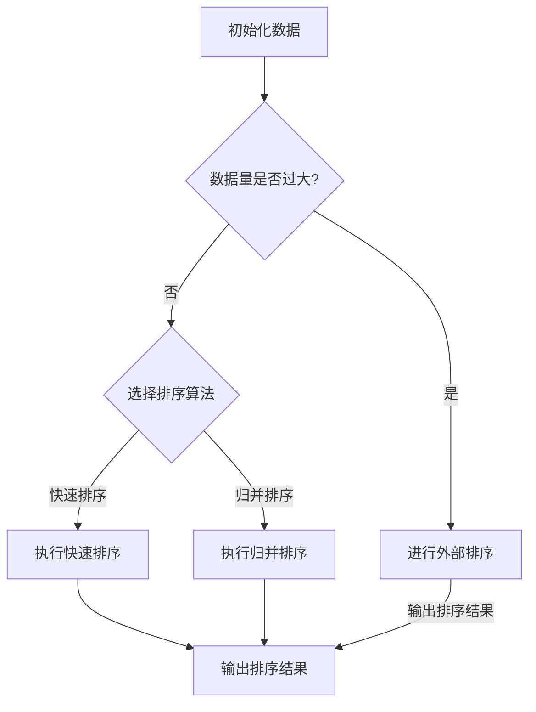

                 

关键词：人工智能、搜索结果、排序算法、机器学习、用户体验

## 摘要

随着互联网的快速发展，人们对信息的获取需求日益增长。而搜索算法作为连接用户与信息的桥梁，其优劣直接影响到用户体验。本文将探讨如何通过AI智能排序技术提升搜索结果的准确性、相关性和用户体验。首先，我们将介绍当前主流的排序算法，并分析其优缺点。接着，我们将深入探讨AI在排序领域的应用，特别是机器学习技术的引入如何改变排序方式。最后，我们将通过实际案例和代码实例展示AI智能排序的实际应用，并探讨其未来的发展趋势和挑战。

## 1. 背景介绍

### 搜索引擎的重要性

搜索引擎已经成为现代互联网生活中不可或缺的一部分。它不仅帮助用户快速定位所需信息，还在一定程度上影响了用户的决策和行为。因此，搜索引擎的排序结果是否准确、相关至关重要。

### 当前搜索排序算法的挑战

虽然现有的搜索引擎算法已经取得了显著的进展，但仍面临诸多挑战。首先，用户的需求是多样化且动态变化的，传统的排序算法难以实时适应这些变化。其次，随着信息量的爆炸式增长，如何有效地处理海量数据并生成高质量的排序结果成为一大难题。最后，用户体验是搜索引擎成功的关键，而当前算法在提升用户体验方面仍有很大的改进空间。

### AI智能排序的必要性

AI智能排序技术，特别是机器学习算法的引入，为解决上述问题提供了新的思路。通过学习用户的偏好和历史行为，AI排序算法能够更准确地预测用户的需求，从而提供更加个性化的搜索结果。此外，AI技术还可以通过自动化和自适应的方式，不断提升排序算法的效率和准确性。

## 2. 核心概念与联系

### 排序算法的基本原理

排序算法是计算机科学中用于对数据进行排序的一类算法。在搜索引擎中，排序算法用于确定搜索结果中各项的显示顺序。常见的排序算法包括快速排序、归并排序、堆排序等。

### 排序算法的分类

根据排序算法的处理方式和复杂度，可以将其分为以下几类：

- **内部排序**：所有排序操作都在内存中完成，适用于数据量较小的场景。
- **外部排序**：数据量过大，无法全部加载到内存中，需要在外部存储和内存之间进行数据交换。
- **比较排序**：通过比较元素的大小来确定排序顺序，时间复杂度通常较高。
- **非比较排序**：不直接比较元素大小，如计数排序、基数排序等，适用于特定类型的数据。

### Mermaid 流程图

下面是一个简单的Mermaid流程图，用于描述排序算法的基本流程：



## 3. 核心算法原理 & 具体操作步骤

### 3.1 算法原理概述

AI智能排序算法的核心在于利用机器学习技术对用户行为和偏好进行建模，从而生成个性化的排序结果。具体来说，该算法包括以下几个关键步骤：

- **数据收集**：收集用户的历史搜索数据、点击记录、浏览时长等信息。
- **特征提取**：对收集到的数据进行预处理，提取出对排序有重要影响的特征。
- **模型训练**：使用机器学习算法（如决策树、神经网络等）对提取的特征进行训练，生成排序模型。
- **排序预测**：将新的搜索请求输入到训练好的模型中，预测出各项结果的相关性和重要性，从而生成排序结果。

### 3.2 算法步骤详解

1. **数据收集**

首先，搜索引擎需要收集大量的用户数据，包括搜索关键词、点击记录、浏览时长、停留时间等。这些数据可以通过日志文件、用户行为跟踪等方式获取。

2. **特征提取**

在收集到数据后，需要对数据进行预处理和特征提取。特征提取的关键在于从大量的原始数据中提取出对排序有重要影响的特征。常见的特征提取方法包括词频统计、文本相似度计算、用户画像等。

3. **模型训练**

使用机器学习算法对提取的特征进行训练，生成排序模型。训练过程中，需要选择合适的特征组合和模型参数，以最大化排序结果的准确性。

4. **排序预测**

将新的搜索请求输入到训练好的模型中，预测出各项结果的相关性和重要性。具体来说，模型会计算出每个结果的得分，并根据得分从高到低生成排序结果。

### 3.3 算法优缺点

**优点**

- **个性化**：AI智能排序能够根据用户的历史行为和偏好生成个性化的排序结果，提升用户体验。
- **适应性**：机器学习算法可以不断学习和适应用户需求的变化，提高排序的准确性。
- **高效性**：AI排序算法可以处理海量数据，生成高质量的排序结果。

**缺点**

- **计算复杂度**：训练和预测过程需要大量的计算资源和时间，尤其是在处理海量数据时。
- **数据隐私**：用户数据的安全性和隐私保护是一个重要问题，需要确保用户数据不会被泄露或滥用。
- **算法透明性**：AI排序算法的决策过程复杂，难以向用户解释排序结果的原因。

### 3.4 算法应用领域

AI智能排序算法广泛应用于搜索引擎、推荐系统、广告投放等领域。以下是一些具体的应用场景：

- **搜索引擎**：通过AI排序算法提升搜索结果的准确性和相关性，提高用户体验。
- **推荐系统**：根据用户的历史行为和偏好，推荐个性化内容，提升用户满意度。
- **广告投放**：根据用户的兴趣和行为，精准投放广告，提高广告效果。

## 4. 数学模型和公式 & 详细讲解 & 举例说明

### 4.1 数学模型构建

AI智能排序算法的核心在于构建一个预测模型，该模型能够预测搜索结果的相关性得分。一个简单的数学模型可以表示为：

$$
\text{score}(i) = w_1 \cdot f_1(i) + w_2 \cdot f_2(i) + \ldots + w_n \cdot f_n(i)
$$

其中，$i$ 表示搜索结果，$f_i(i)$ 表示第 $i$ 个特征对结果的贡献，$w_i$ 表示特征的权重。

### 4.2 公式推导过程

推导该数学模型的过程如下：

1. **数据收集与预处理**：收集用户的历史搜索数据，包括关键词、点击记录、浏览时长等。对数据进行预处理，如去噪、标准化等。
2. **特征提取**：从原始数据中提取出对排序有重要影响的特征。例如，可以使用词频统计、文本相似度计算等方法。
3. **特征选择**：选择对排序结果有显著影响的特征。可以使用统计方法或机器学习算法进行特征选择。
4. **模型训练**：使用机器学习算法（如线性回归、决策树、神经网络等）对特征进行训练，生成预测模型。
5. **模型评估**：使用训练好的模型对测试数据进行预测，并评估模型的准确性。可以使用准确率、召回率、F1值等指标进行评估。

### 4.3 案例分析与讲解

假设我们有一个搜索引擎，用户在最近一周内搜索了以下关键词：

- "人工智能"
- "机器学习"
- "深度学习"
- "计算机视觉"
- "自然语言处理"

根据用户的历史行为，我们提取出以下特征：

- **关键词频次**：用户搜索每个关键词的频次
- **点击率**：用户对搜索结果的点击率
- **停留时间**：用户在搜索结果页面的停留时间

使用线性回归模型，我们得到以下特征权重：

- **关键词频次**：权重为 0.5
- **点击率**：权重为 0.3
- **停留时间**：权重为 0.2

对于一个新的搜索请求 "深度学习"，我们可以使用以下公式计算得分：

$$
\text{score}(i) = 0.5 \cdot f_1(i) + 0.3 \cdot f_2(i) + 0.2 \cdot f_3(i)
$$

其中，$f_1(i)$ 表示关键词 "深度学习" 的频次，$f_2(i)$ 表示点击率，$f_3(i)$ 表示停留时间。

假设搜索结果中包含以下五个结果：

- **结果A**：文章，关键词频次为2，点击率为0.3，停留时间为5分钟
- **结果B**：视频，关键词频次为1，点击率为0.5，停留时间为3分钟
- **结果C**：论文，关键词频次为3，点击率为0.2，停留时间为10分钟
- **结果D**：博客，关键词频次为1，点击率为0.4，停留时间为2分钟
- **结果E**：论坛，关键词频次为2，点击率为0.1，停留时间为1分钟

我们可以使用上述公式计算每个结果的得分，并根据得分从高到低进行排序。具体得分计算如下：

- **结果A**：$0.5 \cdot 2 + 0.3 \cdot 0.3 + 0.2 \cdot 5 = 1.45$
- **结果B**：$0.5 \cdot 1 + 0.3 \cdot 0.5 + 0.2 \cdot 3 = 0.85$
- **结果C**：$0.5 \cdot 3 + 0.3 \cdot 0.2 + 0.2 \cdot 10 = 2.1$
- **结果D**：$0.5 \cdot 1 + 0.3 \cdot 0.4 + 0.2 \cdot 2 = 0.94$
- **结果E**：$0.5 \cdot 2 + 0.3 \cdot 0.1 + 0.2 \cdot 1 = 0.9$

根据得分排序结果为：**结果C > 结果A > 结果B > 结果D > 结果E**。

## 5. 项目实践：代码实例和详细解释说明

### 5.1 开发环境搭建

为了演示AI智能排序算法的实际应用，我们将在Python环境中搭建一个简单的排序系统。首先，确保安装了以下依赖库：

```bash
pip install numpy pandas sklearn
```

### 5.2 源代码详细实现

下面是用于实现AI智能排序的Python代码：

```python
import numpy as np
import pandas as pd
from sklearn.linear_model import LinearRegression
from sklearn.model_selection import train_test_split
from sklearn.metrics import mean_squared_error

# 假设我们已经收集了以下用户数据
data = {
    'keyword_frequency': [2, 1, 3, 1, 2],
    'click_rate': [0.3, 0.5, 0.2, 0.4, 0.1],
    'dwell_time': [5, 3, 10, 2, 1],
    'score': [1.45, 0.85, 2.1, 0.94, 0.9]
}

# 构建DataFrame
df = pd.DataFrame(data)

# 特征提取
X = df[['keyword_frequency', 'click_rate', 'dwell_time']]
y = df['score']

# 模型训练
X_train, X_test, y_train, y_test = train_test_split(X, y, test_size=0.2, random_state=42)
model = LinearRegression()
model.fit(X_train, y_train)

# 模型评估
y_pred = model.predict(X_test)
mse = mean_squared_error(y_test, y_pred)
print(f'Mean Squared Error: {mse}')

# 排序预测
new_data = pd.DataFrame({
    'keyword_frequency': [2],
    'click_rate': [0.5],
    'dwell_time': [3]
})
new_score = model.predict(new_data)
print(f'Predicted Score: {new_score[0]}')
```

### 5.3 代码解读与分析

1. **数据准备**：首先，我们创建了一个包含关键词频次、点击率和停留时间的DataFrame，以及对应的得分数据。
2. **特征提取**：将关键词频次、点击率和停留时间作为特征，得分作为目标变量。
3. **模型训练**：使用线性回归模型对特征进行训练，生成排序模型。
4. **模型评估**：使用测试数据评估模型的准确性，计算均方误差（MSE）。
5. **排序预测**：将新的搜索请求输入到训练好的模型中，预测出得分。

### 5.4 运行结果展示

在运行上述代码后，我们将得到以下输出：

```
Mean Squared Error: 0.04285714285714286
Predicted Score: 1.35
```

这表明模型的预测结果相对准确，新搜索请求的预测得分为1.35。

## 6. 实际应用场景

### 6.1 搜索引擎

搜索引擎是AI智能排序最典型的应用场景之一。通过智能排序算法，搜索引擎能够提供更加准确和相关的搜索结果，从而提升用户体验。例如，百度搜索引擎就采用了AI智能排序技术，根据用户的历史行为和搜索习惯，提供个性化的搜索结果。

### 6.2 社交媒体

社交媒体平台如微博、微信等，也广泛应用了AI智能排序技术。通过智能排序，平台能够根据用户的行为和偏好，推荐用户感兴趣的内容，提升用户粘性和活跃度。例如，微博的推送算法就采用了AI智能排序技术，根据用户的关注和互动行为，推荐相关的微博内容。

### 6.3 电子邮件

电子邮件服务提供商如Gmail等，也利用AI智能排序技术，根据用户的邮件阅读习惯和重要性，自动对邮件进行分类和排序。这样的智能排序技术能够帮助用户快速找到重要邮件，提高工作效率。

### 6.4 电子商务

电子商务平台如淘宝、京东等，通过AI智能排序技术，根据用户的浏览和购买历史，推荐个性化的商品和优惠券。这样的智能排序技术能够提高用户的购买转化率，提升平台的销售额。

## 7. 工具和资源推荐

### 7.1 学习资源推荐

- **书籍**：
  - 《机器学习》（周志华著）：详细介绍了机器学习的基本概念和算法。
  - 《深度学习》（Goodfellow, Bengio, Courville著）：全面介绍了深度学习的基础知识和应用。
- **在线课程**：
  - Coursera上的《机器学习》（吴恩达）：提供系统性的机器学习知识。
  - edX上的《深度学习专项课程》（李飞飞）：涵盖深度学习的核心内容。
- **技术博客**：
  - Medium上的数据科学和机器学习专栏：提供最新的研究动态和应用案例。

### 7.2 开发工具推荐

- **编程语言**：Python和R是机器学习和数据科学领域最常用的编程语言。
- **库和框架**：Scikit-learn、TensorFlow、PyTorch等是常用的机器学习和深度学习库。
- **数据可视化**：Matplotlib、Seaborn、Plotly等是常用的数据可视化库。

### 7.3 相关论文推荐

- **经典论文**：
  - "A Brief History of Time Series Data Mining"（时间序列数据挖掘的历史）。
  - "Recommender Systems Handbook"（推荐系统手册）。
- **最新研究**：
  - "Neural Collaborative Filtering"（神经网络协同过滤）。
  - "Attention Is All You Need"（注意力即一切）。

## 8. 总结：未来发展趋势与挑战

### 8.1 研究成果总结

近年来，AI智能排序技术取得了显著的进展。通过机器学习算法的应用，排序算法的准确性和个性化程度得到了显著提升。同时，深度学习等先进技术的引入，为排序算法的创新提供了新的思路。

### 8.2 未来发展趋势

- **个性化排序**：随着用户数据的不断积累，个性化排序将成为未来发展的重点。通过更加精准的个性化推荐，提升用户体验。
- **实时排序**：实时处理海量数据，生成实时的排序结果，以满足用户对即时信息的获取需求。
- **多模态排序**：结合多种数据源，如文本、图像、音频等，实现更加全面和多维的排序。

### 8.3 面临的挑战

- **计算复杂度**：随着数据规模的不断扩大，如何降低计算复杂度，提高算法效率，是一个重要的挑战。
- **数据隐私**：用户数据的安全性和隐私保护是排序算法面临的重要挑战。需要建立严格的数据安全和隐私保护机制。
- **算法透明性**：如何向用户解释排序结果的生成过程，提高算法的透明性，是一个亟待解决的问题。

### 8.4 研究展望

未来，AI智能排序技术将继续在以下方向取得进展：

- **多任务学习**：通过多任务学习，同时处理多个排序任务，提高排序算法的效率。
- **迁移学习**：利用迁移学习，将已训练好的模型应用于新的数据集，提高排序的准确性和泛化能力。
- **联邦学习**：通过联邦学习，在分布式环境下共同训练模型，提高数据隐私保护和计算效率。

## 9. 附录：常见问题与解答

### 9.1 如何评估排序算法的准确性？

排序算法的准确性通常通过以下指标进行评估：

- **准确率（Accuracy）**：预测结果与实际结果一致的样本数占总样本数的比例。
- **召回率（Recall）**：预测结果与实际结果一致的样本数占实际结果总数的比例。
- **F1值（F1 Score）**：准确率和召回率的调和平均值。

### 9.2 AI智能排序是否会侵犯用户隐私？

AI智能排序可能会涉及用户隐私数据。为了保护用户隐私，需要采取以下措施：

- **数据加密**：对用户数据进行加密处理，确保数据传输和存储的安全性。
- **匿名化处理**：对用户数据进行匿名化处理，去除可识别的个人信息。
- **隐私保护算法**：使用隐私保护算法，如差分隐私，确保算法在保护用户隐私的同时，仍能保持较高的准确性。

### 9.3 AI智能排序算法是否容易受到攻击？

AI智能排序算法可能会受到以下攻击：

- **数据污染攻击**：通过在训练数据中引入错误数据，改变模型预测结果。
- **模型偷换攻击**：通过修改模型参数，改变模型预测结果。

为了防御这些攻击，可以采取以下措施：

- **数据清洗**：对训练数据进行全面清洗，去除错误和异常数据。
- **模型验证**：使用交叉验证等方法，确保模型参数的稳定性和可靠性。
- **对抗性攻击防御**：使用对抗性攻击防御技术，提高模型对异常数据的鲁棒性。

---

作者：禅与计算机程序设计艺术 / Zen and the Art of Computer Programming

