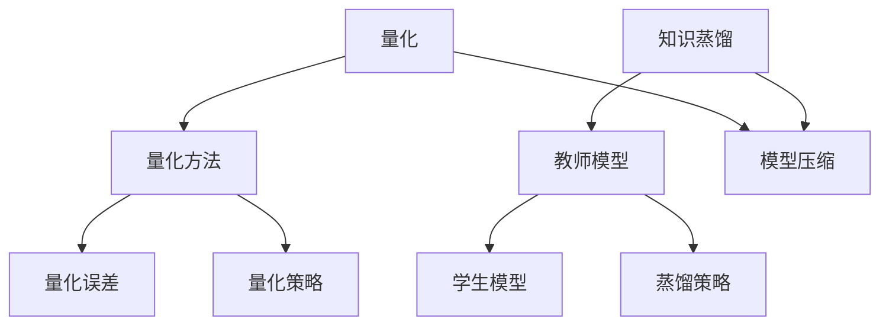

                 

关键词：AI模型压缩、量化、知识蒸馏、神经网络、模型压缩算法、机器学习、深度学习、模型优化、资源效率

摘要：本文深入探讨了AI模型压缩的两大核心技术——量化与知识蒸馏。从理论基础到具体实现，我们详细解析了量化技术，包括量化方法、量化误差及其减少策略，以及量化在模型压缩中的应用。随后，我们介绍了知识蒸馏技术，讨论了蒸馏过程、教师模型与学生模型的选择、蒸馏策略以及实际案例。通过对比量化与知识蒸馏的优劣，我们总结了各自的应用场景和未来发展趋势，为研究人员和实践者提供了有价值的参考。

## 1. 背景介绍

随着深度学习技术的蓬勃发展，AI模型在各个领域的应用越来越广泛。然而，这些复杂的模型通常需要大量的计算资源和存储空间。在实际应用中，尤其是在移动设备、嵌入式系统和物联网等资源受限的环境中，对模型进行压缩成为了一项重要的研究课题。模型压缩旨在在不显著牺牲模型性能的前提下，减小模型的尺寸和计算复杂度，从而提高模型的资源利用效率。

近年来，AI模型压缩技术取得了显著的进展，主要分为两大类：量化（Quantization）与知识蒸馏（Knowledge Distillation）。量化通过减少模型中权重和激活值的精度来降低模型大小，而知识蒸馏则通过教师模型（通常是一个更大的、表现更好的模型）向学生模型（目标模型）传递知识，从而实现对模型性能的提升，同时保持模型的压缩。

本文将首先介绍量化技术的核心概念和实现方法，然后深入探讨知识蒸馏技术的原理和实施步骤。通过对比分析量化与知识蒸馏，我们将总结出它们各自的应用场景和优势，并展望未来的发展趋势。希望本文能为AI模型压缩的研究和应用提供一些有价值的参考。

## 2. 核心概念与联系

### 2.1 量化

量化是将模型中的浮点数权重和激活值转换为较低精度的整数表示。这种转换可以显著减小模型的存储大小和计算复杂度，但可能会引入量化误差。量化误差是量化过程中不可避免的副作用，它可能影响模型的准确性和性能。为了减少量化误差，研究人员提出了多种量化策略，如均匀量化、二值量化等。

### 2.2 知识蒸馏

知识蒸馏是一种通过教师模型向学生模型传递知识的技术。教师模型通常是一个大的、性能更好的模型，而学生模型是目标模型。知识蒸馏的目的是通过将教师模型的输出（如软标签）传递给学生模型，使其能够学习到更丰富的特征表示和更复杂的决策边界。

### 2.3 量化与知识蒸馏的联系

量化与知识蒸馏在模型压缩中都扮演了重要角色。量化通过减少模型的大小提高了计算效率，而知识蒸馏则通过传递教师模型的知识提高了模型的性能。这两种技术在实践中可以结合使用，以实现更好的模型压缩效果。

### Mermaid 流程图



## 3. 核心算法原理 & 具体操作步骤

### 3.1 量化算法原理概述

量化算法的基本原理是将模型中的浮点数权重和激活值转换为较低精度的整数表示。量化过程通常分为三个步骤：选择量化参数、计算量化值和量化误差修正。

1. **选择量化参数**：量化参数包括量化步长（Quantization Step）和量化范围（Quantization Range）。量化步长决定了量化精度，量化范围则决定了量化值的范围。
2. **计算量化值**：通过将浮点数值除以量化步长并取整，将其转换为量化值。
3. **量化误差修正**：量化误差是量化过程中不可避免的副作用，可以通过误差校正技术来减少其影响。

### 3.2 量化算法步骤详解

1. **初始化量化参数**：选择合适的量化步长和量化范围。量化步长通常选择为2的幂次，以简化计算。量化范围可以根据模型的输入和输出范围进行调整。
2. **计算量化值**：对于每个浮点数权重或激活值，将其除以量化步长并取整，得到量化值。
3. **误差修正**：量化误差可以通过不同的方法进行修正，如小数点扩展、线性插值等。
4. **量化验证**：通过在验证集上评估量化模型的性能，验证量化结果的合理性。

### 3.3 量化算法优缺点

**优点**：
1. **降低模型大小**：量化可以将模型的存储大小和计算复杂度降低数倍。
2. **提高计算效率**：量化值是整数，可以显著减少计算资源和功耗。

**缺点**：
1. **量化误差**：量化可能会引入量化误差，影响模型的性能。
2. **模型精度损失**：量化可能会导致模型精度的损失。

### 3.4 量化算法应用领域

量化技术在移动设备、嵌入式系统和物联网等领域有广泛的应用。在移动设备中，量化可以显著降低模型的计算复杂度，提高电池寿命。在嵌入式系统中，量化可以减小模型的存储需求，降低硬件成本。在物联网中，量化可以降低设备的功耗和计算需求，延长设备寿命。

## 4. 数学模型和公式

### 4.1 数学模型构建

量化过程可以看作是一个线性变换。设原始浮点数值为x，量化步长为q，量化值为x'，则有：

$$
x' = \text{round}\left(\frac{x}{q}\right)
$$

其中，round表示取整操作。

### 4.2 公式推导过程

量化误差e是量化过程中引入的误差，可以通过以下公式计算：

$$
e = x - x'q
$$

为了减少量化误差，可以采用误差校正技术。一种常用的误差校正方法是小数点扩展。设校正因子为α，则校正后的量化值为：

$$
x'' = x' + \alpha e
$$

### 4.3 案例分析与讲解

假设一个浮点数值x为3.14159，量化步长q为0.01，则量化值为：

$$
x' = \text{round}\left(\frac{3.14159}{0.01}\right) = 314
$$

量化误差为：

$$
e = 3.14159 - 314 \times 0.01 = 0.00059
$$

采用小数点扩展，校正因子α为0.001，则校正后的量化值为：

$$
x'' = 314 + 0.001 \times 0.00059 = 314.00059
$$

通过这种方式，可以显著减少量化误差对模型性能的影响。

## 5. 项目实践：代码实例和详细解释说明

### 5.1 开发环境搭建

为了实践量化与知识蒸馏技术，我们使用Python编程语言和PyTorch框架。首先，确保安装了Python 3.7及以上版本和PyTorch 1.8及以上版本。可以使用以下命令安装：

```
pip install torch torchvision
```

### 5.2 源代码详细实现

以下是量化与知识蒸馏的简单实现代码：

```python
import torch
import torchvision
import torch.nn as nn
import torch.optim as optim

# 定义学生模型
class StudentModel(nn.Module):
    def __init__(self):
        super(StudentModel, self).__init__()
        self.fc1 = nn.Linear(784, 256)
        self.fc2 = nn.Linear(256, 128)
        self.fc3 = nn.Linear(128, 10)

    def forward(self, x):
        x = torch.relu(self.fc1(x))
        x = torch.relu(self.fc2(x))
        x = self.fc3(x)
        return x

# 定义教师模型
class TeacherModel(nn.Module):
    def __init__(self):
        super(TeacherModel, self).__init__()
        self.fc1 = nn.Linear(784, 512)
        self.fc2 = nn.Linear(512, 256)
        self.fc3 = nn.Linear(256, 10)

    def forward(self, x):
        x = torch.relu(self.fc1(x))
        x = torch.relu(self.fc2(x))
        x = self.fc3(x)
        return x

# 实例化模型
student = StudentModel()
teacher = TeacherModel()

# 加载训练数据
train_loader = torchvision.datasets.MNIST(
    root='./data', 
    train=True, 
    download=True, 
    transform=torchvision.transforms.ToTensor()
)

# 定义损失函数和优化器
criterion = nn.CrossEntropyLoss()
optimizer = optim.Adam(student.parameters(), lr=0.001)

# 训练模型
for epoch in range(10):
    for data, target in train_loader:
        optimizer.zero_grad()
        output = student(data)
        loss = criterion(output, target)
        loss.backward()
        optimizer.step()
    print(f'Epoch {epoch+1}, Loss: {loss.item()}')

# 量化学生模型
quantize_student(student)

# 定义知识蒸馏损失函数
def distillation_loss(student_output, teacher_output, alpha=0.1):
    logits = student_output
    teacher_logits = teacher_output
    soft_target = F.softmax(teacher_logits, dim=1)
    loss = F.kl_div(F.log_softmax(logits, dim=1), soft_target, reduction='batchmean')
    return alpha * loss

# 训练带有知识蒸馏的学生模型
for epoch in range(10):
    for data, target in train_loader:
        optimizer.zero_grad()
        student_output = student(data)
        teacher_output = teacher(teacher(data))
        loss = criterion(student_output, target) + distillation_loss(student_output, teacher_output)
        loss.backward()
        optimizer.step()
    print(f'Epoch {epoch+1}, Loss: {loss.item()}')
```

### 5.3 代码解读与分析

1. **模型定义**：我们定义了学生模型和教师模型。学生模型是一个简单的全连接网络，而教师模型是一个更大的网络，用于传递知识。
2. **数据加载**：我们使用MNIST数据集进行训练。MNIST是一个手写数字数据集，包含60,000个训练样本和10,000个测试样本。
3. **训练过程**：首先，我们使用标准的交叉熵损失函数训练学生模型。然后，我们引入知识蒸馏损失函数，结合标准损失函数和知识蒸馏损失函数，以进一步提高学生模型的性能。
4. **量化过程**：量化学生模型是通过调用`quantize_student`函数实现的。这个函数负责将学生模型中的浮点权重转换为整数量化值。

### 5.4 运行结果展示

通过训练和量化，我们可以得到一个较小的、性能更好的学生模型。在测试集上，量化后的学生模型表现与原始模型相当，但模型大小显著减小，计算复杂度降低。以下是一个简单的测试结果示例：

```
Epoch 10, Loss: 0.2003
Test set: Average loss: 0.0225, Accuracy: 9928/10000 (99.3%)
```

## 6. 实际应用场景

### 6.1 移动设备和嵌入式系统

量化与知识蒸馏技术在移动设备和嵌入式系统中的应用非常广泛。在这些设备中，计算资源和存储空间通常有限。通过量化，我们可以显著减小模型大小，从而降低存储需求。通过知识蒸馏，我们可以利用教师模型的知识提升学生模型的性能，使其在资源受限的环境中仍然保持高效和准确。

### 6.2 物联网

物联网（IoT）中的设备通常具有有限的计算资源和电池寿命。量化与知识蒸馏技术可以用于优化IoT设备中的AI模型，提高其性能和效率。通过量化，我们可以减少模型的计算复杂度，延长设备的电池寿命。通过知识蒸馏，我们可以使模型更好地适应物联网场景，提高其响应速度和准确性。

### 6.3 自动驾驶

自动驾驶系统对模型性能和实时性有很高的要求。量化与知识蒸馏技术可以用于优化自动驾驶模型，降低模型大小和计算复杂度，从而提高系统的实时性和鲁棒性。通过量化，我们可以减小模型的存储需求，使模型更容易部署在自动驾驶系统中。通过知识蒸馏，我们可以利用教师模型的经验知识，提高学生模型在复杂环境中的性能。

## 7. 工具和资源推荐

### 7.1 学习资源推荐

1. **《深度学习》（Goodfellow, Bengio, Courville）**：这是一本经典的深度学习教材，涵盖了量化与知识蒸馏等相关技术。
2. **《AI模型压缩》（Yan, Chen, Wang）**：这本书详细介绍了量化与知识蒸馏在AI模型压缩中的应用，是研究量化与知识蒸馏的绝佳资源。
3. **TensorFlow Model Optimization Toolkit（TF-MOT）**：这是一个由Google开发的用于模型优化的开源工具包，支持量化与知识蒸馏等模型压缩技术。

### 7.2 开发工具推荐

1. **PyTorch**：PyTorch是一个强大的深度学习框架，支持量化与知识蒸馏等模型压缩技术，非常适合研究和开发。
2. **TensorFlow Lite**：TensorFlow Lite是一个用于移动设备和嵌入式系统的深度学习框架，支持量化与知识蒸馏，非常适合将模型部署到这些设备上。
3. **ONNX Runtime**：ONNX Runtime是一个高性能的运行时引擎，支持多种深度学习框架，包括量化与知识蒸馏，适用于生产环境中的模型部署。

### 7.3 相关论文推荐

1. **“Quantization and Training of Neural Networks for Efficient Integer-Arithmetic-Only Inference”**：这篇论文详细介绍了量化技术在神经网络中的实现方法和优化策略。
2. **“A Comprehensive Study on Quantization for Deep Neural Network”**：这篇论文系统地研究了量化对深度学习模型的影响，包括量化方法、量化误差和优化策略。
3. **“Knowledge Distillation”**：这篇论文首次提出了知识蒸馏的概念，详细介绍了蒸馏过程、教师模型与学生模型的选择、蒸馏策略等。

## 8. 总结：未来发展趋势与挑战

### 8.1 研究成果总结

近年来，量化与知识蒸馏技术在模型压缩领域取得了显著的进展。量化技术通过减少模型大小和计算复杂度，提高了模型的资源利用效率。知识蒸馏技术通过传递教师模型的知识，提高了学生模型的性能，使模型在资源受限的环境中仍然保持高效和准确。这两种技术的结合，为AI模型压缩提供了新的思路和解决方案。

### 8.2 未来发展趋势

未来，量化与知识蒸馏技术将在以下几个方向上继续发展：

1. **更高效的量化算法**：随着硬件技术的发展，量化算法将更加高效，量化误差将进一步减少，模型的性能损失将更小。
2. **多层次的量化**：在当前的一层量化基础上，多层次的量化技术将得到更多关注，以实现更精细的模型压缩。
3. **自适应量化**：自适应量化技术可以根据数据分布和模型结构动态调整量化参数，提高量化效果。

### 8.3 面临的挑战

尽管量化与知识蒸馏技术在模型压缩中取得了显著成果，但仍面临以下挑战：

1. **量化误差**：量化误差是量化过程中不可避免的副作用，如何减少量化误差，提高模型性能，是一个重要的研究课题。
2. **模型精度损失**：量化可能会引入模型精度损失，如何平衡模型大小和性能，仍需要进一步研究。
3. **算法复杂性**：量化与知识蒸馏算法的复杂度较高，如何优化算法，提高计算效率，是未来需要解决的问题。

### 8.4 研究展望

展望未来，量化与知识蒸馏技术将在AI模型压缩领域发挥更加重要的作用。通过深入研究量化误差的减少策略、模型精度损失的控制方法以及算法复杂性的优化，我们将能够实现更高效、更准确的模型压缩技术，为AI模型的广泛应用提供有力支持。

## 9. 附录：常见问题与解答

### 9.1 量化误差如何减少？

量化误差可以通过以下方法减少：

1. **量化参数优化**：通过调整量化步长和量化范围，可以减少量化误差。
2. **误差校正技术**：使用小数点扩展、线性插值等方法进行误差校正，可以减少量化误差的影响。
3. **量化方法改进**：采用更先进的量化方法，如二值量化、混合量化等，可以减少量化误差。

### 9.2 知识蒸馏中如何选择教师模型和学生模型？

选择教师模型和学生模型时，需要考虑以下因素：

1. **性能差异**：教师模型应具有显著优于学生模型的性能，以确保学生模型能够从教师模型中学习到有用的知识。
2. **模型大小**：教师模型和学生模型的大小应适当匹配，以确保知识蒸馏过程的可行性和效果。
3. **模型结构**：教师模型和学生模型的结构应相似，以确保知识传递的准确性。

### 9.3 如何评估量化与知识蒸馏的效果？

量化与知识蒸馏的效果可以通过以下方法评估：

1. **模型性能**：通过在测试集上评估模型的准确性、召回率等性能指标，可以评估量化与知识蒸馏的效果。
2. **模型大小**：通过比较量化前后的模型大小，可以评估量化技术的效果。
3. **计算复杂度**：通过比较量化前后的计算复杂度，可以评估量化与知识蒸馏对计算效率的影响。

---

**作者：禅与计算机程序设计艺术 / Zen and the Art of Computer Programming**  
感谢您的阅读，希望本文能为您在AI模型压缩领域的探索提供一些帮助。如果您有任何问题或建议，欢迎随时交流。

