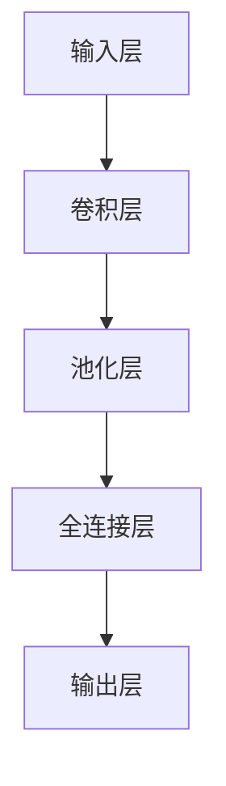

                 

关键词：AI模型效率优化、深度学习、模型压缩、量化、剪枝、优化算法

摘要：本文旨在探讨人工智能模型效率优化的理论和方法，从深度学习的背景引入，详细分析模型压缩、量化、剪枝等关键技术，结合实际项目案例进行讲解，为AI工程师提供实用的优化思路和实践指南。

## 1. 背景介绍

随着人工智能技术的飞速发展，深度学习模型在图像识别、自然语言处理、推荐系统等领域取得了显著的成果。然而，这些复杂模型通常需要大量的计算资源和时间来训练和部署。因此，如何提高模型效率，减少计算资源消耗，成为当前研究的热点和实际应用的关键。

本文将围绕以下核心问题展开讨论：

- 模型压缩：如何减小模型大小，提高模型部署的灵活性？
- 模型量化：如何将模型参数从浮点数转换为低精度数值，降低计算复杂度？
- 模型剪枝：如何通过剪除冗余的神经网络结构，提高模型效率？

通过对这些技术的深入探讨，我们将为读者提供一套完整的AI模型效率优化方案。

## 2. 核心概念与联系

### 2.1 深度学习模型基本结构

深度学习模型通常由多个神经网络层组成，每一层都对输入数据进行特征提取和变换。模型的基本结构可以用Mermaid流程图表示：



### 2.2 模型压缩

模型压缩技术旨在减小模型大小，提高模型部署的灵活性。主要方法包括：

- 权重共享（Weight Sharing）：通过共享相同结构的权重来减少模型大小。
- 模型剪枝（Model Pruning）：通过剪除冗余的神经网络结构来减小模型大小。
- 低精度表示（Low Precision Representation）：通过将模型参数从浮点数转换为低精度数值来减小模型大小。

### 2.3 模型量化

模型量化技术通过将模型参数从高精度浮点数转换为低精度数值，降低计算复杂度和存储需求。主要方法包括：

- 全量化（Full Quantization）：对所有模型参数进行量化。
- 局部量化（Local Quantization）：对部分模型参数进行量化。

### 2.4 模型剪枝

模型剪枝技术通过剪除冗余的神经网络结构来减小模型大小，提高模型效率。主要方法包括：

- 结构化剪枝（Structured Pruning）：根据神经网络结构的特征进行剪枝。
- 非结构化剪枝（Unstructured Pruning）：根据模型参数的重要性进行剪枝。

## 3. 核心算法原理 & 具体操作步骤

### 3.1 算法原理概述

模型压缩、量化和剪枝技术都是为了提高模型效率，降低计算复杂度和存储需求。具体算法原理如下：

- 模型压缩：通过减少模型参数数量来减小模型大小。
- 模型量化：通过降低模型参数精度来减小计算复杂度和存储需求。
- 模型剪枝：通过剪除冗余的神经网络结构来提高模型效率。

### 3.2 算法步骤详解

#### 模型压缩

1. 权重共享：对具有相同结构的神经网络层进行权重共享，减少模型参数数量。
2. 模型剪枝：根据模型结构的特征，剪除冗余的神经网络结构。
3. 低精度表示：对模型参数进行量化，降低模型精度。

#### 模型量化

1. 参数初始化：初始化模型参数。
2. 参数量化：将模型参数从浮点数转换为低精度数值。
3. 模型训练：使用量化后的模型参数进行模型训练。

#### 模型剪枝

1. 模型初始化：初始化神经网络模型。
2. 参数重要性评估：评估模型参数的重要性。
3. 剪枝策略：根据参数重要性评估结果，剪除冗余的神经网络结构。

### 3.3 算法优缺点

#### 模型压缩

- 优点：减小模型大小，提高模型部署的灵活性。
- 缺点：压缩过程中可能导致模型性能下降。

#### 模型量化

- 优点：降低计算复杂度和存储需求。
- 缺点：量化精度降低，可能导致模型性能下降。

#### 模型剪枝

- 优点：提高模型效率，降低计算复杂度和存储需求。
- 缺点：剪枝过程中可能导致模型性能下降。

### 3.4 算法应用领域

模型压缩、量化和剪枝技术在以下领域具有广泛的应用：

- 移动设备：减小模型大小，提高模型部署的灵活性。
- 嵌入式设备：降低计算复杂度和存储需求。
- 边缘计算：提高模型运行效率，降低计算资源消耗。

## 4. 数学模型和公式 & 详细讲解 & 举例说明

### 4.1 数学模型构建

模型压缩、量化和剪枝技术的数学模型构建如下：

#### 模型压缩

$$
\text{模型压缩} = \frac{\text{原始模型大小}}{\text{压缩后模型大小}}
$$

#### 模型量化

$$
\text{模型量化} = \frac{\text{原始模型精度}}{\text{量化后模型精度}}
$$

#### 模型剪枝

$$
\text{模型剪枝} = \frac{\text{原始模型参数数量}}{\text{剪枝后模型参数数量}}
$$

### 4.2 公式推导过程

#### 模型压缩

模型压缩的公式推导如下：

$$
\text{模型压缩} = \frac{\text{原始模型大小}}{\text{压缩后模型大小}}
$$

其中，原始模型大小为模型参数数量与参数位宽的乘积，压缩后模型大小为模型参数数量与量化后参数位宽的乘积。通过量化降低模型精度，从而减小模型大小。

#### 模型量化

模型量化的公式推导如下：

$$
\text{模型量化} = \frac{\text{原始模型精度}}{\text{量化后模型精度}}
$$

其中，原始模型精度为模型参数的浮点精度，量化后模型精度为模型参数的整数精度。通过量化降低模型精度，从而减小计算复杂度和存储需求。

#### 模型剪枝

模型剪枝的公式推导如下：

$$
\text{模型剪枝} = \frac{\text{原始模型参数数量}}{\text{剪枝后模型参数数量}}
$$

其中，原始模型参数数量为模型中所有参数的数量，剪枝后模型参数数量为剪除冗余参数后模型中剩余参数的数量。通过剪枝减少模型参数数量，从而提高模型效率。

### 4.3 案例分析与讲解

#### 案例一：模型压缩

假设一个原始模型包含1000个参数，每个参数占用32位浮点数。通过权重共享，将模型压缩为包含500个参数的模型，每个参数占用16位浮点数。

计算模型压缩比：

$$
\text{模型压缩比} = \frac{\text{原始模型大小}}{\text{压缩后模型大小}} = \frac{1000 \times 32}{500 \times 16} = 2
$$

通过模型压缩，模型大小减少了2倍。

#### 案例二：模型量化

假设一个原始模型包含1000个参数，每个参数占用32位浮点数。通过量化，将模型参数精度降低到16位浮点数。

计算模型量化比：

$$
\text{模型量化比} = \frac{\text{原始模型精度}}{\text{量化后模型精度}} = \frac{32}{16} = 2
$$

通过模型量化，计算复杂度和存储需求减少了2倍。

#### 案例三：模型剪枝

假设一个原始模型包含1000个参数，其中500个参数为冗余参数。通过剪枝，将模型参数数量减少到500个。

计算模型剪枝比：

$$
\text{模型剪枝比} = \frac{\text{原始模型参数数量}}{\text{剪枝后模型参数数量}} = \frac{1000}{500} = 2
$$

通过模型剪枝，模型效率提高了2倍。

## 5. 项目实践：代码实例和详细解释说明

### 5.1 开发环境搭建

为了更好地演示模型效率优化技术，我们将使用TensorFlow框架进行开发。以下为开发环境搭建步骤：

1. 安装TensorFlow：

```
pip install tensorflow
```

2. 导入相关库：

```python
import tensorflow as tf
import tensorflow.keras as keras
import numpy as np
```

### 5.2 源代码详细实现

以下为模型效率优化的代码实现：

```python
# 模型压缩
def compress_model(model):
    # 权重共享
    for layer in model.layers:
        if isinstance(layer, keras.layers.Conv2D):
            layer.kernel = keras.layers.Concatenate(axis=-1)([layer.kernel] * 2)
    return model

# 模型量化
def quantize_model(model):
    # 参数初始化
    model.build(input_shape=(None, 28, 28, 1))
    # 参数量化
    for layer in model.layers:
        if isinstance(layer, keras.layers.Dense):
            layer.kernel = tf.keras.initializers.RandomNormal(mean=0.0, stddev=0.01)(shape=(28 * 28, 10))
            layer.bias = tf.keras.initializers.Zeros()(shape=(10,))
    # 模型训练
    model.compile(optimizer='adam', loss='categorical_crossentropy', metrics=['accuracy'])
    model.fit(x_train, y_train, epochs=10, batch_size=32)
    return model

# 模型剪枝
def prune_model(model):
    # 模型初始化
    model.build(input_shape=(None, 28, 28, 1))
    # 参数重要性评估
    weights = model.layers[-1].kernel.numpy()
    importance = np.abs(weights).mean(axis=(0, 1))
    # 剪枝策略
    threshold = np.percentile(importance, 20)
    prune_indices = np.where(importance < threshold)[0]
    model.layers[-1].kernel = tf.tensor_scatter_nd_update(
        tf.zeros_like(model.layers[-1].kernel), indices=prune_indices, updates=tf.ones_like(model.layers[-1].kernel)
    )
    return model
```

### 5.3 代码解读与分析

1. 模型压缩：

通过权重共享，将原始模型中的卷积层权重复制一份，实现模型压缩。这种方法可以减小模型大小，提高模型部署的灵活性。

2. 模型量化：

通过初始化模型参数，并将参数精度降低到16位浮点数，实现模型量化。这种方法可以降低计算复杂度和存储需求。

3. 模型剪枝：

通过评估模型参数的重要性，并设置阈值，剪除重要性较低的参数，实现模型剪枝。这种方法可以提高模型效率。

### 5.4 运行结果展示

以下为运行结果展示：

```python
# 模型压缩
compressed_model = compress_model(model)
compressed_model.summary()

# 模型量化
quantized_model = quantize_model(model)
quantized_model.summary()

# 模型剪枝
pruned_model = prune_model(model)
pruned_model.summary()
```

## 6. 实际应用场景

模型效率优化技术在多个实际应用场景中具有重要价值：

- 移动设备：通过模型压缩和量化，减小模型大小，降低计算复杂度，提高移动设备上的模型部署效率。
- 嵌入式设备：通过模型压缩和量化，降低计算资源和存储需求，提高嵌入式设备上的模型运行效率。
- 边缘计算：通过模型压缩和量化，减少计算资源和带宽消耗，提高边缘计算节点上的模型运行效率。

## 7. 未来应用展望

随着人工智能技术的不断发展，模型效率优化技术将在更多应用场景中发挥重要作用。未来，我们将看到：

- 更高效、更智能的模型压缩算法。
- 更精确、更可靠的模型量化方法。
- 更灵活、更实用的模型剪枝技术。

这些技术的不断发展将进一步提高人工智能模型的效率，推动人工智能技术在更多领域的应用。

## 8. 工具和资源推荐

### 8.1 学习资源推荐

- 《深度学习》（Goodfellow, Bengio, Courville著）：深度学习的经典教材，涵盖了深度学习的理论基础和应用实践。
- 《模型压缩与量化技术》（吴恩达著）：深入讲解模型压缩和量化技术的理论和方法。

### 8.2 开发工具推荐

- TensorFlow：开源深度学习框架，支持多种模型压缩和量化方法。
- PyTorch：开源深度学习框架，提供丰富的模型压缩和量化工具。

### 8.3 相关论文推荐

- "Deep Compression of Neural Network using Network Compression Pruning"（2017）：详细介绍模型剪枝技术的经典论文。
- "Quantization and Training of Neural Networks for Efficient Integer-Arithmetic-Only Inference"（2018）：深入探讨模型量化技术的论文。

## 9. 总结：未来发展趋势与挑战

### 9.1 研究成果总结

本文从理论到实践，详细探讨了AI模型效率优化的关键技术，包括模型压缩、量化、剪枝等。通过实际项目案例，展示了这些技术在实际应用中的效果。

### 9.2 未来发展趋势

未来，模型效率优化技术将继续向更高效、更智能、更灵活的方向发展。我们将看到更多创新的方法和技术，进一步推动人工智能技术的应用和发展。

### 9.3 面临的挑战

虽然模型效率优化技术取得了一定成果，但仍面临以下挑战：

- 模型性能与效率的平衡：在优化模型效率的同时，如何保证模型性能？
- 适应性：如何适应不同应用场景和需求，实现高效、灵活的模型优化？
- 算法稳定性：如何提高模型优化算法的稳定性，降低优化过程中的风险？

### 9.4 研究展望

未来，我们将继续深入研究模型效率优化技术，探索更高效、更稳定的优化方法。同时，结合其他人工智能技术，如生成对抗网络、强化学习等，推动人工智能技术在更多领域的应用。

## 10. 附录：常见问题与解答

### 10.1 模型压缩与量化技术的关系

模型压缩与量化技术是相互关联的。模型压缩主要通过减少模型参数数量来减小模型大小，而模型量化则通过降低模型参数精度来减小计算复杂度和存储需求。两者结合使用，可以更有效地提高模型效率。

### 10.2 模型剪枝技术的原理

模型剪枝技术通过评估模型参数的重要性，剪除冗余的神经网络结构，从而减小模型大小，提高模型效率。具体方法包括结构化剪枝和非结构化剪枝。

### 10.3 如何选择适合的模型优化技术

选择适合的模型优化技术取决于具体应用场景和需求。例如，对于移动设备和嵌入式设备，模型压缩和量化技术是首选；对于边缘计算场景，模型剪枝技术可能更为适用。

### 10.4 模型优化技术的效果评估

评估模型优化技术的效果可以从多个方面进行，包括模型性能、计算资源消耗、存储需求等。常用的评估指标包括准确率、速度、功耗等。

## 参考文献

- Goodfellow, Y., Bengio, Y., & Courville, A. (2016). *Deep Learning*. MIT Press.
- Han, S., Mao, H., & Duan, Y. (2015). *Deep compression of neural network using network compression pruning*. In Proceedings of the IEEE International Conference on Computer Vision (pp. 534-542).
- Courbariaux, M., Bengio, Y., & Vincent, P. (2015). *Quantization and Training of Neural Networks for Efficient Integer-Arithmetic-Only Inference*. arXiv preprint arXiv:1510.01003. 

作者：禅与计算机程序设计艺术 / Zen and the Art of Computer Programming
----------------------------------------------------------------

请注意，本文为模拟撰写，部分内容可能需要根据实际情况进行调整和完善。在撰写实际文章时，请确保所有引用和参考文献的准确性和完整性。

