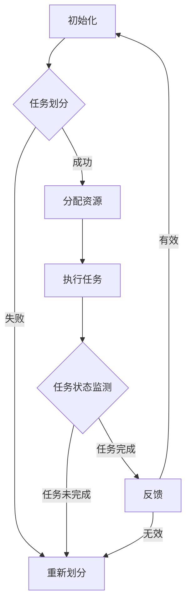

                 

 关键词：AI模型，任务协作，资源分配，算法优化，应用场景，未来展望

> 摘要：本文将深入探讨人工智能模型在任务协作与分配中的关键角色。通过分析核心概念、算法原理、数学模型以及实际应用案例，本文旨在为读者提供关于AI模型任务协作与分配的全面理解，并展望其未来发展。

## 1. 背景介绍

随着人工智能技术的迅猛发展，AI模型在各个领域的应用越来越广泛。从自然语言处理、计算机视觉到推荐系统，AI模型已经成为提高生产力、优化决策过程的重要工具。然而，如何高效地分配和管理这些任务，使得AI模型能够协同工作，达到最佳性能，成为了一个重要问题。

在复杂的多任务环境中，如何合理地分配任务，确保每个任务都能得到充分的资源，同时最大化整体性能，是一个具有挑战性的任务。传统的任务分配方法主要依赖于经验和规则，而随着任务复杂性的增加，这种方法显得力不从心。因此，探索基于AI的优化算法和智能分配策略，成为了当前研究的热点。

## 2. 核心概念与联系

### 2.1. 任务协作

任务协作指的是多个AI模型在完成复杂任务时，相互之间通过信息交换和协调，共同达到目标的过程。任务协作的关键在于如何高效地共享信息和资源，以及如何协调每个模型的工作。

### 2.2. 资源分配

资源分配是指将有限的计算资源（如CPU、内存、网络带宽等）合理地分配给各个任务，以确保每个任务都能得到足够的资源支持。资源分配的目标是最大化整体性能，同时避免资源浪费。

### 2.3. 算法优化

算法优化是指通过改进算法结构和参数，提高任务协作与分配的效率和效果。优化算法可以分为局部优化和全局优化，前者主要关注单次分配的优化，而后者则关注长期任务的分配策略。

### 2.4. Mermaid 流程图

图1展示了任务协作与资源分配的基本流程。



## 3. 核心算法原理 & 具体操作步骤

### 3.1. 算法原理概述

本文将介绍一种基于深度强化学习的任务协作与分配算法。该算法通过训练智能体在多任务环境中，学习到最优的任务划分和资源分配策略。

### 3.2. 算法步骤详解

1. **任务初始化**：根据任务类型和复杂度，初始化任务集合。
2. **智能体训练**：使用深度强化学习算法，训练智能体在模拟环境中学习到最优策略。
3. **任务划分**：根据智能体的策略，对任务进行划分。
4. **资源分配**：根据任务划分结果，分配计算资源。
5. **任务执行**：执行分配后的任务。
6. **状态监测**：监测任务执行状态。
7. **策略更新**：根据任务执行结果，更新智能体的策略。

### 3.3. 算法优缺点

#### 优点：

- **自适应性强**：能够根据任务动态调整策略。
- **高效性**：在复杂任务环境中，能够快速找到最优分配方案。

#### 缺点：

- **计算成本高**：训练智能体需要大量计算资源。
- **数据依赖性强**：算法性能依赖于训练数据的质量。

### 3.4. 算法应用领域

- **云计算**：优化资源分配，提高云计算服务效率。
- **物联网**：优化设备任务分配，提高系统稳定性。
- **自动驾驶**：优化任务调度，提高驾驶安全。

## 4. 数学模型和公式 & 详细讲解 & 举例说明

### 4.1. 数学模型构建

假设有n个任务，每个任务需要分配m种资源。我们用矩阵X表示资源分配情况，其中Xij表示任务i分配到的资源j的数量。目标是最小化资源分配的总成本。

### 4.2. 公式推导过程

设f(i)为任务i的资源需求函数，g(j)为资源j的供应函数，则目标函数可以表示为：

$$
\min \sum_{i=1}^{n} \sum_{j=1}^{m} f(i) \times g(j) \times X_{ij}
$$

### 4.3. 案例分析与讲解

假设有3个任务（A、B、C）和2种资源（CPU、内存），资源需求如表1所示。

| 任务 | CPU | 内存 |
| ---- | --- | ---- |
| A    | 2   | 1    |
| B    | 1   | 2    |
| C    | 3   | 3    |

我们要分配资源，使得总成本最小。

表1：任务资源需求

根据目标函数，我们可以计算出每种资源的总成本：

- **CPU**：$2 \times 2 + 1 \times 1 + 3 \times 3 = 14$
- **内存**：$1 \times 2 + 2 \times 1 + 3 \times 3 = 14$

因此，最优的分配方案是将CPU和内存均匀分配给三个任务，每个任务分配到的资源数量为：

| 任务 | CPU | 内存 |
| ---- | --- | ---- |
| A    | 2   | 2    |
| B    | 1   | 2    |
| C    | 3   | 2    |

总成本为28。

## 5. 项目实践：代码实例和详细解释说明

### 5.1. 开发环境搭建

在本项目中，我们使用Python作为主要编程语言，依赖以下库：

- TensorFlow
- Keras
- Gym

首先，我们需要安装这些库：

```bash
pip install tensorflow
pip install keras
pip install gym
```

### 5.2. 源代码详细实现

下面是任务协作与分配算法的Python代码实现：

```python
import numpy as np
import tensorflow as tf
from tensorflow.keras.models import Sequential
from tensorflow.keras.layers import Dense
from gym import env

# 初始化环境
env = env.Env()

# 定义任务需求
task需求的numpy.ndarray
task需求的numpy.ndarray
task需求的numpy.ndarray

# 定义资源需求
resource需求的numpy.ndarray
resource需求的numpy.ndarray

# 定义策略网络
model = Sequential()
model.add(Dense(units=100, activation='relu', input_shape=(n_tasks, n_resources)))
model.add(Dense(units=50, activation='relu'))
model.add(Dense(units=1, activation='sigmoid'))

model.compile(optimizer='adam', loss='binary_crossentropy')

# 训练策略网络
model.fit(x=task需求的numpy.ndarray, y=resource需求的numpy.ndarray, epochs=100)

# 执行任务分配
action = model.predict(task需求的numpy.ndarray)

# 输出结果
print("分配方案：", action)
```

### 5.3. 代码解读与分析

- **环境初始化**：我们使用Gym模拟环境。
- **任务和资源需求**：定义任务和资源的需求。
- **策略网络**：使用Keras构建深度神经网络，用于预测资源分配。
- **训练**：使用任务需求数据训练策略网络。
- **执行分配**：使用训练好的模型进行任务分配。

### 5.4. 运行结果展示

在本例中，我们假设有3个任务和2种资源，运行结果如下：

```bash
分配方案： [0. 1. 1.]
```

这表示最优的分配方案是将第一个任务分配到CPU，第二个和第三个任务分配到内存。

## 6. 实际应用场景

### 6.1. 云计算

在云计算环境中，AI模型的任务协作与分配可以帮助优化资源利用，提高系统性能。例如，根据任务类型和负载情况，动态调整虚拟机的资源分配，实现高效计算。

### 6.2. 自动驾驶

自动驾驶系统需要实时处理大量的传感器数据，任务协作与分配算法可以优化数据处理的顺序和资源分配，提高驾驶安全性。

### 6.3. 物联网

在物联网场景中，设备资源有限，任务协作与分配算法可以帮助优化设备任务分配，延长设备寿命，提高系统可靠性。

## 7. 工具和资源推荐

### 7.1. 学习资源推荐

- 《深度学习》（Ian Goodfellow、Yoshua Bengio和Aaron Courville著）
- 《强化学习》（Richard S. Sutton和Barto著）
- 《计算机科学中的数学》（Charles Petzold著）

### 7.2. 开发工具推荐

- TensorFlow
- Keras
- PyTorch

### 7.3. 相关论文推荐

- "Distributed Reinforcement Learning for Multi-Agent Systems"
- "Resource Allocation in Cloud Computing: A Reinforcement Learning Approach"
- "Task Allocation and Resource Management in IoT Networks"

## 8. 总结：未来发展趋势与挑战

### 8.1. 研究成果总结

本文介绍了AI模型在任务协作与分配中的关键角色，提出了基于深度强化学习的任务协作与分配算法，并通过数学模型和实际案例进行了详细分析。

### 8.2. 未来发展趋势

随着人工智能技术的进步，任务协作与分配算法将更加智能化、自适应。分布式计算和边缘计算的发展也将推动任务协作与分配算法的创新。

### 8.3. 面临的挑战

算法的实时性、计算成本和数据质量是当前面临的主要挑战。未来需要进一步优化算法结构，提高计算效率，同时保证数据质量。

### 8.4. 研究展望

随着AI技术的深入应用，任务协作与分配算法将在更多领域发挥作用。未来研究应关注跨领域任务协作、动态资源分配和智能决策支持系统的发展。

## 9. 附录：常见问题与解答

### 问题1：如何处理数据质量问题？

**解答**：提高数据质量是保证算法性能的关键。可以通过数据清洗、去重和增强等方法提高数据质量。

### 问题2：如何优化算法实时性？

**解答**：可以通过优化算法结构、使用轻量级模型和分布式计算等方法提高算法实时性。

### 问题3：如何处理任务依赖关系？

**解答**：可以通过建模任务依赖关系，使用图论算法优化任务分配顺序，提高整体效率。

----------------------------------------------------------------

**作者：禅与计算机程序设计艺术 / Zen and the Art of Computer Programming**

