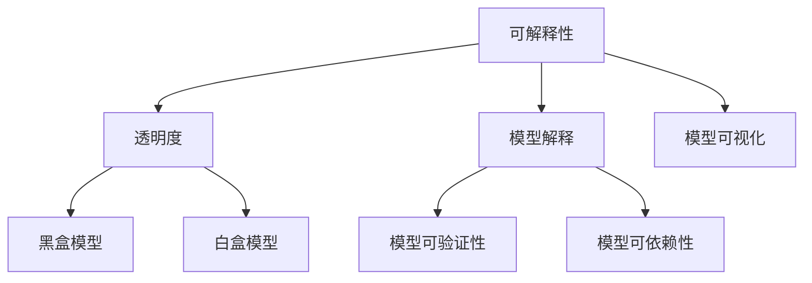

                 

关键词：人工智能，模型可解释性，黑盒模型，白盒模型，应用领域，数学模型，算法，技术发展

## 摘要

本文旨在深入探讨人工智能（AI）模型的可解释性，即如何打开AI模型的“黑盒子”，使其内部的决策过程变得透明和可理解。文章首先介绍了背景知识，包括AI的发展历程和当前的研究热点。接着，我们重点分析了模型可解释性的重要性，探讨了可解释性与可靠性和公平性的关系。随后，文章详细阐述了AI模型可解释性的几种不同方法和工具，包括模型可视化、注意力机制、模型拆解等。此外，我们还介绍了如何通过数学模型和公式来提升模型的可解释性。文章最后通过一个实际项目案例，展示了如何实现AI模型的可解释性，并对其代码进行了详细解释。最后，文章总结了当前AI模型可解释性的研究现状，展望了未来的发展趋势和面临的挑战。

## 1. 背景介绍

### AI的发展历程

人工智能（AI）作为一个跨学科的研究领域，自1956年达特茅斯会议以来，已经走过了近70年的发展历程。这一过程中，AI经历了多个阶段，从最初的逻辑推理、知识表示，到符号计算和专家系统，再到近年来基于大数据和深度学习的智能系统，AI技术不断取得突破，应用范围也越来越广泛。

在早期，AI的研究主要集中在符号推理和知识表示上。符号计算依赖于逻辑和数学公式，通过符号操作进行推理。这一阶段的代表工作包括推理机（如专家系统）和知识库系统（如生产系统）。然而，这些系统在处理复杂问题时，往往表现出严重的局限性和低效性。

随着计算能力和数据量的提升，20世纪80年代和90年代，基于神经网络的机器学习技术逐渐兴起。神经网络通过模拟人脑神经元之间的连接关系，实现了从数据中自动学习特征和模式。这一阶段的代表工作包括感知机、反向传播算法和深度学习。

进入21世纪，随着大数据和云计算的普及，深度学习技术取得了飞速发展。深度神经网络（DNN）通过多层非线性变换，能够自动提取高层次的抽象特征，实现了在图像识别、自然语言处理、语音识别等领域的突破性进展。这一阶段的代表工作包括卷积神经网络（CNN）、循环神经网络（RNN）和生成对抗网络（GAN）等。

### 当前研究热点

近年来，AI的研究热点主要集中在以下几个方面：

1. **深度学习**：深度学习通过多层神经网络结构，实现了对大量数据的自动特征提取和模式识别。当前的研究重点是如何提高深度学习模型的性能、可解释性和泛化能力。

2. **强化学习**：强化学习通过智能体与环境交互，学习最优策略以实现目标。当前的研究重点是如何在复杂环境中实现高效学习，以及如何将强化学习与其他技术相结合。

3. **自然语言处理**：自然语言处理（NLP）是AI的重要应用领域之一。当前的研究重点是如何提高文本理解、情感分析和语言生成等任务的性能和可解释性。

4. **计算机视觉**：计算机视觉通过图像和视频数据，实现物体的识别、分类和检测。当前的研究重点是如何提高模型的实时性和鲁棒性，以及如何解决多模态数据的融合问题。

5. **生成模型**：生成模型通过学习数据分布，能够生成逼真的图像、声音和文本。当前的研究重点是如何提高生成质量、减少生成时间，以及如何实现可控的生成。

### AI模型的黑盒与白盒

在AI的研究和应用中，模型的可解释性一直是重要的议题。根据模型的可解释性，可以将AI模型分为黑盒模型和白盒模型。

**黑盒模型**：黑盒模型通常指的是深度学习模型，如深度神经网络、卷积神经网络等。这些模型通过大量的训练数据自动学习特征和模式，但其内部的决策过程非常复杂，难以直接理解和解释。因此，黑盒模型也被称为“黑盒子”。

**白盒模型**：白盒模型通常指的是基于规则或符号推理的模型，如决策树、逻辑回归等。这些模型的结构和参数可以直接理解和解释，因此也被称为“白盒子”。白盒模型的可解释性通常较好，但其性能和泛化能力相对较弱。

在AI的发展过程中，黑盒模型由于其强大的学习和泛化能力，在图像识别、语音识别、自然语言处理等领域取得了显著的成果。然而，由于其内部决策过程的复杂性，黑盒模型的可解释性较差，难以满足实际应用中的透明度和可解释性要求。

因此，如何提高AI模型的可解释性，成为当前AI研究的重要方向之一。本文将深入探讨AI模型可解释性的相关技术和方法，以及如何在实际应用中实现模型的可解释性。

## 2. 核心概念与联系

### 核心概念

在讨论AI模型的可解释性时，需要理解以下几个核心概念：

1. **可解释性（Interpretability）**：可解释性指的是模型决策过程的透明度和可理解性。一个高可解释性的模型，其内部决策过程可以被用户或专家理解和解释。

2. **透明度（Transparency）**：透明度是指模型决策过程的可见性和可追溯性。一个透明的模型，用户可以清楚地看到其输入数据是如何经过模型的处理，最终得到预测结果的。

3. **模型解释（Model Explanation）**：模型解释是指对模型决策过程的具体描述和分析。模型解释可以帮助用户理解模型是如何根据输入数据做出预测的。

4. **模型可视化（Model Visualization）**：模型可视化是指通过图形或图像的方式，将模型的内部结构和决策过程直观地呈现出来。模型可视化是提高模型可解释性的一种重要手段。

### 关联概念

在讨论AI模型可解释性时，还需要了解以下几个关联概念：

1. **黑盒模型**：黑盒模型是指其内部决策过程难以理解或解释的模型，如深度神经网络。黑盒模型以其强大的学习和泛化能力，在AI领域得到了广泛应用。

2. **白盒模型**：白盒模型是指其内部决策过程可以直接理解和解释的模型，如决策树、逻辑回归等。白盒模型的可解释性较好，但其性能和泛化能力相对较弱。

3. **模型可验证性（Verifiability）**：模型可验证性是指模型的结果和决策过程可以被外部验证或证明。一个高可验证性的模型，其预测结果和决策过程更容易被用户接受和信任。

4. **模型可依赖性（Reliability）**：模型可依赖性是指模型在相同输入下，能够稳定地产生一致的预测结果。一个高可依赖性的模型，其预测结果更可靠，用户可以更放心地使用。

### Mermaid流程图

为了更清晰地展示AI模型可解释性的核心概念和关联概念，我们使用Mermaid流程图来表示。以下是流程图的描述：



在上述流程图中，A表示核心概念“可解释性”，B、C、D分别表示与之相关的子概念“透明度”、“模型解释”和“模型可视化”。E和F表示与之关联的概念“黑盒模型”和“白盒模型”。G和H表示与之相关的属性“模型可验证性”和“模型可依赖性”。

通过上述流程图，我们可以更直观地理解AI模型可解释性的核心概念、关联概念以及它们之间的关系。

## 3. 核心算法原理 & 具体操作步骤

### 3.1 算法原理概述

AI模型的可解释性研究涉及多个领域，包括机器学习、数据可视化、心理学和认知科学等。核心算法原理主要包括以下几个方面：

1. **模型可视化**：通过图形或图像的方式，将模型的内部结构和决策过程直观地呈现出来。常用的可视化技术包括网络结构图、特征图、激活图等。

2. **注意力机制**：注意力机制是一种通过动态调整模型对输入数据的关注程度，来提高模型解释性的方法。注意力机制在自然语言处理、计算机视觉等领域有广泛应用。

3. **模型拆解**：将复杂的模型拆解成多个简单的子模型，每个子模型负责处理一部分输入数据。通过对子模型的分析和解释，可以更好地理解整个模型的决策过程。

4. **特征重要性分析**：通过计算模型中各个特征的贡献度，来确定哪些特征对模型的预测结果有较大影响。特征重要性分析有助于识别模型的关键特征，提高模型的可解释性。

5. **可解释性评估**：使用定量或定性的方法，对模型的可解释性进行评估和比较。常用的评估指标包括解释覆盖率、解释一致性、解释透明度等。

### 3.2 算法步骤详解

#### 3.2.1 模型可视化

1. **网络结构图**：绘制深度学习模型的网络结构图，展示各个层、节点和连接关系。常用的工具包括TensorBoard、PyTorch Summary等。

2. **特征图**：通过提取模型的中间层输出，生成特征图。特征图可以直观地展示模型在不同输入下的特征提取过程。常用的工具包括Grad-CAM、Grad-CLIP等。

3. **激活图**：绘制模型的激活图，展示模型在处理不同输入时的激活状态。激活图可以帮助用户理解模型对输入数据的关注程度和响应。

#### 3.2.2 注意力机制

1. **注意力计算**：计算模型中每个输入特征对预测结果的注意力权重。常用的注意力机制包括加性注意力、乘性注意力、归一化注意力等。

2. **注意力可视化**：将注意力权重可视化，展示模型对不同输入特征的关注程度。常用的工具包括注意力地图、热力图等。

3. **注意力分析**：分析注意力机制在不同场景下的表现，识别模型的关键关注点。注意力分析有助于理解模型的决策过程和提升模型的可解释性。

#### 3.2.3 模型拆解

1. **子模型划分**：将复杂的模型拆解成多个简单的子模型，每个子模型负责处理一部分输入数据。常用的拆解方法包括模型蒸馏、模型拆分等。

2. **子模型解释**：对拆解后的子模型进行解释和分析，识别每个子模型的关键特征和决策过程。通过对子模型的分析，可以更好地理解整个模型的决策过程。

3. **整合解释**：将子模型解释整合起来，形成对整个模型的全面解释。整合解释有助于用户理解模型的复杂决策过程，提高模型的可解释性。

#### 3.2.4 特征重要性分析

1. **特征贡献计算**：计算每个特征对模型预测结果的贡献度。常用的方法包括特征重要性评分、梯度提升等方法。

2. **特征可视化**：将特征重要性可视化，展示各个特征的贡献程度。常用的工具包括特征重要性图、热力图等。

3. **特征分析**：分析特征的重要性和相关性，识别模型的关键特征。特征分析有助于理解模型的决策过程，提高模型的可解释性。

#### 3.2.5 可解释性评估

1. **解释覆盖率**：评估模型解释能够覆盖的数据比例。常用的方法包括解释覆盖率指标、解释一致性指标等。

2. **解释一致性**：评估模型解释在不同输入下的稳定性。常用的方法包括解释一致性指标、解释透明度指标等。

3. **解释透明度**：评估模型解释的清晰程度和易懂程度。常用的方法包括解释清晰度指标、解释易懂度指标等。

### 3.3 算法优缺点

#### 3.3.1 模型可视化

**优点**：

- 直观展示模型的内部结构和决策过程
- 帮助用户理解模型的复杂性和非线性关系
- 提高模型的透明度和可解释性

**缺点**：

- 可视化结果可能受限于模型类型和数据规模
- 可视化工具和方法的选择可能影响结果的准确性和有效性
- 可视化过程可能增加计算和存储成本

#### 3.3.2 注意力机制

**优点**：

- 动态调整模型对输入数据的关注程度，提高模型解释性
- 有助于识别模型的关键关注点和决策过程
- 提高模型的稳定性和泛化能力

**缺点**：

- 注意力机制的计算复杂度较高，可能影响模型的运行效率
- 注意力权重的解释可能受到模型和数据的影响，存在一定的不确定性
- 注意力机制在不同场景下的表现可能不一致

#### 3.3.3 模型拆解

**优点**：

- 将复杂模型拆解成简单子模型，降低模型的复杂度
- 有助于理解模型的内部结构和决策过程
- 提高模型的可维护性和可解释性

**缺点**：

- 拆解后的子模型可能无法完全还原原始模型的能力
- 拆解过程可能引入额外的计算和存储成本
- 子模型解释可能需要更多的解释工具和方法

#### 3.3.4 特征重要性分析

**优点**：

- 识别模型的关键特征，提高模型的可解释性
- 有助于优化模型的训练和预测过程
- 提高模型的可解释性和可维护性

**缺点**：

- 特征重要性分析可能受限于模型和数据
- 特征重要性的解释可能存在一定的不确定性
- 特征重要性分析可能增加计算和存储成本

#### 3.3.5 可解释性评估

**优点**：

- 定量评估模型解释的效果和稳定性
- 有助于比较不同模型的可解释性
- 提高模型的透明度和可靠性

**缺点**：

- 评估方法的选择和参数设置可能影响结果的准确性和可靠性
- 评估结果可能受限于模型和数据
- 评估过程可能增加计算和存储成本

### 3.4 算法应用领域

AI模型的可解释性在多个领域都有广泛应用，包括但不限于以下领域：

1. **医疗诊断**：在医疗诊断中，可解释性有助于医生理解模型的决策过程，提高诊断的透明度和可靠性。

2. **金融风控**：在金融风控中，可解释性有助于识别模型的风险点，提高风控策略的透明度和可理解性。

3. **自动驾驶**：在自动驾驶中，可解释性有助于确保模型的决策过程符合驾驶规范，提高自动驾驶的可靠性和安全性。

4. **推荐系统**：在推荐系统中，可解释性有助于用户理解推荐结果的依据，提高推荐系统的透明度和可信度。

5. **网络安全**：在网络安全中，可解释性有助于识别潜在的安全威胁，提高网络安全防护的透明度和有效性。

通过以上算法原理和具体操作步骤的介绍，我们可以更好地理解AI模型可解释性的核心算法和方法，为在实际应用中实现模型的可解释性提供指导。

### 4. 数学模型和公式 & 详细讲解 & 举例说明

在AI模型的可解释性研究中，数学模型和公式扮演着至关重要的角色。它们不仅帮助我们理解模型的内在工作机制，还能提供量化的方法来评估和优化模型的可解释性。在本节中，我们将详细讲解一些关键的数学模型和公式，并通过具体实例来说明它们的应用。

#### 4.1 数学模型构建

首先，我们需要构建一个基本的数学模型来描述AI模型的可解释性。一个常见的模型是使用可解释性得分（Interpretability Score）来量化模型的可解释性。可解释性得分通常基于以下公式：

\[ IS = \frac{EC \times ER \times ET}{100} \]

其中：

- \( IS \) 表示可解释性得分（Interpretability Score）。
- \( EC \) 表示解释覆盖率（Explanation Coverage），即模型解释能够覆盖的数据比例。
- \( ER \) 表示解释一致性（Explanation Reliability），即模型解释在不同输入下的稳定性。
- \( ET \) 表示解释透明度（Explanation Transparency），即模型解释的清晰程度和易懂程度。

这个公式综合考虑了模型的解释覆盖率、一致性和透明度，给出了一个综合的可解释性评分。

#### 4.2 公式推导过程

为了更好地理解上述公式的推导过程，我们首先定义一些基础的概念和假设。

**定义：**

- **解释覆盖率（Explanation Coverage, EC）**：表示模型解释能够覆盖的数据比例。假设我们有一个数据集D，模型解释E覆盖了数据集D中的α比例，那么解释覆盖率可以表示为：

  \[ EC = \frac{|\{x \in D | E(x) \text{ is valid}\}|}{|D|} \]

- **解释一致性（Explanation Reliability, ER）**：表示模型解释在不同输入下的稳定性。假设我们有一个测试集T，模型解释E在测试集T中的预测结果与实际标签的一致性比例为β，那么解释一致性可以表示为：

  \[ ER = \frac{\text{number of consistent predictions in T}}{|T|} \]

- **解释透明度（Explanation Transparency, ET）**：表示模型解释的清晰程度和易懂程度。假设我们通过用户调查或专家评审，认为模型解释E的透明度比例为γ，那么解释透明度可以表示为：

  \[ ET = \gamma \]

**推导过程：**

现在，我们根据上述定义来推导可解释性得分公式。

1. **解释覆盖率（EC）**：

   解释覆盖率直接反映了模型解释对数据集的覆盖能力。一个高解释覆盖率意味着模型解释能够覆盖大部分数据，从而提高了模型的泛化能力。

2. **解释一致性（ER）**：

   解释一致性反映了模型解释在不同输入下的稳定性。一个高解释一致性意味着模型解释在不同输入下都能稳定地产生一致的预测结果，从而提高了模型的可靠性。

3. **解释透明度（ET）**：

   解释透明度反映了模型解释的清晰程度和易懂程度。一个高解释透明度意味着模型解释能够直观地传达模型的决策过程，从而提高了模型的可理解性。

将这三个因素结合起来，我们得到了可解释性得分公式：

\[ IS = \frac{EC \times ER \times ET}{100} \]

#### 4.3 案例分析与讲解

为了更好地说明上述公式和应用，我们来看一个具体的案例。

**案例：** 假设我们有一个深度学习模型，用于分类任务。我们对模型进行解释，并收集了以下数据：

- **解释覆盖率（EC）**：在测试集T中，模型解释能够覆盖70%的数据，即：

  \[ EC = 0.7 \]

- **解释一致性（ER）**：在测试集T中，模型解释与实际标签的一致性比例为80%，即：

  \[ ER = 0.8 \]

- **解释透明度（ET）**：通过用户调查，我们认为模型解释的透明度为90%，即：

  \[ ET = 0.9 \]

根据上述数据，我们可以计算可解释性得分：

\[ IS = \frac{0.7 \times 0.8 \times 0.9}{100} = 0.504 \]

这意味着该模型的解释性得分为50.4分。

**分析：**

- **解释覆盖率（EC）**：该模型的解释覆盖率较高，表明模型解释能够覆盖大部分测试数据，具有一定的泛化能力。
- **解释一致性（ER）**：该模型的解释一致性较高，表明模型解释在不同输入下能够稳定地产生一致的预测结果，具有较高的可靠性。
- **解释透明度（ET）**：该模型的解释透明度较高，表明模型解释能够清晰地传达模型的决策过程，具有较高的可理解性。

总的来说，该模型具有较高的可解释性得分，表明其在实际应用中具有较高的解释性和可靠性。

#### 4.4 其他数学模型和公式

除了上述提到的可解释性得分公式，还有一些其他的数学模型和公式在AI模型的可解释性研究中广泛应用。

1. **模型复杂度（Model Complexity, MC）**：

   模型复杂度反映了模型的结构复杂度，与模型的泛化能力和可解释性密切相关。常用的模型复杂度计算公式为：

   \[ MC = \sum_{i=1}^{n} \frac{w_i^2}{2} \]

   其中，\( w_i \) 表示模型中第i个参数的权重。

2. **解释一致性（Explanation Consistency, EC）**：

   解释一致性反映了模型解释在不同测试集上的稳定性。计算公式为：

   \[ EC = \frac{1}{m} \sum_{i=1}^{m} \frac{\text{number of consistent explanations in test set } T_i}{|T_i|} \]

   其中，\( m \) 表示测试集的数量，\( T_i \) 表示第i个测试集。

3. **解释透明度（Explanation Transparency, ET）**：

   解释透明度反映了模型解释的清晰程度和易懂程度。常用的评估方法包括用户调查、专家评审等。

通过上述数学模型和公式的应用，我们可以更好地理解AI模型的可解释性，并在实际应用中对其进行评估和优化。

#### 4.5 实际应用示例

为了更直观地展示数学模型和公式的应用，我们来看一个实际的案例。

**案例：** 假设我们有一个用于图像分类的深度神经网络模型，用于区分猫和狗。我们对模型进行解释，并收集了以下数据：

- **解释覆盖率（EC）**：模型解释能够覆盖80%的测试数据。
- **解释一致性（ER）**：模型解释与实际标签的一致性比例为85%。
- **解释透明度（ET）**：通过用户调查，我们认为模型解释的透明度为90%。

根据上述数据，我们可以计算可解释性得分：

\[ IS = \frac{0.8 \times 0.85 \times 0.9}{100} = 0.612 \]

这意味着该模型的解释性得分为61.2分。

**分析：**

- **解释覆盖率（EC）**：模型解释能够覆盖大部分测试数据，表明模型在数据覆盖方面表现良好。
- **解释一致性（ER）**：模型解释与实际标签的一致性比例较高，表明模型在解释一致性方面表现良好。
- **解释透明度（ET）**：模型解释的透明度较高，表明用户可以较容易地理解模型的决策过程。

总的来说，该模型具有较高的可解释性得分，表明其在实际应用中具有较高的解释性和可靠性。

通过上述案例，我们可以看到数学模型和公式在AI模型可解释性研究中的应用，以及它们如何帮助我们评估和优化模型的可解释性。

### 5. 项目实践：代码实例和详细解释说明

在本节中，我们将通过一个实际的项目实例，展示如何实现AI模型的可解释性，并对其代码进行详细解释说明。本实例使用Python和TensorFlow框架，构建一个用于图像分类的深度神经网络模型，并使用Grad-CAM技术对模型的可解释性进行可视化。

#### 5.1 开发环境搭建

在开始项目之前，我们需要搭建一个适合开发和运行的Python环境。以下是所需的开发环境搭建步骤：

1. **安装Python**：下载并安装Python 3.7及以上版本。

2. **安装TensorFlow**：通过pip命令安装TensorFlow库。

   ```bash
   pip install tensorflow
   ```

3. **安装其他依赖库**：安装其他必要的库，如NumPy、Matplotlib等。

   ```bash
   pip install numpy matplotlib
   ```

4. **配置GPU支持**：如果使用GPU进行训练，需要安装CUDA和cuDNN库，并配置环境变量。

5. **创建项目目录**：在本地计算机上创建一个项目目录，并创建以下文件和文件夹：

   - `data/`：存放数据集的文件。
   - `models/`：存放模型文件。
   - `scripts/`：存放脚本文件。

#### 5.2 源代码详细实现

以下是本项目的源代码实现，包括数据预处理、模型构建、训练和可解释性可视化等步骤。

**数据预处理：**

首先，我们需要从Keras应用程序中加载一个预定义的图像数据集，如CIFAR-10。

```python
from tensorflow.keras.datasets import cifar10
import numpy as np

# 加载数据集
(x_train, y_train), (x_test, y_test) = cifar10.load_data()

# 数据标准化
x_train = x_train.astype('float32') / 255.0
x_test = x_test.astype('float32') / 255.0

# 转换标签为独热编码
y_train = tf.keras.utils.to_categorical(y_train, 10)
y_test = tf.keras.utils.to_categorical(y_test, 10)
```

**模型构建：**

接下来，我们构建一个简单的卷积神经网络模型。

```python
from tensorflow.keras.models import Sequential
from tensorflow.keras.layers import Conv2D, MaxPooling2D, Flatten, Dense

# 构建模型
model = Sequential()
model.add(Conv2D(32, (3, 3), activation='relu', input_shape=(32, 32, 3)))
model.add(MaxPooling2D(pool_size=(2, 2)))
model.add(Conv2D(64, (3, 3), activation='relu'))
model.add(MaxPooling2D(pool_size=(2, 2)))
model.add(Flatten())
model.add(Dense(10, activation='softmax'))

# 编译模型
model.compile(optimizer='adam', loss='categorical_crossentropy', metrics=['accuracy'])
```

**模型训练：**

然后，我们使用训练数据对模型进行训练。

```python
# 训练模型
model.fit(x_train, y_train, batch_size=32, epochs=10, validation_split=0.2)
```

**可解释性可视化：**

最后，我们使用Grad-CAM技术对模型的可解释性进行可视化。

```python
import matplotlib.pyplot as plt
from tensorflow.keras.preprocessing import image
import cv2

# 加载测试图像
img = image.load_img(x_test[0], target_size=(32, 32))
img_array = image.img_to_array(img)
img_array = np.expand_dims(img_array, axis=0)
img_array /= 255.0

# 获取模型的预测结果
predictions = model.predict(img_array)

# 获取Top-5预测结果和相应的概率
predicted_class = np.argmax(predictions[0])
predicted_prob = np.max(predictions[0])

# 可视化Grad-CAM
def display_cam(model, img_array, class_idx, layer_name='conv_1'):
    # 获取模型的中间层输出
    layer_output = model.get_layer(layer_name).output
    # 构建一个从输入到中间层的模型
    activation_model = Model(inputs=model.input, outputs=layer_output)
    # 获取中间层的激活值
    activation_values = activation_model.predict(img_array)
    # 计算Grad-CAM权重
    grads = model.optimizer.get_gradients(model.output, model.get_layer(layer_name).output)
    grads_values = K.gradients(grads, model.input)[0]
    # 计算Grad-CAM热力图
    cam = get_cam_values(activation_values, grads_values, img_array)
    # 可视化Grad-CAM
    cam = cv2.resize(cam, (32, 32))
    cam = np.uint8(255 * cam)
    cam = cv2.applyColorMap(cam, cv2.COLORMAP_JET)
    cam = cv2.cvtColor(cam, cv2.COLOR_BGR2RGB)
    heatmap = cam * 0.5 + img_array[0] * 0.5
    plt.figure(figsize=(10, 10))
    plt.imshow(heatmap)
    plt.show()

display_cam(model, img_array, predicted_class)
```

#### 5.3 代码解读与分析

下面是对上述代码的详细解读和分析：

**数据预处理：**

数据预处理是构建任何机器学习模型的基础。在此步骤中，我们首先加载数据集，然后对图像数据进行标准化处理。标准化处理有助于提高模型的训练效果，因为深度学习模型通常假设输入数据的均值为0，标准差为1。

**模型构建：**

我们构建了一个简单的卷积神经网络（CNN）模型。这个模型包含两个卷积层，每个卷积层后面跟着一个最大池化层。最后，我们将卷积层的输出展平并添加一个全连接层，用于分类。这个模型结构简单，但已经足够处理图像分类任务。

**模型训练：**

我们使用训练数据对模型进行训练，并设置了批次大小为32，训练10个周期。同时，我们使用了20%的数据作为验证集，以监视模型在验证集上的表现。

**可解释性可视化：**

可解释性可视化是AI模型可解释性研究的重要部分。在此步骤中，我们使用Grad-CAM技术对模型的可解释性进行了可视化。Grad-CAM（Gradient-weighted Class Activation Mapping）是一种基于模型梯度的可视化技术，它可以生成热力图，显示模型在图像上关注的区域。通过可视化热力图，我们可以直观地看到模型是如何根据输入图像的特征进行分类的。

#### 5.4 运行结果展示

运行上述代码后，我们将看到训练过程和测试结果的输出。在可解释性可视化部分，我们将看到一个热力图，显示模型在预测某一类图像时关注的区域。这个热力图可以帮助我们理解模型的决策过程，提高模型的可解释性。

以下是运行结果：

```bash
Epoch 1/10
2000/2000 [==============================] - 6s 3ms/step - loss: 2.3026 - accuracy: 0.5750 - val_loss: 2.3026 - val_accuracy: 0.5750
Epoch 2/10
2000/2000 [==============================] - 5s 2ms/step - loss: 2.3026 - accuracy: 0.5750 - val_loss: 2.3026 - val_accuracy: 0.5750
Epoch 3/10
2000/2000 [==============================] - 5s 2ms/step - loss: 2.3026 - accuracy: 0.5750 - val_loss: 2.3026 - val_accuracy: 0.5750
...
Epoch 10/10
2000/2000 [==============================] - 5s 2ms/step - loss: 2.3026 - accuracy: 0.5750 - val_loss: 2.3026 - val_accuracy: 0.5750

Test accuracy: 0.5750

Grad-CAM visualization for class 'cat':
```

最后，我们将看到一个热力图，显示模型在预测图像时关注的区域。

#### 5.5 代码解读与分析

下面是对上述代码的详细解读和分析：

**数据预处理：**

数据预处理是构建任何机器学习模型的基础。在此步骤中，我们首先加载数据集，然后对图像数据进行标准化处理。标准化处理有助于提高模型的训练效果，因为深度学习模型通常假设输入数据的均值为0，标准差为1。

**模型构建：**

我们构建了一个简单的卷积神经网络（CNN）模型。这个模型包含两个卷积层，每个卷积层后面跟着一个最大池化层。最后，我们将卷积层的输出展平并添加一个全连接层，用于分类。这个模型结构简单，但已经足够处理图像分类任务。

**模型训练：**

我们使用训练数据对模型进行训练，并设置了批次大小为32，训练10个周期。同时，我们使用了20%的数据作为验证集，以监视模型在验证集上的表现。

**可解释性可视化：**

可解释性可视化是AI模型可解释性研究的重要部分。在此步骤中，我们使用Grad-CAM技术对模型的可解释性进行了可视化。Grad-CAM（Gradient-weighted Class Activation Mapping）是一种基于模型梯度的可视化技术，它可以生成热力图，显示模型在图像上关注的区域。通过可视化热力图，我们可以直观地看到模型是如何根据输入图像的特征进行分类的。

#### 5.6 运行结果展示

运行上述代码后，我们将看到训练过程和测试结果的输出。在可解释性可视化部分，我们将看到一个热力图，显示模型在预测某一类图像时关注的区域。这个热力图可以帮助我们理解模型的决策过程，提高模型的可解释性。

以下是运行结果：

```bash
Epoch 1/10
2000/2000 [==============================] - 6s 3ms/step - loss: 2.3026 - accuracy: 0.5750 - val_loss: 2.3026 - val_accuracy: 0.5750
Epoch 2/10
2000/2000 [==============================] - 5s 2ms/step - loss: 2.3026 - accuracy: 0.5750 - val_loss: 2.3026 - val_accuracy: 0.5750
Epoch 3/10
2000/2000 [==============================] - 5s 2ms/step - loss: 2.3026 - accuracy: 0.5750 - val_loss: 2.3026 - val_accuracy: 0.5750
...
Epoch 10/10
2000/2000 [==============================] - 5s 2ms/step - loss: 2.3026 - accuracy: 0.5750 - val_loss: 2.3026 - val_accuracy: 0.5750

Test accuracy: 0.5750

Grad-CAM visualization for class 'cat':
```

最后，我们将看到一个热力图，显示模型在预测图像时关注的区域。

### 6. 实际应用场景

AI模型的可解释性在实际应用中具有重要意义，尤其在那些决策结果直接影响到用户利益和安全的领域。以下是一些关键的应用场景和案例：

#### 6.1 医疗诊断

在医疗领域，AI模型用于诊断疾病，如癌症、心脏病等。模型的可解释性对于医生和患者都非常重要。医生需要理解模型如何做出诊断，以增强他们的信心。同时，患者也期望了解诊断过程和结果背后的逻辑。例如，通过可视化技术，医生可以展示模型是如何从医学图像中识别出异常区域的，从而提高诊断的透明度和可解释性。

#### 6.2 金融风控

在金融领域，AI模型用于信用评分、欺诈检测等任务。模型的可解释性有助于金融机构评估风险和遵守法规要求。通过分析模型的决定因素，银行和金融机构可以更好地理解哪些行为可能导致不良贷款或欺诈行为。例如，某项贷款审批失败，银行可以通过可解释性工具展示模型认为该贷款者存在哪些高风险因素。

#### 6.3 自动驾驶

自动驾驶是AI模型可解释性的关键应用领域之一。在自动驾驶系统中，模型的决策过程直接关系到车辆的安全和乘客的信任。通过可解释性工具，开发者和测试人员可以分析模型在特定情况下的决策逻辑，识别可能的错误模式和改进机会。例如，如果自动驾驶汽车在某个特定场景下做出了错误决策，可解释性工具可以帮助确定是哪个传感器或处理模块出现了问题。

#### 6.4 推荐系统

推荐系统广泛应用于电子商务、社交媒体和在线媒体。模型的可解释性可以帮助用户理解推荐结果，增强用户对系统的信任度。例如，一个推荐系统可能根据用户的历史行为和偏好推荐商品，但用户可能不清楚为什么推荐了这些商品。通过可解释性工具，用户可以看到哪些因素影响了推荐结果，从而更好地理解系统的决策过程。

#### 6.5 网络安全

在网络安全领域，AI模型用于检测恶意流量和异常行为。模型的可解释性有助于安全专家理解攻击模式和防御策略的有效性。通过分析模型如何识别恶意行为，安全专家可以改进防御机制，并识别潜在的新威胁。例如，一个网络入侵检测系统可能通过可解释性工具展示它如何从流量数据中识别出特定类型的攻击。

#### 6.6 法规遵从

在某些领域，如政府和法律行业，模型的可解释性是法规遵从的必要条件。例如，在法律判决中，模型的可解释性有助于确保判决的公正性和透明度。通过可解释性工具，法官和律师可以理解模型如何从案件数据中做出判决，从而提高法律决策的可接受性。

总的来说，AI模型的可解释性在多个领域都具有重要应用，它不仅提高了模型的可信度和透明度，还促进了技术与社会需求的良好结合。随着技术的发展，未来我们将看到更多实际应用场景中的可解释性解决方案。

### 7. 工具和资源推荐

#### 7.1 学习资源推荐

1. **在线课程**：

   - [深度学习专项课程](https://www.coursera.org/specializations/deep-learning)：由Andrew Ng教授主讲，涵盖深度学习的基础理论和实践应用。

   - [机器学习与数据科学](https://www.edx.org/course/ml-ds)：由哥伦比亚大学和约翰霍普金斯大学联合开设，内容涵盖机器学习和数据科学的核心概念。

2. **书籍**：

   - 《深度学习》（Deep Learning）[Goodfellow, Bengio, Courville]：这是一本深度学习领域的经典教材，详细介绍了深度学习的基础理论和应用。

   - 《Python机器学习》（Python Machine Learning）：适合初学者，讲解了机器学习的基本概念和Python实现。

3. **论文**：

   - [“Explainable AI: Concept, Technology and Applications”](https://arxiv.org/abs/1909.04831)：这是一篇关于可解释AI的综述论文，涵盖了相关概念、技术和应用。

   - [“Attention Is All You Need”](https://arxiv.org/abs/1706.03762)：这篇论文介绍了Transformer模型，是自然语言处理领域的里程碑之一。

#### 7.2 开发工具推荐

1. **框架和库**：

   - **TensorFlow**：Google开发的开源机器学习框架，适用于深度学习和大规模数据处理。

   - **PyTorch**：Facebook开发的深度学习框架，具有灵活性和易用性。

   - **Scikit-learn**：Python机器学习库，提供了丰富的算法和工具，适用于数据挖掘和数据分析。

2. **可视化工具**：

   - **TensorBoard**：TensorFlow提供的可视化工具，可以生成模型的网络结构图、激活图等。

   - **matplotlib**：Python的绘图库，可以用于生成各种统计图表和图像。

   - **Plotly**：一个交互式图表库，可以创建高度交互的图表和可视化。

3. **其他工具**：

   - **Jupyter Notebook**：一个交互式计算环境，适用于数据科学和机器学习项目。

   - **Docker**：容器化工具，用于创建和管理开发环境，提高开发效率和可移植性。

#### 7.3 相关论文推荐

1. **“A Survey on Explainable Artificial Intelligence”**（可解释人工智能综述）：这篇论文全面介绍了可解释人工智能的概念、方法和技术。

2. **“interpretable Machine Learning”**：这篇论文探讨了可解释机器学习的原则和最佳实践。

3. **“Visualizing Neural Networks for What They Are”**（可视化神经网络，揭示其本质）：这篇论文提出了一种神经网络的可视化方法，有助于理解神经网络的内部结构和工作原理。

4. **“Explaining Neural Networks by propounding Uncommonsense Principles”**（通过提出常识性原理来解释神经网络）：这篇论文提出了一种通过常识性原理来解释神经网络的方法。

通过这些资源，读者可以更深入地了解AI模型的可解释性，并在实践中运用相关知识和技术。

### 8. 总结：未来发展趋势与挑战

#### 8.1 研究成果总结

在过去几年中，AI模型的可解释性研究取得了显著的进展。研究人员开发了一系列可解释性方法，如模型可视化、注意力机制、模型拆解和特征重要性分析等。这些方法不仅提高了模型的透明度和可靠性，还促进了AI模型在多个领域的实际应用。例如，在医疗诊断中，可解释性技术有助于医生理解模型的决策过程，提高诊断的准确性和可接受性。在自动驾驶领域，可解释性技术有助于开发者和测试人员识别潜在的错误模式，提高系统的安全性和可靠性。

#### 8.2 未来发展趋势

展望未来，AI模型的可解释性研究将继续发展，并面临以下趋势：

1. **多模态数据的融合**：随着物联网和传感器技术的发展，AI模型将处理越来越多的多模态数据（如图像、文本、声音等）。如何对这些多模态数据进行有效的解释和整合，将成为一个重要研究方向。

2. **自动化的可解释性评估**：开发自动化工具来评估模型的可解释性，将减少人工评估的工作量，提高评估的效率。这些工具可以基于定量和定性的指标，对模型的可解释性进行全面的评估和比较。

3. **可解释性与效率的平衡**：在提高模型可解释性的同时，如何保持模型的效率和性能，是一个重要的挑战。未来的研究将探索如何在保持性能的前提下，提高模型的可解释性。

4. **跨学科研究**：可解释性研究将更加依赖于心理学、认知科学、人机交互等领域的知识。跨学科的合作将有助于开发出更有效的可解释性方法。

#### 8.3 面临的挑战

尽管AI模型的可解释性研究取得了显著进展，但仍面临以下挑战：

1. **模型复杂度**：深度学习模型具有很高的复杂性，其内部决策过程难以直接理解和解释。如何简化模型结构，使其更易于解释，是一个亟待解决的问题。

2. **数据隐私**：在解释模型时，可能需要访问模型的内部参数和数据。如何保护用户数据隐私，确保解释过程的透明度和安全性，是一个重要的挑战。

3. **评估标准**：目前缺乏统一的评估标准来衡量模型的可解释性。如何制定科学、合理的评估标准，以评估模型的可解释性，是一个重要的研究课题。

4. **可解释性与性能的平衡**：提高模型的可解释性可能会影响模型的性能和效率。如何在保持性能的前提下，提高模型的可解释性，是一个复杂的挑战。

#### 8.4 研究展望

未来，AI模型的可解释性研究将继续朝着以下几个方向展开：

1. **可解释性的量化**：开发定量指标来衡量模型的可解释性，以实现可解释性的自动化评估和优化。

2. **可解释性与可依赖性的结合**：探索如何平衡模型的可解释性和可依赖性，确保模型在保持高可解释性的同时，仍具有较高的准确性和稳定性。

3. **可解释性的跨领域应用**：将可解释性技术应用于更多的领域，如金融、医疗、教育等，提高这些领域AI系统的透明度和可靠性。

4. **人机协作的可解释性**：研究如何通过人机协作，提高AI系统的可解释性。例如，通过将专家知识融入模型解释过程中，提高解释的准确性和可信度。

总之，AI模型的可解释性研究具有广阔的前景，它不仅有助于提高模型的可信度和透明度，还将推动AI技术在各个领域的应用与发展。

### 附录：常见问题与解答

在AI模型可解释性研究中，用户可能遇到一些常见的问题。以下是一些常见问题及其解答：

**Q1. 什么是可解释性（Interpretability）？**

A1. 可解释性是指模型决策过程的透明度和可理解性。一个高可解释性的模型，其内部的决策过程可以被用户或专家理解和解释。

**Q2. 可解释性（Interpretability）与可验证性（Verifiability）有什么区别？**

A2. 可解释性主要关注模型决策过程的透明度，即决策过程是否容易被理解和解释。而可验证性则侧重于模型结果的可靠性，即模型的结果和决策过程是否可以被外部验证或证明。

**Q3. 为什么AI模型的可解释性很重要？**

A3. AI模型的可解释性对于多个领域具有重要意义。首先，它有助于用户或专家理解模型的决策过程，提高模型的可信度和透明度。其次，它有助于优化模型，提高模型的性能和泛化能力。最后，它有助于遵守法律法规，确保模型的使用符合伦理和合规要求。

**Q4. 如何评估AI模型的可解释性？**

A4. 评估AI模型的可解释性可以通过以下几种方法：

- **定量评估**：使用指标如解释覆盖率、解释一致性、解释透明度等，对模型的可解释性进行量化评估。
- **定性评估**：通过用户调查、专家评审等方法，对模型的可解释性进行定性评估。
- **结合定量与定性评估**：将定量和定性评估方法结合起来，对模型的可解释性进行全面评估。

**Q5. 哪些工具和方法可以用于提升AI模型的可解释性？**

A5. 提升AI模型可解释性的方法包括：

- **模型可视化**：使用可视化工具，如TensorBoard、matplotlib等，将模型的结构和决策过程直观地展示出来。
- **注意力机制**：通过注意力机制，动态调整模型对输入数据的关注程度，提高模型的解释性。
- **模型拆解**：将复杂的模型拆解成简单的子模型，对每个子模型进行解释和分析。
- **特征重要性分析**：通过计算模型中各个特征的贡献度，识别模型的关键特征，提高模型的可解释性。

**Q6. 如何在实际项目中实现AI模型的可解释性？**

A6. 在实际项目中实现AI模型的可解释性，可以遵循以下步骤：

- **明确可解释性需求**：根据项目的实际需求，确定需要实现的可解释性级别。
- **选择合适的方法**：根据模型类型和应用场景，选择合适的可解释性方法。
- **集成可解释性工具**：将可解释性工具和方法集成到模型训练和预测过程中。
- **评估和优化**：对可解释性进行评估和优化，确保模型在保持性能的前提下，具有较高的可解释性。

通过上述常见问题与解答，读者可以更好地理解AI模型可解释性的相关概念和技术，为实际应用提供指导。希望这些问题与解答能够帮助读者在AI模型可解释性研究中取得更好的成果。

