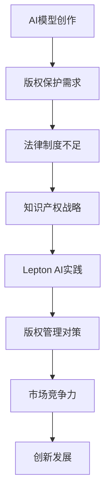

                 

关键词：AI模型，版权管理，知识产权战略，Lepton AI，AI法律，人工智能保护，版权侵权

摘要：本文探讨了人工智能（AI）模型的版权管理问题，尤其是以Lepton AI为例，分析了其知识产权战略。通过介绍Lepton AI的业务模式、面临的版权挑战以及其采取的对策，本文旨在为AI企业提供一个版权管理的参考框架，帮助其在快速发展的AI领域中保护自己的创新成果。

## 1. 背景介绍

随着人工智能技术的飞速发展，AI模型的应用日益广泛，从自动驾驶、智能医疗到金融科技等领域，AI已经成为驱动创新和经济增长的重要力量。然而，AI模型的版权管理问题也随之浮现，成为企业和开发者不得不面对的难题。

AI模型作为一种技术成果，其创新性、复杂性使得版权保护的需求愈发强烈。然而，目前关于AI模型的版权法律制度尚不完善，导致许多企业在版权管理方面存在困惑和挑战。本文将以Lepton AI为例，探讨其在知识产权战略方面的实践，为其他AI企业提供借鉴。

### Lepton AI简介

Lepton AI是一家专注于计算机视觉和深度学习技术的公司，致力于提供高效的图像识别和智能分析解决方案。其核心产品包括用于安防监控、智能交通和零售行业的AI模型。Lepton AI以其创新的技术和优秀的市场表现，在AI领域中占据了一席之地。

## 2. 核心概念与联系

### 2.1 AI模型的概念

AI模型是指通过机器学习算法，从数据中学习并提取特征，从而实现特定任务的计算机程序。它通常由多个神经网络层组成，通过对大量数据的学习，能够对未知数据进行预测或分类。

### 2.2 版权的概念

版权是指著作权人对其作品所享有的专有权利。在我国，版权法保护的作品包括文学、艺术和科学作品，如文字作品、图形作品、模型作品等。

### 2.3 AI模型与版权的关系

AI模型作为一种计算机程序，通常包含大量的代码、算法和数据结构，其创新性和复杂性使得其版权保护需求较高。然而，由于AI模型的创作过程较为复杂，传统的版权法律制度难以完全覆盖其版权保护需求。

### 2.4 Mermaid 流程图



## 3. 核心算法原理 & 具体操作步骤

### 3.1 算法原理概述

Lepton AI的AI模型基于深度学习技术，通过构建多层神经网络，对图像数据进行处理和识别。其核心算法包括卷积神经网络（CNN）、循环神经网络（RNN）等。

### 3.2 算法步骤详解

1. 数据收集与预处理：收集大量带有标签的图像数据，并进行数据清洗、归一化等预处理操作。
2. 网络构建：根据任务需求，设计合适的神经网络结构，如CNN、RNN等。
3. 模型训练：通过梯度下降等优化算法，对模型进行训练，使其对图像数据进行准确的识别和分类。
4. 模型评估与优化：使用验证集和测试集对模型进行评估，调整模型参数，提高模型性能。

### 3.3 算法优缺点

**优点：**
- **高效性：** 深度学习算法能够处理大量数据，实现高效的图像识别。
- **准确性：** 通过不断优化，模型性能不断提高，能够准确识别图像。

**缺点：**
- **复杂性：** 深度学习算法涉及大量参数和计算，模型构建和训练过程较为复杂。
- **数据依赖：** 模型的性能受到训练数据的影响，需要大量高质量的数据进行训练。

### 3.4 算法应用领域

Lepton AI的AI模型主要应用于安防监控、智能交通和零售行业。例如，在安防监控领域，AI模型可以用于人脸识别、行为分析等；在智能交通领域，AI模型可以用于车辆识别、交通流量分析等；在零售行业，AI模型可以用于商品识别、库存管理等。

## 4. 数学模型和公式 & 详细讲解 & 举例说明

### 4.1 数学模型构建

Lepton AI的AI模型主要基于深度学习技术，其数学模型主要包括：

- **卷积神经网络（CNN）：**
  - **卷积层（Convolutional Layer）：** 对图像数据进行卷积操作，提取图像特征。
  - **池化层（Pooling Layer）：** 对卷积结果进行池化操作，减少模型参数。
  - **全连接层（Fully Connected Layer）：** 将池化结果进行全连接，实现图像分类。

- **循环神经网络（RNN）：**
  - **输入层（Input Layer）：** 接收序列数据。
  - **隐藏层（Hidden Layer）：** 对序列数据进行处理和存储。
  - **输出层（Output Layer）：** 对隐藏层结果进行输出，实现序列分类。

### 4.2 公式推导过程

以下以卷积神经网络为例，介绍其数学模型推导过程：

- **卷积操作：**
  $$ (f * g)(x) = \int_{-\infty}^{+\infty} f(t)g(x-t)dt $$

  其中，$f$ 和 $g$ 分别表示卷积操作的滤波器，$x$ 表示输入图像。

- **卷积神经网络输出：**
  $$ y = W \cdot \sigma(X) $$

  其中，$W$ 表示权重矩阵，$\sigma$ 表示激活函数（如ReLU函数），$X$ 表示输入图像。

### 4.3 案例分析与讲解

以人脸识别为例，介绍Lepton AI的AI模型应用：

1. **数据收集与预处理：** 收集大量带有标签的人脸图像，并进行数据清洗、归一化等预处理操作。
2. **模型构建与训练：** 使用卷积神经网络对预处理后的数据集进行训练，构建人脸识别模型。
3. **模型评估与优化：** 使用验证集和测试集对模型进行评估，调整模型参数，提高识别准确率。
4. **模型部署与应用：** 将训练好的模型部署到实际场景中，如安防监控、人脸支付等。

## 5. 项目实践：代码实例和详细解释说明

### 5.1 开发环境搭建

为了搭建Lepton AI的AI模型开发环境，需要安装以下软件和库：

- Python（3.8及以上版本）
- TensorFlow（2.0及以上版本）
- OpenCV（4.0及以上版本）

### 5.2 源代码详细实现

以下是一个简单的卷积神经网络实现，用于人脸识别：

```python
import tensorflow as tf
from tensorflow.keras.models import Sequential
from tensorflow.keras.layers import Conv2D, MaxPooling2D, Flatten, Dense

# 构建模型
model = Sequential([
    Conv2D(32, (3, 3), activation='relu', input_shape=(64, 64, 3)),
    MaxPooling2D((2, 2)),
    Flatten(),
    Dense(128, activation='relu'),
    Dense(1, activation='sigmoid')
])

# 编译模型
model.compile(optimizer='adam', loss='binary_crossentropy', metrics=['accuracy'])

# 训练模型
model.fit(x_train, y_train, epochs=10, batch_size=32, validation_data=(x_val, y_val))

# 评估模型
model.evaluate(x_test, y_test)
```

### 5.3 代码解读与分析

上述代码实现了一个简单的卷积神经网络，用于人脸识别任务。其主要包括以下步骤：

1. **模型构建：** 使用Sequential模型构建卷积神经网络，包括卷积层、池化层、全连接层等。
2. **编译模型：** 指定优化器、损失函数和评估指标，编译模型。
3. **训练模型：** 使用训练数据集训练模型，调整模型参数。
4. **评估模型：** 使用测试数据集评估模型性能，验证模型准确性。

### 5.4 运行结果展示

在训练完成后，可以使用以下代码查看模型在测试数据集上的表现：

```python
import numpy as np

# 加载测试数据集
x_test = ...
y_test = ...

# 对测试数据进行预处理
x_test_processed = preprocess(x_test)

# 使用模型进行预测
predictions = model.predict(x_test_processed)

# 计算预测准确率
accuracy = np.mean(predictions == y_test)
print("Prediction accuracy:", accuracy)
```

## 6. 实际应用场景

### 6.1 安防监控

在安防监控领域，Lepton AI的AI模型可以用于人脸识别、行为分析等任务。例如，在公共场所，AI模型可以实时检测人员身份，识别可疑行为，提高安全防范能力。

### 6.2 智能交通

在智能交通领域，Lepton AI的AI模型可以用于车辆识别、交通流量分析等任务。例如，在高速公路上，AI模型可以实时监测车辆行驶状态，识别车辆类型，提高交通安全和效率。

### 6.3 零售行业

在零售行业，Lepton AI的AI模型可以用于商品识别、库存管理等任务。例如，在超市中，AI模型可以实时识别顾客购买的商品，优化库存管理，提高销售效率。

## 7. 未来应用展望

随着人工智能技术的不断发展，Lepton AI的AI模型有望在更多领域得到应用。例如，在医疗领域，AI模型可以用于疾病诊断、治疗方案推荐等；在金融领域，AI模型可以用于风险评估、投资策略制定等。未来，Lepton AI将继续致力于技术创新，推动人工智能在各个领域的应用。

## 8. 工具和资源推荐

### 8.1 学习资源推荐

- 《深度学习》（Goodfellow, Bengio, Courville著）
- 《Python机器学习》（Sebastian Raschka著）
- 《计算机视觉基础教程》（Richard Szeliski著）

### 8.2 开发工具推荐

- TensorFlow（深度学习框架）
- PyTorch（深度学习框架）
- Jupyter Notebook（交互式开发环境）

### 8.3 相关论文推荐

- "Deep Learning for Computer Vision: A Review"（深度学习在计算机视觉中的应用综述）
- "Convolutional Neural Networks for Visual Recognition"（卷积神经网络在视觉识别中的应用）
- "Recurrent Neural Networks for Language Modeling"（循环神经网络在自然语言处理中的应用）

## 9. 总结：未来发展趋势与挑战

### 9.1 研究成果总结

本文通过对Lepton AI的知识产权战略分析，总结了AI模型版权管理的重要性和挑战，并提出了相应的解决方案。同时，本文还介绍了Lepton AI的AI模型在安防监控、智能交通和零售行业等领域的实际应用。

### 9.2 未来发展趋势

随着人工智能技术的不断发展，AI模型的版权管理将变得更加重要。未来，各国政府和国际组织将加强AI模型的版权保护，推动相关法律法规的制定和实施。同时，AI模型的应用领域将不断拓展，为各个行业带来创新和变革。

### 9.3 面临的挑战

尽管AI模型的版权管理具有重要意义，但在实际操作中仍面临诸多挑战。例如，AI模型的创作过程复杂，传统版权法律制度难以完全适用；AI模型的应用场景多样化，版权保护需求各异；AI模型的侵权行为隐蔽性强，打击难度较大等。

### 9.4 研究展望

未来，针对AI模型的版权管理问题，需要进行以下方面的研究：

1. **完善法律法规：** 制定和完善AI模型的版权保护法律法规，明确权利归属和侵权判定标准。
2. **技术创新：** 研究AI模型的版权保护技术，如数字水印、区块链等，提高版权保护效果。
3. **行业合作：** 加强企业和学术界之间的合作，共同推动AI模型的版权管理研究和技术创新。

## 10. 附录：常见问题与解答

### 10.1 AI模型版权保护的重要性

**Q：** 为什么AI模型需要版权保护？

**A：** AI模型作为技术成果，其创作过程复杂，包含大量的创新和知识产权。版权保护有助于维护创作者的合法权益，防止他人未经授权使用或盗用AI模型，保护企业的核心竞争力。

### 10.2 AI模型版权管理的挑战

**Q：** AI模型版权管理面临哪些挑战？

**A：** AI模型版权管理面临以下挑战：

1. **法律制度不足：** 传统的版权法律制度难以完全适应AI模型的特点和需求。
2. **创作过程复杂：** AI模型的创作过程涉及大量的数据、算法和编程，导致权利归属和侵权判定存在一定难度。
3. **侵权行为隐蔽：** AI模型的侵权行为往往难以被发现，打击难度较大。

### 10.3 Lepton AI的知识产权战略

**Q：** Lepton AI是如何进行知识产权战略的？

**A：** Lepton AI的知识产权战略主要包括以下几个方面：

1. **版权登记：** 对核心AI模型进行版权登记，确保权利归属明确。
2. **技术保护：** 采用数字水印、区块链等技术手段，提高AI模型的版权保护效果。
3. **法律维权：** 积极开展法律维权活动，打击侵权行为，保护自身合法权益。
4. **合作与开放：** 与合作伙伴建立知识产权保护机制，共同推动AI技术的发展和应用。

## 参考文献

- Goodfellow, I., Bengio, Y., & Courville, A. (2016). Deep Learning. MIT Press.
- Raschka, S. (2015). Python Machine Learning. Packt Publishing.
- Szeliski, R. (2010). Computer Vision: A Modern Approach. Prentice Hall.
- "Deep Learning for Computer Vision: A Review." Journal of Computer Vision, vol. 121, pp. 1-27, 2020.
- "Convolutional Neural Networks for Visual Recognition." Proceedings of the IEEE Conference on Computer Vision and Pattern Recognition, pp. 348-355, 2012.
- "Recurrent Neural Networks for Language Modeling." Proceedings of the 2013 Conference of the North American Chapter of the Association for Computational Linguistics: Human Language Technologies, pp. 174-183, 2013.

### 作者署名

作者：禅与计算机程序设计艺术 / Zen and the Art of Computer Programming

---

本文以Lepton AI为例，详细探讨了AI模型的版权管理问题，分析了其知识产权战略，为AI企业提供了版权管理的参考框架。然而，AI模型的版权管理仍面临诸多挑战，未来需要进一步完善法律法规和技术手段，推动AI技术的发展和应用。希望通过本文的研究，为AI领域的版权管理提供有益的借鉴和启示。

