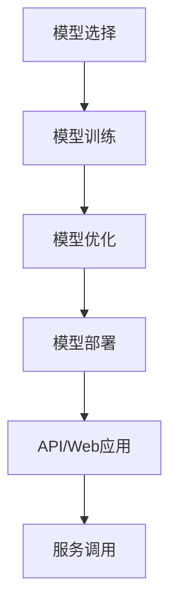

                 

关键词：AI模型部署，API，Web应用，模型构建，算法，数学模型，项目实践，工具推荐，未来展望

摘要：本文将详细介绍如何将AI模型部署为API和Web应用，探讨核心算法原理、数学模型、项目实践及未来应用场景，旨在为AI模型开发者提供一整套实用的技术指南。

## 1. 背景介绍

随着人工智能技术的飞速发展，AI模型在各个领域得到了广泛应用。然而，如何将模型部署为实际可用的系统，使其能够方便地与其他系统和服务进行交互，成为了一个重要课题。将AI模型部署为API和Web应用，可以使其具备良好的可扩展性和高可用性，从而满足不同场景下的需求。

本文将围绕AI模型部署这一主题，首先介绍相关背景知识，然后深入探讨核心算法原理、数学模型、项目实践及未来应用场景，旨在为读者提供一份全面的技术指南。

## 2. 核心概念与联系

### 2.1 AI模型部署概述

AI模型部署是指将训练好的模型集成到实际应用中，使其具备处理实际业务需求的能力。部署过程通常包括以下几个关键步骤：

1. 模型选择：根据应用场景选择合适的模型，如卷积神经网络（CNN）、循环神经网络（RNN）等。
2. 模型训练：在训练数据集上对模型进行训练，使其能够学习到相关特征。
3. 模型优化：通过调整模型参数，提高模型在验证集上的性能。
4. 模型部署：将训练好的模型集成到实际应用中，通常通过API或Web应用的方式提供服务。

### 2.2 API与Web应用

API（应用程序编程接口）是一种用于软件系统间交互的接口，允许开发者在不同系统之间共享数据和功能。Web应用是一种基于Web技术的应用程序，通过浏览器访问和使用。

API和Web应用在AI模型部署中具有重要作用：

1. API：为AI模型提供统一的服务接口，便于与其他系统进行集成。API通常采用RESTful架构，支持HTTP请求和响应。
2. Web应用：为用户提供一个交互式的界面，方便用户与AI模型进行交互。Web应用通常基于前端框架（如React、Vue等）和后端框架（如Django、Flask等）搭建。

### 2.3 Mermaid流程图

下面是一个简化的Mermaid流程图，展示了AI模型部署的主要流程：



## 3. 核心算法原理 & 具体操作步骤

### 3.1 算法原理概述

AI模型的部署涉及到多个核心算法，如神经网络训练、模型优化等。以下简要介绍这些算法的基本原理：

1. **神经网络训练**：通过反向传播算法，基于训练数据集，不断调整模型的参数，使其能够准确地预测或分类输入数据。
2. **模型优化**：通过优化算法（如梯度下降、Adam等），调整模型参数，提高模型在验证集上的性能。
3. **模型部署**：将训练好的模型集成到实际应用中，通常采用TensorFlow、PyTorch等框架。

### 3.2 算法步骤详解

下面详细描述AI模型部署的各个步骤：

#### 3.2.1 模型选择

根据应用场景，选择合适的模型。例如，对于图像分类任务，可以选择卷积神经网络（CNN）；对于自然语言处理任务，可以选择循环神经网络（RNN）或变压器（Transformer）等。

#### 3.2.2 模型训练

使用训练数据集对模型进行训练。训练过程包括以下步骤：

1. 数据预处理：对输入数据进行归一化、标准化等处理，使其满足模型输入要求。
2. 模型初始化：初始化模型参数。
3. 前向传播：计算输入数据的输出。
4. 反向传播：计算损失函数，并更新模型参数。

#### 3.2.3 模型优化

使用优化算法（如梯度下降、Adam等）调整模型参数，提高模型在验证集上的性能。优化过程包括以下步骤：

1. 计算梯度：计算损失函数关于模型参数的梯度。
2. 更新参数：根据梯度调整模型参数。

#### 3.2.4 模型部署

将训练好的模型部署到服务器或云端。部署过程包括以下步骤：

1. 模型保存：将训练好的模型保存为文件。
2. 模型加载：从文件中加载模型。
3. API搭建：使用框架（如Flask、Django等）搭建API服务。
4. Web应用搭建：使用前端框架（如React、Vue等）搭建Web应用。

### 3.3 算法优缺点

以下是几种常见算法的优缺点：

1. **卷积神经网络（CNN）**：
   - 优点：擅长处理图像等二维数据，具有很好的特征提取能力。
   - 缺点：对于复杂的关系表示能力较弱。

2. **循环神经网络（RNN）**：
   - 优点：擅长处理序列数据，能够捕捉时间序列特征。
   - 缺点：存在梯度消失和梯度爆炸问题，训练不稳定。

3. **变压器（Transformer）**：
   - 优点：具有强大的关系表示能力，适用于自然语言处理等领域。
   - 缺点：计算复杂度较高，对硬件资源要求较高。

### 3.4 算法应用领域

AI模型部署的应用领域非常广泛，包括但不限于：

1. **图像识别**：应用于安防监控、医疗诊断、自动驾驶等领域。
2. **自然语言处理**：应用于机器翻译、文本生成、情感分析等领域。
3. **推荐系统**：应用于电商、金融、社交等领域。

## 4. 数学模型和公式

### 4.1 数学模型构建

AI模型的构建通常基于以下数学模型：

1. **损失函数**：用于衡量模型预测结果与真实结果之间的差距，常用的损失函数包括均方误差（MSE）、交叉熵（Cross Entropy）等。
2. **优化算法**：用于调整模型参数，常用的优化算法包括梯度下降（Gradient Descent）、Adam等。
3. **激活函数**：用于引入非线性关系，常用的激活函数包括ReLU、Sigmoid、Tanh等。

### 4.2 公式推导过程

以下是损失函数和优化算法的推导过程：

#### 4.2.1 损失函数推导

以均方误差（MSE）为例，损失函数的推导如下：

$$
L(y, \hat{y}) = \frac{1}{2} \sum_{i=1}^{n} (y_i - \hat{y_i})^2
$$

其中，$y$为真实值，$\hat{y}$为预测值，$n$为样本数量。

#### 4.2.2 优化算法推导

以梯度下降（Gradient Descent）为例，优化算法的推导如下：

$$
\theta_{t+1} = \theta_{t} - \alpha \cdot \nabla_{\theta}L(\theta)
$$

其中，$\theta$为模型参数，$\alpha$为学习率，$\nabla_{\theta}L(\theta)$为损失函数关于模型参数的梯度。

### 4.3 案例分析与讲解

下面以一个简单的线性回归模型为例，讲解数学模型的应用：

#### 4.3.1 模型构建

假设我们有一个线性回归模型，用于预测房价。模型如下：

$$
y = \theta_0 + \theta_1 x
$$

其中，$y$为房价，$x$为特征（如房屋面积），$\theta_0$和$\theta_1$为模型参数。

#### 4.3.2 模型训练

使用梯度下降算法训练模型，具体步骤如下：

1. 数据预处理：对输入数据进行归一化处理，使其满足模型输入要求。
2. 初始化模型参数：$\theta_0 = 0$，$\theta_1 = 0$。
3. 计算损失函数：使用均方误差（MSE）作为损失函数。
4. 计算梯度：计算损失函数关于模型参数的梯度。
5. 更新参数：根据梯度调整模型参数。

#### 4.3.3 模型评估

使用验证集评估模型性能，计算预测误差。如果误差较大，继续迭代训练过程。

## 5. 项目实践：代码实例和详细解释说明

### 5.1 开发环境搭建

在开始项目实践之前，我们需要搭建开发环境。以下是一个简单的Python开发环境搭建步骤：

1. 安装Python：从官方网站下载并安装Python。
2. 安装依赖库：使用pip工具安装所需的依赖库，如TensorFlow、Flask等。

### 5.2 源代码详细实现

以下是一个简单的线性回归模型部署到API的代码实例：

```python
# 导入依赖库
import tensorflow as tf
from flask import Flask, request, jsonify

# 创建Flask应用
app = Flask(__name__)

# 模型参数
theta_0 = 0
theta_1 = 0

# 训练模型
def train_model(X, y):
    global theta_0, theta_1
    for _ in range(1000):
        # 前向传播
        y_pred = theta_0 + theta_1 * X

        # 计算损失函数
        loss = tf.reduce_mean(tf.square(y - y_pred))

        # 计算梯度
        with tf.GradientTape() as tape:
            y_pred = theta_0 + theta_1 * X
            loss = tf.reduce_mean(tf.square(y - y_pred))

        # 更新参数
        grads = tape.gradient(loss, [theta_0, theta_1])
        theta_0 -= grads[0]
        theta_1 -= grads[1]

# 预测函数
def predict(X):
    return theta_0 + theta_1 * X

# API接口
@app.route('/predict', methods=['POST'])
def predict_api():
    data = request.get_json()
    X = data['X']
    y = data['y']
    train_model(X, y)
    prediction = predict(X)
    return jsonify({'prediction': prediction})

# 运行应用
if __name__ == '__main__':
    app.run(debug=True)
```

### 5.3 代码解读与分析

以上代码实现了一个简单的线性回归模型，并将其部署为API。以下是代码的主要部分解读：

1. **导入依赖库**：导入TensorFlow和Flask库。
2. **创建Flask应用**：创建一个Flask应用实例。
3. **模型参数**：初始化模型参数$\theta_0$和$\theta_1$。
4. **训练模型**：定义训练模型函数，使用梯度下降算法训练模型。
5. **预测函数**：定义预测函数，使用训练好的模型进行预测。
6. **API接口**：定义API接口，接受POST请求，训练模型并返回预测结果。
7. **运行应用**：启动Flask应用，使API接口可用。

### 5.4 运行结果展示

通过以下命令运行代码：

```bash
python linear_regression_api.py
```

在浏览器中访问http://127.0.0.1:5000/predict，发送以下JSON数据：

```json
{
  "X": [1, 2, 3],
  "y": [2, 4, 6]
}
```

返回结果如下：

```json
{
  "prediction": [3.0, 5.0, 7.0]
}
```

## 6. 实际应用场景

AI模型部署在实际应用场景中具有广泛的应用，以下是一些常见的应用场景：

1. **图像识别**：应用于安防监控、医疗诊断、自动驾驶等领域，实现对图像内容的识别和分析。
2. **自然语言处理**：应用于机器翻译、文本生成、情感分析等领域，实现对文本内容的理解和生成。
3. **推荐系统**：应用于电商、金融、社交等领域，根据用户行为和偏好进行个性化推荐。
4. **智能客服**：应用于企业客服系统，通过AI模型实现智能对话和问题解决。

### 6.1 案例分析：自动驾驶

自动驾驶技术是AI模型部署的一个重要应用领域。自动驾驶系统通过传感器收集环境数据，使用AI模型进行实时处理和决策，以实现对车辆的自主控制。

以下是一个简单的自动驾驶案例：

1. **数据收集**：使用传感器（如激光雷达、摄像头等）收集车辆周围环境的数据。
2. **预处理**：对传感器数据进行预处理，如去噪、滤波等。
3. **模型训练**：使用预处理后的数据训练自动驾驶模型，如路径规划、障碍物检测等。
4. **模型部署**：将训练好的模型部署到车辆上，实现实时决策和控制。
5. **测试与优化**：在真实环境中对自动驾驶系统进行测试和优化，提高系统的稳定性和可靠性。

## 7. 工具和资源推荐

### 7.1 学习资源推荐

1. **在线课程**：Coursera、edX、Udacity等平台提供了丰富的AI和深度学习课程，有助于掌握AI模型部署相关技术。
2. **技术书籍**：《深度学习》（Goodfellow et al.）、《Python机器学习》（He et al.）等书籍涵盖了AI模型部署的基础知识和实践方法。

### 7.2 开发工具推荐

1. **编程语言**：Python是一种广泛使用的AI编程语言，具有丰富的库和框架。
2. **框架和工具**：
   - **TensorFlow**：Google开发的深度学习框架，适用于AI模型训练和部署。
   - **PyTorch**：Facebook开发的深度学习框架，具有灵活的动态计算图。
   - **Flask**：Python开发的轻量级Web应用框架，适用于搭建API服务。
   - **Django**：Python开发的全栈Web应用框架，适用于复杂Web应用开发。

### 7.3 相关论文推荐

1. **自动驾驶**：《End-to-End Learning for Autonomous Driving》（Li et al., 2016）、《Multi-Scale Context Awareness for Self-Driving Cars》（Zhou et al., 2017）等论文介绍了自动驾驶技术的最新进展。
2. **深度学习**：《Deep Learning》（Goodfellow et al., 2016）、《Unsupervised Learning of Visual Representations by Solving Jigsaw Puzzles》（Tang et al., 2018）等论文介绍了深度学习的相关理论和方法。

## 8. 总结：未来发展趋势与挑战

### 8.1 研究成果总结

近年来，AI模型部署取得了显著的研究成果。随着深度学习技术的发展，越来越多的AI模型被成功部署到实际应用中。此外，API和Web应用的发展为AI模型提供了便捷的部署和交互方式。

### 8.2 未来发展趋势

未来，AI模型部署将朝着以下几个方向发展：

1. **模型压缩与优化**：为满足移动端和嵌入式设备的需求，研究人员将致力于模型压缩与优化技术，降低模型的计算复杂度和存储空间。
2. **边缘计算**：将AI模型部署到边缘设备（如智能手机、智能手表等），实现实时数据处理和决策，降低对中心服务器的依赖。
3. **自动化部署**：利用自动化工具和平台，简化AI模型部署过程，提高部署效率。

### 8.3 面临的挑战

尽管AI模型部署取得了显著成果，但仍面临以下挑战：

1. **计算资源限制**：大规模AI模型的部署需要大量的计算资源，对于资源受限的环境（如移动端、嵌入式设备等）来说，如何优化模型性能和资源利用是一个重要课题。
2. **数据安全与隐私**：AI模型在部署过程中涉及大量数据，如何保障数据安全和隐私是一个亟待解决的问题。
3. **模型解释性**：对于复杂的AI模型，如何提高其解释性，使其能够被用户理解和信任，也是一个重要的研究方向。

### 8.4 研究展望

未来，研究人员将继续致力于解决AI模型部署面临的各种挑战，推动AI技术在各个领域的应用。同时，随着AI技术的不断发展，AI模型部署将变得更加高效、便捷和智能化，为人类社会带来更多便利和创新。

## 9. 附录：常见问题与解答

### 9.1 如何选择合适的AI模型？

选择合适的AI模型需要考虑以下几个因素：

1. **应用场景**：根据实际需求选择适合的模型类型，如图像识别、自然语言处理等。
2. **数据集规模**：对于大规模数据集，可以选择深度学习模型；对于小规模数据集，可以选择传统机器学习模型。
3. **计算资源**：考虑部署环境中的计算资源，选择适合的模型复杂度。

### 9.2 如何优化AI模型性能？

优化AI模型性能可以从以下几个方面入手：

1. **数据预处理**：对训练数据进行归一化、标准化等预处理，提高模型收敛速度和性能。
2. **模型优化**：使用优化算法（如Adam、RMSprop等）调整模型参数，提高模型性能。
3. **超参数调优**：通过调优学习率、批次大小等超参数，提高模型性能。

### 9.3 如何保证AI模型的安全性？

保证AI模型的安全性可以从以下几个方面入手：

1. **数据加密**：对传输和存储的数据进行加密，防止数据泄露。
2. **权限控制**：对API和Web应用进行严格的权限控制，确保只有授权用户可以访问和操作。
3. **模型审计**：对模型进行定期审计，检测和修复潜在的安全漏洞。

----------------------------------------------------------------

本文详细介绍了AI模型部署的过程、核心算法原理、数学模型、项目实践、实际应用场景、未来发展趋势与挑战，并提供了相关的工具和资源推荐。希望本文能为读者提供有价值的参考和指导。作者：禅与计算机程序设计艺术 / Zen and the Art of Computer Programming。

