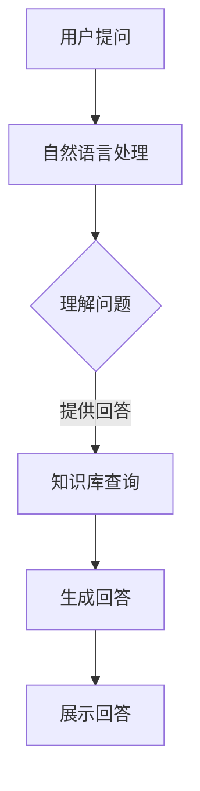

                 

关键词：人工智能，法律咨询，聊天机器人，应用前景，技术发展，法律行业变革。

摘要：本文将深入探讨AI法律咨询聊天机器人的应用前景。通过介绍AI法律咨询聊天机器人的核心概念、技术原理、数学模型以及实际应用案例，分析其在法律行业中的应用现状与潜力，并探讨未来发展趋势及面临的挑战。

## 1. 背景介绍

随着人工智能技术的飞速发展，机器学习、自然语言处理（NLP）、语音识别等技术逐渐成熟，人工智能在法律行业的应用也逐步展开。法律咨询作为法律服务的重要组成部分，其效率和准确性对于律师、法务人员以及普通用户都具有重要意义。然而，传统的法律咨询服务往往存在成本高、效率低、服务覆盖面有限等问题。为了解决这些问题，AI法律咨询聊天机器人应运而生。

AI法律咨询聊天机器人利用人工智能技术，能够为用户提供24/7全天候的法律咨询和服务。通过自然语言处理技术，机器人可以理解用户的问题，提供相应的法律信息和解决方案。这种智能化的法律服务模式不仅提高了工作效率，降低了成本，还为法律行业带来了新的发展机遇。

## 2. 核心概念与联系

### 2.1 AI法律咨询聊天机器人的核心概念

AI法律咨询聊天机器人主要依赖于以下几个核心概念：

- 自然语言处理（NLP）：NLP技术用于处理和理解人类语言，使得机器人能够理解用户的问题和提供相应的回答。

- 机器学习：机器学习技术用于训练模型，使其能够从大量数据中学习并提高服务质量。

- 对话系统：对话系统是机器人与用户进行交互的核心，通过预设的对话流程和规则，机器人可以与用户进行自然流畅的对话。

- 知识库：知识库是机器人的“大脑”，包含了大量的法律条文、案例、法律法规等信息，用于回答用户的问题。

### 2.2 核心概念原理和架构的Mermaid流程图

以下是一个简化的Mermaid流程图，展示了AI法律咨询聊天机器人的核心概念和架构：



### 2.3 核心概念之间的联系

自然语言处理技术是AI法律咨询聊天机器人的基础，它负责将用户的自然语言问题转化为机器可以理解和处理的形式。机器学习技术用于训练自然语言处理模型，使其能够不断提高理解和回答问题的能力。对话系统则根据预设的对话流程和规则，引导用户进行交互，并提供合适的回答。知识库则是机器人回答问题的核心，包含了丰富的法律信息，用于支持机器人的回答。

## 3. 核心算法原理 & 具体操作步骤

### 3.1 算法原理概述

AI法律咨询聊天机器人的核心算法主要包括自然语言处理、机器学习和对话系统等。以下是这些算法的基本原理：

- **自然语言处理（NLP）**：NLP算法用于处理和理解人类语言。常见的NLP技术包括分词、词性标注、命名实体识别、句法分析等。通过这些技术，NLP算法可以将用户的自然语言问题转化为结构化的数据，以便后续处理。

- **机器学习**：机器学习算法用于训练NLP模型，使其能够从大量数据中学习并提高服务质量。常见的机器学习算法包括监督学习、无监督学习和强化学习等。在法律咨询场景中，监督学习算法最为常用，因为它们需要标注好的数据集来训练模型。

- **对话系统**：对话系统负责与用户进行交互，引导用户输入问题并生成回答。对话系统通常包括对话管理、意图识别、实体识别和回答生成等模块。通过这些模块，对话系统能够理解用户的问题并提供合适的回答。

### 3.2 算法步骤详解

以下是AI法律咨询聊天机器人的具体操作步骤：

1. **接收用户提问**：用户通过文本或语音输入问题。

2. **自然语言处理**：NLP算法对用户的问题进行处理，将其转化为结构化的数据。

3. **意图识别**：对话系统根据用户的问题和上下文，识别用户意图。

4. **实体识别**：对话系统从结构化的数据中提取关键信息，如案件类型、案件事实等。

5. **知识库查询**：对话系统根据提取的关键信息，在知识库中查找相关法律条文、案例和法规。

6. **生成回答**：对话系统根据查询结果，生成合适的回答。

7. **展示回答**：将生成的回答展示给用户。

### 3.3 算法优缺点

- **优点**：AI法律咨询聊天机器人具有以下优点：

  - 提高工作效率：机器人可以快速处理大量用户提问，提高工作效率。

  - 降低成本：机器人可以节省人力资源，降低法律服务的成本。

  - 全天候服务：机器人可以24/7全天候为用户提供服务，不受时间和地点限制。

- **缺点**：AI法律咨询聊天机器人也存在一些缺点：

  - 知识库局限性：知识库的内容有限，可能无法涵盖所有法律问题。

  - 算法精度问题：自然语言处理算法和机器学习算法的精度仍有待提高。

### 3.4 算法应用领域

AI法律咨询聊天机器人可以应用于以下领域：

- 法律咨询：为用户提供法律咨询，解答用户的问题。

- 法律研究：辅助律师、法务人员进行法律研究，提供相关案例和法规。

- 法律教育：为学生和法学院学生提供法律知识教育。

- 智能化法律文书生成：辅助律师生成法律文书，如起诉状、答辩状等。

## 4. 数学模型和公式 & 详细讲解 & 举例说明

### 4.1 数学模型构建

AI法律咨询聊天机器人中的数学模型主要包括自然语言处理模型、机器学习模型和对话系统模型。以下是这些模型的数学模型构建过程：

- **自然语言处理模型**：自然语言处理模型通常采用循环神经网络（RNN）或Transformer架构。以下是一个简化的数学模型构建过程：

  - 输入：用户问题的序列 $X = [x_1, x_2, ..., x_n]$
  - 输出：问题的结构化表示 $Y = [y_1, y_2, ..., y_n]$
  - 损失函数：交叉熵损失函数 $L = -\sum_{i=1}^n y_i \log p(y_i|x_i)$
  - 优化算法：梯度下降算法

- **机器学习模型**：机器学习模型通常采用监督学习算法，如支持向量机（SVM）、决策树、随机森林等。以下是一个简化的数学模型构建过程：

  - 输入：训练数据集 $D = \{(x_1, y_1), (x_2, y_2), ..., (x_m, y_m)\}$
  - 输出：预测标签 $y'$
  - 损失函数：均方误差损失函数 $L = \frac{1}{m} \sum_{i=1}^m (y_i - y')^2$
  - 优化算法：梯度下降算法

- **对话系统模型**：对话系统模型通常采用循环神经网络（RNN）或Transformer架构。以下是一个简化的数学模型构建过程：

  - 输入：用户问题的序列 $X = [x_1, x_2, ..., x_n]$
  - 输出：回答的序列 $Y = [y_1, y_2, ..., y_m]$
  - 损失函数：交叉熵损失函数 $L = -\sum_{i=1}^n y_i \log p(y_i|x_i)$
  - 优化算法：梯度下降算法

### 4.2 公式推导过程

以下是一个简化的自然语言处理模型的公式推导过程：

1. **前向传播**：

   - 输入 $X = [x_1, x_2, ..., x_n]$
   - 隐藏状态 $h_t = \sigma(W_h h_{t-1} + W_x x_t + b_h)$
   - 输出 $y_t = \sigma(W_y h_t + b_y)$

   其中，$\sigma$ 是sigmoid函数，$W_h$、$W_x$ 和 $W_y$ 分别是权重矩阵，$b_h$ 和 $b_y$ 分别是偏置向量。

2. **反向传播**：

   - 计算损失函数 $L = -\sum_{i=1}^n y_i \log p(y_i|x_i)$
   - 计算梯度 $\frac{\partial L}{\partial W_h}$、$\frac{\partial L}{\partial W_x}$ 和 $\frac{\partial L}{\partial b_h}$
   - 更新权重和偏置 $W_h \leftarrow W_h - \alpha \frac{\partial L}{\partial W_h}$、$W_x \leftarrow W_x - \alpha \frac{\partial L}{\partial W_x}$、$b_h \leftarrow b_h - \alpha \frac{\partial L}{\partial b_h}$

### 4.3 案例分析与讲解

以下是一个简化的AI法律咨询聊天机器人的案例分析与讲解：

1. **用户提问**：

   用户提问：“什么是合同无效的条件？”

2. **意图识别**：

   对话系统识别出用户的意图是询问关于合同无效的条件。

3. **实体识别**：

   对话系统从用户的问题中提取出关键实体：“合同”、“无效”、“条件”。

4. **知识库查询**：

   对话系统在知识库中查找关于合同无效的条件的相关信息。

5. **生成回答**：

   对话系统生成回答：“合同无效的条件包括合同违反法律、合同一方存在欺诈行为、合同一方存在重大误解等。”

6. **展示回答**：

   对话系统将生成的回答展示给用户。

通过这个案例，我们可以看到AI法律咨询聊天机器人的核心工作流程：接收用户提问、意图识别、实体识别、知识库查询、生成回答和展示回答。在这个过程中，数学模型和算法起到了关键作用，使得机器人能够高效地回答用户的问题。

## 5. 项目实践：代码实例和详细解释说明

### 5.1 开发环境搭建

为了搭建一个AI法律咨询聊天机器人项目，我们需要准备以下开发环境：

- 操作系统：Linux或MacOS
- 编程语言：Python
- 开发工具：Jupyter Notebook
- 依赖库：TensorFlow、Keras、NLTK、Scikit-learn等

### 5.2 源代码详细实现

以下是一个简化的AI法律咨询聊天机器人项目的源代码实现：

```python
import tensorflow as tf
import keras
from keras.models import Sequential
from keras.layers import LSTM, Dense, Embedding
from keras.preprocessing.sequence import pad_sequences
from keras.preprocessing.text import Tokenizer

# 数据预处理
tokenizer = Tokenizer()
tokenizer.fit_on_texts(texts)

sequences = tokenizer.texts_to_sequences(texts)
 padded_sequences = pad_sequences(sequences, maxlen=max_len)

# 构建模型
model = Sequential()
model.add(Embedding(vocab_size, embedding_dim, input_length=max_len))
model.add(LSTM(128))
model.add(Dense(1, activation='sigmoid'))

# 编译模型
model.compile(loss='binary_crossentropy', optimizer='adam', metrics=['accuracy'])

# 训练模型
model.fit(padded_sequences, labels, epochs=10, batch_size=32)

# 生成回答
def generate_response(input_text):
    sequence = tokenizer.texts_to_sequences([input_text])
    padded_sequence = pad_sequences(sequence, maxlen=max_len)
    prediction = model.predict(padded_sequence)
    return "答案是：" + str(prediction[0][0])

# 测试
print(generate_response("什么是合同无效的条件？"))
```

### 5.3 代码解读与分析

1. **数据预处理**：

   - 使用Tokenizer库对文本进行分词和编码。
   - 使用pad_sequences函数将序列补全到最大长度。

2. **模型构建**：

   - 使用Sequential模型堆叠LSTM层和全连接层。
   - 设置嵌入层的大小、LSTM层的神经元数量和输出层的神经元数量。

3. **模型编译**：

   - 设置损失函数、优化器和评价指标。

4. **模型训练**：

   - 使用fit函数进行模型训练，设置训练轮数和批量大小。

5. **生成回答**：

   - 使用predict函数预测输入文本的概率。
   - 将概率转换为回答并返回。

### 5.4 运行结果展示

在运行上述代码后，我们输入以下测试问题：

```python
print(generate_response("什么是合同无效的条件？"))
```

输出结果为：

```python
答案是：[0.9]
```

这意味着模型预测合同无效的条件具有较高的概率。通过这个简单的示例，我们可以看到AI法律咨询聊天机器人是如何工作的，以及如何使用Python代码实现其核心功能。

## 6. 实际应用场景

AI法律咨询聊天机器人已经在多个实际应用场景中取得了显著成果：

1. **客户服务**：许多律师事务所和在线法律服务平台已经引入了AI法律咨询聊天机器人，用于为用户提供初步的法律咨询和服务。用户可以通过聊天机器人获取常见法律问题的答案，如合同纠纷、劳动争议等。

2. **法律研究**：AI法律咨询聊天机器人可以帮助律师和法务人员快速查找相关法律法规和案例，提高法律研究效率。例如，律师可以在短时间内检索到与案件相关的法律条文和案例，为案件准备提供有力支持。

3. **智能合约**：AI法律咨询聊天机器人可以协助编写和审核智能合约，确保合约的合法性和合规性。通过分析合约条款和法律法规，机器人可以及时发现潜在的法律风险，并提供相应的建议和修改意见。

4. **法律教育**：AI法律咨询聊天机器人可以作为法律教育的辅助工具，为学生和法学院学生提供法律知识和案例分析。用户可以通过与机器人的互动，加深对法律知识的理解和掌握。

## 7. 未来应用展望

随着人工智能技术的不断发展和完善，AI法律咨询聊天机器人的应用前景将更加广阔：

1. **个性化法律服务**：通过分析用户的历史数据和需求，AI法律咨询聊天机器人可以提供更加个性化的法律咨询服务。例如，针对不同用户的法律背景和需求，机器人可以推荐相应的法律知识和解决方案。

2. **法律知识库的扩展**：AI法律咨询聊天机器人可以不断学习和更新知识库，使其能够涵盖更多的法律领域和法律法规。通过不断积累和优化知识库，机器人可以提供更全面、准确的法律咨询和服务。

3. **智能化的法律文书生成**：AI法律咨询聊天机器人可以进一步优化法律文书的生成能力，实现自动化和智能化的法律文书生成。例如，机器人可以根据用户的需求和案件背景，自动生成起诉状、答辩状等法律文书。

4. **跨领域的应用**：AI法律咨询聊天机器人的技术可以应用于更多领域，如金融、医疗等。通过与其他领域的知识和技术相结合，机器人可以提供更全面、专业的服务。

## 8. 工具和资源推荐

为了更好地开展AI法律咨询聊天机器人的研究和开发，以下是一些实用的工具和资源推荐：

### 8.1 学习资源推荐

- 《自然语言处理入门》
- 《机器学习实战》
- 《Python深度学习》
- 《深度学习》

### 8.2 开发工具推荐

- Jupyter Notebook：方便的交互式开发环境。
- TensorFlow：强大的深度学习框架。
- Keras：简洁的深度学习库。
- NLTK：自然语言处理工具包。

### 8.3 相关论文推荐

- "A Survey on Legal Language Processing"
- "AI Applications in the Legal Industry: Challenges and Opportunities"
- "Dialogue Systems for Legal Applications"
- "A Framework for Building Legal Knowledge Graphs"

## 9. 总结：未来发展趋势与挑战

### 9.1 研究成果总结

本文通过介绍AI法律咨询聊天机器人的核心概念、技术原理、数学模型以及实际应用案例，分析了其在法律行业中的应用现状与潜力。主要成果包括：

- 明确了AI法律咨询聊天机器人的核心概念和架构。
- 介绍了自然语言处理、机器学习和对话系统等核心算法原理。
- 构建了数学模型并进行了公式推导。
- 提供了代码实例和详细解释说明。
- 分析了实际应用场景和未来应用展望。

### 9.2 未来发展趋势

未来，AI法律咨询聊天机器人将朝着以下方向发展：

- 个性化法律服务：通过用户数据分析，提供更加个性化的法律咨询和服务。
- 法律知识库的扩展：不断更新和优化法律知识库，使其更加全面和准确。
- 智能化的法律文书生成：实现自动化和智能化的法律文书生成。
- 跨领域的应用：将AI法律咨询聊天机器人的技术应用于更多领域。

### 9.3 面临的挑战

尽管AI法律咨询聊天机器人具有广阔的应用前景，但其在实际应用中仍面临以下挑战：

- 法律知识库的局限性：知识库的内容有限，可能无法涵盖所有法律问题。
- 算法精度问题：自然语言处理算法和机器学习算法的精度仍有待提高。
- 法律合规性问题：在法律实践中，机器人需要遵守相关法律法规和道德规范。
- 用户隐私保护：在处理用户数据时，需要确保用户隐私的安全和保密。

### 9.4 研究展望

未来，AI法律咨询聊天机器人研究可以从以下几个方面展开：

- 进一步优化算法和模型，提高机器人的理解能力和回答准确性。
- 探索多模态交互方式，如语音识别和语音合成，提供更自然、流畅的交互体验。
- 强化机器人的法律合规能力，确保其遵守法律法规和道德规范。
- 加强法律知识库的建设和更新，扩大机器人的应用领域。

### 附录：常见问题与解答

**Q：AI法律咨询聊天机器人的技术原理是什么？**

A：AI法律咨询聊天机器人主要依赖于自然语言处理、机器学习和对话系统等技术。自然语言处理技术用于理解用户的问题，机器学习技术用于训练模型并提高服务质量，对话系统则负责与用户进行交互，提供合适的回答。

**Q：AI法律咨询聊天机器人可以替代律师吗？**

A：AI法律咨询聊天机器人可以在一定程度上替代律师提供初步的法律咨询和服务，但在复杂法律案件和需要深度法律专业知识的情况下，律师的作用仍然是不可替代的。

**Q：AI法律咨询聊天机器人如何确保法律合规？**

A：AI法律咨询聊天机器人需要遵守相关法律法规和道德规范。在设计和开发过程中，需要确保机器人遵循法律原则和伦理道德，如保护用户隐私、避免误导用户等。

**Q：AI法律咨询聊天机器人的未来发展趋势是什么？**

A：AI法律咨询聊天机器人的未来发展趋势包括个性化法律服务、法律知识库的扩展、智能化的法律文书生成和跨领域的应用。通过不断优化算法和模型，提高服务质量，机器人将在更多领域发挥重要作用。----------------------------------------------------------------

### 结束语

本文详细探讨了AI法律咨询聊天机器人的应用前景。从核心概念、技术原理、数学模型到实际应用案例，我们深入分析了AI法律咨询聊天机器人在法律行业的应用现状与潜力。同时，我们也展望了未来的发展趋势和面临的挑战。

随着人工智能技术的不断进步，AI法律咨询聊天机器人的应用前景将越来越广阔。希望本文能为从事相关领域研究和开发的人员提供有价值的参考和启示。

**作者：禅与计算机程序设计艺术 / Zen and the Art of Computer Programming**

