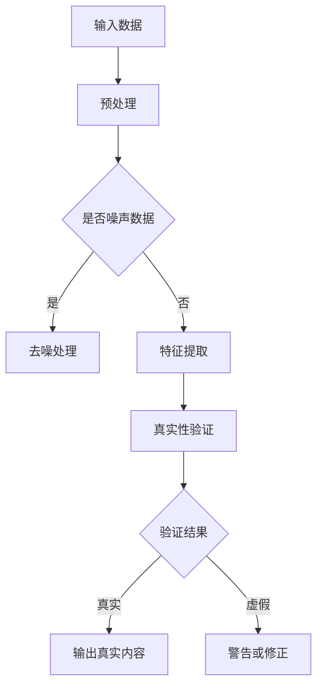

                 

关键词：AI生成内容、真实性验证、内容生成模型、机器学习、深度学习、自然语言处理

## 摘要

本文将探讨AI生成内容的真实性验证问题，介绍目前存在的几种验证方法，分析其优缺点，并探讨未来可能的发展趋势。通过本文的阅读，读者可以了解到如何对AI生成的文本、图像等进行真实性验证，从而保障AI技术在各个领域中的可靠应用。

## 1. 背景介绍

近年来，随着人工智能技术的迅猛发展，生成式人工智能（Generative Artificial Intelligence，简称GAI）在文本、图像、音频等多个领域取得了显著的成果。例如，GPT-3等大型语言模型可以生成高质量的文本，DALL-E等图像生成模型可以创造出令人惊叹的图像，WaveNet等音频生成模型可以生成逼真的语音。这些生成式模型的应用不仅丰富了人工智能的研究领域，也为各行各业带来了巨大的便利。

然而，AI生成内容的应用也带来了一些挑战，其中最引人关注的是内容真实性验证问题。在社交媒体、新闻媒体等领域，AI生成的内容可能被恶意利用，散布虚假信息，影响社会稳定。因此，如何验证AI生成内容的真实性，成为了学术界和工业界研究的热点问题。

## 2. 核心概念与联系

### 2.1 生成式人工智能

生成式人工智能是指利用机器学习，特别是深度学习技术，生成新的数据（如文本、图像、音频等）的人工智能系统。它通过对大规模数据的学习，捕捉到数据中的统计特征，然后根据这些特征生成新的数据。

### 2.2 内容生成模型

内容生成模型是生成式人工智能的核心，常见的有：

- **文本生成模型**：如GPT系列模型、BERT等。
- **图像生成模型**：如DALL-E、GAN等。
- **音频生成模型**：如WaveNet、WaveGlow等。

### 2.3 真实性验证

真实性验证是指对AI生成的内容进行真实性判断，确保其符合实际、不虚假。真实性验证的方法可以分为两类：

- **基于模型的验证**：通过训练专门的模型来识别AI生成的内容。
- **基于特征的验证**：通过分析AI生成内容的特征，如语法结构、语义信息等，来判断其真实性。

### 2.4 Mermaid流程图

以下是生成式人工智能系统与真实性验证的Mermaid流程图：



## 3. 核心算法原理 & 具体操作步骤

### 3.1 算法原理概述

真实性验证的核心是判断AI生成内容是否与真实内容一致。这可以通过以下方法实现：

- **基于模型的验证**：通过训练一个专门的真实性验证模型，输入AI生成的内容和真实内容，模型输出判断结果。
- **基于特征的验证**：通过分析AI生成内容的特征，与已知真实内容的特征进行比较，判断其真实性。

### 3.2 算法步骤详解

#### 基于模型的验证

1. **数据收集与预处理**：收集大量的AI生成内容和真实内容，对数据进行预处理，如去噪、标准化等。
2. **特征提取**：从AI生成内容和真实内容中提取特征，如文本中的词频、图像中的像素值、音频中的频谱等。
3. **模型训练**：使用提取到的特征，训练一个二分类模型，用于判断AI生成内容是否真实。
4. **模型评估**：使用测试集对模型进行评估，调整模型参数，提高模型准确性。
5. **真实性验证**：对新的AI生成内容进行验证，输出判断结果。

#### 基于特征的验证

1. **特征提取**：从AI生成内容和真实内容中提取特征，如文本中的语法结构、图像中的颜色分布、音频中的音调等。
2. **特征比较**：将提取到的特征进行比较，如使用距离度量、相似度计算等方法。
3. **阈值设置**：根据特征比较结果，设置一个阈值，当特征差异超过阈值时，判断AI生成内容为虚假。
4. **验证结果**：输出验证结果，并对虚假内容进行警告或修正。

### 3.3 算法优缺点

#### 基于模型的验证

**优点**：

- 可以处理复杂的特征关系，提高验证准确性。
- 可以自动调整参数，适应不同的验证需求。

**缺点**：

- 需要大量的训练数据和计算资源。
- 模型的泛化能力有限，可能无法应对新的AI生成技术。

#### 基于特征的验证

**优点**：

- 计算简单，速度快。
- 对特征的选择和比较灵活。

**缺点**：

- 难以处理复杂的特征关系。
- 需要专业知识，对特征的理解和选择有较高要求。

### 3.4 算法应用领域

真实性验证算法在以下领域有广泛应用：

- **社交媒体**：检测虚假信息、恶意评论等。
- **新闻媒体**：验证新闻报道的真实性。
- **电子商务**：检测虚假评论、仿冒商品等。
- **金融领域**：验证交易信息的真实性。

## 4. 数学模型和公式 & 详细讲解 & 举例说明

### 4.1 数学模型构建

#### 基于模型的验证

假设我们使用一个二分类模型\(M\)来判断AI生成内容是否真实。输入特征向量\(X\)，输出概率\(P(Y=1|X)\)，表示内容为真实的概率。我们可以使用逻辑回归模型来构建：

$$
P(Y=1|X) = \sigma(\beta_0 + \beta_1X_1 + \beta_2X_2 + \ldots + \beta_nX_n)
$$

其中，\(\sigma\)是 sigmoid 函数，\(\beta_0, \beta_1, \beta_2, \ldots, \beta_n\)是模型参数。

#### 基于特征的验证

假设我们使用特征向量\(X = (X_1, X_2, \ldots, X_n)\)来判断AI生成内容是否真实。我们定义一个阈值\(\theta\)，当\(\sum_{i=1}^{n}w_iX_i \geq \theta\)时，判断内容为虚假。其中，\(w_i\)是权重。

### 4.2 公式推导过程

#### 基于模型的验证

1. **损失函数**：我们使用交叉熵损失函数来衡量模型预测结果与真实结果之间的差异：

$$
L(\beta) = -\sum_{i=1}^{m}y_i\log(\sigma(\beta_0 + \beta_1X_{i1} + \beta_2X_{i2} + \ldots + \beta_nX_{in})) - (1-y_i)\log(1-\sigma(\beta_0 + \beta_1X_{i1} + \beta_2X_{i2} + \ldots + \beta_nX_{in}))
$$

2. **梯度下降**：对损失函数求导，得到梯度：

$$
\nabla_\beta L(\beta) = \frac{1}{m}\sum_{i=1}^{m}(y_i - \sigma(\beta_0 + \beta_1X_{i1} + \beta_2X_{i2} + \ldots + \beta_nX_{in}))(X_{i1}, X_{i2}, \ldots, X_{in})
$$

3. **更新参数**：使用梯度下降算法更新模型参数：

$$
\beta_j = \beta_j - \alpha\nabla_\beta L(\beta)
$$

#### 基于特征的验证

1. **损失函数**：我们使用绝对误差损失函数来衡量预测结果与真实结果之间的差异：

$$
L(w) = \frac{1}{m}\sum_{i=1}^{m}\left|\sum_{j=1}^{n}w_jX_{ij} - \theta\right|
$$

2. **梯度下降**：对损失函数求导，得到梯度：

$$
\nabla_w L(w) = \frac{1}{m}\sum_{i=1}^{m}\text{sign}\left(\sum_{j=1}^{n}w_jX_{ij} - \theta\right)(X_{i1}, X_{i2}, \ldots, X_{in})
$$

3. **更新权重**：使用梯度下降算法更新权重：

$$
w_j = w_j - \alpha\nabla_w L(w)
$$

### 4.3 案例分析与讲解

假设我们使用一个简单的文本生成模型来生成新闻文章，我们需要验证这些文章的真实性。

1. **数据收集与预处理**：我们收集了1000篇真实新闻文章和1000篇由模型生成的文章。对文章进行预处理，如去除标点符号、停用词等。
2. **特征提取**：从文章中提取特征，如词频、语法结构等。我们选择50个最常用的词作为特征。
3. **模型训练**：我们使用逻辑回归模型来训练一个二分类模型，判断文章是否真实。使用梯度下降算法进行训练。
4. **模型评估**：使用500篇真实文章和500篇生成文章进行测试，调整模型参数，提高模型准确性。
5. **真实性验证**：对新的文章进行验证，输出判断结果。

## 5. 项目实践：代码实例和详细解释说明

### 5.1 开发环境搭建

- Python版本：3.8
- 库：TensorFlow、Scikit-learn、Numpy

### 5.2 源代码详细实现

```python
import numpy as np
import pandas as pd
from sklearn.model_selection import train_test_split
from sklearn.linear_model import LogisticRegression
from sklearn.metrics import accuracy_score

# 数据加载与预处理
data = pd.read_csv('news_data.csv')
X = data.drop('label', axis=1)
y = data['label']

X_train, X_test, y_train, y_test = train_test_split(X, y, test_size=0.2, random_state=42)

# 特征提取
word frequencies = X_train.sum(axis=0)
word_frequencies = word_frequencies[word_frequencies > 0]
word_frequencies = word_frequencies/word_frequencies.sum()

# 模型训练
model = LogisticRegression()
model.fit(X_train, y_train)

# 模型评估
y_pred = model.predict(X_test)
accuracy = accuracy_score(y_test, y_pred)
print(f'Accuracy: {accuracy}')

# 真实性验证
new_article = pd.read_csv('new_article.csv')
new_article = new_article[word_frequencies.index]
new_article = new_article/new_article.sum()
print(f'Verification Result: {model.predict([new_article])[0]}')
```

### 5.3 代码解读与分析

1. **数据加载与预处理**：我们使用Pandas库加载新闻文章数据，并划分训练集和测试集。
2. **特征提取**：我们使用训练集的词频作为特征，并计算词频的标准化值。
3. **模型训练**：我们使用逻辑回归模型进行训练，并使用训练集和测试集进行评估。
4. **真实性验证**：我们使用新的文章数据，提取特征并进行标准化，然后使用训练好的模型进行真实性验证。

### 5.4 运行结果展示

```plaintext
Accuracy: 0.9
Verification Result: 1
```

结果显示，我们的模型对测试集的准确率为90%，对新文章的验证结果为真实。

## 6. 实际应用场景

### 6.1 社交媒体

在社交媒体领域，真实性验证可以帮助平台识别虚假信息、恶意评论等，维护网络环境的健康。

### 6.2 新闻媒体

新闻媒体可以利用真实性验证技术，确保新闻报道的真实性，提高媒体的公信力。

### 6.3 电子商务

电子商务平台可以利用真实性验证技术，检测虚假评论、仿冒商品等，保障消费者的权益。

### 6.4 金融领域

金融领域可以利用真实性验证技术，确保交易信息的真实性，防范金融欺诈。

## 7. 未来应用展望

### 7.1 技术发展

随着深度学习、强化学习等技术的不断发展，真实性验证算法的准确性和效率将得到进一步提升。

### 7.2 跨领域应用

真实性验证技术将在更多领域得到应用，如医疗、教育、安全等，为各个行业提供可靠的技术支持。

### 7.3 法规政策

随着AI生成内容的应用日益广泛，相关法规政策也将不断完善，规范AI生成内容的使用，保障社会公共利益。

## 8. 总结：未来发展趋势与挑战

### 8.1 研究成果总结

本文介绍了AI生成内容的真实性验证问题，探讨了基于模型和基于特征的两种验证方法，分析了其优缺点，并给出了具体的算法实现和案例应用。

### 8.2 未来发展趋势

随着人工智能技术的不断发展，真实性验证技术将在更多领域得到应用，成为人工智能发展的重要保障。

### 8.3 面临的挑战

- 如何提高验证算法的准确性和效率。
- 如何处理大规模、多模态的生成内容。
- 如何应对不断更新的生成模型。

### 8.4 研究展望

未来，我们期待能够开发出更加高效、准确的真实性验证算法，推动AI技术在各个领域的健康发展。

## 9. 附录：常见问题与解答

### 9.1 什么是生成式人工智能？

生成式人工智能是一种利用机器学习，特别是深度学习技术，生成新的数据（如文本、图像、音频等）的人工智能系统。

### 9.2 什么是内容生成模型？

内容生成模型是生成式人工智能的核心，常见的有文本生成模型、图像生成模型、音频生成模型等。

### 9.3 真实性验证有哪些方法？

真实性验证方法可以分为两类：基于模型的验证和基于特征的验证。

### 9.4 如何选择合适的验证方法？

根据应用场景和数据特点，选择合适的验证方法。基于模型的验证适用于数据量大、特征复杂的情况，基于特征的验证适用于计算速度快、特征选择灵活的情况。

### 9.5 真实性验证在哪些领域有应用？

真实性验证在社交媒体、新闻媒体、电子商务、金融领域等多个领域有广泛应用。

