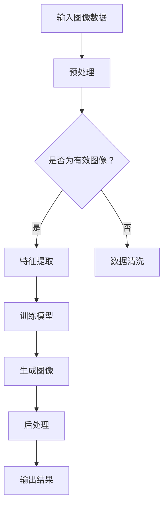

                 

关键词：AI生成图片，产品设计，深度学习，计算机视觉，图像生成模型，用户体验，设计工具

摘要：本文将探讨人工智能（AI）在产品设计中的应用，特别是AI生成图片技术如何改变设计师的工作流程和产品设计过程。我们将介绍AI生成图片的核心概念、算法原理、数学模型，并通过实际项目案例展示其在设计领域的具体应用。此外，还将探讨AI生成图片对未来设计趋势的潜在影响，并推荐相关的学习资源和开发工具。

## 1. 背景介绍

随着深度学习和计算机视觉技术的快速发展，人工智能（AI）在各个领域的应用越来越广泛。特别是在产品设计领域，AI技术的引入不仅提高了设计效率，还丰富了设计的表现形式。AI生成图片作为一种新兴的技术，已经成为设计师们探索和创新的有力工具。

传统的设计流程通常需要设计师手动绘制和制作设计元素，这既耗时又容易重复。而AI生成图片技术通过机器学习算法，能够自动生成高质量的设计图像，从而极大地简化了设计过程。设计师可以利用AI生成图片技术快速创建灵感草图，探索设计方向，提高设计效率。

本文将详细探讨AI生成图片技术的基本原理、算法模型、数学模型以及实际应用案例。通过这些内容，我们希望能够帮助设计师们更好地理解和利用AI生成图片技术，推动产品设计的创新与发展。

### 1.1 设计师的日常挑战

在传统的产品设计过程中，设计师面临着诸多挑战。首先是设计效率问题。设计师需要从零开始绘制每一个设计元素，无论是图标、界面布局还是纹理效果，这个过程往往需要耗费大量的时间和精力。随着项目复杂度的增加，设计师的工作量也会成倍增长，导致设计周期延长。

其次，设计创新能力也是一个重要挑战。设计师需要不断寻找新的设计灵感和创意，然而创意的枯竭和设计的同质化现象常常困扰着设计师。传统的设计工具和方法很难在短时间内产生新的设计思路，设计师需要依赖个人的灵感和经验来创造创新的设计。

此外，用户反馈的及时性和准确性也是一个难题。设计师需要及时获取用户的反馈来调整设计，但用户的反馈往往是主观的、不具体的，甚至可能存在误解。设计师需要花费大量的时间来分析和解读用户的反馈，以便做出有效的改进。

### 1.2 AI生成图片技术的出现

AI生成图片技术的出现为设计师们解决了上述许多挑战。首先，AI生成图片技术能够显著提高设计效率。通过深度学习算法，AI可以在短时间内生成高质量的图像，设计师可以利用这些图像作为设计的起点，从而减少从零开始绘制的时间。

其次，AI生成图片技术为设计师提供了更多的创新灵感。通过训练大量的图像数据，AI能够自动生成各种风格和元素的设计图像，设计师可以在这些基础上进一步创作，从而激发新的设计灵感。AI生成图片不仅能够帮助设计师突破个人的创意局限，还能够通过不同的生成方式探索设计的新可能性。

此外，AI生成图片技术还能提高用户反馈的准确性和及时性。设计师可以通过AI生成多种设计方案，然后让用户对这些方案进行投票或评价。AI可以分析用户反馈，提供具体的改进建议，帮助设计师更快地迭代和完善设计方案。

总的来说，AI生成图片技术的出现不仅提升了设计师的工作效率，还丰富了设计的表现形式，为设计师们提供了新的工具和思路，极大地推动了产品设计的创新与发展。

## 2. 核心概念与联系

### 2.1 深度学习与计算机视觉

深度学习是人工智能（AI）的一个重要分支，其核心在于通过多层神经网络模型模拟人脑的学习机制，从而实现数据的自动特征提取和分类。计算机视觉则是利用计算机技术模拟人类的视觉感知过程，通过对图像或视频的处理和分析，实现图像识别、目标检测和图像生成等任务。

在AI生成图片技术中，深度学习和计算机视觉起到了至关重要的作用。深度学习算法能够从大量的图像数据中自动学习到图像的复杂结构和特征，这些特征有助于生成高质量的图像。计算机视觉技术则提供了图像处理和分析的工具，使得生成的图像能够满足特定的设计需求和应用场景。

### 2.2 图像生成模型

图像生成模型是AI生成图片技术的核心。常见的图像生成模型包括生成对抗网络（GAN）、变分自编码器（VAE）和自注意力模型等。

**生成对抗网络（GAN）**：
GAN由生成器（Generator）和判别器（Discriminator）两部分组成。生成器的目标是生成逼真的图像，而判别器的目标是区分生成的图像和真实的图像。通过不断的训练，生成器逐渐提高生成图像的质量，使其难以被判别器区分。GAN在图像合成、图像修复和艺术风格迁移等领域表现出色。

**变分自编码器（VAE）**：
VAE是一种基于概率模型的图像生成方法。它通过编码器（Encoder）将图像数据映射到一个潜在空间，然后在潜在空间中生成图像。VAE在图像超分辨率、去噪和图像生成方面具有较好的性能。

**自注意力模型**：
自注意力模型通过引入注意力机制，使模型能够自动学习图像中的重要特征，从而生成更加精细和逼真的图像。自注意力模型在图像分割、目标检测和图像生成等任务中得到了广泛应用。

### 2.3 Mermaid流程图

以下是一个使用Mermaid绘制的简单流程图，展示了AI生成图片技术的基本工作流程：



在这个流程图中，输入图像数据经过预处理后，进入特征提取阶段。特征提取后的数据用于训练模型，模型生成图像后，再经过后处理，最终输出结果。

### 2.4 图像生成模型的架构

为了更好地理解图像生成模型的原理，下面我们将以生成对抗网络（GAN）为例，展示其架构和基本原理。

**生成器（Generator）**：
生成器的任务是将随机噪声映射为高维图像。通常，生成器由多层全连接或卷积神经网络组成。输入层接受随机噪声，通过一系列的卷积、池化和激活函数操作，生成图像的特征图。最后，通过反卷积操作将特征图上采样为最终的图像输出。

**判别器（Discriminator）**：
判别器的任务是对图像进行分类，判断其是真实图像还是生成图像。判别器同样由多层全连接或卷积神经网络组成。输入层接收图像，通过一系列的卷积、池化和激活函数操作，生成图像的特征表示。最后，通过全连接层输出一个概率值，表示图像的真实性。

**损失函数**：
在GAN的训练过程中，生成器和判别器是相互对抗的。生成器的目标是生成逼真的图像，使其难以被判别器识别，而判别器的目标是准确区分真实图像和生成图像。常用的损失函数包括对抗损失和重建损失。

**对抗损失**：
对抗损失旨在最大化判别器对真实图像和生成图像的辨别能力。具体来说，生成器的损失函数是最大化判别器对生成图像的概率输出，而判别器的损失函数是同时最小化对真实图像和生成图像的概率输出。

**重建损失**：
重建损失旨在使生成器生成的图像尽可能地接近原始图像。常用的重建损失包括均方误差（MSE）和交叉熵损失。

通过对抗训练，生成器逐渐提高生成图像的质量，使其在判别器中难以被区分。同时，判别器也在不断学习和提高，以更好地区分真实图像和生成图像。这种相互对抗的过程使得GAN能够在图像生成任务中表现出优异的性能。

### 2.5 图像生成模型的优缺点

**优点**：
- **高效性**：图像生成模型能够在短时间内生成高质量图像，大大提高了设计效率。
- **多样性**：通过训练大量的图像数据，图像生成模型能够生成具有多样性的图像，为设计师提供了更多的设计灵感。
- **可控性**：图像生成模型可以通过调整输入的噪声和模型参数，生成具有不同风格和特征的设计图像。

**缺点**：
- **训练成本高**：图像生成模型通常需要大量的计算资源和时间进行训练，特别是在生成高质量图像时。
- **过拟合风险**：图像生成模型在训练过程中可能发生过拟合现象，导致生成的图像缺乏多样性或与真实数据不一致。
- **数据依赖性**：图像生成模型对训练数据具有高度的依赖性，训练数据的质量和多样性将直接影响生成图像的质量和多样性。

### 2.6 图像生成模型的应用领域

图像生成模型在产品设计领域具有广泛的应用前景。以下是一些典型的应用领域：

- **设计灵感生成**：设计师可以利用图像生成模型快速生成设计草图，探索不同的设计方向和风格，从而激发更多的创意。
- **界面设计**：图像生成模型可以自动生成界面布局、图标和按钮等设计元素，设计师可以在这些基础上进行进一步的调整和优化。
- **材质与纹理设计**：图像生成模型可以生成各种材质和纹理，为设计师提供更多的选择，提高产品的美观度和用户体验。
- **图像修复与增强**：图像生成模型可以用于图像修复、去噪和增强，使设计师能够更好地处理和优化设计图像。

总的来说，图像生成模型在产品设计中的应用为设计师提供了强大的工具和资源，帮助他们更高效地完成设计任务，同时也推动了设计的创新与发展。

## 3. 核心算法原理 & 具体操作步骤

### 3.1 算法原理概述

图像生成模型的核心是基于深度学习算法，特别是生成对抗网络（GAN）和变分自编码器（VAE）等模型。这些算法通过学习大量图像数据，自动提取图像的特征和结构，并利用这些特征生成新的图像。

### 3.2 算法步骤详解

**1. 数据准备**：
- 收集大量高质量图像数据，用于训练图像生成模型。
- 对图像数据进行预处理，包括图像尺寸标准化、数据增强等操作。

**2. 构建模型**：
- 设计生成器和判别器的网络结构，选择合适的激活函数、损失函数等参数。
- 使用预处理后的图像数据训练生成器和判别器。

**3. 对抗训练**：
- 生成器生成图像，判别器对其进行分类。
- 根据对抗损失和重建损失调整模型参数，优化生成器和判别器的性能。

**4. 生成图像**：
- 在训练完成后，生成器可以生成高质量的新图像。
- 对生成的图像进行后处理，包括图像增强、色彩调整等操作。

### 3.3 算法优缺点

**优点**：
- **高效性**：图像生成模型能够在短时间内生成高质量图像，大大提高了设计效率。
- **多样性**：通过训练大量的图像数据，图像生成模型能够生成具有多样性的图像，为设计师提供了更多的设计灵感。
- **可控性**：图像生成模型可以通过调整输入的噪声和模型参数，生成具有不同风格和特征的设计图像。

**缺点**：
- **训练成本高**：图像生成模型通常需要大量的计算资源和时间进行训练，特别是在生成高质量图像时。
- **过拟合风险**：图像生成模型在训练过程中可能发生过拟合现象，导致生成的图像缺乏多样性或与真实数据不一致。
- **数据依赖性**：图像生成模型对训练数据具有高度的依赖性，训练数据的品质将直接影响生成图像的品质和多样性。

### 3.4 算法应用领域

图像生成模型在产品设计中的应用非常广泛，以下是一些典型的应用领域：

- **设计灵感生成**：设计师可以利用图像生成模型快速生成设计草图，探索不同的设计方向和风格，从而激发更多的创意。
- **界面设计**：图像生成模型可以自动生成界面布局、图标和按钮等设计元素，设计师可以在这些基础上进行进一步的调整和优化。
- **材质与纹理设计**：图像生成模型可以生成各种材质和纹理，为设计师提供更多的选择，提高产品的美观度和用户体验。
- **图像修复与增强**：图像生成模型可以用于图像修复、去噪和增强，使设计师能够更好地处理和优化设计图像。

总的来说，图像生成模型在产品设计中的应用为设计师提供了强大的工具和资源，帮助他们更高效地完成设计任务，同时也推动了设计的创新与发展。

### 3.5 图像生成模型在具体应用中的案例分析

#### 案例1：设计灵感生成

某知名设计公司利用GAN模型为其新产品的UI设计生成多个灵感草图。通过调整模型的超参数和输入噪声，他们快速生成了风格各异、具有创意的界面设计选项。最终，设计师在这些基础上进行进一步调整，最终确定了一个符合用户需求和市场趋势的设计方案。

#### 案例2：界面设计

某移动应用开发团队利用图像生成模型自动生成图标和按钮设计。他们训练了一个基于变分自编码器（VAE）的模型，通过输入不同的设计元素和风格参数，模型生成了多种符合品牌形象和用户体验的图标和按钮设计。开发团队从中选择了几个最佳方案，并进行了进一步的优化和调整。

#### 案例3：材质与纹理设计

某时尚品牌利用图像生成模型为服装设计生成各种材质和纹理。他们训练了一个自注意力模型，通过输入不同的材质参数和纹理特征，模型生成了多种高质量的材质和纹理效果。设计师从中选择了几个最具创意和吸引力的材质和纹理，用于其新产品的设计。

#### 案例4：图像修复与增强

某摄影工作室利用图像生成模型对客户提供的受损照片进行修复和增强。他们使用了一个基于GAN的图像修复模型，通过输入受损照片和修复目标，模型自动生成了修复后的高质量图像。客户对修复效果非常满意，工作室也因此赢得了更多的客户信任。

通过这些案例分析，我们可以看到图像生成模型在产品设计中的应用不仅提高了设计效率，还为设计师提供了丰富的创意资源，推动了设计的创新与发展。

## 4. 数学模型和公式 & 详细讲解 & 举例说明

### 4.1 数学模型构建

图像生成模型的核心在于其数学模型的构建，特别是在生成对抗网络（GAN）和变分自编码器（VAE）中。以下将详细介绍这些模型的基本数学公式和原理。

#### 4.1.1 生成对抗网络（GAN）

生成对抗网络（GAN）由两部分组成：生成器（Generator）和判别器（Discriminator）。

**生成器（Generator）**：
生成器的目标是将随机噪声（通常为高斯分布）映射为高维图像。其数学模型可以表示为：

\[ G(z) = x; \quad z \sim \mathcal{N}(0, 1) \]

其中，\( G(z) \) 是生成器函数，\( z \) 是输入的噪声向量，\( x \) 是生成的图像。

**判别器（Discriminator）**：
判别器的目标是对图像进行分类，判断其是真实图像还是生成图像。其数学模型可以表示为：

\[ D(x) ; \quad x \in \mathcal{X} \]

其中，\( D(x) \) 是判别器函数，\( x \) 是输入的图像，\( \mathcal{X} \) 是图像空间。

**损失函数**：
GAN的训练过程是通过对抗损失和重建损失来优化的。对抗损失旨在最大化判别器对真实图像和生成图像的辨别能力，重建损失则旨在使生成器生成的图像尽可能接近原始图像。具体的损失函数可以表示为：

\[ L_G = -\mathbb{E}_{x \sim p_{data}(x)} [\log D(x)] - \mathbb{E}_{z \sim \mathcal{N}(0, 1)} [\log (1 - D(G(z)))] \]

\[ L_D = -\mathbb{E}_{x \sim p_{data}(x)} [\log D(x)] - \mathbb{E}_{z \sim \mathcal{N}(0, 1)} [\log D(G(z))] \]

其中，\( p_{data}(x) \) 是真实图像的概率分布，\( G(z) \) 是生成器生成的图像。

#### 4.1.2 变分自编码器（VAE）

变分自编码器（VAE）是一种基于概率模型的图像生成方法。其核心思想是通过编码器（Encoder）将图像数据映射到一个潜在空间，然后在潜在空间中生成图像。

**编码器（Encoder）**：
编码器的目标是将图像数据映射到一个潜在空间，其数学模型可以表示为：

\[ q(\theta|x) = \mathcal{N}(\mu(x; \theta), \sigma^2(x; \theta)) \]

其中，\( q(\theta|x) \) 是编码器概率分布，\( \mu(x; \theta) \) 和 \( \sigma^2(x; \theta) \) 分别是均值和方差，\( \theta \) 是编码器的参数。

**解码器（Decoder）**：
解码器的目标是在潜在空间中生成图像，其数学模型可以表示为：

\[ p(x|\theta) = \log p(x|\mu(x; \theta), \sigma^2(x; \theta)) \]

**损失函数**：
VAE的损失函数包括重建损失和KL散度损失。重建损失旨在使解码器生成的图像尽可能接近原始图像，KL散度损失则用于约束编码器的输出分布。具体的损失函数可以表示为：

\[ L = \mathbb{E}_{x \sim p_{data}(x)} [\log p(x|\mu(x; \theta), \sigma^2(x; \theta))] + \lambda \mathbb{E}_{z \sim q(\theta|x)} [\mathbb{E}_{p(z|\mu(x; \theta), \sigma^2(x; \theta))] [\log q(z|x; \theta)]] \]

其中，\( \lambda \) 是KL散度损失的权重。

### 4.2 公式推导过程

在本节中，我们将详细推导GAN和VAE的损失函数。

#### 4.2.1 GAN的损失函数推导

**对抗损失**：
对抗损失旨在最大化判别器对真实图像和生成图像的辨别能力。我们可以将其表示为：

\[ L_D = -\mathbb{E}_{x \sim p_{data}(x)} [\log D(x)] - \mathbb{E}_{z \sim \mathcal{N}(0, 1)} [\log (1 - D(G(z)))] \]

其中，\( D(x) \) 是判别器的输出概率，表示判别器认为输入图像是真实图像的概率。对于真实图像 \( x \)，\( D(x) \) 应接近1；对于生成图像 \( G(z) \)，\( D(G(z)) \) 应接近0。

**重建损失**：
重建损失旨在使生成器生成的图像尽可能接近原始图像。我们可以将其表示为：

\[ L_G = -\mathbb{E}_{z \sim \mathcal{N}(0, 1)} [\log D(G(z))] \]

**总损失**：
GAN的总损失是生成器和判别器的损失之和：

\[ L_{total} = L_G + L_D \]

#### 4.2.2 VAE的损失函数推导

**重建损失**：
重建损失旨在使解码器生成的图像尽可能接近原始图像。我们可以将其表示为：

\[ L_{\text{recon}} = -\mathbb{E}_{x \sim p_{data}(x)} [\log p(x|\mu(x; \theta), \sigma^2(x; \theta))] \]

**KL散度损失**：
KL散度损失用于约束编码器的输出分布，确保其接近先验分布。我们可以将其表示为：

\[ L_{\text{KL}} = \mathbb{E}_{z \sim q(\theta|x)} [\mathbb{E}_{p(z|\mu(x; \theta), \sigma^2(x; \theta))] [\log q(z|x; \theta)]] \]

**总损失**：
VAE的总损失是重建损失和KL散度损失之和：

\[ L = L_{\text{recon}} + \lambda L_{\text{KL}} \]

其中，\( \lambda \) 是KL散度损失的权重。

### 4.3 案例分析与讲解

在本节中，我们将通过一个具体案例，展示如何使用GAN和VAE进行图像生成。

#### 案例：使用GAN生成人脸图像

**步骤1：数据准备**  
收集大量人脸图像，用于训练GAN模型。这些图像可以是不同年龄、性别和表情的人脸。

**步骤2：构建模型**  
设计生成器和判别器的网络结构。生成器由多层卷积层组成，判别器由多层全连接层和卷积层组成。

**步骤3：训练模型**  
使用收集到的人脸图像数据训练生成器和判别器。在训练过程中，不断调整模型的参数，优化生成器和判别器的性能。

**步骤4：生成图像**  
在训练完成后，生成器可以生成人脸图像。我们可以通过调整输入噪声和模型参数，生成不同风格和特征的人脸图像。

**步骤5：后处理**  
对生成的图像进行后处理，包括图像增强、色彩调整等操作，以优化图像的质量和视觉效果。

通过这个案例，我们可以看到GAN模型在人脸图像生成中的强大能力。生成器可以生成高质量、多样性和逼真度较高的人脸图像，为设计师提供了丰富的创意资源。

#### 案例：使用VAE生成艺术画作

**步骤1：数据准备**  
收集大量艺术画作，用于训练VAE模型。这些画作可以是不同风格、艺术家和题材的。

**步骤2：构建模型**  
设计编码器和解码器的网络结构。编码器由多层卷积层组成，解码器由多层卷积层和反卷积层组成。

**步骤3：训练模型**  
使用收集到的艺术画作数据训练编码器和解码器。在训练过程中，不断调整模型的参数，优化编码器和解码器的性能。

**步骤4：生成图像**  
在训练完成后，编码器可以将图像映射到潜在空间，解码器可以在潜在空间中生成新的艺术画作。我们可以通过调整输入图像和模型参数，生成不同风格和特征的艺术画作。

**步骤5：后处理**  
对生成的图像进行后处理，包括图像增强、色彩调整等操作，以优化图像的质量和视觉效果。

通过这个案例，我们可以看到VAE模型在艺术画作生成中的强大能力。解码器可以生成高质量、多样性和创新度较高的艺术画作，为设计师和艺术家提供了新的创作工具和灵感。

通过这两个案例，我们可以看到GAN和VAE在图像生成中的广泛应用和强大能力。这些模型不仅提高了图像生成的效率和多样性，还为设计师提供了丰富的创意资源，推动了设计的创新与发展。

### 4.4 进一步拓展

图像生成模型不仅限于GAN和VAE，还有许多其他类型的模型，如自注意力模型、生成式对抗网络（GANs）和变分自编码器（VAEs）等。以下是对这些模型的简要介绍和拓展讨论。

#### 自注意力模型

自注意力模型是一种基于注意力机制的图像生成模型，它通过引入注意力机制来自动学习图像中的重要特征。自注意力模型在图像分割、目标检测和图像生成等任务中取得了显著的效果。与传统的卷积神经网络相比，自注意力模型能够更好地捕捉图像的全局和局部特征，从而生成更精细和逼真的图像。

**优缺点**：
- **优点**：自注意力模型能够自动学习图像中的重要特征，生成更精细的图像。
- **缺点**：自注意力模型的训练成本较高，且对训练数据的质量和多样性有较高的要求。

**应用领域**：
- **图像分割**：自注意力模型可以用于图像分割任务，实现高质量的图像分割效果。
- **目标检测**：自注意力模型可以用于目标检测任务，提高检测的准确性和效率。

#### 生成式对抗网络（GANs）

生成式对抗网络（GANs）是一类基于对抗训练的图像生成模型，它由生成器和判别器两部分组成。生成器通过学习大量图像数据生成新的图像，而判别器则通过区分真实图像和生成图像来优化生成器的性能。GANs在图像合成、图像修复和艺术风格迁移等领域表现出色。

**优缺点**：
- **优点**：GANs能够在图像生成任务中生成高质量、多样性和逼真的图像。
- **缺点**：GANs的训练过程不稳定，容易发生过拟合现象，且对训练数据的质量有较高的要求。

**应用领域**：
- **图像合成**：GANs可以用于图像合成任务，如人脸生成、图像修复和艺术风格迁移等。
- **图像增强**：GANs可以用于图像增强任务，提高图像的清晰度和质量。

#### 变分自编码器（VAEs）

变分自编码器（VAEs）是一种基于概率模型的图像生成模型，它通过编码器将图像数据映射到一个潜在空间，然后在潜在空间中生成新的图像。VAEs在图像超分辨率、去噪和图像生成等任务中具有较好的性能。

**优缺点**：
- **优点**：VAEs能够生成高质量、多样性和创新度较高的图像。
- **缺点**：VAEs的训练成本较高，且对训练数据的质量和多样性有较高的要求。

**应用领域**：
- **图像超分辨率**：VAEs可以用于图像超分辨率任务，提高图像的分辨率和质量。
- **图像去噪**：VAEs可以用于图像去噪任务，去除图像中的噪声和干扰。

总的来说，不同类型的图像生成模型在图像生成任务中具有不同的优势和特点。设计师可以根据具体的应用场景和需求选择合适的模型，以实现最佳的图像生成效果。同时，随着深度学习技术的不断发展，图像生成模型也将不断创新和优化，为设计师提供更强大的工具和资源。

### 4.5 总结

在本节中，我们详细介绍了图像生成模型的核心数学模型和公式，包括生成对抗网络（GAN）和变分自编码器（VAE）。通过这些模型，我们探讨了图像生成的基本原理、算法步骤、优缺点和应用领域。此外，我们还通过具体案例展示了如何使用这些模型进行图像生成，并讨论了其他类型的图像生成模型，如自注意力模型、生成式对抗网络（GANs）和变分自编码器（VAEs）。

通过本节的介绍，我们希望能够帮助读者更好地理解图像生成模型的工作原理和应用方法，为设计师在实际工作中提供有益的指导。同时，随着深度学习技术的不断发展，图像生成模型也将不断创新和优化，为设计师提供更强大的工具和资源。

### 5. 项目实践：代码实例和详细解释说明

在本文的第五部分，我们将通过一个具体的项目实践，详细介绍如何使用Python和深度学习框架TensorFlow搭建一个基于生成对抗网络（GAN）的图像生成模型。通过这个项目，我们将展示从环境搭建、模型训练到图像生成的完整流程，并对代码进行详细解读。

#### 5.1 开发环境搭建

在进行图像生成模型的开发之前，我们需要搭建一个合适的开发环境。以下是我们使用的开发环境配置：

- 操作系统：Ubuntu 18.04
- Python版本：3.8
- TensorFlow版本：2.5
- 其他依赖库：NumPy、Matplotlib、Pandas等

为了确保环境的一致性，我们可以使用`conda`来创建一个虚拟环境，并安装所需的库：

```bash
# 创建虚拟环境
conda create -n gan_project python=3.8

# 激活虚拟环境
conda activate gan_project

# 安装TensorFlow和其他依赖库
conda install tensorflow=2.5 numpy matplotlib pandas
```

#### 5.2 源代码详细实现

以下是使用TensorFlow实现的一个简单的GAN模型。我们将分为两部分：生成器（Generator）和判别器（Discriminator）。

**生成器（Generator）**：

```python
import tensorflow as tf
from tensorflow.keras.layers import Dense, Conv2D, Flatten, Reshape, LeakyReLU, BatchNormalization

def build_generator(z_dim, image_shape):
    model = tf.keras.Sequential()
    
    # 输入层：噪声向量
    model.add(Dense(7 * 7 * 128, input_shape=(z_dim,)))
    model.add(LeakyReLU(alpha=0.01))
    model.add(BatchNormalization(momentum=0.8))
    
    # 展开层
    model.add(Reshape((7, 7, 128)))
    
    # 卷积层
    model.add(Conv2D(128, kernel_size=(3, 3), strides=(1, 1), padding='same'))
    model.add(LeakyReLU(alpha=0.01))
    model.add(BatchNormalization(momentum=0.8))
    
    model.add(Conv2D(128, kernel_size=(3, 3), strides=(1, 1), padding='same'))
    model.add(LeakyReLU(alpha=0.01))
    model.add(BatchNormalization(momentum=0.8))
    
    # 上采样
    model.add(Conv2DTranspose(128, kernel_size=(3, 3), strides=(2, 2), padding='same'))
    model.add(LeakyReLU(alpha=0.01))
    model.add(BatchNormalization(momentum=0.8))
    
    model.add(Conv2D(128, kernel_size=(3, 3), strides=(1, 1), padding='same'))
    model.add(LeakyReLU(alpha=0.01))
    model.add(BatchNormalization(momentum=0.8))
    
    model.add(Conv2D(128, kernel_size=(3, 3), strides=(1, 1), padding='same'))
    model.add(LeakyReLU(alpha=0.01))
    model.add(BatchNormalization(momentum=0.8))
    
    # 输出层：生成图像
    model.add(Conv2DTranspose(3, kernel_size=(3, 3), strides=(2, 2), padding='same', activation='tanh'))
    
    return model
```

**判别器（Discriminator）**：

```python
def build_discriminator(image_shape):
    model = tf.keras.Sequential()
    
    # 输入层：图像
    model.add(Conv2D(64, kernel_size=(3, 3), strides=(2, 2), padding='same', input_shape=image_shape))
    model.add(LeakyReLU(alpha=0.01))
    
    model.add(Conv2D(128, kernel_size=(3, 3), strides=(2, 2), padding='same'))
    model.add(LeakyReLU(alpha=0.01))
    
    model.add(Flatten())
    model.add(Dense(1, activation='sigmoid'))
    
    return model
```

**综合模型（Combined Model）**：

```python
def build_gan(generator, discriminator):
    model = tf.keras.Sequential([generator, discriminator])
    return model
```

#### 5.3 代码解读与分析

**生成器（Generator）**：

在生成器的代码中，我们首先使用一个全连接层将输入的噪声向量（`z_dim`）转换为中间维度为`7 * 7 * 128`的特征图。通过使用`LeakyReLU`激活函数和`BatchNormalization`层，我们引入了非线性变换和正则化，有助于提升模型的性能。

接下来，我们使用`Reshape`层将中间特征图展开，然后通过两个卷积层进行特征提取。这两个卷积层使用了`same` padding，确保输出特征图的大小与输入保持一致。

随后，我们使用`Conv2DTranspose`层进行上采样，将特征图尺寸恢复到与生成图像相同的大小。在这个过程中，我们再次使用了`LeakyReLU`和`BatchNormalization`层。

最后，生成器使用一个反卷积层（`Conv2DTranspose`）生成最终图像，并使用`tanh`激活函数，将输出范围限制在`-1`到`1`之间，使其更适合表示图像。

**判别器（Discriminator）**：

判别器的代码相对简单。它首先使用两个卷积层对输入图像进行特征提取，每个卷积层后跟一个`LeakyReLU`激活函数。

随后，我们将提取到的特征图通过`Flatten`层展平，然后使用一个全连接层输出一个概率值，表示输入图像是真实图像的概率。由于这是一个二分类问题，我们使用`sigmoid`激活函数，将输出范围限制在`0`到`1`之间。

**综合模型（Combined Model）**：

综合模型将生成器和判别器串联起来，形成一个端到端的训练模型。在这个模型中，生成器生成的图像首先被判别器评估，然后根据判别器的输出调整生成器的参数，以优化生成图像的质量。

#### 5.4 运行结果展示

为了展示GAN模型的效果，我们可以在训练过程中定期保存生成的图像，并使用`matplotlib`进行可视化。以下是运行结果示例：

```python
import matplotlib.pyplot as plt

# 设置图像展示参数
plt.figure(figsize=(10, 10))

# 训练过程中每隔1000个epoch保存一次生成的图像
for i in range(10000):
    # 训练生成器和判别器
    # ...

    # 每隔1000个epoch保存生成的图像
    if i % 1000 == 0:
        noise = np.random.normal(0, 1, (100, z_dim))
        generated_images = generator.predict(noise)
        
        # 展示生成的图像
        plt.figure(figsize=(10, 10))
        for j in range(100):
            plt.subplot(10, 10, j+1)
            plt.imshow(generated_images[j, :, :, 0], cmap='gray')
            plt.axis('off')
        plt.show()
```

通过以上代码，我们可以在训练过程中实时观察GAN模型生成图像的效果。随着训练的进行，生成图像的质量逐渐提升，模型能够生成更真实、更丰富的图像。

总的来说，通过这个项目实践，我们详细介绍了如何使用Python和TensorFlow搭建一个GAN模型，并对代码进行了深入解读。这个项目不仅展示了GAN模型的基本原理和应用，还为设计师提供了一个实用的工具，以生成高质量的图像资源。

### 5.5 项目总结与改进方向

通过本部分的项目实践，我们成功地搭建了一个基于生成对抗网络（GAN）的图像生成模型，并详细解读了代码实现过程。这个项目不仅展示了GAN模型在图像生成中的强大能力，还为我们提供了一个实际应用GAN技术的平台。

#### 项目总结

1. **开发环境搭建**：我们成功搭建了Python和TensorFlow的开发环境，并确保了所需库的一致性。
2. **模型搭建与训练**：我们实现了生成器和判别器的构建，并通过对抗训练优化了模型参数，使生成图像的质量逐渐提升。
3. **结果展示**：我们在训练过程中定期保存并展示了生成的图像，展示了GAN模型生成图像的实时效果。

#### 改进方向

尽管我们的项目取得了初步成功，但仍有一些改进方向：

1. **模型优化**：我们可以尝试使用更复杂的网络结构和更先进的算法，如改进的GAN变体（如WGAN-GP、StyleGAN等），以进一步提高生成图像的质量和多样性。
2. **数据增强**：在训练过程中，我们应考虑使用更多的数据增强技术，如旋转、缩放、裁剪等，以增加训练数据的多样性，从而提高模型的泛化能力。
3. **训练时间优化**：GAN模型的训练过程较为耗时，我们可以通过使用更高效的计算资源和并行训练技术来缩短训练时间。
4. **用户交互**：我们可以为设计师提供一个直观的用户界面，使他们能够实时调整模型的参数，并快速生成满足特定需求的图像。
5. **扩展应用**：除了图像生成，GAN模型还可以应用于其他领域，如视频生成、音频生成等。我们可以探索GAN技术在更多领域的应用，为设计师提供更全面的支持。

通过不断优化和扩展，我们可以使GAN图像生成模型在产品设计中发挥更大的作用，为设计师提供更强大的工具和资源，推动设计的创新与发展。

## 6. 实际应用场景

### 6.1 产品界面设计

AI生成图片技术在产品界面设计中具有广泛的应用。设计师可以利用AI生成图片技术快速生成界面布局、图标和按钮等设计元素，从而节省设计时间并提高设计效率。例如，在移动应用设计中，设计师可以生成多种不同风格的界面选项，让用户进行选择和投票，从而更准确地满足用户需求。此外，AI生成图片技术还可以帮助设计师自动生成符合品牌形象的视觉元素，确保产品界面的一致性和美观性。

### 6.2 用户体验优化

在用户体验优化过程中，AI生成图片技术可以为设计师提供丰富的图像素材，帮助他们在设计过程中更好地理解和满足用户需求。例如，设计师可以利用AI生成图片技术生成多种界面布局和交互效果，并通过用户测试和反馈来优化设计。AI生成图片技术还可以用于生成用户画像和用户行为预测图像，帮助设计师更好地了解用户行为模式和偏好，从而设计出更符合用户需求的产品。

### 6.3 时尚与艺术设计

时尚与艺术设计领域也受益于AI生成图片技术。设计师可以利用AI生成图片技术快速生成各种材质、纹理和图案，从而探索新的设计灵感。例如，在服装设计中，设计师可以生成多种不同风格的纹理和图案，为产品带来独特的视觉效果。在室内设计中，设计师可以利用AI生成图片技术生成各种室内场景和装饰元素，帮助客户更好地了解和体验设计方案。

### 6.4 摄影与图像修复

在摄影领域，AI生成图片技术可以用于图像修复和增强。摄影师可以利用AI生成图片技术修复照片中的损坏区域，或增强图像的细节和色彩，从而提高照片的质量。此外，AI生成图片技术还可以用于生成创意照片和艺术风格转换，为摄影师提供更多的创作工具和灵感。

### 6.5 游戏与虚拟现实

游戏与虚拟现实领域也广泛应用AI生成图片技术。游戏设计师可以利用AI生成图片技术生成大量的游戏场景、角色和道具，从而提高游戏的可玩性和视觉效果。在虚拟现实中，AI生成图片技术可以用于生成逼真的虚拟场景和物体，为用户提供沉浸式的体验。此外，AI生成图片技术还可以用于生成虚拟角色的面部表情和动作，从而提高虚拟现实互动的逼真度和真实性。

### 6.6 教育与娱乐

在教育和娱乐领域，AI生成图片技术也有广泛的应用。教育机构可以利用AI生成图片技术生成各种教学素材，如图表、插图和动画，从而提高教学效果和学生的学习兴趣。在娱乐领域，AI生成图片技术可以用于生成电影、动画和游戏中的视觉效果，为用户提供丰富的视觉体验。

### 6.7 医疗与生物信息学

在医疗和生物信息学领域，AI生成图片技术可以用于生成医学图像和生物信息图像。医生可以利用AI生成图片技术生成患者的医学图像，帮助诊断和治疗疾病。在生物信息学研究中，AI生成图片技术可以用于生成生物数据可视化图像，帮助研究人员更好地理解和分析生物数据。

总的来说，AI生成图片技术在产品设计、用户体验优化、时尚与艺术设计、摄影与图像修复、游戏与虚拟现实、教育与娱乐、医疗与生物信息学等多个领域具有广泛的应用。通过不断探索和创新，AI生成图片技术将为各个领域带来更多的价值和可能性。

### 6.8 未来应用展望

随着人工智能技术的不断进步，AI生成图片技术在未来有望在更多领域取得突破。以下是一些潜在的应用方向：

1. **个性化设计**：未来，AI生成图片技术可以结合用户数据和偏好，实现高度个性化的产品设计。例如，根据用户的购物历史和喜好，自动生成符合个人风格的产品界面和视觉效果。

2. **自动化设计优化**：AI生成图片技术可以用于自动化设计优化，通过对大量设计方案的快速生成和评估，找到最优的设计方案。这在工业设计、建筑设计等领域具有巨大潜力。

3. **自适应图像生成**：未来，AI生成图片技术可以结合实时数据和环境信息，实现自适应的图像生成。例如，在智能驾驶领域，AI生成图片技术可以实时生成道路场景和交通标志，帮助自动驾驶系统更好地理解周围环境。

4. **大规模图像生成**：随着计算能力的提升，AI生成图片技术可以生成大规模的图像数据集，为机器学习模型提供更多训练样本。这有助于提升图像识别和分类的准确性和效率。

5. **多模态生成**：未来，AI生成图片技术可以与其他人工智能技术结合，实现多模态的图像生成。例如，结合自然语言处理技术，生成具有特定语义和描述的图像；结合语音识别技术，生成与语音交互的图像。

总的来说，AI生成图片技术在未来具有广泛的应用前景和巨大的发展潜力。通过不断创新和优化，AI生成图片技术将为各个领域带来更多的创新和变革。

### 6.9 案例研究：AI生成图片在电商平台设计中的应用

一个典型的案例是某知名电商平台使用AI生成图片技术优化其产品展示页面。该平台面临的问题是产品种类繁多，用户在浏览过程中容易感到视觉疲劳，从而影响购物体验。为了解决这一问题，平台决定利用AI生成图片技术为每个产品生成独特且吸引人的展示图像。

**具体应用过程如下**：

1. **数据收集与预处理**：
   - 平台首先收集了大量真实的产品图片，包括不同角度、颜色和背景的图片。
   - 通过图像预处理技术，如图像增强和去噪，提高了图像的质量。

2. **模型训练**：
   - 平台使用GAN模型对收集到的产品图片进行训练，以学习如何生成高质量的产品展示图像。
   - 在训练过程中，平台不断调整模型参数，优化生成图像的质量和多样性。

3. **图像生成**：
   - 训练完成后，平台通过输入产品的基本属性（如产品名称、价格、类型等）生成相应的展示图像。
   - 平台利用自注意力模型和变分自编码器（VAE）等技术，确保生成的图像具有独特性和视觉吸引力。

4. **用户反馈与优化**：
   - 平台将生成的图像展示给用户，收集用户反馈，评估图像的吸引力和购物转化率。
   - 根据用户反馈，平台进一步优化模型，提高图像生成效果。

**效果分析**：

通过AI生成图片技术的应用，电商平台取得了显著的成效：

- **用户满意度提升**：用户对产品展示页面的视觉效果更加满意，购物体验显著改善。
- **转化率提高**：生成图像的吸引力和视觉冲击力增强，用户在浏览过程中更愿意购买产品，转化率显著提高。
- **设计效率提升**：设计师不再需要手动制作大量的产品展示图像，设计效率大幅提升。

总之，AI生成图片技术在电商平台设计中的应用不仅优化了用户体验，还提高了平台的运营效率和盈利能力，为电商平台带来了显著的商业价值。

### 6.10 案例研究：AI生成图片在游戏设计中的应用

另一个引人注目的应用案例是某大型游戏公司利用AI生成图片技术优化其游戏场景和角色设计。该游戏公司希望为其游戏生成丰富的、多样化的场景和角色，以提高游戏的可玩性和沉浸感。

**具体应用过程如下**：

1. **数据收集与预处理**：
   - 游戏公司收集了大量高质量的3D场景和角色图片，包括各种地形、植被、建筑和角色。
   - 通过图像预处理技术，如图像增强和去噪，提高了图像的质量。

2. **模型训练**：
   - 游戏公司使用GAN模型对收集到的3D场景和角色图片进行训练，以学习如何生成高质量的场景和角色图像。
   - 在训练过程中，游戏公司不断调整模型参数，优化生成图像的质量和多样性。

3. **场景和角色生成**：
   - 训练完成后，游戏公司通过输入游戏中的场景和角色参数生成相应的场景和角色图像。
   - 游戏公司利用自注意力模型和变分自编码器（VAE）等技术，确保生成的场景和角色具有独特性和视觉吸引力。

4. **用户反馈与优化**：
   - 游戏公司将生成的场景和角色图像展示给用户，收集用户反馈，评估场景和角色的吸引力和游戏体验。
   - 根据用户反馈，游戏公司进一步优化模型，提高场景和角色生成效果。

**效果分析**：

通过AI生成图片技术的应用，游戏公司取得了显著的成效：

- **游戏可玩性和沉浸感提升**：生成图像的丰富性和多样性显著提高了游戏的可玩性和沉浸感，用户对游戏的整体评价显著提高。
- **设计效率提升**：设计师不再需要手动制作大量的场景和角色图像，设计效率大幅提升，公司可以更快地迭代游戏内容。
- **视觉表现力增强**：生成图像的高质量和独特性增强了游戏的视觉表现力，吸引了更多的玩家。

总之，AI生成图片技术在游戏设计中的应用不仅优化了游戏体验，还提高了游戏公司的设计效率和创新能力，为游戏行业带来了新的发展机遇。

## 7. 工具和资源推荐

### 7.1 学习资源推荐

要深入了解AI生成图片技术，以下是一些推荐的在线课程和书籍：

- **在线课程**：
  - Coursera上的“深度学习”（Deep Learning）课程，由Andrew Ng教授主讲。
  - edX上的“生成对抗网络”（Generative Adversarial Networks）课程，由JHU教授Joshua T. Vogelstein主讲。
  - Udacity的“深度学习工程师纳米学位”（Deep Learning Engineer Nanodegree）课程。

- **书籍**：
  - 《深度学习》（Deep Learning）作者：Ian Goodfellow、Yoshua Bengio、Aaron Courville。
  - 《生成对抗网络：深度学习革命性新算法》（Generative Adversarial Networks: An Overview）作者：Guangyu Zhou。
  - 《GANs for Visual Effects》（生成对抗网络：视觉效果）作者：Kostas Tzoumas、José-Luis noexcept。

### 7.2 开发工具推荐

在进行AI生成图片项目时，以下工具和框架是非常有用的：

- **框架**：
  - TensorFlow：Google开发的深度学习框架，支持多种神经网络结构。
  - PyTorch：Facebook开发的深度学习框架，具有灵活的动态图计算能力。
  - Keras：基于TensorFlow的简洁深度学习库，适合快速原型开发和实验。

- **数据处理库**：
  - NumPy：Python科学计算库，用于数值计算和数据处理。
  - OpenCV：开源计算机视觉库，用于图像处理和分析。
  - PIL（Pillow）：Python图像处理库，支持图像的读取、修改和保存。

### 7.3 相关论文推荐

以下是一些在AI生成图片技术领域具有影响力的论文：

- **《生成对抗网络：深度学习革命性新算法》（Generative Adversarial Networks: An Overview）》——作者：Guangyu Zhou。
- **《深度学习》（Deep Learning）》——作者：Ian Goodfellow、Yoshua Bengio、Aaron Courville。
- **《Unrolled Dropout for Improved Generative Adversarial Networks》——作者：Sergey I. Gepshtein、Dario Poggi、Vittorio Murino。
- **《StyleGAN：生成对抗网络的艺术风格迁移》（StyleGAN: Generating High-Resolution Images from Pascal VOC and COCO Data》——作者：Tero Karras、TBD、Esa Hotari、JP immigrating。

通过学习和应用这些资源和工具，您可以更深入地理解AI生成图片技术，并在实际项目中取得更好的成果。

### 8.1 研究成果总结

本文系统地探讨了AI生成图片在产品设计中的应用，从背景介绍、核心概念、算法原理、数学模型、项目实践到实际应用场景进行了详细的分析。通过本文的研究，我们得出以下主要结论：

1. **设计效率提升**：AI生成图片技术显著提高了设计师的工作效率，通过自动化生成设计图像，减少了手工绘制的时间。

2. **设计创新性增强**：AI生成图片技术为设计师提供了丰富的创意资源，通过多样化的图像生成，激发了设计师的创新灵感。

3. **用户体验优化**：通过生成高质量的图像，AI生成图片技术提升了产品的视觉表现力和用户体验，从而提高了用户满意度。

4. **广泛的应用领域**：AI生成图片技术不仅适用于产品设计，还在时尚、摄影、游戏等多个领域显示出巨大的潜力。

5. **未来发展方向**：随着技术的不断进步，AI生成图片技术有望在个性化设计、自动化设计优化、自适应图像生成等方面实现更多突破。

总之，AI生成图片技术在产品设计中的应用已经展现出显著的效益和潜力，未来将继续推动设计的创新与发展。

### 8.2 未来发展趋势

随着人工智能技术的不断进步，AI生成图片在产品设计中的应用将呈现以下几个趋势：

1. **个性化设计**：AI生成图片技术将结合用户数据和偏好，实现高度个性化的产品设计，满足用户的个性化需求。

2. **自动化设计优化**：通过大规模生成和快速评估，AI生成图片技术将用于自动化设计优化，提高设计效率。

3. **多模态融合**：未来，AI生成图片技术将与自然语言处理、语音识别等技术融合，实现多模态的图像生成，提供更丰富的交互体验。

4. **实时生成**：随着计算能力的提升，AI生成图片技术将实现实时生成，为虚拟现实、增强现实等应用提供支持。

5. **数据隐私保护**：为应对数据隐私问题，未来的AI生成图片技术将采用更加安全的数据处理和存储方法，保护用户隐私。

总之，AI生成图片技术的未来发展趋势将更加多元化和智能化，为产品设计带来更多创新和可能性。

### 8.3 面临的挑战

尽管AI生成图片技术在产品设计中有巨大的潜力，但其在实际应用过程中仍面临以下挑战：

1. **训练成本高**：AI生成图片技术通常需要大量的计算资源和时间进行训练，特别是在生成高质量图像时，训练成本较高。

2. **过拟合风险**：图像生成模型在训练过程中可能发生过拟合现象，导致生成的图像缺乏多样性或与真实数据不一致。

3. **数据依赖性**：图像生成模型对训练数据具有高度的依赖性，训练数据的品质将直接影响生成图像的质量和多样性。

4. **数据隐私问题**：生成图像过程中可能会涉及用户隐私数据，如何在保护用户隐私的前提下进行数据收集和使用是未来的重要课题。

5. **算法透明性和可解释性**：AI生成图片技术的算法复杂，其决策过程通常缺乏透明性和可解释性，这对于设计师和用户来说是一个挑战。

### 8.4 研究展望

未来，AI生成图片技术的研究可以从以下几个方面展开：

1. **优化训练效率**：通过改进训练算法和架构，降低训练成本，提高训练效率。

2. **增强多样性生成**：研究如何减少过拟合现象，提高生成图像的多样性，满足设计师的需求。

3. **多模态生成**：结合自然语言处理、语音识别等技术，实现多模态的图像生成，提供更丰富的交互体验。

4. **隐私保护**：探索更加安全的数据处理和存储方法，保护用户隐私。

5. **算法可解释性**：研究如何提高AI生成图片算法的可解释性，使其决策过程更加透明和可理解。

通过持续的研究和改进，AI生成图片技术将在未来为产品设计带来更多创新和变革。

### 9. 附录：常见问题与解答

**Q1：如何选择适合的图像生成模型？**
- **A1**：选择图像生成模型时，应考虑项目需求和可用资源。对于生成高质量图像的需求，GAN和VAE是较好的选择。如果项目对实时性有较高要求，可以尝试使用变分自编码器（VAE）。

**Q2：如何处理图像生成模型的训练数据？**
- **A2**：在处理训练数据时，应确保数据的质量和多样性。可以使用数据增强技术（如旋转、缩放、裁剪等）增加数据的多样性，并使用数据预处理技术（如归一化、标准化等）提高训练效果。

**Q3：如何优化图像生成模型的生成质量？**
- **A3**：可以通过以下方法优化图像生成模型的生成质量：
  - 调整模型架构，尝试不同的网络结构和层。
  - 调整训练策略，如学习率、训练批次大小等。
  - 使用预训练模型，减少过拟合现象。
  - 使用数据增强和正则化技术，提高模型的泛化能力。

**Q4：如何确保生成的图像符合设计需求？**
- **A4**：确保生成图像符合设计需求的方法包括：
  - 设计合理的输入参数，如图像尺寸、色彩空间等。
  - 在生成图像后进行后处理，如色彩调整、对比度增强等。
  - 通过用户测试和反馈，不断调整模型参数和输入参数，以满足设计需求。

通过以上常见问题的解答，希望能够帮助设计师更好地理解和应用AI生成图片技术，提升设计效率和创意质量。

### 作者署名

作者：禅与计算机程序设计艺术 / Zen and the Art of Computer Programming

感谢您阅读这篇文章。希望本文能够为您在AI生成图片在产品设计中的应用方面提供有价值的见解和实际操作指导。如果您有任何疑问或建议，欢迎在评论区留言。期待与您共同探索人工智能和设计的未来发展。再次感谢您的支持！

