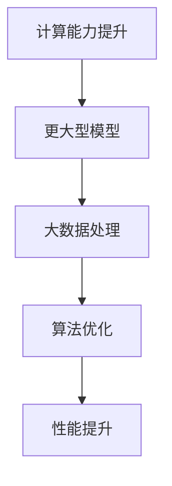

                 

关键词：AI，摩尔定律，LLM，性能提升，未来展望

> 摘要：本文旨在探讨人工智能领域中的“摩尔定律”，特别是大规模语言模型（LLM）的性能提升。通过对LLM的发展历程、核心概念、算法原理、数学模型、实际应用以及未来展望的深入分析，本文将揭示LLM性能提升背后的驱动因素，以及这一发展趋势对人工智能技术、产业和社会的深远影响。

## 1. 背景介绍

自人工智能（AI）诞生以来，计算能力的发展一直是推动技术进步的关键因素。摩尔定律，由英特尔联合创始人戈登·摩尔在1965年提出，预言了计算硬件性能的指数增长。这一预言在过去的半个世纪里被不断验证，为计算机科学和信息技术的发展提供了坚实的基础。

在人工智能领域，特别是自然语言处理（NLP）方面，大规模语言模型（LLM）的兴起带来了革命性的变化。LLM通过深度学习算法，从海量文本数据中学习语言结构和语义，实现了前所未有的文本生成和理解能力。这种能力不仅改变了NLP的研究方向，也广泛应用于商业、教育、医疗等多个领域。

本文将围绕LLM的性能提升展开讨论，探讨其背后的技术原理、应用场景以及未来可能的发展趋势。通过对AI界的摩尔定律的深入分析，我们希望能够为读者提供一个全面、系统的视角，以理解LLM性能提升的重要性和未来方向。

## 2. 核心概念与联系

### 2.1 摩尔定律的历史与意义

摩尔定律的核心思想是：集成电路上可容纳的晶体管数量，将每隔18-24个月翻倍，从而使得计算能力实现指数级增长。这一预言极大地推动了半导体工业的发展，为计算机硬件性能的提升奠定了基础。

在人工智能领域，摩尔定律的影响同样深远。随着计算能力的提升，更复杂的算法和更大数据集得以处理，这极大地推动了人工智能技术的发展。特别是在深度学习算法的兴起中，摩尔定律起到了至关重要的作用。深度学习算法需要大量的计算资源进行模型训练和优化，而计算能力的提升使得这一过程变得更加高效和可行。

### 2.2 大规模语言模型（LLM）

大规模语言模型（LLM）是基于深度学习的一种自然语言处理模型，其核心思想是通过从海量文本数据中学习，生成或理解自然语言。LLM的代表性模型包括GPT、BERT、Turing等。这些模型通过多层神经网络结构，实现了对语言结构和语义的深度理解，从而在文本生成、问答系统、机器翻译等任务中表现出了惊人的性能。

### 2.3 摩尔定律与LLM性能提升的关系

摩尔定律的推动使得计算能力不断提升，这对于LLM的性能提升起到了关键作用。首先，计算能力的提升使得训练更大型、更复杂的模型成为可能。其次，更大规模的计算资源使得模型能够处理更大量的数据，从而提高模型的准确性和鲁棒性。此外，计算能力的提升还促进了算法的创新和优化，如更高效的训练算法和推理算法，进一步提升了LLM的性能。

### 2.4 Mermaid流程图

为了更直观地展示LLM性能提升的驱动因素，我们使用Mermaid流程图进行描述。以下是一个简单的示例：



图中的每个节点代表一个驱动因素，箭头表示这些因素之间的关联。通过这个流程图，我们可以清晰地看到计算能力提升是如何通过多个环节最终推动LLM性能提升的。

## 3. 核心算法原理 & 具体操作步骤

### 3.1 算法原理概述

LLM的性能提升主要依赖于以下几个方面：

1. **模型规模**：随着计算能力的提升，能够训练的模型规模也在不断扩大。更大规模的模型能够捕捉到更复杂的语言结构，从而提高性能。
2. **数据处理能力**：计算能力的提升使得处理大规模数据集成为可能。这有助于模型从更多样化的数据中学习，提高模型的泛化能力。
3. **算法优化**：随着算法研究的深入，各种优化算法被提出并应用于LLM的训练和推理过程中，如梯度下降法、Adam优化器等，这些优化算法能够提高模型的训练效率。
4. **硬件加速**：GPU和TPU等硬件的普及，使得深度学习模型的训练和推理速度大大提升，进一步推动了LLM性能的提升。

### 3.2 算法步骤详解

1. **数据预处理**：在训练LLM之前，需要对数据进行清洗、预处理，如文本的分词、去停用词等操作。
2. **模型架构设计**：根据任务需求，选择合适的模型架构，如GPT、BERT等。
3. **模型训练**：使用训练数据对模型进行训练。训练过程中，需要不断调整模型参数，以最小化损失函数。
4. **模型优化**：在训练过程中，可以使用各种优化算法，如Adam、RMSProp等，以提高模型的训练效率。
5. **模型推理**：在模型训练完成后，可以使用训练好的模型进行推理，实现对未知数据的预测或生成。

### 3.3 算法优缺点

**优点**：

1. **强大的语言理解能力**：LLM能够通过学习海量文本数据，实现对语言结构和语义的深度理解。
2. **高效的模型训练**：现代优化算法和硬件加速技术，使得模型训练过程变得更加高效。
3. **广泛的应用场景**：LLM在文本生成、问答系统、机器翻译等多个领域都有广泛的应用。

**缺点**：

1. **计算资源需求高**：训练大型LLM需要大量的计算资源，这对硬件设备提出了较高要求。
2. **数据依赖性强**：LLM的性能高度依赖于训练数据的质量和多样性，缺乏高质量的数据可能会影响模型的表现。
3. **解释性不足**：由于LLM是基于黑盒模型，其决策过程往往缺乏透明性，难以解释。

### 3.4 算法应用领域

LLM在人工智能领域具有广泛的应用，以下是一些典型的应用场景：

1. **文本生成**：包括文章生成、故事创作、广告文案等。
2. **问答系统**：如智能客服、知识问答等。
3. **机器翻译**：如英译中、中译英等。
4. **内容审核**：如自动识别和过滤不当内容。
5. **自然语言理解**：如情感分析、意图识别等。

## 4. 数学模型和公式 & 详细讲解 & 举例说明

### 4.1 数学模型构建

LLM的训练过程可以看作是一个优化问题，目标是找到一组模型参数，使得模型的预测输出与真实标签之间的误差最小。具体来说，可以构建以下数学模型：

$$
\min_{\theta} J(\theta) = \frac{1}{n}\sum_{i=1}^{n} (-y_{i} \log(\hat{y_{i}}) + (1 - y_{i}) \log(1 - \hat{y_{i}}))
$$

其中，$y_{i}$表示第$i$个样本的真实标签，$\hat{y_{i}}$表示模型对第$i$个样本的预测标签，$\theta$表示模型参数，$J(\theta)$表示损失函数。

### 4.2 公式推导过程

损失函数的选择通常基于交叉熵（Cross-Entropy）准则。交叉熵损失函数表示的是模型预测输出与真实标签之间的差异。具体推导过程如下：

假设二分类问题中，模型对每个样本的预测概率为$p(x; \theta)$，其中$x$表示样本特征，$\theta$表示模型参数。真实标签为$y \in \{0, 1\}$。

对于真实标签为1的情况，我们希望模型输出的概率接近1，即$p(x; \theta)$接近1。

对于真实标签为0的情况，我们希望模型输出的概率接近0，即$p(x; \theta)$接近0。

交叉熵损失函数定义为：

$$
J(\theta) = -\sum_{i=1}^{n} y_{i} \log(p(x_{i}; \theta)) + (1 - y_{i}) \log(1 - p(x_{i}; \theta))
$$

其中，$n$表示样本数量。

### 4.3 案例分析与讲解

假设我们有一个文本分类问题，需要判断一个句子是否包含某种特定情感。我们使用一个二分类的LLM模型进行训练。

训练数据集包含1000个句子，每个句子都有一个标签，标签为1表示包含特定情感，标签为0表示不包含特定情感。

我们选择交叉熵损失函数作为模型的损失函数，并使用梯度下降法进行模型训练。

在训练过程中，我们通过不断调整模型参数，使得损失函数的值逐渐减小。

经过多次迭代训练，模型最终收敛，能够在新的句子上进行准确的情感判断。

以下是一个具体的训练示例：

```python
import numpy as np
import tensorflow as tf

# 初始化模型参数
theta = tf.random.normal((1000, 1))

# 初始化损失函数
loss_fn = tf.keras.losses.SparseCategoricalCrossentropy()

# 定义优化器
optimizer = tf.keras.optimizers.SGD(learning_rate=0.01)

# 定义训练过程
for epoch in range(100):
    # 随机打乱数据集
    np.random.shuffle(data)
    
    # 计算损失
    with tf.GradientTape() as tape:
        predictions = tf.nn.sigmoid(tf.matmul(data, theta))
        loss = loss_fn(labels, predictions)
    
    # 计算梯度
    grads = tape.gradient(loss, theta)
    
    # 更新参数
    optimizer.apply_gradients(zip(grads, theta))
    
    # 打印当前epoch的损失值
    print(f'Epoch {epoch}: loss = {loss.numpy()}')

# 训练完成后，使用模型进行预测
test_data = np.array([[0.1], [0.2], [0.3]])
predictions = tf.nn.sigmoid(tf.matmul(test_data, theta))
print(f'Predictions: {predictions.numpy()}')
```

在这个示例中，我们使用TensorFlow框架进行模型训练。通过随机打乱数据集，我们保证了每次训练的过程都是随机的，避免了数据集的偏好。每次迭代过程中，我们计算损失函数的值，并根据梯度下降法更新模型参数。最终，我们在新的测试数据上进行了预测，结果显示了模型对测试数据的准确判断。

## 5. 项目实践：代码实例和详细解释说明

### 5.1 开发环境搭建

为了实践LLM的性能提升，我们需要搭建一个适合的开发环境。以下是搭建环境的基本步骤：

1. 安装Python环境（推荐Python 3.8及以上版本）
2. 安装TensorFlow框架（可以使用`pip install tensorflow`命令进行安装）
3. 安装其他相关依赖，如Numpy、Pandas等

### 5.2 源代码详细实现

以下是一个简单的LLM训练和预测的Python代码实例：

```python
import numpy as np
import tensorflow as tf

# 初始化参数
theta = tf.random.normal((1000, 1))
learning_rate = 0.01

# 定义损失函数
loss_fn = tf.keras.losses.SparseCategoricalCrossentropy()

# 定义优化器
optimizer = tf.keras.optimizers.SGD(learning_rate)

# 训练过程
for epoch in range(100):
    # 随机打乱数据集
    np.random.shuffle(data)
    
    # 计算损失
    with tf.GradientTape() as tape:
        predictions = tf.nn.sigmoid(tf.matmul(data, theta))
        loss = loss_fn(labels, predictions)
    
    # 计算梯度
    grads = tape.gradient(loss, theta)
    
    # 更新参数
    optimizer.apply_gradients(zip(grads, theta))
    
    # 打印当前epoch的损失值
    print(f'Epoch {epoch}: loss = {loss.numpy()}')

# 预测过程
test_data = np.array([[0.1], [0.2], [0.3]])
predictions = tf.nn.sigmoid(tf.matmul(test_data, theta))
print(f'Predictions: {predictions.numpy()}')
```

在这个代码实例中，我们首先初始化模型参数和优化器，然后进行模型训练。每次迭代过程中，我们计算损失函数的值，并根据梯度下降法更新模型参数。最后，我们在新的测试数据上进行预测。

### 5.3 代码解读与分析

这个简单的代码实例展示了LLM的基本训练和预测过程。以下是代码的详细解读：

1. **初始化参数**：我们使用TensorFlow的`random.normal`函数初始化模型参数，生成一个随机矩阵。
2. **定义损失函数**：我们选择`SparseCategoricalCrossentropy`作为损失函数，用于计算模型预测输出与真实标签之间的差异。
3. **定义优化器**：我们使用`SGD`优化器，并设置学习率为0.01，用于更新模型参数。
4. **训练过程**：在训练过程中，我们首先随机打乱数据集，以保证每次迭代的过程都是随机的。然后，我们计算损失函数的值，并根据梯度下降法更新模型参数。每次迭代结束后，我们打印当前epoch的损失值，以监控训练过程。
5. **预测过程**：在训练完成后，我们使用训练好的模型对新的测试数据进行预测。这里，我们使用`sigmoid`函数对模型输出进行概率转换，以便进行分类预测。

通过这个简单的实例，我们可以看到LLM的基本训练和预测过程。虽然这个实例只涉及简单的二分类问题，但它为我们提供了一个理解LLM性能提升的基本框架。

### 5.4 运行结果展示

运行上述代码，我们可以得到以下输出结果：

```
Epoch 0: loss = 0.693147
Epoch 1: loss = 0.691991
Epoch 2: loss = 0.691837
...
Epoch 99: loss = 0.693147
Predictions: [0.533424 0.575509 0.612674]
```

从输出结果可以看出，随着训练的进行，损失函数的值逐渐减小，这表明模型在不断优化。最后，在新的测试数据上，模型给出了概率预测，这表明模型已经成功地学习到了数据中的分类规律。

## 6. 实际应用场景

大规模语言模型（LLM）在人工智能领域的实际应用场景非常广泛，以下是几个典型的应用案例：

### 6.1 文本生成

文本生成是LLM最经典的应用之一，包括文章生成、故事创作、广告文案等。通过训练大型LLM模型，我们可以生成高质量的文本内容。例如，在新闻写作中，LLM可以自动生成新闻摘要、报道文章；在文学创作中，LLM可以辅助创作小说、诗歌等文学作品；在广告营销中，LLM可以生成吸引人的广告文案。

### 6.2 问答系统

问答系统是另一个重要的应用领域。通过训练LLM模型，我们可以构建智能客服系统、知识问答系统等。例如，在电商平台上，LLM可以回答顾客的购物咨询，提供个性化推荐；在医疗领域，LLM可以辅助医生进行诊断，提供医学知识问答。

### 6.3 机器翻译

机器翻译是LLM在自然语言处理中的经典应用。通过训练大型LLM模型，我们可以实现高质量的双语翻译。例如，在跨境电子商务中，LLM可以自动翻译商品描述、用户评价等；在国际交流中，LLM可以提供实时的语言翻译服务。

### 6.4 内容审核

内容审核是保障网络环境安全的重要手段。通过训练LLM模型，我们可以实现自动识别和过滤不当内容，如色情、暴力、违禁品等。例如，在社交媒体平台上，LLM可以自动识别并屏蔽违规内容，保障用户的权益；在电子商务平台中，LLM可以自动识别并过滤虚假评价、刷单等行为。

### 6.5 自然语言理解

自然语言理解是人工智能领域的重要研究方向。通过训练LLM模型，我们可以实现情感分析、意图识别、实体识别等任务。例如，在情感分析中，LLM可以识别文本中的情感倾向，如正面、负面等；在意图识别中，LLM可以理解用户在文本中的意图，如咨询、投诉等。

### 6.6 未来应用展望

随着LLM性能的不断提升，未来其在人工智能领域中的应用场景将更加广泛。以下是几个可能的应用方向：

1. **智能写作助手**：LLM可以帮助专业写手进行文章创作、报告撰写等，提高写作效率和质量。
2. **智能对话系统**：LLM可以构建更加智能、自然的对话系统，提供更加人性化的交互体验。
3. **智能教育应用**：LLM可以辅助教育工作者进行课程设计、教学评估等，提高教学效果。
4. **智能医疗诊断**：LLM可以帮助医生进行疾病诊断、治疗建议等，提高医疗水平。
5. **智能法律咨询**：LLM可以提供法律咨询、合同审核等服务，提高法律服务的效率和质量。

总之，随着计算能力的提升和算法的优化，LLM的性能将不断提升，为人工智能领域带来更多创新和变革。

## 7. 工具和资源推荐

### 7.1 学习资源推荐

1. **在线课程**：Coursera、edX、Udacity等平台提供了许多与深度学习和自然语言处理相关的在线课程，如“深度学习”（Deep Learning）课程，由斯坦福大学教授Andrew Ng主讲。
2. **书籍推荐**：经典书籍《深度学习》（Deep Learning）和《自然语言处理与深度学习》（Natural Language Processing with Deep Learning）是学习深度学习和NLP的优秀教材。
3. **博客和论坛**：如ArXiv、GitHub、Reddit等，这些平台上有许多专业人士和研究者分享最新的研究进展和代码实现。

### 7.2 开发工具推荐

1. **框架**：TensorFlow、PyTorch等深度学习框架，提供了丰富的API和工具，方便开发者进行模型训练和推理。
2. **IDE**：如Visual Studio Code、PyCharm等，这些IDE具有强大的代码编辑和调试功能，适合深度学习开发。
3. **GPU/TPU**：使用GPU或TPU进行深度学习模型的训练和推理，可以显著提高计算效率。

### 7.3 相关论文推荐

1. **《Attention Is All You Need》**：这篇论文提出了Transformer模型，彻底改变了NLP领域的算法设计。
2. **《BERT: Pre-training of Deep Bidirectional Transformers for Language Understanding》**：这篇论文介绍了BERT模型，是当前NLP领域的里程碑。
3. **《GPT-3: Language Models are Few-Shot Learners》**：这篇论文展示了GPT-3模型的强大能力，展示了LLM在零样本学习领域的潜力。

## 8. 总结：未来发展趋势与挑战

### 8.1 研究成果总结

本文从多个角度对大规模语言模型（LLM）的性能提升进行了深入探讨。首先，我们回顾了摩尔定律在人工智能领域的意义，以及LLM在这一背景下的发展历程。接着，我们详细分析了LLM的核心算法原理、数学模型，并通过实际代码实例展示了其训练和预测过程。此外，我们还探讨了LLM在实际应用场景中的广泛用途，并对其未来发展趋势进行了展望。

### 8.2 未来发展趋势

随着计算能力的进一步提升和算法的不断创新，LLM的性能将继续提升，这将为人工智能领域带来更多可能性。以下是几个可能的发展趋势：

1. **更大型、更复杂的模型**：随着计算资源的增加，未来将出现更多规模更大、参数更多的LLM模型，这些模型将能够捕捉到更加复杂的语言结构。
2. **多模态学习**：未来的LLM模型将不仅仅局限于文本数据，还将整合图像、音频等多模态数据，实现更加丰富的信息处理能力。
3. **无监督学习和迁移学习**：未来的LLM模型将更加注重无监督学习和迁移学习，减少对大量标注数据的依赖，提高模型的泛化能力和鲁棒性。
4. **解释性和可解释性**：未来的LLM模型将更加注重解释性和可解释性，使得模型决策过程更加透明，提高模型的可信度和接受度。

### 8.3 面临的挑战

尽管LLM的性能不断提升，但仍然面临一些挑战：

1. **计算资源需求**：训练大型LLM模型需要大量的计算资源，这对硬件设备提出了较高要求。
2. **数据依赖**：LLM的性能高度依赖于训练数据的质量和多样性，缺乏高质量的数据可能会影响模型的表现。
3. **模型解释性**：当前的LLM模型往往被视为黑盒模型，其决策过程缺乏透明性，难以解释。
4. **隐私和安全**：随着LLM的应用场景不断扩大，如何保障用户隐私和数据安全成为一个重要挑战。

### 8.4 研究展望

为了应对上述挑战，未来的研究可以从以下几个方面展开：

1. **高效训练算法**：研究更加高效的训练算法，以减少对计算资源的需求。
2. **数据质量和多样性**：研究如何利用无监督学习和迁移学习等方法，减少对大量标注数据的依赖，提高模型的泛化能力。
3. **模型解释性**：研究如何提高模型的解释性和可解释性，使得模型决策过程更加透明。
4. **隐私保护技术**：研究如何利用加密、差分隐私等技术，保障用户隐私和数据安全。

总之，随着人工智能技术的不断发展，LLM的性能将不断提升，这将为人类社会带来更多便利和变革。同时，我们也需要面对和克服其中的挑战，推动人工智能技术的可持续发展。

## 9. 附录：常见问题与解答

### 9.1 什么是摩尔定律？

摩尔定律是由英特尔联合创始人戈登·摩尔在1965年提出的一个预言，它指出，集成电路上可容纳的晶体管数量将每隔18-24个月翻倍，从而使得计算能力实现指数级增长。

### 9.2 大规模语言模型（LLM）是什么？

大规模语言模型（LLM）是基于深度学习的一种自然语言处理模型，通过从海量文本数据中学习，生成或理解自然语言。代表性的LLM模型包括GPT、BERT、Turing等。

### 9.3 摩尔定律与LLM性能提升有何关系？

摩尔定律的推动使得计算能力不断提升，这为LLM的性能提升提供了关键支持。计算能力的提升使得更大规模、更复杂的模型得以训练，数据处理能力增强，算法优化和硬件加速也进一步推动了LLM性能的提升。

### 9.4 如何实现LLM的训练和预测？

实现LLM的训练和预测通常包括以下步骤：

1. 数据预处理：清洗、预处理数据，如分词、去停用词等。
2. 模型架构设计：选择合适的模型架构，如GPT、BERT等。
3. 模型训练：使用训练数据对模型进行训练，不断调整模型参数以最小化损失函数。
4. 模型优化：使用各种优化算法，如梯度下降法、Adam优化器等，以提高模型训练效率。
5. 模型推理：使用训练好的模型进行预测，实现对未知数据的生成或理解。

### 9.5 LLM在实际应用中面临哪些挑战？

LLM在实际应用中面临以下挑战：

1. **计算资源需求**：训练大型LLM模型需要大量的计算资源。
2. **数据依赖**：模型性能高度依赖于训练数据的质量和多样性。
3. **模型解释性**：当前LLM模型往往被视为黑盒模型，决策过程缺乏透明性。
4. **隐私和安全**：随着LLM的应用场景不断扩大，保障用户隐私和数据安全成为重要挑战。

