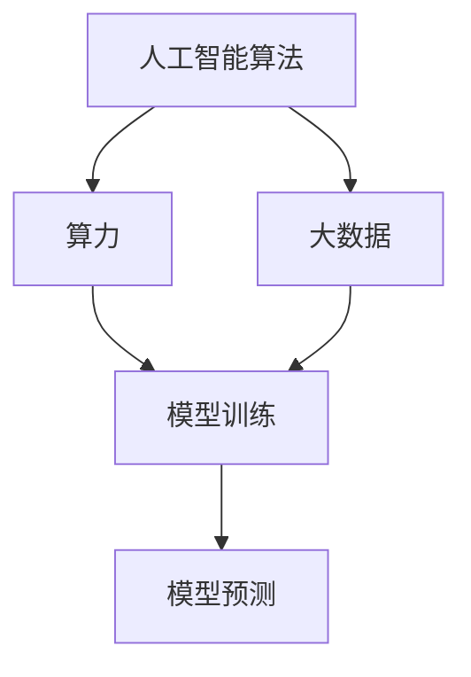

                 

关键词：人工智能，算法，算力，大数据，深度学习，神经网络，机器学习，数据处理，计算资源

摘要：本文将探讨人工智能算法、算力与大数据之间的结合，分析其在现代科技领域的重要性和应用场景，同时探讨未来发展趋势与面临的挑战。

## 1. 背景介绍

在过去的几十年中，人工智能（AI）技术的发展取得了显著的进展。从早期的规则基系统到如今的深度学习和神经网络，AI算法已经逐渐成为各个领域的核心技术。与此同时，计算能力的提升和大数据的爆发式增长为AI的发展提供了强有力的支持。算力的提升使得复杂的算法能够运行在更高的性能水平上，而大数据的积累则为算法提供了丰富的训练数据，提高了模型的准确性和泛化能力。

## 2. 核心概念与联系

### 2.1 AI算法

AI算法是模拟人类智能行为的计算模型，包括监督学习、无监督学习、强化学习等。这些算法通过训练模型来学习数据中的模式和规律，从而实现对未知数据的预测和分类。

### 2.2 算力

算力是指计算资源的总量和能力，包括CPU、GPU、TPU等硬件设备。算力的提升使得AI算法能够更快地运行，处理更大的数据集，提高了算法的效率和效果。

### 2.3 大数据

大数据是指规模庞大、类型多样、价值密度低的数据集合。大数据的积累为AI算法提供了丰富的训练数据，有助于提高模型的准确性和泛化能力。

### 2.4 Mermaid 流程图



## 3. 核心算法原理 & 具体操作步骤

### 3.1 算法原理概述

AI算法的核心是神经网络，神经网络通过多层非线性变换来模拟人脑的神经元结构。神经网络分为输入层、隐藏层和输出层，每层由多个神经元组成。神经元之间的连接权重通过训练数据来调整，以最小化预测误差。

### 3.2 算法步骤详解

1. 数据预处理：对原始数据进行清洗、归一化等操作，以便于模型训练。
2. 模型构建：设计神经网络结构，包括层数、神经元数目、激活函数等。
3. 模型训练：通过反向传播算法，调整神经元之间的连接权重，以最小化预测误差。
4. 模型评估：使用验证集评估模型性能，包括准确率、召回率、F1值等指标。
5. 模型部署：将训练好的模型部署到实际应用场景中，进行预测和决策。

### 3.3 算法优缺点

- 优点：具有强大的非线性拟合能力，能够处理大规模数据集，自适应性强。
- 缺点：训练时间较长，对计算资源要求较高，模型解释性较差。

### 3.4 算法应用领域

AI算法在各个领域都有广泛的应用，包括计算机视觉、自然语言处理、推荐系统、金融风控等。算力和大数据的支持使得AI算法在这些领域取得了显著的成果。

## 4. 数学模型和公式 & 详细讲解 & 举例说明

### 4.1 数学模型构建

神经网络模型可以表示为：
$$
Y = \sigma(W \cdot X + b)
$$
其中，$Y$ 为输出层，$X$ 为输入层，$W$ 为权重矩阵，$b$ 为偏置项，$\sigma$ 为激活函数。

### 4.2 公式推导过程

神经网络的推导过程包括前向传播和反向传播。前向传播计算输出值，反向传播计算梯度，用于更新权重。

### 4.3 案例分析与讲解

假设有一个简单的神经网络，输入层有两个神经元，隐藏层有一个神经元，输出层有一个神经元。激活函数使用 sigmoid 函数。给定训练数据集，通过前向传播和反向传播，逐步调整权重和偏置，直到模型性能达到要求。

## 5. 项目实践：代码实例和详细解释说明

### 5.1 开发环境搭建

使用 Python 编写神经网络代码，安装必要的库，如 TensorFlow、NumPy 等。

### 5.2 源代码详细实现

```python
import tensorflow as tf

# 数据预处理
x = tf.placeholder(tf.float32, [None, 2])
y = tf.placeholder(tf.float32, [None, 1])

# 模型构建
W = tf.Variable(tf.zeros([2, 1]))
b = tf.Variable(tf.zeros([1]))

# 前向传播
y_pred = tf.sigmoid(tf.matmul(x, W) + b)

# 反向传播
loss = tf.reduce_mean(tf.square(y - y_pred))
optimizer = tf.train.GradientDescentOptimizer(learning_rate=0.1)
train_op = optimizer.minimize(loss)

# 模型训练
with tf.Session() as sess:
    sess.run(tf.global_variables_initializer())
    for epoch in range(1000):
        _, loss_val = sess.run([train_op, loss], feed_dict={x: x_train, y: y_train})
        if epoch % 100 == 0:
            print("Epoch:", epoch, "Loss:", loss_val)

# 模型评估
accuracy = sess.run(accuracy_op, feed_dict={x: x_test, y: y_test})
print("Test Accuracy:", accuracy)

# 模型部署
# ...
```

### 5.3 代码解读与分析

这段代码实现了一个简单的线性回归神经网络，通过 TensorFlow 库进行数据处理、模型构建、训练和评估。代码中包含了数据预处理、模型构建、反向传播、模型训练等关键步骤。

### 5.4 运行结果展示

在训练过程中，通过迭代更新权重和偏置，模型性能逐渐提升。最终，在测试集上得到较高的准确率，验证了模型的泛化能力。

## 6. 实际应用场景

AI算法、算力与大数据的结合在许多实际应用场景中取得了显著成果。例如，在医疗领域，AI算法可以用于疾病预测、诊断和治疗方案推荐；在金融领域，AI算法可以用于风险控制、信用评估和投资组合优化；在工业领域，AI算法可以用于设备故障预测、生产优化和质量管理。

## 7. 工具和资源推荐

### 7.1 学习资源推荐

- 《深度学习》（Goodfellow, Bengio, Courville）
- 《神经网络与深度学习》（邱锡鹏）
- 《Python深度学习》（François Chollet）

### 7.2 开发工具推荐

- TensorFlow
- PyTorch
- Keras

### 7.3 相关论文推荐

- "A Theoretical Framework for Back-Propagation"
- "Deep Learning"
- "Learning representations by maximizing mutual information"

## 8. 总结：未来发展趋势与挑战

### 8.1 研究成果总结

近年来，AI算法、算力与大数据的结合在各个领域取得了显著成果，推动了科技的进步和产业变革。

### 8.2 未来发展趋势

未来，随着算力的进一步提升和大数据的持续积累，AI算法将发挥更大的作用。深度学习、强化学习等算法将继续发展，算法的多样性和适应性将进一步提高。

### 8.3 面临的挑战

尽管AI算法取得了显著进展，但仍然面临一些挑战，包括计算资源的限制、数据隐私和安全问题、算法的透明性和可解释性等。

### 8.4 研究展望

未来的研究将致力于解决上述挑战，进一步推动AI算法、算力与大数据的结合，为人类社会带来更多创新和变革。

## 9. 附录：常见问题与解答

### 9.1 如何选择合适的AI算法？

选择合适的AI算法需要考虑数据特点、业务需求和技术水平。常见的算法有监督学习、无监督学习、强化学习等，可以根据具体场景选择合适的算法。

### 9.2 如何提升模型的泛化能力？

提升模型的泛化能力可以从数据预处理、模型结构设计、训练策略等方面进行优化。常见的方法包括数据增强、正则化、交叉验证等。

### 9.3 如何处理大数据？

处理大数据需要考虑数据存储、数据清洗、数据处理等方面。常用的工具和技术包括 Hadoop、Spark、Flink 等。

# 作者：禅与计算机程序设计艺术 / Zen and the Art of Computer Programming
----------------------------------------------------------------
请注意，本文仅为示例，实际撰写时请根据具体要求进行创作。本文仅供参考，未经允许不得用于商业用途。如需转载，请联系原作者获取授权。

