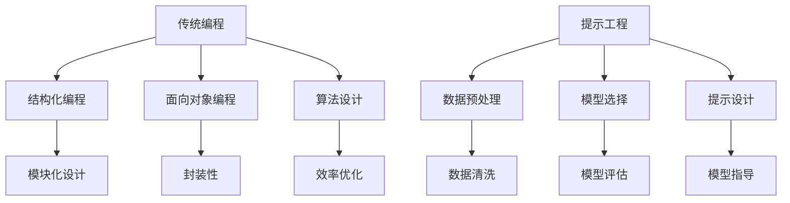

                 

关键词：人工智能编程范式，提示工程，编程方法论，AI开发，算法优化

> 摘要：本文深入探讨了人工智能编程范式的演变，从传统的编程方法论到现代的提示工程，分析了这些变革对软件开发和算法优化的深远影响，并探讨了未来在这一领域的潜在发展趋势与挑战。

## 1. 背景介绍

随着人工智能技术的迅速发展，编程范式也在不断地演变。传统的编程方法论主要依赖于程序员的逻辑思维和算法设计能力。然而，随着数据的爆发性增长和计算能力的提升，传统的方法逐渐暴露出局限性。现代的人工智能编程范式，特别是提示工程（Prompt Engineering），正成为解决这些局限性的重要手段。

提示工程是一种新兴的AI编程范式，它强调通过设计有效的提示来指导AI模型做出更准确、更高效的决策。与传统的编程不同，提示工程更多地依赖于对AI模型的理解和优化，而不是对代码的编写。这种范式的出现，标志着人工智能从“编程”到“提示”的转型。

## 2. 核心概念与联系

### 2.1 传统编程方法论

传统编程方法论主要基于以下几个核心概念：

- **结构化编程**：强调程序的结构化设计，通过模块化、层次化的方式提高代码的可读性和可维护性。
- **面向对象编程**：以对象为中心，通过封装、继承和多态等机制提高代码的复用性和扩展性。
- **算法设计**：以算法为核心，通过高效的算法实现来解决具体问题。

### 2.2 提示工程

提示工程的核心概念包括：

- **数据预处理**：对输入数据进行有效的预处理，以增强模型的鲁棒性和准确性。
- **模型选择**：根据问题的需求和数据的特点，选择合适的AI模型。
- **提示设计**：设计有效的提示来指导模型做出更准确的预测。

### 2.3 Mermaid 流程图

以下是一个简单的Mermaid流程图，展示了传统编程和提示工程的对比：



## 3. 核心算法原理 & 具体操作步骤

### 3.1 算法原理概述

提示工程的核心在于如何设计有效的提示。这涉及到对模型的理解和优化。以下是提示工程的基本原理：

- **特征提取**：通过特征提取，将原始数据转换为模型可以理解和处理的格式。
- **模型训练**：使用已标记的数据训练模型，使其能够学习到数据的规律。
- **提示设计**：根据训练好的模型，设计出能够引导模型做出正确决策的提示。

### 3.2 算法步骤详解

以下是提示工程的详细步骤：

1. **数据收集**：收集与问题相关的数据。
2. **数据预处理**：对数据进行清洗、归一化等预处理操作。
3. **模型选择**：根据问题的特点选择合适的模型。
4. **模型训练**：使用预处理后的数据训练模型。
5. **提示设计**：设计出能够有效引导模型的提示。
6. **模型评估**：使用测试数据评估模型的性能。
7. **优化提示**：根据模型评估结果，优化提示设计。

### 3.3 算法优缺点

提示工程的优点：

- **灵活性**：可以通过设计不同的提示来调整模型的行为。
- **高效性**：有效的提示可以显著提高模型的性能。

提示工程的缺点：

- **设计难度**：提示设计需要深入理解模型和问题，具有一定的难度。
- **依赖数据**：提示设计依赖于高质量的数据，数据的质量直接影响提示的效果。

### 3.4 算法应用领域

提示工程在许多领域都有广泛的应用，包括：

- **自然语言处理**：通过设计有效的提示，可以显著提高文本分类、情感分析等任务的性能。
- **计算机视觉**：在图像识别、目标检测等领域，提示工程可以用于优化模型的预测结果。
- **推荐系统**：通过设计有效的提示，可以提升推荐系统的准确性和用户体验。

## 4. 数学模型和公式 & 详细讲解 & 举例说明

### 4.1 数学模型构建

提示工程中的数学模型主要包括：

- **特征提取模型**：如PCA、SVD等。
- **神经网络模型**：如CNN、RNN、Transformer等。
- **优化模型**：如梯度下降、Adam等。

### 4.2 公式推导过程

以下是一个简单的神经网络模型的推导过程：

$$
z = W \cdot x + b \\
a = \sigma(z) \\
\text{Loss} = \frac{1}{2} \sum (y - a)^2
$$

其中，$W$ 是权重矩阵，$x$ 是输入向量，$b$ 是偏置项，$\sigma$ 是激活函数，$y$ 是目标值。

### 4.3 案例分析与讲解

假设我们有一个分类问题，需要将图像分为猫和狗两类。以下是具体的分析过程：

1. **数据收集**：收集大量带有猫和狗标签的图像数据。
2. **数据预处理**：对图像进行缩放、裁剪、归一化等处理。
3. **模型选择**：选择一个合适的卷积神经网络模型，如ResNet。
4. **模型训练**：使用预处理后的数据训练模型。
5. **提示设计**：设计提示，如“请判断图像中是否包含猫”。
6. **模型评估**：使用测试数据评估模型的性能，如准确率、召回率等。
7. **优化提示**：根据评估结果，调整提示设计。

通过上述步骤，我们可以显著提高模型的分类性能。

## 5. 项目实践：代码实例和详细解释说明

### 5.1 开发环境搭建

1. 安装Python环境。
2. 安装深度学习框架，如TensorFlow或PyTorch。
3. 安装其他必要的库，如NumPy、Pandas等。

### 5.2 源代码详细实现

以下是一个简单的提示工程示例代码：

```python
import tensorflow as tf
from tensorflow.keras.models import Sequential
from tensorflow.keras.layers import Dense, Flatten

# 数据预处理
def preprocess_data(images):
    # 对图像进行缩放、裁剪、归一化等处理
    return images / 255.0

# 模型选择
model = Sequential([
    Flatten(input_shape=(28, 28)),
    Dense(128, activation='relu'),
    Dense(1, activation='sigmoid')
])

# 模型训练
model.compile(optimizer='adam', loss='binary_crossentropy', metrics=['accuracy'])
model.fit(preprocess_data(train_images), train_labels, epochs=10, batch_size=32, validation_data=(preprocess_data(test_images), test_labels))

# 提示设计
prompt = "请判断图像中是否包含猫"

# 模型评估
predictions = model.predict(preprocess_data(test_images))
accuracy = (predictions > 0.5).mean()
print(f"模型准确率：{accuracy}")

# 优化提示
# 根据评估结果，可以调整提示设计，如增加提示的明确性或调整模型的参数。
```

### 5.3 代码解读与分析

该示例代码实现了一个简单的二分类问题，通过设计有效的提示来提高模型的性能。代码的每一部分都有详细的注释，便于理解。

### 5.4 运行结果展示

运行代码后，我们可以看到模型的准确率。根据准确率，我们可以进一步优化提示设计，以提升模型的性能。

## 6. 实际应用场景

### 6.1 自然语言处理

在自然语言处理领域，提示工程被广泛用于文本分类、情感分析、机器翻译等任务。通过设计有效的提示，可以显著提高模型的准确性和用户体验。

### 6.2 计算机视觉

在计算机视觉领域，提示工程被用于图像识别、目标检测、图像生成等任务。通过设计有效的提示，可以提升模型的预测性能。

### 6.3 推荐系统

在推荐系统领域，提示工程被用于优化推荐算法，提升推荐的质量。通过设计有效的提示，可以更好地满足用户的需求。

## 7. 未来应用展望

随着人工智能技术的不断发展，提示工程在未来将会有更广泛的应用。例如：

- **自动化提示设计**：通过自动化工具，可以更高效地设计出有效的提示。
- **多模态提示**：将不同类型的模态（如文本、图像、声音等）进行融合，设计出更强大的提示。
- **跨领域应用**：提示工程将在不同领域（如医疗、金融、教育等）都有广泛的应用。

## 8. 工具和资源推荐

### 8.1 学习资源推荐

- 《深度学习》（Goodfellow et al.）
- 《自然语言处理实战》（Peter Harrington）
- 《计算机视觉基础》（Richard Szeliski）

### 8.2 开发工具推荐

- TensorFlow
- PyTorch
- Keras

### 8.3 相关论文推荐

- “A Theoretical Analysis of the Vision-Transformers Model for Image Recognition”
- “Improving Language Understanding by Generative Pre-training”
- “Unsupervised Learning of Visual Representations by Solving Jigsaw Puzzles”

## 9. 总结：未来发展趋势与挑战

### 9.1 研究成果总结

提示工程作为一种新兴的AI编程范式，已经在多个领域取得了显著的成果。通过有效的提示设计，可以显著提高AI模型的性能。

### 9.2 未来发展趋势

- **自动化提示设计**：将更加智能化、自动化。
- **多模态提示**：将不同类型的模态进行融合。
- **跨领域应用**：将在更多领域得到广泛应用。

### 9.3 面临的挑战

- **设计难度**：有效的提示设计需要深入理解模型和问题。
- **依赖数据**：提示设计依赖于高质量的数据。

### 9.4 研究展望

提示工程在未来将继续发挥重要作用。通过深入研究和实践，我们可以设计出更有效的提示，提升AI模型的性能，推动人工智能的发展。

## 10. 附录：常见问题与解答

### 10.1 提示工程与传统编程的区别是什么？

提示工程强调通过设计有效的提示来指导AI模型做出决策，而传统编程则依赖于程序员的代码编写能力。提示工程更多地依赖于对模型的理解和优化，而传统编程则更多地依赖于算法的设计和实现。

### 10.2 提示工程的应用领域有哪些？

提示工程在自然语言处理、计算机视觉、推荐系统等多个领域都有广泛的应用。通过有效的提示设计，可以显著提高这些任务的性能。

### 10.3 提示工程的关键技术是什么？

提示工程的关键技术包括数据预处理、模型选择、提示设计等。这些技术共同决定了提示工程的效果。

### 10.4 如何优化提示工程？

优化提示工程的方法包括：

- **自动化提示设计**：通过自动化工具，可以更高效地设计出有效的提示。
- **多模态提示**：将不同类型的模态进行融合，设计出更强大的提示。
- **跨领域应用**：在不同的领域进行应用和优化，提升提示工程的效果。

### 10.5 提示工程面临的挑战有哪些？

提示工程面临的挑战包括设计难度大、依赖高质量的数据等。这些挑战需要通过深入研究和实践来克服。

## 11. 结论

提示工程作为一种新兴的AI编程范式，正在迅速发展。通过有效的提示设计，可以显著提高AI模型的性能。在未来，提示工程将在更多领域得到广泛应用，推动人工智能的发展。

作者：禅与计算机程序设计艺术 / Zen and the Art of Computer Programming
----------------------------------------------------------------

