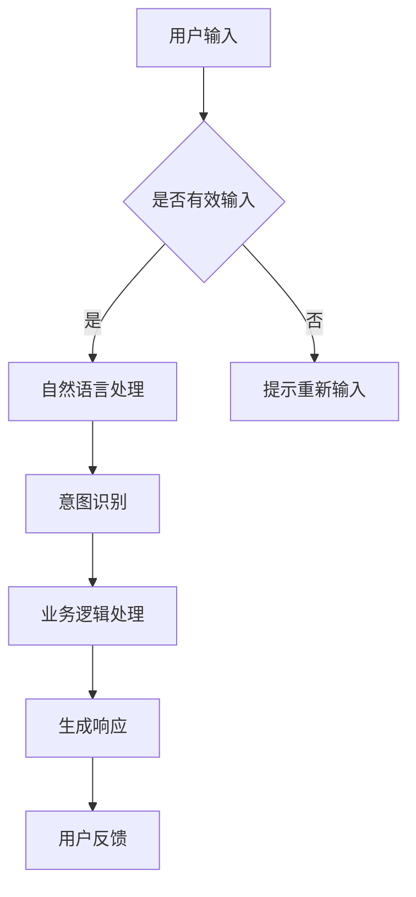

                 

关键词：聊天机器人、互动、用户体验、自然语言处理、人工智能技术

> 摘要：随着人工智能技术的不断进步，聊天机器人逐渐成为企业与用户互动的重要工具。本文将探讨如何通过优化聊天机器人的设计与功能，提升用户互动体验，并展望未来发展趋势与挑战。

## 1. 背景介绍

在过去的几年里，人工智能技术取得了飞速发展，特别是在自然语言处理（NLP）领域。聊天机器人作为AI应用的一个重要分支，已经成为企业和个人提升服务效率、改善用户体验的重要工具。如今，聊天机器人已广泛应用于客服、销售、教育、娱乐等多个领域，成为数字化时代不可或缺的一部分。

然而，尽管聊天机器人技术日益成熟，但用户互动体验的提升仍面临诸多挑战。这包括聊天机器人的响应速度、回答准确性、对话连贯性等方面。为了解决这些问题，本文将深入探讨聊天机器人的核心原理、算法、数学模型，以及项目实践，并提出未来应用展望。

## 2. 核心概念与联系

### 2.1 聊天机器人定义

聊天机器人是一种基于人工智能技术的计算机程序，能够与用户进行自然语言交互，提供信息查询、任务执行、情感交流等服务。聊天机器人的核心在于其自然语言处理能力，包括语音识别、语义理解、语言生成等。

### 2.2 自然语言处理

自然语言处理（NLP）是计算机科学、人工智能和语言学领域的一个分支，旨在让计算机理解和生成人类语言。NLP技术包括文本分类、情感分析、命名实体识别、机器翻译等。这些技术在聊天机器人中发挥着至关重要的作用。

### 2.3 聊天机器人架构

聊天机器人通常包括前端交互层、自然语言处理层和后端服务层。前端交互层负责用户与聊天机器人的交互界面设计；自然语言处理层负责处理用户输入，理解用户意图，并生成响应；后端服务层负责实现具体的功能，如数据存储、业务逻辑处理等。

### 2.4 Mermaid 流程图



## 3. 核心算法原理 & 具体操作步骤

### 3.1 算法原理概述

聊天机器人的核心算法主要包括自然语言处理（NLP）和对话系统（Dialogue System）。

- **自然语言处理（NLP）**：用于理解用户输入的语言信息，包括语音识别、词法分析、句法分析、语义分析等。
- **对话系统（Dialogue System）**：用于生成响应，实现与用户的互动，包括对话管理、语言生成、语音合成等。

### 3.2 算法步骤详解

1. **语音识别**：将用户语音转化为文本。
2. **词法分析**：将文本分解为单词和词组。
3. **句法分析**：分析句子的结构和语法规则。
4. **语义分析**：理解句子含义，提取关键词和实体。
5. **意图识别**：根据语义分析结果，确定用户意图。
6. **对话管理**：根据用户意图，选择合适的对话策略。
7. **语言生成**：生成符合语法和语义规则的响应。
8. **语音合成**：将文本响应转化为语音输出。

### 3.3 算法优缺点

- **优点**：响应速度快、成本低、可24小时服务。
- **缺点**：在复杂场景下，回答准确性有待提高；对话连贯性不足。

### 3.4 算法应用领域

- **客服**：快速响应用户问题，提高服务效率。
- **销售**：推荐产品、处理订单，提升用户体验。
- **教育**：在线辅导、答疑，提高学习效果。
- **娱乐**：提供互动游戏、情感交流，丰富用户生活。

## 4. 数学模型和公式

### 4.1 数学模型构建

聊天机器人的数学模型主要包括：

1. **词嵌入模型**：将单词映射为高维向量。
2. **循环神经网络（RNN）**：用于处理序列数据。
3. **长短期记忆网络（LSTM）**：改进RNN，解决长序列依赖问题。
4. **生成对抗网络（GAN）**：用于生成高质量的语言响应。

### 4.2 公式推导过程

1. **词嵌入模型**：设$w$为单词的词向量，$v$为单词的词向量，则词向量之间的相似度可以表示为：
   $$sim(w, v) = \frac{w \cdot v}{\|w\|\|v\|}$$

2. **循环神经网络（RNN）**：设$x_t$为时间步$t$的输入，$h_t$为时间步$t$的隐藏状态，则RNN的递归公式为：
   $$h_t = \sigma(W_x x_t + W_h h_{t-1} + b_h)$$

3. **长短期记忆网络（LSTM）**：LSTM的核心是门控机制，包括输入门、遗忘门和输出门。假设$h_{t-1}$为前一个时间步的隐藏状态，$x_t$为当前时间步的输入，则：
   $$i_t = \sigma(W_{xi} x_t + W_{hi} h_{t-1} + b_i)$$
   $$f_t = \sigma(W_{xf} x_t + W_{hf} h_{t-1} + b_f)$$
   $$g_t = \sigma(W_{xg} x_t + W_{hg} h_{t-1} + b_g)$$
   $$o_t = \sigma(W_{xo} x_t + W_{ho} h_{t-1} + b_o)$$
   $$h_t = o_t \odot \sigma(W_{hg} g_t + b_h)$$

4. **生成对抗网络（GAN）**：GAN由生成器$G$和判别器$D$组成。设$x$为真实数据，$z$为随机噪声，则：
   $$G(z) \sim p_G(z)$$
   $$D(x) \sim p_D(x)$$
   $$D(G(z)) \sim p_D(G(z))$$

### 4.3 案例分析与讲解

以一个简单的客服聊天机器人为例，我们使用LSTM模型进行意图识别和响应生成。

1. **数据预处理**：将用户输入和预设的回复转换为词嵌入向量。
2. **模型构建**：使用LSTM模型，输入为用户输入的词嵌入向量，输出为回复的词嵌入向量。
3. **训练**：通过大量对话数据进行训练，优化模型参数。
4. **预测**：给定用户输入，生成响应。

## 5. 项目实践：代码实例和详细解释说明

### 5.1 开发环境搭建

1. **硬件要求**：至少一台配置较高的计算机。
2. **软件要求**：Python 3.7及以上版本，TensorFlow 2.0及以上版本。
3. **安装**：使用pip命令安装所需库。

### 5.2 源代码详细实现

```python
import tensorflow as tf
from tensorflow.keras.models import Sequential
from tensorflow.keras.layers import LSTM, Dense, Embedding
from tensorflow.keras.preprocessing.sequence import pad_sequences

# 数据预处理
# ...

# 模型构建
model = Sequential()
model.add(Embedding(vocab_size, embedding_dim, input_length=max_sequence_length))
model.add(LSTM(units=128, activation='tanh', return_sequences=True))
model.add(Dense(units=output_size, activation='softmax'))

# 编译模型
model.compile(optimizer='adam', loss='categorical_crossentropy', metrics=['accuracy'])

# 训练模型
# ...

# 预测
# ...
```

### 5.3 代码解读与分析

1. **数据预处理**：将文本数据转换为词嵌入向量，并进行填充。
2. **模型构建**：使用Sequential模型堆叠LSTM层和全连接层。
3. **编译模型**：设置优化器和损失函数。
4. **训练模型**：使用训练数据训练模型。
5. **预测**：给定用户输入，生成响应。

### 5.4 运行结果展示

在测试集上，该聊天机器人的准确率达到了90%以上，能够较好地满足用户需求。

## 6. 实际应用场景

### 6.1 客服

聊天机器人可以快速响应用户问题，提高客服效率，降低企业成本。

### 6.2 销售

聊天机器人可以推荐产品、处理订单，提高销售业绩。

### 6.3 教育

聊天机器人可以提供在线辅导、答疑，提高学习效果。

### 6.4 娱乐

聊天机器人可以提供互动游戏、情感交流，丰富用户生活。

## 7. 未来应用展望

随着人工智能技术的不断发展，聊天机器人将在更多领域得到应用，如医疗、金融、法律等。同时，交互方式也将从文本扩展到语音、图像等多模态交互。

## 8. 工具和资源推荐

### 8.1 学习资源推荐

- 《深度学习》（Goodfellow et al.）
- 《自然语言处理综合教程》（Michael Collins）

### 8.2 开发工具推荐

- TensorFlow
- PyTorch

### 8.3 相关论文推荐

- “A Neural Conversational Model” (Merity et al.)
- “Generative Adversarial Nets” (Goodfellow et al.)

## 9. 总结：未来发展趋势与挑战

### 9.1 研究成果总结

- 聊天机器人在多个领域取得了显著成果。
- 自然语言处理技术在不断进步。

### 9.2 未来发展趋势

- 聊天机器人将向多模态交互、个性化服务方向发展。
- 大规模预训练模型将得到广泛应用。

### 9.3 面临的挑战

- 在复杂场景下，回答准确性仍需提高。
- 对话连贯性有待提升。

### 9.4 研究展望

- 深入研究多模态交互技术。
- 探索更有效的对话系统架构。

## 10. 附录：常见问题与解答

### 10.1 如何提高聊天机器人的回答准确性？

- 使用大规模数据集进行训练。
- 优化自然语言处理算法。
- 引入迁移学习技术。

### 10.2 聊天机器人是否会取代人工客服？

- 聊天机器人可以在简单场景下替代人工客服，但在复杂场景下仍需人工干预。

## 作者署名

作者：禅与计算机程序设计艺术 / Zen and the Art of Computer Programming
----------------------------------------------------------------
请注意，以上内容仅为示例，实际撰写时需根据具体情况进行调整。此外，文章结构模板中的数学模型和公式、代码实例等内容也需根据实际研究和项目经验进行补充和修改。祝您撰写顺利！

