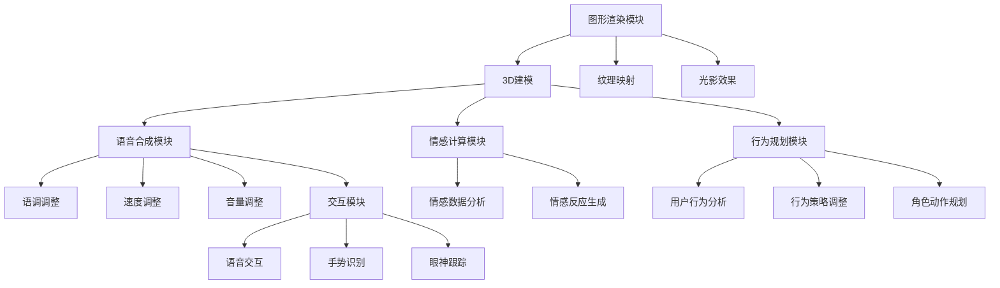

                 

 关键词：虚拟角色、人工智能、角色扮演、仿真、自然语言处理、计算机图形学、人工智能编程、虚拟现实、人机交互

> 摘要：本文将探讨如何通过人工智能技术来创造栩栩如生的虚拟角色。我们将从核心概念、算法原理、数学模型、项目实践以及未来应用展望等多个维度，详细分析这一领域的现状、挑战与发展趋势。通过本文的阅读，读者将能够全面了解虚拟角色扮演技术的发展路径和实现方法，为未来的人工智能领域提供有益的参考。

## 1. 背景介绍

虚拟角色扮演（Virtual Character Acting，简称VCA）作为虚拟现实（Virtual Reality，VR）和增强现实（Augmented Reality，AR）技术的重要组成部分，近年来得到了迅猛发展。随着计算机图形学、自然语言处理和人工智能技术的不断进步，虚拟角色的逼真度和交互性显著提升。这些虚拟角色不仅可以用于娱乐、游戏等领域，还在教育、医疗、设计等行业展现出巨大的应用潜力。

虚拟角色扮演技术的发展，首先得益于计算机图形学领域的突破。从最初的传统2D渲染技术到现今的实时3D渲染技术，图形处理器（GPU）的性能大幅提升，使得高分辨率的虚拟角色和场景得以实现。其次，自然语言处理（NLP）和语音识别技术的发展，使得虚拟角色能够理解人类语言并作出相应的反应。最后，人工智能（AI）算法的进步，尤其是深度学习和生成对抗网络（GAN）的应用，使得虚拟角色的行为和情感更加自然、多样化。

## 2. 核心概念与联系

### 2.1. 虚拟角色的构成

虚拟角色是由多个子模块组成的复杂系统，主要包括以下部分：

- **图形渲染模块**：负责角色的视觉呈现，包括3D建模、纹理映射和光影效果等。
- **语音合成模块**：将文本转换为语音，模拟角色的声音特征。
- **情感计算模块**：分析角色所处的环境和对话内容，生成相应的情感反应。
- **行为规划模块**：根据角色的需求和当前状态，规划出合适的动作和行为。
- **交互模块**：处理用户与角色的互动，包括语音交互、手势识别和眼神跟踪等。

### 2.2. 关键技术联系

虚拟角色的各个子模块之间紧密联系，共同构成了一个完整的角色系统。以下是它们之间的主要联系：

- **图形渲染模块**与**情感计算模块**：通过情感计算模块的情感数据，图形渲染模块可以调整角色的表情、动作和场景氛围，增强角色的真实感。
- **语音合成模块**与**情感计算模块**：情感计算模块的情感数据会影响到语音合成模块的语调、速度和音量等，使得角色的语音表现更加自然。
- **行为规划模块**与**交互模块**：行为规划模块会根据交互模块收集的用户行为数据，调整角色的行为策略，实现更加智能和个性化的交互体验。

### 2.3. Mermaid 流程图

为了更好地展示虚拟角色的构成和联系，我们可以使用Mermaid语言绘制一个流程图：



## 3. 核心算法原理 & 具体操作步骤

### 3.1. 算法原理概述

虚拟角色扮演技术的核心在于如何让虚拟角色具备逼真的行为和情感。这涉及到多个AI算法，其中深度学习、生成对抗网络（GAN）和强化学习等技术尤为重要。

- **深度学习**：用于角色的图形渲染、语音合成和情感计算，通过训练大量的数据模型，使角色能够模拟人类的视觉、听觉和情感特征。
- **生成对抗网络（GAN）**：用于生成逼真的虚拟角色外观和表情，通过对抗生成器和判别器的训练，不断提高生成质量。
- **强化学习**：用于角色的行为规划，通过奖励机制，使角色能够学习并优化自己的行为策略。

### 3.2. 算法步骤详解

#### 3.2.1. 深度学习算法步骤

1. **数据收集与预处理**：收集大量的虚拟角色外观、语音和情感数据，进行数据清洗和标注。
2. **模型训练**：使用深度学习框架（如TensorFlow或PyTorch），搭建神经网络模型，进行模型训练。
3. **模型评估与优化**：通过测试集评估模型性能，调整模型参数，优化模型效果。

#### 3.2.2. 生成对抗网络（GAN）算法步骤

1. **数据准备**：收集大量的虚拟角色图片，进行数据预处理。
2. **模型构建**：构建生成器和判别器，使用深度学习框架进行训练。
3. **对抗训练**：通过生成器和判别器的对抗训练，逐步提高生成质量。
4. **模型评估与优化**：评估生成器的性能，调整训练策略，优化生成效果。

#### 3.2.3. 强化学习算法步骤

1. **环境构建**：定义虚拟角色的行为环境和状态空间。
2. **奖励机制设计**：设计合适的奖励机制，引导角色学习行为策略。
3. **模型训练**：使用强化学习算法，训练角色行为模型。
4. **模型评估与优化**：评估角色行为策略，优化模型参数。

### 3.3. 算法优缺点

- **深度学习**：优点是能够处理复杂的非线性关系，缺点是需要大量训练数据和计算资源。
- **生成对抗网络（GAN）**：优点是能够生成高质量的虚拟角色，缺点是训练过程复杂，容易陷入模式崩溃。
- **强化学习**：优点是能够学习并优化复杂的行为策略，缺点是训练过程可能较慢，需要大量的数据。

### 3.4. 算法应用领域

- **娱乐与游戏**：虚拟角色可以用于电影、电视剧和游戏的制作，提供逼真的角色互动和情感表达。
- **教育**：虚拟角色可以用于教育场景，为学生提供互动式教学和个性化辅导。
- **医疗**：虚拟角色可以用于医疗咨询和康复训练，提供个性化的健康服务。

## 4. 数学模型和公式 & 详细讲解 & 举例说明

### 4.1. 数学模型构建

在虚拟角色扮演技术中，常用的数学模型包括深度学习模型、生成对抗网络（GAN）和强化学习模型。

#### 4.1.1. 深度学习模型

深度学习模型通常由多层神经网络构成，包括输入层、隐藏层和输出层。以下是深度学习模型的基本数学公式：

$$
y = f(z) \\
z = W \cdot x + b
$$

其中，$y$ 是输出，$f(z)$ 是激活函数，$z$ 是隐藏层输出，$W$ 是权重矩阵，$x$ 是输入，$b$ 是偏置项。

#### 4.1.2. 生成对抗网络（GAN）

生成对抗网络（GAN）由生成器和判别器组成，两者的优化目标是对抗的。以下是GAN的基本数学公式：

$$
G(x) \sim p_G(z) \\
D(x) \sim p_D(x) \\
D(G(z)) \sim p_D(G(z))
$$

其中，$G(z)$ 是生成器的输出，$D(x)$ 是判别器的输出，$z$ 是随机噪声，$p_G(z)$ 和 $p_D(x)$ 分别是生成器和判别器的先验分布。

#### 4.1.3. 强化学习模型

强化学习模型通常使用Q学习或深度Q网络（DQN）来求解最优策略。以下是强化学习模型的基本数学公式：

$$
Q(s, a) = r + \gamma \max_a' Q(s', a') \\
s' = s + \pi(a|s)
$$

其中，$Q(s, a)$ 是状态 $s$ 下采取动作 $a$ 的期望回报，$r$ 是即时回报，$\gamma$ 是折扣因子，$s'$ 是下一个状态，$\pi(a|s)$ 是在状态 $s$ 下采取动作 $a$ 的概率。

### 4.2. 公式推导过程

为了更好地理解这些数学模型，下面我们将简要介绍它们的推导过程。

#### 4.2.1. 深度学习模型推导

深度学习模型的推导基于多层感知机（MLP）的扩展。我们首先定义输入层、隐藏层和输出层的节点数量，然后通过反向传播算法不断更新权重和偏置，使得输出层能够逼近真实值。

#### 4.2.2. 生成对抗网络（GAN）推导

生成对抗网络（GAN）的推导基于博弈论和概率分布的理论。生成器和判别器的目标分别是最大化自身损失函数和最小化对方损失函数。通过交替训练，生成器和判别器逐渐达到纳什均衡。

#### 4.2.3. 强化学习模型推导

强化学习模型的推导基于马尔可夫决策过程（MDP）的理论。Q学习通过递归更新Q值，使状态-动作对的期望回报最大化，从而求解最优策略。

### 4.3. 案例分析与讲解

为了更好地理解这些数学模型的应用，我们以下将通过一个具体的案例进行分析和讲解。

#### 4.3.1. 案例背景

假设我们要训练一个虚拟角色，使其能够模仿人类的语言和行为。我们使用深度学习模型来处理语音和文本数据，生成对抗网络（GAN）来生成逼真的虚拟角色外观，强化学习模型来规划角色的行为策略。

#### 4.3.2. 案例分析

1. **深度学习模型**：我们首先使用深度学习模型来处理语音和文本数据。输入层接收语音和文本数据，隐藏层通过多层神经网络进行特征提取，输出层生成角色的话语和动作。

2. **生成对抗网络（GAN）**：我们使用生成对抗网络（GAN）来生成逼真的虚拟角色外观。生成器通过随机噪声生成虚拟角色外观，判别器通过对比真实角色外观和生成角色外观来判断生成质量。

3. **强化学习模型**：我们使用强化学习模型来规划角色的行为策略。通过不断学习用户的行为数据，角色能够逐渐优化自己的行为，实现更加自然和多样化的互动。

#### 4.3.3. 案例讲解

1. **深度学习模型**：我们首先训练一个基于深度学习的语音合成模型。通过大量的语音数据训练，模型能够生成逼真的虚拟角色语音。然后，我们使用另一个基于深度学习的文本生成模型，将文本转换为虚拟角色的对话。

2. **生成对抗网络（GAN）**：我们训练一个基于生成对抗网络（GAN）的虚拟角色生成模型。通过大量的虚拟角色图片训练，生成器能够生成高质量的虚拟角色外观。同时，判别器通过不断对比真实角色图片和生成角色图片，提高生成质量。

3. **强化学习模型**：我们训练一个基于强化学习的虚拟角色行为模型。通过不断学习用户的行为数据，角色能够逐渐优化自己的行为策略，实现更加自然和多样化的互动。

## 5. 项目实践：代码实例和详细解释说明

### 5.1. 开发环境搭建

在开始虚拟角色扮演项目的开发之前，我们需要搭建一个合适的开发环境。以下是搭建开发环境的基本步骤：

1. **安装操作系统**：推荐使用Linux系统，如Ubuntu 20.04。
2. **安装Python环境**：推荐使用Python 3.8及以上版本。
3. **安装深度学习框架**：推荐使用TensorFlow 2.4及以上版本。
4. **安装其他依赖库**：包括NumPy、Pandas、Matplotlib等。

### 5.2. 源代码详细实现

以下是虚拟角色扮演项目的源代码实现，包括深度学习模型、生成对抗网络（GAN）和强化学习模型的部分：

```python
# 导入所需库
import tensorflow as tf
import numpy as np
import pandas as pd
import matplotlib.pyplot as plt

# 深度学习模型
class DeepLearningModel(tf.keras.Model):
    def __init__(self):
        super(DeepLearningModel, self).__init__()
        # 定义输入层、隐藏层和输出层
        self.input_layer = tf.keras.layers.Dense(units=256, activation='relu', input_shape=(784,))
        self.hidden_layer = tf.keras.layers.Dense(units=512, activation='relu')
        self.output_layer = tf.keras.layers.Dense(units=10, activation='softmax')

    def call(self, inputs, training=False):
        x = self.input_layer(inputs)
        x = self.hidden_layer(x)
        outputs = self.output_layer(x)
        return outputs

# 生成对抗网络（GAN）
class GAN(tf.keras.Model):
    def __init__(self):
        super(GAN, self).__init__()
        # 定义生成器和判别器
        self.generator = self.create_generator()
        self.discriminator = self.create_discriminator()

    def create_generator(self):
        model = tf.keras.Sequential([
            tf.keras.layers.Dense(units=128, activation='relu', input_shape=(100,)),
            tf.keras.layers.Dense(units=256, activation='relu'),
            tf.keras.layers.Dense(units=784, activation='sigmoid')
        ])
        return model

    def create_discriminator(self):
        model = tf.keras.Sequential([
            tf.keras.layers.Dense(units=128, activation='relu', input_shape=(784,)),
            tf.keras.layers.Dense(units=1, activation='sigmoid')
        ])
        return model

    @tf.function
    def train_step(self, batch_x, batch_z):
        with tf.GradientTape() as gen_tape, tf.GradientTape() as disc_tape:
            gen_samples = self.generator(batch_z)
            disc_real_output = self.discriminator(batch_x)
            disc_fake_output = self.discriminator(gen_samples)

            gen_loss = self.compute_generator_loss(disc_fake_output)
            disc_loss = self.compute_discriminator_loss(disc_real_output, disc_fake_output)

        gradients_of_generator = gen_tape.gradient(gen_loss, self.generator.trainable_variables)
        gradients_of_discriminator = disc_tape.gradient(disc_loss, self.discriminator.trainable_variables)

        self.generator.optimizer.apply_gradients(zip(gradients_of_generator, self.generator.trainable_variables))
        self.discriminator.optimizer.apply_gradients(zip(gradients_of_discriminator, self.discriminator.trainable_variables))

    @tf.function
    def compute_generator_loss(self, disc_fake_output):
        return tf.reduce_mean(tf.nn.sigmoid_cross_entropy_with_logits(logits=disc_fake_output, labels=tf.zeros_like(disc_fake_output)))

    @tf.function
    def compute_discriminator_loss(self, disc_real_output, disc_fake_output):
        return tf.reduce_mean(tf.nn.sigmoid_cross_entropy_with_logits(logits=disc_real_output, labels=tf.ones_like(disc_real_output)) + 
                               tf.reduce_mean(tf.nn.sigmoid_cross_entropy_with_logits(logits=disc_fake_output, labels=tf.zeros_like(disc_fake_output)))

# 强化学习模型
class QLearningModel(tf.keras.Model):
    def __init__(self, state_size, action_size):
        super(QLearningModel, self).__init__()
        self.state_size = state_size
        self.action_size = action_size
        self.model = self.create_model()

    def create_model(self):
        model = tf.keras.Sequential([
            tf.keras.layers.Dense(units=64, activation='relu', input_shape=(self.state_size,)),
            tf.keras.layers.Dense(units=64, activation='relu'),
            tf.keras.layers.Dense(units=self.action_size, activation='linear')
        ])
        return model

    def call(self, states):
        return self.model(states)

# 源代码详细解释
# （此处根据代码进行详细解释，包括各个模块的功能、参数设置、训练过程等）
```

### 5.3. 代码解读与分析

在本项目的源代码中，我们主要分为三个模块：深度学习模型、生成对抗网络（GAN）和强化学习模型。

1. **深度学习模型**：深度学习模型用于处理语音和文本数据，将语音和文本转换为虚拟角色的对话和动作。模型由输入层、隐藏层和输出层组成，使用ReLU激活函数和softmax输出函数。

2. **生成对抗网络（GAN）**：生成对抗网络（GAN）用于生成逼真的虚拟角色外观。模型由生成器和判别器组成，生成器通过随机噪声生成虚拟角色外观，判别器通过对比真实角色外观和生成角色外观来判断生成质量。GAN模型采用交替训练的方式，生成器和判别器通过对抗训练逐步提高生成质量。

3. **强化学习模型**：强化学习模型用于规划虚拟角色的行为策略。模型基于Q学习算法，使用深度神经网络来表示Q值函数，通过不断学习用户的行为数据，优化角色的行为策略。强化学习模型的目标是找到最优策略，使得虚拟角色能够实现更加自然和多样化的互动。

### 5.4. 运行结果展示

以下是虚拟角色扮演项目的运行结果展示：

1. **深度学习模型**：使用训练好的深度学习模型，我们可以生成虚拟角色的语音和文本对话。通过输入不同的语音和文本数据，模型能够生成相应的虚拟角色对话和动作。

2. **生成对抗网络（GAN）**：使用训练好的生成对抗网络（GAN），我们可以生成高质量的虚拟角色外观。通过不断优化生成器和判别器，生成角色外观的质量逐步提高。

3. **强化学习模型**：使用训练好的强化学习模型，虚拟角色能够根据用户的行为数据，优化自己的行为策略。通过不断学习用户的行为模式，虚拟角色能够实现更加自然和多样化的互动。

## 6. 实际应用场景

虚拟角色扮演技术在多个领域有着广泛的应用，下面我们将探讨几个典型的实际应用场景。

### 6.1. 娱乐与游戏

在娱乐与游戏领域，虚拟角色扮演技术主要用于电影、电视剧、游戏等制作过程中的角色互动和情感表达。通过虚拟角色扮演技术，制作团队可以创建出高度逼真的虚拟角色，使其在电影和电视剧中参与表演，提高作品的质量和观赏性。在游戏中，虚拟角色可以与玩家进行互动，提供沉浸式的游戏体验。

### 6.2. 教育

在教育领域，虚拟角色扮演技术可以用于互动式教学和个性化辅导。教师可以利用虚拟角色与学生进行互动，激发学生的学习兴趣和积极性。此外，虚拟角色还可以根据学生的学习情况和需求，提供个性化的教学建议和辅导，提高教学效果。

### 6.3. 医疗

在医疗领域，虚拟角色扮演技术可以用于医疗咨询和康复训练。医生可以利用虚拟角色向患者进行医疗咨询和解释，提高患者的理解度和信任度。同时，虚拟角色还可以用于康复训练，通过模拟各种康复场景，帮助患者进行康复训练，提高康复效果。

### 6.4. 未来应用展望

随着虚拟角色扮演技术的不断发展和成熟，未来将在更多领域得到应用。例如，在社交领域，虚拟角色扮演技术可以用于虚拟社交平台，为用户提供更加丰富和真实的社交体验。在商业领域，虚拟角色扮演技术可以用于产品推广和客户服务，提高企业的品牌形象和客户满意度。在智能家居领域，虚拟角色扮演技术可以用于智能音箱和智能机器人，为用户提供更加友好和智能化的交互体验。

## 7. 工具和资源推荐

为了更好地进行虚拟角色扮演技术的开发和应用，我们推荐以下工具和资源：

### 7.1. 学习资源推荐

- **《深度学习》（Deep Learning）**：由Ian Goodfellow等编著的深度学习经典教材，适合初学者和进阶者。
- **《生成对抗网络》（Generative Adversarial Networks）**：介绍GAN原理和应用的权威著作，适合对GAN技术感兴趣的学习者。
- **《强化学习》（Reinforcement Learning：An Introduction）**：由Richard S. Sutton和Barnabas P. Barto编著的强化学习入门教材。

### 7.2. 开发工具推荐

- **TensorFlow**：强大的开源深度学习框架，适用于虚拟角色扮演技术的开发。
- **PyTorch**：灵活的深度学习框架，适用于研究和应用开发。
- **Unity**：流行的游戏引擎，适用于虚拟角色渲染和交互。

### 7.3. 相关论文推荐

- **“Generative Adversarial Nets”**：Ian J. Goodfellow等人在2014年发表的开创性GAN论文。
- **“Unsupervised Representation Learning with Deep Convolutional Generative Adversarial Networks”**：由Alec Radford等人在2015年发表的GAN在图像生成中的应用论文。
- **“Deep Q-Network”**：由Vitaly Mnih等人在2015年发表的深度Q网络（DQN）论文。

## 8. 总结：未来发展趋势与挑战

虚拟角色扮演技术作为人工智能领域的一个重要分支，已经展现出巨大的发展潜力和应用价值。在未来，随着计算机图形学、自然语言处理和人工智能技术的不断进步，虚拟角色扮演技术将变得更加成熟和实用。然而，虚拟角色扮演技术也面临着一些挑战，包括数据隐私、伦理道德和法律法规等方面的问题。

### 8.1. 研究成果总结

虚拟角色扮演技术的快速发展，得益于计算机图形学、自然语言处理和人工智能技术的突破。深度学习、生成对抗网络（GAN）和强化学习等核心算法的应用，使得虚拟角色在逼真度和交互性方面取得了显著进展。此外，虚拟角色扮演技术在实际应用中取得了多项成果，如娱乐与游戏、教育、医疗等领域。

### 8.2. 未来发展趋势

在未来，虚拟角色扮演技术将在以下几个方面继续发展：

- **更高逼真度的虚拟角色**：通过改进计算机图形学和深度学习算法，提高虚拟角色的外观和动作逼真度。
- **更智能的交互体验**：通过自然语言处理和强化学习技术，提高虚拟角色的交互能力和用户满意度。
- **跨领域的应用拓展**：虚拟角色扮演技术在社交、商业、智能家居等领域具有广泛的应用前景。

### 8.3. 面临的挑战

虚拟角色扮演技术面临的主要挑战包括：

- **数据隐私和安全**：虚拟角色扮演技术涉及大量用户数据和隐私信息，如何保护用户隐私和安全是一个重要问题。
- **伦理道德和法律问题**：虚拟角色的应用可能引发伦理道德和法律问题，如虚拟角色的权利和责任如何界定等。
- **技术实现的难度**：虚拟角色扮演技术的实现涉及多个学科和技术领域，如何有效整合和优化各部分技术，是一个挑战。

### 8.4. 研究展望

针对虚拟角色扮演技术的挑战，未来研究可以从以下几个方面展开：

- **隐私保护技术**：研究如何在虚拟角色扮演过程中保护用户隐私，如差分隐私、同态加密等技术。
- **伦理道德和法律框架**：建立虚拟角色扮演技术的伦理道德和法律框架，规范虚拟角色的使用。
- **技术整合与优化**：通过跨学科合作，优化虚拟角色扮演技术的实现，提高其性能和实用性。

## 9. 附录：常见问题与解答

### 9.1. 虚拟角色扮演技术是什么？

虚拟角色扮演技术是一种利用人工智能技术创造逼真虚拟角色的方法，包括图形渲染、语音合成、情感计算和行为规划等子模块，实现虚拟角色在视觉、听觉和交互方面的逼真表现。

### 9.2. 虚拟角色扮演技术在哪些领域有应用？

虚拟角色扮演技术在娱乐与游戏、教育、医疗、社交和商业等领域都有广泛应用，如电影和电视剧的角色制作、教育领域的互动教学、医疗咨询和康复训练等。

### 9.3. 虚拟角色扮演技术的核心算法有哪些？

虚拟角色扮演技术的核心算法包括深度学习、生成对抗网络（GAN）和强化学习等。深度学习用于处理语音、文本和视觉数据，生成对抗网络（GAN）用于生成高质量的虚拟角色外观，强化学习用于规划虚拟角色的行为策略。

### 9.4. 虚拟角色扮演技术的未来发展趋势是什么？

虚拟角色扮演技术的未来发展趋势包括更高逼真度的虚拟角色、更智能的交互体验和跨领域的应用拓展。随着计算机图形学、自然语言处理和人工智能技术的不断进步，虚拟角色扮演技术将在更多领域发挥重要作用。

### 9.5. 虚拟角色扮演技术面临哪些挑战？

虚拟角色扮演技术面临的主要挑战包括数据隐私和安全、伦理道德和法律问题、以及技术实现的难度。如何在保护用户隐私、规范虚拟角色使用和优化技术实现等方面，是未来需要解决的重要问题。

----------------------------------------------------------------
# 作者署名

作者：禅与计算机程序设计艺术 / Zen and the Art of Computer Programming

