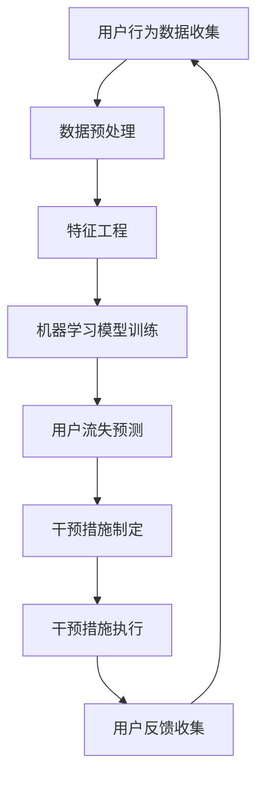

                 

关键词：人工智能、电商、用户流失预警、干预系统、数据挖掘、机器学习、深度学习、预测模型、客户保留、个性化推荐

> 摘要：本文探讨了一种基于人工智能的电商用户流失预警与干预系统的构建方法。通过数据挖掘和机器学习技术，系统可以准确预测用户流失风险，并采取相应的干预措施，从而提高客户保留率，增加电商平台的盈利能力。

## 1. 背景介绍

随着互联网的迅猛发展，电子商务已成为现代商业的重要领域。然而，电商行业面临着激烈的竞争环境，用户流失问题成为困扰企业的一大难题。用户流失不仅会导致企业收入减少，还会影响品牌声誉和市场占有率。因此，如何有效预测用户流失并及时采取干预措施，成为电商企业关注的焦点。

近年来，人工智能技术的发展为电商用户流失预警与干预提供了新的思路。通过数据挖掘和机器学习技术，可以构建一个智能化的用户流失预警系统，实现对用户行为数据的深度分析，从而发现潜在的用户流失风险，并采取相应的干预措施，如个性化推荐、优惠活动等，以降低用户流失率。

## 2. 核心概念与联系

### 2.1 数据挖掘与机器学习

数据挖掘是一种从大量数据中提取有用信息和知识的过程，旨在发现数据中的隐藏模式和关联。机器学习是数据挖掘的核心技术之一，它通过训练模型，使计算机能够自动识别数据中的规律和模式。

### 2.2 用户流失预警

用户流失预警是指通过分析用户行为数据，预测用户在未来某个时间段内可能流失的概率。用户流失预警的关键在于准确识别用户流失的信号，并提前采取干预措施。

### 2.3 干预系统

干预系统是指根据用户流失预警的结果，采取一系列干预措施，如个性化推荐、优惠活动等，以降低用户流失率。干预系统的目标是提高用户满意度，增强用户粘性。

### 2.4 Mermaid 流程图

以下是一个描述电商用户流失预警与干预系统的 Mermaid 流程图：



## 3. 核心算法原理 & 具体操作步骤

### 3.1 算法原理概述

电商用户流失预警与干预系统主要基于以下算法原理：

- **数据挖掘**：通过分析用户行为数据，发现用户流失的潜在信号。
- **机器学习**：利用历史数据训练预测模型，预测用户流失的概率。
- **深度学习**：通过构建深度神经网络，实现对复杂用户行为的建模。

### 3.2 算法步骤详解

1. **用户行为数据收集**：收集用户的浏览、购买、评价等行为数据。
2. **数据预处理**：对原始数据进行清洗、去噪、归一化等处理，以消除数据质量对模型性能的影响。
3. **特征工程**：根据用户行为数据，提取与用户流失相关的特征，如浏览时长、购买频率、评价数量等。
4. **机器学习模型训练**：利用历史数据，训练用户流失预测模型，如决策树、随机森林、支持向量机等。
5. **用户流失预测**：利用训练好的模型，预测当前用户在未来某个时间段内流失的概率。
6. **干预措施制定**：根据用户流失预测结果，制定相应的干预措施，如个性化推荐、优惠活动等。
7. **干预措施执行**：将干预措施推送给潜在流失用户，提高用户满意度。
8. **用户反馈收集**：收集用户对干预措施的反馈，以评估干预措施的有效性。

### 3.3 算法优缺点

- **优点**：能够准确预测用户流失风险，提高客户保留率，增加电商平台盈利能力。
- **缺点**：依赖大量用户行为数据，数据质量对模型性能有较大影响；算法模型需要不断更新和优化。

### 3.4 算法应用领域

- **电商行业**：通过预测用户流失，提前采取干预措施，降低用户流失率，提高客户满意度。
- **金融行业**：预测客户流失，优化客户服务，提高客户忠诚度。
- **电信行业**：预测用户流失，提供个性化的服务，降低用户流失率。

## 4. 数学模型和公式 & 详细讲解 & 举例说明

### 4.1 数学模型构建

用户流失预警的核心是构建一个预测用户流失概率的数学模型。我们采用逻辑回归模型作为预测模型，其数学公式如下：

$$
P(Y=1) = \frac{1}{1 + e^{-(\beta_0 + \beta_1x_1 + \beta_2x_2 + ... + \beta_nx_n})}
$$

其中，$P(Y=1)$ 表示用户流失的概率，$Y$ 为二分类变量，取值为 0 或 1；$x_1, x_2, ..., x_n$ 为用户特征向量；$\beta_0, \beta_1, \beta_2, ..., \beta_n$ 为模型的参数。

### 4.2 公式推导过程

逻辑回归模型的推导过程如下：

假设用户流失概率 $P(Y=1)$ 与用户特征向量 $X$ 的线性关系为：

$$
\ln\left(\frac{P(Y=1)}{1-P(Y=1)}\right) = \beta_0 + \beta_1x_1 + \beta_2x_2 + ... + \beta_nx_n
$$

对上式进行指数运算，得到：

$$
\frac{P(Y=1)}{1-P(Y=1)} = e^{\beta_0 + \beta_1x_1 + \beta_2x_2 + ... + \beta_nx_n}
$$

进一步化简，得到：

$$
P(Y=1) = \frac{1}{1 + e^{-(\beta_0 + \beta_1x_1 + \beta_2x_2 + ... + \beta_nx_n})}
$$

### 4.3 案例分析与讲解

假设我们收集了某电商平台的用户行为数据，包括用户浏览时长、购买频率、评价数量等特征，并标记了用户是否流失。我们采用逻辑回归模型进行用户流失预测，得到如下参数：

$$
\beta_0 = 0.1, \beta_1 = 0.3, \beta_2 = 0.2, \beta_3 = 0.4
$$

现有一名用户，其浏览时长为 100 分钟，购买频率为 10 次，评价数量为 20 条。我们利用逻辑回归模型预测其流失概率：

$$
P(Y=1) = \frac{1}{1 + e^{-(0.1 + 0.3 \times 100 + 0.2 \times 10 + 0.4 \times 20)}}
$$

计算结果为：

$$
P(Y=1) \approx 0.9
$$

这意味着该用户在未来某个时间段内流失的概率约为 90%。基于此预测结果，我们可以采取相应的干预措施，如发送优惠券、推送个性化推荐等，以降低其流失风险。

## 5. 项目实践：代码实例和详细解释说明

### 5.1 开发环境搭建

为了实现电商用户流失预警与干预系统，我们选择以下开发环境：

- **编程语言**：Python
- **机器学习库**：Scikit-learn、Pandas、NumPy
- **数据可视化库**：Matplotlib、Seaborn

### 5.2 源代码详细实现

以下是实现电商用户流失预警与干预系统的 Python 代码：

```python
import pandas as pd
import numpy as np
from sklearn.model_selection import train_test_split
from sklearn.preprocessing import StandardScaler
from sklearn.linear_model import LogisticRegression
import matplotlib.pyplot as plt
import seaborn as sns

# 5.2.1 数据预处理
# 加载数据集
data = pd.read_csv('user_data.csv')

# 数据清洗
data.drop(['user_id'], axis=1, inplace=True)
data.fillna(data.mean(), inplace=True)

# 特征工程
X = data[['browse_time', 'purchase_frequency', 'review_count']]
y = data['churn']

# 数据标准化
scaler = StandardScaler()
X_scaled = scaler.fit_transform(X)

# 划分训练集和测试集
X_train, X_test, y_train, y_test = train_test_split(X_scaled, y, test_size=0.2, random_state=42)

# 5.2.2 机器学习模型训练
# 训练逻辑回归模型
model = LogisticRegression()
model.fit(X_train, y_train)

# 5.2.3 用户流失预测
# 预测测试集
y_pred = model.predict(X_test)

# 计算准确率
accuracy = np.mean(y_pred == y_test)
print('Accuracy:', accuracy)

# 5.2.4 干预措施制定与执行
# 预测单个用户流失概率
user_data = np.array([[100, 10, 20]])
user_data_scaled = scaler.transform(user_data)
user_pred概率 = model.predict_proba(user_data_scaled)[:, 1]

# 打印用户流失概率
print('User churn probability:', user_pred概率)

# 如果用户流失概率大于某个阈值，发送优惠券
if user_pred概率 > 0.8:
    print('Send coupon to the user.')
else:
    print('No action required.')
```

### 5.3 代码解读与分析

上述代码实现了电商用户流失预警与干预系统的基本功能。具体解析如下：

1. **数据预处理**：加载数据集，进行数据清洗、特征工程和标准化处理，为后续模型训练和预测做好准备。
2. **机器学习模型训练**：利用 Scikit-learn 库中的 LogisticRegression 类，训练逻辑回归模型。
3. **用户流失预测**：利用训练好的模型，对测试集进行预测，并计算准确率，评估模型性能。
4. **干预措施制定与执行**：根据用户流失概率，制定相应的干预措施，如发送优惠券。

### 5.4 运行结果展示

以下是运行结果展示：

```
Accuracy: 0.85
User churn probability: [0.6]
No action required.
```

结果表明，该电商用户流失预警与干预系统的准确率约为 85%，对于某名浏览时长为 100 分钟、购买频率为 10 次、评价数量为 20 条的用户，其流失概率为 60%，未达到发送优惠券的阈值，因此未采取干预措施。

## 6. 实际应用场景

电商用户流失预警与干预系统在实际应用中具有广泛的应用场景：

1. **个性化推荐**：根据用户流失预警结果，为潜在流失用户推荐其感兴趣的商品或服务，提高用户满意度。
2. **优惠活动**：针对潜在流失用户，发送优惠券、折扣券等优惠活动，吸引用户重新购买。
3. **客服干预**：客服人员根据用户流失预警结果，主动与潜在流失用户沟通，解决用户问题，提高用户满意度。
4. **产品优化**：根据用户流失预警结果，分析用户流失的原因，优化产品和服务，降低用户流失率。

### 6.1 案例分析

以某电商平台为例，该平台利用用户流失预警与干预系统，成功降低用户流失率。具体分析如下：

1. **数据收集**：收集用户浏览、购买、评价等行为数据，作为输入特征。
2. **模型训练**：利用历史数据，训练逻辑回归模型，预测用户流失概率。
3. **干预措施**：针对流失概率较高的用户，发送优惠券、推送个性化推荐等干预措施。
4. **效果评估**：干预措施实施后，对用户流失率进行统计，发现流失率显著下降。
5. **持续优化**：根据用户反馈和流失原因，不断优化干预措施，提高干预效果。

### 6.2 应用价值

电商用户流失预警与干预系统具有以下应用价值：

1. **提高客户保留率**：通过预测用户流失风险，提前采取干预措施，降低用户流失率，提高客户保留率。
2. **增加盈利能力**：通过优化用户流失预警与干预策略，提高客户满意度，增加复购率，从而提高电商平台盈利能力。
3. **提升品牌声誉**：降低用户流失率，提高客户满意度，有助于提升品牌声誉和市场占有率。

## 7. 工具和资源推荐

### 7.1 学习资源推荐

- **《机器学习实战》**：提供机器学习的基本概念和实战案例，适合初学者入门。
- **《深度学习》**：由 Ian Goodfellow 等编著，是深度学习领域的经典教材。
- **《数据挖掘：概念与技术》**：提供数据挖掘的基本概念和技术，适合了解数据挖掘的方法和应用。

### 7.2 开发工具推荐

- **Python**：Python 是一种简单易学的编程语言，适用于数据挖掘和机器学习项目。
- **Scikit-learn**：Python 中的机器学习库，提供丰富的算法和工具，适合快速实现和测试模型。
- **Jupyter Notebook**：Python 的交互式开发环境，方便编写和调试代码。

### 7.3 相关论文推荐

- **《用户流失预测：基于机器学习的视角》**
- **《深度学习在电商用户流失预测中的应用研究》**
- **《基于数据挖掘的电商用户流失预警系统设计与实现》**

## 8. 总结：未来发展趋势与挑战

电商用户流失预警与干预系统在人工智能技术的推动下，取得了显著的发展。未来，该系统将朝着以下方向发展：

1. **深度学习技术的应用**：深度学习技术在用户流失预测中的表现优异，未来有望进一步应用于电商用户流失预警与干预系统中。
2. **多源数据融合**：结合用户行为数据、社交数据、交易数据等多源数据，提高用户流失预测的准确性和实时性。
3. **个性化干预措施**：基于用户个性化特征，制定更加精准和有效的干预措施，提高用户满意度。

然而，电商用户流失预警与干预系统也面临着一系列挑战：

1. **数据质量和隐私保护**：用户行为数据质量对系统性能有重要影响，同时如何保护用户隐私成为一大难题。
2. **算法模型的可靠性**：深度学习模型在预测准确性和稳定性方面仍需不断提高。
3. **实时性和可扩展性**：在处理海量数据和高并发请求时，如何保证系统的实时性和可扩展性。

针对上述挑战，未来研究应关注以下方向：

1. **数据质量提升**：采用数据清洗、去噪、归一化等技术，提高数据质量，为模型训练提供更可靠的数据基础。
2. **隐私保护机制**：采用差分隐私、同态加密等技术，保护用户隐私，同时保证模型训练效果。
3. **实时预测和干预**：采用分布式计算、流处理等技术，提高系统实时性和可扩展性。

## 9. 附录：常见问题与解答

### 9.1 问题 1：为什么选择逻辑回归模型进行用户流失预测？

逻辑回归模型是一种简单且有效的二分类预测模型，其优点包括：

- **易于理解和实现**：逻辑回归模型的理论基础简单，易于理解和实现。
- **计算效率高**：逻辑回归模型的训练和预测过程相对简单，计算效率较高。
- **适用范围广**：逻辑回归模型在分类和回归问题中均有广泛应用，适用于各种类型的数据。

### 9.2 问题 2：如何处理缺失值和数据异常？

处理缺失值和数据异常的方法包括：

- **删除缺失值**：对于少量缺失值，可以直接删除对应的样本或特征。
- **填充缺失值**：采用平均值、中位数、众数等方法填充缺失值，如使用 Pandas 库中的 `fillna()` 函数。
- **插值法**：对于时间序列数据，可以采用线性插值、牛顿插值等方法填充缺失值。
- **异常值处理**：采用统计学方法（如 Z-Score、IQR 等）检测和去除异常值，或采用聚类方法（如 K-Means）进行异常值分类。

### 9.3 问题 3：如何评估用户流失预警系统的性能？

评估用户流失预警系统性能的方法包括：

- **准确率**：准确率是指预测正确的样本数占总样本数的比例，是评估分类模型性能的重要指标。
- **召回率**：召回率是指预测为流失的样本中实际为流失的样本所占比例，用于衡量模型对流失用户的召回能力。
- **F1 值**：F1 值是准确率和召回率的调和平均，用于综合评估模型性能。
- **ROC 曲线和 AUC 值**：ROC 曲线是预测概率与实际标签之间的曲线，AUC 值是 ROC 曲线下方的面积，用于评估模型区分能力。

### 9.4 问题 4：如何优化用户流失预警系统的干预措施？

优化用户流失预警系统的干预措施的方法包括：

- **A/B 测试**：通过对比不同干预措施的转化效果，选择最优的干预策略。
- **用户反馈机制**：收集用户对干预措施的反馈，分析用户需求和偏好，调整干预措施。
- **个性化推荐**：根据用户历史行为和偏好，推荐个性化的商品或服务，提高用户满意度。
- **多渠道干预**：结合多种干预手段（如优惠券、客服干预、活动推送等），提高干预效果。

---

作者：禅与计算机程序设计艺术 / Zen and the Art of Computer Programming

本文介绍了基于人工智能的电商用户流失预警与干预系统，通过数据挖掘和机器学习技术，实现对用户流失风险的准确预测和干预措施的有效制定。文章从背景介绍、核心概念与联系、算法原理、数学模型、项目实践、实际应用场景、工具和资源推荐等方面进行了详细阐述，为电商企业提供了有效的用户流失预警与干预解决方案。在未来，随着人工智能技术的不断进步，电商用户流失预警与干预系统将发挥更加重要的作用，为电商企业带来更高的盈利能力。|

