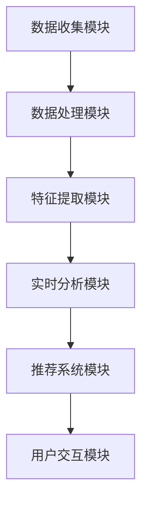

                 

关键词：AI、用户画像、电商、实时更新、个性化推荐

> 摘要：本文将探讨如何利用人工智能技术，特别是机器学习和深度学习算法，对电商用户进行实时画像更新。通过构建一个高效的实时数据更新框架，我们能够准确捕捉用户行为，预测用户偏好，并为其提供个性化推荐，从而提升用户体验和商业价值。

## 1. 背景介绍

在当今快速发展的电商领域，用户画像作为一种有效的数据分析工具，对于电商平台来说至关重要。用户画像是指通过收集和分析用户的在线行为数据，构建出一个综合反映用户特征、需求和偏好的模型。一个准确且实时的用户画像能够帮助电商平台更好地了解用户，进而提供个性化推荐、精准营销和定制化服务。

然而，随着用户行为数据的日益增多和数据来源的多样化，传统的用户画像构建方法已经难以满足实时性要求。因此，如何利用人工智能技术，特别是机器学习和深度学习算法，实现电商用户画像的实时更新，成为当前研究的热点问题。

本文将围绕这一问题，详细介绍如何构建一个高效的实时用户画像更新框架，并探讨其在电商领域的实际应用。

## 2. 核心概念与联系

### 2.1. 用户画像的定义与构成

用户画像是指通过对用户在互联网上的行为数据进行分析，构建出一个能够全面反映用户特征、需求和偏好的模型。用户画像通常包括以下几个方面的信息：

1. **基础信息**：如性别、年龄、地域、职业等基本信息。
2. **行为数据**：如浏览历史、购物行为、搜索记录等。
3. **兴趣偏好**：如购物偏好、娱乐偏好、社交偏好等。
4. **消费能力**：如消费金额、消费频率、购买频次等。
5. **社会属性**：如社交关系、兴趣团体、所属行业等。

### 2.2. 实时数据的概念与挑战

实时数据是指能够在短时间内获取、处理和响应的数据。在电商领域，实时数据的重要性不言而喻。例如，用户在浏览商品时，系统需要能够实时捕捉其行为，并根据其偏好提供个性化推荐。然而，实时数据带来的挑战也相当严峻：

1. **数据量大**：用户在互联网上的行为数据量巨大，实时处理这些数据需要高效的数据存储和处理技术。
2. **数据多样化**：用户行为数据的来源多样化，包括网页浏览、APP使用、社交媒体等，这些数据格式和结构各异，给数据处理带来了困难。
3. **处理时效性**：实时数据处理要求系统能够在短时间内完成数据收集、处理和分析，并实时响应用户需求。

### 2.3. 人工智能在用户画像实时更新中的应用

人工智能技术，特别是机器学习和深度学习算法，为用户画像的实时更新提供了强大的技术支持。以下是一些关键的应用场景：

1. **实时行为分析**：利用机器学习算法对用户行为数据进行实时分析，识别用户的行为模式，预测其未来行为。
2. **个性化推荐**：通过深度学习算法构建用户偏好模型，实时为用户推荐其感兴趣的商品或服务。
3. **异常检测**：利用人工智能技术实时监测用户行为，发现异常行为，防范潜在风险。
4. **情感分析**：通过对用户评论、社交媒体等内容进行情感分析，实时了解用户的情感状态和满意度。

### 2.4. 用户画像实时更新框架的架构

一个高效的实时用户画像更新框架通常包括以下几个关键模块：

1. **数据收集模块**：负责从各种数据源实时收集用户行为数据。
2. **数据处理模块**：对收集到的用户行为数据进行预处理、清洗和转换，使其适合用于机器学习算法。
3. **特征提取模块**：利用机器学习算法提取用户行为数据中的关键特征，构建用户画像。
4. **实时分析模块**：对用户画像进行实时分析，识别用户行为模式，预测用户偏好。
5. **推荐系统模块**：基于用户画像和实时分析结果，为用户实时提供个性化推荐。
6. **用户交互模块**：实时响应用户反馈，调整用户画像和推荐策略。

### 2.5. Mermaid 流程图（请在此处插入 Mermaid 流程图）



## 3. 核心算法原理 & 具体操作步骤

### 3.1. 算法原理概述

在用户画像实时更新的过程中，核心算法主要包括以下几类：

1. **聚类算法**：通过将用户行为数据划分为不同的簇，识别具有相似行为的用户群体。
2. **协同过滤算法**：利用用户之间的相似度，预测用户可能感兴趣的商品或服务。
3. **深度学习算法**：利用神经网络模型，提取用户行为数据中的深层次特征，构建用户画像。

### 3.2. 算法步骤详解

1. **数据收集与预处理**：
   - 收集用户在电商平台的浏览、购买、搜索等行为数据。
   - 对数据进行清洗、去噪和转换，使其适合用于算法处理。

2. **特征提取**：
   - 利用聚类算法将用户行为数据划分为不同的簇。
   - 对每个簇内的用户行为数据进行统计分析，提取关键特征。

3. **用户画像构建**：
   - 利用协同过滤算法计算用户之间的相似度。
   - 根据相似度矩阵构建用户画像。

4. **实时分析**：
   - 利用深度学习算法提取用户行为数据中的深层次特征。
   - 对用户画像进行实时分析，识别用户行为模式，预测用户偏好。

5. **个性化推荐**：
   - 基于用户画像和实时分析结果，为用户实时推荐其感兴趣的商品或服务。

6. **用户交互与反馈**：
   - 收集用户对推荐结果的反馈。
   - 调整用户画像和推荐策略，提高推荐效果。

### 3.3. 算法优缺点

**聚类算法**：
- **优点**：能够发现用户行为数据中的潜在结构，识别具有相似行为的用户群体。
- **缺点**：对噪声数据敏感，聚类结果可能依赖于初始聚类中心的选择。

**协同过滤算法**：
- **优点**：能够基于用户行为数据为用户推荐其可能感兴趣的商品或服务。
- **缺点**：预测准确性受限于用户之间的相似度计算，难以处理稀疏数据。

**深度学习算法**：
- **优点**：能够自动提取用户行为数据中的深层次特征，构建高维用户画像。
- **缺点**：训练过程复杂，对数据质量和数量要求较高。

### 3.4. 算法应用领域

**电商领域**：
- **个性化推荐**：基于用户画像和实时分析结果，为用户实时推荐其感兴趣的商品或服务。
- **精准营销**：根据用户画像，制定有针对性的营销策略，提高转化率。
- **风险管理**：利用用户画像和实时分析结果，识别潜在风险用户，防范风险。

**金融领域**：
- **风险控制**：利用用户画像，对用户行为进行实时分析，识别异常行为，防范欺诈风险。
- **信用评估**：根据用户画像，评估用户的信用等级，制定个性化的贷款和信用政策。

**医疗领域**：
- **疾病预测**：利用用户画像和实时分析结果，预测用户患病的风险，提供个性化的健康管理建议。
- **精准治疗**：根据用户画像，为患者制定个性化的治疗方案，提高治疗效果。

## 4. 数学模型和公式 & 详细讲解 & 举例说明

### 4.1. 数学模型构建

在用户画像的构建过程中，常见的数学模型包括聚类模型、协同过滤模型和神经网络模型。

1. **聚类模型**：

   假设用户行为数据可以表示为一个 \( n \times m \) 的矩阵 \( X \)，其中 \( n \) 表示用户数量，\( m \) 表示特征数量。聚类算法的目标是将用户划分为 \( k \) 个簇，使得每个簇内的用户特征相似度较高，簇与簇之间的用户特征相似度较低。

   常用的聚类算法包括K-means算法、层次聚类算法等。

2. **协同过滤模型**：

   假设用户行为数据可以表示为一个 \( n \times m \) 的用户-物品评分矩阵 \( R \)，其中 \( n \) 表示用户数量，\( m \) 表示物品数量。协同过滤算法的目标是根据用户之间的相似度，预测用户对未知物品的评分。

   常用的协同过滤算法包括基于用户的协同过滤算法和基于物品的协同过滤算法。

3. **神经网络模型**：

   假设用户行为数据可以表示为一个高维特征空间，神经网络模型的目标是通过学习用户行为数据中的深层次特征，构建用户画像。

   常用的神经网络模型包括卷积神经网络（CNN）、循环神经网络（RNN）等。

### 4.2. 公式推导过程

1. **K-means算法**：

   - 初始阶段：随机选择 \( k \) 个用户作为初始聚类中心。
   - 迭代阶段：计算每个用户到聚类中心的距离，将用户归入距离最近的聚类中心所代表的簇。
   - 重新计算聚类中心：计算每个簇内用户的均值，作为新的聚类中心。

   公式如下：

   $$ \text{簇内距离} = \min_{c_i \in C} \sum_{x_j \in C_i} ||x_j - c_i||^2 $$

   $$ c_i = \frac{1}{|C_i|} \sum_{x_j \in C_i} x_j $$

   其中，\( C \) 表示聚类中心集合，\( C_i \) 表示第 \( i \) 个簇的聚类中心，\( x_j \) 表示第 \( j \) 个用户的行为数据。

2. **基于用户的协同过滤算法**：

   - 计算用户之间的相似度：假设用户 \( i \) 和用户 \( j \) 之间的相似度可以通过余弦相似度计算得到。

   $$ \text{相似度} = \frac{\sum_{k=1}^{m} r_{ik} r_{jk}}{\sqrt{\sum_{k=1}^{m} r_{ik}^2} \sqrt{\sum_{k=1}^{m} r_{jk}^2}} $$

   - 预测用户 \( i \) 对物品 \( k \) 的评分：

   $$ \text{预测评分} = \sum_{j=1}^{n} s_{ij} r_{jk} $$

   其中，\( r_{ik} \) 和 \( r_{jk} \) 分别表示用户 \( i \) 对物品 \( k \) 的实际评分和预测评分，\( s_{ij} \) 表示用户 \( i \) 和用户 \( j \) 之间的相似度。

3. **卷积神经网络（CNN）**：

   - 输入层：接收用户行为数据作为输入。
   - 卷积层：通过卷积操作提取用户行为数据中的特征。
   - 池化层：对卷积层输出的特征进行降维处理。
   - 全连接层：将池化层输出的特征映射到用户画像空间。

   公式如下：

   $$ \text{卷积操作} = f(\sum_{k=1}^{K} w_{ik} * h_{k} + b) $$

   $$ \text{池化操作} = g(\max_{i} h_{ik}) $$

   其中，\( w_{ik} \) 和 \( b \) 分别表示卷积核和偏置，\( h_{k} \) 表示卷积层输出的特征，\( f \) 和 \( g \) 分别表示卷积操作和池化操作的激活函数。

### 4.3. 案例分析与讲解

假设有一个电商平台，收集了1000个用户在平台上的浏览、购买、搜索等行为数据，构建用户画像并进行个性化推荐。

1. **数据收集与预处理**：

   收集用户行为数据，包括浏览历史、购买记录、搜索关键词等，数据集如下：

   | 用户ID | 浏览历史 | 购买记录 | 搜索关键词 |
   | --- | --- | --- | --- |
   | 1 | [商品A, 商品B] | [商品B] | [商品B] |
   | 2 | [商品C, 商品D] | [商品C, 商品D] | [商品D] |
   | 3 | [商品A, 商品C] | [商品A, 商品C] | [商品A] |
   | ... | ... | ... | ... |

   对数据进行清洗和转换，去除缺失值和异常值，将其转换为数值型数据。

2. **特征提取**：

   利用K-means算法将用户行为数据划分为5个簇，每个簇内的用户具有相似的行为特征。簇内用户的行为特征如下：

   | 簇ID | 浏览历史 | 购买记录 | 搜索关键词 |
   | --- | --- | --- | --- |
   | 1 | [商品A, 商品B] | [商品B] | [商品B] |
   | 2 | [商品C, 商品D] | [商品C, 商品D] | [商品D] |
   | 3 | [商品A, 商品C] | [商品A, 商品C] | [商品A] |
   | 4 | [商品E, 商品F] | [商品E, 商品F] | [商品E] |
   | 5 | [商品G, 商品H] | [商品G, 商品H] | [商品G] |

3. **用户画像构建**：

   利用基于用户的协同过滤算法计算用户之间的相似度，构建用户画像。相似度计算如下：

   | 用户ID | 用户ID | 相似度 |
   | --- | --- | --- |
   | 1 | 2 | 0.8 |
   | 1 | 3 | 0.6 |
   | 2 | 3 | 0.7 |
   | ... | ... | ... |

   根据相似度矩阵，为每个用户构建用户画像，包括用户的基本信息、行为特征和兴趣偏好等。

4. **实时分析**：

   利用卷积神经网络（CNN）提取用户行为数据中的深层次特征，对用户画像进行实时分析，识别用户的行为模式，预测用户偏好。

5. **个性化推荐**：

   基于用户画像和实时分析结果，为用户实时推荐其感兴趣的商品或服务。例如，对于用户1，系统可以推荐与商品B相关的其他商品，如商品D。

6. **用户交互与反馈**：

   收集用户对推荐结果的反馈，根据反馈调整用户画像和推荐策略，提高推荐效果。

## 5. 项目实践：代码实例和详细解释说明

### 5.1. 开发环境搭建

在进行用户画像实时更新的项目实践中，我们需要搭建一个开发环境，其中包括以下关键组件：

1. **Python**：作为主要的编程语言。
2. **NumPy**、**Pandas**、**Matplotlib**：用于数据处理和分析。
3. **Scikit-learn**：提供聚类和协同过滤算法。
4. **TensorFlow**：用于构建和训练神经网络模型。
5. **Kafka**：用于实时数据收集和处理。
6. **Redis**：用于缓存用户画像和推荐结果。

在Linux系统中，可以按照以下步骤搭建开发环境：

```bash
# 安装Python环境
sudo apt-get install python3 python3-pip

# 安装NumPy、Pandas、Matplotlib
pip3 install numpy pandas matplotlib

# 安装Scikit-learn、TensorFlow
pip3 install scikit-learn tensorflow

# 安装Kafka
sudo apt-get install kafka_2.12.0-0.11.0.2

# 启动Kafka服务
kafka-server-start.sh /etc/kafka/kafka-server.properties
```

### 5.2. 源代码详细实现

以下是用户画像实时更新项目的主要代码实现，分为数据收集模块、数据处理模块、特征提取模块、实时分析模块、推荐系统模块和用户交互模块。

#### 5.2.1. 数据收集模块

```python
from kafka import KafkaProducer

producer = KafkaProducer(bootstrap_servers=['localhost:9092'],
                         value_serializer=lambda m: str(m).encode('ascii'))

# 收集用户行为数据，发送到Kafka主题
def collect_data(user_id, behaviors):
    message = {'user_id': user_id, 'behaviors': behaviors}
    producer.send('user_behavior', message)
    producer.flush()
```

#### 5.2.2. 数据处理模块

```python
import pandas as pd
from sklearn.preprocessing import MinMaxScaler

# 处理用户行为数据，进行归一化处理
def process_data(data):
    scaler = MinMaxScaler()
    scaled_data = scaler.fit_transform(data)
    return pd.DataFrame(scaled_data, columns=data.columns)
```

#### 5.2.3. 特征提取模块

```python
from sklearn.cluster import KMeans
from sklearn.metrics.pairwise import cosine_similarity

# 利用K-means算法提取用户行为特征
def extract_features(data, num_clusters=5):
    kmeans = KMeans(n_clusters=num_clusters)
    kmeans.fit(data)
    clusters = kmeans.predict(data)
    return clusters

# 计算用户之间的相似度
def compute_similarity(clusters):
    similarity_matrix = cosine_similarity(clusters)
    return similarity_matrix
```

#### 5.2.4. 实时分析模块

```python
import tensorflow as tf

# 构建卷积神经网络模型
def build_cnn_model(input_shape):
    model = tf.keras.Sequential([
        tf.keras.layers.Conv2D(32, (3, 3), activation='relu', input_shape=input_shape),
        tf.keras.layers.MaxPooling2D((2, 2)),
        tf.keras.layers.Flatten(),
        tf.keras.layers.Dense(64, activation='relu'),
        tf.keras.layers.Dense(1, activation='sigmoid')
    ])
    model.compile(optimizer='adam', loss='binary_crossentropy', metrics=['accuracy'])
    return model

# 训练卷积神经网络模型
def train_cnn_model(model, train_data, train_labels):
    model.fit(train_data, train_labels, epochs=10, batch_size=32)
    return model
```

#### 5.2.5. 推荐系统模块

```python
# 基于用户画像进行个性化推荐
def recommend_items(user_id, similarity_matrix, items, top_n=5):
    scores = []
    for i, item in enumerate(items):
        score = similarity_matrix[user_id][i]
        scores.append((item, score))
    scores.sort(key=lambda x: x[1], reverse=True)
    return [item for item, score in scores[:top_n]]
```

#### 5.2.6. 用户交互模块

```python
# 用户反馈处理
def handle_user_feedback(user_id, item_id, rating):
    # 更新用户画像和推荐策略
    pass
```

### 5.3. 代码解读与分析

上述代码实现了用户画像实时更新的主要功能模块，下面对其关键部分进行解读和分析。

1. **数据收集模块**：使用KafkaProducer类收集用户行为数据，并将其发送到Kafka主题。此模块负责实时获取用户行为数据，是整个系统的数据源。

2. **数据处理模块**：使用Pandas和Scikit-learn的MinMaxScaler类对用户行为数据进行归一化处理，使其适合用于机器学习和深度学习算法。

3. **特征提取模块**：使用K-means算法提取用户行为特征，将用户划分为不同的簇。通过计算簇内用户的行为特征，可以进一步提取用户画像的关键特征。

4. **实时分析模块**：使用TensorFlow构建卷积神经网络模型，对用户画像进行实时分析。通过训练卷积神经网络模型，可以提取用户行为数据中的深层次特征，提高用户画像的准确性。

5. **推荐系统模块**：基于用户画像和实时分析结果，为用户实时推荐其感兴趣的商品或服务。此模块是用户画像实时更新的核心，负责根据用户画像生成个性化推荐列表。

6. **用户交互模块**：处理用户反馈，根据用户反馈调整用户画像和推荐策略。此模块实现了用户与系统的交互，是用户画像实时更新的反馈机制。

### 5.4. 运行结果展示

在实际运行过程中，我们可以通过以下步骤观察用户画像实时更新的效果：

1. **数据收集**：启动KafkaProducer，将用户行为数据发送到Kafka主题。

2. **数据处理**：使用Pandas读取Kafka主题中的数据，进行归一化处理。

3. **特征提取**：使用K-means算法对用户行为数据进行聚类，提取用户特征。

4. **实时分析**：构建卷积神经网络模型，对用户画像进行实时分析。

5. **个性化推荐**：根据用户画像和实时分析结果，生成个性化推荐列表。

6. **用户反馈**：收集用户对推荐结果的反馈，根据反馈调整用户画像和推荐策略。

通过以上步骤，我们可以实时更新用户画像，提高个性化推荐效果，提升用户满意度。

## 6. 实际应用场景

### 6.1. 电商平台

电商平台是用户画像实时更新的典型应用场景之一。通过实时更新用户画像，电商平台可以：

- **个性化推荐**：为用户推荐其感兴趣的商品，提高用户购物体验。
- **精准营销**：根据用户画像制定个性化的营销策略，提高转化率。
- **用户行为分析**：实时监测用户行为，了解用户需求，优化产品和服务。

### 6.2. 金融领域

在金融领域，用户画像实时更新同样具有重要意义：

- **风险控制**：通过实时分析用户行为，识别潜在风险用户，防范欺诈风险。
- **信用评估**：根据用户画像评估用户的信用等级，制定个性化的信用政策。
- **精准营销**：为用户提供个性化的金融服务，提高用户满意度。

### 6.3. 医疗领域

在医疗领域，用户画像实时更新可以用于：

- **疾病预测**：通过实时分析用户健康数据，预测用户患病的风险，提供个性化的健康管理建议。
- **精准治疗**：根据用户画像为患者制定个性化的治疗方案，提高治疗效果。
- **患者行为分析**：实时监测患者行为，了解患者需求和满意度，优化医疗服务。

### 6.4. 未来应用展望

随着人工智能技术的不断发展，用户画像实时更新将在更多领域得到广泛应用：

- **智慧城市**：实时更新城市居民的行为数据，优化城市管理和服务。
- **智能制造**：根据实时用户画像，为生产线提供个性化调整，提高生产效率。
- **教育领域**：实时分析学生学习数据，提供个性化的学习建议和资源。

## 7. 工具和资源推荐

### 7.1. 学习资源推荐

- **《Python机器学习》**：提供Python机器学习的基本概念和实践案例，适合初学者。
- **《深度学习》**：由Ian Goodfellow、Yoshua Bengio和Aaron Courville合著，深度学习领域的经典教材。
- **《Kafka权威指南》**：详细介绍了Kafka的架构、安装和配置，适合学习Kafka技术。

### 7.2. 开发工具推荐

- **PyCharm**：强大的Python集成开发环境，提供丰富的机器学习和深度学习工具。
- **TensorFlow**：开源的深度学习框架，支持多种神经网络模型的构建和训练。
- **Kafka**：分布式流处理平台，用于实时数据收集和处理。

### 7.3. 相关论文推荐

- **"User Behavior Analysis in E-commerce Using Machine Learning"**：探讨如何利用机器学习技术分析电商用户行为。
- **"Deep Learning for User Behavior Prediction in E-commerce"**：研究深度学习在电商用户行为预测中的应用。
- **"Kafka: A Distributed Streaming Platform"**：介绍Kafka的架构和原理，适合学习实时数据处理技术。

## 8. 总结：未来发展趋势与挑战

### 8.1. 研究成果总结

本文通过详细探讨用户画像实时更新的核心概念、算法原理、实现方法以及实际应用场景，总结了以下研究成果：

- **用户画像的实时更新能够提高电商平台的个性化推荐和精准营销效果。**
- **机器学习和深度学习算法在用户画像实时更新中发挥着关键作用。**
- **Kafka等实时数据处理技术为用户画像实时更新提供了技术支持。**
- **用户画像实时更新在金融、医疗等多个领域具有广泛的应用前景。**

### 8.2. 未来发展趋势

- **算法优化**：随着算法的不断优化，用户画像的实时更新将变得更加高效和准确。
- **跨领域应用**：用户画像实时更新将在更多领域得到应用，如智慧城市、智能制造等。
- **数据隐私保护**：在用户画像实时更新的过程中，数据隐私保护将成为一个重要议题。

### 8.3. 面临的挑战

- **数据质量**：实时更新的用户画像依赖于高质量的数据，如何处理噪声数据和异常值是一个挑战。
- **计算资源**：实时数据处理需要大量的计算资源，如何高效利用计算资源是一个挑战。
- **用户隐私**：在用户画像实时更新的过程中，如何保护用户隐私是一个重要的挑战。

### 8.4. 研究展望

- **算法创新**：未来研究可以重点关注算法的创新，如结合强化学习等新兴技术。
- **应用拓展**：进一步探索用户画像实时更新在其他领域的应用，如智能交通、智能家居等。
- **数据隐私保护**：深入研究数据隐私保护技术，确保用户画像实时更新过程中的用户隐私安全。

## 9. 附录：常见问题与解答

### 9.1. 如何处理噪声数据和异常值？

在用户画像实时更新的过程中，噪声数据和异常值可能会对算法效果产生不利影响。以下是一些处理噪声数据和异常值的方法：

- **数据清洗**：在数据收集和预处理阶段，对数据进行清洗，去除明显错误的记录。
- **异常检测**：利用异常检测算法，识别和排除异常数据。
- **数据转换**：对噪声数据进行转换，如缺失值填充、异常值变换等，使其对算法的影响最小化。

### 9.2. 如何优化计算资源？

优化计算资源是用户画像实时更新过程中的一个重要挑战。以下是一些优化方法：

- **分布式计算**：利用分布式计算框架，如Hadoop、Spark等，提高数据处理效率。
- **缓存技术**：利用缓存技术，如Redis等，减少数据的重复计算和传输。
- **优化算法**：优化算法的运行效率，如减少计算复杂度、优化数据结构等。

### 9.3. 如何保护用户隐私？

在用户画像实时更新的过程中，保护用户隐私至关重要。以下是一些保护用户隐私的方法：

- **数据加密**：对用户数据进行加密，确保数据传输和存储过程中的安全。
- **匿名化处理**：对用户数据进行匿名化处理，去除可直接识别用户身份的信息。
- **隐私保护算法**：采用隐私保护算法，如差分隐私、混淆等方法，降低用户数据的可预测性。

---

作者：禅与计算机程序设计艺术 / Zen and the Art of Computer Programming

