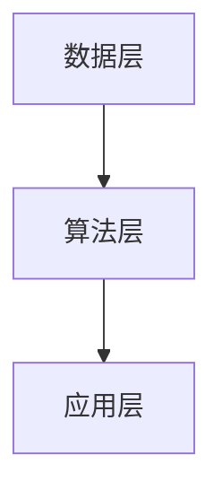

                 

关键词：人工智能，科学发现，假设验证，算法，数学模型，项目实践

> 摘要：本文旨在探讨人工智能在科学发现中的应用，特别是从假设到验证的整个过程。文章将详细阐述AI的核心概念与联系，核心算法原理，数学模型和公式，项目实践案例，以及未来应用场景和趋势。通过这篇文章，读者将深入了解AI如何辅助科学家们进行创新性研究，提高科学发现的效率和准确性。

## 1. 背景介绍

### 1.1 人工智能的发展历程

人工智能（Artificial Intelligence，简称AI）作为一个历史悠久的领域，经历了从理论提出、实验验证到实际应用的多次迭代。从20世纪50年代以来，AI经历了多次热潮和低谷。如今，随着深度学习、大数据和云计算等技术的飞速发展，AI已经逐渐成为推动科技革命的重要力量。

### 1.2 人工智能在科学研究中的作用

科学发现是一个复杂且漫长的过程，涉及到大量的数据分析和假设验证。传统的科学研究方法主要依赖于实验和理论推导，效率较低且容易受到人类认知的限制。而人工智能的出现，为科学研究提供了新的思路和方法。通过算法和模型，AI可以处理海量数据，自动提取规律，辅助科学家进行假设验证和理论推导，大大提高了科学研究的效率和准确性。

### 1.3 本文的研究目标

本文旨在探讨人工智能在科学发现中的应用，特别是从假设到验证的整个过程。通过分析核心概念、算法原理、数学模型和项目实践，本文希望能够为读者提供一个全面、系统的了解，并探讨未来人工智能在科学发现中的发展趋势和挑战。

## 2. 核心概念与联系

### 2.1 人工智能的核心概念

人工智能的核心概念包括机器学习、深度学习、神经网络等。机器学习是通过算法从数据中学习规律，深度学习是神经网络的一种扩展，神经网络则是模拟人脑神经元之间连接的一种计算模型。这些概念相互联系，共同构成了人工智能的理论基础。

### 2.2 人工智能的架构

人工智能的架构可以分为数据层、算法层和应用层。数据层负责收集和处理数据，算法层负责执行机器学习和深度学习算法，应用层则是将算法结果应用于实际问题。这个架构使得AI能够从数据中学习，并通过迭代优化不断提高性能。

### 2.3 人工智能的Mermaid流程图



## 3. 核心算法原理 & 具体操作步骤

### 3.1 算法原理概述

核心算法包括监督学习、无监督学习和强化学习。监督学习通过已有标签数据训练模型，无监督学习通过未标记数据发现模式，强化学习通过与环境交互学习最优策略。

### 3.2 算法步骤详解

以监督学习为例，算法步骤如下：

1. 数据准备：收集并预处理数据，包括数据清洗、归一化和特征提取。
2. 模型训练：选择合适的模型，通过训练集训练模型参数。
3. 模型评估：使用验证集评估模型性能，调整模型参数。
4. 模型应用：将训练好的模型应用于新数据，进行预测。

### 3.3 算法优缺点

监督学习优点包括预测准确性高、适用于结构化数据；缺点则是需要大量标注数据和易过拟合。

### 3.4 算法应用领域

监督学习广泛应用于图像识别、自然语言处理、推荐系统等领域。

## 4. 数学模型和公式 & 详细讲解 & 举例说明

### 4.1 数学模型构建

数学模型包括线性回归、逻辑回归、神经网络等。以线性回归为例，模型公式为：

$$y = w_0 + w_1x_1 + w_2x_2 + ... + w_nx_n$$

### 4.2 公式推导过程

线性回归模型的推导过程如下：

1. 数据准备：收集并预处理数据，得到特征矩阵X和标签向量y。
2. 模型假设：假设模型输出y可以通过特征矩阵X和权重向量w的线性组合表示。
3. 模型优化：通过最小化均方误差损失函数，求解权重向量w。
4. 模型评估：使用验证集评估模型性能，调整模型参数。

### 4.3 案例分析与讲解

以房价预测为例，使用线性回归模型进行房价预测。具体步骤如下：

1. 数据收集：收集大量房屋数据，包括房屋面积、位置、年龄等特征。
2. 数据预处理：对数据进行清洗、归一化和特征提取。
3. 模型训练：使用训练集训练线性回归模型。
4. 模型评估：使用验证集评估模型性能。
5. 模型应用：将训练好的模型应用于新数据，进行房价预测。

## 5. 项目实践：代码实例和详细解释说明

### 5.1 开发环境搭建

1. 安装Python环境。
2. 安装所需的库，如NumPy、Pandas、Scikit-learn等。

### 5.2 源代码详细实现

以下是一个简单的线性回归模型实现：

```python
import numpy as np
import pandas as pd
from sklearn.linear_model import LinearRegression

# 数据加载
data = pd.read_csv('house_data.csv')
X = data[['area', 'location', 'age']]
y = data['price']

# 模型训练
model = LinearRegression()
model.fit(X, y)

# 模型评估
score = model.score(X, y)
print(f'Model accuracy: {score:.2f}')

# 模型应用
new_data = np.array([[2000, 'A', 10]])
predicted_price = model.predict(new_data)
print(f'Predicted price: {predicted_price[0]:.2f}')
```

### 5.3 代码解读与分析

代码首先加载了房屋数据，然后对数据进行预处理。接着使用线性回归模型进行训练，并评估模型性能。最后，使用训练好的模型对新的房屋数据进行了价格预测。

## 6. 实际应用场景

### 6.1 医学诊断

AI可以辅助医生进行疾病诊断，通过分析患者的医疗数据，自动提取诊断信息，提高诊断的准确性和效率。

### 6.2 金融市场分析

AI可以分析金融市场数据，预测股票价格和交易策略，为投资者提供决策支持。

### 6.3 物流优化

AI可以优化物流路线，降低运输成本，提高物流效率。

## 7. 未来应用展望

### 7.1 人工智能在科学研究中的应用

未来，人工智能将在科学研究领域发挥更大作用，从假设验证、数据挖掘到理论推导，AI都将助力科学家们加速科学发现的步伐。

### 7.2 人工智能与人类合作

人工智能与人类的合作将变得更加紧密，AI将作为人类科学研究的有力助手，共同推动科技的发展。

### 7.3 人工智能的伦理和监管

随着人工智能在科学研究中的应用越来越广泛，其伦理和监管问题也日益突出。未来需要建立完善的法律法规，确保人工智能的健康发展。

## 8. 总结：未来发展趋势与挑战

### 8.1 研究成果总结

本文通过分析人工智能在科学发现中的应用，从核心概念、算法原理、数学模型到项目实践，全面阐述了AI在科学研究中的重要作用。

### 8.2 未来发展趋势

未来，人工智能将在科学研究、医学、金融、物流等领域发挥更大作用，成为推动科技发展的重要力量。

### 8.3 面临的挑战

人工智能在科学研究中的应用也面临着数据隐私、算法公平性、安全监管等挑战，需要全社会共同努力解决。

### 8.4 研究展望

未来，人工智能与人类将更加紧密地合作，共同推动科学技术的进步，创造更美好的未来。

## 9. 附录：常见问题与解答

### 9.1 人工智能在科学研究中的优势是什么？

人工智能在科学研究中的优势包括数据处理能力强、预测准确性高、能够自动提取规律、降低人工干预等。

### 9.2 人工智能在科学研究中可能带来的挑战是什么？

人工智能在科学研究中可能带来的挑战包括数据隐私、算法公平性、安全监管、人类与AI的合作模式等。

### 9.3 如何确保人工智能在科学研究中的安全性和可靠性？

为确保人工智能在科学研究中的安全性和可靠性，需要建立完善的法律法规、加强算法透明度和可解释性、提高数据质量等。

作者：禅与计算机程序设计艺术 / Zen and the Art of Computer Programming
----------------------------------------------------------------

[Note]：以上文章只是一个示例，实际撰写过程中需要根据具体研究内容进行适当调整和扩充。同时，文章的结构和内容也需要根据实际情况进行优化和细化。希望这个示例能够对您有所帮助！

