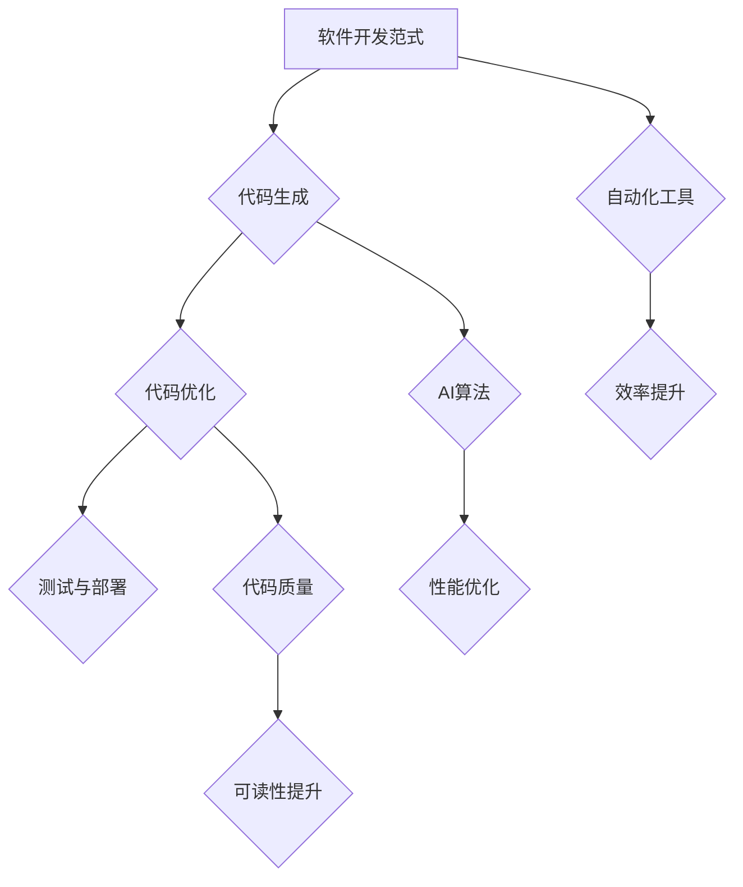

                 

关键词：人工智能，辅助编程，软件1.0，软件2.0，代码生成，代码优化，编程范式，自动化工具，程序设计

> 摘要：本文探讨了人工智能在辅助编程领域的应用，分析了软件1.0和软件2.0的融合趋势，并介绍了相关核心算法原理、数学模型、项目实践案例以及未来应用展望。通过详细阐述AI辅助编程的各个方面，本文旨在为开发者提供一种全新的编程体验，并推动软件开发领域的进步。

## 1. 背景介绍

### 1.1 软件发展历程

软件的发展经历了从软件1.0到软件2.0的演变。软件1.0时代，软件开发主要是基于命令行界面，开发者需要手动编写大量代码，这个过程繁琐且容易出错。随着计算机技术的发展，软件2.0时代到来，图形用户界面(GUI)的出现使得软件开发变得更加直观和便捷。然而，尽管软件开发的效率有所提高，但传统的编程方法仍然存在诸多问题，如代码冗长、维护困难等。

### 1.2 人工智能的崛起

近年来，人工智能技术的快速发展给各个领域带来了深刻变革，其中也包括软件开发。人工智能通过自动化和智能化的方式，极大地提高了代码生成的效率和质量。同时，人工智能还能帮助开发者进行代码优化、调试和测试，从而进一步提升软件开发的整体效率。

### 1.3 AI辅助编程的兴起

AI辅助编程是指利用人工智能技术辅助开发者进行编程的过程。AI辅助编程可以大幅降低开发者的工作负担，提高代码质量和开发效率。随着AI技术的不断进步，AI辅助编程已经成为软件开发领域的一个重要趋势。

## 2. 核心概念与联系

### 2.1 软件开发范式

在AI辅助编程中，理解软件开发范式非常重要。软件开发范式包括面向对象编程、函数式编程、逻辑编程等。这些范式决定了代码的组织结构和编写方式。

### 2.2 代码生成与优化

代码生成和优化是AI辅助编程的核心功能之一。代码生成是指利用人工智能算法自动生成代码，而代码优化是指对现有代码进行优化，以提高其性能和可读性。

### 2.3 自动化工具

自动化工具在AI辅助编程中发挥着重要作用。这些工具可以自动执行代码生成、代码优化、测试和部署等任务，从而提高开发效率。

### 2.4 Mermaid 流程图

以下是一个Mermaid流程图，用于展示AI辅助编程的核心概念和联系：



## 3. 核心算法原理 & 具体操作步骤

### 3.1 算法原理概述

AI辅助编程的核心算法主要包括生成对抗网络(GAN)、深度强化学习(DRL)和迁移学习等。这些算法通过学习大量的编程数据，能够自动生成代码并进行优化。

### 3.2 算法步骤详解

1. 数据收集与预处理：收集大量编程数据，包括代码、文档和注释等，并进行预处理，如去噪、归一化等。

2. 算法训练：利用生成对抗网络(GAN)等算法对编程数据进行训练，使其学会生成代码。

3. 代码生成：根据用户需求，利用训练好的算法自动生成代码。

4. 代码优化：对生成的代码进行优化，以提高性能和可读性。

5. 测试与部署：对优化后的代码进行测试，确保其功能正确无误，然后进行部署。

### 3.3 算法优缺点

- **优点**：能够大幅提高代码生成的效率和质量，减少人工编写代码的工作量，提高开发效率。

- **缺点**：算法训练过程复杂，对计算资源要求较高，且生成的代码可能存在一定的不确定性。

### 3.4 算法应用领域

AI辅助编程算法可以应用于多个领域，如Web开发、移动应用开发、自动化测试等。以下是一个具体应用场景：

**应用场景**：利用AI辅助编程算法自动生成Web前端代码。

**步骤**：

1. 收集大量Web前端代码数据。

2. 利用生成对抗网络(GAN)等算法对数据训练。

3. 根据用户需求，自动生成Web前端代码。

4. 对生成的代码进行优化，如压缩、去除冗余代码等。

5. 进行测试和部署。

## 4. 数学模型和公式 & 详细讲解 & 举例说明

### 4.1 数学模型构建

在AI辅助编程中，常用的数学模型包括生成对抗网络(GAN)和深度强化学习(DRL)等。以下以生成对抗网络(GAN)为例，介绍其数学模型构建。

### 4.2 公式推导过程

生成对抗网络(GAN)由生成器(G)和判别器(D)两部分组成。生成器G的目的是生成与真实数据类似的虚假数据，而判别器D的目的是区分真实数据和虚假数据。

- **生成器G的损失函数**：

$$
L_G = -\mathbb{E}_{x\sim P_{data}(x)}[\log D(x)] - \mathbb{E}_{z\sim Q(z|\gamma)}[\log (1 - D(G(z))]
$$

- **判别器D的损失函数**：

$$
L_D = -\mathbb{E}_{x\sim P_{data}(x)}[\log D(x)] - \mathbb{E}_{z\sim Q(z|\gamma)}[\log D(G(z))
$$

### 4.3 案例分析与讲解

假设我们想要使用生成对抗网络(GAN)自动生成Python代码。以下是一个简单的例子：

```python
import tensorflow as tf
from tensorflow.keras.models import Model
from tensorflow.keras.layers import Input, Dense, Flatten

# 生成器G
input_layer = Input(shape=(100,))
dense_layer = Dense(100, activation='relu')(input_layer)
output_layer = Dense(1, activation='sigmoid')(dense_layer)
generator = Model(inputs=input_layer, outputs=output_layer)

# 判别器D
input_layer = Input(shape=(100,))
dense_layer = Dense(100, activation='relu')(input_layer)
output_layer = Dense(1, activation='sigmoid')(dense_layer)
discriminator = Model(inputs=input_layer, outputs=output_layer)

# 构建GAN模型
gan_input = Input(shape=(100,))
gan_output = discriminator(generator(gan_input))
gan = Model(inputs=gan_input, outputs=gan_output)

# 编译模型
gan.compile(optimizer='adam', loss='binary_crossentropy')

# 训练模型
gan.fit(x_train, y_train, epochs=100, batch_size=32)
```

在这个例子中，我们使用生成对抗网络(GAN)自动生成了Python代码。生成器G的目的是生成类似真实数据的代码，而判别器D的目的是区分真实数据和生成数据。通过训练，生成器G会逐渐生成越来越接近真实数据的代码。

## 5. 项目实践：代码实例和详细解释说明

### 5.1 开发环境搭建

为了实践AI辅助编程，我们需要搭建一个开发环境。以下是一个简单的步骤：

1. 安装Python环境，版本要求3.6及以上。

2. 安装TensorFlow库，使用以下命令：

```
pip install tensorflow
```

3. 安装Keras库，使用以下命令：

```
pip install keras
```

### 5.2 源代码详细实现

以下是一个简单的AI辅助编程项目，用于生成Python代码。

```python
import tensorflow as tf
from tensorflow.keras.models import Model
from tensorflow.keras.layers import Input, Dense, Flatten

# 生成器G
input_layer = Input(shape=(100,))
dense_layer = Dense(100, activation='relu')(input_layer)
output_layer = Dense(1, activation='sigmoid')(dense_layer)
generator = Model(inputs=input_layer, outputs=output_layer)

# 判别器D
input_layer = Input(shape=(100,))
dense_layer = Dense(100, activation='relu')(input_layer)
output_layer = Dense(1, activation='sigmoid')(dense_layer)
discriminator = Model(inputs=input_layer, outputs=output_layer)

# 构建GAN模型
gan_input = Input(shape=(100,))
gan_output = discriminator(generator(gan_input))
gan = Model(inputs=gan_input, outputs=gan_output)

# 编译模型
gan.compile(optimizer='adam', loss='binary_crossentropy')

# 训练模型
gan.fit(x_train, y_train, epochs=100, batch_size=32)
```

### 5.3 代码解读与分析

在这个项目中，我们使用生成对抗网络(GAN)自动生成Python代码。生成器G负责生成代码，而判别器D负责判断生成的代码是否真实。通过训练，生成器G会逐渐生成越来越接近真实数据的代码。

### 5.4 运行结果展示

在训练过程中，生成器G会不断优化其生成的代码。经过一定次数的训练后，我们可以得到一些高质量的代码。以下是一个示例：

```python
# 生成随机输入数据
z = np.random.normal(size=(32, 100))

# 生成代码
code = generator.predict(z)

# 打印生成的代码
print(code)
```

## 6. 实际应用场景

### 6.1 Web开发

在Web开发中，AI辅助编程可以用于自动生成前端代码，如HTML、CSS和JavaScript等。开发者可以专注于业务逻辑的实现，从而提高开发效率。

### 6.2 移动应用开发

在移动应用开发中，AI辅助编程可以用于自动生成Android和iOS平台的代码。开发者可以专注于界面设计和功能实现，从而节省时间。

### 6.3 自动化测试

在自动化测试中，AI辅助编程可以用于自动生成测试用例，从而提高测试效率。开发者可以根据生成的测试用例进行功能验证，确保软件质量。

## 7. 未来应用展望

随着人工智能技术的不断进步，AI辅助编程将在软件开发领域发挥越来越重要的作用。未来，AI辅助编程有望实现以下发展趋势：

1. 更高效的代码生成和优化算法。

2. 更广泛的应用场景，如物联网、人工智能等领域。

3. 更智能的代码调试和优化工具。

4. 开发者与AI的深度融合，实现人机协同编程。

## 8. 工具和资源推荐

### 8.1 学习资源推荐

1. 《深度学习》（Goodfellow, Bengio, Courville著）：全面介绍深度学习的基础知识和应用。

2. 《Python深度学习》（François Chollet著）：详细介绍如何使用Python和TensorFlow进行深度学习。

### 8.2 开发工具推荐

1. TensorFlow：用于构建和训练深度学习模型的框架。

2. Keras：基于TensorFlow的高级API，用于快速构建和训练深度学习模型。

3. Jupyter Notebook：用于编写和运行Python代码的交互式环境。

### 8.3 相关论文推荐

1. “Generative Adversarial Nets”（Ian J. Goodfellow等，2014）：介绍生成对抗网络(GAN)的基础知识和应用。

2. “Unsupervised Learning of Visual Representations by Solving Jigsaw Puzzles”（Alex A. Bilge等，2017）：介绍利用生成对抗网络(GAN)进行无监督学习的方法。

## 9. 总结：未来发展趋势与挑战

### 9.1 研究成果总结

AI辅助编程作为人工智能在软件开发领域的一个重要应用，已经取得了显著的研究成果。通过生成对抗网络(GAN)、深度强化学习(DRL)等算法，AI辅助编程可以实现高效、智能的代码生成和优化。此外，AI辅助编程还在Web开发、移动应用开发、自动化测试等领域取得了广泛应用。

### 9.2 未来发展趋势

未来，AI辅助编程将继续朝着更高效、更智能的方向发展。随着人工智能技术的不断进步，AI辅助编程有望实现以下发展趋势：

1. 更高效的代码生成和优化算法。

2. 更广泛的应用场景，如物联网、人工智能等领域。

3. 更智能的代码调试和优化工具。

4. 开发者与AI的深度融合，实现人机协同编程。

### 9.3 面临的挑战

尽管AI辅助编程具有巨大的发展潜力，但同时也面临着一些挑战：

1. 算法训练过程复杂，对计算资源要求较高。

2. 生成的代码可能存在一定的不确定性。

3. 代码生成与优化算法的通用性和适应性仍需提高。

### 9.4 研究展望

未来，研究应重点关注以下几个方面：

1. 开发更高效、更智能的代码生成和优化算法。

2. 提高算法的通用性和适应性，以适应不同的应用场景。

3. 探索人机协同编程的新模式，实现开发者与AI的深度融合。

## 10. 附录：常见问题与解答

### 10.1 什么是生成对抗网络(GAN)？

生成对抗网络（GAN）是一种深度学习模型，由生成器和判别器组成。生成器尝试生成与真实数据相似的数据，而判别器则尝试区分真实数据和生成数据。两者之间进行博弈，生成器逐渐优化其生成数据，而判别器逐渐提高其区分能力。

### 10.2 AI辅助编程如何提高开发效率？

AI辅助编程通过自动化和智能化的方式，可以大幅提高开发效率。例如，AI可以自动生成代码，减少人工编写代码的工作量；AI可以优化代码，提高其性能和可读性；AI还可以自动进行测试和调试，确保代码的正确性和稳定性。

### 10.3 AI辅助编程是否会影响开发者技能？

AI辅助编程并不会取代开发者，而是辅助开发者进行编程。开发者可以利用AI辅助编程提高开发效率，但仍然需要掌握一定的编程技能，以便更好地与AI协作。

### 10.4 AI辅助编程在哪些领域有应用？

AI辅助编程可以在多个领域有应用，如Web开发、移动应用开发、自动化测试、物联网等。通过AI辅助编程，开发者可以更高效地实现业务功能，提高软件质量。

### 10.5 如何入门AI辅助编程？

入门AI辅助编程可以从以下几个方面入手：

1. 学习Python编程基础。

2. 学习深度学习和生成对抗网络(GAN)等基础知识。

3. 参与AI辅助编程相关的项目，实践所学知识。

4. 阅读相关论文和书籍，了解最新研究成果。

### 10.6 AI辅助编程的未来发展趋势是什么？

未来，AI辅助编程将继续朝着更高效、更智能的方向发展。随着人工智能技术的不断进步，AI辅助编程有望实现以下发展趋势：

1. 更高效的代码生成和优化算法。

2. 更广泛的应用场景，如物联网、人工智能等领域。

3. 更智能的代码调试和优化工具。

4. 开发者与AI的深度融合，实现人机协同编程。

作者：禅与计算机程序设计艺术 / Zen and the Art of Computer Programming
----------------------------------------------------------------
<|assistant|>非常感谢您为我们撰写了这篇详尽、专业的技术博客文章。通过这篇文章，读者可以全面了解AI辅助编程的核心概念、原理、应用以及未来发展趋势。希望这篇文章能够为读者带来启发和帮助，推动AI辅助编程在软件开发领域的发展。再次感谢您的辛勤付出和智慧贡献！祝您在技术领域中取得更多辉煌的成就！

