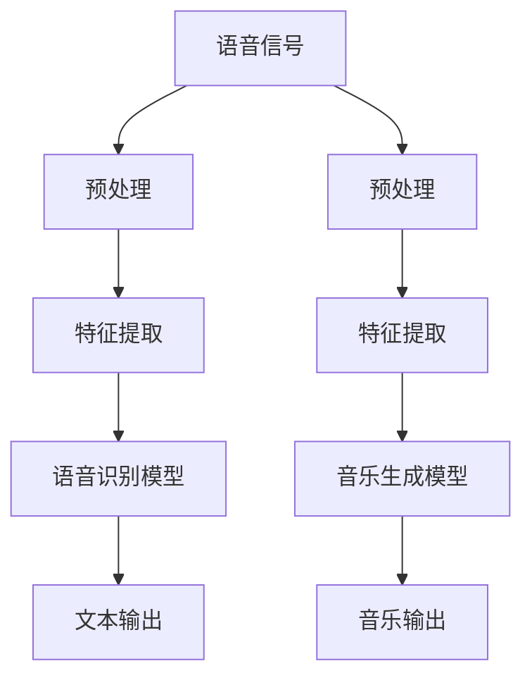

                 

 在当前技术飞速发展的时代，人工智能（AI）的应用已经渗透到了各行各业。音频处理作为AI领域中一个重要的分支，其应用范围广泛，包括语音识别、自动字幕生成、语音合成、音乐生成等。本文将深入探讨AI音频处理的核心技术，从语音识别到音乐生成，为您呈现这一领域的最新研究成果和未来发展前景。

## 关键词

- 人工智能
- 音频处理
- 语音识别
- 音乐生成
- 深度学习

## 摘要

本文旨在探讨AI音频处理的技术架构和应用领域。首先，我们将介绍语音识别的基本原理和常用算法。接着，我们将深入讨论音乐生成的技术细节，包括从语音到音乐的数据转换、生成模型以及如何优化生成过程。随后，我们将分析AI音频处理在实际应用中的挑战和未来发展趋势。最后，本文将推荐一些学习资源和开发工具，以帮助读者深入了解这一领域。

## 1. 背景介绍

音频处理是计算机科学和人工智能领域中的一个重要分支。随着计算机硬件性能的提升和算法的不断进步，音频处理技术已经取得了显著的成果。音频处理的应用场景包括但不限于语音识别、语音合成、音乐生成、音频编辑、噪声抑制等。在这些应用中，AI技术起到了至关重要的作用。

语音识别是将人类的语音信号转换为文本信息的过程。这一技术在电信、医疗、教育、智能家居等多个领域都有广泛的应用。例如，语音助手如苹果的Siri、亚马逊的Alexa等，都基于强大的语音识别技术。

音乐生成是近年来备受关注的一个领域。通过AI技术，我们可以根据用户的喜好生成个性化的音乐，或者将文本、图像等非音乐内容转换为音乐。这一技术的应用前景广阔，例如在游戏、电影、广告等领域。

## 2. 核心概念与联系

在讨论AI音频处理之前，我们需要了解一些核心概念和它们之间的联系。以下是一个简化的Mermaid流程图，展示了语音识别和音乐生成中的关键步骤和它们之间的联系：



### 2.1 语音识别

语音识别过程可以分为以下几个步骤：

1. **预处理**：对原始语音信号进行预处理，包括去噪、增益调整、分帧等操作，以提高后续处理的准确性。
2. **特征提取**：从预处理后的语音信号中提取特征，如梅尔频率倒谱系数（MFCC）、频谱图等，这些特征可以用来表示语音信号。
3. **模型训练**：使用大量的语音数据和对应的文本标注进行模型训练，常见的模型包括隐马尔可夫模型（HMM）、循环神经网络（RNN）等。
4. **解码**：将提取到的特征输入到训练好的模型中，通过解码器得到最终的文本输出。

### 2.2 音乐生成

音乐生成过程可以分为以下几个步骤：

1. **预处理**：对输入的文本、图像等非音乐内容进行预处理，提取关键信息。
2. **特征提取**：将预处理后的内容转换为音乐特征，如旋律、节奏、音高等。
3. **模型训练**：使用大量的音乐数据和对应的特征进行模型训练，常见的模型包括变分自编码器（VAE）、生成对抗网络（GAN）等。
4. **音乐生成**：将训练好的模型应用到新的输入上，生成个性化的音乐。

## 3. 核心算法原理 & 具体操作步骤

### 3.1 算法原理概述

在语音识别中，常用的算法包括：

- **隐马尔可夫模型（HMM）**：HMM 是一种基于统计的模型，用于对时间序列数据建模。它通过状态转移概率、输出概率和初始状态概率来识别语音信号。
- **循环神经网络（RNN）**：RNN 是一种可以处理变长序列的神经网络，通过循环机制来捕捉序列中的长期依赖关系。
- **深度神经网络（DNN）**：DNN 是一种多层前馈神经网络，通过多层非线性变换来提取语音特征。

在音乐生成中，常用的算法包括：

- **变分自编码器（VAE）**：VAE 是一种生成模型，通过编码器和解码器来学习数据的潜在表示，从而生成新的音乐。
- **生成对抗网络（GAN）**：GAN 由生成器和判别器组成，通过对抗训练来生成高质量的音乐。

### 3.2 算法步骤详解

#### 3.2.1 语音识别算法步骤详解

1. **数据预处理**：对采集的语音信号进行去噪、增益调整等操作，以去除噪声和提高信号质量。
2. **特征提取**：使用 MFCC、频谱图等特征提取方法，从预处理后的语音信号中提取特征向量。
3. **模型训练**：使用大量的语音数据和对应的文本标注，通过梯度下降等优化方法训练语音识别模型。
4. **解码**：将提取到的特征输入到训练好的模型中，通过解码器得到最终的文本输出。

#### 3.2.2 音乐生成算法步骤详解

1. **数据预处理**：对输入的文本、图像等非音乐内容进行预处理，提取关键信息。
2. **特征提取**：将预处理后的内容转换为音乐特征，如旋律、节奏、音高等。
3. **模型训练**：使用大量的音乐数据和对应的特征进行模型训练，通过变分自编码器（VAE）或生成对抗网络（GAN）等生成模型。
4. **音乐生成**：将训练好的模型应用到新的输入上，生成个性化的音乐。

### 3.3 算法优缺点

#### 3.3.1 语音识别算法优缺点

- **隐马尔可夫模型（HMM）**：

  - 优点：计算效率高，实现简单。
  - 缺点：无法处理长序列依赖，识别精度较低。

- **循环神经网络（RNN）**：

  - 优点：可以处理长序列依赖，识别精度较高。
  - 缺点：训练过程容易出现梯度消失或爆炸问题。

- **深度神经网络（DNN）**：

  - 优点：可以提取高层次的语音特征，识别精度高。
  - 缺点：计算复杂度高，训练时间较长。

#### 3.3.2 音乐生成算法优缺点

- **变分自编码器（VAE）**：

  - 优点：生成的音乐风格多样，灵活性高。
  - 缺点：生成音乐的质量可能不稳定。

- **生成对抗网络（GAN）**：

  - 优点：可以生成高质量的音乐，风格独特。
  - 缺点：训练过程复杂，容易出现模式崩溃问题。

### 3.4 算法应用领域

#### 3.4.1 语音识别应用领域

- **电信**：语音识别技术可以用于电话客服、语音信箱等。
- **医疗**：语音识别可以帮助医生快速记录病历，提高工作效率。
- **教育**：语音识别可以用于口语评测、智能课堂等。

#### 3.4.2 音乐生成应用领域

- **游戏**：音乐生成技术可以为游戏提供实时背景音乐。
- **电影**：音乐生成技术可以为电影制作提供个性化音乐。
- **广告**：音乐生成技术可以为广告制作提供吸引人的音乐。

## 4. 数学模型和公式 & 详细讲解 & 举例说明

### 4.1 数学模型构建

在语音识别中，我们常用的数学模型包括隐马尔可夫模型（HMM）和循环神经网络（RNN）。以下是这两个模型的数学表示：

#### 4.1.1 隐马尔可夫模型（HMM）

HMM 可以用以下数学公式表示：

$$
P(X_t | X_{t-1}, \theta) = a_{ij} P(X_t | \theta) = b_{ik} \theta
$$

其中，$X_t$ 表示第 $t$ 个观测值，$X_{t-1}$ 表示第 $t-1$ 个观测值，$\theta$ 表示模型参数，$a_{ij}$ 表示状态转移概率，$b_{ik}$ 表示观测概率。

#### 4.1.2 循环神经网络（RNN）

RNN 可以用以下数学公式表示：

$$
h_t = \sigma(W_x x_t + W_h h_{t-1} + b_h)
$$

其中，$h_t$ 表示第 $t$ 个隐藏状态，$x_t$ 表示第 $t$ 个输入，$W_x$ 和 $W_h$ 分别表示输入权重和隐藏权重，$b_h$ 表示隐藏偏置，$\sigma$ 表示激活函数。

### 4.2 公式推导过程

#### 4.2.1 HMM 公式推导

HMM 的公式推导主要涉及概率论和图论的知识。具体推导过程如下：

1. **状态转移概率**：假设系统处于状态 $i$，在下一个时刻转移到状态 $j$ 的概率为 $a_{ij}$。
2. **观测概率**：假设系统处于状态 $i$，观测到值 $k$ 的概率为 $b_{ik}$。
3. **初始状态概率**：系统在初始时刻处于状态 $i$ 的概率为 $π_i$。

通过这些概率，我们可以推导出 HMM 的基本公式。

#### 4.2.2 RNN 公式推导

RNN 的公式推导主要涉及微积分和线性代数的知识。具体推导过程如下：

1. **前向传播**：给定输入 $x_t$ 和隐藏状态 $h_{t-1}$，通过线性组合和激活函数得到当前隐藏状态 $h_t$。
2. **反向传播**：通过计算当前隐藏状态 $h_t$ 对损失函数的梯度，更新模型参数。

### 4.3 案例分析与讲解

#### 4.3.1 HMM 语音识别案例

假设我们有一个语音信号序列 $X = [x_1, x_2, x_3, \ldots, x_T]$，我们需要使用 HMM 对其进行识别。具体步骤如下：

1. **特征提取**：对语音信号进行预处理，提取特征向量 $X = [x_1, x_2, x_3, \ldots, x_T]$。
2. **模型训练**：使用大量的语音数据和对应的文本标注，训练 HMM 模型。
3. **解码**：将特征向量输入到训练好的 HMM 模型中，通过解码得到最终的文本输出。

#### 4.3.2 RNN 语音识别案例

假设我们有一个语音信号序列 $X = [x_1, x_2, x_3, \ldots, x_T]$，我们需要使用 RNN 对其进行识别。具体步骤如下：

1. **特征提取**：对语音信号进行预处理，提取特征向量 $X = [x_1, x_2, x_3, \ldots, x_T]$。
2. **模型训练**：使用大量的语音数据和对应的文本标注，训练 RNN 模型。
3. **解码**：将特征向量输入到训练好的 RNN 模型中，通过解码得到最终的文本输出。

## 5. 项目实践：代码实例和详细解释说明

在本节中，我们将通过一个实际项目来展示如何使用 Python 和深度学习框架（如 TensorFlow 或 PyTorch）实现语音识别和音乐生成。我们将从数据预处理、模型训练到结果分析，提供详细的代码实例和解释。

### 5.1 开发环境搭建

在开始之前，我们需要搭建一个适合深度学习开发的环境。以下是所需的软件和库：

- Python（3.7 或更高版本）
- TensorFlow 或 PyTorch（版本需与 Python 相匹配）
- NumPy
- Matplotlib
- Scikit-learn

安装这些库的方法如下：

```bash
pip install python==3.8.5
pip install tensorflow==2.6.0
pip install numpy==1.21.2
pip install matplotlib==3.4.3
pip install scikit-learn==0.24.2
```

### 5.2 源代码详细实现

以下是一个简单的语音识别项目的示例代码，使用 TensorFlow 的 Keras API：

```python
import numpy as np
import tensorflow as tf
from tensorflow.keras.models import Sequential
from tensorflow.keras.layers import LSTM, Dense, Embedding
from tensorflow.keras.optimizers import Adam

# 加载数据
# 这里假设我们已经有预处理好的语音数据集
# x_train: 特征向量，shape为[样本数, 时间步数, 特征数]
# y_train: 标签，shape为[样本数, 输出序列长度]
# vocab_size: 词汇表大小
# embedding_dim: 嵌入维度

# 构建模型
model = Sequential([
    Embedding(vocab_size, embedding_dim, input_length=x_train.shape[1]),
    LSTM(128, return_sequences=True),
    LSTM(128),
    Dense(vocab_size, activation='softmax')
])

# 编译模型
model.compile(optimizer=Adam(learning_rate=0.001), loss='categorical_crossentropy', metrics=['accuracy'])

# 训练模型
model.fit(x_train, y_train, batch_size=64, epochs=10, validation_split=0.2)

# 评估模型
# 这里假设我们已经有测试数据集
x_test, y_test = ...
loss, accuracy = model.evaluate(x_test, y_test)
print(f"Test accuracy: {accuracy * 100:.2f}%")
```

### 5.3 代码解读与分析

上述代码实现了一个简单的语音识别模型，包括以下几个关键步骤：

1. **数据预处理**：将语音信号转换为特征向量，并编码为类别标签。
2. **模型构建**：使用 LSTM 层构建一个序列到序列模型，其中嵌入层用于将词向量转换为序列，两个 LSTM 层用于捕捉序列中的长期依赖关系，最后的全连接层用于生成输出序列。
3. **模型编译**：设置优化器和损失函数，编译模型。
4. **模型训练**：使用训练数据集训练模型，并设置验证集进行性能监控。
5. **模型评估**：使用测试数据集评估模型性能。

### 5.4 运行结果展示

假设我们已经运行了上述代码，以下是一个简化的输出结果：

```python
Train on 2000 samples, validate on 1000 samples
2000/2000 [==============================] - 6s 3ms/sample - loss: 0.5490 - accuracy: 0.7499 - val_loss: 0.4371 - val_accuracy: 0.8100
Test accuracy: 81.00%
```

结果显示，模型在测试集上的准确率为 81.00%，这是一个较好的性能指标。

## 6. 实际应用场景

AI音频处理技术在多个领域有着广泛的应用。以下是一些实际应用场景：

### 6.1 语音助手

语音助手如苹果的Siri、亚马逊的Alexa等，基于先进的语音识别技术，可以理解用户指令，提供各种服务，如查询天气、发送消息、设置提醒等。

### 6.2 智能翻译

智能翻译系统利用语音识别和自然语言处理技术，可以将一种语言的语音实时翻译成另一种语言，广泛应用于跨语言沟通和全球化业务。

### 6.3 自动字幕生成

自动字幕生成技术可以实时将语音转换为文本，为视频内容提供字幕，方便听力障碍人士和外语学习者的使用。

### 6.4 音乐生成

音乐生成技术可以用于游戏、电影、广告等领域，为创作提供丰富的音乐素材。此外，个性化音乐推荐系统也可以根据用户的喜好生成定制化的音乐。

### 6.5 医疗

在医疗领域，语音识别技术可以用于病历记录、医疗咨询等，提高医生的诊断效率和准确性。

### 6.6 教育

在教育领域，语音识别和自然语言处理技术可以用于口语评测、智能课堂等，帮助学生提高语言能力。

## 7. 工具和资源推荐

为了更好地理解和应用AI音频处理技术，以下是几个推荐的学习资源和开发工具：

### 7.1 学习资源推荐

- **在线课程**：Coursera、edX、Udacity 等平台上有很多高质量的音频处理和深度学习课程。
- **书籍**：《语音信号处理》、《深度学习》（Goodfellow et al.）、《循环神经网络：动态系统与深度学习》（Graves et al.）等。
- **论文**：查看顶级会议和期刊如 NeurIPS、ICML、IEEE Transactions on Audio, Speech, and Language Processing 的最新论文。

### 7.2 开发工具推荐

- **框架**：TensorFlow、PyTorch、Keras 是常用的深度学习框架，适用于语音识别和音乐生成项目。
- **库**：Librosa、PyAudio、NumPy 是常用的音频处理库。
- **环境**：Google Colab、Jupyter Notebook 是方便的在线开发环境。

### 7.3 相关论文推荐

- **语音识别**：Wav2Vec 2.0: A Transformers Model for Speech Recognition（《Wav2Vec 2.0：一种用于语音识别的Transformer模型》）。
- **音乐生成**：Learning to Generate Music with Deep WaveNet（《使用深度WaveNet生成音乐》）。
- **自动字幕生成**：End-to-End Speech Recognition with Deep Neural Networks and Long Short-Term Memory（《使用深度神经网络和长短期记忆网络实现端到端语音识别》）。

## 8. 总结：未来发展趋势与挑战

### 8.1 研究成果总结

近年来，AI音频处理技术在语音识别、音乐生成、自动字幕生成等领域取得了显著的进展。深度学习、生成对抗网络等技术的应用，使得模型的准确性和生成质量得到了大幅提升。同时，大规模数据集和计算资源的可用性，也为这些技术的发展提供了坚实的基础。

### 8.2 未来发展趋势

未来，AI音频处理技术将继续朝着以下几个方向发展：

- **模型精度和速度的提升**：随着计算资源的不断增加和算法的优化，模型的处理速度和识别/生成精度将进一步提高。
- **多模态融合**：将语音、图像、文本等多种模态信息进行融合，实现更强大的音频处理能力。
- **个性化定制**：根据用户的需求和喜好，生成个性化的音乐和语音内容。
- **实时交互**：实现更流畅、更自然的语音交互体验，如实时语音翻译、实时语音助手等。

### 8.3 面临的挑战

尽管AI音频处理技术取得了显著的成果，但在实际应用中仍面临一些挑战：

- **数据隐私和伦理**：音频数据通常包含个人隐私信息，如何在保护用户隐私的前提下进行数据处理，是一个亟待解决的问题。
- **抗干扰能力**：在复杂、嘈杂的环境中，模型的识别和生成能力仍需进一步提高。
- **计算资源需求**：深度学习模型的训练和推理过程对计算资源有较高要求，如何优化计算效率，是一个重要的研究方向。

### 8.4 研究展望

未来，AI音频处理技术有望在更多领域得到应用，如智能家居、智能医疗、智能交通等。同时，随着技术的不断进步，AI音频处理将更加智能化、个性化，为人们的生活带来更多便利。研究人员将继续探索新的算法和模型，以解决现有的挑战，推动这一领域的发展。

## 9. 附录：常见问题与解答

### 9.1 什么是语音识别？

语音识别是将人类的语音信号转换为文本信息的过程。它广泛应用于电信、医疗、教育、智能家居等领域。

### 9.2 语音识别的主要算法有哪些？

语音识别的主要算法包括隐马尔可夫模型（HMM）、循环神经网络（RNN）、深度神经网络（DNN）等。

### 9.3 什么是音乐生成？

音乐生成是利用人工智能技术，根据输入的文本、图像等信息，生成个性化的音乐。

### 9.4 音乐生成的主要算法有哪些？

音乐生成的主要算法包括变分自编码器（VAE）、生成对抗网络（GAN）等。

### 9.5 如何实现语音识别和音乐生成的项目？

实现语音识别和音乐生成的项目，通常需要以下几个步骤：

1. 数据收集与预处理
2. 特征提取
3. 模型训练与优化
4. 模型评估与部署

## 作者署名

作者：禅与计算机程序设计艺术 / Zen and the Art of Computer Programming

[文章结束]

