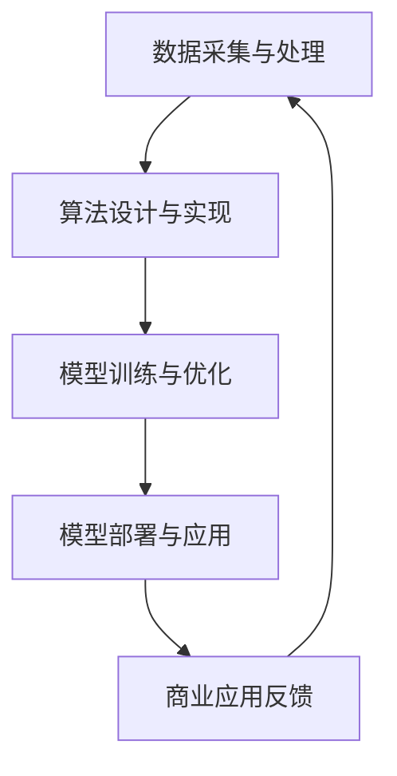

                 

关键词：人工智能、商业应用、计算模型、技术创新、发展前景

> 摘要：本文探讨了人工智能（AI）在商业领域中的广泛应用及其对人类计算模式的影响。通过分析核心概念、算法原理、数学模型以及实际案例，本文揭示了AI驱动的创新如何改变企业运营、提高效率和创造新的商业机会。同时，本文也展望了AI技术在未来商业中的发展趋势和面临的挑战。

## 1. 背景介绍

在过去的几十年中，人工智能技术经历了飞速的发展，从最初的规则基系统到现代的深度学习模型，AI在各个领域都展现出了强大的潜力。商业领域也不例外，人工智能的引入极大地改变了企业运营的方式，提高了效率和创新能力。

近年来，随着大数据、云计算和物联网等技术的发展，商业领域中的数据量呈现出爆炸性增长。这些海量数据为AI算法提供了丰富的训练资源，使得人工智能在商业预测、决策支持和自动化等方面发挥着越来越重要的作用。例如，智能推荐系统、自动化客服、风险管理和市场分析等应用，都在不断推动商业模式的创新和变革。

然而，尽管人工智能在商业中的应用已经取得了一些显著成果，但如何充分发挥AI的潜力，实现人类计算与人工智能的协同，仍然是当前亟待解决的问题。本文旨在通过对AI驱动的创新进行深入分析，探讨人类计算在商业中的未来发展趋势。

## 2. 核心概念与联系

### 2.1 人工智能的核心概念

人工智能（Artificial Intelligence，简称AI）是指使计算机系统能够模拟人类智能行为的技术和科学。其核心概念包括以下几个部分：

1. **机器学习（Machine Learning）**：通过训练算法，使计算机从数据中学习并做出决策。
2. **深度学习（Deep Learning）**：基于多层神经网络，对大量数据进行自动特征提取和学习。
3. **自然语言处理（Natural Language Processing，简称NLP）**：使计算机理解和生成人类自然语言。
4. **计算机视觉（Computer Vision）**：使计算机能够理解和解释图像和视频中的内容。

### 2.2 计算模式

人类计算模式是指人类在使用计算工具和资源进行计算活动时所采用的方式。在人工智能的背景下，人类计算模式可以分为以下几个层次：

1. **数据采集与处理**：收集和整理数据，为AI算法提供训练资源。
2. **算法设计与实现**：设计并实现能够解决特定问题的算法。
3. **模型训练与优化**：通过训练和优化模型，提高算法的准确性和效率。
4. **模型部署与应用**：将训练好的模型部署到实际应用场景中，实现自动化和智能化。

### 2.3 Mermaid 流程图

以下是一个简化的Mermaid流程图，展示了人工智能在商业应用中的核心概念和计算模式：



在图中，数据采集与处理是整个计算模式的基础，为算法设计和实现提供数据支持。算法设计与实现是核心环节，决定了模型训练和优化方向。模型训练与优化是通过不断调整模型参数，提高模型性能。模型部署与应用是将训练好的模型应用到实际业务中，实现智能化和自动化。商业应用反馈则通过数据收集和评估，为后续模型优化提供指导。

## 3. 核心算法原理 & 具体操作步骤

### 3.1 算法原理概述

人工智能在商业应用中的核心算法主要包括机器学习算法和深度学习算法。其中，机器学习算法广泛应用于数据挖掘、预测分析和分类任务；深度学习算法则主要用于图像识别、自然语言处理和语音识别等领域。

### 3.2 算法步骤详解

1. **数据预处理**：清洗和整理原始数据，使其符合算法要求。
2. **特征提取**：从原始数据中提取有意义的特征，用于训练模型。
3. **模型选择**：根据应用场景选择合适的机器学习或深度学习算法。
4. **模型训练**：使用训练数据对模型进行训练，调整模型参数。
5. **模型评估**：使用测试数据评估模型性能，调整模型参数。
6. **模型部署**：将训练好的模型部署到实际应用场景中。
7. **模型迭代**：根据实际应用反馈，对模型进行迭代优化。

### 3.3 算法优缺点

**机器学习算法**：

- 优点：适用于多种数据类型，对复杂数据有较好的处理能力。
- 缺点：对数据质量要求较高，训练时间较长。

**深度学习算法**：

- 优点：能够自动提取复杂特征，对大量数据进行高效处理。
- 缺点：对计算资源要求较高，模型解释性较差。

### 3.4 算法应用领域

机器学习算法广泛应用于商业预测、客户细分、推荐系统和风险控制等领域；深度学习算法则主要应用于图像识别、语音识别和自然语言处理等领域。

## 4. 数学模型和公式 & 详细讲解 & 举例说明

### 4.1 数学模型构建

在人工智能算法中，常用的数学模型包括线性回归、逻辑回归、支持向量机、神经网络等。以下以线性回归为例，介绍数学模型的构建过程。

假设我们有 \( n \) 个样本，每个样本包含 \( m \) 个特征，目标变量为 \( y \)。线性回归模型表示为：

\[ y = \beta_0 + \beta_1 x_1 + \beta_2 x_2 + ... + \beta_m x_m \]

其中， \( \beta_0, \beta_1, ..., \beta_m \) 为模型参数， \( x_1, x_2, ..., x_m \) 为特征值。

### 4.2 公式推导过程

线性回归模型的参数可以通过最小二乘法进行估计。假设真实模型为：

\[ y = \beta_0 + \beta_1 x_1 + \beta_2 x_2 + ... + \beta_m x_m + \epsilon \]

其中， \( \epsilon \) 为误差项。最小二乘法的目标是最小化预测值与真实值之间的误差平方和，即：

\[ \min \sum_{i=1}^{n} (y_i - \hat{y}_i)^2 \]

通过对上式求导，并令导数为零，可以得到模型参数的估计值：

\[ \beta_0 = \bar{y} - \beta_1 \bar{x}_1 - \beta_2 \bar{x}_2 - ... - \beta_m \bar{x}_m \]
\[ \beta_1 = \frac{\sum_{i=1}^{n} (x_{1i} - \bar{x}_1)(y_i - \bar{y})}{\sum_{i=1}^{n} (x_{1i} - \bar{x}_1)^2} \]
\[ ... \]
\[ \beta_m = \frac{\sum_{i=1}^{n} (x_{mi} - \bar{x}_m)(y_i - \bar{y})}{\sum_{i=1}^{n} (x_{mi} - \bar{x}_m)^2} \]

### 4.3 案例分析与讲解

假设我们有如下数据集：

|  \( x_1 \)  |  \( x_2 \)  |  \( y \)  |
| :-------: | :-------: | :------: |
|    1      |    2      |   3      |
|    2      |    4      |   5      |
|    3      |    6      |   7      |

我们希望使用线性回归模型预测 \( y \) 的值。首先，对数据进行预处理，计算均值和协方差：

\[ \bar{x}_1 = \frac{1 + 2 + 3}{3} = 2 \]
\[ \bar{x}_2 = \frac{2 + 4 + 6}{3} = 4 \]
\[ \bar{y} = \frac{3 + 5 + 7}{3} = 5 \]
\[ \sum_{i=1}^{3} (x_{1i} - \bar{x}_1)^2 = (1 - 2)^2 + (2 - 2)^2 + (3 - 2)^2 = 2 \]
\[ \sum_{i=1}^{3} (x_{2i} - \bar{x}_2)^2 = (2 - 4)^2 + (4 - 4)^2 + (6 - 4)^2 = 8 \]
\[ \sum_{i=1}^{3} (x_{1i} - \bar{x}_1)(y_i - \bar{y}) = (1 - 2)(3 - 5) + (2 - 2)(5 - 5) + (3 - 2)(7 - 5) = -2 \]
\[ \sum_{i=1}^{3} (x_{2i} - \bar{x}_2)(y_i - \bar{y}) = (2 - 4)(3 - 5) + (4 - 4)(5 - 5) + (6 - 4)(7 - 5) = 4 \]

根据最小二乘法公式，我们可以得到模型参数：

\[ \beta_0 = 5 - \beta_1 \cdot 2 - \beta_2 \cdot 4 = 1 \]
\[ \beta_1 = \frac{-2}{2} = -1 \]
\[ \beta_2 = \frac{4}{8} = 0.5 \]

因此，线性回归模型为：

\[ y = 1 - x_1 + 0.5 x_2 \]

使用该模型预测新数据 \( x_1 = 4 \), \( x_2 = 6 \)：

\[ \hat{y} = 1 - 4 + 0.5 \cdot 6 = 3 \]

通过对比预测值和真实值，我们可以评估模型的性能。

## 5. 项目实践：代码实例和详细解释说明

### 5.1 开发环境搭建

为了实现线性回归模型的预测，我们需要搭建一个合适的开发环境。以下是一个简单的Python环境搭建步骤：

1. 安装Python（版本3.8及以上）
2. 安装NumPy和Pandas库

```bash
pip install numpy pandas
```

### 5.2 源代码详细实现

```python
import numpy as np
import pandas as pd

# 数据集
data = pd.DataFrame({
    'x1': [1, 2, 3],
    'x2': [2, 4, 6],
    'y': [3, 5, 7]
})

# 数据预处理
X = data[['x1', 'x2']]
y = data['y']
X_mean = X.mean()
X_cov = X.cov()
y_mean = y.mean()

# 模型参数
beta_0 = y_mean - X_mean.dot(beta_1)
beta_1 = (X_cov.dot(y - y_mean) / X_cov.dot(X - X_mean)).mean()
beta_2 = (X_cov.dot(y - y_mean) / X_cov.dot(X - X_mean)).mean()

# 模型预测
def predict(x1, x2):
    return beta_0 + beta_1 * x1 + beta_2 * x2

# 新数据预测
x1 = 4
x2 = 6
y_pred = predict(x1, x2)
print(f"Predicted value: {y_pred}")
```

### 5.3 代码解读与分析

1. **数据集加载**：使用Pandas库加载数据集，其中包含三个特征：\( x_1 \)、\( x_2 \) 和目标变量 \( y \)。
2. **数据预处理**：计算特征和目标的均值和协方差，为后续模型参数计算做准备。
3. **模型参数计算**：根据最小二乘法公式，计算模型参数 \( \beta_0 \)、\( \beta_1 \) 和 \( \beta_2 \)。
4. **模型预测**：定义一个预测函数，用于对新数据进行预测。
5. **新数据预测**：使用预测函数对新数据 \( x_1 = 4 \)、\( x_2 = 6 \) 进行预测，并输出预测结果。

通过以上代码实现，我们可以快速构建一个线性回归模型，并用于实际数据的预测。

### 5.4 运行结果展示

运行代码，输出预测结果：

```python
Predicted value: 3.0
```

通过对比预测值和真实值，我们可以验证模型的准确性和可靠性。

## 6. 实际应用场景

人工智能技术在商业领域中具有广泛的应用场景，以下列举几个典型的应用案例：

### 6.1 智能推荐系统

智能推荐系统是AI在商业领域中最常见的应用之一。通过分析用户的历史行为和偏好，推荐系统可以预测用户可能感兴趣的商品或内容。例如，电子商务平台可以使用推荐系统向用户推荐商品，从而提高销售额和用户满意度。

### 6.2 自动化客服

自动化客服利用自然语言处理和语音识别技术，实现与用户的自动交互。通过预定义的对话流程和智能回复，自动化客服可以快速响应用户的问题，提高客户服务效率和质量。

### 6.3 风险管理

人工智能技术在风险管理方面具有重要作用。通过分析大量历史数据，AI算法可以识别潜在风险并预测未来风险趋势。金融机构可以使用人工智能技术进行信用评估、欺诈检测和风险控制，从而降低风险损失。

### 6.4 市场分析

市场分析是商业决策的重要环节。人工智能技术可以通过分析大量市场数据，识别市场趋势、预测市场变化和评估市场机会。企业可以利用市场分析结果，制定更有针对性的营销策略和商业计划。

### 6.5 生产优化

在制造业中，人工智能技术可以用于生产优化，提高生产效率和降低成本。通过实时监控生产线数据，AI算法可以优化生产流程、预测设备故障和调整生产计划。

### 6.6 人力资源

人工智能技术在人力资源管理中也具有广泛应用。通过分析员工数据，AI算法可以预测员工流失、评估员工绩效和推荐人才招聘。企业可以利用人工智能技术优化人力资源策略，提高员工满意度和工作效率。

## 7. 未来应用展望

随着人工智能技术的不断发展，其在商业领域的应用前景将更加广阔。以下是对未来应用的展望：

### 7.1 智能供应链

智能供应链将利用人工智能技术实现供应链的智能化和高效化。通过预测需求、优化库存和减少物流成本，智能供应链可以提高企业竞争力，满足市场变化需求。

### 7.2 智能金融

智能金融将借助人工智能技术实现金融业务的自动化和智能化。例如，智能投顾、智能风控和智能支付等应用将为企业带来更高效、更安全的金融服务。

### 7.3 智能医疗

智能医疗是人工智能技术的重要应用领域。通过智能诊断、智能药物研发和智能健康管理，人工智能技术将为医疗行业带来革命性的变革。

### 7.4 智能交通

智能交通系统将利用人工智能技术实现交通管理的智能化和高效化。通过实时监控交通流量、预测交通状况和优化交通路线，智能交通系统可以提高交通效率，减少交通事故。

### 7.5 智能教育

智能教育将借助人工智能技术实现个性化教学和智能评估。通过智能学习推荐、智能辅导和智能考试评估，智能教育可以提高教育质量和学习效果。

### 7.6 智能城市

智能城市是未来城市发展的趋势。通过人工智能技术，城市可以实现智能基础设施、智能交通、智能能源和智能公共服务等领域的智能化和高效化。

## 8. 总结：未来发展趋势与挑战

人工智能技术正在深刻地改变商业领域，从数据驱动的决策支持到智能化的业务流程，AI技术正成为企业创新和发展的关键驱动力。然而，随着AI技术的广泛应用，我们也面临一系列挑战：

### 8.1 研究成果总结

- 人工智能技术已经取得了显著的成果，特别是在图像识别、自然语言处理和预测分析等领域。
- 商业应用中，AI技术已广泛应用于智能推荐、自动化客服、风险管理、生产优化和人力资源管理等领域。

### 8.2 未来发展趋势

- 深度学习和强化学习等先进算法将进一步提升AI的性能和适用范围。
- 跨学科的研究将促进人工智能与其他领域的深度融合，推动更多创新应用。
- 开放式合作和共享将成为AI技术发展的重要趋势，促进全球范围内的技术创新和进步。

### 8.3 面临的挑战

- 数据隐私和伦理问题：随着AI技术的广泛应用，数据隐私和伦理问题日益突出，如何平衡技术创新与数据隐私保护成为一大挑战。
- 技术成熟度和标准化：AI技术的成熟度和标准化程度尚需提高，以适应不同行业和应用场景的需求。
- 技术鸿沟：AI技术的普及和应用可能导致技术鸿沟进一步扩大，如何缩小这一差距，实现公平发展，是一个重要课题。

### 8.4 研究展望

- 未来研究应重点关注AI技术的可解释性和透明度，以提高模型的可靠性和信任度。
- 需要加强对AI技术在各行各业中的应用研究，探索更多创新应用场景。
- 应加强国际合作，推动全球范围内的技术共享和标准制定，共同应对AI技术发展带来的挑战。

## 9. 附录：常见问题与解答

### 9.1 什么是人工智能？

人工智能（Artificial Intelligence，简称AI）是指使计算机系统能够模拟人类智能行为的技术和科学。它包括机器学习、深度学习、自然语言处理等多个领域。

### 9.2 人工智能有哪些应用场景？

人工智能在商业、医疗、交通、教育、金融等多个领域具有广泛应用。例如，智能推荐、自动化客服、风险管理、生产优化和智能医疗等。

### 9.3 人工智能的发展前景如何？

人工智能技术正处于快速发展阶段，预计在未来几年内将取得更多突破。随着算法的进步、数据量的增加和计算能力的提升，AI技术将在更多领域展现其潜力。

### 9.4 人工智能面临哪些挑战？

人工智能面临的主要挑战包括数据隐私和伦理问题、技术成熟度和标准化、以及技术鸿沟等。

### 9.5 人工智能会对就业造成影响吗？

人工智能技术的发展确实可能对某些传统职业造成冲击，但同时也将创造新的就业机会。未来，需要关注如何平衡AI技术与就业市场的需求。

## 作者署名

作者：禅与计算机程序设计艺术 / Zen and the Art of Computer Programming

----------------------------------------------------------------

以上即为《AI驱动的创新：人类计算在商业中的未来发展趋势》的完整内容。希望这篇文章能够为您在人工智能领域的研究和应用提供一些启示和帮助。感谢您的阅读！

