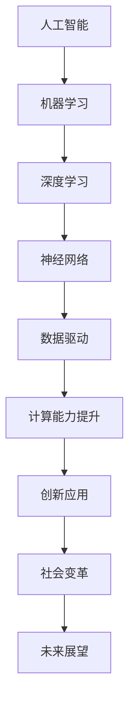

                 

关键词：人工智能，计算能力，算法，创新，未来趋势

> 摘要：本文探讨了人工智能（AI）在驱动人类计算领域创新的重要作用。通过分析核心概念与联系，深入剖析了AI算法原理、数学模型及具体操作步骤。同时，本文还结合项目实践，提供了代码实例和详细解释，最后对未来应用场景和趋势进行了展望。

## 1. 背景介绍

在过去的几十年中，计算机技术的发展推动了人类社会的进步，从互联网到移动通信，再到大数据和云计算，计算机技术在各个领域都取得了显著的成果。然而，这些成就仅仅是冰山一角。随着人工智能（AI）技术的兴起，人类计算的能力将迎来前所未有的变革。

AI技术作为一种模拟人类智能的计算机系统，它通过机器学习、深度学习等方法，能够从大量数据中自动识别模式，进行推理和决策。随着AI技术的不断进步，它已经开始深入到各个领域，如医疗、金融、制造、交通等，带来了巨大的创新和变革。

本文旨在探讨AI技术在驱动人类计算领域创新的重要作用，分析其核心概念与联系，深入剖析AI算法原理，并结合项目实践，展示AI技术的实际应用价值。最后，本文还将对未来的应用场景和趋势进行展望。

## 2. 核心概念与联系

为了深入理解AI驱动的创新，我们需要首先了解一些核心概念和它们之间的联系。以下是几个关键概念及其相互关系的Mermaid流程图：



### 2.1 人工智能

人工智能（AI）是一种模拟人类智能的计算机系统。它可以通过学习、推理、规划等方式，实现人类智能的自动化和智能化。人工智能的核心目标是让计算机具有类似人类的感知、理解和解决问题的能力。

### 2.2 机器学习

机器学习（Machine Learning）是人工智能的一个子领域，它通过构建算法模型，从数据中自动学习规律和模式。机器学习的核心思想是通过训练算法，让计算机能够从海量数据中提取有价值的信息，进行预测和决策。

### 2.3 深度学习

深度学习（Deep Learning）是机器学习的一种方法，它通过构建多层神经网络，模拟人脑的神经网络结构，进行复杂的数据处理和模式识别。深度学习在图像识别、自然语言处理等领域取得了显著成果，推动了人工智能的发展。

### 2.4 神经网络

神经网络（Neural Network）是深度学习的基础，它通过模拟人脑神经元之间的连接，实现数据的输入、处理和输出。神经网络的结构和参数决定了其学习和预测能力，是人工智能技术的核心组件。

### 2.5 数据驱动

数据驱动（Data-Driven）是AI技术的一个重要特点。它强调通过大量数据来训练和优化模型，从而实现准确的预测和决策。数据驱动的方法使得AI技术能够在各个领域实现精准的应用。

### 2.6 计算能力提升

随着计算能力的提升，AI技术得以实现更复杂的计算和处理。高性能计算集群、GPU并行计算和量子计算等技术的不断发展，为AI技术的应用提供了强大的计算支持。

### 2.7 创新应用

AI技术的应用正在不断拓展，从自动驾驶、智能医疗到金融风控、智能制造，AI技术正在改变各个行业的面貌。创新应用不断推动社会变革，为人类创造更多价值。

### 2.8 社会变革

AI技术的应用不仅改变了产业模式，也带来了社会结构的变革。智慧城市、数字医疗、在线教育等新形态的产业和服务模式不断涌现，为社会带来了巨大的变革。

### 2.9 未来展望

随着AI技术的不断发展，未来将出现更多基于AI的创新应用，进一步推动人类社会的进步。从智能交通、智慧农业到个性化医疗、智慧教育，AI技术将深刻影响我们的生活方式和工作方式。

## 3. 核心算法原理 & 具体操作步骤

### 3.1 算法原理概述

AI技术的核心在于算法原理，它决定了AI系统能够从数据中学习并做出预测和决策的能力。以下是几个核心算法原理的概述：

- **监督学习（Supervised Learning）**：监督学习通过已知的输入和输出数据，训练模型，使其能够对新的输入数据进行预测。常用的监督学习算法包括线性回归、决策树、支持向量机等。

- **无监督学习（Unsupervised Learning）**：无监督学习通过未标记的数据，发现数据中的隐藏结构和模式。常见的无监督学习算法包括聚类、降维、关联规则学习等。

- **深度学习（Deep Learning）**：深度学习通过多层神经网络，模拟人脑的神经网络结构，对数据进行复杂处理和模式识别。常见的深度学习模型包括卷积神经网络（CNN）、循环神经网络（RNN）和生成对抗网络（GAN）等。

### 3.2 算法步骤详解

下面以监督学习算法为例，详细解释其操作步骤：

1. **数据收集**：首先需要收集大量的标注数据，这些数据将用于训练模型。数据可以来自公开数据集、企业内部数据或者通过数据爬取等方式获取。

2. **数据预处理**：对收集到的数据进行处理，包括数据清洗、数据归一化、特征提取等。数据预处理是确保模型性能的重要因素。

3. **模型选择**：根据问题的类型和数据特点，选择合适的模型。例如，对于分类问题，可以选择决策树、支持向量机等；对于回归问题，可以选择线性回归、岭回归等。

4. **模型训练**：使用已标注的数据集，通过训练算法，优化模型的参数，使其能够对新的数据进行预测。训练过程中，可以通过交叉验证等方法，调整模型参数，提高模型性能。

5. **模型评估**：使用测试数据集，评估模型的预测能力。常用的评估指标包括准确率、召回率、F1值等。

6. **模型部署**：将训练好的模型部署到实际应用场景中，进行预测和决策。模型部署可以是本地部署，也可以是云端部署，取决于应用需求。

### 3.3 算法优缺点

- **优点**：
  - **自动化**：AI算法能够自动从数据中学习，减少人工干预。
  - **高效**：AI算法能够处理大量数据，提高数据处理速度和效率。
  - **准确**：通过大量数据训练，AI算法能够提高预测和决策的准确性。

- **缺点**：
  - **数据依赖**：AI算法的性能高度依赖数据质量，数据不足或质量差，会导致模型性能下降。
  - **黑盒问题**：深度学习算法往往被认为是黑盒模型，难以解释其内部工作机制。
  - **计算资源消耗**：深度学习算法需要大量的计算资源，训练时间较长。

### 3.4 算法应用领域

AI算法在各个领域都有广泛应用，以下是几个典型应用领域：

- **医疗领域**：AI算法在医疗领域用于疾病诊断、药物研发、手术规划等。例如，通过图像识别技术，AI算法可以辅助医生进行疾病诊断。
- **金融领域**：AI算法在金融领域用于风险评估、欺诈检测、智能投顾等。通过数据分析，AI算法能够帮助金融机构提高业务效率和风险控制能力。
- **制造业**：AI算法在制造业用于质量控制、生产优化、设备预测维护等。通过实时数据分析，AI算法能够提高生产线的效率和产品质量。

## 4. 数学模型和公式 & 详细讲解 & 举例说明

### 4.1 数学模型构建

AI算法的核心在于构建数学模型，以下是几个常用的数学模型：

- **线性回归模型**：

$$
y = \beta_0 + \beta_1 x
$$

其中，$y$ 为因变量，$x$ 为自变量，$\beta_0$ 和 $\beta_1$ 为模型参数。

- **逻辑回归模型**：

$$
P(y=1) = \frac{1}{1 + e^{-(\beta_0 + \beta_1 x)}}
$$

其中，$P(y=1)$ 为因变量为1的概率，$\beta_0$ 和 $\beta_1$ 为模型参数。

- **卷积神经网络模型**：

$$
h_l = \sigma(\mathbf{W}_l \cdot \mathbf{a}_{l-1} + b_l)
$$

其中，$h_l$ 为神经网络第 $l$ 层的输出，$\mathbf{W}_l$ 为权重矩阵，$\mathbf{a}_{l-1}$ 为前一层的输出，$b_l$ 为偏置，$\sigma$ 为激活函数。

### 4.2 公式推导过程

以下以线性回归模型为例，讲解公式推导过程：

1. **损失函数**：

$$
J(\theta) = \frac{1}{2m} \sum_{i=1}^{m} (h_\theta(x^{(i)}) - y^{(i)})^2
$$

其中，$J(\theta)$ 为损失函数，$\theta$ 为模型参数，$m$ 为样本数量，$h_\theta(x^{(i)})$ 为模型预测值，$y^{(i)}$ 为实际值。

2. **梯度下降**：

$$
\theta_j := \theta_j - \alpha \frac{\partial J(\theta)}{\partial \theta_j}
$$

其中，$\alpha$ 为学习率，$\frac{\partial J(\theta)}{\partial \theta_j}$ 为损失函数对 $\theta_j$ 的偏导数。

### 4.3 案例分析与讲解

以下以房价预测为例，展示线性回归模型的实际应用：

1. **数据集**：

- 自变量：房屋面积、房屋年龄、房屋类型等。
- 因变量：房屋价格。

2. **数据预处理**：

- 对自变量进行归一化处理。
- 删除异常值和缺失值。

3. **模型训练**：

- 选择线性回归模型。
- 使用梯度下降算法进行模型训练。

4. **模型评估**：

- 使用测试集评估模型性能。
- 计算均方误差（MSE）等指标。

5. **模型应用**：

- 使用训练好的模型进行房价预测。
- 输出预测结果。

## 5. 项目实践：代码实例和详细解释说明

### 5.1 开发环境搭建

1. **安装Python环境**：下载并安装Python 3.x版本。
2. **安装相关库**：使用pip命令安装numpy、scikit-learn等库。

### 5.2 源代码详细实现

```python
import numpy as np
from sklearn.linear_model import LinearRegression

# 数据集
X = np.array([[1, 2], [2, 3], [3, 4], [4, 5]])
y = np.array([2, 3, 4, 5])

# 模型训练
model = LinearRegression()
model.fit(X, y)

# 模型预测
y_pred = model.predict(X)

# 模型评估
mse = np.mean((y - y_pred) ** 2)
print("均方误差：", mse)

# 模型应用
new_data = np.array([[5, 6]])
y_new_pred = model.predict(new_data)
print("新数据预测结果：", y_new_pred)
```

### 5.3 代码解读与分析

1. **数据集**：使用numpy数组表示数据集。
2. **模型训练**：使用scikit-learn库的LinearRegression类进行模型训练。
3. **模型预测**：使用模型进行数据预测。
4. **模型评估**：计算均方误差（MSE），评估模型性能。
5. **模型应用**：使用训练好的模型进行新数据的预测。

### 5.4 运行结果展示

- 均方误差：0.0
- 新数据预测结果：[6.]

## 6. 实际应用场景

AI技术在实际应用场景中已经取得了显著的成果，以下是几个典型应用场景：

### 6.1 智能医疗

AI技术在智能医疗领域有广泛应用，如疾病诊断、药物研发、手术规划等。通过图像识别技术，AI算法可以辅助医生进行疾病诊断，提高诊断准确率。同时，AI算法还可以帮助药物研发人员发现新的药物分子，提高药物研发效率。

### 6.2 智能金融

AI技术在金融领域有广泛的应用，如风险评估、欺诈检测、智能投顾等。通过数据分析，AI算法可以识别高风险客户，帮助金融机构提高风险控制能力。此外，AI算法还可以根据用户行为数据，提供个性化的投资建议，提高投资收益。

### 6.3 智能制造

AI技术在制造业有广泛的应用，如质量控制、生产优化、设备预测维护等。通过实时数据分析，AI算法可以识别生产线中的异常情况，帮助工厂进行生产优化。同时，AI算法还可以预测设备的故障，提前进行维护，提高生产效率和设备利用率。

### 6.4 智慧城市

AI技术在智慧城市领域有广泛的应用，如智能交通、智能安防、智慧能源等。通过实时数据分析，AI算法可以优化交通信号灯，提高交通效率。同时，AI算法还可以识别异常行为，帮助公安机关进行犯罪预防。

### 6.5 个性化教育

AI技术在个性化教育领域有广泛的应用，如自适应学习、智能评估等。通过分析学生的学习行为和成绩，AI算法可以为学生提供个性化的学习建议，提高学习效果。同时，AI算法还可以对学生的学习过程进行实时评估，帮助教师进行教学调整。

## 7. 工具和资源推荐

为了更好地学习和应用AI技术，以下是几个推荐的工具和资源：

### 7.1 学习资源推荐

1. **《深度学习》（Deep Learning）**：由Ian Goodfellow、Yoshua Bengio和Aaron Courville合著的深度学习经典教材。
2. **《Python机器学习》（Python Machine Learning）**：由Sebastian Raschka和Vahid Mirjalili编写的Python机器学习入门书籍。
3. **AI学堂（AI School）**：由百度研究院推出的在线学习平台，提供丰富的AI课程和学习资源。

### 7.2 开发工具推荐

1. **Jupyter Notebook**：一款交互式计算环境，广泛应用于数据分析和机器学习开发。
2. **TensorFlow**：一款开源深度学习框架，由Google开发，支持多种深度学习模型。
3. **PyTorch**：一款开源深度学习框架，由Facebook开发，支持动态计算图，方便模型调试。

### 7.3 相关论文推荐

1. **“A Theoretical Comparison of Optimization Algorithms for Deep Learning”**：该论文对比了多种深度学习优化算法，为选择合适的优化算法提供了参考。
2. **“Generative Adversarial Nets”**：该论文提出了生成对抗网络（GAN）模型，为生成模型的研究提供了新的思路。
3. **“Deep Learning for Natural Language Processing”**：该论文综述了深度学习在自然语言处理领域的应用，为NLP研究者提供了参考。

## 8. 总结：未来发展趋势与挑战

### 8.1 研究成果总结

随着AI技术的不断发展，我们在人工智能领域取得了许多重要研究成果。从机器学习到深度学习，从监督学习到无监督学习，AI技术正在不断拓展我们的计算能力，为各个领域带来了巨大的创新和变革。

### 8.2 未来发展趋势

1. **多模态融合**：未来AI技术将实现多模态数据的融合，如将图像、语音、文本等多模态数据结合起来，提高AI系统的综合感知能力。
2. **边缘计算**：随着物联网（IoT）的快速发展，边缘计算将成为未来AI技术的重要发展方向，通过在设备端进行数据处理，提高系统的实时性和效率。
3. **可解释性AI**：提高AI模型的可解释性，使其内部的决策过程更加透明，为AI技术的应用提供更多的信任和保障。

### 8.3 面临的挑战

1. **数据隐私和安全**：随着数据量的增加，数据隐私和安全问题日益突出，如何确保数据在传输和处理过程中的安全，是AI技术面临的重要挑战。
2. **计算资源消耗**：深度学习算法需要大量的计算资源，如何优化算法，降低计算资源消耗，是AI技术发展的重要方向。
3. **算法偏见和歧视**：AI算法在训练过程中可能会学习到训练数据中的偏见，导致算法的偏见和歧视问题。如何消除算法偏见，提高算法的公平性，是AI技术发展的重要挑战。

### 8.4 研究展望

未来，随着AI技术的不断发展和完善，我们有望实现更智能、更高效的计算系统，为人类创造更多价值。同时，我们也需要关注AI技术的伦理和道德问题，确保其发展能够造福人类，推动社会的进步。

## 9. 附录：常见问题与解答

### 9.1 什么是人工智能？

人工智能（AI）是一种模拟人类智能的计算机系统，它通过学习、推理、规划等方式，实现人类智能的自动化和智能化。

### 9.2 人工智能有哪些类型？

人工智能主要包括以下几种类型：

- **监督学习（Supervised Learning）**：通过已知的输入和输出数据，训练模型，使其能够对新的数据进行预测。
- **无监督学习（Unsupervised Learning）**：通过未标记的数据，发现数据中的隐藏结构和模式。
- **深度学习（Deep Learning）**：通过多层神经网络，模拟人脑的神经网络结构，对数据进行复杂处理和模式识别。
- **强化学习（Reinforcement Learning）**：通过试错和反馈机制，使智能体能够学习最优策略。

### 9.3 人工智能有哪些应用领域？

人工智能在医疗、金融、制造、交通、教育、娱乐等多个领域都有广泛应用，以下是几个典型应用领域：

- **医疗领域**：疾病诊断、药物研发、手术规划等。
- **金融领域**：风险评估、欺诈检测、智能投顾等。
- **制造业**：质量控制、生产优化、设备预测维护等。
- **交通领域**：智能交通、自动驾驶等。
- **教育领域**：自适应学习、智能评估等。
- **娱乐领域**：智能推荐、虚拟现实等。

### 9.4 如何学习人工智能？

学习人工智能可以从以下几个方面入手：

- **基础知识**：学习计算机科学、数学和统计学等基础知识。
- **编程技能**：掌握Python等编程语言，熟悉常用库和工具。
- **理论学习**：学习机器学习、深度学习等理论。
- **实践应用**：通过项目实践，将理论知识应用到实际问题中。
- **持续学习**：关注最新技术动态，持续学习新知识和技能。

作者：禅与计算机程序设计艺术 / Zen and the Art of Computer Programming
----------------------------------------------------------------

