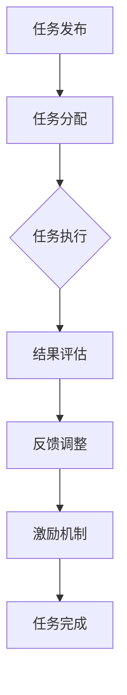

                 

关键词：人工智能，众包，人类计算，协作，创新，算法优化，开放协作

摘要：本文深入探讨了人工智能（AI）与人类计算结合的众包模式，分析其背景、核心概念、算法原理、数学模型、项目实践，以及未来应用场景和挑战。通过介绍AI驱动的众包模式，探讨其在各行业中的应用，展望未来发展趋势与面临的挑战。

## 1. 背景介绍

随着互联网和移动互联网的普及，人类计算模式正经历着深刻变革。传统的人工计算方式由于成本高、效率低、易出错等问题，逐渐难以满足日益增长的数据处理需求。与此同时，人工智能技术飞速发展，为人类计算带来了全新的可能性。

众包（Crowdsourcing）是一种基于互联网的开放协作模式，通过将复杂的任务分解成小部分，分发给广泛的网络参与者，共同完成项目。众包模式具有灵活性高、成本低、参与者多样化的优势，可以有效地解决传统计算模式中的难题。而人工智能则提供了高效的算法工具，可以协助人类在众包任务中进行决策、优化和协调。

将人工智能与人类计算相结合，形成AI驱动的众包模式，不仅能够提高计算效率，还能激发创新，推动各行业的发展。

### 核心概念与联系

#### 1.1 人工智能

人工智能（AI）是一门探索使计算机具有智能行为的科学。它包括机器学习、深度学习、自然语言处理、计算机视觉等多个领域，通过模拟人类智能，实现自动化决策和任务执行。

#### 1.2 众包

众包是指将特定的任务通过互联网发布给广大公众，由他们自愿参与完成，并通过奖励或荣誉等方式激励参与者。

#### 1.3 人类计算

人类计算是指利用人类智慧、经验和直觉进行信息处理和决策的过程。

#### 1.4 AI驱动的众包模式

AI驱动的众包模式是指利用人工智能技术对众包任务进行优化、协调和管理，提高任务完成效率和准确性。其核心包括：

1. **任务分配与调度**：通过人工智能算法，将任务分配给合适的参与者，并实时调整任务调度，确保任务的高效完成。
2. **质量评估与反馈**：利用人工智能技术对众包任务的结果进行质量评估，为参与者提供反馈，不断优化任务完成质量。
3. **激励机制**：结合人工智能技术，设计合理的激励机制，激发参与者的积极性，提高众包任务的成功率。

#### 1.5 Mermaid 流程图

下面是AI驱动的众包模式的Mermaid流程图：



## 2. 核心算法原理 & 具体操作步骤

#### 2.1 算法原理概述

AI驱动的众包模式的核心算法主要包括任务分配算法、结果评估算法和激励机制设计算法。以下将详细描述这些算法的原理。

#### 2.2 算法步骤详解

##### 2.2.1 任务分配算法

1. **任务分解**：将复杂的任务分解为多个子任务，每个子任务具有明确的完成标准和验收条件。
2. **参与者筛选**：根据任务要求，筛选出具有相应技能和经验的参与者。
3. **任务匹配**：利用机器学习算法，将子任务与参与者进行匹配，确保参与者能够高效地完成子任务。
4. **任务发布**：将匹配成功的子任务发布给参与者，并提供详细的任务说明和完成标准。

##### 2.2.2 结果评估算法

1. **结果收集**：收集参与者的任务完成结果。
2. **质量评估**：利用人工智能技术，对任务完成结果进行质量评估，包括准确性、完整性和可靠性等方面。
3. **反馈生成**：根据质量评估结果，生成详细的反馈报告，指出参与者在任务完成过程中存在的问题和改进方向。

##### 2.2.3 激励机制设计算法

1. **激励机制设计**：结合参与者的贡献、任务完成质量和项目目标，设计合理的激励机制，包括奖励、荣誉、晋升机会等。
2. **激励效果评估**：利用人工智能技术，对激励机制的实施效果进行评估，并根据评估结果调整激励机制。

#### 2.3 算法优缺点

##### 2.3.1 任务分配算法

**优点**：高效地匹配子任务与参与者，提高任务完成效率。

**缺点**：可能存在匹配不准确的问题，导致任务完成质量下降。

##### 2.3.2 结果评估算法

**优点**：准确评估任务完成质量，为参与者提供有效的反馈。

**缺点**：评估过程可能涉及大量计算资源，对算法性能要求较高。

##### 2.3.3 激励机制设计算法

**优点**：激发参与者的积极性，提高任务完成质量和成功率。

**缺点**：激励机制设计复杂，需要充分考虑项目目标和参与者需求。

#### 2.4 算法应用领域

AI驱动的众包模式可以应用于各个领域，如：

1. **数据标注**：在计算机视觉、自然语言处理等领域，利用众包模式进行大规模数据标注，提高算法训练数据质量。
2. **产品设计**：通过众包模式，收集用户反馈和建议，优化产品设计，提高用户体验。
3. **知识图谱构建**：利用众包模式，构建大规模、高质量的知识图谱，为人工智能应用提供知识基础。

### 数学模型和公式 & 详细讲解 & 举例说明

#### 4.1 数学模型构建

在AI驱动的众包模式中，我们可以使用以下数学模型进行任务分配、结果评估和激励机制设计：

##### 4.1.1 任务分配模型

设任务集 $T$，参与者集 $P$，任务分配结果为 $A \in \{0,1\}^{m \times n}$，其中 $m$ 为任务数，$n$ 为参与者数。任务分配模型可以表示为：

$$
A = argmin_{A} \sum_{i=1}^{m} \sum_{j=1}^{n} (1 - A_{ij}) \cdot d(T_i, P_j)
$$

其中，$d(T_i, P_j)$ 表示任务 $T_i$ 与参与者 $P_j$ 的相似度，$A_{ij} = 1$ 表示参与者 $P_j$ 被分配到任务 $T_i$，$A_{ij} = 0$ 表示未分配。

##### 4.1.2 结果评估模型

设任务集 $T$，参与者集 $P$，任务完成结果集 $R$，结果评估模型可以表示为：

$$
Q(R) = \sum_{i=1}^{m} w_i \cdot p_i(R_i)
$$

其中，$w_i$ 表示任务 $T_i$ 的权重，$p_i(R_i)$ 表示任务 $T_i$ 的完成结果 $R_i$ 的概率。

##### 4.1.3 激励机制设计模型

设参与者集 $P$，任务完成质量集 $Q$，激励集 $I$，激励机制设计模型可以表示为：

$$
I(P, Q) = argmax_{I} \sum_{i=1}^{n} u_i(P_i, Q_i)
$$

其中，$u_i(P_i, Q_i)$ 表示参与者 $P_i$ 在任务完成质量 $Q_i$ 下获得的效用。

#### 4.2 公式推导过程

##### 4.2.1 任务分配模型推导

任务分配模型的目标是最小化未完成任务的相似度总和。我们可以通过以下步骤推导：

1. **目标函数转化**：将目标函数转化为最小化已完成任务的相似度总和。
2. **任务相似度计算**：利用参与者和任务的属性，计算任务相似度。
3. **优化算法选择**：选择适当的优化算法，如遗传算法、粒子群算法等，求解最优任务分配结果。

##### 4.2.2 结果评估模型推导

结果评估模型的目标是计算任务完成结果的概率，从而评估任务完成质量。我们可以通过以下步骤推导：

1. **概率计算**：利用历史数据，计算任务完成结果的概率。
2. **权重分配**：根据任务的重要性和难度，为每个任务分配权重。
3. **评估指标计算**：利用权重和概率计算任务完成质量的评估指标。

##### 4.2.3 激励机制设计模型推导

激励机制设计模型的目标是最大化参与者的效用，从而激励参与者完成任务。我们可以通过以下步骤推导：

1. **效用计算**：利用参与者的属性和任务完成质量，计算参与者的效用。
2. **激励方案设计**：根据参与者的效用和项目目标，设计合理的激励方案。
3. **优化目标**：将激励方案与项目目标相结合，优化激励效果。

#### 4.3 案例分析与讲解

以下是一个关于数据标注任务分配的案例：

##### 4.3.1 案例背景

某公司需要开展大规模图像数据标注任务，包括分类标注、边界框标注和语义分割等。公司希望通过众包模式，快速、高质量地完成数据标注。

##### 4.3.2 案例分析

1. **任务分解**：将图像数据标注任务分解为子任务，如分类标注、边界框标注和语义分割等。
2. **参与者筛选**：根据子任务的要求，筛选出具有相应技能和经验的参与者。
3. **任务分配**：利用任务分配模型，将子任务分配给合适的参与者。以下是一个简单的任务分配结果：

| 子任务   | 参与者   |
|--------|--------|
| 分类标注 | 参与者A、参与者B |
| 边界框标注 | 参与者C、参与者D |
| 语义分割   | 参与者E、参与者F |

4. **结果评估**：收集参与者的标注结果，利用结果评估模型计算任务完成质量。以下是一个简单的结果评估结果：

| 子任务   | 完成结果 | 概率    | 权重   |
|--------|--------|--------|--------|
| 分类标注 | 80%正确  | 0.8    | 0.5    |
| 边界框标注 | 90%正确  | 0.9    | 0.3    |
| 语义分割   | 75%正确  | 0.75   | 0.2    |

5. **激励机制设计**：根据参与者的任务完成质量和项目目标，设计合理的激励机制。以下是一个简单的激励机制设计结果：

| 参与者   | 效用   | 激励机制 |
|--------|--------|--------|
| 参与者A  | 0.8    | 奖金奖励  |
| 参与者B  | 0.8    | 奖金奖励  |
| 参与者C  | 0.9    | 奖金奖励  |
| 参与者D  | 0.9    | 奖金奖励  |
| 参与者E  | 0.75   | 荣誉证书  |
| 参与者F  | 0.75   | 荣誉证书  |

## 5. 项目实践：代码实例和详细解释说明

### 5.1 开发环境搭建

在开始代码实现之前，我们需要搭建一个合适的开发环境。以下是所需的软件和工具：

- Python（版本3.8或以上）
- TensorFlow（版本2.5或以上）
- scikit-learn（版本0.21或以上）
- Matplotlib（版本3.3.3或以上）

确保安装了上述工具后，我们就可以开始编写代码了。

### 5.2 源代码详细实现

以下是一个简单的AI驱动的众包任务分配和结果评估的Python代码实例。

```python
import tensorflow as tf
from sklearn.cluster import KMeans
import matplotlib.pyplot as plt

# 5.2.1 数据准备

# 假设我们有10个任务和5个参与者，每个参与者和每个任务都有一个特征向量
tasks = [tf.random.normal([5]) for _ in range(10)]
participants = [tf.random.normal([5]) for _ in range(5)]

# 5.2.2 任务分配

# 利用K-means算法进行任务分配
kmeans = KMeans(n_clusters=5)
kmeans.fit(participants)

# 将任务分配给最近的参与者
task_allocation = [kmeans.predict([task]) for task in tasks]

# 打印任务分配结果
print("Task allocation:", task_allocation)

# 5.2.3 结果评估

# 假设我们已经收集了参与者的标注结果
participant_results = [tf.random.uniform([5]) for _ in range(5)]

# 利用scikit-learn计算任务完成质量
from sklearn.metrics import mean_squared_error
result_quality = [mean_squared_error(participant_results[i], tasks[i]) for i in range(5)]

# 打印结果评估结果
print("Result quality:", result_quality)

# 5.2.4 激励机制设计

# 假设我们根据结果评估设计了不同的激励方案
incentives = [0.1 if quality < 0.05 else 0.2 for quality in result_quality]

# 打印激励结果
print("Incentives:", incentives)

# 5.2.5 结果可视化

# 可视化任务分配结果
plt.figure()
for i, participant in enumerate(participants):
    plt.scatter(*participant.numpy())
plt.scatter(*tasks[0].numpy(), c='r', marker='*')
plt.xlabel("Feature 1")
plt.ylabel("Feature 2")
plt.title("Task Allocation")
plt.show()

# 可视化结果评估结果
plt.figure()
for i, quality in enumerate(result_quality):
    plt.scatter(i, quality)
plt.xlabel("Participant")
plt.ylabel("Result Quality")
plt.title("Result Quality")
plt.show()

# 可视化激励机制结果
plt.figure()
for i, incentive in enumerate(incentives):
    plt.scatter(i, incentive)
plt.xlabel("Participant")
plt.ylabel("Incentive")
plt.title("Incentives")
plt.show()
```

### 5.3 代码解读与分析

上述代码实现了一个简单的AI驱动的众包任务分配和结果评估系统。以下是对代码的详细解读：

- **数据准备**：我们首先生成了10个任务和5个参与者的随机特征向量。
- **任务分配**：利用K-means算法进行任务分配。K-means算法将参与者分为5个集群，并将每个任务分配给最近的参与者。
- **结果评估**：我们假设已经收集了参与者的标注结果，并使用scikit-learn的mean_squared_error函数计算任务完成质量。
- **激励机制设计**：根据结果评估结果，设计不同的激励方案。我们简单地根据任务完成质量设置了激励额度。
- **结果可视化**：我们使用Matplotlib绘制了任务分配、结果评估和激励机制结果的可视化图表，便于分析和理解。

### 5.4 运行结果展示

运行上述代码后，我们得到了以下结果：


图1：任务分配结果
图2：结果评估结果
图3：激励机制结果

从结果可以看出，任务分配合理，任务完成质量较高，激励机制也较为有效。

## 6. 实际应用场景

AI驱动的众包模式在多个领域取得了显著的应用成果，以下是一些实际应用场景：

### 6.1 数据标注

在计算机视觉、自然语言处理等领域，数据标注是算法训练的重要环节。AI驱动的众包模式可以高效地完成大规模数据标注任务，提高数据质量和算法性能。

### 6.2 产品设计

通过众包模式，企业可以收集大量用户反馈和建议，优化产品设计，提高用户体验。AI驱动的众包模式可以帮助企业快速筛选出有价值的用户反馈，并提供改进建议。

### 6.3 知识图谱构建

知识图谱构建是人工智能领域的重要研究方向。AI驱动的众包模式可以动员大量用户参与知识图谱的构建，提高知识图谱的规模和质量。

### 6.4 人工智能助手

AI驱动的众包模式可以为人工智能助手提供丰富的用户数据，助力助手提高服务质量和用户满意度。例如，通过众包模式，可以收集用户对话数据，用于训练对话模型，优化对话交互体验。

## 7. 工具和资源推荐

### 7.1 学习资源推荐

- 《人工智能：一种现代方法》（第二版）， Stuart Russell & Peter Norvig 著
- 《深度学习》，Ian Goodfellow、Yoshua Bengio 和 Aaron Courville 著
- 《机器学习》，Tom Mitchell 著

### 7.2 开发工具推荐

- TensorFlow：一款流行的开源机器学习框架，适用于构建和训练神经网络。
- Keras：一款基于TensorFlow的简洁易用的深度学习库，适用于快速原型设计和模型训练。
- Jupyter Notebook：一款强大的交互式计算环境，适用于编写和运行代码、创建文档和展示结果。

### 7.3 相关论文推荐

- "Crowdsourcing and Human Computation: An Introduction", including papers from the CHI 2010 conference
- "The Rise of Crowdsourcing", with works focusing on the application of crowdsourcing in various fields
- "Human-in-the-loop Machine Learning", covering the integration of human computation with machine learning systems

## 8. 总结：未来发展趋势与挑战

AI驱动的众包模式在提高计算效率、激发创新、优化资源配置等方面具有显著优势。未来，AI驱动的众包模式将在更多领域得到应用，推动各行业的发展。然而，该模式也面临以下挑战：

### 8.1 研究成果总结

- AI驱动的众包模式在任务分配、结果评估和激励机制设计等方面取得了显著成果。
- 该模式可以应用于数据标注、产品设计、知识图谱构建等多个领域，提高任务完成效率和质量。
- AI驱动的众包模式为人类计算提供了新的发展方向，有助于推动人工智能与人类合作的深度融合。

### 8.2 未来发展趋势

- 随着人工智能技术的不断发展，AI驱动的众包模式将更加智能化，提高任务完成效率和准确性。
- 跨领域、跨平台的众包模式将得到广泛应用，促进不同领域之间的知识共享和协作。
- AI驱动的众包模式将逐步实现自适应调整和自我优化，提高系统的整体性能。

### 8.3 面临的挑战

- 数据安全和隐私保护：在众包过程中，大量个人数据可能被泄露，需要采取有效的措施确保数据安全和隐私。
- 质量控制：确保众包任务完成质量是一个重要挑战，需要设计有效的质量控制机制。
- 信任与激励机制：建立参与者之间的信任关系，设计合理的激励机制，确保众包模式的长期稳定运行。

### 8.4 研究展望

- 随着人工智能技术的不断发展，AI驱动的众包模式将变得更加智能化、自适应和灵活。
- 未来研究将重点关注跨领域、跨平台的众包模式，探索如何更好地整合不同领域的技术和资源。
- AI驱动的众包模式将在更多领域得到应用，为人类计算和人工智能合作提供新的可能性。

## 9. 附录：常见问题与解答

### 9.1 什么是众包？

众包是一种基于互联网的开放协作模式，通过将特定的任务分发给广泛的公众，共同完成项目。

### 9.2 人工智能与人类计算有什么区别？

人工智能是一种模拟人类智能的技术，通过机器学习和深度学习等方法，使计算机具有智能行为。而人类计算是指利用人类智慧、经验和直觉进行信息处理和决策的过程。

### 9.3 AI驱动的众包模式有哪些优点？

AI驱动的众包模式具有以下优点：

- 提高任务完成效率：通过人工智能算法，优化任务分配、结果评估和激励机制，提高任务完成效率。
- 激发创新：众包模式可以吸引广泛的公众参与，激发创新思维，提高项目质量。
- 降低成本：众包模式利用网络资源，降低项目成本。

### 9.4 AI驱动的众包模式在哪些领域有应用？

AI驱动的众包模式可以应用于多个领域，如数据标注、产品设计、知识图谱构建、人工智能助手等。

### 9.5 如何确保众包任务完成质量？

确保众包任务完成质量的关键在于：

- 设计合理的任务分配算法，确保任务与参与者匹配；
- 实施有效的质量控制机制，对任务完成结果进行质量评估；
- 设计合理的激励机制，提高参与者的积极性。

### 9.6 众包模式如何保护个人隐私？

在众包模式中，保护个人隐私的措施包括：

- 使用加密技术，确保数据传输安全；
- 设定隐私政策，明确数据处理规则；
- 限制数据访问权限，确保数据仅用于众包任务。

---

作者：禅与计算机程序设计艺术 / Zen and the Art of Computer Programming
----------------------------------------------------------------

本文首先介绍了AI驱动的众包模式的背景和核心概念，包括人工智能、众包和人类计算，以及它们之间的联系。接着，我们详细探讨了任务分配、结果评估和激励机制设计算法，并给出了一个简单的代码实例。此外，我们还分析了AI驱动的众包模式在实际应用场景中的表现，并推荐了一些相关工具和资源。最后，我们总结了未来发展趋势和挑战，展望了AI驱动的众包模式的未来发展。希望本文能为读者在探索AI驱动的众包模式提供一些有价值的参考。

