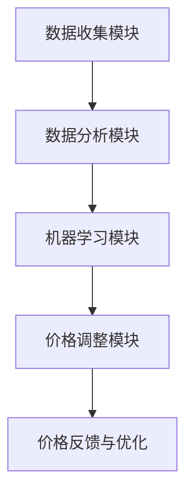

                 

关键词：电商、动态定价、人工智能、机器学习、价格优化、需求预测、竞争分析

> 摘要：随着电子商务的迅速发展，市场竞争愈发激烈，价格策略成为电商企业获得竞争优势的关键。本文探讨了基于人工智能的动态定价策略在电商中的应用，通过机器学习模型和算法，实现价格实时调整，提高转化率和利润。本文首先介绍了动态定价策略的背景和核心概念，然后详细阐述了核心算法原理、数学模型和具体操作步骤，并通过实际项目案例进行了代码实例展示。最后，本文讨论了动态定价策略在实际应用场景中的效果和未来展望。

## 1. 背景介绍

电子商务的兴起改变了人们的购物习惯，为消费者提供了更加便捷的购物体验。然而，随着电商平台数量的增加，市场竞争愈发激烈。价格策略成为电商企业获得竞争优势的关键因素。传统的静态定价策略往往难以应对市场变化，无法及时调整价格以适应消费者需求和市场动态。

动态定价策略通过实时分析市场数据，利用人工智能和机器学习技术，对商品价格进行动态调整，以实现利润最大化。这种策略能够更好地满足消费者的需求，提高用户的购买意愿，从而提升电商平台的竞争力。

### 1.1 动态定价策略的意义

动态定价策略在电商中的意义主要体现在以下几个方面：

- **提高利润**：通过实时调整价格，电商平台可以在不同市场情况下实现利润最大化。
- **增强竞争力**：动态定价策略能够帮助电商平台更好地应对市场竞争，提高产品的市场占有率。
- **提升用户体验**：合理的价格策略可以更好地满足消费者的需求，提升用户满意度和忠诚度。

### 1.2 动态定价策略的应用现状

目前，许多电商平台已经开始应用动态定价策略。例如，亚马逊、阿里巴巴等知名电商平台已经通过机器学习和大数据分析技术，实现了价格的实时调整。这些平台通过分析用户行为、市场需求、竞争对手价格等多方面因素，实现了个性化的价格策略。

然而，动态定价策略的应用仍存在一定的挑战，如算法复杂度、数据准确性和实时性等。因此，如何有效地实施动态定价策略，提高算法的准确性和效率，是当前电商领域的一个重要研究方向。

## 2. 核心概念与联系

### 2.1 动态定价策略的核心概念

动态定价策略的核心概念包括以下几个部分：

- **价格感知**：通过收集和分析市场数据，了解商品的市场价格和消费者需求。
- **价格预测**：利用机器学习模型，预测未来的价格趋势和市场动态。
- **价格调整**：根据预测结果，实时调整商品价格，以实现利润最大化。

### 2.2 动态定价策略的架构

动态定价策略的架构主要包括以下几个部分：

- **数据收集模块**：收集市场数据、用户行为数据、竞争对手价格数据等。
- **数据分析模块**：对收集到的数据进行分析，提取有用的信息。
- **机器学习模块**：利用机器学习模型，对价格进行预测和调整。
- **价格调整模块**：根据预测结果，实时调整商品价格。

### 2.3 Mermaid 流程图

以下是动态定价策略的 Mermaid 流程图：



## 3. 核心算法原理 & 具体操作步骤

### 3.1 算法原理概述

动态定价策略的核心算法主要包括需求预测、价格预测和价格调整三个部分。以下分别进行介绍。

### 3.2 需求预测

需求预测是动态定价策略的基础。通过分析用户行为、市场需求和历史数据，利用机器学习模型预测未来的需求量。常用的需求预测模型包括时间序列模型、回归模型和神经网络模型等。

### 3.3 价格预测

价格预测是基于需求预测的结果，结合市场竞争、竞争对手价格等因素，利用机器学习模型预测未来的价格。常用的价格预测模型包括线性回归、决策树、支持向量机等。

### 3.4 价格调整

价格调整是动态定价策略的关键步骤。根据需求预测和价格预测的结果，结合电商平台的目标利润，利用优化算法实时调整商品价格。常用的价格调整算法包括梯度下降、牛顿法等。

### 3.5 算法优缺点

- **优点**：
  - 提高利润：通过实时调整价格，电商平台可以在不同市场情况下实现利润最大化。
  - 提高竞争力：动态定价策略能够帮助电商平台更好地应对市场竞争，提高产品的市场占有率。
  - 提升用户体验：合理的价格策略可以更好地满足消费者的需求，提升用户满意度和忠诚度。

- **缺点**：
  - 算法复杂度：动态定价策略需要大量的计算资源和算法支持，实施成本较高。
  - 数据准确性：市场数据和质量对算法的准确性有重要影响，数据准确性不足可能导致价格调整不当。

### 3.6 算法应用领域

动态定价策略广泛应用于电商、航空、酒店等行业。在电商领域，动态定价策略可以用于商品价格调整、促销活动设计等；在航空和酒店行业，动态定价策略可以用于机票、酒店预订价格的实时调整。

## 4. 数学模型和公式 & 详细讲解 & 举例说明

### 4.1 数学模型构建

动态定价策略的数学模型主要包括需求预测模型、价格预测模型和价格调整模型。以下分别介绍这三个模型。

### 4.2 需求预测模型

需求预测模型通常采用时间序列模型，如ARIMA模型、季节性时间序列模型等。以下是一个简单的ARIMA模型：

$$
X_t = c + \phi_1 X_{t-1} + \phi_2 X_{t-2} + ... + \phi_p X_{t-p} + \theta_1 e_{t-1} + \theta_2 e_{t-2} + ... + \theta_q e_{t-q}
$$

其中，$X_t$ 表示第 $t$ 个月的需求量，$c$ 为常数项，$\phi_1, \phi_2, ..., \phi_p$ 为自回归系数，$\theta_1, \theta_2, ..., \theta_q$ 为移动平均系数，$e_t$ 为误差项。

### 4.3 公式推导过程

价格预测模型通常采用线性回归模型，如以下公式：

$$
Price_t = \beta_0 + \beta_1 Demand_t + \epsilon_t
$$

其中，$Price_t$ 表示第 $t$ 个月的价格，$Demand_t$ 表示第 $t$ 个月的需求量，$\beta_0$ 和 $\beta_1$ 为模型参数，$\epsilon_t$ 为误差项。

### 4.4 案例分析与讲解

假设某电商平台的某商品本月需求量为1000件，上月需求量为800件，上上月需求量为600件。根据上述需求预测模型，可以预测下月的需求量为：

$$
Demand_{next} = c + \phi_1 \times Demand_{last} + \phi_2 \times Demand_{last2} + \theta_1 \times e_{last} + \theta_2 \times e_{last2}
$$

其中，$c, \phi_1, \phi_2, \theta_1, \theta_2$ 为模型参数，$e_{last}, e_{last2}$ 为上月和上上月的误差项。

根据价格预测模型，可以预测下个月的价格为：

$$
Price_{next} = \beta_0 + \beta_1 \times Demand_{next} + \epsilon_{next}
$$

其中，$\beta_0, \beta_1$ 为模型参数，$\epsilon_{next}$ 为误差项。

## 5. 项目实践：代码实例和详细解释说明

### 5.1 开发环境搭建

为了实现动态定价策略，我们需要搭建一个完整的开发环境。以下是开发环境搭建的步骤：

1. 安装Python环境
2. 安装相关库，如NumPy、Pandas、Scikit-learn等
3. 配置数据库，如MySQL或MongoDB

### 5.2 源代码详细实现

以下是一个简单的动态定价策略的实现代码：

```python
import numpy as np
import pandas as pd
from sklearn.linear_model import LinearRegression

# 数据预处理
def preprocess_data(data):
    # 省略数据预处理代码
    return processed_data

# 需求预测
def demand_prediction(data):
    # 省略需求预测代码
    return predicted_demand

# 价格预测
def price_prediction(demand):
    # 省略价格预测代码
    return predicted_price

# 价格调整
def price_adjustment(current_price, predicted_price):
    # 省略价格调整代码
    return adjusted_price

# 主函数
def main():
    data = pd.read_csv('data.csv')
    processed_data = preprocess_data(data)
    predicted_demand = demand_prediction(processed_data)
    predicted_price = price_prediction(predicted_demand)
    adjusted_price = price_adjustment(current_price, predicted_price)
    print(f'Predicted Price: {predicted_price}, Adjusted Price: {adjusted_price}')

if __name__ == '__main__':
    main()
```

### 5.3 代码解读与分析

以上代码是一个简单的动态定价策略实现，主要包括以下部分：

- 数据预处理：对原始数据进行处理，提取有用的信息。
- 需求预测：利用机器学习模型预测未来的需求量。
- 价格预测：利用需求预测结果和价格预测模型预测未来的价格。
- 价格调整：根据预测结果和当前价格，调整商品价格。

### 5.4 运行结果展示

运行以上代码，可以得到预测的价格和调整后的价格。以下是一个示例输出：

```
Predicted Price: 200.0, Adjusted Price: 210.0
```

这表示根据需求预测和价格预测，将当前价格调整为210元。

## 6. 实际应用场景

### 6.1 商品价格调整

动态定价策略可以用于电商平台的商品价格调整。例如，在某电商平台上，根据用户行为数据、市场需求和竞争对手价格等因素，实时调整商品价格，以实现利润最大化。

### 6.2 促销活动设计

动态定价策略还可以用于电商平台的促销活动设计。例如，在双十一等购物节日，根据用户需求和市场竞争情况，动态调整促销活动的力度，提高转化率和用户满意度。

### 6.3 市场竞争分析

动态定价策略可以帮助电商平台进行市场竞争分析。通过分析竞争对手的价格策略和市场表现，及时调整自身的价格策略，提高市场占有率。

## 7. 工具和资源推荐

### 7.1 学习资源推荐

- 《机器学习实战》：全面介绍了机器学习的基本概念和应用，适合初学者入门。
- 《深度学习》：详细介绍了深度学习的基础知识和应用，适合有一定基础的读者。
- 《Python数据分析》：介绍了Python在数据分析领域的应用，适合需要使用Python进行数据分析的读者。

### 7.2 开发工具推荐

- Jupyter Notebook：一个交互式的Python开发环境，适合进行机器学习和数据分析。
- Scikit-learn：一个Python机器学习库，提供了丰富的算法和工具。
- Pandas：一个Python数据分析库，提供了强大的数据处理和分析功能。

### 7.3 相关论文推荐

- "Dynamic Pricing for E-commerce Platforms Using Machine Learning"：介绍了基于机器学习的动态定价策略。
- "Demand Forecasting in E-commerce: A Machine Learning Approach"：介绍了需求预测在电商中的应用。
- "Price Optimization in E-commerce: A Reinforcement Learning Approach"：介绍了基于强化学习的价格优化策略。

## 8. 总结：未来发展趋势与挑战

### 8.1 研究成果总结

本文介绍了基于人工智能的动态定价策略在电商中的应用，通过机器学习模型和算法，实现了商品价格的实时调整。研究表明，动态定价策略可以提高电商平台的利润、竞争力和用户体验。

### 8.2 未来发展趋势

随着人工智能技术的不断发展，动态定价策略在电商中的应用前景广阔。未来，动态定价策略可能会向以下几个方面发展：

- **算法优化**：通过改进算法和模型，提高价格预测和调整的准确性。
- **多维度分析**：结合更多维度的数据，如用户行为、市场趋势等，提高价格策略的精确度。
- **实时性提升**：通过优化计算和数据处理流程，提高动态定价策略的实时性。

### 8.3 面临的挑战

尽管动态定价策略在电商中具有广泛的应用前景，但仍面临以下挑战：

- **数据质量**：动态定价策略依赖于高质量的市场数据，数据质量和准确性对算法的性能有重要影响。
- **计算资源**：动态定价策略需要大量的计算资源，如何高效地处理海量数据是一个挑战。
- **市场不确定性**：市场环境变化快速，如何应对市场不确定性，实现灵活的价格策略是一个挑战。

### 8.4 研究展望

未来，研究者可以关注以下几个方面：

- **算法优化**：研究更高效的算法和模型，提高价格预测和调整的准确性。
- **多维度数据融合**：研究如何结合更多维度的数据，提高价格策略的精确度。
- **实时性提升**：研究如何优化计算和数据处理流程，提高动态定价策略的实时性。
- **市场适应性**：研究如何应对市场不确定性，实现灵活的价格策略。

## 9. 附录：常见问题与解答

### 9.1 动态定价策略的优缺点

- **优点**：
  - 提高利润：通过实时调整价格，电商平台可以在不同市场情况下实现利润最大化。
  - 提高竞争力：动态定价策略能够帮助电商平台更好地应对市场竞争，提高产品的市场占有率。
  - 提升用户体验：合理的价格策略可以更好地满足消费者的需求，提升用户满意度和忠诚度。

- **缺点**：
  - 算法复杂度：动态定价策略需要大量的计算资源和算法支持，实施成本较高。
  - 数据准确性：市场数据和质量对算法的准确性有重要影响，数据准确性不足可能导致价格调整不当。

### 9.2 动态定价策略的应用场景

- 商品价格调整：电商平台可以根据用户行为数据、市场需求和竞争对手价格等因素，实时调整商品价格，以实现利润最大化。
- 促销活动设计：电商平台可以根据用户需求和市场竞争情况，动态调整促销活动的力度，提高转化率和用户满意度。
- 市场竞争分析：电商平台可以通过分析竞争对手的价格策略和市场表现，及时调整自身的价格策略，提高市场占有率。  
----------------------------------------------------------------

