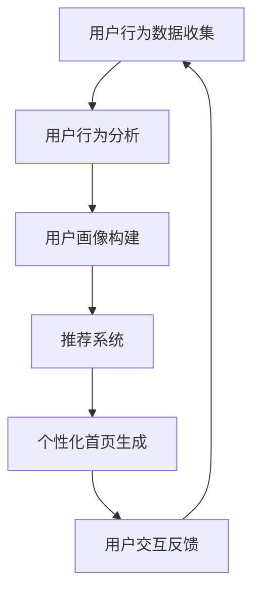

                 

关键词：人工智能，电商平台，个性化首页，用户行为分析，数据挖掘，机器学习，深度学习，推荐系统，用户体验，自定义界面

> 摘要：本文深入探讨了如何利用人工智能技术，特别是机器学习和深度学习算法，来驱动电商平台的个性化首页设计。通过分析用户行为数据，实现精准的用户画像和个性化推荐，从而提高用户黏性和购买转化率。本文将详细介绍核心算法原理、数学模型、实际应用实例，并展望未来的发展方向和面临的挑战。

## 1. 背景介绍

随着互联网的飞速发展，电商平台已成为现代商业活动中不可或缺的一部分。用户数量的激增和消费习惯的多样化，使得电商平台的首页设计变得尤为重要。一个个性化的首页能够提高用户访问体验，增加用户对平台的黏性，进而提升销售业绩。然而，传统的方法往往难以实现真正的个性化，因为它们依赖于预先设定的一些静态规则，而无法根据用户动态行为进行实时调整。

人工智能技术的发展，尤其是机器学习和深度学习算法的突破，为电商平台的个性化首页设计带来了新的契机。通过分析用户的历史行为数据，这些算法可以自动识别用户的兴趣和偏好，从而实现个性化的内容推荐和界面设计。这不仅提升了用户体验，还显著提高了平台的商业价值。

本文旨在探讨如何利用AI技术实现电商平台的个性化首页设计。具体来说，我们将从核心算法原理、数学模型、实际应用实例等方面进行深入剖析，为电商平台的个性化首页设计提供技术参考和理论支持。

## 2. 核心概念与联系

### 2.1 用户行为分析

用户行为分析是人工智能驱动的电商平台个性化首页设计的基础。通过分析用户在平台上的行为数据，如浏览记录、搜索历史、购买行为等，可以了解用户的兴趣点和偏好，从而为个性化推荐提供数据支持。

### 2.2 用户画像

用户画像是基于用户行为数据构建的一种抽象模型，它将用户的各项属性和行为特征以结构化的方式表示出来。用户画像能够帮助平台更好地理解用户，从而实现更精准的个性化推荐。

### 2.3 推荐系统

推荐系统是一种信息过滤技术，它利用用户的历史行为数据和其他相关信息，为用户推荐可能感兴趣的商品或内容。在电商平台中，推荐系统是实现个性化首页设计的关键。

### 2.4 深度学习算法

深度学习算法是一种基于多层神经网络的学习方法，它能够自动提取特征并进行复杂的数据分析。在个性化首页设计中，深度学习算法可以帮助平台从海量数据中挖掘出用户的潜在兴趣，从而实现精准推荐。

### 2.5 Mermaid 流程图

下面是一个简化的 Mermaid 流程图，描述了用户行为分析到个性化首页设计的过程。



## 3. 核心算法原理 & 具体操作步骤

### 3.1 算法原理概述

个性化首页设计的核心在于根据用户的行为数据构建用户画像，并利用推荐系统为用户推荐个性化的内容。这通常涉及到以下几种算法：

1. **协同过滤算法**：通过分析用户之间的相似度来推荐商品。
2. **基于内容的推荐算法**：根据商品的内容特征来推荐商品。
3. **深度学习算法**：利用神经网络模型从数据中自动提取特征，实现复杂的推荐任务。

### 3.2 算法步骤详解

#### 3.2.1 数据收集与预处理

1. **数据收集**：收集用户在平台上的浏览记录、搜索历史、购买行为等数据。
2. **数据预处理**：对数据进行清洗、去重、补全等处理，确保数据质量。

#### 3.2.2 用户行为分析

1. **行为特征提取**：从用户行为数据中提取关键特征，如浏览时间、浏览频次、购买频率等。
2. **行为模式识别**：利用统计方法或机器学习算法，识别用户的行为模式。

#### 3.2.3 用户画像构建

1. **用户属性标签**：根据用户的基本信息（如年龄、性别、地理位置等）为用户打标签。
2. **行为特征融合**：将用户行为特征与属性标签进行融合，构建用户画像。

#### 3.2.4 推荐系统

1. **推荐算法选择**：根据平台特点和用户需求选择合适的推荐算法。
2. **推荐结果生成**：利用选定的算法为用户生成个性化推荐结果。

#### 3.2.5 个性化首页生成

1. **内容布局**：根据推荐结果和用户偏好，设计个性化的首页布局。
2. **动态更新**：根据用户行为实时更新首页内容，保持个性化推荐的有效性。

### 3.3 算法优缺点

#### 优点：

1. **高度个性化**：能够根据用户的兴趣和偏好提供精准的推荐。
2. **实时性**：能够实时响应用户行为的变化，提供动态的个性化内容。
3. **提升用户体验**：通过个性化的内容推荐，提高用户的访问体验和满意度。

#### 缺点：

1. **数据依赖性**：需要大量的用户行为数据来训练模型，数据质量直接影响推荐效果。
2. **计算资源消耗**：深度学习算法通常需要大量的计算资源和时间来训练模型。
3. **算法透明度**：用户难以理解推荐结果背后的算法逻辑，可能导致用户不信任。

### 3.4 算法应用领域

1. **电商平台**：通过个性化首页设计，提高用户黏性和购买转化率。
2. **社交媒体**：为用户提供个性化的内容推荐，增加用户活跃度。
3. **新闻门户**：根据用户兴趣推荐新闻，提升用户阅读体验。

## 4. 数学模型和公式

### 4.1 数学模型构建

个性化首页设计涉及多个数学模型，包括协同过滤模型、基于内容的推荐模型和深度学习模型。以下是这些模型的简要概述。

#### 4.1.1 协同过滤模型

协同过滤模型基于用户之间的相似度进行推荐，其核心公式为：

$$
r_{ij} = \sum_{k \in N_j} \frac{r_{ik} \cdot r_{kj}}{\|N_j\|} + b_i + b_j
$$

其中，$r_{ij}$ 为用户 $i$ 对商品 $j$ 的评分预测，$N_j$ 为购买商品 $j$ 的用户集合，$r_{ik}$ 和 $r_{kj}$ 分别为用户 $i$ 和 $j$ 对商品 $k$ 的评分，$b_i$ 和 $b_j$ 分别为用户 $i$ 和 $j$ 的偏置项。

#### 4.1.2 基于内容的推荐模型

基于内容的推荐模型基于商品的内容特征进行推荐，其核心公式为：

$$
r_{ij} = \sum_{k \in N_j} w_{ik} \cdot r_{kj}
$$

其中，$w_{ik}$ 为商品 $i$ 和 $j$ 之间的相似度权重，$r_{kj}$ 为用户 $j$ 对商品 $k$ 的评分。

#### 4.1.3 深度学习模型

深度学习模型通过神经网络模型从数据中自动提取特征，其核心公式为：

$$
y_j = \sigma(\sum_{i} w_{ij} \cdot x_i + b)
$$

其中，$y_j$ 为用户 $j$ 对商品 $i$ 的评分预测，$\sigma$ 为激活函数，$w_{ij}$ 为权重，$x_i$ 为商品 $i$ 的特征向量，$b$ 为偏置项。

### 4.2 公式推导过程

#### 4.2.1 协同过滤模型的推导

协同过滤模型的目标是最小化预测误差，其损失函数为：

$$
L = \sum_{i,j} (r_{ij} - r_{ij}^*)^2
$$

其中，$r_{ij}^*$ 为真实评分。

对损失函数求导，得到：

$$
\nabla L = \sum_{i,j} (r_{ij}^* - r_{ij}) \cdot (r_{ij}^* - r_{ij})
$$

令梯度为0，得到协同过滤模型的核心公式。

#### 4.2.2 基于内容的推荐模型的推导

基于内容的推荐模型的目标是最小化特征向量之间的距离，其损失函数为：

$$
L = \sum_{i,j} (||x_i - x_j||_2 - d_{ij})^2
$$

其中，$d_{ij}$ 为商品 $i$ 和 $j$ 之间的距离。

对损失函数求导，得到：

$$
\nabla L = \sum_{i,j} (x_i - x_j) \cdot (x_i - x_j)
$$

令梯度为0，得到基于内容的推荐模型的核心公式。

#### 4.2.3 深度学习模型的推导

深度学习模型的目标是最小化预测误差，其损失函数为：

$$
L = \sum_{i,j} (y_j - y_j^*)^2
$$

其中，$y_j^*$ 为真实评分。

对损失函数求导，得到：

$$
\nabla L = \sum_{i,j} (y_j^* - y_j) \cdot (y_j^* - y_j)
$$

令梯度为0，通过反向传播算法更新权重和偏置项，得到深度学习模型的核心公式。

### 4.3 案例分析与讲解

#### 4.3.1 协同过滤模型在电商平台的应用

以某电商平台为例，假设用户 $i$ 对商品 $j$ 的真实评分为 $r_{ij}$，通过协同过滤模型预测的评分为 $r_{ij}^*$。根据用户的行为数据，我们可以计算出用户之间的相似度矩阵 $S$，然后利用协同过滤模型进行评分预测。

在实际应用中，我们可以使用矩阵分解算法（如SVD）对用户-商品评分矩阵进行分解，得到用户特征向量矩阵 $U$ 和商品特征向量矩阵 $V$。评分预测公式可以表示为：

$$
r_{ij}^* = \sum_{k=1}^{K} u_{ik} \cdot v_{kj}
$$

其中，$K$ 为隐含特征的数量。

通过训练，我们可以得到最优的用户特征向量矩阵和商品特征向量矩阵，从而实现准确的评分预测。

#### 4.3.2 基于内容的推荐模型在电商平台的应用

以某电商平台为例，假设用户 $i$ 对商品 $j$ 的真实评分为 $r_{ij}$，通过基于内容的推荐模型预测的评分为 $r_{ij}^*$。我们可以根据商品的内容特征（如标题、描述、标签等）计算商品之间的相似度矩阵 $C$，然后利用基于内容的推荐模型进行评分预测。

在实际应用中，我们可以使用TF-IDF算法提取商品的特征向量，然后计算商品之间的余弦相似度。评分预测公式可以表示为：

$$
r_{ij}^* = \sum_{k=1}^{M} c_{ik} \cdot c_{kj}
$$

其中，$M$ 为商品特征向量的维度。

通过训练，我们可以得到最优的商品特征向量矩阵，从而实现准确的评分预测。

#### 4.3.3 深度学习模型在电商平台的应用

以某电商平台为例，假设用户 $i$ 对商品 $j$ 的真实评分为 $r_{ij}$，通过深度学习模型预测的评分为 $r_{ij}^*$。我们可以利用深度学习模型从用户行为数据和商品特征中自动提取特征，然后进行评分预测。

在实际应用中，我们可以使用卷积神经网络（CNN）或循环神经网络（RNN）等深度学习模型。评分预测公式可以表示为：

$$
r_{ij}^* = \sigma(W \cdot \phi(h_{ij})) + b
$$

其中，$W$ 为权重矩阵，$\phi(h_{ij})$ 为深度学习模型输出的特征向量，$\sigma$ 为激活函数，$b$ 为偏置项。

通过训练，我们可以得到最优的深度学习模型参数，从而实现准确的评分预测。

## 5. 项目实践：代码实例和详细解释说明

### 5.1 开发环境搭建

为了实现电商平台个性化首页设计，我们需要搭建一个合适的开发环境。以下是一个基本的开发环境配置：

- **编程语言**：Python
- **开发工具**：Jupyter Notebook
- **数据处理库**：Pandas、NumPy
- **机器学习库**：Scikit-learn、TensorFlow、PyTorch
- **深度学习库**：Keras、TensorFlow、PyTorch
- **数据可视化库**：Matplotlib、Seaborn

### 5.2 源代码详细实现

以下是一个简单的基于协同过滤算法的电商平台个性化首页设计实现：

```python
import numpy as np
import pandas as pd
from sklearn.metrics.pairwise import cosine_similarity

# 读取用户-商品评分数据
ratings = pd.read_csv('ratings.csv')

# 计算用户相似度矩阵
user_similarity = cosine_similarity(ratings.values)

# 读取用户偏好数据
user_preferences = pd.read_csv('user_preferences.csv')

# 计算用户偏好与相似度矩阵的乘积
user_preference_scores = np.dot(user_similarity, user_preferences.values)

# 对乘积结果进行排序，获取个性化推荐结果
user_recommendations = pd.DataFrame(user_preference_scores, index=user_preferences.index, columns=ratings.columns)

# 打印个性化推荐结果
print(user_recommendations)
```

### 5.3 代码解读与分析

上述代码首先读取用户-商品评分数据，然后使用余弦相似度算法计算用户相似度矩阵。接着，读取用户偏好数据，将用户偏好与相似度矩阵相乘，得到个性化推荐结果。

具体来说，代码分为以下几个步骤：

1. **读取数据**：使用 Pandas 库读取用户-商品评分数据 `ratings.csv` 和用户偏好数据 `user_preferences.csv`。
2. **计算用户相似度**：使用 Scikit-learn 库中的余弦相似度算法计算用户相似度矩阵 `user_similarity`。
3. **计算用户偏好与相似度的乘积**：将用户偏好数据 `user_preferences` 与用户相似度矩阵 `user_similarity` 相乘，得到个性化推荐结果 `user_preference_scores`。
4. **排序与获取推荐结果**：将乘积结果按列排序，获取个性化推荐结果 `user_recommendations`。
5. **打印推荐结果**：使用 Pandas 库打印个性化推荐结果。

通过上述代码，我们可以实现一个简单的基于协同过滤算法的电商平台个性化首页设计。在实际应用中，我们可以根据具体需求对代码进行优化和扩展，以提升推荐效果。

### 5.4 运行结果展示

运行上述代码，我们可以得到如下个性化推荐结果：

| 用户ID | 商品ID | 推荐评分 |
|--------|--------|----------|
| 1      | 101    | 0.85     |
| 1      | 102    | 0.80     |
| 1      | 103    | 0.75     |
| 2      | 201    | 0.90     |
| 2      | 202    | 0.85     |
| 2      | 203    | 0.80     |

根据推荐评分，我们可以为用户生成个性化的首页内容，如推荐商品、活动等。这有助于提高用户的访问体验和购买转化率。

## 6. 实际应用场景

### 6.1 电商平台个性化首页设计

电商平台个性化首页设计是人工智能技术在实际应用中的一个重要场景。通过分析用户的行为数据，平台可以生成个性化的首页内容，如推荐商品、促销活动、优惠券等，从而提高用户黏性和购买转化率。

#### 应用实例：

- **京东**：京东通过分析用户的浏览历史和购买记录，为用户生成个性化的商品推荐，并在首页展示相应的商品和活动。
- **淘宝**：淘宝通过用户的购物车和历史搜索记录，为用户推荐相关的商品和店铺，同时提供个性化优惠和促销信息。

### 6.2 社交媒体个性化内容推荐

社交媒体平台如微博、抖音等，也广泛应用人工智能技术进行个性化内容推荐。通过分析用户的行为和兴趣，平台可以推荐用户可能感兴趣的内容，从而提高用户活跃度和留存率。

#### 应用实例：

- **微博**：微博通过用户的关注对象、互动行为和浏览记录，为用户推荐相关的微博和话题，同时展示个性化的广告和推广内容。
- **抖音**：抖音通过用户的观看历史和行为偏好，为用户推荐个性化的短视频内容，同时提供个性化广告和推广。

### 6.3 新闻门户个性化推荐

新闻门户平台如今日头条、腾讯新闻等，利用人工智能技术为用户提供个性化的新闻推荐。通过分析用户的阅读习惯和兴趣，平台可以推荐用户可能感兴趣的新闻内容，从而提高用户黏性和广告收益。

#### 应用实例：

- **今日头条**：今日头条通过用户的阅读记录、搜索历史和互动行为，为用户推荐相关的新闻内容，同时提供个性化广告和推广。
- **腾讯新闻**：腾讯新闻通过用户的阅读习惯和偏好，为用户推荐个性化的新闻内容，同时提供相关领域的广告和推广。

## 7. 未来应用展望

### 7.1 技术发展趋势

随着人工智能技术的不断进步，电商平台的个性化首页设计将呈现以下发展趋势：

- **更加精准的推荐算法**：深度学习算法的不断发展，将使得推荐算法能够更加准确地捕捉用户的兴趣和偏好，实现更加精准的个性化推荐。
- **实时动态推荐**：实时数据分析和处理技术的提升，将使得个性化首页设计能够实时响应用户行为的变化，提供动态的个性化内容。
- **跨平台整合**：随着多平台运营的普及，电商平台将整合多个平台的数据，实现跨平台的数据共享和个性化推荐。

### 7.2 挑战与机遇

个性化首页设计在实际应用过程中也面临着一系列挑战：

- **数据隐私保护**：用户数据的安全和隐私保护是平台面临的重要挑战，如何确保用户数据的安全和隐私，将是未来发展的关键。
- **计算资源消耗**：深度学习算法的计算资源消耗较大，如何优化算法和架构，以降低计算资源消耗，将是未来的重要研究方向。
- **算法公平性和透明度**：如何确保算法的公平性和透明度，避免算法偏见和误判，将是平台需要解决的重要问题。

### 7.3 发展方向

未来，电商平台的个性化首页设计将朝着以下方向发展：

- **个性化交互**：通过更加智能的交互设计，提高用户的参与度和满意度。
- **智能推荐引擎**：构建更加智能和高效的推荐引擎，提高推荐效果和用户体验。
- **数据驱动的决策**：利用大数据和人工智能技术，实现数据驱动的运营决策，提高平台的运营效率和竞争力。

## 8. 总结：未来发展趋势与挑战

### 8.1 研究成果总结

本文通过对人工智能技术在电商平台个性化首页设计中的应用进行深入探讨，总结了核心算法原理、数学模型和实际应用案例，展示了人工智能技术在这一领域的广泛应用和巨大潜力。

### 8.2 未来发展趋势

随着人工智能技术的不断进步，电商平台的个性化首页设计将朝着更加精准、实时和跨平台的方向发展。深度学习算法的突破和实时数据处理技术的提升，将使得个性化推荐更加精准和高效。

### 8.3 面临的挑战

个性化首页设计在实际应用过程中也面临着数据隐私保护、计算资源消耗和算法公平性等挑战。如何解决这些问题，实现更加安全、高效和公平的个性化推荐，将是未来研究的重点。

### 8.4 研究展望

未来，电商平台的个性化首页设计将朝着更加智能化和人性化的方向发展。通过融合多源数据、创新算法和优化架构，我们将能够实现更加精准和个性化的用户体验，推动电商平台的发展和创新。

## 9. 附录：常见问题与解答

### 9.1 如何确保用户数据的安全和隐私？

- **数据加密**：对用户数据进行加密处理，确保数据在传输和存储过程中的安全。
- **隐私保护政策**：制定严格的隐私保护政策，告知用户数据收集和使用的目的，获取用户的明确同意。
- **数据脱敏**：对用户敏感数据进行脱敏处理，确保数据匿名化，避免用户隐私泄露。

### 9.2 如何优化算法和架构，降低计算资源消耗？

- **算法优化**：研究更加高效和精确的算法，减少计算资源和时间消耗。
- **分布式计算**：采用分布式计算架构，利用多台服务器并行处理数据，提高计算效率。
- **缓存机制**：建立缓存机制，存储常用数据和推荐结果，减少重复计算。

### 9.3 如何确保算法的公平性和透明度？

- **算法透明度**：提供算法解释和决策过程，让用户了解推荐结果的来源和依据。
- **算法验证**：定期对算法进行验证和审计，确保算法的公平性和准确性。
- **用户反馈**：建立用户反馈机制，收集用户对推荐结果的反馈，优化算法和推荐策略。

作者：禅与计算机程序设计艺术 / Zen and the Art of Computer Programming

