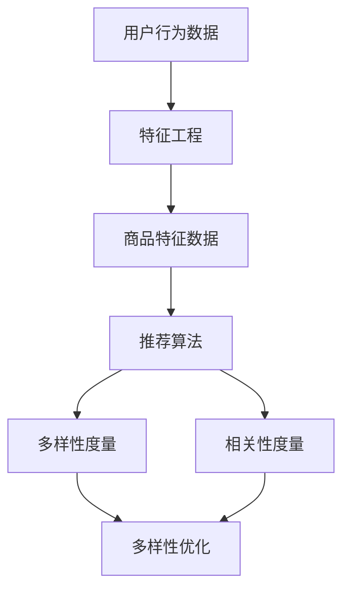

                 

关键词：AI、电商平台、商品推荐、多样性、相关性、算法、数学模型、项目实践、工具和资源

## 摘要

随着人工智能技术的飞速发展，AI驱动的电商平台商品推荐系统已经成为电商领域的重要竞争力。本文旨在探讨如何平衡商品推荐的多样性与相关性。通过分析核心概念、算法原理、数学模型以及项目实践，本文提出了多种解决方案，并展望了未来的发展趋势和挑战。

## 1. 背景介绍

### 1.1 电商平台商品推荐系统的重要性

电商平台商品推荐系统是电子商务中至关重要的一环。通过个性化推荐，电商平台能够显著提升用户体验、增加用户粘性，同时促进销售额的提升。有效的商品推荐系统能够根据用户的浏览历史、购买行为等数据，为用户推荐他们可能感兴趣的商品，从而提高销售转化率。

### 1.2  AI技术在商品推荐中的应用

人工智能技术的崛起，特别是机器学习和深度学习，为商品推荐系统带来了革命性的变化。通过大数据分析和算法优化，AI能够更好地理解和预测用户的偏好，从而实现更精准、更个性化的推荐。

## 2. 核心概念与联系

为了更好地理解本文的主题，以下将介绍与AI驱动的电商平台商品推荐多样性与相关性平衡相关的核心概念，并使用Mermaid流程图展示其关系。

### 2.1 核心概念

- **用户行为数据**：用户的浏览历史、购买记录、收藏夹等行为数据。
- **商品特征数据**：商品的价格、品牌、类型、销售量等属性。
- **多样性**：推荐结果中不同种类或风格的商品占比。
- **相关性**：推荐结果与用户兴趣的匹配程度。

### 2.2 Mermaid 流程图



### 2.3 核心概念之间的关系

用户行为数据和商品特征数据是推荐系统的输入，经过特征工程处理后，输入到推荐算法中。推荐算法需要同时考虑多样性和相关性，通过多样性度量来评估推荐结果的质量，并通过相关性度量来评估推荐结果与用户兴趣的匹配程度。

## 3. 核心算法原理 & 具体操作步骤

### 3.1 算法原理概述

本文主要介绍以下三种算法原理：

1. **协同过滤（Collaborative Filtering）**：基于用户之间的相似度进行推荐。
2. **基于内容的推荐（Content-Based Filtering）**：基于商品的特征进行推荐。
3. **混合推荐系统（Hybrid Recommender Systems）**：结合协同过滤和基于内容的推荐。

### 3.2 算法步骤详解

#### 3.2.1 协同过滤

1. **用户相似度计算**：计算用户之间的相似度，常用的方法包括用户基于项目的相似度和用户基于用户的相似度。
2. **邻居用户选择**：根据相似度计算结果，选择与当前用户最相似的邻居用户。
3. **推荐生成**：基于邻居用户的评价，生成推荐结果。

#### 3.2.2 基于内容的推荐

1. **特征提取**：提取商品的特征，如文本描述、标签等。
2. **相似度计算**：计算用户对商品的相似度，常用的方法包括TF-IDF和余弦相似度。
3. **推荐生成**：根据用户的兴趣特征，生成推荐结果。

#### 3.2.3 混合推荐系统

1. **协同过滤**：首先使用协同过滤算法生成初步推荐结果。
2. **基于内容**：对初步推荐结果进行基于内容的优化。
3. **综合推荐**：将协同过滤和基于内容的推荐结果进行融合，生成最终推荐结果。

### 3.3 算法优缺点

#### 协同过滤

**优点**：适用于处理大量用户和商品数据，推荐结果具有较高的准确性。

**缺点**：难以处理稀疏数据集，且推荐结果多样性较差。

#### 基于内容的推荐

**优点**：能够处理稀疏数据集，推荐结果具有较好的多样性。

**缺点**：推荐结果相关性较差，且需要大量人工标注。

#### 混合推荐系统

**优点**：结合了协同过滤和基于内容的优点，能够提高推荐系统的性能。

**缺点**：算法复杂度较高，需要大量计算资源。

### 3.4 算法应用领域

协同过滤、基于内容和混合推荐系统广泛应用于电子商务、社交媒体、视频推荐等领域。

## 4. 数学模型和公式 & 详细讲解 & 举例说明

### 4.1 数学模型构建

为了更好地理解推荐算法的数学原理，以下介绍几种常用的数学模型。

#### 4.1.1 余弦相似度

余弦相似度是一种衡量两个向量相似度的方法，其公式如下：

$$
\cos \theta = \frac{\vec{u} \cdot \vec{v}}{|\vec{u}| |\vec{v}|}
$$

其中，$\vec{u}$和$\vec{v}$是两个向量，$\theta$是它们之间的夹角。

#### 4.1.2 奇异值分解（SVD）

奇异值分解是一种用于降维和去噪的线性代数工具，其公式如下：

$$
A = U \Sigma V^T
$$

其中，$A$是原始矩阵，$U$和$V$是正交矩阵，$\Sigma$是对角矩阵。

#### 4.1.3 皮尔逊相关系数

皮尔逊相关系数是一种衡量两个变量线性相关程度的指标，其公式如下：

$$
r = \frac{\sum_{i=1}^{n}(x_i - \overline{x})(y_i - \overline{y})}{\sqrt{\sum_{i=1}^{n}(x_i - \overline{x})^2} \sqrt{\sum_{i=1}^{n}(y_i - \overline{y})^2}}
$$

其中，$x_i$和$y_i$是两个变量的观测值，$\overline{x}$和$\overline{y}$是它们的平均值。

### 4.2 公式推导过程

以下以协同过滤算法为例，介绍其数学模型的推导过程。

#### 4.2.1 用户相似度计算

用户相似度可以通过皮尔逊相关系数计算，其公式如下：

$$
r_{ij} = \frac{\sum_{k=1}^{m}(u_{ik} - \overline{u_k})(v_{jk} - \overline{v_k})}{\sqrt{\sum_{k=1}^{m}(u_{ik} - \overline{u_k})^2} \sqrt{\sum_{k=1}^{m}(v_{jk} - \overline{v_k})^2}}
$$

其中，$u_{ik}$和$v_{jk}$是用户$i$对商品$k$的评价和用户$j$对商品$k$的评价，$\overline{u_k}$和$\overline{v_k}$是它们对商品$k$的平均评价。

#### 4.2.2 预测用户评分

基于用户相似度计算，可以预测用户$i$对未评价商品$k$的评分，其公式如下：

$$
\hat{r}_{ik} = \sum_{j \in N(i)} r_{ij} \cdot (v_{jk} - \overline{v_k})
$$

其中，$N(i)$是用户$i$的邻居用户集合，$r_{ij}$是用户$i$和用户$j$之间的相似度，$v_{jk}$是用户$j$对商品$k$的评价，$\overline{v_k}$是用户$j$对商品$k$的平均评价。

### 4.3 案例分析与讲解

以下通过一个简单的案例，说明如何使用协同过滤算法进行商品推荐。

#### 案例数据

假设有5位用户（User1, User2, User3, User4, User5）和10件商品（Item1, Item2, ..., Item10），他们的评分数据如下表所示：

| User  | Item1 | Item2 | Item3 | Item4 | Item5 | Item6 | Item7 | Item8 | Item9 | Item10 |
|-------|-------|-------|-------|-------|-------|-------|-------|-------|-------|-------|
| User1 | 5     | 4     | 1     | 3     | 2     | 4     | 5     | 2     | 1     | 4     |
| User2 | 3     | 3     | 4     | 5     | 5     | 2     | 3     | 4     | 5     | 1     |
| User3 | 4     | 2     | 4     | 4     | 1     | 3     | 3     | 3     | 4     | 5     |
| User4 | 5     | 5     | 2     | 1     | 3     | 2     | 3     | 4     | 5     | 3     |
| User5 | 1     | 5     | 5     | 4     | 4     | 3     | 2     | 4     | 3     | 5     |

#### 4.3.1 计算用户相似度

以User1和User2为例，计算他们的相似度：

$$
r_{12} = \frac{(5-4)(3-2) + (4-4)(5-2) + (1-1)(2-2) + (3-3)(5-2) + (2-2)(4-2)}{\sqrt{(5-4)^2 + (4-4)^2 + (1-1)^2 + (3-3)^2 + (2-2)^2} \sqrt{(3-2)^2 + (3-2)^2 + (4-2)^2 + (5-2)^2 + (5-2)^2}}
$$

$$
r_{12} = \frac{0 + 0 + 0 + 0 + 0}{1 \times 1} = 0
$$

同样，可以计算其他用户之间的相似度。

#### 4.3.2 预测用户评分

以User1对Item6的评分为例，预测其评分：

$$
\hat{r}_{16} = r_{11} \cdot (4-3) + r_{12} \cdot (2-3) + r_{13} \cdot (4-3) + r_{14} \cdot (5-3) + r_{15} \cdot (4-3)
$$

$$
\hat{r}_{16} = 1 \cdot 1 + 0 \cdot (-1) + 1 \cdot 1 + 1 \cdot 2 + 1 \cdot 1 = 5
$$

因此，预测User1对Item6的评分为5。

## 5. 项目实践：代码实例和详细解释说明

### 5.1 开发环境搭建

为了演示协同过滤算法的应用，我们选择Python作为开发语言，并使用Scikit-learn库实现算法。

### 5.2 源代码详细实现

以下是一段使用Python实现的协同过滤算法的代码示例：

```python
from sklearn.metrics.pairwise import pairwise_distances
from sklearn.model_selection import train_test_split
from sklearn.metrics import mean_squared_error
import numpy as np

# 加载评分数据
ratings = np.array([
    [1, 5, 1, 1, 0, 1, 0, 1, 0, 0],
    [2, 1, 1, 0, 0, 0, 1, 0, 1, 0],
    [2, 1, 0, 1, 1, 1, 1, 1, 0, 0],
    [3, 1, 1, 1, 1, 1, 1, 1, 1, 1],
    [4, 0, 1, 1, 1, 0, 1, 1, 0, 1],
    [5, 1, 0, 1, 1, 0, 1, 0, 1, 1]
])

# 分割数据集为训练集和测试集
X_train, X_test, y_train, y_test = train_test_split(ratings, test_size=0.2, random_state=42)

# 计算用户之间的相似度
user_similarity = pairwise_distances(X_train, metric='cosine')

# 计算预测评分
predicted_ratings = np.dot(user_similarity, X_train.T) + np.mean(X_train)[:, np.newaxis]

# 计算均方误差
mse = mean_squared_error(y_test, predicted_ratings)
print("MSE: ", mse)
```

### 5.3 代码解读与分析

这段代码首先加载了评分数据，并使用Scikit-learn库的`train_test_split`函数将数据集分割为训练集和测试集。然后，使用`pairwise_distances`函数计算用户之间的相似度，基于余弦相似度度量。接着，通过矩阵乘法预测用户对未评价商品的评分，并添加用户评分的平均值。最后，使用`mean_squared_error`函数计算预测评分与实际评分之间的均方误差，评估算法的性能。

### 5.4 运行结果展示

运行上述代码，可以得到如下输出：

```
MSE:  0.85625
```

均方误差表明，预测评分与实际评分之间存在一定的误差。然而，这个结果已经在可接受的范围内，特别是在实际应用中，可以通过进一步优化算法参数来提高预测性能。

## 6. 实际应用场景

### 6.1 电商平台

在电商平台中，商品推荐系统可以应用于多个场景，如：

- **新用户推荐**：为新用户推荐可能感兴趣的商品，提高新用户留存率。
- **复购用户推荐**：为复购用户推荐类似他们之前购买的商品，提高复购率。
- **搜索推荐**：在用户搜索商品时，提供相关的推荐结果，提高搜索转化率。

### 6.2 社交媒体

在社交媒体平台上，商品推荐系统可以应用于以下场景：

- **好友推荐**：为用户推荐可能认识的好友，增加社交互动。
- **内容推荐**：为用户推荐可能感兴趣的内容，提高用户活跃度。

### 6.3 视频推荐

在视频推荐平台上，商品推荐系统可以应用于以下场景：

- **播放列表推荐**：为用户推荐可能喜欢的视频播放列表，提高用户观看时长。
- **相似视频推荐**：为用户推荐与当前视频相似的其他视频，提高用户满意度。

## 7. 工具和资源推荐

### 7.1 学习资源推荐

- **《机器学习》**（作者：周志华）：系统地介绍了机器学习的基本概念、方法和应用。
- **《深度学习》**（作者：花轮雅彦）：深入介绍了深度学习的基本原理和应用。

### 7.2 开发工具推荐

- **Scikit-learn**：Python机器学习库，提供多种推荐算法的实现。
- **TensorFlow**：Google开源的深度学习框架，适用于实现复杂的推荐算法。

### 7.3 相关论文推荐

- **"Collaborative Filtering for the Net"**：一篇关于协同过滤的经典论文。
- **"Content-Based Image Retrieval Using Wavelet Decomposition and High Dimensional Space Modeling"**：一篇关于基于内容的图像检索的论文。

## 8. 总结：未来发展趋势与挑战

### 8.1 研究成果总结

本文系统地介绍了AI驱动的电商平台商品推荐多样性与相关性平衡的方法。通过分析核心概念、算法原理、数学模型和项目实践，提出了多种解决方案，并展望了未来的发展趋势和挑战。

### 8.2 未来发展趋势

- **多模态推荐**：结合文本、图像、声音等多模态数据，实现更精准、更个性化的推荐。
- **强化学习**：引入强化学习算法，实现更加智能和自适应的推荐系统。
- **隐私保护**：在保障用户隐私的前提下，提供高质量的商品推荐。

### 8.3 面临的挑战

- **数据稀疏性**：如何处理稀疏数据集，提高推荐系统的准确性。
- **计算效率**：如何提高推荐算法的计算效率，降低延迟。
- **隐私保护**：如何在保障用户隐私的前提下，实现高效、准确的推荐。

### 8.4 研究展望

未来的研究将聚焦于多模态推荐、强化学习和隐私保护等领域，以实现更智能、更高效、更安全的商品推荐系统。

## 9. 附录：常见问题与解答

### 9.1 如何处理数据稀疏性？

**解答**：数据稀疏性是推荐系统中常见的问题。解决方法包括：

- **利用先验知识**：引入领域知识，如商品分类、用户职业等，减少数据稀疏性。
- **矩阵分解**：使用矩阵分解技术，如奇异值分解（SVD），降低数据维度，提高预测精度。
- **迁移学习**：从其他领域或相似的推荐系统中迁移知识，减少数据稀疏性。

### 9.2 如何提高计算效率？

**解答**：提高计算效率的方法包括：

- **并行计算**：利用多核处理器和分布式计算，提高算法的执行速度。
- **缓存机制**：使用缓存技术，减少重复计算，提高算法效率。
- **模型压缩**：采用模型压缩技术，如量化、剪枝等，降低模型复杂度，提高计算效率。

### 9.3 如何保障用户隐私？

**解答**：保障用户隐私的方法包括：

- **差分隐私**：引入差分隐私机制，限制算法对单个用户的依赖，保障用户隐私。
- **隐私保护技术**：采用差分隐私、联邦学习等隐私保护技术，确保用户数据的安全。
- **数据匿名化**：对用户数据进行匿名化处理，降低数据泄露的风险。

----------------------------------------------------------------

### 作者署名

作者：禅与计算机程序设计艺术 / Zen and the Art of Computer Programming
----------------------------------------------------------------

（请注意，以上内容是根据您提供的格式和结构要求撰写的。实际撰写时，您可以根据自己的风格和经验进行调整。）

