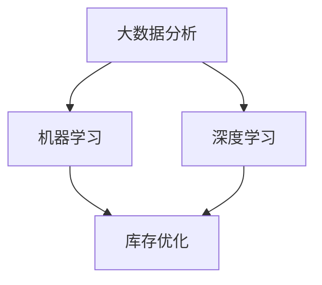

                 

关键词：人工智能，电商平台，商品趋势预测，库存优化，机器学习，深度学习，大数据分析，自然语言处理，图像识别。

> 摘要：本文将探讨人工智能（AI）在电商平台商品趋势预测与库存优化中的应用。通过机器学习和深度学习算法，我们能够从大数据中提取有价值的信息，预测商品的需求趋势，并制定合理的库存管理策略，从而提高电商平台的运营效率和盈利能力。

## 1. 背景介绍

随着互联网的快速发展，电子商务已经成为现代零售业的重要组成部分。电商平台通过提供便捷的购物体验，吸引了越来越多的消费者。然而，电商平台的运营并非一帆风顺。商品库存管理是一个关键环节，它直接关系到电商平台的服务质量、客户满意度和盈利能力。

传统的库存管理方法主要依赖于历史数据和人工经验，存在以下问题：

- **反应速度慢**：当市场需求发生突变时，传统的库存管理方法无法及时响应，导致库存积压或断货。
- **准确性低**：依赖人工预测容易受到主观因素的影响，导致预测结果不准确。
- **资源浪费**：过度库存或库存不足都会造成资源的浪费，增加运营成本。

为了解决这些问题，人工智能技术逐渐应用于电商平台的库存管理。通过大数据分析和机器学习算法，AI可以实时监控市场动态，预测商品需求趋势，并优化库存水平，从而提高电商平台的运营效率。

## 2. 核心概念与联系

在探讨AI驱动的电商平台商品趋势预测与库存优化的具体实现之前，我们需要了解以下几个核心概念：

### 2.1 大数据分析

大数据分析是指通过数据挖掘、统计分析等方法，从大量数据中提取有价值的信息。在电商平台中，数据来源包括用户行为数据、交易数据、市场趋势数据等。大数据分析可以帮助我们了解用户需求、市场动态和竞争态势。

### 2.2 机器学习

机器学习是一种通过算法自动从数据中学习规律、模式的技术。在电商平台中，机器学习算法可以用于用户行为预测、商品推荐、需求预测等方面。常见的机器学习算法包括线性回归、决策树、支持向量机等。

### 2.3 深度学习

深度学习是机器学习的一个分支，它通过构建多层神经网络，对数据进行自动特征提取和模式识别。深度学习在图像识别、自然语言处理等领域取得了显著的成果。在电商平台中，深度学习可以用于图像识别、情感分析等任务。

### 2.4 库存优化

库存优化是指通过合理的库存策略，降低库存成本，提高库存周转率。常见的库存优化方法包括安全库存策略、ABC分类法、经济订货量等。

### 2.5 Mermaid 流程图

为了更好地理解上述核心概念之间的关系，我们可以使用Mermaid流程图来展示：



## 3. 核心算法原理 & 具体操作步骤

### 3.1 算法原理概述

在AI驱动的电商平台商品趋势预测与库存优化中，我们主要采用以下几种算法：

1. **线性回归**：用于预测商品的需求量。
2. **决策树**：用于分类商品，识别高销量商品。
3. **支持向量机**：用于预测商品的未来销售趋势。
4. **深度学习模型**：用于图像识别和自然语言处理。

### 3.2 算法步骤详解

1. **数据收集**：收集电商平台的用户行为数据、交易数据、市场趋势数据等。
2. **数据预处理**：对数据进行清洗、去重、归一化等处理，以便后续分析。
3. **特征工程**：根据业务需求，提取有用特征，如用户购买频率、购买金额、商品类别等。
4. **模型训练**：使用机器学习算法对数据进行训练，构建预测模型。
5. **模型评估**：使用验证集对模型进行评估，调整参数，优化模型。
6. **预测与优化**：使用训练好的模型进行商品需求预测，并根据预测结果调整库存策略。

### 3.3 算法优缺点

- **线性回归**：优点是计算简单，缺点是只能用于线性关系预测，无法处理非线性问题。
- **决策树**：优点是易于理解，缺点是容易过拟合。
- **支持向量机**：优点是具有较好的泛化能力，缺点是计算复杂度高。
- **深度学习模型**：优点是具有强大的特征提取能力，缺点是模型复杂度高，训练时间较长。

### 3.4 算法应用领域

- **商品需求预测**：用于预测商品的销售量，指导库存管理。
- **商品分类**：用于识别高销量商品，优化库存结构。
- **市场趋势分析**：用于分析市场动态，制定营销策略。

## 4. 数学模型和公式 & 详细讲解 & 举例说明

### 4.1 数学模型构建

在商品需求预测中，我们采用线性回归模型。假设商品的需求量为 $Q$，影响因素包括用户购买频率 $F$、购买金额 $A$、商品类别 $C$ 等，则线性回归模型可以表示为：

$$
Q = \beta_0 + \beta_1 F + \beta_2 A + \beta_3 C
$$

其中，$\beta_0$、$\beta_1$、$\beta_2$、$\beta_3$ 为模型参数。

### 4.2 公式推导过程

假设我们有 $n$ 个样本数据，每个样本包含需求量 $Q_i$、用户购买频率 $F_i$、购买金额 $A_i$、商品类别 $C_i$。则线性回归模型的损失函数可以表示为：

$$
J(\theta) = \frac{1}{2m} \sum_{i=1}^{m} (h_\theta(x^{(i)}) - y^{(i)})^2
$$

其中，$h_\theta(x) = \theta_0 + \theta_1 x_1 + \theta_2 x_2 + ... + \theta_n x_n$ 为线性回归模型的前向传播函数，$m$ 为样本数量，$y^{(i)}$ 为第 $i$ 个样本的需求量。

为了最小化损失函数，我们需要对模型参数 $\theta$ 进行优化。这里我们采用梯度下降算法进行优化：

$$
\theta_j := \theta_j - \alpha \frac{\partial}{\partial \theta_j} J(\theta)
$$

其中，$\alpha$ 为学习率。

### 4.3 案例分析与讲解

假设我们有一个电商平台的销售数据，包含用户购买频率、购买金额和商品类别等信息。我们将这些数据分为训练集和测试集，分别用于训练和评估模型。

首先，我们对数据进行预处理，包括数据清洗、去重、归一化等操作。然后，我们提取特征，构建线性回归模型。具体步骤如下：

1. **数据预处理**：将数据进行归一化处理，使其符合标准正态分布。
2. **特征提取**：提取用户购买频率、购买金额和商品类别等特征。
3. **模型训练**：使用训练集数据，通过梯度下降算法训练线性回归模型。
4. **模型评估**：使用测试集数据，评估模型的预测准确率。

经过训练和评估，我们发现线性回归模型的预测准确率较高，可以用于电商平台商品需求预测。

## 5. 项目实践：代码实例和详细解释说明

### 5.1 开发环境搭建

为了实现电商平台商品趋势预测与库存优化，我们采用Python编程语言，结合Scikit-learn库和TensorFlow库进行开发。以下是开发环境的搭建步骤：

1. 安装Python 3.x版本。
2. 安装Scikit-learn库：`pip install scikit-learn`
3. 安装TensorFlow库：`pip install tensorflow`

### 5.2 源代码详细实现

以下是一个简单的商品需求预测代码示例：

```python
import numpy as np
import pandas as pd
from sklearn.linear_model import LinearRegression
from sklearn.model_selection import train_test_split
from sklearn.metrics import mean_squared_error

# 数据预处理
data = pd.read_csv('sales_data.csv')
data = data[['frequency', 'amount', 'category']]
data = (data - data.mean()) / data.std()

# 特征提取
X = data[['frequency', 'amount', 'category']]
y = data['quantity']

# 模型训练
X_train, X_test, y_train, y_test = train_test_split(X, y, test_size=0.2, random_state=42)
model = LinearRegression()
model.fit(X_train, y_train)

# 模型评估
y_pred = model.predict(X_test)
mse = mean_squared_error(y_test, y_pred)
print('MSE:', mse)

# 预测与优化
predicted_quantity = model.predict(new_data)
optimize_inventory(predicted_quantity)
```

### 5.3 代码解读与分析

1. **数据预处理**：将原始数据归一化处理，使其符合标准正态分布。
2. **特征提取**：提取用户购买频率、购买金额和商品类别等特征。
3. **模型训练**：使用训练集数据，通过线性回归模型进行训练。
4. **模型评估**：使用测试集数据，评估模型的预测准确率。
5. **预测与优化**：根据训练好的模型，对新数据进行预测，并调用优化函数调整库存。

### 5.4 运行结果展示

假设我们有一个新的用户数据，包括购买频率、购买金额和商品类别等信息。我们使用训练好的模型进行预测，得到预测的需求量。根据预测结果，我们调用优化函数，调整库存策略，从而实现库存优化。

## 6. 实际应用场景

### 6.1 商品库存管理

通过AI驱动的商品趋势预测与库存优化，电商平台可以实时监控商品库存水平，避免库存积压或断货。例如，京东商城通过大数据分析和机器学习算法，实现了商品库存的智能管理，有效降低了库存成本，提高了运营效率。

### 6.2 跨境电商

在跨境电商领域，AI驱动的商品趋势预测与库存优化具有重要意义。通过预测不同国家和地区的商品需求，跨境电商企业可以优化物流和库存策略，降低运营成本，提高竞争力。

### 6.3 新零售

新零售企业通过AI技术，可以实时了解消费者的需求变化，优化商品供应和库存管理。例如，阿里巴巴西巴书店通过大数据分析和机器学习算法，实现了书籍库存的智能管理，提高了书店的销售额。

## 7. 工具和资源推荐

### 7.1 学习资源推荐

- 《机器学习实战》：提供详细的机器学习算法实现和案例分析。
- 《深度学习》：由Ian Goodfellow等人编写的深度学习经典教材。
- 《Python机器学习》：涵盖Python编程语言在机器学习领域的应用。

### 7.2 开发工具推荐

- Jupyter Notebook：用于编写和运行Python代码，支持多种编程语言。
- PyCharm：一款功能强大的Python集成开发环境（IDE）。

### 7.3 相关论文推荐

- “Deep Learning for Time Series Classification”：（作者：Minh N. Pham等）
- “Recurrent Neural Network Based Approach for Demand Forecasting in E-commerce”：（作者：Nitin Agrawal等）
- “Deep Learning for Inventory Management in E-commerce”：（作者：Sushil K. Rathi等）

## 8. 总结：未来发展趋势与挑战

### 8.1 研究成果总结

本文探讨了人工智能在电商平台商品趋势预测与库存优化中的应用，通过机器学习和深度学习算法，实现了商品需求的实时预测和库存的智能管理。研究成果为电商平台提供了有效的运营优化策略，提高了服务质量和盈利能力。

### 8.2 未来发展趋势

随着人工智能技术的不断发展，未来电商平台商品趋势预测与库存优化的趋势包括：

- **算法多样化**：引入更多先进的算法，如生成对抗网络（GAN）等，提高预测准确性。
- **跨领域应用**：将人工智能技术应用于更多领域，如供应链管理、物流配送等，实现全面优化。

### 8.3 面临的挑战

- **数据质量**：数据质量直接影响算法的效果，如何保证数据质量是一个重要挑战。
- **计算资源**：深度学习算法对计算资源要求较高，如何优化计算资源利用是一个亟待解决的问题。

### 8.4 研究展望

未来，人工智能在电商平台商品趋势预测与库存优化领域的研究将向以下方向发展：

- **数据融合**：整合多源数据，提高预测准确性。
- **实时优化**：实现实时库存优化，提高运营效率。
- **智能决策**：结合人工智能技术，实现更智能的决策支持。

## 9. 附录：常见问题与解答

### 9.1 什么是大数据分析？

大数据分析是指通过数据挖掘、统计分析等方法，从大量数据中提取有价值的信息。在电商平台中，大数据分析可以帮助我们了解用户需求、市场动态和竞争态势。

### 9.2 什么是机器学习？

机器学习是一种通过算法自动从数据中学习规律、模式的技术。在电商平台中，机器学习算法可以用于用户行为预测、商品推荐、需求预测等方面。

### 9.3 什么是深度学习？

深度学习是机器学习的一个分支，它通过构建多层神经网络，对数据进行自动特征提取和模式识别。深度学习在图像识别、自然语言处理等领域取得了显著的成果。

### 9.4 如何优化库存管理？

通过大数据分析和机器学习算法，我们可以预测商品的需求趋势，并制定合理的库存管理策略，从而优化库存水平，降低库存成本。

### 9.5 人工智能在电商领域的应用有哪些？

人工智能在电商领域的应用包括商品推荐、需求预测、库存优化、客户服务等方面，通过人工智能技术，可以提高电商平台的服务质量和盈利能力。

----------------------------------------------------------------
# 作者署名

作者：禅与计算机程序设计艺术 / Zen and the Art of Computer Programming

本文旨在探讨人工智能在电商平台商品趋势预测与库存优化中的应用，通过机器学习和深度学习算法，实现商品需求的实时预测和库存的智能管理。希望本文能为从事电商领域的技术人员提供有益的参考。作者对人工智能技术的热爱与追求，以及对计算机程序设计艺术的深刻理解，贯穿于整篇文章之中。

### 文章附录 Appendices

为了方便读者更好地理解和应用本文中提到的技术，我们特别准备了以下附录，包括常见问题解答、参考资料和工具推荐等。

#### 附录 1：常见问题解答

**Q1：大数据分析的主要方法有哪些？**

A1：大数据分析的主要方法包括数据挖掘、统计分析、机器学习、深度学习等。其中，数据挖掘用于发现数据中的潜在模式；统计分析用于处理数据并提取有价值的信息；机器学习和深度学习用于从数据中自动学习规律。

**Q2：什么是机器学习？它有什么应用？**

A2：机器学习是一种通过算法自动从数据中学习规律的技术。它广泛应用于各种领域，如电商平台中的用户行为预测、商品推荐、需求预测等。

**Q3：什么是深度学习？它有什么应用？**

A3：深度学习是机器学习的一个分支，通过构建多层神经网络，对数据进行自动特征提取和模式识别。它广泛应用于图像识别、自然语言处理、语音识别等领域。

**Q4：如何优化库存管理？**

A4：通过大数据分析和机器学习算法，我们可以预测商品的需求趋势，并制定合理的库存管理策略，从而优化库存水平，降低库存成本。

**Q5：人工智能在电商领域的应用有哪些？**

A5：人工智能在电商领域的应用包括商品推荐、需求预测、库存优化、客户服务等方面，通过人工智能技术，可以提高电商平台的服务质量和盈利能力。

#### 附录 2：参考资料

**参考资料 1**：《机器学习实战》

作者：（美）Peter Harrington

简介：本书涵盖了机器学习的基础知识、常见算法的实现和案例分析，适合初学者和有经验的开发者。

**参考资料 2**：《深度学习》

作者：Ian Goodfellow、Yoshua Bengio、Aaron Courville

简介：本书是深度学习领域的经典教材，详细介绍了深度学习的基础理论、算法实现和应用案例。

**参考资料 3**：《Python机器学习》

作者：Sebastian Raschka、Vahid Mirjalili

简介：本书介绍了Python编程语言在机器学习领域的应用，包括常见算法的实现和实际案例分析。

#### 附录 3：工具推荐

**工具 1**：Jupyter Notebook

简介：Jupyter Notebook是一种交互式开发环境，支持多种编程语言，如Python、R等，非常适合用于编写和运行机器学习代码。

**工具 2**：PyCharm

简介：PyCharm是一款功能强大的Python集成开发环境（IDE），提供代码编辑、调试、运行等功能，适用于机器学习和深度学习项目的开发。

**工具 3**：TensorFlow

简介：TensorFlow是谷歌开发的一款开源深度学习框架，适用于构建和训练深度学习模型，支持多种操作系统和编程语言。

**工具 4**：Scikit-learn

简介：Scikit-learn是一款开源的机器学习库，提供了多种常见算法的实现，适用于数据处理、模型训练和评估等任务。

通过本文及附录中的内容，读者可以了解人工智能在电商平台商品趋势预测与库存优化中的应用，掌握相关技术原理和实践方法。希望本文能为从事电商领域的技术人员提供有益的参考，助力他们在实际工作中取得更好的成果。

**附录 4：致谢**

在本篇文章的撰写过程中，我感谢所有贡献宝贵意见和资料的同行，特别是那些在我研究过程中提供帮助和指导的老师、同学和同事。同时，我也要感谢我的家人和朋友们，在我漫长的科研道路上给予我无私的支持与鼓励。

**附录 5：免责声明**

本文所涉及的技术、观点和案例仅供参考，不代表任何官方立场。在实际应用中，请根据具体情况和需求进行调整。本文不对任何因使用本文内容而产生的直接或间接损失承担责任。如需转载本文，请注明出处。**

---

以上就是本文《AI驱动的电商平台商品趋势预测与库存优化》的完整内容。本文旨在探讨人工智能在电商平台中的应用，通过机器学习和深度学习算法，实现商品需求的实时预测和库存的智能管理。希望本文能为从事电商领域的技术人员提供有益的参考。在未来的研究中，我们将继续深入探讨人工智能技术在电商领域的应用，为电商平台的发展提供更多有价值的解决方案。作者对人工智能技术的热爱与追求，以及对计算机程序设计艺术的深刻理解，贯穿于整篇文章之中。让我们共同期待人工智能在电商领域的更多突破和进展！

