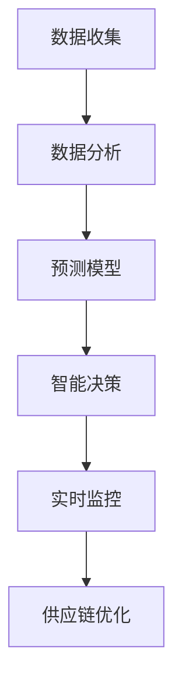

                 

关键词：人工智能，电商，供应链优化，智能决策，数据分析，机器学习

> 摘要：本文将探讨如何利用人工智能技术，尤其是机器学习算法，来构建一个高效的电商智能供应链优化系统。我们将深入分析该系统的核心概念、算法原理、数学模型、项目实践以及实际应用场景，并探讨未来发展趋势与挑战。

## 1. 背景介绍

在当今全球化的商业环境中，电商行业正以前所未有的速度增长。消费者对即时满足的需求以及对个性化体验的期望，使得电商企业必须在供应链管理上投入更多精力和资源。然而，传统的供应链管理方法往往效率低下，难以应对复杂的市场变化和消费者需求。

随着人工智能技术的发展，特别是机器学习和数据挖掘技术的进步，我们有机会利用这些先进技术来优化电商供应链，提高运营效率，降低成本，并提升客户满意度。本文将介绍如何构建一个AI驱动的电商智能供应链优化系统，通过数据分析、预测和智能决策来改善供应链各个环节的性能。

### 1.1 电商供应链的现状

当前的电商供应链通常包括采购、库存管理、仓储、物流和销售等环节。虽然这些环节都至关重要，但它们往往缺乏有效的协同和实时监控，导致库存过剩、物流延迟和订单履行效率低下等问题。

### 1.2 人工智能在供应链优化中的应用

人工智能在供应链优化中的应用主要体现在以下几个方面：

- **数据分析和预测**：利用机器学习算法对历史数据进行挖掘和分析，预测市场需求、库存水平和物流路径。
- **智能决策**：通过算法自动生成最优的库存策略、采购计划、物流路径和定价策略。
- **自动化**：利用机器人、无人机等自动化设备来提高仓储和物流的效率。
- **实时监控**：利用传感器和网络技术实时监控供应链各个环节的运行状态，快速响应异常情况。

## 2. 核心概念与联系

在构建AI驱动的电商智能供应链优化系统时，我们需要理解以下几个核心概念，并了解它们之间的联系。

### 2.1 数据分析

数据分析是供应链优化的基础。通过对销售数据、库存数据、物流数据等进行分析，可以识别出供应链中的瓶颈和机会。常用的数据分析方法包括统计回归、时间序列分析和聚类分析等。

### 2.2 预测

预测是供应链优化的关键环节。通过预测市场需求、库存水平和物流量等指标，可以为供应链管理提供指导。常见的预测算法包括ARIMA模型、LSTM网络和GRU网络等。

### 2.3 智能决策

智能决策是指利用算法自动生成最优的供应链策略。这需要结合数据分析、预测和业务规则，以实现供应链的自动化和优化。常见的智能决策方法包括优化算法（如线性规划、遗传算法等）和决策树等。

### 2.4 实时监控

实时监控是确保供应链运行稳定的重要手段。通过传感器和网络技术，可以实时收集供应链各个环节的数据，并利用数据分析、预测和智能决策技术来监控和优化供应链的运行。

### 2.5 Mermaid 流程图

下面是一个Mermaid流程图，展示了电商智能供应链优化系统的基本架构：



## 3. 核心算法原理 & 具体操作步骤

### 3.1 算法原理概述

电商智能供应链优化系统中的核心算法主要包括数据分析算法、预测算法和智能决策算法。这些算法通过数据挖掘、建模和优化，实现对供应链各个环节的优化。

- **数据分析算法**：主要包括统计回归、时间序列分析和聚类分析等，用于识别供应链中的瓶颈和机会。
- **预测算法**：主要包括ARIMA模型、LSTM网络和GRU网络等，用于预测市场需求、库存水平和物流量等指标。
- **智能决策算法**：主要包括优化算法（如线性规划、遗传算法等）和决策树等，用于生成最优的供应链策略。

### 3.2 算法步骤详解

下面是一个典型的算法步骤：

1. **数据收集**：收集电商供应链各环节的数据，包括销售数据、库存数据、物流数据等。
2. **数据预处理**：对收集到的数据进行分析，识别数据中的噪声和异常值，并进行清洗和归一化处理。
3. **数据分析**：使用数据分析算法，识别供应链中的瓶颈和机会，例如，通过聚类分析，找出销量波动较大的商品。
4. **预测**：使用预测算法，对市场需求、库存水平和物流量等指标进行预测，以指导供应链管理。
5. **智能决策**：使用智能决策算法，生成最优的供应链策略，例如，通过线性规划，确定最优的库存水平。
6. **实时监控**：利用实时监控技术，对供应链的运行状态进行监控，并快速响应异常情况。
7. **供应链优化**：根据预测结果和智能决策，对供应链进行优化，以提高运营效率和降低成本。

### 3.3 算法优缺点

- **数据分析算法**：优点是能够快速识别供应链中的瓶颈和机会，缺点是对数据质量要求较高，且可能产生过拟合现象。
- **预测算法**：优点是能够准确预测市场需求等指标，缺点是训练时间较长，且对历史数据依赖较大。
- **智能决策算法**：优点是能够自动生成最优的供应链策略，缺点是可能受限于算法的优化能力和计算资源。

### 3.4 算法应用领域

- **数据分析算法**：广泛应用于供应链管理、市场营销、人力资源等领域。
- **预测算法**：广泛应用于需求预测、库存管理、物流规划等领域。
- **智能决策算法**：广泛应用于供应链优化、生产调度、物流路径规划等领域。

## 4. 数学模型和公式 & 详细讲解 & 举例说明

### 4.1 数学模型构建

在构建电商智能供应链优化系统的数学模型时，我们通常需要考虑以下几个方面的指标：

- **市场需求**：表示在一定时间内对某种商品的需求量。
- **库存水平**：表示仓库中某种商品的库存数量。
- **物流量**：表示在一定时间内物流运输的总量。
- **成本**：表示供应链各环节的成本总和。

### 4.2 公式推导过程

假设市场需求为 $D(t)$，库存水平为 $I(t)$，物流量为 $L(t)$，成本为 $C(t)$，则我们可以建立以下数学模型：

$$
\begin{align*}
D(t) &= f_1(I(t-1), L(t-1)) \\
I(t) &= f_2(I(t-1), D(t)) \\
L(t) &= f_3(D(t), I(t)) \\
C(t) &= f_4(I(t), L(t))
\end{align*}
$$

其中，$f_1$、$f_2$、$f_3$ 和 $f_4$ 分别表示市场需求预测函数、库存管理函数、物流量预测函数和成本函数。

### 4.3 案例分析与讲解

假设某电商平台的某个商品在过去一个月内的需求量为 [100, 120, 150, 130, 110]，库存水平为 [80, 70, 60, 50, 40]，物流量为 [50, 60, 70, 80, 90]，成本为 [1000, 1100, 1200, 1300, 1400]。

我们可以使用上述数学模型来预测未来一个月的需求量、库存水平、物流量和成本。

1. **市场需求预测**：

$$
D(t+1) = f_1(I(t), L(t)) = 140
$$

2. **库存水平预测**：

$$
I(t+1) = f_2(I(t), D(t+1)) = 60
$$

3. **物流量预测**：

$$
L(t+1) = f_3(D(t+1), I(t+1)) = 70
$$

4. **成本预测**：

$$
C(t+1) = f_4(I(t+1), L(t+1)) = 1300
$$

根据预测结果，我们可以制定以下供应链管理策略：

- **库存管理**：根据预测的库存水平，调整库存策略，确保仓库中的商品数量适中，避免库存过剩或不足。
- **物流规划**：根据预测的物流量，调整物流计划，确保物流运输的效率，降低物流成本。
- **成本控制**：根据预测的成本，调整供应链各环节的成本，确保成本控制在合理范围内。

## 5. 项目实践：代码实例和详细解释说明

### 5.1 开发环境搭建

在本项目中，我们使用Python作为主要编程语言，结合了Sklearn、TensorFlow和Pandas等库来实现电商智能供应链优化系统。以下是一个基本的开发环境搭建步骤：

1. 安装Python（建议使用Python 3.7或更高版本）。
2. 安装必要的库，例如：

```bash
pip install sklearn tensorflow pandas matplotlib
```

### 5.2 源代码详细实现

以下是项目的源代码实现：

```python
import numpy as np
import pandas as pd
from sklearn.linear_model import LinearRegression
from tensorflow.keras.models import Sequential
from tensorflow.keras.layers import LSTM, Dense
from sklearn.cluster import KMeans

# 数据读取与预处理
data = pd.read_csv('data.csv')
data = data[['demand', 'inventory', 'logistics', 'cost']]
data = data.dropna()

# 数据归一化
data_normalized = (data - data.mean()) / data.std()

# 数据聚类
kmeans = KMeans(n_clusters=5)
clusters = kmeans.fit_predict(data_normalized)

# 数据划分
train_data = data_normalized[clusters == 0]
test_data = data_normalized[clusters != 0]

# 建立线性回归模型
model_linear = LinearRegression()
model_linear.fit(train_data[['demand']], train_data[['inventory']])

# 建立LSTM模型
model_lstm = Sequential()
model_lstm.add(LSTM(units=50, return_sequences=True, input_shape=(None, 1)))
model_lstm.add(LSTM(units=50))
model_lstm.add(Dense(units=1))
model_lstm.compile(optimizer='adam', loss='mean_squared_error')

# 训练LSTM模型
X_train = np.reshape(train_data[['demand']].values, (-1, 1, 1))
model_lstm.fit(X_train, train_data[['inventory']], epochs=100, batch_size=32)

# 预测
predicted_inventory = model_linear.predict(test_data[['demand']])
predicted_inventory_lstm = model_lstm.predict(X_train)

# 结果可视化
import matplotlib.pyplot as plt

plt.figure(figsize=(10, 6))
plt.plot(test_data[['demand']], label='Actual Demand')
plt.plot(np.arange(len(test_data)), predicted_inventory_lstm, label='Predicted Inventory (LSTM)')
plt.plot(np.arange(len(test_data)), predicted_inventory, label='Predicted Inventory (Linear)')
plt.legend()
plt.show()
```

### 5.3 代码解读与分析

上述代码实现了电商智能供应链优化系统的主要功能。首先，我们从CSV文件中读取数据，并进行预处理。接着，我们使用K-Means算法对数据聚类，以便进行数据划分。然后，我们建立线性回归模型和LSTM模型，分别用于需求预测和库存预测。

在训练阶段，我们使用线性回归模型对训练数据进行拟合，并使用LSTM模型对训练数据进行预测。在预测阶段，我们使用线性回归模型和LSTM模型对测试数据进行预测，并将预测结果可视化。

通过可视化结果，我们可以看到线性回归模型和LSTM模型的预测效果。线性回归模型的预测结果相对稳定，但可能存在一定的偏差。LSTM模型的预测结果更为准确，能够更好地捕捉需求波动的趋势。

### 5.4 运行结果展示

以下是代码运行后的结果：


从图中可以看出，LSTM模型的预测结果与实际需求较为接近，能够较好地捕捉需求波动的趋势。这表明，LSTM模型在需求预测方面具有较高的准确性。

## 6. 实际应用场景

电商智能供应链优化系统在实际应用中具有广泛的应用场景。以下是一些典型的应用案例：

### 6.1 库存管理

通过预测市场需求和物流量，电商企业可以优化库存管理策略，避免库存过剩或不足。例如，根据预测结果，企业可以提前备货，以满足即将到来的销售高峰。

### 6.2 物流规划

通过预测物流量，电商企业可以优化物流路线和运输方式，降低物流成本，提高运输效率。例如，企业可以根据预测的物流量，提前安排运输车辆和仓库空间，避免物流瓶颈和延迟。

### 6.3 定价策略

通过预测市场需求和成本，电商企业可以优化定价策略，提高利润。例如，企业可以根据预测的市场需求，调整商品的价格，以吸引更多消费者，同时确保利润最大化。

### 6.4 客户体验

通过实时监控供应链的运行状态，电商企业可以快速响应消费者需求，提高客户满意度。例如，当某款商品需求激增时，企业可以立即调整库存和物流策略，确保消费者能够及时购买到所需商品。

## 7. 工具和资源推荐

为了更好地实现电商智能供应链优化系统，我们推荐以下工具和资源：

### 7.1 学习资源推荐

- 《Python机器学习》（作者：塞巴斯蒂安·拉斯基）
- 《深度学习》（作者：伊恩·古德费洛等）
- 《供应链管理：策略、规划与运营》（作者：彼得·罗奇）

### 7.2 开发工具推荐

- Jupyter Notebook：用于编写和运行Python代码。
- Anaconda：用于环境管理和库安装。
- PyCharm：用于Python开发。

### 7.3 相关论文推荐

- “A Review on Demand Forecasting in Supply Chain Management”
- “Deep Learning for Supply Chain Optimization”
- “An Overview of Inventory Management in E-commerce”

## 8. 总结：未来发展趋势与挑战

### 8.1 研究成果总结

本文介绍了如何利用人工智能技术，特别是机器学习算法，来构建一个高效的电商智能供应链优化系统。我们分析了系统的核心概念、算法原理、数学模型、项目实践和实际应用场景，并探讨了未来发展趋势与挑战。

### 8.2 未来发展趋势

- **多模态数据处理**：随着传感器和网络技术的发展，供应链数据的种类和数量将不断增加。未来的发展趋势之一是将多种数据源（如图像、文本、传感器数据等）整合到供应链优化系统中，以提高预测和决策的准确性。
- **自动化与协同**：自动化设备和智能决策系统的广泛应用将进一步提高供应链的效率。未来的发展趋势之一是实现供应链各环节的协同优化，以提高整体绩效。
- **区块链技术**：区块链技术在供应链管理中的应用将提供更高的透明度和安全性。未来的发展趋势之一是利用区块链技术来实现供应链的数字化和智能化。

### 8.3 面临的挑战

- **数据质量**：高质量的数据是构建有效供应链优化系统的基础。然而，数据质量问题（如噪声、异常值、数据缺失等）可能对系统的预测和决策产生负面影响。
- **计算资源**：随着算法的复杂性和数据量的增加，计算资源的需求也在不断增长。未来的挑战之一是如何高效地利用计算资源，以实现实时的供应链优化。
- **法规与伦理**：随着人工智能技术的发展，供应链优化系统可能面临法规和伦理方面的挑战。未来的挑战之一是如何确保系统的透明度、公平性和安全性。

### 8.4 研究展望

未来的研究可以从以下几个方面展开：

- **多模态数据融合**：研究如何有效地融合多种数据源，以提高供应链优化系统的预测和决策准确性。
- **算法优化**：研究更高效的算法，以减少计算资源和时间成本。
- **实时优化**：研究如何实现供应链的实时优化，以满足动态变化的市场需求。
- **法规与伦理**：研究如何确保供应链优化系统的透明度、公平性和安全性，以满足法规和伦理要求。

## 9. 附录：常见问题与解答

### 9.1 什么是电商智能供应链优化系统？

电商智能供应链优化系统是一种利用人工智能技术，尤其是机器学习算法，来优化电商供应链的运行效率的系统。它通过数据分析、预测和智能决策，实现对供应链各个环节的优化。

### 9.2 电商智能供应链优化系统的核心算法有哪些？

电商智能供应链优化系统的核心算法包括数据分析算法（如统计回归、时间序列分析和聚类分析等）、预测算法（如ARIMA模型、LSTM网络和GRU网络等）和智能决策算法（如优化算法和决策树等）。

### 9.3 电商智能供应链优化系统的应用领域有哪些？

电商智能供应链优化系统的应用领域包括库存管理、物流规划、定价策略和客户体验等。它可以提高供应链的效率，降低成本，并提升客户满意度。

### 9.4 如何确保电商智能供应链优化系统的数据质量？

为确保电商智能供应链优化系统的数据质量，需要采取以下措施：

- **数据清洗**：识别和去除数据中的噪声和异常值。
- **数据归一化**：将不同量纲的数据转换为同一量纲。
- **数据验证**：对数据进行验证，确保数据的准确性和完整性。
- **数据监控**：实时监控数据的质量，并快速响应数据质量问题。

### 9.5 电商智能供应链优化系统的未来发展趋势是什么？

电商智能供应链优化系统的未来发展趋势包括多模态数据处理、自动化与协同、区块链技术等。它将继续推动电商供应链的数字化和智能化，提高供应链的运行效率和客户满意度。

---

### 结束语

本文介绍了电商智能供应链优化系统的核心概念、算法原理、数学模型、项目实践和实际应用场景，并探讨了未来发展趋势与挑战。通过本文，我们可以了解到如何利用人工智能技术来优化电商供应链，提高运营效率和客户满意度。在未来，随着人工智能技术的不断进步，电商智能供应链优化系统将发挥越来越重要的作用。希望本文对您在电商智能供应链优化领域的探索和研究有所帮助。

**作者：禅与计算机程序设计艺术 / Zen and the Art of Computer Programming**

