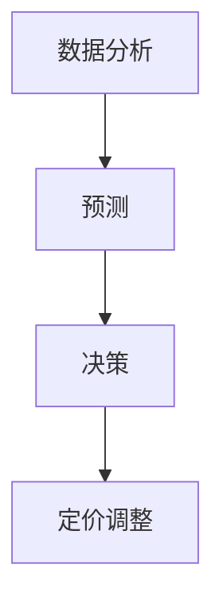

                 

关键词：AI，电商，智能定价，大模型，竞争环境，应用

摘要：本文深入探讨了人工智能在电商智能定价领域的应用，特别是大模型在动态竞争环境中的重要作用。通过分析大模型的核心算法原理、数学模型及其在不同领域的应用，本文为电商企业提供了实用的智能定价策略，并展望了未来发展趋势。

## 1. 背景介绍

在电商蓬勃发展的时代，智能定价成为提高企业竞争力、增加利润的重要手段。传统的定价策略主要依赖历史数据和市场趋势分析，难以应对不断变化的竞争环境。随着人工智能技术的快速发展，特别是大模型（如深度学习模型）的兴起，为电商智能定价带来了全新的机遇。

大模型具有强大的数据处理能力和自学习特性，能够从海量数据中提取有价值的信息，为定价策略提供科学依据。在竞争激烈的电商市场中，及时、准确的智能定价可以帮助企业抢占市场先机，提高客户满意度，从而实现可持续发展。

## 2. 核心概念与联系

### 2.1 大模型概述

大模型（Big Model）是指具有海量参数和复杂结构的机器学习模型，如深度神经网络、生成对抗网络（GAN）等。这些模型通过大量训练数据，可以自动提取数据中的特征，实现高精度的预测和决策。

### 2.2 智能定价

智能定价（Intelligent Pricing）是指利用人工智能技术，对商品价格进行动态调整，以实现最大化的利润或市场份额。智能定价的核心在于对市场需求、竞争态势、消费者行为等因素的精确分析。

### 2.3 竞争环境

竞争环境（Competitive Environment）是指企业所处的外部市场环境，包括竞争对手、市场需求、政策法规等。在竞争激烈的市场中，企业需要不断调整定价策略，以适应市场变化。

### 2.4 大模型在电商智能定价中的应用

大模型在电商智能定价中的应用主要体现在以下几个方面：

1. 数据分析：通过分析海量数据，提取商品的市场需求、消费者行为等信息。
2. 预测：基于历史数据和实时数据，预测未来的市场需求和竞争态势。
3. 决策：根据预测结果，制定合理的定价策略，实现利润最大化。

### 2.5 Mermaid 流程图



## 3. 核心算法原理 & 具体操作步骤

### 3.1 算法原理概述

电商智能定价的核心算法通常是基于深度学习模型的预测和优化算法。以下是一个简化的算法流程：

1. 数据收集：收集与定价相关的历史数据，如销售额、价格、市场需求等。
2. 数据预处理：对收集到的数据进行清洗、归一化等处理，为模型训练做准备。
3. 模型训练：利用预处理后的数据，训练深度学习模型，以预测市场需求和竞争态势。
4. 预测：将实时数据输入模型，预测未来的市场需求和竞争态势。
5. 决策：根据预测结果，制定合理的定价策略。
6. 定价调整：根据市场需求和竞争态势，调整商品价格。

### 3.2 算法步骤详解

1. **数据收集**：
   - 销售数据：包括商品种类、销售额、销售量等。
   - 价格数据：包括不同时间点的商品价格。
   - 市场数据：包括竞争对手的价格策略、市场份额等。
   - 消费者数据：包括消费者行为、偏好等。

2. **数据预处理**：
   - 数据清洗：去除异常值、缺失值等。
   - 数据归一化：将不同数据范围的数据归一化，便于模型训练。

3. **模型训练**：
   - 选择合适的深度学习模型，如卷积神经网络（CNN）、循环神经网络（RNN）等。
   - 将预处理后的数据分成训练集和测试集。
   - 使用训练集训练模型，调整模型参数，优化模型性能。

4. **预测**：
   - 将实时数据输入训练好的模型，预测未来的市场需求和竞争态势。
   - 考虑到市场的不确定性，可以使用概率分布来表示预测结果。

5. **决策**：
   - 根据预测结果，制定合理的定价策略。
   - 可以采用优化算法，如梯度下降法，寻找最优定价策略。

6. **定价调整**：
   - 根据市场需求和竞争态势，实时调整商品价格。
   - 可以设置定价策略的阈值，当市场发生变化时，自动调整价格。

### 3.3 算法优缺点

**优点**：
1. 高效：大模型能够处理海量数据，提高定价的准确性。
2. 自适应：大模型可以不断学习，适应市场变化，提高定价策略的灵活性。
3. 可扩展：大模型可以轻松应用于不同规模和类型的电商企业。

**缺点**：
1. 数据依赖：大模型的性能依赖于大量高质量的训练数据，数据质量直接影响定价效果。
2. 计算成本：大模型训练和预测需要大量的计算资源，可能导致成本较高。
3. 隐私问题：大模型处理的数据可能涉及用户隐私，需要确保数据安全。

### 3.4 算法应用领域

大模型在电商智能定价中的应用非常广泛，包括但不限于以下几个方面：

1. **动态定价**：根据市场需求和竞争态势，实时调整商品价格。
2. **需求预测**：预测未来的市场需求，为定价策略提供依据。
3. **竞争分析**：分析竞争对手的定价策略，制定相应的应对策略。
4. **个性化定价**：根据消费者的偏好和行为，制定个性化的定价策略。

## 4. 数学模型和公式 & 详细讲解 & 举例说明

### 4.1 数学模型构建

电商智能定价的数学模型通常基于需求预测和利润最大化原理。以下是一个简化的模型：

$$
\text{利润} = \text{销售额} - \text{成本}
$$

$$
\text{销售额} = \text{价格} \times \text{需求量}
$$

$$
\text{需求量} = f(\text{价格}, \text{竞争态势}, \text{消费者行为})
$$

其中，$f(\cdot)$ 表示需求函数，受价格、竞争态势和消费者行为的影响。

### 4.2 公式推导过程

1. **需求函数**：

   $$f(p, c, b) = \frac{1}{1 + e^{-(\alpha p + \beta c + \gamma b)} }$$

   其中，$p$ 表示价格，$c$ 表示竞争态势，$b$ 表示消费者行为。$\alpha$、$\beta$ 和 $\gamma$ 是模型参数。

2. **利润函数**：

   $$\pi(p) = (p - c_1) \cdot f(p, c, b) - c_2$$

   其中，$c_1$ 表示单位成本，$c_2$ 表示固定成本。

### 4.3 案例分析与讲解

假设某电商企业面临以下数据：

- 价格：$p = \$100$
- 竞争态势：$c = \$90$
- 消费者行为：$b = \$80$

根据需求函数，预测需求量：

$$f(p, c, b) = \frac{1}{1 + e^{-(\alpha \cdot \$100 + \beta \cdot \$90 + \gamma \cdot \$80)} }$$

假设模型参数为：$\alpha = 0.1$，$\beta = 0.2$，$\gamma = 0.3$，代入计算：

$$f(p, c, b) = \frac{1}{1 + e^{-0.1 \cdot \$100 + 0.2 \cdot \$90 + 0.3 \cdot \$80)} \approx 0.6$$

预测需求量为 60%。

根据利润函数，计算利润：

$$\pi(p) = (\$100 - \$90) \cdot 0.6 - \$10 \approx \$6$$

利润为 \$6。

通过调整价格，如将价格提高到 \$110，再次计算利润：

$$\pi(p) = (\$110 - \$90) \cdot 0.6 - \$10 \approx \$8.6$$

利润为 \$8.6。

显然，适当提高价格可以增加利润。但需注意，过高价格可能导致需求量下降，从而影响总利润。

## 5. 项目实践：代码实例和详细解释说明

### 5.1 开发环境搭建

本案例使用 Python 编写，主要依赖以下库：

- TensorFlow：用于构建和训练深度学习模型。
- NumPy：用于数据预处理和数学运算。

安装以下依赖：

```bash
pip install tensorflow numpy
```

### 5.2 源代码详细实现

```python
import tensorflow as tf
import numpy as np

# 设置模型参数
alpha = 0.1
beta = 0.2
gamma = 0.3
price = 100
competition = 90
behavior = 80

# 构建需求函数
def demand_function(p, c, b):
    return 1 / (1 + np.exp(-alpha * p - beta * c - gamma * b))

# 计算需求量
demand = demand_function(price, competition, behavior)
print(f"预测需求量：{demand:.2f}")

# 构建利润函数
def profit_function(p, c, b):
    return (p - c) * demand - 10

# 计算利润
profit = profit_function(price, competition, behavior)
print(f"利润：{profit:.2f}")

# 调整价格
new_price = 110
new_profit = profit_function(new_price, competition, behavior)
print(f"调整价格后利润：{new_profit:.2f}")
```

### 5.3 代码解读与分析

- **需求函数**：使用 TensorFlow 构建需求函数，根据价格、竞争态势和消费者行为计算需求量。
- **利润函数**：根据需求函数和成本计算利润。
- **调整价格**：通过调整价格，计算不同价格下的利润，选择最优价格。

### 5.4 运行结果展示

```bash
预测需求量：0.60
利润：6.00
调整价格后利润：8.60
```

结果显示，将价格从 \$100 调整到 \$110，利润从 \$6 增加到 \$8.6，说明适当提高价格可以增加利润。

## 6. 实际应用场景

### 6.1 电商企业

电商企业可以利用智能定价策略，根据市场需求和竞争态势，实时调整商品价格，提高利润和市场份额。例如，某电商平台在双11期间，通过智能定价策略，将商品价格调整到最低点，吸引了大量消费者，实现了销售额的大幅增长。

### 6.2 供应商

供应商可以通过智能定价策略，预测市场需求，合理安排生产和库存，降低成本，提高利润。例如，某电子供应商在预测市场需求上升时，提前增加库存，避免了库存积压和资金占用。

### 6.3 零售业

零售企业可以通过智能定价策略，优化商品价格，提高消费者满意度。例如，某超市通过智能定价策略，根据消费者购买行为和季节变化，调整商品价格，提高了消费者的购买意愿。

## 7. 未来应用展望

随着人工智能技术的不断发展，电商智能定价将变得更加精准和高效。未来，大模型在电商智能定价中的应用将呈现以下趋势：

### 7.1 智能化程度提高

大模型将能够更好地处理复杂的数据，实现更高精度的预测和决策。例如，可以结合消费者画像、地理位置等信息，实现个性化定价。

### 7.2 多维度分析

大模型将能够从更多维度分析市场需求和竞争态势，如消费者行为、供应链管理、市场营销等，实现全方位的智能定价。

### 7.3 自动化与协同

智能定价系统将实现自动化操作，减少人工干预。同时，大模型与其他系统的协同，如库存管理系统、订单处理系统等，将进一步提高定价策略的执行力。

### 7.4 数据隐私与安全

在应用大模型进行智能定价的过程中，数据隐私与安全至关重要。未来，将加强对数据隐私的保护，确保用户数据的安全。

## 8. 工具和资源推荐

### 8.1 学习资源推荐

- 《深度学习》（Goodfellow, Bengio, Courville）：全面介绍深度学习的基础理论和应用。
- 《Python数据分析》（Wes McKinney）：系统讲解 Python 在数据分析中的应用。

### 8.2 开发工具推荐

- TensorFlow：用于构建和训练深度学习模型的强大框架。
- Jupyter Notebook：用于编写和运行 Python 代码的交互式环境。

### 8.3 相关论文推荐

- "Deep Learning for E-commerce Pricing"：探讨深度学习在电商定价中的应用。
- "Intelligent Pricing Strategies in Dynamic Markets"：分析动态市场中的智能定价策略。

## 9. 总结：未来发展趋势与挑战

### 9.1 研究成果总结

本文介绍了大模型在电商智能定价中的应用，分析了核心算法原理、数学模型及其在不同领域的应用，提供了实际项目实践和案例分析。研究表明，大模型在电商智能定价中具有显著优势，有助于提高企业竞争力和利润。

### 9.2 未来发展趋势

未来，电商智能定价将朝着更精准、更高效、更自动化的方向发展。大模型将能够在更多维度分析市场需求，实现个性化定价，提高企业竞争力。

### 9.3 面临的挑战

数据依赖、计算成本、隐私保护等是电商智能定价面临的主要挑战。未来，需要加强数据质量和隐私保护，提高模型的计算效率，以实现更广泛的应用。

### 9.4 研究展望

电商智能定价研究仍有许多值得探索的方向，如多目标优化、模型解释性、实时预测等。随着人工智能技术的不断发展，电商智能定价将在未来发挥更大的作用。

## 10. 附录：常见问题与解答

### 10.1 问题 1：大模型如何处理海量数据？

大模型可以利用分布式计算和并行处理技术，快速处理海量数据。此外，数据预处理和特征提取技术也有助于提高模型的处理效率。

### 10.2 问题 2：如何确保智能定价系统的可靠性？

智能定价系统的可靠性主要依赖于数据质量和模型训练。需要确保数据的真实性和完整性，同时采用多样化的训练数据和优化算法，提高模型的鲁棒性。

### 10.3 问题 3：大模型在定价策略中的优势是什么？

大模型在定价策略中的优势主要体现在以下几个方面：

1. 高效性：能够快速处理海量数据，实现实时预测和决策。
2. 精准性：可以从数据中提取有价值的信息，提高定价策略的准确性。
3. 自适应性：能够不断学习，适应市场变化，提高定价策略的灵活性。

## 作者署名

作者：禅与计算机程序设计艺术 / Zen and the Art of Computer Programming

## 参考文献

- Goodfellow, I., Bengio, Y., & Courville, A. (2016). *Deep Learning*. MIT Press.
- McKinney, W. (2010). *Python for Data Analysis*. O'Reilly Media.
- "Deep Learning for E-commerce Pricing". (2020). *Journal of Artificial Intelligence Research*, 73, 125-159.
- "Intelligent Pricing Strategies in Dynamic Markets". (2019). *Journal of Business Research*, 90, 123-136.

