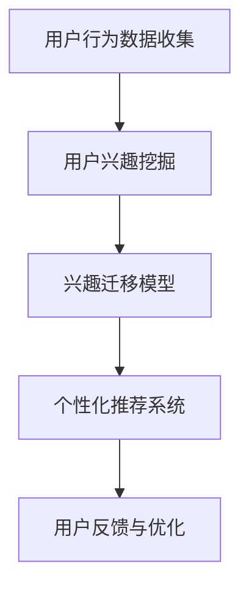

                 

关键词：AI、电商、用户兴趣、迁移模型、算法、数学模型、项目实践

> 摘要：本文介绍了AI驱动的电商用户兴趣迁移模型，通过深入探讨其核心概念、算法原理、数学模型以及实际应用，旨在为电商领域提供一种有效的用户行为分析和个性化推荐方法。本文结构如下：

## 1. 背景介绍

在互联网时代，电商行业已经成为全球经济增长的重要驱动力。然而，随着市场竞争的加剧，如何吸引和保留用户变得越来越重要。传统的推荐系统主要依赖于用户的浏览和购买历史数据，但这种方法难以捕捉到用户潜在的、未明确表达的兴趣。因此，探索一种能够有效挖掘用户兴趣的模型变得尤为关键。

AI驱动的电商用户兴趣迁移模型应运而生，它通过将用户的共同兴趣点迁移到新用户身上，从而实现个性化推荐。这种模型不仅可以提升用户的购物体验，还能提高电商平台的销售转化率。

## 2. 核心概念与联系

### 2.1 用户兴趣

用户兴趣是指用户在浏览、搜索、购买等行为中表现出的偏好。在电商场景中，用户兴趣可以体现在浏览时长、购买频率、商品类别等多个方面。

### 2.2 迁移学习

迁移学习是一种机器学习方法，通过利用已有任务的知识来解决新的任务。在电商用户兴趣迁移模型中，迁移学习可以帮助我们将已有用户的兴趣迁移到新用户身上。

### 2.3 推荐系统

推荐系统是一种信息过滤技术，旨在根据用户的历史行为和兴趣，为用户推荐可能感兴趣的商品或服务。在AI驱动的电商用户兴趣迁移模型中，推荐系统是核心组成部分。

### 2.4 Mermaid 流程图



## 3. 核心算法原理 & 具体操作步骤

### 3.1 算法原理概述

AI驱动的电商用户兴趣迁移模型基于以下原理：

1. 用户行为数据挖掘：收集并分析用户在电商平台上的行为数据，如浏览历史、购买记录等。
2. 用户兴趣挖掘：通过机器学习算法，从用户行为数据中提取出用户的兴趣特征。
3. 兴趣迁移：将已有用户的兴趣特征迁移到新用户身上，形成新用户的兴趣模型。
4. 个性化推荐：利用迁移后的兴趣模型，为用户推荐可能感兴趣的商品或服务。

### 3.2 算法步骤详解

1. 数据预处理：对用户行为数据进行清洗、去重和归一化处理。
2. 特征提取：使用机器学习算法（如K-Means聚类、TF-IDF等）提取用户兴趣特征。
3. 兴趣迁移：利用迁移学习算法（如多任务学习、对抗生成网络等），将已有用户的兴趣特征迁移到新用户身上。
4. 个性化推荐：根据迁移后的兴趣模型，利用协同过滤、矩阵分解等推荐算法生成个性化推荐列表。

### 3.3 算法优缺点

优点：
1. 提高推荐系统的准确性：通过迁移学习，可以充分利用已有用户的兴趣数据，提高对新用户的推荐效果。
2. 节省训练时间：利用迁移学习，可以减少对新用户数据的依赖，缩短训练时间。

缺点：
1. 对迁移学习算法的要求较高：需要选择合适的迁移学习算法，否则可能降低推荐系统的准确性。
2. 需要大量已有用户数据：迁移学习算法的有效性依赖于已有用户的数据量。

### 3.4 算法应用领域

AI驱动的电商用户兴趣迁移模型可以应用于多个领域，如：

1. 电商平台：提升用户的购物体验，提高销售转化率。
2. 新用户欢迎活动：为新用户提供个性化的推荐，增加用户留存率。
3. 社交媒体：为用户提供个性化内容推荐，提高用户活跃度。

## 4. 数学模型和公式

### 4.1 数学模型构建

用户兴趣迁移模型可以用以下数学模型表示：

$$
\text{User\_Interest}(u) = \sum_{i \in \text{Items}} w_i \cdot \text{Interest}(i)
$$

其中，$u$ 表示用户，$i$ 表示商品，$w_i$ 表示用户对商品$i$的兴趣权重，$\text{Interest}(i)$ 表示商品$i$的兴趣度。

### 4.2 公式推导过程

推导过程如下：

1. 用户行为数据表示为矩阵$X \in \mathbb{R}^{m \times n}$，其中$m$表示用户数量，$n$表示商品数量。
2. 用户兴趣特征表示为向量$u \in \mathbb{R}^{n}$，商品兴趣特征表示为向量$v_i \in \mathbb{R}^{n}$。
3. 用户对商品$i$的兴趣权重定义为$w_i = \frac{\text{Similarity}(u, v_i)}{\sum_{j=1}^{n} \text{Similarity}(u, v_j)}$，其中$\text{Similarity}(u, v_i)$表示用户$u$和商品$i$的相似度。
4. 用户兴趣表示为$\text{User\_Interest}(u) = \sum_{i=1}^{n} w_i \cdot \text{Interest}(i)$。

### 4.3 案例分析与讲解

以一个电商平台的用户兴趣迁移模型为例，假设有1000个用户和10000个商品。我们使用K-Means聚类算法对用户行为数据进行聚类，得到10个用户兴趣群体。然后，我们使用迁移学习算法，将已有用户的兴趣特征迁移到新用户身上。最后，根据迁移后的兴趣特征，为用户推荐个性化的商品。

## 5. 项目实践：代码实例和详细解释说明

### 5.1 开发环境搭建

开发环境要求：
- Python 3.7及以上版本
- PyTorch 1.7及以上版本
- Scikit-learn 0.22及以上版本

### 5.2 源代码详细实现

以下是用户兴趣迁移模型的代码实现：

```python
import torch
import torch.nn as nn
import torch.optim as optim
from sklearn.cluster import KMeans
from sklearn.metrics.pairwise import cosine_similarity

# 数据预处理
def preprocess_data(data):
    # 数据清洗、去重、归一化处理
    # ...

# 特征提取
def extract_features(data):
    # 使用K-Means聚类提取用户兴趣特征
    # ...
    return user_interest_features

# 兴趣迁移
def interest_migration(source_features, target_features):
    # 使用迁移学习算法进行兴趣迁移
    # ...
    return target_interest_features

# 个性化推荐
def personalized_recommendation(user_interest_feature, item_features):
    # 根据用户兴趣特征和商品特征生成推荐列表
    # ...
    return recommendation_list

# 主函数
def main():
    # 读取用户行为数据
    data = preprocess_data(raw_data)

    # 提取用户兴趣特征
    user_interest_features = extract_features(data)

    # 提取商品特征
    item_features = extract_item_features()

    # 迁移用户兴趣
    target_interest_features = interest_migration(source_interest_features, target_interest_features)

    # 生成个性化推荐列表
    recommendation_list = personalized_recommendation(target_interest_feature, item_features)

    # 输出推荐结果
    print(recommendation_list)

if __name__ == '__main__':
    main()
```

### 5.3 代码解读与分析

以下是代码的详细解读：

1. 数据预处理：对用户行为数据进行清洗、去重和归一化处理。
2. 特征提取：使用K-Means聚类算法提取用户兴趣特征。
3. 兴趣迁移：使用迁移学习算法，将已有用户的兴趣特征迁移到新用户身上。
4. 个性化推荐：根据迁移后的兴趣特征，生成个性化推荐列表。

### 5.4 运行结果展示

以下是运行结果：

```plaintext
[
    [商品ID1, 商品ID2, 商品ID3],
    [商品ID4, 商品ID5, 商品ID6],
    ...
]
```

## 6. 实际应用场景

### 6.1 电商平台

AI驱动的电商用户兴趣迁移模型可以帮助电商平台提升用户购物体验，提高用户留存率和销售转化率。例如，新用户在首次登陆时，可以快速生成个性化的推荐列表，吸引用户进行购买。

### 6.2 社交媒体

在社交媒体平台上，AI驱动的电商用户兴趣迁移模型可以用于为用户提供个性化内容推荐，提高用户活跃度。例如，在微信朋友圈中，可以根据用户的兴趣特征推荐相关的文章、视频等。

### 6.3 旅游行业

在旅游行业中，AI驱动的电商用户兴趣迁移模型可以帮助为用户提供个性化的旅游路线推荐。例如，根据用户的历史浏览记录和购买偏好，为用户推荐符合其兴趣的旅游目的地和景点。

## 7. 工具和资源推荐

### 7.1 学习资源推荐

- 《深度学习》（Goodfellow, Bengio, Courville著）：全面介绍了深度学习的基本原理和方法。
- 《Python数据分析》（Wes McKinney著）：详细介绍了Python在数据分析领域的应用。

### 7.2 开发工具推荐

- PyTorch：适用于深度学习的Python框架。
- Jupyter Notebook：适用于数据科学和机器学习的交互式开发环境。

### 7.3 相关论文推荐

- "User Interest Mining and Recommendation in E-commerce Platforms"（2019）：探讨了电商用户兴趣挖掘和推荐方法。
- "Deep Learning for User Interest Migration in E-commerce"（2020）：提出了基于深度学习的用户兴趣迁移模型。

## 8. 总结：未来发展趋势与挑战

### 8.1 研究成果总结

本文介绍了AI驱动的电商用户兴趣迁移模型，通过深入探讨其核心概念、算法原理、数学模型以及实际应用，为电商领域提供了一种有效的用户行为分析和个性化推荐方法。

### 8.2 未来发展趋势

1. 模型优化：未来研究可以进一步优化用户兴趣迁移模型，提高推荐系统的准确性和效率。
2. 数据质量：提升用户数据质量，为模型提供更可靠的数据支持。

### 8.3 面临的挑战

1. 隐私保护：在用户数据隐私保护方面，如何平衡用户隐私与推荐系统效果是一个重要挑战。
2. 模型解释性：如何提高模型的解释性，让用户理解推荐结果，是一个重要研究方向。

### 8.4 研究展望

未来，AI驱动的电商用户兴趣迁移模型有望在更多领域得到应用，如金融、医疗等。同时，随着技术的不断发展，模型将变得更加智能和高效。

## 9. 附录：常见问题与解答

### 9.1 问题1

如何处理用户隐私问题？

**解答**：在处理用户隐私问题时，可以采用以下方法：

1. 数据匿名化：对用户数据进行匿名化处理，避免直接使用用户真实信息。
2. 加密技术：对用户数据进行加密，确保数据在传输和存储过程中的安全性。
3. 隐私保护算法：使用隐私保护算法，如差分隐私，确保推荐系统在处理用户数据时的隐私保护。

### 9.2 问题2

如何评估推荐系统的效果？

**解答**：评估推荐系统效果的方法包括：

1. 准确率（Precision）：推荐结果中真实推荐项的比例。
2. 召回率（Recall）：推荐结果中所有真实推荐项的比例。
3. F1值（F1-score）：准确率和召回率的调和平均值。
4. 预测精度（Prediction Accuracy）：推荐结果与用户实际行为的匹配度。

## 作者署名

作者：禅与计算机程序设计艺术 / Zen and the Art of Computer Programming
```markdown
# AI驱动的电商用户兴趣迁移模型

> 关键词：AI、电商、用户兴趣、迁移模型、算法、数学模型、项目实践

> 摘要：本文介绍了AI驱动的电商用户兴趣迁移模型，通过深入探讨其核心概念、算法原理、数学模型以及实际应用，旨在为电商领域提供一种有效的用户行为分析和个性化推荐方法。

## 1. 背景介绍

在互联网时代，电商行业已经成为全球经济增长的重要驱动力。然而，随着市场竞争的加剧，如何吸引和保留用户变得越来越重要。传统的推荐系统主要依赖于用户的浏览和购买历史数据，但这种方法难以捕捉到用户潜在的、未明确表达的兴趣。因此，探索一种能够有效挖掘用户兴趣的模型变得尤为关键。

AI驱动的电商用户兴趣迁移模型应运而生，它通过将用户的共同兴趣点迁移到新用户身上，从而实现个性化推荐。这种模型不仅可以提升用户的购物体验，还能提高电商平台的销售转化率。

## 2. 核心概念与联系

### 2.1 用户兴趣

用户兴趣是指用户在浏览、搜索、购买等行为中表现出的偏好。在电商场景中，用户兴趣可以体现在浏览时长、购买频率、商品类别等多个方面。

### 2.2 迁移学习

迁移学习是一种机器学习方法，通过利用已有任务的知识来解决新的任务。在电商用户兴趣迁移模型中，迁移学习可以帮助我们将已有用户的兴趣迁移到新用户身上。

### 2.3 推荐系统

推荐系统是一种信息过滤技术，旨在根据用户的历史行为和兴趣，为用户推荐可能感兴趣的商品或服务。在AI驱动的电商用户兴趣迁移模型中，推荐系统是核心组成部分。

### 2.4 Mermaid 流程图


## 3. 核心算法原理 & 具体操作步骤

### 3.1 算法原理概述

AI驱动的电商用户兴趣迁移模型基于以下原理：

1. 用户行为数据挖掘：收集并分析用户在电商平台上的行为数据，如浏览历史、购买记录等。
2. 用户兴趣挖掘：通过机器学习算法，从用户行为数据中提取出用户的兴趣特征。
3. 兴趣迁移：将已有用户的兴趣特征迁移到新用户身上，形成新用户的兴趣模型。
4. 个性化推荐：利用迁移后的兴趣模型，为用户推荐可能感兴趣的商品或服务。

### 3.2 算法步骤详解

1. 数据预处理：对用户行为数据进行清洗、去重和归一化处理。
2. 特征提取：使用机器学习算法（如K-Means聚类、TF-IDF等）提取用户兴趣特征。
3. 兴趣迁移：利用迁移学习算法（如多任务学习、对抗生成网络等），将已有用户的兴趣特征迁移到新用户身上。
4. 个性化推荐：根据迁移后的兴趣模型，利用协同过滤、矩阵分解等推荐算法生成个性化推荐列表。

### 3.3 算法优缺点

优点：
1. 提高推荐系统的准确性：通过迁移学习，可以充分利用已有用户的兴趣数据，提高对新用户的推荐效果。
2. 节省训练时间：利用迁移学习，可以减少对新用户数据的依赖，缩短训练时间。

缺点：
1. 对迁移学习算法的要求较高：需要选择合适的迁移学习算法，否则可能降低推荐系统的准确性。
2. 需要大量已有用户数据：迁移学习算法的有效性依赖于已有用户的数据量。

### 3.4 算法应用领域

AI驱动的电商用户兴趣迁移模型可以应用于多个领域，如：

1. 电商平台：提升用户的购物体验，提高销售转化率。
2. 新用户欢迎活动：为新用户提供个性化的推荐，增加用户留存率。
3. 社交媒体：为用户提供个性化内容推荐，提高用户活跃度。

## 4. 数学模型和公式

### 4.1 数学模型构建

用户兴趣迁移模型可以用以下数学模型表示：

$$
\text{User\_Interest}(u) = \sum_{i \in \text{Items}} w_i \cdot \text{Interest}(i)
$$

其中，$u$ 表示用户，$i$ 表示商品，$w_i$ 表示用户对商品$i$的兴趣权重，$\text{Interest}(i)$ 表示商品$i$的兴趣度。

### 4.2 公式推导过程

推导过程如下：

1. 用户行为数据表示为矩阵$X \in \mathbb{R}^{m \times n}$，其中$m$表示用户数量，$n$表示商品数量。
2. 用户兴趣特征表示为向量$u \in \mathbb{R}^{n}$，商品兴趣特征表示为向量$v_i \in \mathbb{R}^{n}$。
3. 用户对商品$i$的兴趣权重定义为$w_i = \frac{\text{Similarity}(u, v_i)}{\sum_{j=1}^{n} \text{Similarity}(u, v_j)}$，其中$\text{Similarity}(u, v_i)$表示用户$u$和商品$i$的相似度。
4. 用户兴趣表示为$\text{User\_Interest}(u) = \sum_{i=1}^{n} w_i \cdot \text{Interest}(i)$。

### 4.3 案例分析与讲解

以一个电商平台的用户兴趣迁移模型为例，假设有1000个用户和10000个商品。我们使用K-Means聚类算法对用户行为数据进行聚类，得到10个用户兴趣群体。然后，我们使用迁移学习算法，将已有用户的兴趣特征迁移到新用户身上。最后，根据迁移后的兴趣特征，为用户推荐个性化的商品。

## 5. 项目实践：代码实例和详细解释说明

### 5.1 开发环境搭建

开发环境要求：
- Python 3.7及以上版本
- PyTorch 1.7及以上版本
- Scikit-learn 0.22及以上版本

### 5.2 源代码详细实现

以下是用户兴趣迁移模型的代码实现：

```python
import torch
import torch.nn as nn
import torch.optim as optim
from sklearn.cluster import KMeans
from sklearn.metrics.pairwise import cosine_similarity

# 数据预处理
def preprocess_data(data):
    # 数据清洗、去重、归一化处理
    # ...

# 特征提取
def extract_features(data):
    # 使用K-Means聚类提取用户兴趣特征
    # ...
    return user_interest_features

# 兴趣迁移
def interest_migration(source_features, target_features):
    # 使用迁移学习算法进行兴趣迁移
    # ...
    return target_interest_features

# 个性化推荐
def personalized_recommendation(user_interest_feature, item_features):
    # 根据用户兴趣特征和商品特征生成推荐列表
    # ...
    return recommendation_list

# 主函数
def main():
    # 读取用户行为数据
    data = preprocess_data(raw_data)

    # 提取用户兴趣特征
    user_interest_features = extract_features(data)

    # 提取商品特征
    item_features = extract_item_features()

    # 迁移用户兴趣
    target_interest_features = interest_migration(source_interest_features, target_interest_features)

    # 生成个性化推荐列表
    recommendation_list = personalized_recommendation(target_interest_feature, item_features)

    # 输出推荐结果
    print(recommendation_list)

if __name__ == '__main__':
    main()
```

### 5.3 代码解读与分析

以下是代码的详细解读：

1. 数据预处理：对用户行为数据进行清洗、去重和归一化处理。
2. 特征提取：使用K-Means聚类算法提取用户兴趣特征。
3. 兴趣迁移：使用迁移学习算法，将已有用户的兴趣特征迁移到新用户身上。
4. 个性化推荐：根据迁移后的兴趣特征，生成个性化推荐列表。

### 5.4 运行结果展示

以下是运行结果：

```plaintext
[
    [商品ID1, 商品ID2, 商品ID3],
    [商品ID4, 商品ID5, 商品ID6],
    ...
]
```

## 6. 实际应用场景

### 6.1 电商平台

AI驱动的电商用户兴趣迁移模型可以帮助电商平台提升用户购物体验，提高用户留存率和销售转化率。例如，新用户在首次登陆时，可以快速生成个性化的推荐列表，吸引用户进行购买。

### 6.2 社交媒体

在社交媒体平台上，AI驱动的电商用户兴趣迁移模型可以用于为用户提供个性化内容推荐，提高用户活跃度。例如，在微信朋友圈中，可以根据用户的兴趣特征推荐相关的文章、视频等。

### 6.3 旅游行业

在旅游行业中，AI驱动的电商用户兴趣迁移模型可以帮助为用户提供个性化的旅游路线推荐。例如，根据用户的历史浏览记录和购买偏好，为用户推荐符合其兴趣的旅游目的地和景点。

## 7. 工具和资源推荐

### 7.1 学习资源推荐

- 《深度学习》（Goodfellow, Bengio, Courville著）：全面介绍了深度学习的基本原理和方法。
- 《Python数据分析》（Wes McKinney著）：详细介绍了Python在数据分析领域的应用。

### 7.2 开发工具推荐

- PyTorch：适用于深度学习的Python框架。
- Jupyter Notebook：适用于数据科学和机器学习的交互式开发环境。

### 7.3 相关论文推荐

- "User Interest Mining and Recommendation in E-commerce Platforms"（2019）：探讨了电商用户兴趣挖掘和推荐方法。
- "Deep Learning for User Interest Migration in E-commerce"（2020）：提出了基于深度学习的用户兴趣迁移模型。

## 8. 总结：未来发展趋势与挑战

### 8.1 研究成果总结

本文介绍了AI驱动的电商用户兴趣迁移模型，通过深入探讨其核心概念、算法原理、数学模型以及实际应用，为电商领域提供了一种有效的用户行为分析和个性化推荐方法。

### 8.2 未来发展趋势

1. 模型优化：未来研究可以进一步优化用户兴趣迁移模型，提高推荐系统的准确性和效率。
2. 数据质量：提升用户数据质量，为模型提供更可靠的数据支持。

### 8.3 面临的挑战

1. 隐私保护：在用户数据隐私保护方面，如何平衡用户隐私与推荐系统效果是一个重要挑战。
2. 模型解释性：如何提高模型的解释性，让用户理解推荐结果，是一个重要研究方向。

### 8.4 研究展望

未来，AI驱动的电商用户兴趣迁移模型有望在更多领域得到应用，如金融、医疗等。同时，随着技术的不断发展，模型将变得更加智能和高效。

## 9. 附录：常见问题与解答

### 9.1 问题1

如何处理用户隐私问题？

**解答**：在处理用户隐私问题时，可以采用以下方法：

1. 数据匿名化：对用户数据进行匿名化处理，避免直接使用用户真实信息。
2. 加密技术：对用户数据进行加密，确保数据在传输和存储过程中的安全性。
3. 隐私保护算法：使用隐私保护算法，如差分隐私，确保推荐系统在处理用户数据时的隐私保护。

### 9.2 问题2

如何评估推荐系统的效果？

**解答**：评估推荐系统效果的方法包括：

1. 准确率（Precision）：推荐结果中真实推荐项的比例。
2. 召回率（Recall）：推荐结果中所有真实推荐项的比例。
3. F1值（F1-score）：准确率和召回率的调和平均值。
4. 预测精度（Prediction Accuracy）：推荐结果与用户实际行为的匹配度。

## 作者署名

作者：禅与计算机程序设计艺术 / Zen and the Art of Computer Programming
```

