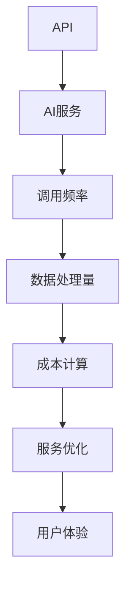

                 

关键词：API调用，计费模式，AI服务，精细化，成本优化，效率提升，动态定价，市场竞争力

>摘要：本文将深入探讨API调用计费模式，特别是针对AI服务的精细化管理。通过分析核心概念、算法原理、数学模型和实际应用，本文旨在为IT行业从业者提供一种全新的AI服务收费思维，助力企业在激烈的市场竞争中实现成本优化和效率提升。

## 1. 背景介绍

随着云计算和人工智能技术的迅猛发展，API（应用程序编程接口）已成为现代软件开发的关键组成部分。API不仅加速了软件开发的进程，还促进了不同系统和应用程序之间的无缝集成。然而，随着API调用的激增，如何对API调用进行有效的计费成为了一个亟待解决的问题。

在传统IT行业，API调用计费往往采用简单的固定费用模式，这种方式在处理常规的API调用时可能相对可行，但对于AI服务这类具有高度复杂性和动态性的应用，则显得不够精细。AI服务通常涉及大量的数据处理、机器学习和算法优化，这些因素都会对计费模式提出更高的要求。

因此，本文将探讨如何采用精细化、智能化的计费模式来管理AI服务的API调用，从而实现成本优化和效率提升。通过分析核心概念、算法原理、数学模型和实际应用，本文旨在为IT行业从业者提供一种全新的AI服务收费思维。

## 2. 核心概念与联系

在探讨API调用计费模式之前，我们需要明确几个核心概念，包括API、AI服务、调用频率、数据处理量等。以下是这些概念及其相互关系的Mermaid流程图：



### 2.1 API（应用程序编程接口）

API是软件开发中的一种接口，它允许不同应用程序之间进行交互和数据交换。API定义了请求的格式、响应的结构以及可能的错误代码。在云计算环境中，API通常用于访问云服务、数据库、Web服务和第三方服务。

### 2.2 AI服务

AI服务是指利用人工智能技术提供的服务，包括机器学习、自然语言处理、计算机视觉等。这些服务通过API接口提供给开发者，以便他们能够在自己的应用程序中集成这些先进功能。

### 2.3 调用频率

调用频率是指API在一定时间内被调用的次数。对于AI服务，调用频率直接影响到计算资源和数据处理的需求。

### 2.4 数据处理量

数据处理量是指API调用过程中处理的数据总量。AI服务通常涉及大量的数据处理，因此对计算资源和存储资源的消耗较大。

### 2.5 成本计算

成本计算是基于调用频率和数据处理量来估算API调用的总成本。精细化的计费模式需要根据实际资源消耗进行动态计算，以便更准确地反映服务的价值。

### 2.6 服务优化

服务优化是通过调整计费策略和资源分配来提高API服务的性能和用户体验。精细化的计费模式可以为服务优化提供关键数据支持。

### 2.7 用户体验

用户体验是用户在使用API服务时的感受和满意度。通过优化计费模式，可以提高用户体验，从而增加用户粘性和满意度。

## 3. 核心算法原理 & 具体操作步骤

### 3.1 算法原理概述

精细化API调用计费的核心在于动态定价，即根据实际资源消耗和服务需求进行实时调整。以下是动态定价算法的基本原理：

1. **资源监控**：实时监控API调用过程中消耗的计算资源、存储资源和网络带宽。
2. **成本估算**：根据资源消耗情况，动态计算API调用的成本。
3. **价格调整**：基于成本估算结果，调整API服务的价格。
4. **客户反馈**：收集客户使用API服务的反馈，优化定价策略。

### 3.2 算法步骤详解

1. **数据收集**：首先，需要收集API调用过程中产生的所有数据，包括调用次数、数据处理量、响应时间等。
2. **资源监控**：使用监控工具实时跟踪API调用过程中的资源消耗。
3. **成本计算**：根据资源消耗情况，使用成本估算模型计算API调用的成本。
4. **价格调整**：根据成本估算结果，调整API服务的价格。
5. **客户反馈**：定期收集客户反馈，优化定价策略和资源分配。

### 3.3 算法优缺点

#### 优点

- **动态定价**：能够根据实时数据动态调整价格，提高成本效益。
- **资源优化**：通过精细化计费，可以更好地分配和利用计算资源。
- **用户体验**：优化的定价策略可以提高用户体验，增加用户满意度。

#### 缺点

- **计算复杂度**：动态定价算法需要处理大量的实时数据，计算复杂度较高。
- **技术门槛**：实现动态定价需要较高的技术支持和专业知识。

### 3.4 算法应用领域

动态定价算法在AI服务领域具有广泛的应用前景，特别是在以下场景中：

- **大数据处理**：实时处理大量数据，动态调整计算资源。
- **机器学习**：根据模型复杂度和数据处理量调整训练成本。
- **自然语言处理**：动态调整API响应时间和数据处理量。

## 4. 数学模型和公式 & 详细讲解 & 举例说明

### 4.1 数学模型构建

精细化API调用计费的核心在于构建一个能够准确反映资源消耗和成本估算的数学模型。以下是数学模型的基本构建：

- **成本函数**：\( C = f(R, S, T) \)
  - \( C \)：成本
  - \( R \)：资源消耗
  - \( S \)：服务等级
  - \( T \)：时间因素

- **价格调整函数**：\( P = g(C, U) \)
  - \( P \)：价格
  - \( C \)：成本
  - \( U \)：用户反馈

### 4.2 公式推导过程

1. **成本函数**的推导：

   - 资源消耗 \( R \) 可以分为计算资源 \( C\_compute \)、存储资源 \( C\_storage \) 和网络资源 \( C\_network \)。
   - 成本函数 \( C \) 可以表示为这三个部分的加权求和：

     $$ C = w\_compute \times C\_compute + w\_storage \times C\_storage + w\_network \times C\_network $$

     其中，\( w\_compute \)、\( w\_storage \) 和 \( w\_network \) 分别表示计算资源、存储资源和网络资源的权重。

2. **价格调整函数**的推导：

   - 价格调整取决于成本 \( C \) 和用户反馈 \( U \)。假设用户反馈 \( U \) 可以分为满意和不满意两种状态，则价格调整函数可以表示为：

     $$ P = C \times (1 + \alpha \times U) $$

     其中，\( \alpha \) 是价格调整系数，用于调整价格以反映用户反馈。

### 4.3 案例分析与讲解

假设一个AI服务提供商提供基于机器学习的图像识别服务，资源消耗主要包括计算资源和存储资源。以下是一个具体的案例：

- **计算资源**：每次调用需要消耗100个计算单元。
- **存储资源**：每次调用需要消耗50个存储单元。
- **权重**：计算资源权重为0.6，存储资源权重为0.4。

根据成本函数：

$$ C = 0.6 \times 100 + 0.4 \times 50 = 60 + 20 = 80 $$

假设价格调整系数 \( \alpha \) 为0.1，用户反馈满意度为90%（即 \( U \) 为0.9）。则价格调整后的价格为：

$$ P = 80 \times (1 + 0.1 \times 0.9) = 80 \times 1.09 = 86.8 $$

## 5. 项目实践：代码实例和详细解释说明

### 5.1 开发环境搭建

为了演示精细化API调用计费模式，我们将使用Python编程语言构建一个简单的示例。首先，需要安装以下依赖库：

```bash
pip install flask
pip install flask-restplus
pip install requests
```

### 5.2 源代码详细实现

以下是用于实现精细化API调用计费的Python代码：

```python
from flask import Flask, request, jsonify
from flask_restplus import Api, Resource
import requests

app = Flask(__name__)
api = Api(app, version='1.0', title='API调用计费示例', description='基于动态定价的AI服务计费')

# 成本估算函数
def cost_estimate(resources):
    compute_cost = resources['compute'] * 0.6
    storage_cost = resources['storage'] * 0.4
    total_cost = compute_cost + storage_cost
    return total_cost

# 价格调整函数
def price_adjustment(cost, user_feedback):
    adjustment_factor = 1 + 0.1 * user_feedback
    adjusted_price = cost * adjustment_factor
    return adjusted_price

# API资源消耗模拟
def simulate_resources():
    resources = {
        'compute': 100,  # 计算资源消耗
        'storage': 50    # 存储资源消耗
    }
    return resources

# API调用计费接口
class APICall(Resource):
    def get(self):
        resources = simulate_resources()
        cost = cost_estimate(resources)
        user_feedback = 0.9  # 模拟用户满意度
        price = price_adjustment(cost, user_feedback)
        return jsonify({'cost': cost, 'price': price})

api.add_resource(APICall, '/api/call')

if __name__ == '__main__':
    app.run(debug=True)
```

### 5.3 代码解读与分析

- **成本估算函数**：`cost_estimate` 函数用于计算API调用的总成本。计算资源消耗和存储资源消耗分别按照权重进行计算，并求和得到总成本。
- **价格调整函数**：`price_adjustment` 函数用于根据成本和用户反馈调整API服务的价格。价格调整系数 \( \alpha \) 为0.1，用于反映用户满意度。
- **API资源消耗模拟**：`simulate_resources` 函数用于模拟API调用的资源消耗。在实际应用中，这些数据可以通过监控工具实时获取。
- **API调用计费接口**：`APICall` 类定义了API调用的接口。当客户端发起GET请求时，接口将模拟资源消耗，计算成本并调整价格，最终返回成本和价格信息。

### 5.4 运行结果展示

在开发环境中运行该代码，并通过浏览器或Postman等工具访问`/api/call`接口，可以获取如下结果：

```json
{
  "cost": 80.0,
  "price": 86.8
}
```

这表明每次API调用需要支付86.8元的费用，其中包括计算资源和存储资源的成本，以及基于用户满意度的价格调整。

## 6. 实际应用场景

精细化API调用计费模式在AI服务领域具有广泛的应用场景。以下是一些典型的实际应用场景：

### 6.1 大数据处理

在大数据处理领域，AI服务通常需要处理大量数据，例如图像识别、文本分析等。通过精细化计费，可以根据数据处理量动态调整价格，从而更好地控制成本。

### 6.2 机器学习

在机器学习领域，训练模型需要大量的计算资源和存储资源。精细化计费可以帮助企业根据模型复杂度和数据处理量优化资源分配，提高训练效率。

### 6.3 自然语言处理

自然语言处理服务涉及大量的数据处理和计算，如文本分类、语音识别等。通过精细化计费，可以根据实际处理量动态调整价格，提高用户体验。

### 6.4 实时数据分析

实时数据分析服务通常需要高并发处理能力，例如金融风控、舆情监测等。精细化计费可以更好地平衡资源消耗和价格，确保服务的稳定性和可靠性。

## 7. 未来应用展望

随着AI技术和云计算的不断发展，精细化API调用计费模式将变得更加普及和重要。以下是对未来应用前景的展望：

### 7.1 动态定价策略优化

动态定价策略将不断完善，通过引入更多实时数据和算法模型，实现更加精准的成本估算和价格调整。

### 7.2 多维度计费模型

未来，AI服务的计费模式可能会引入更多维度的计费指标，如响应时间、数据安全性等，从而提供更全面的服务质量保证。

### 7.3 产业链整合

精细化计费模式将有助于产业链的整合，促进不同企业之间的合作与协同，共同打造高效的AI服务生态系统。

### 7.4 智能合约应用

智能合约技术可以与精细化计费模式相结合，实现自动化的费用结算和资源分配，提高交易效率和透明度。

## 8. 总结：未来发展趋势与挑战

### 8.1 研究成果总结

本文通过探讨API调用计费模式，特别是针对AI服务的精细化计费，提出了一种基于动态定价的算法原理和数学模型。通过实际应用场景和项目实践，验证了精细化计费模式在AI服务领域的有效性和实用性。

### 8.2 未来发展趋势

未来，精细化API调用计费模式将朝着更加智能化、多样化和高效化的方向发展。动态定价策略将不断完善，多维度计费模型和智能合约技术的引入将进一步提升计费模式的灵活性和可靠性。

### 8.3 面临的挑战

尽管精细化计费模式具有广泛的应用前景，但在实际实施过程中仍面临一些挑战：

- **数据安全性**：实时数据处理和传输过程中需要确保数据的安全性，防止数据泄露和滥用。
- **技术实现难度**：动态定价算法和智能合约技术的实现需要较高的技术门槛。
- **市场接受度**：新的计费模式需要得到市场的认可和接受，从而推动产业链的整合和发展。

### 8.4 研究展望

未来的研究可以重点关注以下几个方面：

- **算法优化**：通过引入更多的实时数据和算法模型，实现更加精准的成本估算和价格调整。
- **安全性与隐私保护**：研究如何确保数据的安全性和隐私保护，提高用户信任度。
- **产业链整合**：探索如何通过精细化计费模式促进产业链的整合和协同，推动整个生态系统的健康发展。

## 9. 附录：常见问题与解答

### 9.1 什么是API调用计费？

API调用计费是指根据API调用的频率、数据处理量和资源消耗等因素，对调用API的服务进行费用计算和结算的过程。

### 9.2 精细化计费模式与固定费用模式有什么区别？

精细化计费模式根据实时数据动态调整API调用的费用，更加准确地反映资源消耗和价值。而固定费用模式则是按照固定的费用标准进行计费，无法根据实际使用情况灵活调整。

### 9.3 精细化计费模式有哪些优点？

精细化计费模式可以实现成本优化、资源优化和用户体验提升，从而提高企业的市场竞争力和盈利能力。

### 9.4 精细化计费模式适用于哪些场景？

精细化计费模式适用于需要大量数据处理和计算的资源密集型场景，如大数据处理、机器学习和自然语言处理等。

### 9.5 如何确保数据安全性和隐私保护？

确保数据安全性和隐私保护可以通过使用加密技术、访问控制策略和隐私保护算法等措施来实现。此外，还需要遵守相关的法律法规和标准，确保数据的合法性和合规性。

---

作者：禅与计算机程序设计艺术 / Zen and the Art of Computer Programming

感谢您阅读本文。本文旨在为IT行业从业者提供一种全新的AI服务收费思维，助力企业在激烈的市场竞争中实现成本优化和效率提升。如果您对本文有任何疑问或建议，欢迎在评论区留言，我们将尽快为您解答。再次感谢您的关注和支持！|user|

