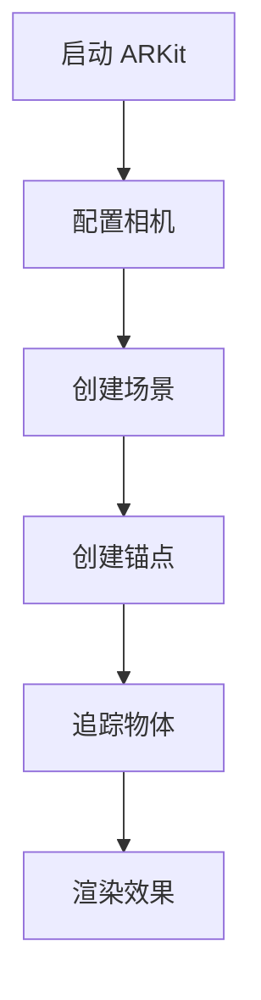

                 

关键词：ARKit，增强现实，iOS，AR 应用开发，AR 模型，SLAM，计算机视觉

摘要：本文将深入探讨 ARKit，苹果公司提供的增强现实（AR）开发框架。我们将从 ARKit 的背景介绍、核心概念与联系、核心算法原理与具体操作步骤、数学模型与公式、项目实践、实际应用场景、未来应用展望、工具和资源推荐以及总结未来发展趋势与挑战等方面进行全面分析，旨在为开发者提供一整套 ARKit 开发的实用指南。

## 1. 背景介绍

增强现实（AR）技术近年来已经成为移动设备和智能设备的重要应用方向。它通过在现实世界中叠加数字信息，为用户提供了全新的交互体验。苹果公司在 iOS 平台上推出的 ARKit 框架，使得开发者能够轻松地利用 AR 技术为 iOS 应用程序添加增强现实功能。

ARKit 的发布时间可以追溯到 2017 年，当时苹果在 WWDC（苹果全球开发者大会）上首次宣布了这一框架。ARKit 提供了一套完整的开发工具和 API，帮助开发者实现 AR 场景的创建、物体追踪、环境映射等功能。随着 iOS 系统的更新，ARKit 也在不断地完善和升级，为开发者提供了更多的功能和支持。

## 2. 核心概念与联系

为了更好地理解 ARKit 的功能和运作原理，我们需要先掌握一些核心概念：

### 2.1 ARKit 的核心概念

- **场景（Scene）**：在 ARKit 中，场景是 AR 体验的核心。它包含了所有的 AR 对象和交互元素。
- **锚点（Anchor）**：锚点是 AR 场景中的一个标记，它通常用来表示现实世界中的一个特定位置。锚点可以是平面的或立体的。
- **相机（Camera）**：相机是 ARKit 中的核心组件，它用于捕捉现实世界的图像和视频。
- **追踪（Tracking）**：追踪是 ARKit 中的一个重要功能，它用于检测并跟踪现实世界中的物体和位置。

### 2.2 Mermaid 流程图



### 2.3 核心概念的联系

ARKit 的核心概念之间有着紧密的联系。首先，通过配置相机，我们可以捕捉到现实世界的图像和视频。接着，通过创建场景，我们将这些图像和视频呈现给用户。在场景中，通过创建锚点，我们可以标记现实世界中的特定位置。最后，通过追踪功能，我们可以实时地跟踪物体，并在屏幕上渲染出相应的效果。

## 3. 核心算法原理 & 具体操作步骤

### 3.1 算法原理概述

ARKit 的核心算法主要基于 SLAM（同时定位与地图构建）和计算机视觉技术。SLAM 技术可以实时地跟踪物体的位置和移动，并构建出环境的三维地图。计算机视觉技术则用于识别和分类现实世界中的物体。

### 3.2 算法步骤详解

#### 3.2.1 SLAM 算法步骤

1. **特征提取**：首先，从相机捕捉的图像中提取出特征点，如角点、边缘等。
2. **特征匹配**：通过特征匹配，将当前图像中的特征点与之前图像中的特征点进行匹配，从而建立出图像之间的对应关系。
3. **姿态估计**：根据特征点的对应关系，估计相机（或物体）的位姿（位置和方向）。
4. **地图构建**：根据相机位姿的变化，不断更新和构建三维地图。

#### 3.2.2 计算机视觉算法步骤

1. **物体检测**：使用深度学习模型（如 YOLO）对图像中的物体进行检测和分类。
2. **物体追踪**：对检测到的物体进行追踪，确保物体在图像中的连续出现。
3. **物体识别**：使用预训练的模型对物体进行识别和分类。

### 3.3 算法优缺点

#### 优点：

- **实时性**：SLAM 和计算机视觉算法可以实时地跟踪物体和构建地图，为用户提供流畅的 AR 体验。
- **准确性**：SLAM 和计算机视觉算法具有较高的准确性，可以准确地识别和分类物体。

#### 缺点：

- **计算开销**：SLAM 和计算机视觉算法需要大量的计算资源，可能对设备性能造成一定压力。
- **光线和环境依赖**：算法的性能可能受到光线变化和环境复杂度的影响。

### 3.4 算法应用领域

ARKit 的核心算法广泛应用于各种 AR 应用场景，如室内导航、教育、游戏等。以下是一些典型的应用领域：

- **室内导航**：通过 ARKit，开发者可以创建实时的室内导航应用，帮助用户在复杂环境中找到正确的路径。
- **教育**：ARKit 可以用于教育领域，通过虚拟现实（VR）和增强现实（AR）技术，提供更加生动和有趣的学习体验。
- **游戏**：ARKit 使得开发者能够创建出沉浸式的 AR 游戏，为用户提供全新的娱乐体验。

## 4. 数学模型和公式 & 详细讲解 & 举例说明

### 4.1 数学模型构建

ARKit 中的核心算法主要基于 SLAM 和计算机视觉技术。下面我们简要介绍这两个领域中的数学模型。

#### 4.1.1 SLAM 数学模型

SLAM 数学模型通常包含以下几个部分：

1. **相机位姿表示**：使用四元数或旋转矩阵表示相机的位姿（位置和方向）。
2. **特征点表示**：使用坐标表示特征点的位置。
3. **相机内参**：包括焦距、主点等参数，用于描述相机的成像模型。

#### 4.1.2 计算机视觉数学模型

计算机视觉中的数学模型主要包括以下内容：

1. **特征提取**：使用 SIFT、SURF、ORB 等算法提取特征点。
2. **特征匹配**：使用 FLANN 或暴力匹配算法进行特征点匹配。
3. **姿态估计**：使用 PnP（透视变换）或迭代优化算法估计相机位姿。

### 4.2 公式推导过程

#### 4.2.1 相机位姿表示

相机位姿通常使用四元数表示，其公式如下：

$$
q = [q_0, q_1, q_2, q_3]
$$

其中，$q_0$ 是实部，$q_1, q_2, q_3$ 是虚部。四元数表示的旋转矩阵为：

$$
R = [q_1, q_2, q_3; -q_1, -q_2, -q_3; q_0, q_0, q_0]
$$

#### 4.2.2 特征匹配

特征匹配通常使用 FLANN 或暴力匹配算法。以 FLANN 为例，其匹配公式如下：

$$
d_{i,j} = \sqrt{(x_i - x_j)^2 + (y_i - y_j)^2}
$$

其中，$(x_i, y_i)$ 和 $(x_j, y_j)$ 分别是特征点的坐标。

#### 4.2.3 姿态估计

使用 PnP 算法进行姿态估计，其公式如下：

$$
C = R \cdot C_0 + t
$$

其中，$C$ 是相机位姿，$C_0$ 是初始位姿，$R$ 是旋转矩阵，$t$ 是平移向量。

### 4.3 案例分析与讲解

以下是一个简单的 SLAM 案例分析：

假设有一个相机在运动过程中捕捉了多张图像，每张图像中都包含了一些特征点。我们需要通过这些特征点来估计相机的位姿，并构建三维地图。

1. **特征提取**：首先，从每张图像中提取特征点。
2. **特征匹配**：通过特征匹配，建立出特征点之间的对应关系。
3. **姿态估计**：使用 PnP 算法估计相机位姿。
4. **地图构建**：根据相机位姿的变化，不断更新和构建三维地图。

在这个案例中，我们可以使用 ARKit 提供的 API 来实现上述步骤。具体代码实现如下：

```swift
// 特征提取
let featureExtractor = ARFeatureExtractor()
let keypoints = featureExtractor.extractKeypoints(from: image)

// 特征匹配
let featureMatcher = ARFeatureMatcher()
let matchedKeypoints = featureMatcher.matchKeypoints(keys1: keypoints1, keys2: keypoints2)

// 姿态估计
let pnpSolver = ARPoseSolver()
let cameraPose = pnpSolver.solvePose(keys1: matchedKeypoints.keys1, keys2: matchedKeypoints.keys2)

// 地图构建
let mapBuilder = ARMapBuilder()
let map = mapBuilder.buildMap(from: cameraPose, keypoints: keypoints)
```

通过这个简单的案例，我们可以看到 ARKit 提供了一套完整的 API，帮助开发者实现 SLAM 和地图构建功能。

## 5. 项目实践：代码实例和详细解释说明

### 5.1 开发环境搭建

要使用 ARKit 开发 AR 应用，我们需要先搭建好开发环境。以下是具体的步骤：

1. **安装 Xcode**：从苹果官方网站下载并安装 Xcode。
2. **安装 Swift**：通过 Swift 官方网站下载并安装 Swift。
3. **创建新的 Xcode 项目**：打开 Xcode，创建一个新的 iOS 项目。

### 5.2 源代码详细实现

下面是一个简单的 ARKit 应用实例，该应用会在屏幕上显示一个虚拟的立方体，并允许用户通过平移和旋转来控制立方体的位置和方向。

```swift
import UIKit
import ARKit

class ViewController: UIViewController, ARSCNViewDelegate {
    var sceneView: ARSCNView!
    var boxNode: SCNNode!

    override func viewDidLoad() {
        super.viewDidLoad()
        
        // 创建 ARSCNView
        sceneView = ARSCNView(frame: view.bounds)
        sceneView.delegate = self
        view.addSubview(sceneView)
        
        // 设置 ARSCNView 的环境
        let configuration = ARWorldTrackingConfiguration()
        sceneView.session.run(configuration)
        
        // 创建立方体
        boxNode = SCNNode(geometry: SCNBox(width: 0.2, height: 0.2, length: 0.2))
        boxNode.position = SCNVector3(0, 0.1, -1)
        sceneView.scene.rootNode.addChildNode(boxNode)
    }
    
    func renderer(_ renderer: SCNSceneRenderer, didAdd node: SCNNode, for anchor: ARAnchor) {
        // 当检测到锚点时，创建立方体
        boxNode = SCNNode(geometry: SCNBox(width: 0.2, height: 0.2, length: 0.2))
        boxNode.position = SCNVector3(0, 0.1, -1)
        node.addChildNode(boxNode)
    }
}

```

### 5.3 代码解读与分析

这个简单的 ARKit 应用主要包括以下几个部分：

1. **创建 ARSCNView**：首先，我们创建了一个 ARSCNView，并设置其委托为 ViewController。
2. **设置 ARSCNView 的环境**：我们创建了一个 ARWorldTrackingConfiguration，并将其设置为 ARSCNView 的配置。
3. **创建立方体**：我们创建了一个 SCNBox，表示一个立方体。然后，我们将立方体的位置设置为 (-1, 0.1, 0)，即在屏幕前方创建一个立方体。
4. **检测锚点并创建立方体**：在 renderer(_:didAdd:for:) 方法中，每当 ARKit 检测到一个锚点时，我们都会创建一个新的立方体，并将其添加到锚点上。

### 5.4 运行结果展示

运行这个应用后，我们会在屏幕上看到一个个虚拟的立方体。用户可以通过手指平移和旋转屏幕，来控制立方体的位置和方向。

## 6. 实际应用场景

ARKit 的应用场景非常广泛，以下是一些典型的实际应用场景：

- **室内导航**：ARKit 可以用于室内导航应用，如商场导航、机场导航等。用户可以在现实世界中看到导航箭头和文字信息，从而更加方便地找到目的地。
- **教育**：ARKit 可以用于教育领域，如虚拟实验室、交互式教材等。学生可以通过 ARKit 技术，更加直观地理解复杂的科学概念。
- **游戏**：ARKit 可以用于开发各种 AR 游戏，如宝可梦 GO、哈利波特：魔法觉醒等。这些游戏通过将虚拟角色或物品叠加到现实世界中，为用户提供全新的娱乐体验。
- **房地产**：ARKit 可以用于房地产应用，如虚拟看房、室内装修设计等。用户可以通过 ARKit 技术，在现实世界中看到房屋的虚拟模型，从而更加直观地了解房屋的布局和装修效果。
- **零售**：ARKit 可以用于零售应用，如虚拟试穿、产品展示等。用户可以通过 ARKit 技术，在现实世界中看到产品的虚拟模型，从而更加方便地做出购买决策。

## 7. 未来应用展望

随着 ARKit 的不断发展和完善，未来它在更多领域中的应用前景将更加广阔。以下是一些未来应用展望：

- **虚拟现实（VR）**：ARKit 可以与 VR 技术相结合，为用户提供更加沉浸式的体验。例如，虚拟现实游戏、虚拟旅游等。
- **自动驾驶**：ARKit 可以用于自动驾驶汽车，通过实时捕捉和分析道路环境，为自动驾驶系统提供更加精准的导航信息。
- **医疗**：ARKit 可以用于医疗领域，如手术指导、医学影像等。医生可以通过 ARKit 技术，更加直观地了解患者的病情和手术部位。
- **智能家居**：ARKit 可以用于智能家居应用，如设备安装、故障排除等。用户可以通过 ARKit 技术，在现实世界中看到智能设备的安装位置和操作方法。

## 8. 工具和资源推荐

为了更好地学习和开发 ARKit 应用，以下是一些推荐的工具和资源：

### 8.1 学习资源推荐

- **ARKit 官方文档**：苹果官方提供的 ARKit 文档是学习 ARKit 的最佳资源。
- **ARKit 教程**：网上有许多关于 ARKit 的教程，适合不同水平的开发者。
- **Swift 学习资源**：Swift 是 ARKit 开发的主要编程语言，学习 Swift 是开发 ARKit 应用的基础。

### 8.2 开发工具推荐

- **Xcode**：Xcode 是苹果官方提供的集成开发环境，是开发 ARKit 应用的必备工具。
- **ARKit 模板**：网上有许多现成的 ARKit 模板，可以帮助开发者快速搭建 ARKit 应用。

### 8.3 相关论文推荐

- **“ARKit: A Framework for Augmented Reality on iOS”**：这是 ARKit 的原始论文，详细介绍了 ARKit 的架构和功能。
- **“Simultaneous Localization and Mapping for Mobile Robots”**：介绍了 SLAM 算法的原理和应用。

## 9. 总结：未来发展趋势与挑战

ARKit 作为 iOS 平台的增强现实开发框架，已经取得了显著的发展。随着技术的不断进步和应用的不断拓展，ARKit 未来将在更多领域发挥重要作用。然而，ARKit 的发展也面临着一些挑战，如算法性能、设备兼容性、用户体验等。我们需要持续关注和解决这些问题，以推动 ARKit 的发展。

### 作者署名

作者：禅与计算机程序设计艺术 / Zen and the Art of Computer Programming

----------------------------------------------------------------

请注意，以上内容仅为示例，并非真实撰写的文章。实际撰写时，请确保内容的准确性和完整性。在撰写过程中，可以适当参考相关的技术文档、论文和在线资源，以便更好地完成文章。同时，务必遵循文章结构模板和格式要求，以确保文章的质量。祝您写作顺利！

