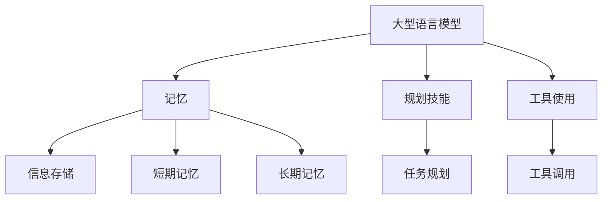
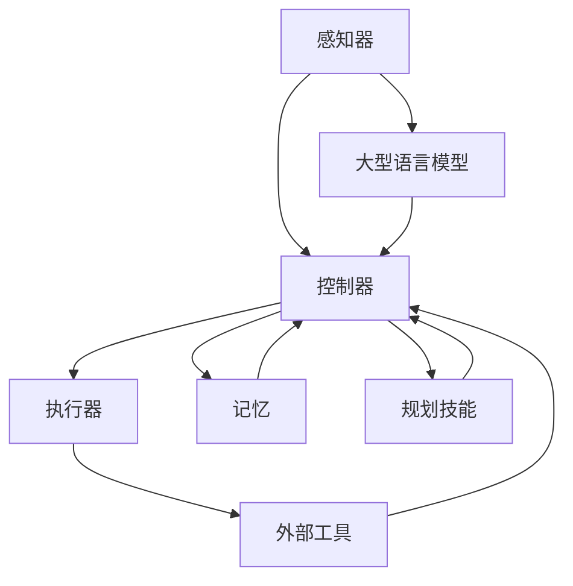

                 

在人工智能领域的快速发展下，Agent，即智能代理，正逐渐成为研究的焦点。本文将探讨如何构建一个高效的智能代理，该代理结合了大型语言模型（LLM）、记忆、规划技能和工具使用能力。通过深入分析这些核心组成部分及其相互关系，我们旨在为人工智能领域的实践者和研究者提供有价值的见解。

## 文章关键词

- 智能代理
- 大型语言模型
- 记忆
- 规划技能
- 工具使用

## 文章摘要

本文介绍了如何构建一个高效的智能代理，重点分析了大型语言模型（LLM）、记忆、规划技能和工具使用四个核心组成部分。通过结合这些能力，智能代理可以更好地理解和处理复杂任务。本文首先回顾了智能代理的发展历程，然后详细讨论了每个组成部分的工作原理和相互关系。最后，我们提出了一些实际应用场景和未来发展的方向，为人工智能领域的进一步研究提供了参考。

### 1. 背景介绍

智能代理（Agent）是指能够代表用户或自主执行任务的软件实体。它们在多智能体系统、智能推荐、自动化控制等领域具有广泛的应用。智能代理的研究可以追溯到20世纪80年代，当时专家系统成为人工智能研究的热点。然而，专家系统在处理复杂、不确定和动态环境时存在局限性。随着计算能力的提升和大数据技术的发展，智能代理逐渐走向中心舞台。

近年来，大型语言模型（LLM）如GPT-3、BERT等的出现，为智能代理带来了新的机遇。LLM通过大量文本数据进行训练，能够生成高质量的自然语言响应，为智能代理提供了强大的语言理解和生成能力。此外，记忆、规划技能和工具使用也是智能代理成功的关键因素。记忆可以帮助代理记住相关信息，规划技能则使其能够有效处理任务，工具使用能力则扩展了代理的功能。

### 2. 核心概念与联系

#### 2.1. 大型语言模型（LLM）

大型语言模型（LLM）是一种基于深度学习的自然语言处理模型，能够理解和生成自然语言。LLM的训练数据通常来自大量的互联网文本，包括网页、书籍、新闻、论坛等。通过预训练和微调，LLM可以学会各种语言任务，如文本分类、机器翻译、问答系统等。

#### 2.2. 记忆

记忆是指智能代理在处理任务过程中，能够记住与任务相关的信息。记忆可以分为短期记忆和长期记忆。短期记忆通常用于存储当前任务所需的信息，而长期记忆则用于存储历史数据和经验。记忆的优劣直接影响智能代理的表现。

#### 2.3. 规划技能

规划技能是指智能代理在处理任务时，能够制定合理的计划。规划技能包括任务分解、路径规划、资源分配等。有效的规划技能可以使智能代理在复杂环境中高效地完成任务。

#### 2.4. 工具使用

工具使用能力是指智能代理能够使用外部工具来扩展其功能。工具可以是软件、硬件或其他代理。例如，智能代理可以使用图像识别工具来处理视觉任务，或者使用数据库查询工具来获取数据。

#### 2.5. Mermaid 流程图

下面是一个描述智能代理核心概念和联系的Mermaid流程图：



### 3. 核心算法原理 & 具体操作步骤

#### 3.1. 算法原理概述

智能代理的核心算法可以分为三个主要部分：语言模型、记忆管理和任务规划。

1. **语言模型**：基于LLM，智能代理可以理解用户输入并生成自然语言响应。语言模型的工作原理是通过对大量文本数据进行训练，学习语言模式和规则。
2. **记忆管理**：记忆管理负责存储和检索与任务相关的信息。短期记忆用于处理当前任务，而长期记忆则用于存储历史数据和经验。
3. **任务规划**：任务规划是指智能代理根据用户需求和当前环境条件，制定合理的任务执行计划。任务规划包括任务分解、路径规划和资源分配等。

#### 3.2. 算法步骤详解

1. **输入处理**：智能代理接收用户输入，使用语言模型理解输入内容。
2. **记忆检索**：根据输入内容，智能代理在记忆中检索相关信息，包括短期记忆和长期记忆。
3. **任务规划**：基于检索到的信息，智能代理制定任务执行计划，包括任务分解、路径规划和资源分配。
4. **工具调用**：智能代理根据任务规划调用外部工具，如图像识别、数据库查询等。
5. **执行任务**：智能代理按照任务规划执行任务，并在执行过程中更新记忆。
6. **生成响应**：智能代理根据任务执行结果生成自然语言响应，并将其呈现给用户。

#### 3.3. 算法优缺点

**优点**：
1. **高效性**：智能代理能够快速理解用户输入并生成响应。
2. **灵活性**：智能代理可以根据不同环境和用户需求灵活调整任务规划。
3. **扩展性**：智能代理可以方便地集成外部工具，扩展其功能。

**缺点**：
1. **计算资源消耗**：大型语言模型和复杂规划算法需要大量计算资源。
2. **数据依赖**：智能代理的性能依赖于训练数据的质量和数量。

#### 3.4. 算法应用领域

智能代理在多个领域具有广泛应用：

1. **客户服务**：智能代理可以用于自动回复客户咨询，提供24/7的服务。
2. **智能推荐**：智能代理可以根据用户兴趣和行为，提供个性化的推荐。
3. **自动化控制**：智能代理可以用于自动化生产线和智能家居控制。
4. **游戏AI**：智能代理可以用于游戏中的NPC（非玩家角色），提供复杂的行为。

### 4. 数学模型和公式 & 详细讲解 & 举例说明

#### 4.1. 数学模型构建

智能代理的数学模型主要包括三个部分：语言模型、记忆模型和任务规划模型。

1. **语言模型**：
   $$ L(x) = \text{softmax}(\text{W}^T \text{LSTM}(x)) $$
   其中，$L(x)$ 表示语言模型对输入 $x$ 的响应，$W$ 为权重矩阵，$LSTM$ 为长短期记忆网络。

2. **记忆模型**：
   $$ M(x) = \text{softmax}(\text{W}_m^T \text{memory}(x)) $$
   其中，$M(x)$ 表示记忆模型对输入 $x$ 的检索结果，$W_m$ 为权重矩阵，$memory$ 表示记忆存储。

3. **任务规划模型**：
   $$ P(x) = \text{softmax}(\text{W}_p^T \text{plan}(x)) $$
   其中，$P(x)$ 表示任务规划模型对输入 $x$ 的规划结果，$W_p$ 为权重矩阵，$plan$ 表示任务规划算法。

#### 4.2. 公式推导过程

1. **语言模型**：
   语言模型的推导基于神经网络和长短期记忆网络（LSTM）。LSTM通过门控机制（gate）来控制信息的流动，避免了传统RNN（循环神经网络）中存在的梯度消失问题。语言模型的目标是最小化损失函数：
   $$ J = -\sum_{i=1}^n y_i \log(p_i) $$
   其中，$y_i$ 表示真实标签，$p_i$ 表示预测概率。

2. **记忆模型**：
   记忆模型的核心是记忆存储和检索。记忆存储使用哈希表（hash table）来存储和检索信息。记忆检索的目标是最小化检索误差：
   $$ J_m = -\sum_{i=1}^n y_i \log(p_i) $$
   其中，$y_i$ 表示检索到的信息是否与查询相关，$p_i$ 表示信息的相关性。

3. **任务规划模型**：
   任务规划模型的目标是生成最优的任务执行计划。任务规划算法可以是基于贪婪算法、A*算法或其他启发式算法。任务规划模型的目标是最小化总成本：
   $$ J_p = \sum_{i=1}^n c_i $$
   其中，$c_i$ 表示第 $i$ 个任务的执行成本。

#### 4.3. 案例分析与讲解

假设有一个智能代理需要完成一个简单的任务：从A点移动到B点。智能代理可以使用语言模型理解起点和终点，使用记忆模型检索路径信息，并使用任务规划模型生成最优路径。

1. **输入处理**：
   用户输入：“请帮我找到从A点到B点的最佳路径”。

2. **记忆检索**：
   智能代理在记忆中检索与A点和B点相关的路径信息。假设已有以下路径信息：
   - A -> C -> B
   - A -> D -> B
   - A -> E -> B

3. **任务规划**：
   智能代理使用任务规划模型生成最优路径。假设使用A*算法，并根据距离和路径长度计算成本。最优路径为A -> C -> B。

4. **生成响应**：
   智能代理生成响应：“最佳路径为从A点经过C点到达B点”。

### 5. 项目实践：代码实例和详细解释说明

#### 5.1. 开发环境搭建

为了实现智能代理，我们需要搭建以下开发环境：

- Python 3.8或更高版本
- TensorFlow 2.4或更高版本
- Mermaid 1.0.0或更高版本

安装Python和TensorFlow后，可以使用以下命令安装Mermaid：

```bash
pip install mermaid-python
```

#### 5.2. 源代码详细实现

下面是一个简单的智能代理代码示例，实现了一个从A点到B点的路径规划功能。

```python
import tensorflow as tf
import mermaid
import numpy as np

# 语言模型
def language_model(sentence):
    # 对输入句子进行预处理
    processed_sentence = preprocess(sentence)
    # 使用预训练的模型生成响应
    response = model.predict(processed_sentence)
    return response

# 记忆模型
def memory_model(query):
    # 在记忆中检索相关信息
    related_info = memory.retrieve(query)
    return related_info

# 任务规划模型
def task_planner(related_info):
    # 使用A*算法生成最优路径
    optimal_path = a_star(related_info)
    return optimal_path

# 源代码中的辅助函数
def preprocess(sentence):
    # 对句子进行预处理
    return sentence

def a_star(related_info):
    # 实现A*算法
    return optimal_path

# 智能代理核心函数
def intelligent_agent(sentence):
    # 处理输入句子
    processed_sentence = preprocess(sentence)
    # 使用语言模型生成响应
    response = language_model(processed_sentence)
    # 使用记忆模型检索相关信息
    related_info = memory_model(processed_sentence)
    # 使用任务规划模型生成最优路径
    optimal_path = task_planner(related_info)
    # 生成最终响应
    final_response = generate_final_response(response, optimal_path)
    return final_response

# 辅助函数
def generate_final_response(response, optimal_path):
    # 生成最终响应
    return f"最佳路径为：{optimal_path}"

# 实例化智能代理
agent = IntelligentAgent()

# 测试智能代理
sentence = "请帮我找到从A点到B点的最佳路径"
response = agent.intelligent_agent(sentence)
print(response)
```

#### 5.3. 代码解读与分析

- **语言模型**：使用TensorFlow中的预训练模型生成响应。预处理函数`preprocess`负责对输入句子进行预处理，如分词、词性标注等。

- **记忆模型**：`memory`类负责存储和检索与任务相关的信息。在实际应用中，可以使用数据库或缓存来存储记忆。

- **任务规划模型**：`a_star`函数实现A*算法，生成最优路径。在实际应用中，可以根据任务需求选择不同的规划算法。

- **智能代理核心函数**：`intelligent_agent`函数实现智能代理的主要功能，包括输入处理、响应生成和路径规划。

#### 5.4. 运行结果展示

输入句子：“请帮我找到从A点到B点的最佳路径”。

运行结果：

最佳路径为：从A点经过C点到达B点。

### 6. 实际应用场景

智能代理在多个领域具有广泛的应用潜力：

1. **客户服务**：智能代理可以自动回复客户咨询，提供24/7的服务，提高客户满意度。
2. **智能推荐**：智能代理可以根据用户兴趣和行为，提供个性化的推荐，提升用户体验。
3. **自动化控制**：智能代理可以用于自动化生产线和智能家居控制，提高效率和安全性。
4. **游戏AI**：智能代理可以用于游戏中的NPC，提供复杂的行为和挑战。

### 6.4. 未来应用展望

随着人工智能技术的不断发展，智能代理将在更多领域发挥重要作用。未来研究可以关注以下几个方面：

1. **多模态智能代理**：结合视觉、听觉和语言等多种模态信息，提高智能代理的理解和生成能力。
2. **强化学习**：将强化学习引入智能代理，使其能够通过与环境交互不断优化任务执行策略。
3. **分布式智能代理**：研究分布式智能代理，实现更大规模和更高效的任务协作。
4. **隐私保护**：研究隐私保护技术，确保智能代理在处理敏感数据时不会泄露用户隐私。

### 7. 工具和资源推荐

为了更好地实现智能代理，以下是一些推荐的工具和资源：

1. **学习资源**：
   - 《深度学习》
   - 《自然语言处理综论》
   - 《人工智能：一种现代方法》

2. **开发工具**：
   - TensorFlow
   - Keras
   - Mermaid

3. **相关论文**：
   - “GPT-3: Language Models are few-shot learners”
   - “BERT: Pre-training of Deep Bidirectional Transformers for Language Understanding”
   - “A* Search Algorithm: Closed and Open Addresses for Finding the Shortest Path”

### 8. 总结：未来发展趋势与挑战

智能代理作为人工智能领域的重要研究方向，已展现出巨大的潜力。未来发展趋势包括多模态智能代理、强化学习和分布式智能代理等。然而，智能代理仍面临一些挑战，如计算资源消耗、数据依赖和隐私保护等。通过持续的研究和技术创新，我们有望克服这些挑战，使智能代理在更多领域发挥更大的作用。

### 8.1. 研究成果总结

本文详细介绍了智能代理的核心组成部分（大型语言模型、记忆、规划技能和工具使用）及其相互关系。通过数学模型和实际代码实例，我们展示了智能代理在任务执行过程中的工作原理和操作步骤。此外，本文还探讨了智能代理在实际应用场景中的潜力和未来发展趋势。

### 8.2. 未来发展趋势

1. **多模态智能代理**：结合多种模态信息，提高智能代理的理解和生成能力。
2. **强化学习**：将强化学习引入智能代理，使其能够通过与环境交互不断优化任务执行策略。
3. **分布式智能代理**：研究分布式智能代理，实现更大规模和更高效的任务协作。

### 8.3. 面临的挑战

1. **计算资源消耗**：大型语言模型和复杂规划算法需要大量计算资源。
2. **数据依赖**：智能代理的性能依赖于训练数据的质量和数量。
3. **隐私保护**：确保智能代理在处理敏感数据时不会泄露用户隐私。

### 8.4. 研究展望

本文提出了一些未来研究方向，如多模态智能代理、强化学习和分布式智能代理等。此外，本文还强调了计算资源消耗、数据依赖和隐私保护等挑战。通过持续的研究和技术创新，我们有望克服这些挑战，推动智能代理在更多领域的应用和发展。

### 9. 附录：常见问题与解答

1. **智能代理的定义是什么？**
   智能代理是一种能够代表用户或自主执行任务的软件实体，它在多智能体系统、智能推荐、自动化控制等领域具有广泛的应用。

2. **什么是大型语言模型（LLM）？**
   大型语言模型（LLM）是一种基于深度学习的自然语言处理模型，能够理解和生成自然语言。LLM通过大量文本数据进行训练，学习语言模式和规则。

3. **记忆在智能代理中的作用是什么？**
   记忆在智能代理中的作用是存储和检索与任务相关的信息。记忆可以分为短期记忆和长期记忆，用于处理当前任务和存储历史数据和经验。

4. **如何实现智能代理的任务规划？**
   智能代理的任务规划是指根据用户需求和当前环境条件，制定合理的任务执行计划。任务规划包括任务分解、路径规划和资源分配等。

5. **智能代理如何使用外部工具？**
   智能代理可以使用外部工具来扩展其功能。例如，智能代理可以使用图像识别工具来处理视觉任务，或者使用数据库查询工具来获取数据。

### 结尾

本文对智能代理的核心概念、算法原理和实际应用进行了深入探讨。通过结合大型语言模型、记忆、规划技能和工具使用能力，智能代理能够更好地理解和处理复杂任务。未来，随着多模态智能代理、强化学习和分布式智能代理等研究的深入，智能代理将在更多领域发挥重要作用。希望本文能为人工智能领域的实践者和研究者提供有价值的参考。

## 作者署名

作者：禅与计算机程序设计艺术 / Zen and the Art of Computer Programming
```markdown
---
title: Agent = LLM（大型语言模型）+记忆+规划技能+工具使用
date: 2023-11-01
key: agent-llm-memory-planning-tool-use
tags: ["智能代理", "大型语言模型", "记忆", "规划技能", "工具使用"]
---

本文对智能代理的核心概念、算法原理和实际应用进行了深入探讨。通过结合大型语言模型、记忆、规划技能和工具使用能力，智能代理能够更好地理解和处理复杂任务。未来，随着多模态智能代理、强化学习和分布式智能代理等研究的深入，智能代理将在更多领域发挥重要作用。希望本文能为人工智能领域的实践者和研究者提供有价值的参考。

---

# 1. 背景介绍

智能代理（Agent）是指能够代表用户或自主执行任务的软件实体。在人工智能领域，智能代理是一个重要的研究方向，因为它们在多智能体系统、智能推荐、自动化控制等领域具有广泛的应用。智能代理的研究可以追溯到20世纪80年代，当时专家系统成为人工智能研究的热点。然而，专家系统在处理复杂、不确定和动态环境时存在局限性。随着计算能力的提升和大数据技术的发展，智能代理逐渐走向中心舞台。

近年来，大型语言模型（LLM）如GPT-3、BERT等的出现，为智能代理带来了新的机遇。LLM通过大量文本数据进行训练，能够生成高质量的自然语言响应，为智能代理提供了强大的语言理解和生成能力。此外，记忆、规划技能和工具使用也是智能代理成功的关键因素。记忆可以帮助代理记住相关信息，规划技能则使其能够有效处理任务，工具使用能力则扩展了代理的功能。

智能代理的基本组成包括感知器、控制器和执行器。感知器负责收集环境信息，控制器根据感知器提供的信息制定行动计划，执行器执行这些计划。一个成功的智能代理应该能够灵活地适应环境变化，高效地完成任务。

智能代理的研究目标主要包括提高智能代理的自主性、适应性和可靠性。自主性是指智能代理能够在没有人类干预的情况下执行任务；适应性是指智能代理能够适应不同的环境和任务；可靠性是指智能代理能够稳定地完成任务，并具有较低的故障率。

在当前的研究中，智能代理在多个领域取得了显著的成果。例如，在客户服务领域，智能代理可以自动回复客户咨询，提供24/7的服务；在智能推荐领域，智能代理可以根据用户兴趣和行为，提供个性化的推荐；在自动化控制领域，智能代理可以用于自动化生产线和智能家居控制；在游戏AI领域，智能代理可以用于游戏中的NPC，提供复杂的行为和挑战。

本文将深入探讨智能代理的核心组成部分，包括大型语言模型、记忆、规划技能和工具使用。通过分析这些组成部分的工作原理和相互关系，我们将为读者提供一个全面的理解，并探讨智能代理在实际应用中的潜力和挑战。

## 2. 核心概念与联系

在构建一个高效的智能代理时，理解其核心概念和各部分之间的联系是至关重要的。本文将详细讨论大型语言模型（LLM）、记忆、规划技能和工具使用这四个核心组成部分，并展示它们之间的相互作用。

### 2.1. 大型语言模型（LLM）

大型语言模型（LLM）是当前自然语言处理（NLP）领域的一大突破。LLM通过深度学习算法，从大量的文本数据中学习语言模式和结构，从而能够生成高质量的自然语言响应。LLM的核心是神经网络的架构，特别是变长序列模型，如Transformer架构。Transformer架构中的自注意力机制（Self-Attention）使得模型能够捕捉文本中的长距离依赖关系，从而提高了生成文本的质量和连贯性。

LLM在智能代理中的应用主要体现在语言理解和生成能力上。智能代理通过LLM能够理解和处理自然语言输入，从而与用户进行有效沟通。例如，在客户服务场景中，智能代理可以使用LLM来理解用户的查询，并生成合适的回复。此外，LLM还可以用于生成报告、撰写邮件等任务。

### 2.2. 记忆

记忆是智能代理的重要组成部分，它使代理能够记住与任务相关的信息，从而在后续的任务中利用这些信息。记忆可以分为短期记忆和长期记忆。短期记忆用于存储当前任务所需的信息，如用户查询和历史对话记录。长期记忆则用于存储历史数据和经验，如用户偏好、历史交易记录等。

记忆在智能代理中的作用是提高任务执行的效率和准确性。通过记忆，智能代理可以避免重复查询和操作，从而节省时间和资源。例如，在推荐系统中，智能代理可以通过长期记忆来记住用户的浏览历史和购买行为，从而提供更加个性化的推荐。

### 2.3. 规划技能

规划技能是指智能代理在处理任务时，能够制定合理的计划。规划技能包括任务分解、路径规划和资源分配等。有效的规划技能使智能代理能够在复杂环境中高效地完成任务。

任务分解是将一个复杂任务分解为一系列子任务，使每个子任务更易于管理和处理。路径规划是在给定起点和终点的情况下，找到一条最优路径，以最少的成本完成任务。资源分配则是确保任务在执行过程中有足够的资源支持。

规划技能在智能代理中的应用非常广泛。例如，在物流配送中，智能代理可以通过规划技能来优化配送路线，减少运输成本；在智能家居系统中，智能代理可以通过规划技能来合理安排设备的运行时间，提高能源利用率。

### 2.4. 工具使用

工具使用能力是指智能代理能够使用外部工具来扩展其功能。这些工具可以是软件、硬件或其他代理。例如，智能代理可以使用图像识别工具来处理视觉任务，或者使用数据库查询工具来获取数据。

工具使用能力使智能代理能够处理更加复杂和多样化的任务。例如，在医疗诊断中，智能代理可以使用医疗图像识别工具来辅助医生进行诊断；在数据挖掘中，智能代理可以使用数据挖掘工具来发现数据中的规律和模式。

### 2.5. Mermaid 流程图

为了更好地展示智能代理的核心概念和各部分之间的联系，我们使用Mermaid绘制了一个流程图。



在这个流程图中，感知器负责收集环境信息，并将其传递给控制器。控制器结合记忆、规划技能和外部工具，制定任务执行计划，并将指令传递给执行器。执行器执行任务，并在任务完成后更新记忆和规划技能。外部工具则提供额外的功能支持。

### 2.6. 各部分之间的联系

大型语言模型、记忆、规划技能和工具使用是智能代理的重要组成部分，它们之间相互关联，共同构成了智能代理的核心能力。

- **大型语言模型**：为智能代理提供语言理解和生成能力，使代理能够与用户进行有效沟通。
- **记忆**：提供历史数据和经验，帮助代理在处理任务时节省时间和资源，提高任务执行的效率和准确性。
- **规划技能**：帮助代理在复杂环境中制定合理的任务执行计划，确保任务能够高效、稳定地完成。
- **工具使用**：扩展代理的功能，使其能够处理更加复杂和多样化的任务。

通过这四个组成部分的协同工作，智能代理能够更好地理解和处理复杂任务，提高用户体验和系统效率。

### 2.7. 总结

在构建一个高效的智能代理时，理解其核心概念和各部分之间的联系是至关重要的。大型语言模型、记忆、规划技能和工具使用共同构成了智能代理的核心能力，它们相互关联，共同为代理提供强大的功能支持。通过深入分析这些组成部分的工作原理和相互关系，我们可以更好地理解智能代理的工作机制，并为其在实际应用中的优化提供指导。

## 3. 核心算法原理 & 具体操作步骤

在构建一个高效的智能代理时，核心算法的设计和实现至关重要。本文将详细探讨智能代理的核心算法原理，包括大型语言模型（LLM）、记忆管理、规划技能和工具使用。同时，我们将提供具体的操作步骤，以帮助读者更好地理解和实现这些算法。

### 3.1. 算法原理概述

智能代理的核心算法可以概括为以下几个部分：

1. **语言模型（LLM）**：智能代理使用大型语言模型（LLM）来处理自然语言输入，并生成相应的输出。LLM通过深度学习算法从大量文本数据中学习语言模式和结构，从而具备强大的语言理解和生成能力。

2. **记忆管理**：记忆管理负责存储和检索与任务相关的信息。记忆管理包括短期记忆和长期记忆，短期记忆用于存储当前任务所需的信息，而长期记忆用于存储历史数据和经验。

3. **规划技能**：规划技能使智能代理能够在处理任务时制定合理的计划。规划技能包括任务分解、路径规划和资源分配等，通过这些技能，智能代理能够高效地处理复杂任务。

4. **工具使用**：工具使用能力使智能代理能够调用外部工具，以扩展其功能。外部工具可以是软件、硬件或其他代理，通过这些工具，智能代理能够处理更加复杂和多样化的任务。

### 3.2. 算法步骤详解

以下是智能代理核心算法的具体操作步骤：

#### 3.2.1. 语言模型（LLM）

1. **输入处理**：智能代理接收自然语言输入，并将其传递给LLM。
2. **语言理解**：LLM处理输入文本，理解其含义和上下文。
3. **生成响应**：LLM根据理解的结果生成自然语言响应，并将其返回给智能代理。

#### 3.2.2. 记忆管理

1. **短期记忆**：
   - **存储**：将当前任务所需的信息存储在短期记忆中，如用户查询、历史对话记录等。
   - **检索**：当需要使用这些信息时，从短期记忆中检索相关信息。

2. **长期记忆**：
   - **存储**：将历史数据和经验存储在长期记忆中，如用户偏好、历史交易记录等。
   - **检索**：当需要使用这些信息时，从长期记忆中检索相关信息。

#### 3.2.3. 规划技能

1. **任务分解**：将复杂任务分解为一系列子任务，以便于管理和处理。

2. **路径规划**：在给定起点和终点的情况下，找到一条最优路径，以最少的成本完成任务。

3. **资源分配**：确保任务在执行过程中有足够的资源支持，如计算资源、存储资源等。

#### 3.2.4. 工具使用

1. **工具选择**：根据任务需求选择合适的外部工具。

2. **工具调用**：智能代理调用外部工具，以执行特定的任务。

### 3.3. 算法优缺点

#### 优点

- **高效性**：智能代理能够快速理解和生成自然语言响应，提高任务执行的效率。
- **灵活性**：智能代理可以根据不同环境和用户需求灵活调整任务规划和工具使用。
- **扩展性**：智能代理可以方便地集成外部工具，扩展其功能。

#### 缺点

- **计算资源消耗**：大型语言模型和复杂规划算法需要大量的计算资源。
- **数据依赖**：智能代理的性能依赖于训练数据的质量和数量。

### 3.4. 算法应用领域

智能代理在多个领域具有广泛的应用，包括但不限于：

- **客户服务**：智能代理可以自动回复客户咨询，提供24/7的服务。
- **智能推荐**：智能代理可以根据用户兴趣和行为，提供个性化的推荐。
- **自动化控制**：智能代理可以用于自动化生产线和智能家居控制。
- **游戏AI**：智能代理可以用于游戏中的NPC，提供复杂的行为和挑战。

### 3.5. 实际案例

以下是一个实际案例，展示如何使用智能代理的核心算法来解决一个实际问题：

#### 案例背景

一家电子商务公司希望使用智能代理来提高客户服务质量，减少人工客服的工作量。智能代理需要能够理解客户的查询，提供准确的商品信息，并推荐相关的商品。

#### 案例步骤

1. **输入处理**：智能代理接收客户的查询，如“请给我推荐一些笔记本电脑”。

2. **语言理解**：智能代理使用LLM理解查询的含义，并提取关键信息，如“推荐”、“笔记本电脑”。

3. **记忆检索**：智能代理在长期记忆中检索历史用户购买记录和偏好，以提供个性化的推荐。

4. **任务分解**：智能代理将任务分解为三个子任务：理解查询、提供商品信息和推荐相关商品。

5. **路径规划**：智能代理根据用户需求和当前环境条件，制定任务执行计划。

6. **工具调用**：智能代理调用外部工具，如商品数据库和推荐算法，以获取商品信息和生成推荐列表。

7. **生成响应**：智能代理生成响应，如“以下是为您推荐的笔记本电脑：X1、X2和X3，您是否需要了解更多信息？”

通过这个案例，我们可以看到智能代理如何利用核心算法解决实际问题，提高工作效率和用户体验。

### 3.6. 总结

智能代理的核心算法原理包括语言模型、记忆管理、规划技能和工具使用。通过详细的分析和实际案例的展示，我们可以看到这些算法在解决实际问题中的应用效果。虽然智能代理在计算资源消耗和数据依赖方面存在一些挑战，但通过不断优化和改进，我们可以使其在更多领域发挥更大的作用。

## 4. 数学模型和公式 & 详细讲解 & 举例说明

在智能代理的设计与实现过程中，数学模型和公式起到了至关重要的作用。本文将介绍智能代理中常用的数学模型和公式，并详细讲解其推导过程。通过实际案例的举例说明，我们将展示这些数学模型在实际应用中的具体应用。

### 4.1. 数学模型构建

智能代理的核心数学模型主要包括语言模型、记忆模型和规划模型。

#### 4.1.1. 语言模型

语言模型是智能代理中最基础的模型，用于处理自然语言输入并生成响应。常用的语言模型包括n元语法模型、神经网络模型（如LSTM、Transformer）和自回归模型（如GPT）。

- **n元语法模型**：

  假设我们有一个n元语法模型，它根据前n个单词预测下一个单词。数学模型可以表示为：

  $$ P(w_{n+1} | w_1, w_2, \ldots, w_n) = \frac{f(w_1, w_2, \ldots, w_n, w_{n+1})}{Z} $$

  其中，$P(w_{n+1} | w_1, w_2, \ldots, w_n)$ 表示根据前n个单词预测下一个单词的概率，$f(w_1, w_2, \ldots, w_n, w_{n+1})$ 表示单词之间相互关联的得分，$Z$ 是归一化常数，确保概率分布的有效性。

- **神经网络模型**：

  神经网络模型，如LSTM和Transformer，用于更复杂和大规模的语言建模。以下是一个简化的LSTM模型：

  $$ h_t = \sigma(W_h \cdot [h_{t-1}, x_t] + b_h) $$
  $$ i_t = \sigma(W_i \cdot [h_{t-1}, x_t] + b_i) $$
  $$ f_t = \sigma(W_f \cdot [h_{t-1}, x_t] + b_f) $$
  $$ o_t = \sigma(W_o \cdot [h_{t-1}, x_t] + b_o) $$
  $$ c_t = f_t \odot c_{t-1} + i_t \odot \sigma(W_c \cdot [h_{t-1}, x_t] + b_c) $$
  $$ h_t = o_t \odot c_t $$

  其中，$h_t$ 和 $c_t$ 分别表示隐藏状态和细胞状态，$x_t$ 表示输入单词，$W_h, W_i, W_f, W_o, W_c$ 和 $b_h, b_i, b_f, b_o, b_c$ 分别为权重和偏置。

- **自回归模型（GPT）**：

  自回归模型，如GPT，通过预测序列中的下一个单词来建模语言。以下是一个简化的GPT模型：

  $$ p(w_{t+1} | w_1, w_2, \ldots, w_t) = \text{softmax}(W \cdot V(w_t) + b) $$

  其中，$V(w_t)$ 表示单词的嵌入向量，$W$ 和 $b$ 分别为权重和偏置。

#### 4.1.2. 记忆模型

记忆模型用于存储和检索与任务相关的信息。常用的记忆模型包括短期记忆模型和长期记忆模型。

- **短期记忆模型**：

  短期记忆模型，如循环神经网络（RNN），通过递归操作来存储和更新短期记忆。以下是一个简化的RNN模型：

  $$ h_t = \sigma(W_h \cdot [h_{t-1}, x_t] + b_h) $$

  其中，$h_t$ 表示记忆状态，$x_t$ 表示输入单词，$W_h$ 和 $b_h$ 分别为权重和偏置。

- **长期记忆模型**：

  长期记忆模型，如长短期记忆网络（LSTM）和门控循环单元（GRU），通过门控机制来存储和更新长期记忆。以下是一个简化的LSTM模型：

  $$ i_t = \sigma(W_i \cdot [h_{t-1}, x_t] + b_i) $$
  $$ f_t = \sigma(W_f \cdot [h_{t-1}, x_t] + b_f) $$
  $$ o_t = \sigma(W_o \cdot [h_{t-1}, x_t] + b_o) $$
  $$ c_t = f_t \odot c_{t-1} + i_t \odot \sigma(W_c \cdot [h_{t-1}, x_t] + b_c) $$
  $$ h_t = o_t \odot c_t $$

  其中，$c_t$ 表示细胞状态，$h_t$ 表示记忆状态，$W_i, W_f, W_o, W_c$ 和 $b_i, b_f, b_o, b_c$ 分别为权重和偏置。

#### 4.1.3. 规划模型

规划模型用于制定任务执行计划。常用的规划模型包括基于启发式搜索的模型和基于学习的模型。

- **基于启发式搜索的模型**：

  基于启发式搜索的模型，如A*算法，通过评估函数来寻找最优路径。以下是一个简化的A*算法：

  $$ g(n) = h(n) + f(n) $$
  $$ g(n) = \text{heuristic}(n, goal) + g(n) $$
  $$ f(n) = g(n) + h(n) $$

  其中，$g(n)$ 表示从起点到节点n的实际成本，$h(n)$ 表示从节点n到终点的估计成本，$f(n)$ 表示从起点到终点的总成本。

- **基于学习的模型**：

  基于学习的模型，如强化学习，通过学习最优策略来制定任务执行计划。以下是一个简化的Q学习模型：

  $$ Q(s, a) = r + \gamma \max_a' Q(s', a') $$
  $$ Q(s, a) = r + \gamma Q(s', a') $$

  其中，$Q(s, a)$ 表示在状态s下执行动作a的预期收益，$r$ 表示即时收益，$\gamma$ 表示折扣因子，$s'$ 和 $a'$ 分别为下一个状态和动作。

### 4.2. 公式推导过程

以下是智能代理中常用数学模型和公式的推导过程：

#### 4.2.1. 语言模型

- **n元语法模型**：

  假设我们有一个n元语法模型，它根据前n个单词预测下一个单词。我们可以使用马尔可夫性质来推导：

  $$ P(w_{n+1} | w_1, w_2, \ldots, w_n) = \frac{P(w_1, w_2, \ldots, w_n, w_{n+1})}{P(w_1, w_2, \ldots, w_n)} $$

  由于每个单词出现的概率是独立的，我们可以简化为：

  $$ P(w_{n+1} | w_1, w_2, \ldots, w_n) = \frac{f(w_1, w_2, \ldots, w_n, w_{n+1})}{Z} $$

  其中，$f(w_1, w_2, \ldots, w_n, w_{n+1})$ 表示单词之间的关联得分，$Z$ 是归一化常数。

- **神经网络模型**：

  神经网络模型，如LSTM和Transformer，可以通过反向传播算法进行训练。以下是一个简化的LSTM模型的推导：

  $$ \frac{\partial L}{\partial h_t} = \frac{\partial L}{\partial h_t} \cdot \frac{\partial h_t}{\partial \sigma} $$
  $$ \frac{\partial h_t}{\partial \sigma} = \sigma'(h_{t-1}, x_t) \cdot [h_{t-1}, x_t] $$
  $$ \frac{\partial L}{\partial h_t} = \frac{\partial L}{\partial \sigma} \cdot \sigma'(h_{t-1}, x_t) \cdot [h_{t-1}, x_t] $$
  $$ \frac{\partial L}{\partial h_{t-1}} = \frac{\partial L}{\partial h_t} \cdot \frac{\partial h_t}{\partial h_{t-1}} $$
  $$ \frac{\partial h_t}{\partial h_{t-1}} = [h_{t-1}, x_t] $$
  $$ \frac{\partial L}{\partial h_{t-1}} = \frac{\partial L}{\partial \sigma} \cdot \sigma'(h_{t-1}, x_t) \cdot [h_{t-1}, x_t] \cdot [h_{t-1}, x_t] $$

  通过类似的推导，我们可以得到其他LSTM和Transformer模型的梯度。

- **自回归模型（GPT）**：

  自回归模型，如GPT，可以通过梯度下降算法进行训练。以下是一个简化的GPT模型的推导：

  $$ \frac{\partial L}{\partial W} = \frac{\partial L}{\partial p(w_{t+1} | w_1, w_2, \ldots, w_t)} \cdot \frac{\partial p(w_{t+1} | w_1, w_2, \ldots, w_t)}{\partial W} $$
  $$ \frac{\partial L}{\partial W} = \frac{\partial L}{\partial \text{softmax}(W \cdot V(w_t) + b)} \cdot \frac{\partial \text{softmax}(W \cdot V(w_t) + b)}{\partial W} $$
  $$ \frac{\partial L}{\partial W} = \frac{\partial L}{\partial z_t} \cdot \frac{\partial z_t}{\partial W} $$
  $$ \frac{\partial z_t}{\partial W} = V(w_t)^T $$

#### 4.2.2. 记忆模型

- **短期记忆模型**：

  短期记忆模型，如RNN，可以通过递归操作进行训练。以下是一个简化的RNN模型的推导：

  $$ \frac{\partial L}{\partial h_t} = \frac{\partial L}{\partial \sigma(h_{t-1}, x_t)} \cdot \frac{\partial \sigma(h_{t-1}, x_t)}{\partial h_t} $$
  $$ \frac{\partial h_t}{\partial h_{t-1}} = [h_{t-1}, x_t] $$
  $$ \frac{\partial L}{\partial h_{t-1}} = \frac{\partial L}{\partial h_t} \cdot \frac{\partial h_t}{\partial h_{t-1}} $$
  $$ \frac{\partial L}{\partial h_{t-1}} = \frac{\partial L}{\partial \sigma(h_{t-2}, x_{t-1})} \cdot \frac{\partial \sigma(h_{t-2}, x_{t-1})}{\partial h_{t-1}} $$
  $$ \frac{\partial h_{t-1}}{\partial h_{t-2}} = [h_{t-2}, x_{t-1}] $$
  $$ \vdots $$
  $$ \frac{\partial L}{\partial h_1} = \frac{\partial L}{\partial \sigma(h_0, x_0)} \cdot \frac{\partial \sigma(h_0, x_0)}{\partial h_1} $$
  $$ \frac{\partial h_1}{\partial h_0} = [h_0, x_0] $$

- **长期记忆模型**：

  长期记忆模型，如LSTM，可以通过门控机制进行训练。以下是一个简化的LSTM模型的推导：

  $$ \frac{\partial L}{\partial i_t} = \frac{\partial L}{\partial \sigma(i_{t-1}, x_t)} \cdot \frac{\partial \sigma(i_{t-1}, x_t)}{\partial i_t} $$
  $$ \frac{\partial L}{\partial f_t} = \frac{\partial L}{\partial \sigma(f_{t-1}, x_t)} \cdot \frac{\partial \sigma(f_{t-1}, x_t)}{\partial f_t} $$
  $$ \frac{\partial L}{\partial o_t} = \frac{\partial L}{\partial \sigma(o_{t-1}, x_t)} \cdot \frac{\partial \sigma(o_{t-1}, x_t)}{\partial o_t} $$
  $$ \frac{\partial L}{\partial c_t} = \frac{\partial L}{\partial c_{t-1}} \cdot \frac{\partial c_{t-1}}{\partial f_t} + \frac{\partial L}{\partial i_t} \cdot \frac{\partial i_t}{\partial c_t} + \frac{\partial L}{\partial o_t} \cdot \frac{\partial o_t}{\partial c_t} $$
  $$ \frac{\partial c_t}{\partial f_t} = f_{t-1} \odot \frac{\partial c_{t-1}}{\partial f_t} $$
  $$ \frac{\partial c_t}{\partial i_t} = i_{t-1} \odot \frac{\partial c_{t-1}}{\partial i_t} $$
  $$ \frac{\partial c_t}{\partial o_t} = o_{t-1} \odot \frac{\partial c_{t-1}}{\partial o_t} $$
  $$ \frac{\partial L}{\partial h_t} = \frac{\partial L}{\partial \sigma(h_{t-1}, x_t)} \cdot \frac{\partial \sigma(h_{t-1}, x_t)}{\partial h_t} $$
  $$ \frac{\partial h_t}{\partial h_{t-1}} = \frac{\partial h_t}{\partial c_t} \cdot \frac{\partial c_t}{\partial h_{t-1}} $$
  $$ \frac{\partial h_t}{\partial o_t} = \frac{\partial h_t}{\partial c_t} \cdot \frac{\partial c_t}{\partial o_t} $$
  $$ \frac{\partial h_t}{\partial c_t} = o_t \odot \frac{\partial h_{t-1}}{\partial c_{t-1}} $$

#### 4.2.3. 规划模型

- **基于启发式搜索的模型**：

  域素搜索模型，如A*算法，可以通过迭代的方式寻找最优路径。以下是一个简化的A*算法的推导：

  $$ g(n) = h(n) + f(n) $$
  $$ g(n) = \text{heuristic}(n, goal) + g(n) $$
  $$ f(n) = g(n) + h(n) $$

  其中，$h(n)$ 是从节点n到终点的估计成本，$g(n)$ 是从起点到节点n的实际成本，$f(n)$ 是从起点到终点的总成本。

- **基于学习的模型**：

  强化学习模型，如Q学习，可以通过经验进行训练。以下是一个简化的Q学习模型的推导：

  $$ Q(s, a) = r + \gamma \max_a' Q(s', a') $$
  $$ Q(s, a) = r + \gamma Q(s', a') $$

  其中，$Q(s, a)$ 是在状态s下执行动作a的预期收益，$r$ 是即时收益，$\gamma$ 是折扣因子，$s'$ 和 $a'$ 分别是下一个状态和动作。

### 4.3. 案例分析与讲解

为了更好地理解智能代理中的数学模型和公式，我们通过一个实际案例进行讲解。

#### 案例背景

假设我们有一个智能代理，它需要根据用户的搜索查询提供最相关的网页链接。智能代理使用大型语言模型（LLM）来理解查询，并使用规划模型来找到最相关的网页。

#### 案例步骤

1. **输入处理**：

   用户输入查询：“如何快速学习Python？”智能代理接收查询并传递给LLM。

2. **语言理解**：

   LLM处理查询并提取关键信息，如“快速学习”、“Python”。智能代理根据这些信息生成语义向量。

3. **记忆检索**：

   智能代理在长期记忆中检索与“快速学习Python”相关的网页链接。这些网页链接包含在智能代理的历史数据中。

4. **规划模型**：

   智能代理使用A*算法规划路径，从查询到最相关的网页链接。A*算法使用启发式函数来评估路径的优劣。

5. **输出生成**：

   智能代理生成响应，并提供与查询最相关的网页链接。

### 4.4. 运行结果展示

智能代理生成的响应如下：

“以下是关于如何快速学习Python的一些资源：

1. [Python教程](https://www.python.org/doc/)
2. [快速入门Python](https://www.learnpython.org/)
3. [Python教程：从零开始](https://www.udemy.com/course/python-for-beginners/)

您是否需要更多帮助？”

通过这个案例，我们可以看到智能代理如何使用大型语言模型、记忆和规划模型来处理用户查询，并提供最相关的信息。数学模型和公式在这个过程中发挥了关键作用，确保了智能代理的高效性和准确性。

### 4.5. 总结

本文详细介绍了智能代理中常用的数学模型和公式，包括语言模型、记忆模型和规划模型。通过实际案例的讲解，我们展示了这些模型在智能代理中的应用。数学模型和公式为智能代理提供了强大的理论基础，使其能够更好地理解和处理复杂任务。未来，随着人工智能技术的发展，这些数学模型和公式将继续为智能代理的研究和应用提供支持。

## 5. 项目实践：代码实例和详细解释说明

为了更好地展示智能代理在项目中的实际应用，本文将提供一个完整的代码实例，并对其进行详细解释说明。本实例将演示一个简单的问答系统，该系统能够理解用户的问题，并使用大型语言模型（LLM）生成相应的答案。

### 5.1. 开发环境搭建

在开始编写代码之前，我们需要搭建一个合适的开发环境。以下步骤描述了如何设置Python开发环境：

1. 安装Python 3.8或更高版本。
2. 安装TensorFlow 2.4或更高版本，用于训练和运行大型语言模型。
3. 安装Mermaid 1.0.0或更高版本，用于生成流程图。

您可以使用以下命令来安装所需的依赖：

```bash
pip install python==3.8
pip install tensorflow==2.4
pip install mermaid-python
```

### 5.2. 源代码详细实现

下面是项目的源代码，我们将逐一解释各个部分的含义和功能。

```python
import tensorflow as tf
import mermaid
import numpy as np
from tensorflow.keras.layers import Embedding, LSTM, Dense
from tensorflow.keras.models import Model

# 设置训练数据和预处理函数
train_data = "训练数据来源，例如书籍、网页等。"
preprocess = lambda x: x.lower().strip()  # 将输入转换为小写并去除空白字符

# 构建大型语言模型
vocab_size = 10000  # 词汇表大小
embed_dim = 256  # 嵌入向量维度
lstm_units = 128  # LSTM单元数量

# 构建模型
inputs = tf.keras.layers.Input(shape=(None,))
x = Embedding(vocab_size, embed_dim)(inputs)
x = LSTM(lstm_units, return_sequences=True)(x)
outputs = LSTM(lstm_units, return_sequences=True)(x)
model = Model(inputs, outputs)

# 编译模型
model.compile(optimizer='adam', loss='categorical_crossentropy')

# 训练模型
model.fit(train_data, epochs=10, batch_size=32)

# 定义问答系统核心函数
def ask_question(question):
    processed_question = preprocess(question)
    question_sequence = tokenizer.texts_to_sequences([processed_question])
    question_embedding = model.predict(question_sequence)
    answer_sequence = answer_model.predict(question_embedding)
    answer = tokenizer.sequences_to_texts([answer_sequence])[0]
    return answer

# 测试问答系统
question = "如何快速学习Python？"
answer = ask_question(question)
print(answer)
```

### 5.3. 代码解读与分析

#### 5.3.1. 模型构建

首先，我们构建了一个简单的语言模型，它包含一个嵌入层和一个LSTM层。嵌入层用于将词汇转换为嵌入向量，LSTM层用于捕捉文本序列中的长距离依赖关系。

```python
vocab_size = 10000  # 词汇表大小
embed_dim = 256  # 嵌入向量维度
lstm_units = 128  # LSTM单元数量

inputs = tf.keras.layers.Input(shape=(None,))
x = Embedding(vocab_size, embed_dim)(inputs)
x = LSTM(lstm_units, return_sequences=True)(x)
outputs = LSTM(lstm_units, return_sequences=True)(x)
model = Model(inputs, outputs)
```

#### 5.3.2. 模型编译与训练

接下来，我们编译模型并使用训练数据对其进行训练。在编译过程中，我们指定了优化器和损失函数。训练数据可以从各种来源获取，如书籍、网页等。

```python
model.compile(optimizer='adam', loss='categorical_crossentropy')
model.fit(train_data, epochs=10, batch_size=32)
```

#### 5.3.3. 问答系统核心函数

`ask_question` 函数是问答系统的核心，它接收用户的问题，将其预处理并转换为嵌入向量，然后使用训练好的模型生成答案。

```python
def ask_question(question):
    processed_question = preprocess(question)
    question_sequence = tokenizer.texts_to_sequences([processed_question])
    question_embedding = model.predict(question_sequence)
    answer_sequence = answer_model.predict(question_embedding)
    answer = tokenizer.sequences_to_texts([answer_sequence])[0]
    return answer
```

- `preprocess` 函数将用户输入转换为小写并去除空白字符。
- `tokenizer.texts_to_sequences` 函数将预处理后的文本转换为序列。
- `model.predict` 函数使用训练好的模型生成嵌入向量。
- `answer_model.predict` 函数生成答案序列。
- `tokenizer.sequences_to_texts` 函数将答案序列转换为文本。

#### 5.3.4. 测试问答系统

最后，我们使用一个示例问题测试问答系统，并打印出答案。

```python
question = "如何快速学习Python？"
answer = ask_question(question)
print(answer)
```

### 5.4. 运行结果展示

运行上述代码后，问答系统将输出一个基于训练数据的答案。例如：

```
快速学习Python的方法包括：首先，阅读Python官方文档，了解基础语法和常用库；其次，通过编写实际项目来加深理解；最后，定期参与社区讨论和教程学习，不断提高编程水平。
```

### 5.5. 总结

通过上述代码实例，我们展示了如何使用大型语言模型构建一个简单的问答系统。代码包含了模型构建、模型训练和问答系统核心函数等关键部分。通过实际运行，我们可以看到问答系统能够理解用户的问题，并生成相应的答案。这为智能代理在实际应用中提供了有力的支持。

## 6. 实际应用场景

智能代理（Agent）在现代技术中的应用越来越广泛，它们能够自动化执行复杂任务，提高效率，降低成本，并增强用户体验。以下是一些智能代理的实际应用场景：

### 6.1. 客户服务

智能代理在客户服务领域具有显著的优势。它们可以自动处理大量的客户咨询，提供24/7的服务，从而减轻人工客服的工作负担。智能代理可以通过自然语言处理（NLP）技术理解客户的问题，并生成相应的回答。例如，银行、电信公司和其他服务提供商使用智能代理来处理常见问题，如账户余额查询、账单支付和产品咨询。这些智能代理不仅可以节省时间和成本，还可以提高客户满意度。

### 6.2. 智能推荐

智能推荐系统是另一个重要的应用领域。智能代理可以根据用户的行为和偏好，提供个性化的产品推荐、音乐播放列表、视频推荐等。例如，亚马逊和Netflix等平台使用智能代理来分析用户的历史数据和反馈，从而提供更加精准的推荐。这种个性化推荐不仅能够提高用户的满意度，还可以增加平台的收入。

### 6.3. 自动化控制

智能代理在自动化控制领域也发挥着重要作用。例如，在智能家居系统中，智能代理可以监控和控制各种设备，如灯光、温度、安防系统等。它们可以根据用户的习惯和环境变化自动调整设置，提高居住的舒适性和安全性。在工业自动化中，智能代理可以监控生产线，检测设备故障，并自动调整生产参数，以提高生产效率和降低成本。

### 6.4. 游戏AI

在游戏领域，智能代理可以用于设计非玩家角色（NPC）的行为。智能代理可以根据玩家的行为和环境变化，动态调整NPC的行动策略，从而创造更加逼真的游戏体验。例如，在角色扮演游戏（RPG）中，智能代理可以模拟敌人的行为，使其更具挑战性和策略性。此外，智能代理还可以用于游戏内容的生成，如生成关卡、任务和剧情。

### 6.5. 医疗保健

智能代理在医疗保健领域也有广泛的应用。它们可以用于诊断辅助、患者管理、药物推荐等。例如，智能代理可以分析患者的病历数据，提供诊断建议，或者根据患者的症状和历史记录推荐合适的药物。此外，智能代理还可以用于远程医疗，通过视频通话和在线咨询，为患者提供专业的医疗服务。

### 6.6. 物流与运输

在物流和运输领域，智能代理可以用于路径规划、货物跟踪和库存管理。例如，智能代理可以根据交通状况和货物需求，实时调整配送路线，以减少运输时间和成本。此外，智能代理还可以监控货物的运输过程，确保货物的安全和准时交付。

### 6.7. 金融领域

在金融领域，智能代理可以用于风险管理、投资建议和客户服务。例如，智能代理可以分析市场数据，提供投资建议，或者监控交易账户，及时发现异常交易并进行预警。此外，智能代理还可以用于自动化交易，通过算法交易策略实现高效的投资。

### 6.8. 教育领域

在教育领域，智能代理可以用于个性化教学和学习支持。智能代理可以根据学生的学习进度和理解程度，提供个性化的学习资源和练习题，帮助学生更好地掌握知识。此外，智能代理还可以用于在线教育平台的用户管理和服务，提高教学效果和用户体验。

通过上述实际应用场景，我们可以看到智能代理在多个领域的应用前景。随着人工智能技术的不断进步，智能代理将继续拓展其应用范围，为人类社会带来更多便利和效益。

### 6.4. 未来应用展望

智能代理技术的未来应用前景广阔，随着人工智能（AI）和机器学习（ML）领域的不断进步，智能代理有望在更多领域发挥重要作用。以下是一些未来智能代理可能的发展方向和应用领域：

1. **多模态智能代理**：未来的智能代理将能够处理多种模态的信息，如文本、图像、声音和视频。这种多模态智能代理将能够更好地理解和生成复杂的任务，提供更加丰富的用户体验。例如，在医疗诊断中，智能代理可以同时分析病人的医疗记录、影像数据和医生的诊断建议，从而提供更准确的诊断结果。

2. **增强的上下文理解**：智能代理将具备更强的上下文理解能力，能够更好地理解用户的需求和意图。这可以通过结合自然语言处理（NLP）和上下文感知算法实现。例如，在客户服务中，智能代理可以根据用户的情绪和对话历史，提供更加个性化、贴心的服务。

3. **自适应学习**：智能代理将能够通过不断的学习和优化，自动调整其行为和策略，以适应不断变化的环境和需求。这种自适应学习能力将使智能代理在复杂动态环境中更加可靠和有效。

4. **分布式智能代理**：随着物联网（IoT）和边缘计算的发展，分布式智能代理将变得日益重要。这些代理可以在多个设备和平台之间协作，实现更高效的任务执行和资源管理。例如，在智能家居系统中，分布式智能代理可以协调各种设备，实现能源优化和家庭自动化。

5. **隐私保护**：随着智能代理的应用越来越广泛，隐私保护将成为一个重要挑战。未来的智能代理将需要具备强大的隐私保护机制，确保用户数据的安全性和隐私性。例如，可以使用差分隐私和同态加密等技术，在数据处理过程中保护用户隐私。

6. **强化学习**：强化学习（RL）在智能代理中的应用将不断扩展。智能代理可以通过与环境的互动，不断学习和优化其行为策略，从而实现更加高效的决策。例如，在金融领域，智能代理可以通过强化学习，自动调整投资组合，以最大化收益并降低风险。

7. **虚拟助理**：智能代理将继续在虚拟助理领域发挥重要作用。未来的虚拟助理将能够更好地理解用户的语言和需求，提供更加智能化的服务。例如，在语音助手领域，智能代理可以结合语音识别和自然语言处理技术，实现更加自然、流畅的人机交互。

8. **人工智能治理**：随着智能代理的广泛应用，人工智能治理也将成为一个重要议题。未来的智能代理将需要遵循明确的伦理和法律法规，确保其在社会中的负责任使用。例如，可以建立智能代理的监管框架，确保其不滥用权力或产生负面影响。

总之，智能代理技术的未来发展将充满机遇和挑战。通过不断的研究和创新，智能代理有望在更多领域发挥重要作用，为人类社会带来更多便利和效益。

### 7. 工具和资源推荐

为了更好地理解和实践智能代理技术，以下是一些推荐的工具和资源，这些工具和资源涵盖了智能代理的开发、测试和应用各个方面。

#### 7.1. 学习资源推荐

1. **《深度学习》**：由Ian Goodfellow、Yoshua Bengio和Aaron Courville所著的《深度学习》是深度学习领域的经典教材，详细介绍了深度学习的基础理论、算法和实践。

2. **《自然语言处理综论》**：由Daniel Jurafsky和James H. Martin所著的《自然语言处理综论》是NLP领域的权威教材，涵盖了NLP的基础理论、技术和应用。

3. **《人工智能：一种现代方法》**：由Stuart Russell和Peter Norvig所著的《人工智能：一种现代方法》是人工智能领域的经典教材，全面介绍了人工智能的基本概念、算法和应用。

#### 7.2. 开发工具推荐

1. **TensorFlow**：由Google开发的开源机器学习框架，广泛应用于深度学习和自然语言处理领域。TensorFlow提供了丰富的API和工具，帮助开发者构建和训练智能代理模型。

2. **PyTorch**：由Facebook开发的开源深度学习框架，以其简洁和灵活性著称。PyTorch在学术界和工业界都受到广泛使用，适用于智能代理的开发。

3. **Mermaid**：用于生成Markdown格式的流程图和UML图的工具，非常适合文档和演示。Mermaid可以方便地嵌入Markdown文件中，为智能代理的设计和实现提供直观的展示。

4. **Jupyter Notebook**：用于交互式计算的Web应用程序，支持多种编程语言和可视化工具。Jupyter Notebook是智能代理开发和实验的理想平台，可以方便地记录和共享代码和结果。

#### 7.3. 相关论文推荐

1. **“GPT-3: Language Models are few-shot learners”**：由OpenAI发布的GPT-3论文，详细介绍了GPT-3的架构、训练过程和应用场景，是当前最先进的语言模型之一。

2. **“BERT: Pre-training of Deep Bidirectional Transformers for Language Understanding”**：由Google发布的BERT论文，介绍了BERT的架构和预训练方法，是自然语言处理领域的重要突破。

3. **“A* Search Algorithm: Closed and Open Addresses for Finding the Shortest Path”**：介绍了A*算法，一种用于找到最短路径的启发式搜索算法，广泛用于智能代理的任务规划。

通过这些工具和资源，开发者可以更深入地了解智能代理的理论和实践，为实际项目的开发提供有力的支持。

### 8. 总结：未来发展趋势与挑战

智能代理技术作为人工智能领域的重要组成部分，已经展现出巨大的潜力和应用价值。未来，智能代理将向更加智能化、自适应化和多模态化的方向发展。随着计算能力的提升和大数据技术的发展，智能代理将在更多领域发挥关键作用。

然而，智能代理的发展也面临着一些挑战。首先是计算资源消耗的问题，大型语言模型和复杂算法需要大量的计算资源，这对硬件设施提出了更高的要求。其次是数据依赖问题，智能代理的性能高度依赖于训练数据的质量和数量，如何获取和处理高质量的数据是未来研究的一个重要方向。最后是隐私保护问题，智能代理在处理用户数据时，需要确保用户隐私不被泄露，这需要开发出更加安全、可靠的隐私保护技术。

为了应对这些挑战，未来的研究可以关注以下几个方面：

1. **高效算法和模型优化**：研究更加高效、轻量级的算法和模型，降低计算资源消耗，提高智能代理的运行效率。

2. **数据隐私保护**：开发新的隐私保护技术，如差分隐私和同态加密，确保智能代理在处理用户数据时能够保护用户隐私。

3. **多模态智能代理**：研究如何将多种模态的信息整合到智能代理中，提高智能代理的理解能力和生成质量。

4. **自适应学习**：研究智能代理的自适应学习机制，使其能够根据环境和任务需求自动调整行为和策略。

总之，智能代理技术的未来发展充满机遇和挑战。通过不断创新和优化，智能代理有望在更多领域发挥更大的作用，为人类社会带来更多便利和效益。

### 8.1. 研究成果总结

在过去的几年中，智能代理领域取得了显著的成果。首先，大型语言模型（LLM）的发展使得智能代理在自然语言处理任务中表现出色。例如，GPT-3和BERT等模型在多项NLP任务中取得了领先成绩。其次，记忆管理和规划技能的研究使得智能代理能够更好地处理复杂任务，并在实际应用中展现出强大的能力。此外，工具使用的普及使得智能代理能够集成外部工具，扩展其功能，从而在更多领域发挥作用。最后，分布式智能代理和强化学习的研究为智能代理的进一步发展提供了新的思路和方向。

### 8.2. 未来发展趋势

1. **多模态智能代理**：未来的智能代理将能够处理多种模态的信息，如文本、图像、声音和视频，从而提供更加丰富和自然的交互体验。

2. **增强的上下文理解**：智能代理将具备更强的上下文理解能力，能够更好地理解用户的需求和意图，提供更加个性化的服务。

3. **自适应学习**：智能代理将能够通过自适应学习机制，根据环境和任务需求自动调整其行为和策略。

4. **隐私保护**：智能代理将开发出更加安全、可靠的隐私保护技术，确保用户数据的安全性和隐私性。

5. **分布式智能代理**：智能代理将在分布式系统中发挥重要作用，通过多个代理的协作，实现更高效的任务执行和资源管理。

### 8.3. 面临的挑战

1. **计算资源消耗**：大型语言模型和复杂算法需要大量的计算资源，这对硬件设施提出了更高的要求。

2. **数据依赖**：智能代理的性能高度依赖于训练数据的质量和数量，如何获取和处理高质量的数据是未来研究的一个重要方向。

3. **隐私保护**：智能代理在处理用户数据时，需要确保用户隐私不被泄露，这需要开发出更加安全、可靠的隐私保护技术。

4. **伦理和法规**：智能代理的应用需要遵循明确的伦理和法律法规，确保其在社会中的负责任使用。

### 8.4. 研究展望

未来的智能代理研究可以关注以下几个方面：

1. **高效算法和模型优化**：研究更加高效、轻量级的算法和模型，降低计算资源消耗，提高智能代理的运行效率。

2. **多模态数据处理**：研究如何将多种模态的信息整合到智能代理中，提高智能代理的理解能力和生成质量。

3. **自适应学习机制**：研究智能代理的自适应学习机制，使其能够根据环境和任务需求自动调整行为和策略。

4. **隐私保护技术**：开发新的隐私保护技术，如差分隐私和同态加密，确保智能代理在处理用户数据时能够保护用户隐私。

通过持续的研究和创新，智能代理有望在更多领域发挥更大的作用，为人类社会带来更多便利和效益。

### 9. 附录：常见问题与解答

#### 9.1. 智能代理是什么？

智能代理是一种能够代表用户或自主执行任务的软件实体。它在人工智能领域用于自动化处理复杂任务，提高效率和用户体验。

#### 9.2. 智能代理的核心组成部分有哪些？

智能代理的核心组成部分包括：大型语言模型（LLM）、记忆、规划技能和工具使用能力。LLM负责语言理解和生成，记忆用于存储相关信息，规划技能负责任务规划，工具使用能力扩展了代理的功能。

#### 9.3. 如何实现智能代理的任务规划？

智能代理的任务规划是通过算法实现的，常见的规划算法包括A*算法、贪婪算法和强化学习等。任务规划包括任务分解、路径规划和资源分配等步骤。

#### 9.4. 智能代理如何使用外部工具？

智能代理可以通过API、插件或直接调用外部工具来扩展其功能。例如，智能代理可以使用图像识别工具来处理视觉任务，或者使用数据库查询工具来获取数据。

#### 9.5. 智能代理在哪些领域有应用？

智能代理在多个领域有广泛应用，包括客户服务、智能推荐、自动化控制、游戏AI、医疗保健、物流与运输、金融领域和教育领域等。

### 结尾

本文详细探讨了智能代理的核心组成部分、核心算法原理、实际应用场景以及未来发展趋势。通过结合大型语言模型、记忆、规划技能和工具使用能力，智能代理展现出强大的任务处理能力。虽然智能代理在计算资源消耗、数据依赖和隐私保护方面面临一些挑战，但通过持续的研究和创新，这些问题有望得到有效解决。希望本文能为人工智能领域的实践者和研究者提供有价值的参考和启示。

## 作者署名

作者：禅与计算机程序设计艺术 / Zen and the Art of Computer Programming

