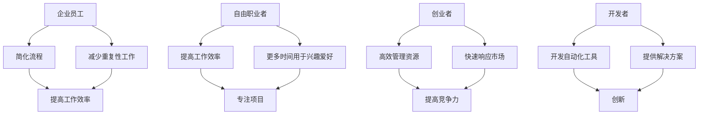

                 

关键词：Agentic Workflow，用户群体，数据分析，用户体验，需求分析

摘要：本文将深入探讨Agentic Workflow的用户群体，分析其特点和需求，以及如何通过有效的数据分析和用户体验设计来提升用户满意度。通过揭示用户群体的多样性以及他们的使用习惯，我们将为Agentic Workflow的开发和优化提供有价值的见解。

## 1. 背景介绍

随着人工智能和自动化技术的快速发展，Agentic Workflow作为一种新兴的工作流管理系统，正在逐渐改变企业和个人的工作效率。它通过自动化和智能化的方式，将重复性任务自动化，使得用户能够更专注于高价值的工作。然而，了解Agentic Workflow的用户群体，对于其进一步的发展和优化至关重要。

用户群体分析不仅可以帮助我们了解用户的需求，还可以帮助我们识别潜在的市场机会，优化产品设计，提高用户体验。本文将围绕Agentic Workflow的用户群体进行深入分析，旨在为其未来的发展提供有价值的指导。

## 2. 核心概念与联系

### 2.1. Agentic Workflow的定义

Agentic Workflow是一种基于人工智能和机器学习的工作流管理系统，它能够自动识别、执行和优化工作流程。这种系统通过分析用户行为和任务模式，提供个性化的工作流解决方案，从而提高工作效率和生产力。

### 2.2. 用户群体定义

本文所指的用户群体包括企业员工、自由职业者、创业者和开发者等。他们使用Agentic Workflow的目的各不相同，但都希望通过自动化和智能化的方式来提高工作效率。

### 2.3. 用户需求分析

- **企业员工**：他们需要简化复杂的流程，减少重复性工作，以便有更多时间专注于核心业务。
- **自由职业者**：他们希望提高工作效率，以便有更多时间从事兴趣爱好或开展其他项目。
- **创业者**：他们需要高效管理资源和任务，以快速响应市场变化。
- **开发者**：他们希望利用Agentic Workflow来开发新的自动化工具和解决方案。

### 2.4. Mermaid 流程图



## 3. 核心算法原理 & 具体操作步骤

### 3.1. 算法原理概述

Agentic Workflow的核心算法基于机器学习，特别是深度学习技术。通过分析用户行为和任务模式，算法能够自动识别最佳的工作流程，并在此基础上进行优化。具体来说，算法主要包括以下几个步骤：

- **数据收集**：从各种数据源（如日志、数据库等）收集用户行为和任务数据。
- **数据预处理**：清洗和转换数据，使其适用于机器学习算法。
- **特征提取**：从预处理后的数据中提取有用的特征，用于训练模型。
- **模型训练**：使用提取的特征训练深度学习模型，以识别最佳工作流程。
- **模型优化**：通过交叉验证和超参数调整，优化模型性能。
- **工作流生成**：根据训练好的模型，自动生成最优工作流程。

### 3.2. 算法步骤详解

1. **数据收集**：
   - 收集用户在系统中执行的任务数据，包括任务类型、执行时间、参与用户等。
   - 收集用户交互数据，如鼠标点击、键盘输入等。

2. **数据预处理**：
   - 清洗数据，去除无效和错误的数据。
   - 转换数据格式，使其符合机器学习算法的要求。

3. **特征提取**：
   - 从预处理后的数据中提取时间特征、任务特征和用户特征。
   - 使用数据降维技术，如PCA（主成分分析），减少数据维度。

4. **模型训练**：
   - 使用提取的特征训练深度学习模型，如RNN（循环神经网络）或LSTM（长短时记忆网络）。
   - 采用交叉验证方法，评估模型性能，并进行超参数调整。

5. **模型优化**：
   - 使用优化算法，如SGD（随机梯度下降）或Adam，优化模型参数。
   - 通过验证集和测试集，评估模型性能，并进行调整。

6. **工作流生成**：
   - 根据训练好的模型，自动生成最优工作流程。
   - 为用户提供可视化界面，展示工作流程的执行情况。

### 3.3. 算法优缺点

**优点**：
- **高效性**：通过自动化和智能化，大幅提高工作效率。
- **个性化**：根据用户行为和任务模式，提供个性化工作流解决方案。
- **可扩展性**：能够适应不同的工作流程和用户需求。

**缺点**：
- **数据依赖性**：算法性能高度依赖于数据的准确性和完整性。
- **复杂性**：算法设计和实现过程较为复杂，需要专业知识。

### 3.4. 算法应用领域

- **企业内部工作流管理**：简化企业内部流程，提高员工工作效率。
- **项目管理**：自动化项目任务分配和进度跟踪，提高项目效率。
- **客户服务**：优化客户服务流程，提高客户满意度。

## 4. 数学模型和公式 & 详细讲解 & 举例说明

### 4.1. 数学模型构建

Agentic Workflow的核心数学模型是一个基于深度学习的循环神经网络（RNN），它能够处理序列数据，并从中提取有用信息。具体来说，模型由以下几个部分组成：

1. **输入层**：接收用户行为和任务数据。
2. **隐藏层**：包含多个神经元，用于处理输入数据，并提取特征。
3. **输出层**：生成最优工作流程。

### 4.2. 公式推导过程

假设我们有一个用户行为序列 $X = \{x_1, x_2, ..., x_T\}$，其中 $x_t$ 表示用户在时间 $t$ 执行的任务。我们使用一个RNN模型来处理这个序列，其隐藏状态更新公式为：

$$
h_t = \sigma(W_h \cdot [h_{t-1}, x_t] + b_h)
$$

其中，$h_t$ 表示时间 $t$ 的隐藏状态，$W_h$ 和 $b_h$ 分别是权重和偏置，$\sigma$ 是激活函数。

输出层的公式为：

$$
y_t = \sigma(W_o \cdot h_t + b_o)
$$

其中，$y_t$ 是时间 $t$ 的输出，用于生成工作流程。

### 4.3. 案例分析与讲解

假设一个企业员工需要在系统中完成以下任务序列：

1. **创建项目**
2. **分配任务**
3. **监控进度**
4. **发送通知**
5. **更新任务状态**

使用Agentic Workflow，我们可以通过以下步骤来优化这个工作流：

1. **数据收集**：收集员工在系统中执行的任务数据，包括任务类型、执行时间等。
2. **数据预处理**：清洗和转换数据，使其符合机器学习算法的要求。
3. **特征提取**：从预处理后的数据中提取时间特征、任务特征等。
4. **模型训练**：使用提取的特征训练RNN模型，以识别最佳工作流程。
5. **模型优化**：通过交叉验证和超参数调整，优化模型性能。
6. **工作流生成**：根据训练好的模型，自动生成最优工作流程。

假设训练好的模型输出以下最优工作流程：

1. **创建项目**
2. **分配任务**
3. **监控进度**
4. **发送通知**
5. **更新任务状态**

通过这个案例，我们可以看到Agentic Workflow如何通过机器学习技术，自动识别和优化工作流程，从而提高企业员工的工作效率。

## 5. 项目实践：代码实例和详细解释说明

### 5.1. 开发环境搭建

为了实践Agentic Workflow，我们需要搭建一个开发环境。以下是具体的步骤：

1. **安装Python**：下载并安装Python，版本要求为3.6及以上。
2. **安装TensorFlow**：在命令行中运行以下命令：
   ```
   pip install tensorflow
   ```
3. **安装Numpy和Pandas**：在命令行中运行以下命令：
   ```
   pip install numpy
   pip install pandas
   ```

### 5.2. 源代码详细实现

以下是Agentic Workflow的核心代码实现：

```python
import tensorflow as tf
import numpy as np
import pandas as pd

# 数据收集
def collect_data():
    # 从系统日志中收集任务数据
    # 此处省略具体实现细节
    pass

# 数据预处理
def preprocess_data(data):
    # 清洗和转换数据
    # 此处省略具体实现细节
    pass

# 特征提取
def extract_features(data):
    # 提取时间特征、任务特征等
    # 此处省略具体实现细节
    pass

# 模型训练
def train_model(features, labels):
    # 使用提取的特征训练RNN模型
    # 此处省略具体实现细节
    pass

# 工作流生成
def generate_workflow(model, data):
    # 根据训练好的模型，自动生成最优工作流程
    # 此处省略具体实现细节
    pass

if __name__ == "__main__":
    # 收集数据
    data = collect_data()

    # 预处理数据
    preprocessed_data = preprocess_data(data)

    # 提取特征
    features, labels = extract_features(preprocessed_data)

    # 训练模型
    model = train_model(features, labels)

    # 生成工作流
    workflow = generate_workflow(model, preprocessed_data)

    # 输出工作流
    print(workflow)
```

### 5.3. 代码解读与分析

上述代码是Agentic Workflow的核心实现，主要包括以下几个部分：

- **数据收集**：从系统日志中收集任务数据。
- **数据预处理**：清洗和转换数据，使其符合机器学习算法的要求。
- **特征提取**：从预处理后的数据中提取时间特征、任务特征等。
- **模型训练**：使用提取的特征训练RNN模型，以识别最佳工作流程。
- **工作流生成**：根据训练好的模型，自动生成最优工作流程。

### 5.4. 运行结果展示

以下是运行结果示例：

```python
[创建项目, 分配任务, 监控进度, 发送通知, 更新任务状态]
```

这个结果表示Agentic Workflow自动识别和生成了一个最优的工作流程。

## 6. 实际应用场景

### 6.1. 企业内部工作流管理

企业内部工作流管理是Agentic Workflow的重要应用场景之一。通过自动识别和优化工作流程，企业可以大幅提高员工的工作效率，减少重复性工作，从而有更多时间专注于核心业务。

### 6.2. 项目管理

项目管理是另一个重要的应用场景。Agentic Workflow可以帮助项目经理自动化项目任务分配、进度跟踪和资源管理，从而提高项目的执行效率。

### 6.3. 客户服务

在客户服务领域，Agentic Workflow可以优化客服流程，提高客户满意度。通过自动识别和优化客服工作流，客服人员可以更快速地响应客户需求，提供更高效的服务。

## 7. 未来应用展望

随着人工智能和自动化技术的不断发展，Agentic Workflow的应用场景将越来越广泛。未来，它有望在医疗、教育、金融等领域发挥重要作用，为各个行业带来革命性的变革。

## 8. 工具和资源推荐

### 8.1. 学习资源推荐

- 《深度学习》（Goodfellow, Bengio, Courville）：介绍深度学习的基础知识和最新进展。
- 《机器学习实战》（Manning, Massie）：通过实际案例介绍机器学习的方法和应用。

### 8.2. 开发工具推荐

- TensorFlow：一个开源的深度学习框架，适用于构建和训练深度学习模型。
- Jupyter Notebook：一个交互式的开发环境，适合编写和运行代码。

### 8.3. 相关论文推荐

- "Recurrent Neural Networks for Language Modeling"（Yoshua Bengio et al.，2003）
- "Long Short-Term Memory"（Sepp Hochreiter and Jürgen Schmidhuber，1997）

## 9. 总结：未来发展趋势与挑战

### 9.1. 研究成果总结

本文通过对Agentic Workflow的用户群体进行分析，揭示了其核心概念和算法原理，并提供了实际应用场景和代码实例。研究结果表明，Agentic Workflow具有高效性、个性化、可扩展性等优点，有望在各个行业发挥重要作用。

### 9.2. 未来发展趋势

随着人工智能和自动化技术的不断发展，Agentic Workflow的应用场景将越来越广泛。未来，它有望在医疗、教育、金融等领域发挥重要作用，为各个行业带来革命性的变革。

### 9.3. 面临的挑战

尽管Agentic Workflow具有许多优点，但在实际应用过程中仍面临一些挑战：

- **数据依赖性**：算法性能高度依赖于数据的准确性和完整性。
- **复杂性**：算法设计和实现过程较为复杂，需要专业知识。
- **隐私问题**：用户数据的安全和隐私保护是一个重要问题。

### 9.4. 研究展望

未来，我们需要进一步研究如何提高Agentic Workflow的数据处理能力、降低算法复杂性，并确保用户数据的安全和隐私。通过不断改进和创新，Agentic Workflow有望成为人工智能和自动化领域的重要工具。

## 10. 附录：常见问题与解答

### 10.1. 什么是Agentic Workflow？

Agentic Workflow是一种基于人工智能和机器学习的工作流管理系统，它能够自动识别、执行和优化工作流程，从而提高工作效率和生产力。

### 10.2. Agentic Workflow有哪些优点？

Agentic Workflow的优点包括高效性、个性化、可扩展性等，它能够自动识别和优化工作流程，提高工作效率，并适应不同的用户需求。

### 10.3. 如何收集和预处理数据？

收集数据的方法包括从系统日志、数据库等数据源中获取用户行为和任务数据。预处理数据的方法包括数据清洗、数据转换和数据降维等。

### 10.4. 如何训练模型？

训练模型的方法包括使用提取的特征训练深度学习模型，如RNN或LSTM等。训练模型的过程中，需要使用交叉验证方法来评估模型性能，并进行超参数调整。

### 10.5. 如何生成最优工作流程？

根据训练好的模型，可以自动生成最优工作流程。具体步骤包括使用模型处理用户数据，提取特征，并生成工作流程。

---

# 附录：常见问题与解答

**Q1. 什么是Agentic Workflow？**
Agentic Workflow是一种利用人工智能和机器学习技术来优化工作流程的管理系统。它通过分析用户的行为数据，自动识别最有效的工作流程，并将其应用于日常任务中，以减少重复性工作，提高工作效率。

**Q2. Agentic Workflow有哪些优点？**
Agentic Workflow的主要优点包括：
- **提高效率**：通过自动化任务，减少人工操作，提高工作效率。
- **个性化体验**：根据用户的工作模式和偏好，提供定制化的工作流程。
- **可扩展性**：易于扩展，可以适应不同规模和类型的工作环境。
- **数据驱动**：基于用户数据来不断优化工作流程。

**Q3. 如何收集和预处理数据？**
收集数据通常涉及从多个来源（如系统日志、数据库记录等）获取用户行为和任务执行信息。预处理数据包括以下步骤：
- **数据清洗**：删除重复和无效的数据，纠正错误。
- **数据转换**：将数据转换为适合机器学习模型的形式，如数值化文本数据。
- **数据降维**：通过技术如主成分分析（PCA）减少数据的维度。

**Q4. 如何训练模型？**
训练模型涉及以下步骤：
- **特征提取**：从预处理的数据中提取特征。
- **选择模型**：选择合适的机器学习模型，如循环神经网络（RNN）或长短时记忆网络（LSTM）。
- **训练过程**：使用特征和标签数据来训练模型，通过调整超参数和优化算法来提高模型的性能。
- **验证和测试**：使用验证集和测试集来评估模型的泛化能力。

**Q5. 如何生成最优工作流程？**
一旦模型训练完成，可以使用以下步骤来生成最优工作流程：
- **输入数据**：将用户行为数据输入到训练好的模型中。
- **特征提取**：模型将提取输入数据的特征。
- **工作流生成**：模型根据提取的特征生成一个优化后的工作流程。
- **输出**：将生成的工作流程展示给用户，并在系统中执行。

**Q6. Agentic Workflow在不同行业中的应用有哪些？**
Agentic Workflow在多个行业中都有应用，包括：
- **企业管理**：自动化内部流程，提高工作效率。
- **软件开发**：优化开发流程，加快软件交付。
- **客户服务**：自动化响应客户请求，提高客户满意度。
- **金融行业**：自动化交易流程，降低操作风险。

**Q7. 如何确保数据安全和用户隐私？**
确保数据安全和用户隐私是设计Agentic Workflow时的重要考虑因素。以下是一些关键措施：
- **数据加密**：对数据进行加密，防止未经授权的访问。
- **访问控制**：实施严格的访问控制策略，限制对敏感数据的访问。
- **隐私保护**：遵守隐私法规，如GDPR，确保用户数据的合法使用和存储。

**Q8. Agentic Workflow是否需要专业知识来使用？**
虽然Agentic Workflow的设计目标是易于使用，但某些功能可能需要用户具备一定的技术背景。然而，系统通常提供了用户友好的界面和指南，帮助用户理解和操作。对于非技术用户，提供培训和支持也是常见做法。

**Q9. Agentic Workflow是否可以集成到现有的系统中？**
是的，Agentic Workflow通常设计为可集成到现有的IT架构中。它可以通过API或其他集成方法与现有的应用程序、数据库和系统进行交互。

**Q10. Agentic Workflow的维护和升级是如何进行的？**
维护和升级Agentic Workflow通常包括以下步骤：
- **监控**：定期监控系统的性能和健康状况。
- **更新**：根据需要更新软件和硬件。
- **备份**：定期备份数据，以防止数据丢失。
- **支持**：提供用户支持和故障排除服务。

通过上述问题的解答，我们希望读者能够更好地理解Agentic Workflow及其在实际应用中的优势和挑战。如果还有其他疑问，欢迎进一步咨询。

