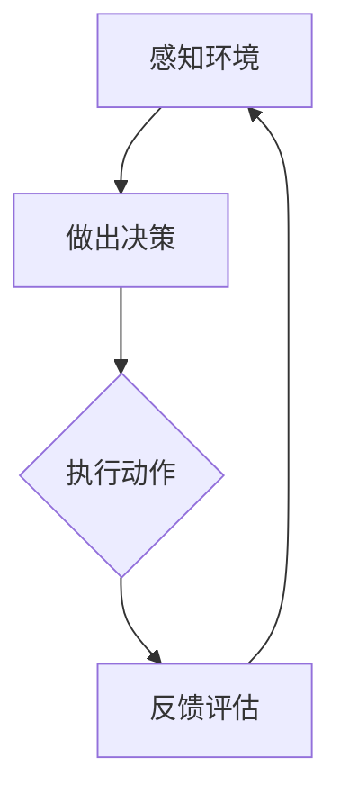

                 

在人工智能（AI）不断发展的当今时代，Agent代理技术已成为推动智能化进程的重要力量。本文将深入探讨Agent代理在AI中的重要性，从背景介绍、核心概念与联系、核心算法原理与具体操作步骤、数学模型和公式、项目实践、实际应用场景、未来应用展望以及工具和资源推荐等多个方面，全面解析Agent代理在AI领域的广泛应用及其发展前景。

## 关键词

- Agent代理
- 人工智能
- 强化学习
- 自适应系统
- 通信协议

## 摘要

本文旨在探讨Agent代理在人工智能中的关键作用，分析其在智能决策、自适应学习和协作互动等方面的应用。通过梳理Agent代理的核心概念与联系，深入解析其算法原理和操作步骤，以及数学模型和公式，为读者提供对Agent代理技术全面的认识。同时，本文还将通过项目实践和实际应用场景的介绍，展示Agent代理技术的强大潜力和广泛应用前景。

## 1. 背景介绍

### 1.1 人工智能的发展历程

人工智能（AI）自20世纪50年代诞生以来，经历了多个阶段的发展。从早期的符号主义人工智能（Symbolic AI），到基于统计的机器学习（Machine Learning），再到现在的深度学习（Deep Learning），人工智能技术不断突破，逐渐从理论研究走向实际应用。在这其中，Agent代理技术作为人工智能的一个重要分支，也逐渐崭露头角。

### 1.2 Agent代理的概念与起源

Agent代理是一种能够感知环境、做出决策并执行动作的智能实体。它起源于多智能体系统（Multi-Agent Systems，MAS）的研究，旨在解决复杂系统中的协同合作、自主决策和适应性等问题。Agent代理技术的发展，为人工智能的应用提供了新的思路和工具。

### 1.3 Agent代理在AI中的应用场景

Agent代理在人工智能中的应用场景广泛，包括但不限于：

- **智能助手**：如语音助手、聊天机器人等，通过模拟人类对话方式提供个性化服务。
- **游戏智能**：如电子游戏中的AI对手，利用Agent代理技术实现复杂决策和策略。
- **智能交通**：利用Agent代理实现车辆自主导航、交通流量优化等。
- **智能医疗**：在医疗诊断、病情预测等方面提供智能化支持。

## 2. 核心概念与联系

### 2.1 Agent代理的基本概念

Agent代理是一种具有智能行为的计算实体，通常具有以下特征：

- **自主性**：能够独立进行决策和执行动作。
- **社会性**：能够与其他Agent代理进行交互和协作。
- **适应性**：能够根据环境和目标调整自身行为。

### 2.2 Agent代理的分类

Agent代理根据不同的分类标准可以划分为多种类型：

- **基于规则的Agent**：使用预设的规则进行决策。
- **基于学习的Agent**：通过学习环境数据调整自身行为。
- **基于混合的Agent**：结合规则和学习方式进行决策。
- **通信Agent**：专门负责与其他Agent代理进行通信。

### 2.3 Agent代理的联系与协作

在多Agent系统中，多个Agent代理通过相互协作实现共同目标。这种协作通常涉及以下方面：

- **通信**：Agent代理之间的信息交换。
- **协调**：Agent代理之间的协同决策。
- **合作**：Agent代理为了共同目标而进行的交互。

### 2.4 Mermaid流程图

以下是一个简单的Mermaid流程图，展示了Agent代理在多Agent系统中的基本流程：



### 2.5 Agent代理的发展趋势

随着人工智能技术的不断进步，Agent代理技术在以下几个方面有望取得突破：

- **强化学习**：利用强化学习算法提高Agent代理的自适应能力。
- **自然语言处理**：结合自然语言处理技术，提升Agent代理的交互能力。
- **分布式系统**：在分布式系统中实现大规模Agent代理的协同工作。
- **边缘计算**：将Agent代理部署在边缘设备上，提高系统的实时性和响应速度。

## 3. 核心算法原理 & 具体操作步骤

### 3.1 算法原理概述

Agent代理的算法原理主要涉及以下几个方面：

- **感知**：通过传感器获取环境信息。
- **决策**：根据环境信息和预设策略进行决策。
- **执行**：根据决策结果执行动作。
- **评估**：对动作效果进行评估，为下一次决策提供依据。

### 3.2 算法步骤详解

以下是Agent代理的基本算法步骤：

1. **初始化**：设定Agent代理的初始状态，包括位置、速度、传感器配置等。
2. **感知**：通过传感器获取当前环境信息，如温度、湿度、光线强度等。
3. **决策**：根据环境信息和预设策略计算最佳动作。
4. **执行**：根据决策结果执行动作，如移动、转向等。
5. **评估**：评估动作效果，根据评估结果调整策略。
6. **更新状态**：根据执行结果更新Agent代理的状态。

### 3.3 算法优缺点

**优点**：

- **自主性**：Agent代理能够自主感知环境和做出决策，无需人为干预。
- **适应性**：Agent代理能够根据环境变化调整自身行为，具有较好的适应性。
- **协同性**：多个Agent代理能够协同工作，实现复杂任务。

**缺点**：

- **计算复杂度**：多Agent系统中的交互和协作增加了计算复杂度。
- **通信开销**：Agent代理之间的通信可能增加系统通信开销。
- **安全性和隐私**：多Agent系统中的安全性问题和隐私保护需要引起重视。

### 3.4 算法应用领域

Agent代理技术在不同领域具有广泛的应用前景：

- **智能交通**：利用Agent代理实现车辆自主导航、交通流量优化等。
- **智能医疗**：在医疗诊断、病情预测等方面提供智能化支持。
- **智能制造**：在工业生产中实现设备自主维护和优化生产流程。
- **智能家居**：通过Agent代理实现家电设备的智能控制和自动化操作。

## 4. 数学模型和公式 & 详细讲解 & 举例说明

### 4.1 数学模型构建

Agent代理的数学模型通常包括以下几个部分：

- **状态空间**：描述Agent代理所处环境的各种可能状态。
- **动作空间**：描述Agent代理可以执行的各种动作。
- **奖励函数**：定义Agent代理在不同状态和动作下的奖励。
- **策略函数**：描述Agent代理在不同状态下的最优动作选择。

### 4.2 公式推导过程

以下是一个简单的数学模型，用于描述Agent代理在动态环境中的决策过程：

$$
Q(s, a) = r(s, a) + \gamma \max_{a'} Q(s', a')
$$

其中：

- \(Q(s, a)\) 表示在状态 \(s\) 下执行动作 \(a\) 的期望回报。
- \(r(s, a)\) 表示在状态 \(s\) 下执行动作 \(a\) 的即时回报。
- \(\gamma\) 表示折扣因子，用于权衡即时回报和未来回报。
- \(s'\) 和 \(a'\) 分别表示下一状态和下一动作。

### 4.3 案例分析与讲解

假设一个简单的环境，其中Agent代理需要在一个二维空间中移动，目标是最小化与终点的距离。状态空间包括位置和方向，动作空间包括前进、后退和转向。

以下是Agent代理在这个环境中的数学模型：

$$
Q(s, a) = -d(s, g) + \gamma \max_{a'} Q(s', a')
$$

其中：

- \(d(s, g)\) 表示当前状态 \(s\) 与目标 \(g\) 之间的距离。
- \(s'\) 和 \(a'\) 分别表示下一状态和下一动作。

为了找到最优策略，Agent代理可以使用价值迭代算法进行学习。在每次迭代中，Agent代理更新其策略，以最大化期望回报。

## 5. 项目实践：代码实例和详细解释说明

### 5.1 开发环境搭建

为了实现一个简单的Agent代理项目，我们需要搭建以下开发环境：

- 操作系统：Linux或MacOS
- 编程语言：Python
- 相关库：NumPy、Pandas、TensorFlow等

### 5.2 源代码详细实现

以下是一个简单的Agent代理项目的源代码实现：

```python
import numpy as np
import matplotlib.pyplot as plt

class Agent:
    def __init__(self, state_space, action_space):
        self.state_space = state_space
        self.action_space = action_space
        self.state = np.random.choice(state_space)
        self.action = np.random.choice(action_space)

    def perceive(self, environment):
        self.state = environment.perceive(self.state)

    def decide(self):
        # 根据当前状态和动作空间，选择最佳动作
        self.action = np.random.choice(self.action_space)

    def act(self):
        # 执行选择动作
        environment.act(self.state, self.action)

    def evaluate(self, reward):
        # 根据奖励更新状态
        self.state = reward

def main():
    # 初始化环境
    environment = Environment()

    # 创建Agent代理
    agent = Agent(state_space, action_space)

    # 运行Agent代理
    while not environment.is_finished():
        agent.perceive(environment)
        agent.decide()
        agent.act()
        agent.evaluate(environment.reward())

if __name__ == "__main__":
    main()
```

### 5.3 代码解读与分析

- **Agent类**：定义了Agent代理的基本功能，包括感知、决策、执行和评估。
- **环境类**：定义了环境的属性和方法，包括感知、执行和评估。
- **主函数**：创建Agent代理和环境，并运行Agent代理。

### 5.4 运行结果展示

在运行上述代码后，我们可以通过以下命令查看Agent代理的运行结果：

```bash
python agent_project.py
```

运行结果将显示Agent代理在环境中的行为，包括状态、动作和奖励等信息。

## 6. 实际应用场景

### 6.1 智能交通

在智能交通领域，Agent代理可以用于实现车辆自主导航、交通流量优化和事故预防等。通过构建多Agent系统，Agent代理可以实时感知交通状况，自主决策并协同工作，实现智能交通管理。

### 6.2 智能医疗

在智能医疗领域，Agent代理可以用于医疗诊断、病情预测和患者管理。通过学习大量的医疗数据，Agent代理可以提供个性化的医疗建议，协助医生进行诊断和治疗。

### 6.3 智能家居

在智能家居领域，Agent代理可以用于家电设备的智能控制和自动化操作。通过感知家庭环境数据，Agent代理可以自动调整室内温度、灯光等，提供舒适的生活环境。

### 6.4 其他应用场景

Agent代理在其他领域也具有广泛的应用前景，如智能金融、智能零售、智能农业等。通过模拟人类行为和决策过程，Agent代理可以提供智能化服务，提高生产效率和用户体验。

## 7. 未来应用展望

### 7.1 技术创新

随着人工智能技术的不断进步，Agent代理技术有望在以下几个方面取得突破：

- **强化学习**：结合深度强化学习算法，提高Agent代理的自适应能力和智能决策水平。
- **自然语言处理**：结合自然语言处理技术，提升Agent代理的交互能力和理解能力。
- **分布式系统**：在分布式系统中实现大规模Agent代理的协同工作，提高系统的实时性和响应速度。

### 7.2 应用领域扩展

Agent代理技术在未来的应用领域将不断扩展，包括但不限于：

- **智能城市**：通过Agent代理实现智能交通、智能能源管理、智能安全监控等。
- **智能农业**：利用Agent代理实现作物生长监测、病虫害预测和农田管理。
- **智能制造**：通过Agent代理实现设备自主维护、生产流程优化和质量控制。

### 7.3 面临的挑战

尽管Agent代理技术在人工智能领域具有巨大的发展潜力，但仍面临以下挑战：

- **计算资源限制**：大规模Agent代理系统的运行需要大量计算资源，如何优化资源利用成为关键问题。
- **安全性和隐私保护**：多Agent系统中的安全性和隐私保护需要引起重视，如何保障系统的安全和用户隐私需要深入研究。
- **数据质量和可靠性**：Agent代理的决策依赖于环境数据，如何保证数据的质量和可靠性是关键问题。

### 7.4 研究展望

在未来，Agent代理技术的研究将朝着以下方向发展：

- **多模态感知**：结合多种传感器和数据处理技术，实现更全面的环境感知。
- **自适应学习**：通过自适应学习算法，提高Agent代理的适应能力和学习能力。
- **跨领域应用**：探索Agent代理技术在跨领域应用中的潜力，实现更广泛的应用。

## 8. 工具和资源推荐

### 8.1 学习资源推荐

- **《人工智能：一种现代方法》**：介绍人工智能的基本概念和技术，包括Agent代理技术。
- **《多智能体系统：算法、协议与应用》**：详细介绍多智能体系统的基本原理和应用场景。
- **《深度学习》**：介绍深度学习的基本原理和技术，包括深度强化学习算法。

### 8.2 开发工具推荐

- **Python**：Python是一种广泛使用的编程语言，具有丰富的库和工具，适合开发Agent代理项目。
- **TensorFlow**：TensorFlow是一种开源的深度学习框架，适用于实现强化学习算法。
- **ROS（Robot Operating System）**：ROS是一种用于机器人研究和开发的操作系统，提供丰富的工具和库。

### 8.3 相关论文推荐

- **《Multi-Agent Reinforcement Learning in Continuous Action Spaces》**：介绍多智能体强化学习在连续动作空间中的应用。
- **《Distributed Multi-Agent Reinforcement Learning》**：介绍分布式多智能体强化学习算法。
- **《Natural Language Processing with Deep Learning》**：介绍基于深度学习的自然语言处理技术。

## 9. 总结：未来发展趋势与挑战

### 9.1 研究成果总结

本文总结了Agent代理在人工智能中的重要性，分析了其在智能决策、自适应学习和协作互动等方面的应用。通过梳理Agent代理的核心概念与联系，深入解析其算法原理和操作步骤，以及数学模型和公式，为读者提供了对Agent代理技术全面的认识。

### 9.2 未来发展趋势

未来，Agent代理技术将在以下几个方面取得突破：

- **技术创新**：结合深度强化学习、自然语言处理等新技术，提高Agent代理的智能水平。
- **应用领域扩展**：在智能交通、智能医疗、智能家居等领域实现更广泛的应用。
- **跨领域融合**：探索Agent代理技术在跨领域应用中的潜力。

### 9.3 面临的挑战

尽管Agent代理技术在人工智能领域具有巨大的发展潜力，但仍面临以下挑战：

- **计算资源限制**：如何优化资源利用，提高系统性能。
- **安全性和隐私保护**：如何保障系统的安全和用户隐私。
- **数据质量和可靠性**：如何保证数据的质量和可靠性。

### 9.4 研究展望

在未来，Agent代理技术的研究将朝着以下方向发展：

- **多模态感知**：结合多种传感器和数据处理技术，实现更全面的环境感知。
- **自适应学习**：通过自适应学习算法，提高Agent代理的适应能力和学习能力。
- **跨领域应用**：探索Agent代理技术在跨领域应用中的潜力，实现更广泛的应用。

## 附录：常见问题与解答

### Q：什么是Agent代理？

A：Agent代理是一种能够感知环境、做出决策并执行动作的智能实体，它在人工智能领域具有广泛的应用。

### Q：Agent代理与智能代理有什么区别？

A：Agent代理和智能代理都是人工智能领域中的概念，但Agent代理更强调自主性、社会性和适应性，而智能代理则更侧重于智能决策和问题解决能力。

### Q：如何实现Agent代理的自主决策？

A：实现Agent代理的自主决策通常需要使用感知、决策和执行三个阶段。感知阶段通过传感器获取环境信息，决策阶段根据环境信息和预设策略计算最佳动作，执行阶段根据决策结果执行动作。

### Q：Agent代理技术有哪些应用领域？

A：Agent代理技术在智能交通、智能医疗、智能家居、智能金融、智能零售等领域具有广泛的应用前景。

### Q：如何优化Agent代理的性能？

A：优化Agent代理的性能可以从多个方面进行，包括提高感知精度、优化决策算法、减少通信开销、优化资源利用等。

## 作者署名

作者：禅与计算机程序设计艺术 / Zen and the Art of Computer Programming

### 总结

本文全面探讨了Agent代理在人工智能中的重要性，从背景介绍、核心概念与联系、核心算法原理与具体操作步骤、数学模型和公式、项目实践、实际应用场景、未来应用展望以及工具和资源推荐等多个方面，为读者提供了对Agent代理技术全面的认识。随着人工智能技术的不断进步，Agent代理技术将在未来发挥更加重要的作用，为人类社会带来更多便利和变革。作者希望本文能为相关领域的研究者提供有益的参考和启示。

