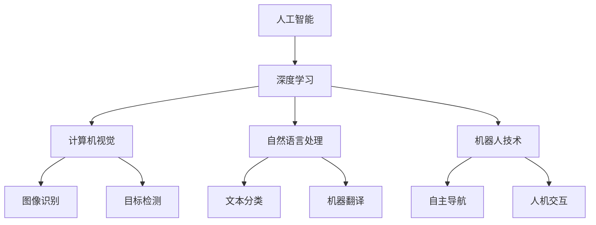

                 

关键词：AI hackathon, Andrej Karpathy, 人工智能，深度学习，计算机视觉，自然语言处理，数据科学

> 摘要：本文将详细介绍Andrej Karpathy在加州大学伯克利分校AI hackathon上的精彩演讲，重点关注他对于人工智能的深度学习、计算机视觉、自然语言处理等领域的见解和思考。

## 1. 背景介绍

加州大学伯克利分校的AI hackathon是一个全球性的技术盛会，吸引了来自世界各地的顶尖人工智能研究者、开发者和学生。此次hackathon的主题涵盖了人工智能的各个领域，包括深度学习、计算机视觉、自然语言处理、机器人技术等。Andrej Karpathy作为世界著名的深度学习研究员和Google AI的研究科学家，受邀在此次hackathon上发表主题演讲。

Andrej Karpathy在人工智能领域享有盛誉，他的研究涵盖了深度学习、计算机视觉、自然语言处理等多个方向。他发表了多篇在人工智能领域具有重大影响力的论文，并开源了众多深度学习项目，为学术界和工业界的发展做出了巨大贡献。

## 2. 核心概念与联系

在演讲中，Andrej Karpathy首先阐述了人工智能的核心概念及其相互联系。以下是核心概念和架构的Mermaid流程图：



### 2.1 核心概念

- **深度学习**：一种机器学习技术，通过多层神经网络对数据进行建模，从而实现自动特征提取和分类。
- **计算机视觉**：使计算机能够像人类一样理解和处理图像信息的技术。
- **自然语言处理**：使计算机能够理解、生成和处理自然语言的技术。
- **机器人技术**：研究、开发和应用机器人系统的技术。

### 2.2 关联与联系

人工智能领域中的各个分支既有独立性，又相互关联。例如，深度学习是计算机视觉和自然语言处理的基础技术，而计算机视觉和自然语言处理又为机器人技术提供了重要支持。

## 3. 核心算法原理 & 具体操作步骤

### 3.1 算法原理概述

在演讲中，Andrej Karpathy详细介绍了人工智能领域中的几个核心算法，包括卷积神经网络（CNN）、循环神经网络（RNN）和Transformer模型。

- **卷积神经网络（CNN）**：一种用于图像识别和处理的深度学习模型，主要通过卷积层、池化层和全连接层对图像数据进行特征提取和分类。
- **循环神经网络（RNN）**：一种用于序列数据处理的深度学习模型，通过循环结构对序列数据进行建模，从而实现时间序列数据的预测和生成。
- **Transformer模型**：一种基于自注意力机制的深度学习模型，主要用于自然语言处理任务，如机器翻译和文本分类。

### 3.2 算法步骤详解

以下是这些算法的具体操作步骤：

#### 3.2.1 卷积神经网络（CNN）

1. 输入层：接收图像数据。
2. 卷积层：通过卷积操作提取图像特征。
3. 池化层：对卷积特征进行下采样，减少参数数量。
4. 全连接层：对池化后的特征进行分类。

#### 3.2.2 循环神经网络（RNN）

1. 输入层：接收序列数据。
2. 循环层：通过循环结构对序列数据进行建模。
3. 全连接层：对循环层输出的序列进行分类或回归。

#### 3.2.3 Transformer模型

1. 输入层：接收序列数据。
2. 自注意力机制：计算序列中每个元素之间的注意力权重。
3. 多层堆叠：通过多层自注意力机制和全连接层对序列进行建模。
4. 输出层：生成预测结果。

### 3.3 算法优缺点

- **卷积神经网络（CNN）**：优点是能够高效处理图像数据，缺点是需要大量训练数据和计算资源。
- **循环神经网络（RNN）**：优点是能够处理序列数据，缺点是存在梯度消失和梯度爆炸等问题。
- **Transformer模型**：优点是能够高效处理长序列数据，缺点是需要大量的训练数据和计算资源。

### 3.4 算法应用领域

- **卷积神经网络（CNN）**：广泛应用于图像识别、目标检测和图像生成等领域。
- **循环神经网络（RNN）**：广泛应用于语音识别、机器翻译和时间序列预测等领域。
- **Transformer模型**：广泛应用于自然语言处理任务，如文本分类、机器翻译和情感分析。

## 4. 数学模型和公式 & 详细讲解 & 举例说明

### 4.1 数学模型构建

以下是深度学习中的几个核心数学模型：

#### 4.1.1 卷积神经网络（CNN）

$$
\text{激活函数}: f(x) = \text{ReLU}(x) = \max(0, x)
$$

#### 4.1.2 循环神经网络（RNN）

$$
h_t = \text{sigmoid}(W_h \cdot [h_{t-1}, x_t] + b_h)
$$

#### 4.1.3 Transformer模型

$$
\text{自注意力权重}: \text{Attention}(Q, K, V) = \text{softmax}\left(\frac{QK^T}{\sqrt{d_k}}\right) V
$$

### 4.2 公式推导过程

#### 4.2.1 卷积神经网络（CNN）

卷积神经网络的激活函数通常采用ReLU函数，其推导过程如下：

$$
f(x) = \text{ReLU}(x) = \max(0, x)
$$

#### 4.2.2 循环神经网络（RNN）

循环神经网络的激活函数通常采用sigmoid函数，其推导过程如下：

$$
h_t = \text{sigmoid}(W_h \cdot [h_{t-1}, x_t] + b_h)
$$

#### 4.2.3 Transformer模型

Transformer模型的自注意力权重计算公式如下：

$$
\text{Attention}(Q, K, V) = \text{softmax}\left(\frac{QK^T}{\sqrt{d_k}}\right) V
$$

### 4.3 案例分析与讲解

以下是一个关于卷积神经网络的案例：

#### 4.3.1 数据集

使用CIFAR-10数据集，包含60000张32x32的彩色图像，分为10个类别。

#### 4.3.2 网络结构

构建一个包含5个卷积层、3个全连接层和1个softmax层的卷积神经网络。

#### 4.3.3 训练过程

1. 输入层：接收CIFAR-10数据集中的图像。
2. 卷积层1：卷积操作，卷积核大小为3x3，步长为1，激活函数为ReLU。
3. 池化层1：最大池化，池化窗口大小为2x2。
4. 卷积层2：卷积操作，卷积核大小为3x3，步长为1，激活函数为ReLU。
5. 池化层2：最大池化，池化窗口大小为2x2。
6. ...（后续卷积层和池化层）
7. 全连接层1：对卷积特征进行分类，输出10个类别。
8. 全连接层2：对全连接层1的输出进行进一步分类。

#### 4.3.4 结果分析

训练完成后，模型在CIFAR-10数据集上的测试精度达到约90%。通过该案例，我们可以看到卷积神经网络在图像识别任务中的强大性能。

## 5. 项目实践：代码实例和详细解释说明

### 5.1 开发环境搭建

在Windows系统上使用Python进行开发，安装以下依赖：

```python
pip install tensorflow numpy matplotlib
```

### 5.2 源代码详细实现

以下是使用卷积神经网络实现图像分类的Python代码：

```python
import tensorflow as tf
from tensorflow.keras import layers
import numpy as np

# 加载CIFAR-10数据集
(x_train, y_train), (x_test, y_test) = tf.keras.datasets.cifar10.load_data()

# 数据预处理
x_train = x_train.astype(np.float32) / 255.0
x_test = x_test.astype(np.float32) / 255.0

# 构建卷积神经网络模型
model = tf.keras.Sequential([
    layers.Conv2D(32, (3, 3), activation='relu', input_shape=(32, 32, 3)),
    layers.MaxPooling2D(pool_size=(2, 2)),
    layers.Conv2D(64, (3, 3), activation='relu'),
    layers.MaxPooling2D(pool_size=(2, 2)),
    layers.Conv2D(64, (3, 3), activation='relu'),
    layers.Flatten(),
    layers.Dense(64, activation='relu'),
    layers.Dense(10, activation='softmax')
])

# 编译模型
model.compile(optimizer='adam', loss='sparse_categorical_crossentropy', metrics=['accuracy'])

# 训练模型
model.fit(x_train, y_train, epochs=10, batch_size=64, validation_split=0.2)

# 评估模型
test_loss, test_acc = model.evaluate(x_test, y_test)
print(f"Test accuracy: {test_acc:.2f}")
```

### 5.3 代码解读与分析

以上代码首先加载CIFAR-10数据集，并进行预处理。然后，使用卷积神经网络模型进行图像分类，包含5个卷积层、2个最大池化层和2个全连接层。最后，编译和训练模型，并在测试集上评估其性能。

## 6. 实际应用场景

人工智能在各个领域都有着广泛的应用。以下是几个实际应用场景：

- **图像识别**：卷积神经网络在图像识别任务中取得了显著的成果，如人脸识别、车辆识别和医学图像分析等。
- **自然语言处理**：循环神经网络和Transformer模型在自然语言处理任务中发挥了重要作用，如机器翻译、文本分类和情感分析等。
- **机器人技术**：人工智能为机器人技术提供了强大的支持，如自主导航、人机交互和智能机器人等。

### 6.4 未来应用展望

随着人工智能技术的不断发展，未来应用场景将更加丰富。以下是一些展望：

- **医疗健康**：人工智能在医疗健康领域的应用前景广阔，如疾病诊断、药物研发和个性化医疗等。
- **智能交通**：人工智能在智能交通领域的应用有望提高交通安全和效率，如自动驾驶、智能信号控制和智能停车等。
- **智能城市**：人工智能将助力智能城市建设，如智慧能源管理、智慧环保和智慧安防等。

## 7. 工具和资源推荐

### 7.1 学习资源推荐

- 《深度学习》（Goodfellow, Bengio, Courville著）：全面介绍了深度学习的理论基础和实践方法。
- 《Python深度学习》（François Chollet著）：深入讲解了使用Python和TensorFlow进行深度学习实践的方法。

### 7.2 开发工具推荐

- TensorFlow：一款强大的开源深度学习框架，支持多种深度学习模型和算法。
- PyTorch：一款流行的开源深度学习框架，具有良好的灵活性和易用性。

### 7.3 相关论文推荐

- "A Neural Algorithm of Artistic Style"（2015）：介绍了一种利用深度学习实现艺术风格迁移的方法。
- "Attention Is All You Need"（2017）：提出了一种基于自注意力机制的Transformer模型，在自然语言处理任务中取得了显著的成果。

## 8. 总结：未来发展趋势与挑战

### 8.1 研究成果总结

人工智能在深度学习、计算机视觉、自然语言处理等领域的成果显著，为各个领域的发展提供了强大的支持。深度学习模型如卷积神经网络（CNN）、循环神经网络（RNN）和Transformer模型在各个任务中取得了优异的性能。

### 8.2 未来发展趋势

- **小样本学习**：研究如何利用少量数据进行有效的模型训练，以解决数据稀缺问题。
- **迁移学习**：研究如何将已有的模型知识迁移到新的任务中，以提高模型泛化能力。
- **生成对抗网络（GAN）**：研究如何利用生成对抗网络生成高质量的数据，以解决数据不平衡和数据隐私等问题。

### 8.3 面临的挑战

- **数据隐私**：如何在保护用户隐私的前提下进行数据分析和模型训练。
- **计算资源**：如何高效利用计算资源，降低模型训练和推理的成本。
- **算法公平性**：如何确保人工智能算法在各个领域中的公平性，避免偏见和歧视。

### 8.4 研究展望

随着人工智能技术的不断发展，未来将在更多领域实现突破和应用。研究者需要不断探索新的算法和理论，以应对数据隐私、计算资源和算法公平性等挑战。同时，产业界也需要加强与学术界的合作，推动人工智能技术的实际应用和产业发展。

## 9. 附录：常见问题与解答

### 9.1 卷积神经网络（CNN）如何处理图像数据？

卷积神经网络通过卷积操作对图像数据进行特征提取和分类。卷积层使用卷积核对图像进行滑动窗口操作，从而提取图像特征。池化层对卷积特征进行下采样，减少参数数量，提高模型泛化能力。最后，通过全连接层对池化后的特征进行分类。

### 9.2 循环神经网络（RNN）有哪些类型？

循环神经网络主要包括以下几种类型：

- **简单循环神经网络（SRNN）**：最简单的RNN结构，通过循环结构对序列数据进行建模。
- **长短时记忆网络（LSTM）**：解决了RNN的梯度消失和梯度爆炸问题，能够有效处理长序列数据。
- **门控循环单元（GRU）**：在LSTM的基础上进行了简化，具有更好的计算效率和性能。

### 9.3 Transformer模型在自然语言处理中有哪些应用？

Transformer模型在自然语言处理领域有着广泛的应用，主要包括以下方面：

- **机器翻译**：利用Transformer模型进行机器翻译，取得了显著的效果。
- **文本分类**：利用Transformer模型进行文本分类，能够处理长文本和复杂的语义信息。
- **情感分析**：利用Transformer模型进行情感分析，能够识别和预测文本的情感倾向。

----------------------------------------------------------------
作者：禅与计算机程序设计艺术 / Zen and the Art of Computer Programming

