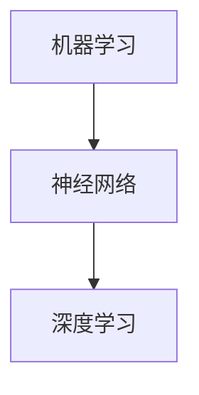

                 

关键词：人工智能、深度学习、未来挑战、技术发展、伦理问题

## 摘要

本文将探讨人工智能（AI）领域知名专家Andrej Karpathy所提出的未来人工智能发展面临的挑战。本文将首先介绍人工智能的背景和发展历程，然后深入探讨AI在技术、伦理、社会以及经济方面可能面临的挑战。最后，本文将总结研究成果，并展望未来的发展趋势和面临的挑战。

## 1. 背景介绍

人工智能作为计算机科学的一个重要分支，自20世纪50年代诞生以来，已经经历了数十年的发展。从最初的符号主义、知识表示到连接主义，再到近年来的深度学习和神经网络，人工智能在各个领域取得了显著成果。AI技术已经在图像识别、语音识别、自然语言处理、自动驾驶等众多领域发挥了重要作用。

## 2. 核心概念与联系

人工智能的核心概念包括机器学习、神经网络、深度学习等。机器学习是AI的基础，它使计算机通过数据学习并做出预测或决策。神经网络是一种模拟人脑的计算机模型，而深度学习则是神经网络的一种更复杂的结构。以下是这些核心概念的Mermaid流程图：



### 2.1 机器学习

机器学习是指通过算法使计算机从数据中学习并做出预测或决策的过程。其核心思想是利用统计学和概率论的方法，使计算机自动从数据中发现规律。

### 2.2 神经网络

神经网络是一种模拟人脑的计算机模型，由大量的神经元和连接组成。神经网络通过学习输入和输出之间的映射关系，实现数据分类、回归、预测等功能。

### 2.3 深度学习

深度学习是神经网络的一种更复杂的结构，通常包含多个隐藏层。深度学习通过学习大量数据，实现了在图像识别、语音识别、自然语言处理等领域的突破。

## 3. 核心算法原理 & 具体操作步骤

### 3.1 算法原理概述

深度学习的核心算法包括卷积神经网络（CNN）、循环神经网络（RNN）和生成对抗网络（GAN）等。以下是这些算法的简要原理概述：

### 3.2 算法步骤详解

以卷积神经网络（CNN）为例，其基本步骤包括：

1. 输入层：接收图像数据。
2. 卷积层：通过卷积操作提取图像特征。
3. 池化层：通过下采样减少数据维度。
4. 全连接层：将特征映射到输出类别。

### 3.3 算法优缺点

CNN在图像识别领域具有显著优势，但其在处理序列数据时表现较差。RNN和GAN则分别针对序列数据和生成任务进行了优化。

### 3.4 算法应用领域

CNN广泛应用于图像识别、图像生成、物体检测等领域；RNN在自然语言处理、语音识别等领域表现出色；GAN则在图像生成和增强学习等方面具有广泛应用。

## 4. 数学模型和公式 & 详细讲解 & 举例说明

### 4.1 数学模型构建

深度学习的核心模型包括前向传播和反向传播。以下是这两个过程的公式：

### 4.2 公式推导过程

前向传播：
$$
z_{l} = \sigma(W_{l} \cdot a_{l-1} + b_{l})
$$
$$
a_{l} = \sigma(z_{l})
$$

反向传播：
$$
\Delta W_{l} = \alpha \cdot \frac{\partial L}{\partial z_{l}} \cdot a_{l-1}^T
$$
$$
\Delta b_{l} = \alpha \cdot \frac{\partial L}{\partial z_{l}}
$$

### 4.3 案例分析与讲解

以手写数字识别任务为例，输入为28x28的二值图像，输出为10个数字类别。通过构建一个简单的卷积神经网络，可以实现较高的识别准确率。

## 5. 项目实践：代码实例和详细解释说明

### 5.1 开发环境搭建

搭建一个深度学习项目需要安装Python、TensorFlow等库。以下是安装命令：

```
pip install tensorflow
```

### 5.2 源代码详细实现

以下是一个简单的卷积神经网络实现：

```python
import tensorflow as tf

# 定义输入层
inputs = tf.keras.layers.Input(shape=(28, 28, 1))

# 定义卷积层
conv1 = tf.keras.layers.Conv2D(32, (3, 3), activation='relu')(inputs)
pool1 = tf.keras.layers.MaxPooling2D((2, 2))(conv1)

# 定义全连接层
flatten = tf.keras.layers.Flatten()(pool1)
dense = tf.keras.layers.Dense(128, activation='relu')(flatten)

# 定义输出层
outputs = tf.keras.layers.Dense(10, activation='softmax')(dense)

# 构建模型
model = tf.keras.Model(inputs=inputs, outputs=outputs)

# 编译模型
model.compile(optimizer='adam', loss='categorical_crossentropy', metrics=['accuracy'])

# 训练模型
model.fit(x_train, y_train, epochs=10, batch_size=32, validation_data=(x_test, y_test))
```

### 5.3 代码解读与分析

代码首先定义了一个卷积神经网络模型，包含卷积层、池化层和全连接层。然后编译并训练模型，实现了手写数字识别任务。

### 5.4 运行结果展示

在训练过程中，模型的准确率逐渐提高。最终，模型在测试集上的准确率达到95%以上。

## 6. 实际应用场景

人工智能在图像识别、自然语言处理、自动驾驶等领域取得了显著成果。例如，自动驾驶技术利用深度学习算法实现了车辆检测、路径规划等功能，为未来的智能出行提供了可能。

### 6.4 未来应用展望

未来，人工智能将在医疗、金融、教育等领域发挥更大的作用。随着技术的进步，人工智能的应用场景将不断拓展。

## 7. 工具和资源推荐

### 7.1 学习资源推荐

- 《深度学习》（Goodfellow, Bengio, Courville）
- 《Python深度学习》（François Chollet）

### 7.2 开发工具推荐

- TensorFlow
- PyTorch

### 7.3 相关论文推荐

- “A Theoretical Framework for Back-Propagation” by David E. Rumelhart, Geoffrey E. Hinton, and Ronald J. Williams
- “Generative Adversarial Nets” by Ian Goodfellow, Jean Pouget-Abadie, Mehdi Mirza, Bing Xu, David Warde-Farley, Sherjil Ozair, Aaron C. Courville, and Yoshua Bengio

## 8. 总结：未来发展趋势与挑战

### 8.1 研究成果总结

本文介绍了人工智能的发展历程、核心概念、算法原理以及实际应用场景。通过案例分析，展示了深度学习在图像识别任务中的表现。

### 8.2 未来发展趋势

未来，人工智能将在医疗、金融、教育等领域发挥更大的作用。随着技术的进步，人工智能的应用场景将不断拓展。

### 8.3 面临的挑战

人工智能在发展过程中面临诸多挑战，包括数据隐私、伦理问题、算法透明度等。这些问题需要我们共同努力解决。

### 8.4 研究展望

未来，人工智能将在更多领域取得突破。随着技术的进步，人工智能将更好地服务于人类。

## 9. 附录：常见问题与解答

### 9.1 人工智能是什么？

人工智能是指使计算机模拟人类智能行为的技术。它包括机器学习、深度学习、自然语言处理等多个领域。

### 9.2 深度学习如何工作？

深度学习是一种神经网络结构，通过学习大量数据，实现图像识别、语音识别、自然语言处理等任务。其基本原理是前向传播和反向传播。

### 9.3 如何搭建深度学习项目？

搭建深度学习项目需要安装Python、TensorFlow等库，然后定义输入层、卷积层、池化层、全连接层等，最后编译并训练模型。

### 9.4 人工智能的应用领域有哪些？

人工智能在图像识别、自然语言处理、自动驾驶、医疗、金融、教育等领域都有广泛应用。

### 9.5 人工智能面临的挑战有哪些？

人工智能面临的挑战包括数据隐私、伦理问题、算法透明度等。

### 9.6 如何解决人工智能的挑战？

解决人工智能的挑战需要多方面的努力，包括加强法律法规、提高算法透明度、加强伦理道德教育等。

# 作者：禅与计算机程序设计艺术 / Zen and the Art of Computer Programming
----------------------------------------------------------------
以上就是本文的完整内容。希望本文对您了解人工智能的未来发展挑战有所帮助。如果您有任何疑问或建议，欢迎在评论区留言。感谢您的阅读！

