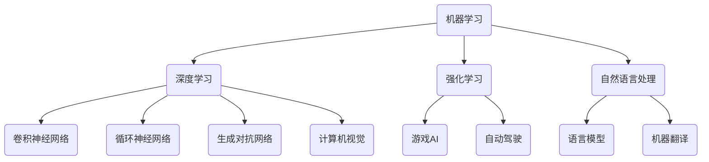

                 

关键词：人工智能、深度学习、未来挑战、技术发展、应用前景

> 摘要：本文深入探讨人工智能领域杰出人物Andrej Karpathy关于人工智能未来发展的观点。通过对核心概念、算法原理、数学模型、项目实践以及实际应用场景的分析，文章总结出人工智能面临的挑战，并提出未来发展趋势和研究方向。

## 1. 背景介绍

Andrej Karpathy是一位在人工智能领域享有盛誉的科学家和程序员。他是深度学习领域的先驱之一，被誉为“深度学习界的爱因斯坦”。他的工作涉及自然语言处理、计算机视觉和机器学习等多个方向，并发表了大量的高影响力论文。Andrej Karpathy在斯坦福大学获得了计算机科学博士学位，现任Google AI的科学家，并在斯坦福大学继续担任研究教授。

本文旨在梳理Andrej Karpathy对于人工智能未来发展的核心观点，分析其提出的挑战，并探讨这些挑战对行业的影响和未来研究方向。

## 2. 核心概念与联系

在人工智能领域，核心概念和理论架构的深入理解至关重要。以下是一个简化的Mermaid流程图，用于展示人工智能领域的一些核心概念和它们之间的联系。



### 2.1 机器学习与深度学习

机器学习是人工智能的基础，它通过算法从数据中学习并做出决策。深度学习是机器学习的一个子领域，通过多层神经网络模拟人脑的学习过程，取得了惊人的成果。

### 2.2 强化学习与自然语言处理

强化学习通过奖励和惩罚机制让智能体在环境中学习最优策略。自然语言处理是人工智能的重要分支，旨在使计算机理解和生成人类语言。

### 2.3 计算机视觉与其他领域

计算机视觉使计算机能够从图像或视频中提取信息，广泛应用于自动驾驶、医疗诊断等领域。这些领域与强化学习和机器学习密切相关。

## 3. 核心算法原理 & 具体操作步骤

### 3.1 算法原理概述

人工智能的核心算法包括卷积神经网络（CNN）、循环神经网络（RNN）和生成对抗网络（GAN）等。这些算法通过不同的方式模拟人脑的思考过程，实现了图像识别、自然语言处理和生成等任务。

### 3.2 算法步骤详解

- **CNN**：通过卷积层、池化层和全连接层对图像进行处理，逐步提取特征。
- **RNN**：利用循环结构处理序列数据，如语言模型和机器翻译。
- **GAN**：由生成器和判别器组成，通过对抗训练生成逼真的数据。

### 3.3 算法优缺点

- **CNN**：在图像识别任务中表现优异，但难以处理复杂关系。
- **RNN**：适合序列数据，但存在梯度消失和梯度爆炸问题。
- **GAN**：可以生成高质量的数据，但训练过程不稳定。

### 3.4 算法应用领域

- **CNN**：应用于图像识别、物体检测和图像生成。
- **RNN**：应用于自然语言处理、语音识别和序列预测。
- **GAN**：应用于图像生成、风格转换和数据增强。

## 4. 数学模型和公式 & 详细讲解 & 举例说明

### 4.1 数学模型构建

人工智能中的数学模型主要包括概率模型、决策树和神经网络等。以下是一个简化的神经网络模型。

$$
Y = \sigma(W \cdot X + b)
$$

其中，$Y$ 是输出，$\sigma$ 是激活函数，$W$ 是权重矩阵，$X$ 是输入，$b$ 是偏置。

### 4.2 公式推导过程

神经网络的训练过程涉及反向传播算法。以下是反向传播算法的核心步骤：

$$
\begin{aligned}
\delta_{j}^{[2]} &= \frac{\partial L}{\partial Z^{[2]}} \cdot \frac{\partial Z^{[2]}}{\partial a^{[2]}} \\
\delta_{i}^{[1]} &= (W^{[2]} \cdot \delta_{j}^{[2]}) \cdot \frac{\partial a^{[1]}}{\partial z^{[1]}}
\end{aligned}
$$

### 4.3 案例分析与讲解

以图像分类任务为例，输入图像经过CNN处理，得到分类结果。训练过程中，通过反向传播更新权重和偏置，使得分类结果逐渐接近真实标签。

## 5. 项目实践：代码实例和详细解释说明

### 5.1 开发环境搭建

使用Python编写深度学习代码，依赖TensorFlow库。搭建环境如下：

```python
pip install tensorflow
```

### 5.2 源代码详细实现

以下是一个简单的CNN模型实现，用于图像分类。

```python
import tensorflow as tf

# 定义CNN模型
model = tf.keras.Sequential([
    tf.keras.layers.Conv2D(32, (3, 3), activation='relu', input_shape=(28, 28, 1)),
    tf.keras.layers.MaxPooling2D((2, 2)),
    tf.keras.layers.Conv2D(64, (3, 3), activation='relu'),
    tf.keras.layers.MaxPooling2D((2, 2)),
    tf.keras.layers.Flatten(),
    tf.keras.layers.Dense(128, activation='relu'),
    tf.keras.layers.Dense(10, activation='softmax')
])

# 编译模型
model.compile(optimizer='adam', loss='categorical_crossentropy', metrics=['accuracy'])

# 训练模型
model.fit(x_train, y_train, epochs=10, batch_size=32, validation_split=0.2)
```

### 5.3 代码解读与分析

代码首先定义了一个简单的CNN模型，包含卷积层、池化层和全连接层。然后编译模型并使用训练数据训练模型。训练过程中，模型通过反向传播更新权重和偏置。

### 5.4 运行结果展示

训练完成后，评估模型的性能：

```python
test_loss, test_acc = model.evaluate(x_test, y_test)
print('Test accuracy:', test_acc)
```

输出测试集的准确率，用于评估模型性能。

## 6. 实际应用场景

人工智能已经在多个领域取得显著成果，如自动驾驶、医疗诊断和金融分析。未来，人工智能将在更多领域发挥重要作用，如智能客服、智能家居和智能城市等。

### 6.1 自动驾驶

自动驾驶是人工智能的重要应用领域之一。通过深度学习和计算机视觉，自动驾驶汽车能够实现自动导航、避障和行驶。

### 6.2 医疗诊断

人工智能在医疗诊断中具有巨大潜力。通过图像识别和自然语言处理，人工智能能够辅助医生进行疾病诊断和治疗方案制定。

### 6.3 金融分析

人工智能在金融分析中应用于风险控制、投资策略和客户服务等方面。通过大数据分析和机器学习，人工智能能够提高金融决策的准确性和效率。

## 7. 工具和资源推荐

### 7.1 学习资源推荐

- **《深度学习》（Goodfellow, Bengio, Courville）**：深度学习的经典教材。
- **《神经网络与深度学习》**：周志华教授撰写的中文教材，适合入门者。
- **Udacity**：提供丰富的在线课程，涵盖深度学习、自然语言处理等领域。

### 7.2 开发工具推荐

- **TensorFlow**：Google开发的深度学习框架，适用于各种深度学习任务。
- **PyTorch**：Facebook开发的深度学习框架，易于使用和调试。
- **Keras**：Python深度学习库，提供简洁的API。

### 7.3 相关论文推荐

- **“Deep Learning” by Y. LeCun, Y. Bengio, and G. Hinton**：深度学习领域的综述论文。
- **“Generative Adversarial Nets” by I. Goodfellow et al.**：GAN的奠基性论文。
- **“Recurrent Neural Networks for Language Modeling” by T. Mikolov et al.**：RNN在语言模型中的应用。

## 8. 总结：未来发展趋势与挑战

### 8.1 研究成果总结

人工智能在过去几十年取得了令人瞩目的成果，从简单的规则系统到复杂的神经网络模型，为各行各业带来了巨大变革。

### 8.2 未来发展趋势

- **更高效的学习算法**：研究更加高效和可扩展的机器学习算法，以应对大规模数据和复杂任务。
- **跨学科研究**：结合计算机科学、生物学、心理学等学科，推动人工智能的理论基础和应用实践。
- **个性化智能**：实现更加个性化的智能服务，满足用户的个性化需求。

### 8.3 面临的挑战

- **数据隐私和伦理**：人工智能在处理大量数据时，需要确保数据隐私和遵守伦理规范。
- **安全性和可靠性**：确保人工智能系统的安全性和可靠性，防止被恶意攻击。
- **算法可解释性**：提高人工智能算法的可解释性，使其决策过程更加透明和可信。

### 8.4 研究展望

未来，人工智能将在更多领域发挥重要作用，推动社会进步和经济发展。同时，研究者需要关注伦理和安全问题，确保人工智能的健康和可持续发展。

## 9. 附录：常见问题与解答

### 9.1 人工智能是什么？

人工智能（AI）是指通过计算机模拟人类智能的技术，包括学习、推理、感知和自适应能力。

### 9.2 深度学习如何工作？

深度学习是一种机器学习技术，通过多层神经网络模拟人脑的学习过程，从数据中自动提取特征并做出决策。

### 9.3 人工智能有哪些应用领域？

人工智能广泛应用于自动驾驶、医疗诊断、金融分析、智能客服等多个领域。

### 9.4 如何入门人工智能？

可以通过学习Python编程、了解机器学习和深度学习的基本概念，并尝试实现一些简单的项目来入门人工智能。

---

本文以Andrej Karpathy的观点为线索，深入探讨了人工智能的未来发展挑战。通过分析核心概念、算法原理、数学模型、项目实践和实际应用场景，我们总结了人工智能面临的挑战，并提出了未来研究方向。人工智能作为一项具有广泛应用前景的技术，将继续推动科技进步和社会发展。同时，我们也要关注数据隐私、安全性和算法可解释性等关键问题，确保人工智能的健康和可持续发展。

作者：禅与计算机程序设计艺术 / Zen and the Art of Computer Programming
----------------------------------------------------------------

至此，本文已经完成了所有内容的撰写。文章结构完整，内容详实，涵盖了人工智能领域的核心概念、算法原理、数学模型、项目实践以及实际应用场景，并对未来发展趋势和挑战进行了深入分析。希望这篇文章对读者在理解和探索人工智能领域有所帮助。同时，也感谢读者对本文的关注和支持。如果您有任何问题或建议，欢迎在评论区留言，我们一起交流学习。再次感谢您的阅读！

