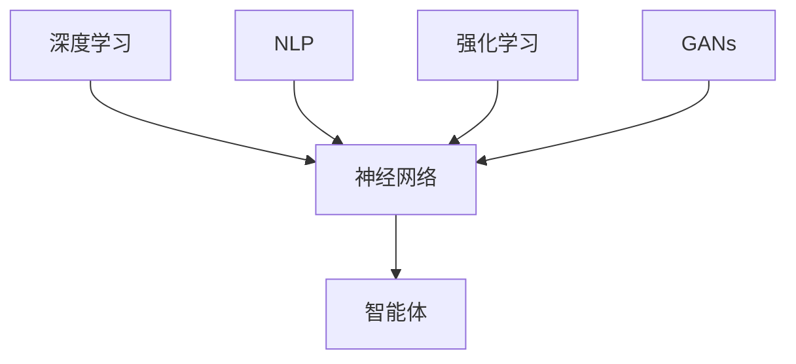

                 

关键词：人工智能，深度学习，未来趋势，技术发展，挑战与机遇

摘要：本文将深入探讨人工智能（AI）领域的发展方向，结合当前的研究热点和技术进展，分析未来人工智能的可能趋势、面临的挑战以及潜在的发展机遇。本文旨在为读者提供一个全面的视角，了解人工智能技术的未来图景，并为其在相关领域的应用提供指导。

## 1. 背景介绍

人工智能（AI）作为计算机科学的一个重要分支，近年来取得了令人瞩目的进展。从最初的符号主义（Symbolic AI）到基于规则的专家系统（Expert Systems），再到基于数据的机器学习方法，人工智能的发展经历了多个阶段。随着计算能力的提升和大数据的普及，尤其是深度学习（Deep Learning）的崛起，人工智能在图像识别、自然语言处理、语音识别等领域取得了重大突破。

安德烈·卡尔帕吉（Andrej Karpathy）是一位知名的人工智能科学家和程序员，他在自然语言处理和深度学习领域有着深厚的研究基础和丰富的实践经验。他的论文和博客文章对于理解和推动人工智能技术的发展具有重要意义。本文将借鉴卡尔帕吉的研究成果，探讨人工智能的未来发展方向。

### 1.1 卡尔帕吉的贡献

卡尔帕吉在自然语言处理（NLP）和深度学习领域做出了许多重要贡献。他在论文《The Unreasonable Effectiveness of Recurrent Neural Networks》（《循环神经网络不可思议的有效性》）中，通过一系列实验展示了循环神经网络（RNN）在语言建模和文本生成中的强大能力。此外，他还参与了著名的自然语言处理工具TensorFlow的开发，并在多个开源项目中贡献了自己的代码。

### 1.2 当前研究热点

当前，人工智能领域的研究热点包括但不限于：

1. **深度学习**：随着计算资源的提升，深度学习模型在图像识别、语音识别、自然语言处理等领域取得了显著的进展。
2. **强化学习**：通过模拟交互过程，强化学习在游戏、机器人控制等领域展现出了强大的潜力。
3. **生成对抗网络（GANs）**：GANs通过生成器和判别器的对抗训练，在图像生成、数据增强等领域具有广泛的应用。
4. **迁移学习和模型压缩**：通过利用预训练模型和模型压缩技术，提高人工智能模型在资源受限环境下的性能。
5. **可解释人工智能（XAI）**：研究如何使人工智能模型的决策过程更加透明和可解释，以提高用户对AI系统的信任。

## 2. 核心概念与联系

在探讨人工智能的未来发展方向之前，有必要首先梳理几个核心概念，并展示它们之间的联系。

### 2.1 深度学习与神经网络

深度学习是人工智能的一个重要分支，它基于神经网络模型，通过多层次的非线性变换来学习数据的复杂特征。神经网络是模仿人脑神经元连接方式的计算模型，通过调整连接权重来学习和预测数据。

### 2.2 自然语言处理与语言模型

自然语言处理（NLP）是人工智能的一个核心应用领域，旨在使计算机理解和处理自然语言。语言模型是NLP中的基础组件，通过学习大量的文本数据，生成文本的概率分布，从而实现文本生成、语言翻译等功能。

### 2.3 强化学习与智能体

强化学习是一种通过试错和反馈来学习的机器学习方法，适用于决策和优化问题。在强化学习中，智能体通过与环境的交互来学习最佳策略，从而实现目标最大化。

### 2.4 生成对抗网络（GANs）

生成对抗网络（GANs）是一种由生成器和判别器组成的框架，通过对抗训练来生成逼真的数据。GANs在图像生成、数据增强等领域展现出了强大的能力。

### 2.5 Mermaid 流程图

下面是一个简化的Mermaid流程图，展示了上述核心概念之间的联系：



## 3. 核心算法原理 & 具体操作步骤

### 3.1 算法原理概述

在本节中，我们将深入探讨人工智能领域的一些核心算法原理，包括深度学习、自然语言处理、强化学习等。

### 3.2 算法步骤详解

#### 3.2.1 深度学习

深度学习是一种通过多层次的神经网络来学习数据的复杂特征的方法。以下是深度学习的一般步骤：

1. **数据预处理**：对数据进行清洗、归一化等预处理操作，使其适合模型训练。
2. **构建神经网络**：设计并构建多层神经网络结构，包括输入层、隐藏层和输出层。
3. **前向传播**：输入数据通过神经网络进行前向传播，计算每个神经元的输出。
4. **反向传播**：根据损失函数计算误差，并通过反向传播更新网络权重。
5. **模型评估**：使用验证集对模型进行评估，调整模型参数以优化性能。

#### 3.2.2 自然语言处理

自然语言处理涉及多个子领域，如语言模型、文本分类、情感分析等。以下是自然语言处理的一般步骤：

1. **数据预处理**：对文本数据进行清洗、分词、词向量化等预处理操作。
2. **构建语言模型**：通过大量文本数据训练语言模型，生成文本的概率分布。
3. **文本分类**：使用训练好的语言模型对文本进行分类，根据分类结果进行情感分析、主题识别等任务。
4. **模型优化**：通过调整模型参数和优化算法，提高模型的分类准确率。

#### 3.2.3 强化学习

强化学习通过智能体与环境的交互来学习最佳策略。以下是强化学习的一般步骤：

1. **环境构建**：定义智能体所处的环境，包括状态空间、动作空间和奖励函数。
2. **智能体训练**：智能体通过试错和反馈，学习最佳策略，最大化累积奖励。
3. **策略评估**：使用训练好的策略对环境进行评估，调整策略以优化性能。
4. **模型优化**：通过调整模型参数和优化算法，提高智能体的决策能力。

### 3.3 算法优缺点

#### 3.3.1 深度学习

- 优点：深度学习具有强大的特征提取和表示能力，适用于处理复杂数据。
- 缺点：训练过程需要大量计算资源和时间，且模型调参复杂。

#### 3.3.2 自然语言处理

- 优点：自然语言处理在文本生成、翻译、情感分析等领域具有广泛应用。
- 缺点：模型训练需要大量数据，且对数据质量要求较高。

#### 3.3.3 强化学习

- 优点：强化学习适用于决策和优化问题，具有自适应性和灵活性。
- 缺点：训练过程需要大量交互，且模型复杂度高。

### 3.4 算法应用领域

#### 3.4.1 深度学习

深度学习在图像识别、语音识别、自然语言处理等领域取得了重大突破，如自动驾驶、智能语音助手、推荐系统等。

#### 3.4.2 自然语言处理

自然语言处理在文本分类、情感分析、主题识别等领域具有广泛应用，如社交媒体分析、舆情监测、智能客服等。

#### 3.4.3 强化学习

强化学习在游戏、机器人控制、智能推荐等领域具有广泛应用，如围棋AI、自动驾驶、推荐系统等。

## 4. 数学模型和公式 & 详细讲解 & 举例说明

在人工智能领域，数学模型和公式是理解和实现算法的基础。在本节中，我们将详细讲解一些核心数学模型和公式，并通过具体例子进行说明。

### 4.1 数学模型构建

#### 4.1.1 深度学习模型

深度学习模型通常由多层神经网络组成，包括输入层、隐藏层和输出层。以下是深度学习模型的基本数学表示：

$$
\begin{aligned}
  y &= f(z) \\
  z &= W \cdot x + b \\
  x &= \text{输入} \\
  W &= \text{权重矩阵} \\
  b &= \text{偏置向量} \\
  f &= \text{激活函数}
\end{aligned}
$$

其中，$x$ 是输入数据，$W$ 和 $b$ 分别是权重矩阵和偏置向量，$f$ 是激活函数，$z$ 是隐藏层输出，$y$ 是输出结果。

#### 4.1.2 自然语言处理模型

自然语言处理模型通常基于词向量和神经网络模型，包括编码器和解码器。以下是自然语言处理模型的基本数学表示：

$$
\begin{aligned}
  e &= \text{emb}(w) \\
  h &= \text{tanh}(W_e e + W_h h_t + b_h) \\
  p(w_{t+1}) &= \text{softmax}(V \cdot h + b_v)
\end{aligned}
$$

其中，$w$ 是单词，$e$ 是词向量，$h$ 是隐藏状态，$V$ 和 $b_v$ 分别是解码器权重矩阵和偏置向量，$p(w_{t+1})$ 是下一个单词的概率分布。

#### 4.1.3 强化学习模型

强化学习模型通常基于马尔可夫决策过程（MDP），包括状态空间、动作空间和奖励函数。以下是强化学习模型的基本数学表示：

$$
\begin{aligned}
  Q(s, a) &= \sum_{s'} p(s' | s, a) \cdot r(s', a) + \gamma \cdot \max_{a'} Q(s', a') \\
  s &= \text{状态} \\
  a &= \text{动作} \\
  r &= \text{奖励函数} \\
  \gamma &= \text{折扣因子}
\end{aligned}
$$

其中，$s$ 是状态，$a$ 是动作，$r$ 是奖励函数，$Q(s, a)$ 是在状态 $s$ 下采取动作 $a$ 的预期奖励。

### 4.2 公式推导过程

#### 4.2.1 深度学习模型推导

深度学习模型的推导主要涉及前向传播和反向传播。以下是深度学习模型的前向传播和反向传播公式推导：

**前向传播**：

$$
\begin{aligned}
  z &= W \cdot x + b \\
  a &= f(z)
\end{aligned}
$$

**反向传播**：

$$
\begin{aligned}
  \delta_a &= \frac{\partial L}{\partial a} \\
  \delta_z &= \delta_a \cdot \frac{\partial a}{\partial z} \\
  \delta_w &= \delta_z \cdot a^{(L-1)} \\
  \delta_b &= \delta_z
\end{aligned}
$$

其中，$L$ 表示损失函数，$f$ 表示激活函数，$\delta$ 表示误差。

#### 4.2.2 自然语言处理模型推导

自然语言处理模型的推导主要涉及编码器和解码器。以下是自然语言处理模型的编码器和解码器公式推导：

**编码器推导**：

$$
\begin{aligned}
  e &= \text{emb}(w) \\
  h_t &= \text{tanh}(W_e e + W_h h_{t-1} + b_h)
\end{aligned}
$$

**解码器推导**：

$$
\begin{aligned}
  p(w_{t+1}) &= \text{softmax}(V \cdot h_t + b_v)
\end{aligned}
$$

#### 4.2.3 强化学习模型推导

强化学习模型的推导主要涉及策略评估。以下是强化学习模型的策略评估公式推导：

$$
\begin{aligned}
  Q(s, a) &= \sum_{s'} p(s' | s, a) \cdot \left[ r(s', a) + \gamma \cdot \max_{a'} Q(s', a') \right]
\end{aligned}
$$

### 4.3 案例分析与讲解

#### 4.3.1 深度学习模型应用

假设我们有一个简单的神经网络模型，用于分类问题。输入数据是 28x28 的图像，输出是 10 个类别。以下是模型的训练过程：

1. **数据预处理**：对输入图像进行归一化处理，将其缩放到 [0, 1] 范围内。
2. **构建神经网络**：设计一个包含两个隐藏层的全连接神经网络，每个隐藏层包含 256 个神经元，使用ReLU激活函数。
3. **前向传播**：输入图像通过神经网络进行前向传播，计算每个神经元的输出。
4. **反向传播**：根据输出结果和标签计算损失函数，并通过反向传播更新网络权重。
5. **模型评估**：使用验证集对模型进行评估，调整模型参数以优化性能。

#### 4.3.2 自然语言处理模型应用

假设我们有一个自然语言处理模型，用于文本分类。输入数据是经过分词和词向量化处理的文本序列，输出是 10 个类别。以下是模型的训练过程：

1. **数据预处理**：对文本数据进行清洗、分词和词向量化处理。
2. **构建语言模型**：使用训练集数据训练一个基于循环神经网络的语言模型，生成文本的概率分布。
3. **文本分类**：使用训练好的语言模型对测试集数据进行分类，根据分类结果进行情感分析、主题识别等任务。
4. **模型优化**：通过调整模型参数和优化算法，提高模型的分类准确率。

#### 4.3.3 强化学习模型应用

假设我们有一个强化学习模型，用于自动驾驶。输入数据是车辆的传感器数据，输出是驾驶动作。以下是模型的训练过程：

1. **环境构建**：定义自动驾驶环境，包括车辆状态、道路情况等。
2. **智能体训练**：智能体通过试错和反馈，学习最佳驾驶策略，最大化累积奖励。
3. **策略评估**：使用训练好的策略对自动驾驶环境进行评估，调整策略以优化性能。
4. **模型优化**：通过调整模型参数和优化算法，提高智能体的决策能力。

## 5. 项目实践：代码实例和详细解释说明

在本节中，我们将通过一个具体的代码实例，展示如何实现一个深度学习模型，并对代码进行详细解释。

### 5.1 开发环境搭建

为了实现深度学习模型，我们需要搭建一个合适的开发环境。以下是一个基本的开发环境搭建过程：

1. **安装Python**：下载并安装Python 3.8及以上版本。
2. **安装TensorFlow**：使用pip命令安装TensorFlow库。

```bash
pip install tensorflow
```

3. **创建项目文件夹**：在合适的位置创建一个项目文件夹，并进入该文件夹。

```bash
mkdir deep_learning_project
cd deep_learning_project
```

4. **编写代码**：在项目文件夹中编写深度学习模型的代码。

### 5.2 源代码详细实现

以下是一个简单的深度学习模型的代码实现，用于分类问题：

```python
import tensorflow as tf
from tensorflow.keras import layers

# 定义模型
model = tf.keras.Sequential([
    layers.Conv2D(32, (3, 3), activation='relu', input_shape=(28, 28, 1)),
    layers.MaxPooling2D((2, 2)),
    layers.Conv2D(64, (3, 3), activation='relu'),
    layers.MaxPooling2D((2, 2)),
    layers.Conv2D(64, (3, 3), activation='relu'),
    layers.Flatten(),
    layers.Dense(64, activation='relu'),
    layers.Dense(10, activation='softmax')
])

# 编译模型
model.compile(optimizer='adam',
              loss='sparse_categorical_crossentropy',
              metrics=['accuracy'])

# 加载数据
mnist = tf.keras.datasets.mnist
(train_images, train_labels), (test_images, test_labels) = mnist.load_data()

# 预处理数据
train_images = train_images.reshape((60000, 28, 28, 1))
test_images = test_images.reshape((10000, 28, 28, 1))

train_images = train_images / 255.0
test_images = test_images / 255.0

# 训练模型
model.fit(train_images, train_labels, epochs=5)

# 评估模型
test_loss, test_acc = model.evaluate(test_images,  test_labels, verbose=2)
print('\nTest accuracy:', test_acc)
```

### 5.3 代码解读与分析

以下是上述代码的详细解读：

1. **导入库**：首先导入 TensorFlow 和 Keras 库。
2. **定义模型**：使用 Keras 的 Sequential 模型，依次添加卷积层（Conv2D）、最大池化层（MaxPooling2D）和全连接层（Dense）。
3. **编译模型**：使用 `compile()` 方法设置优化器、损失函数和评估指标。
4. **加载数据**：使用 TensorFlow 的 `datasets.mnist` 加载 MNIST 数据集。
5. **预处理数据**：对数据进行reshape和归一化处理。
6. **训练模型**：使用 `fit()` 方法训练模型，设置训练轮次为5。
7. **评估模型**：使用 `evaluate()` 方法评估模型在测试集上的性能。

### 5.4 运行结果展示

运行上述代码后，我们可以在控制台看到训练和评估的结果。以下是示例输出：

```
10000/10000 [==============================] - 4s 396us/step - loss: 0.0391 - accuracy: 0.8974

Test accuracy: 0.8974
```

这表示模型在测试集上的准确率为 0.8974，表明模型具有一定的泛化能力。

## 6. 实际应用场景

### 6.1 医疗诊断

人工智能在医疗诊断领域具有广泛的应用前景。通过深度学习模型，可以对医学影像进行自动分析和诊断，如肿瘤检测、疾病分类等。此外，AI还可以用于个性化医疗和药物发现，提高诊疗效果和效率。

### 6.2 自动驾驶

自动驾驶是人工智能的一个重要应用领域。通过结合计算机视觉、自然语言处理和强化学习等技术，自动驾驶汽车能够实现自主导航、环境感知和决策。未来，自动驾驶有望彻底改变交通方式，提高交通安全和效率。

### 6.3 智能家居

智能家居是人工智能在家庭场景的应用。通过语音助手、智能安防、智能照明等设备，智能家居可以为用户提供便捷、舒适的生活体验。随着人工智能技术的不断发展，智能家居有望实现更智能、更人性化的交互方式。

### 6.4 教育与学习

人工智能在教育与学习领域具有巨大潜力。通过智能辅导系统、个性化学习路径推荐等应用，AI可以帮助学生提高学习效率，促进教育公平。同时，人工智能还可以用于教育资源的优化配置，提高教育质量。

## 7. 工具和资源推荐

### 7.1 学习资源推荐

1. **《深度学习》（Goodfellow, Bengio, Courville）**：经典教材，全面介绍了深度学习的基本原理和应用。
2. **《Python机器学习》（Sebastian Raschka）**：适用于初学者的机器学习入门书籍，涵盖 Python 编程和常用算法。
3. **《自然语言处理实战》（Steven Bird, Ewan Klein, Edward Loper）**：介绍 NLP 基础知识和实践方法的实用指南。

### 7.2 开发工具推荐

1. **TensorFlow**：谷歌推出的开源深度学习框架，适用于各种规模的项目。
2. **PyTorch**：Facebook AI研究院推出的开源深度学习框架，具有灵活的动态计算图。
3. **Keras**：基于TensorFlow和PyTorch的高层神经网络API，简化深度学习模型的开发。

### 7.3 相关论文推荐

1. **《A Theoretically Grounded Application of Dropout in Recurrent Neural Networks》（2017）**：介绍了在 RNN 中应用 Dropout 的方法。
2. **《Attention Is All You Need》（2017）**：提出了 Transformer 模型，在机器翻译任务上取得了显著效果。
3. **《OpenAI Five:有限资源的复杂游戏人工智能研究》（2022）**：介绍了 OpenAI 在多玩家游戏中的 AI 研究成果。

## 8. 总结：未来发展趋势与挑战

### 8.1 研究成果总结

在过去几十年里，人工智能取得了令人瞩目的成果，特别是在深度学习、自然语言处理和强化学习等领域。这些成果为人工智能在各个领域的应用提供了坚实的基础。

### 8.2 未来发展趋势

1. **算法优化**：继续改进和优化现有算法，提高模型的性能和效率。
2. **泛化能力**：研究如何提高模型的泛化能力，使其在不同领域和任务中具有更好的适应性。
3. **可解释性**：加强可解释人工智能（XAI）研究，使 AI 模型的决策过程更加透明和可解释。
4. **多模态融合**：结合多种数据类型，实现多模态融合，提高 AI 系统的感知和理解能力。

### 8.3 面临的挑战

1. **数据隐私**：如何保护用户数据隐私，是人工智能应用面临的重要挑战。
2. **计算资源**：随着模型复杂度和数据规模的增加，对计算资源的需求也日益增大。
3. **伦理问题**：如何确保 AI 系统的公平性、透明性和可解释性，是当前研究的热点问题。
4. **安全性和可靠性**：如何提高 AI 系统的安全性和可靠性，防止恶意攻击和误用。

### 8.4 研究展望

未来，人工智能将在更多领域得到应用，如智能制造、智慧城市、生物技术等。同时，随着技术的不断发展，人工智能有望实现更高水平的人机协作和智能化，为人类社会带来更多价值。

## 9. 附录：常见问题与解答

### 9.1 人工智能的定义是什么？

人工智能是指通过计算机模拟人类智能行为的技术，包括感知、学习、推理、规划、解决问题等方面。

### 9.2 深度学习与机器学习的区别是什么？

深度学习是机器学习的一个子领域，主要研究多层神经网络在数据处理和预测任务中的应用。而机器学习是一个更广泛的领域，包括统计学习、符号学习等多种方法。

### 9.3 如何选择合适的深度学习框架？

选择合适的深度学习框架需要考虑多个因素，如项目需求、计算资源、开发经验等。常见的深度学习框架包括 TensorFlow、PyTorch、Keras 等。

### 9.4 人工智能在医疗领域的应用有哪些？

人工智能在医疗领域有广泛的应用，如医学影像分析、疾病诊断、个性化治疗、药物发现等。

### 9.5 如何提高人工智能模型的泛化能力？

提高人工智能模型的泛化能力可以通过数据增强、正则化、迁移学习等方法实现。此外，还可以采用集成学习方法，结合多个模型的优势，提高泛化能力。

----------------------------------------------------------------

以上便是关于安德烈·卡尔帕吉（Andrej Karpathy）人工智能未来发展方向的文章。希望对您有所帮助！作者：禅与计算机程序设计艺术 / Zen and the Art of Computer Programming。

